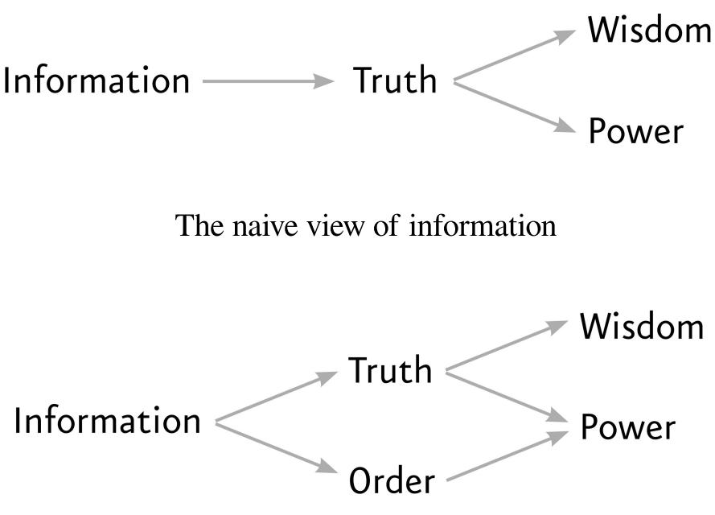

# CHAPTER 2

# Stories: Unlimited Connections

W e Sapiens rule the world not because we are so wise but because we are the only animals that can cooperate flexibly in large numbers. I have explored this idea in my previous books Sapiens and Homo Deus, but a brief recap is inescapable.

The Sapiens' ability to cooperate flexibly in large numbers has precursors among other animals. Some social mammals like chimpanzees display significant flexibility in the way they cooperate, while some social insects like ants cooperate in very large numbers. But neither chimps nor ants establish empires, religions, or trade networks. Sapiens are capable of doing such things because we are far more flexible than chimps and can simultaneously cooperate in even larger numbers than ants. In fact, there is no upper limit to the number of Sapiens who can cooperate with one another. The Catholic Church has about 1.4 billion members. China has a population of about 1.4 billion. The global trade network connects about 8 billion Sapiens.

This is surprising given that humans cannot form long-term intimate bonds with more than a few hundred individuals. [\[1\]](#page-412-0) It takes many years and common experiences to get to know someone's unique character and history and to cultivate ties of mutual trust and affection. Consequently, if Sapiens networks were connected only by personal human-to-human bonds, our networks

would have remained very small. This is the situation among our chimpanzee cousins, for example. Their typical community numbers 20–60 members, and on rare occasions the number might increase to 150–200.[\[2\]](#page-412-1) This appears to have been the situation also among ancient human species like Neanderthals and archaic Homo sapiens. Each of their bands numbered a few dozen individuals, and different bands rarely cooperated. [\[3\]](#page-412-2)

About seventy thousand years ago, Homo sapiens bands began displaying an unprecedented capacity to cooperate with one another, as evidenced by the emergence of inter-band trade and artistic traditions and by the rapid spread of our species from our African homeland to the entire globe. What enabled different bands to cooperate is that evolutionary changes in brain structure and linguistic abilities apparently gave Sapiens the aptitude to tell and believe fictional stories and to be deeply moved by them. Instead of building a network from human-to-human chains alone—as the Neanderthals, for example, did—stories provided Homo sapiens with a new type of chain: human-to-story chains. In order to cooperate, Sapiens no longer had to know each other personally; they just had to know the same story. And the same story can be familiar to billions of individuals. A story can thereby serve like a central connector, with an unlimited number of outlets into which an unlimited number of people can plug. For example, the 1.4 billion members of the Catholic Church are connected by the Bible and other key Christian stories; the 1.4 billion citizens of China are connected by the stories of communist ideology and Chinese nationalism; and the 8 billion members of the global trade network are connected by stories about currencies, corporations, and brands.

Even charismatic leaders who have millions of followers are an example of this rule rather than an exception. It may seem that in the case of ancient Chinese emperors, medieval Catholic popes, or modern corporate titans it has been a single flesh-and-blood human—rather than a story—that has served as a nexus linking millions of followers. But, of course, in all these cases almost none of the followers has had a personal bond with the leader. Instead, what they have connected to has been a carefully crafted story about the leader, and it is in this story that they have put their faith.

Joseph Stalin, who stood at the nexus of one of the biggest personality cults in history, understood this well. When his troublesome son Vasily exploited his famous name to frighten and awe people, Stalin berated him. "But I'm a Stalin too," protested Vasily. "No, you're not," replied Stalin. "You're not Stalin and I'm not Stalin. Stalin is Soviet power. Stalin is what he is in the newspapers and the portraits, not you, no—not even me!"[\[4\]](#page-412-3)

Present-day influencers and celebrities would concur. Some have hundreds of millions of online followers, with whom they communicate daily through social media. But there is very little authentic personal connection there. The social media accounts are usually run by a team of experts, and every image and word is professionally crafted and curated to manufacture what is nowadays called a brand. [\[5\]](#page-412-4)

A "brand" is a specific type of story. To brand a product means to tell a story about that product, which may have little to do with the product's actual qualities but which consumers nevertheless learn to associate with the product. For example, over the decades the Coca-Cola corporation has invested tens of billions of dollars in advertisements that tell and retell the story of the Coca-Cola drink. [\[6\]](#page-412-5) People have seen and heard the story so often that many have come to associate a certain concoction of flavored water with fun, happiness, and youth (as opposed to tooth decay, obesity, and plastic waste). That's branding. [\[7\]](#page-413-0)

As Stalin knew, it is possible to brand not only products but also individuals. A corrupt billionaire can be branded as the champion of the poor; a bungling imbecile can be branded as an infallible genius; and a guru who sexually abuses his followers can be branded as a chaste saint. People think they connect to the person, but in fact they connect to the story told about the person, and there is often a huge gulf between the two.

Even the story of Cher Ami, the heroic pigeon, was partly the product of a branding campaign aimed at enhancing the public image of the U.S. Army's Pigeon Service. A 2021 revisionist study by the historian Frank Blazich found that though there is no doubt Cher Ami sustained severe injuries while transporting a message somewhere in Northern France, several key features of the story are doubtful or inaccurate. First, relying on contemporary

military records, Blazich demonstrated that headquarters learned about the exact location of the Lost Battalion about twenty minutes prior to the pigeon's arrival. It was not the pigeon that put a stop to the barrage of friendly fire decimating the Lost Battalion. Even more crucially, there is simply no proof that the pigeon carrying Major Whittlesey's message was Cher Ami. It might well have been another bird, while Cher Ami might have sustained his wounds a couple of weeks later, during an altogether different battle.

According to Blazich, the doubts and inconsistencies in Cher Ami's story were overshadowed by its propaganda value to the army and its appeal to the public. Over the years the story was retold so many times that facts became hopelessly enmeshed with fiction. Journalists, poets, and filmmakers added fanciful details to it, for example that the pigeon lost an eye as well as a leg and that it was awarded the Distinguished Service Cross. In the 1920s and 1930s Cher Ami became the most famous bird in the world. When he died, his carefully preserved corpse was placed on display at the Smithsonian's National Museum of American History, where it became a pilgrimage site for American patriots and World War I veterans. As the story grew in the telling, it took over even the recollections of survivors of the Lost Battalion, who came to accept the popular narrative at face value. Blazich recounts the case of Sherman Eager, an officer in the Lost Battalion, who decades after the war brought his children to see Cher Ami at the Smithsonian and told them, "You all owe your lives to that pigeon." Whatever the facts may be, the story of the self-sacrificing winged savior proved irresistible. [\[8\]](#page-413-1)

As a much more extreme example, consider Jesus. Two millennia of storytelling have encased Jesus within such a thick cocoon of stories that it is impossible to recover the historical person. Indeed, for millions of devout Christians, merely raising the possibility that the real person was different from the story is blasphemy. As far as we can tell, the real Jesus was a typical Jewish preacher who built a small following by giving sermons and healing the sick. After his death, however, Jesus became the subject of one of the most remarkable branding campaigns in history. This little-known provincial guru, who during his short career gathered just a handful of disciples and who was executed as a common criminal, was rebranded after death as the

incarnation of the cosmic god who created the universe. [\[9\]](#page-413-2) Though no contemporary portrait of Jesus has survived, and though the Bible never describes what he looked like, imaginary renderings of him have become some of the most recognizable icons in the world.

It should be stressed that the creation of the Jesus story was not a deliberate lie. People like Saint Paul, Tertullian, Saint Augustine, and Martin Luther didn't set out to deceive anyone. They projected their deeply felt hopes and feelings on the figure of Jesus, in the same way that all of us routinely project our feelings on our parents, lovers, and leaders. While branding campaigns are occasionally a cynical exercise of disinformation, most of the really big stories of history have been the result of emotional projections and wishful thinking. True believers play a key role in the rise of every major religion and ideology, and the Jesus story changed history because it gained an immense number of true believers.

By gaining all those believers, the story of Jesus managed to have a much bigger impact on history than the person of Jesus. The person of Jesus walked from village to village on his two feet, talking with people, eating and drinking with them, placing his hands on their sick bodies. He made a difference to the lives of perhaps several thousand individuals, all living in one minor Roman province. In contrast, the story of Jesus flew around the whole world, first on the wings of gossip, anecdote, and rumor; then via parchment texts, paintings, and statues; and eventually as blockbuster movies and internet memes. Billions of people not only heard the Jesus story but came to believe in it too, which created one of the biggest and most influential networks in the world.

Stories like the one about Jesus can be seen as a way of stretching preexisting biological bonds. Family is the strongest bond known to humans. One way that stories build trust between strangers is by making these strangers reimagine each other as family. The Jesus story presented Jesus as a parent figure for all humans, encouraged hundreds of millions of Christians to see each other as brothers and sisters, and created a shared pool of family memories. While most Christians were not physically present at the Last Supper, they have heard the story so many times, and they have seen so many

images of the event, that they "remember" it more vividly than they remember most of the family dinners in which they actually participated.

Interestingly, Jesus's last supper was the Jewish Passover meal, which according to the Gospel accounts Jesus shared with his disciples just before his crucifixion. In Jewish tradition, the whole purpose of the Passover meal is to create and reenact artificial memories. Every year Jewish families sit together on the eve of Passover to eat and reminisce about "their" exodus from Egypt. They are supposed not only to tell the story of how the descendants of Jacob escaped slavery in Egypt but to remember how they personally suffered at the hands of the Egyptians, how they personally saw the sea part, and how they personally received the Ten Commandments from Jehovah at Mount Sinai.

The Jewish tradition doesn't mince words here. The text of the Passover ritual (the Haggadah) insists that "in every generation a person is obligated to regard himself as if he personally had come out of Egypt." If anyone objects that this is a fiction, and that they didn't personally come out of Egypt, Jewish sages have a ready answer. They claim that the souls of all Jews throughout history were created by Jehovah long before they were born and all these souls were present at Mount Sinai. [\[10\]](#page-413-3) As Salvador Litvak, a Jewish social media influencer, explained to his online followers in 2018, "You and I were there together…. When we fulfill the obligation to see ourselves as if we personally left Egypt, it's not a metaphor. We don't imagine the Exodus, we remember it."[\[11\]](#page-413-4)

So every year, in the most important celebration of the Jewish calendar, millions of Jews put on a show that they remember things that they didn't witness and that probably never happened at all. As numerous modern studies indicate, repeatedly retelling a fake memory eventually causes the person to adopt it as a genuine recollection. [\[12\]](#page-413-5) When two Jews encounter each other for the first time, they can immediately feel that they both belong to the same family, that they were together as slaves in Egypt, and that they were together at Mount Sinai. That's a powerful bond that has sustained the Jewish network over many centuries and continents.

### INTERSUBJECTIVE ENTITIES

The Jewish Passover story builds a large network by taking existing biological kin bonds and stretching them. It creates an imagined family of millions. But there is an even more revolutionary way for stories to build networks. Like DNA, stories can create new entities. Indeed, stories can even create an entirely new level of reality. As far as we know, prior to the emergence of stories the universe contained just two levels of reality. Stories added a third.

The two levels of reality that preceded storytelling are objective reality and subjective reality. Objective reality consists of things like stones, mountains, and asteroids—things that exist whether we are aware of them or not. An asteroid hurtling toward planet Earth, for example, exists even if nobody knows it's out there. Then there is subjective reality: things like pain, pleasure, and love that aren't "out there" but rather "in here." Subjective things exist in our awareness of them. An unfelt ache is an oxymoron.

But some stories are able to create a third level of reality: intersubjective reality. Whereas subjective things like pain exist in a single mind, intersubjective things like laws, gods, nations, corporations, and currencies exist in the nexus between large numbers of minds. More specifically, they exist in the stories people tell one another. The information humans exchange about intersubjective things doesn't represent anything that had already existed prior to the exchange of information; rather, the exchange of information creates these things.

When I tell you that I am in pain, telling you about it doesn't create the pain. And if I stop talking about the pain, it doesn't make the pain go away. Similarly, when I tell you that I saw an asteroid, this doesn't create the asteroid. The asteroid exists whether people talk about it or not. But when lots of people tell one another stories about laws, gods, or currencies, this is what creates these laws, gods, or currencies. If people stop talking about them, they disappear. Intersubjective things exist in the exchange of information.

Let's take a closer look. The caloric value of pizza doesn't depend on our beliefs. A typical pizza contains between fifteen hundred and twenty-five

hundred calories. [\[13\]](#page-414-0) In contrast, the financial value of money—and pizzas depends entirely on our beliefs. How many pizzas can you purchase for a dollar, or for a bitcoin? In 2010, Laszlo Hanyecz bought two pizzas for 10,000 bitcoins. It was the first known commercial transaction involving bitcoin—and with hindsight, also the most expensive pizza ever. By November 2021, a single bitcoin was valued at more than \$69,000, so the bitcoins Hanyecz paid for his two pizzas were worth \$690 million, enough to purchase millions of pizzas. [\[14\]](#page-414-1) While the caloric value of pizza is an objective reality that remained the same between 2010 and 2021, the financial value of bitcoin is an intersubjective reality that changed dramatically during the same period, depending on the stories people told and believed about bitcoin.

Another example. Suppose I ask, "Does the Loch Ness Monster exist?" This is a question about the objective level of reality. Some people believe that dinosaur-like animals really do inhabit Loch Ness. Others dismiss the idea as a fantasy or a hoax. Over the years, many attempts have been made to resolve the disagreement once and for all, using scientific methods such as sonar scans and DNA surveys. If huge animals live in the lake, they should appear on sonar, and they should leave DNA traces. Based on the available evidence, the scientific consensus is that the Loch Ness Monster does not exist. (A DNA survey conducted in 2019 found genetic material from three thousand species, but no monster. At most, Loch Ness may contain some fivekilo eels. [\[15\]](#page-414-2)) Many people may nevertheless continue to believe that the Loch Ness Monster exists, but believing it doesn't change objective reality.

In contrast to animals, whose existence can be verified or disproved through objective tests, states are intersubjective entities. We normally don't notice it, because everybody takes the existence of the United States, China, Russia, or Brazil for granted. But there are cases when people disagree about the existence of certain states, and then their intersubjective status emerges. The Israeli-Palestinian conflict, for example, revolves around this matter, because some people and governments refuse to acknowledge the existence of Israel and others refuse to acknowledge the existence of Palestine. As of 2024, the governments of Brazil and China, for example, say that both Israel

and Palestine exist; the governments of the United States and Cameroon recognize only Israel's existence; whereas the governments of Algeria and Iran recognize only Palestine. Other cases range from Kosovo, which as of 2024 is recognized as a state by around half of the 193 UN members, [\[16\]](#page-414-3) to Abkhazia, which almost all governments see as a sovereign territory of Georgia, but which is recognized as a state by Russia, Venezuela, Nicaragua, Nauru, and Syria. [\[17\]](#page-414-4)

Indeed, almost all states pass at least temporarily through a phase during which their existence is contested, when struggling for independence. Did the United States come into existence on July 4, 1776, or only when other states like France and finally the U.K. recognized it? Between the declaration of U.S. independence on July 4, 1776, and the signing of the Treaty of Paris on September 3, 1783, some people like George Washington believed the United States existed, while other people like King George III vehemently rejected this idea.

Disagreements about the existence of states cannot be resolved by an objective test, such as a DNA survey or a sonar scan. Unlike animals, states are not an objective reality. When we ask whether a particular state exists, we are raising a question about intersubjective reality. If enough people agree that a particular state exists, then it does. It can then do things like sign legally binding agreements with other states as well as NGOs and private corporations.

Of all genres of stories, those that create intersubjective realities have been the most crucial for the development of large-scale human networks. Implanting fake family memories is certainly helpful, but no religions or empires managed to survive for long without a strong belief in the existence of a god, a nation, a law code, or a currency. For the formation of the Christian Church, for example, it was important that people recollect what Jesus said at the Last Supper, but the crucial step was making people believe that Jesus was a god rather than just an inspiring rabbi. For the formation of the Jewish religion, it was helpful that Jews "remembered" how they together escaped slavery in Egypt, but the really decisive step was making all Jews adhere to the same religious law code, the Halakha.

Intersubjective things like laws, gods, and currencies are extremely powerful within a particular information network and utterly meaningless outside it. Suppose a billionaire crashes his private jet on a desert island and finds himself alone with a suitcase full of banknotes and bonds. When he was in São Paulo or Mumbai, he could use these papers to make people feed him, clothe him, protect him, and build him a private jet. But once he is cut off from other members of our information network, his banknotes and bonds immediately become worthless. He cannot use them to get the island's monkeys to provide him with food or to build him a raft.

#### THE POWER OF STORIES

Whether through implanting fake memories, forming fictional relationships, or creating intersubjective realities, stories produced large-scale human networks. These networks in turn completely changed the balance of power in the world. Story-based networks made Homo sapiens the most powerful of all animals, giving it a crucial edge not only over lions and mammoths but also over other ancient human species like Neanderthals.

Neanderthals lived in small isolated bands, and to the best of our knowledge different bands cooperated with one another only rarely and weakly, if at all. [\[18\]](#page-414-5) Stone Age Sapiens too lived in small bands of a few dozen individuals. But following the emergence of storytelling, Sapiens bands no longer lived in isolation. Bands were connected by stories about things like revered ancestors, totem animals, and guardian spirits. Bands that shared stories and intersubjective realities constituted a tribe. Each tribe was a network connecting hundreds or even thousands of individuals. [\[19\]](#page-415-0)

Belonging to a large tribe had an obvious advantage in times of conflict. Five hundred Sapiens could easily defeat fifty Neanderthals. [\[20\]](#page-415-1) But tribal networks had many additional advantages. If we live in an isolated band of fifty people and a severe drought hits our home territory, many of us might starve to death. If we try to migrate elsewhere, we are likely to encounter hostile groups, and we might also find it difficult to forage for food, water, and

flint (to make tools) in unfamiliar territory. However, if our band is part of a tribal network, in times of need at least some of us could go live with our distant friends. If our shared tribal identity is strong enough, they would welcome us and teach us about the local dangers and opportunities. A decade or two later, we might reciprocate. The tribal network, then, acted like an insurance policy. It minimized risk by spreading it across a lot more people. [\[21\]](#page-415-2)

Even in quiet times Sapiens could benefit enormously from exchanging information not just with a few dozen members of a small band but with an entire tribal network. If one of the tribe's bands discovered a better way to make spear points, learned how to heal wounds with some rare medicinal herb, or invented a needle to sew clothes, that knowledge could be quickly passed to the other bands. Even though individually Sapiens might not have been more intelligent than Neanderthals, five hundred Sapiens together were far more intelligent than fifty Neanderthals. [\[22\]](#page-416-0)

All this was made possible by stories. The power of stories is often missed or denied by materialist interpretations of history. In particular, Marxists tend to view stories as merely a smoke screen for underlying power relations and material interests. According to Marxist theories, people are always motivated by objective material interests and use stories only to camouflage these interests and confound their rivals. For example, in this reading the Crusades, World War I, and the Iraq War were all fought for the economic interests of powerful elites rather than for religious, nationalist, or liberal ideals. Understanding these wars means setting aside all the mythological fig leaves —about God, patriotism, or democracy—and observing power relations in their nakedness.

This Marxist view, however, is not only cynical but wrong. While materialist interests certainly played a role in the Crusades, World War I, the Iraq War, and most other human conflicts, that does not mean that religious, national, and liberal ideals played no role at all. Moreover, materialist interests by themselves cannot explain the identities of the rival camps. Why is it that in the twelfth century landowners and merchants from France, Germany, and Italy united to conquer territories and trade routes in the

Levant—instead of landowners and merchants from France and North Africa uniting to conquer Italy? And why is it that in 2003, the United States and Britain sought to conquer the oil fields of Iraq, rather than the gas fields of Norway? Can this really be explained by purely materialist considerations, without any recourse to people's religious and ideological beliefs?

In fact, all relations between large-scale human groups are shaped by stories, because the identities of these groups are themselves defined by stories. There are no objective definitions for who is British, American, Norwegian, or Iraqi; all these identities are shaped by national and religious myths that are constantly challenged and revised. Marxists may claim that large-scale groups have objective identities and interests, independent of stories. If that is so, how can we explain that only humans have large-scale groups like tribes, nations, and religions, whereas chimpanzees lack them? After all, chimpanzees share with humans all our objective material interests; they too need to drink, eat, and protect themselves from diseases. They too want sex and social power. But chimpanzees cannot maintain large-scale groups, because they are unable to create the stories that connect such groups and define their identities and interests. Contrary to Marxist thinking, largescale identities and interests in history are always intersubjective; they are never objective.

This is good news. If history had been shaped solely by material interests and power struggles, there would be no point talking to people who disagree with us. Any conflict would ultimately be the result of objective power relations, which cannot be changed merely by talking. In particular, if privileged people can see and believe only those things that enshrine their privileges, how can anything except violence persuade them to renounce those privileges and alter their beliefs? Luckily, since history is shaped by intersubjective stories, sometimes we can avert conflict and make peace by talking with people, changing the stories in which they and we believe, or coming up with a new story that everyone can accept.

Take, for example, the rise of Nazism. There certainly were material interests that drove millions of Germans to support Hitler. The Nazis would probably never have come to power had it not been for the economic crisis of

the early 1930s. However, it is wrong to think that the Third Reich was the inevitable outcome of underlying power relations and material interests. Hitler won the 1933 elections because during the economic crisis millions of Germans came to believe the Nazi story rather than one of the alternative stories on offer. This wasn't the inevitable result of Germans pursuing their material interests and protecting their privileges; it was a tragic mistake. We can confidently say that it was a mistake, and that Germans could have chosen better stories, because we know what happened next. Twelve years of Nazi rule didn't foster the Germans' material interests. Nazism led to the destruction of Germany and the deaths of millions. Later, when Germans adopted liberal democracy, this did lead to a lasting improvement in their lives. Couldn't the Germans have skipped the failed Nazi experiment and put their faith in liberal democracy already in the early 1930s? The position of this book is that they could have. History is often shaped not by deterministic power relations, but rather by tragic mistakes that result from believing in mesmerizing but harmful stories.

## THE NOBLE LIE

The centrality of stories reveals something fundamental about the power of our species, and it explains why power doesn't always go hand in hand with wisdom. The naive view of information says that information leads to truth, and knowing the truth helps people to gain both power and wisdom. This sounds reassuring. It implies that people who ignore the truth are unlikely to have much power, whereas people who respect the truth can gain much power, but that power would be tempered by wisdom. For example, people who ignore the truth about human biology might believe racist myths but will not be able to produce powerful medicines and bioweapons, whereas people who understand biology will have that kind of power but will not use it in the service of racist ideologies. If this had indeed been the case, we could sleep calmly, trusting our presidents, high priests, and CEOs to be wise and honest. A politician, a movement, or a country might conceivably get ahead here and

there with the help of lies and deceptions, but in the long term that would be a self-defeating strategy.

Unfortunately, this is not the world in which we live. In history, power stems only partially from knowing the truth. It also stems from the ability to maintain social order among a large number of people. Suppose you want to make an atom bomb. To succeed, you obviously need some accurate knowledge of physics. But you also need lots of people to mine uranium ore, build nuclear reactors, and provide food for the construction workers, miners, and physicists. The Manhattan Project directly employed about 130,000 people, with millions more working to sustain them. [\[23\]](#page-416-1) Robert Oppenheimer could devote himself to his equations because he relied on thousands of miners to extract uranium at the Eldorado mine in northern Canada and the Shinkolobwe mine in the Belgian Congo[\[24\]](#page-416-2)—not to mention the farmers who grew potatoes for his lunch. If you want to make an atom bomb, you must find a way to make millions of people cooperate.

It is the same with all ambitious projects that humans undertake. A Stone Age band going to hunt a mammoth obviously needed to know some facts about mammoths. If they believed they could kill a mammoth by casting spells, their hunting expedition would have failed. But knowing facts about mammoths wasn't enough. The hunters also needed to risk death and show great courage. If they believed that a certain spell guaranteed a good afterlife for dead hunters, their hunting expeditions had a much higher chance of success. Even if the spell did not benefit dead hunters in any way, by fortifying the courage and solidarity of living hunters, it made a crucial contribution to the hunt's success. [\[25\]](#page-416-3)

If you build a bomb and ignore the facts of physics, the bomb will not explode. But if you build an ideology and ignore the facts, the ideology may still prove explosive. While power depends on both truth and order, it is usually the people who know how to build ideologies and maintain order who give instructions to the people who merely know how to build bombs or hunt mammoths. Robert Oppenheimer obeyed Franklin Delano Roosevelt rather than the other way around. Similarly, Werner Heisenberg obeyed Adolf

Hitler, Igor Kurchatov deferred to Joseph Stalin, and in contemporary Iran experts in nuclear physics follow the orders of experts in Shiite theology.

What the people at the top know, which nuclear physicists don't always realize, is that telling the truth about the universe is hardly the most efficient way to produce order among large numbers of humans. It is true that E = mc², and it explains a lot of what happens in the universe, but knowing that E = mc² usually doesn't resolve political disagreements or inspire people to make sacrifices for a common cause. Instead, what holds human networks together tends to be fictional stories, especially stories about intersubjective things like gods, money, and nations. When it comes to uniting people, fiction enjoys two inherent advantages over the truth. First, fiction can be made as simple as we like, whereas the truth tends to be complicated, because the reality it is supposed to represent is complicated. Take, for example, the truth about nations. It is difficult to grasp that the nation to which one belongs is an intersubjective entity that exists only in our collective imagination. You rarely hear politicians say such things in their political speeches. It is far easier to believe that our nation is God's chosen people, entrusted by the Creator with some special mission. This simple story has been repeatedly told by countless politicians from Israel to Iran and from the United States to Russia.

Second, the truth is often painful and disturbing, and if we try to make it more comforting and flattering, it will no longer be the truth. In contrast, fiction is highly malleable. The history of every nation contains some dark episodes that citizens don't like to acknowledge and remember. An Israeli politician who in her election speeches details the miseries inflicted on Palestinian civilians by the Israeli occupation is unlikely to get many votes. In contrast, a politician who builds a national myth by ignoring uncomfortable facts, focusing on glorious moments in the Jewish past, and embellishing reality wherever necessary may well sweep to power. That's the case not just in Israel but in all countries. How many Italians or Indians want to hear the unblemished truth about their nations? An uncompromising adherence to the truth is essential for scientific progress, and it is also an admirable spiritual practice, but it is not a winning political strategy.

Already in his Republic, Plato imagined that the constitution of his utopian state would be based on "the noble lie"—a fictional story about the origin of the social order, one that secures the citizens' loyalty and prevents them from questioning the constitution. Citizens should be told, Plato wrote, that they were all born out of the earth, that the land is their mother, and that they therefore owe filial loyalty to the motherland. They should further be told that when they were conceived, the gods intermingled different metals—gold, silver, bronze, and iron—into them, which justifies a natural hierarchy between golden rulers and bronze servants. While Plato's utopia was never realized in practice, numerous polities through the ages told their inhabitants variations of this noble lie.

Plato's noble lie notwithstanding, we should not conclude that all politicians are liars or that all national histories are deceptions. The choice isn't simply between telling the truth and lying. There is a third option. Telling a fictional story is lying only when you pretend that the story is a true representation of reality. Telling a fictional story isn't lying when you avoid such pretense and acknowledge that you are trying to create a new intersubjective reality rather than represent a preexisting objective reality.

For example, on September 17, 1787, the Constitutional Convention signed the U.S. Constitution, which came into force in 1789. The Constitution didn't reveal any preexisting truth about the world, but crucially it wasn't a lie, either. Rejecting Plato's recommendation, the authors of the text didn't deceive anyone about the text's origins. They didn't pretend that the text came down from heaven or that it had been inspired by some god. Rather, they acknowledged that it was an extremely creative legal fiction generated by fallible human beings.

"We the People of the United States," says the Constitution about its own origins, "in Order to form a more perfect Union…do ordain and establish this Constitution." Despite the acknowledgment that it is a human-made legal fiction, the U.S. Constitution indeed managed to form a powerful union. It has maintained for more than two centuries a surprising degree of order among many millions of people who belong to a wide range of religious, ethnic, and cultural groups. The U.S. Constitution has thus functioned like a

tune that without claiming to represent anything has nevertheless made numerous people act together in order.

It is crucial to note that "order" should not be confused with fairness or justice. The order created and maintained by the U.S. Constitution condoned slavery, the subordination of women, the expropriation of indigenous people, and extreme economic inequality. The genius of the U.S. Constitution is that by acknowledging that it is a legal fiction created by human beings, it was able to provide mechanisms to reach agreement on amending itself and remedying its own injustices (as chapter 5 explores in greater depth). The Constitution's Article V details how people can propose and ratify such amendments, which "shall be valid to all Intents and Purposes, as Part of this Constitution." Less than a century after the Constitution was written, the Thirteenth Amendment abolished slavery.

In this, the U.S. Constitution was fundamentally different from stories that denied their fictive nature and claimed divine origin, such as the Ten Commandments. Like the U.S. Constitution, the Ten Commandments endorsed slavery. The Tenth Commandment says, "You shall not covet your neighbor's house. You shall not covet your neighbor's wife, or his male slave or female slave" (Exodus 20:17). This implies that God is perfectly okay with people holding slaves, and objects only to the coveting of slaves belonging to someone else. But unlike the U.S. Constitution, the Ten Commandments failed to provide any amendment mechanism. There is no Eleventh Commandment that says, "You can amend commandments by a two-thirds majority vote."

This crucial difference between the two texts is clear from their opening gambits. The U.S. Constitution opens with "We the People." By acknowledging its human origin, it invests humans with the power to amend it. The Ten Commandments open with "I am the Lord your God." By claiming divine origin, it precludes humans from changing it. As a result, the biblical text still endorses slavery even today.

All human political systems are based on fictions, but some admit it, and some do not. Being truthful about the origins of our social order makes it easier to make changes in it. If humans like us invented it, we can amend it.

But such truthfulness comes at a price. Acknowledging the human origins of the social order makes it harder to persuade everyone to agree on it. If humans like us invented it, why should we accept it? As we shall see in chapter 5, until the late eighteenth century the lack of mass communication technology made it extremely difficult to conduct open debates between millions of people about the rules of the social order. To maintain order, Russian tsars, Muslim caliphs, and Chinese sons of heaven therefore claimed that the fundamental rules of society came down from heaven and were not open to human amendment. In the early twenty-first century, many political systems still claim superhuman authority and oppose open debates that may result in unwelcome changes.

#### THE PERENNIAL DILEMMA

After we understand the key role of fiction in history, it is finally possible to present a more complete model of information networks, which goes beyond both the naive view of information and the populist critique of that view. Contrary to the naive view, information isn't the raw material of truth, and human information networks aren't geared only to discover the truth. But contrary to the populist view, information isn't just a weapon, either. Rather, to survive and flourish, every human information network needs to do two things simultaneously: discover truth and create order. Accordingly, as history unfolded, human information networks have been developing two distinct sets of skills. On the one hand, as the naive view expects, the networks have learned how to process information to gain a more accurate understanding of things like medicine, mammoths, and nuclear physics. At the same time, the networks have also learned how to use information to maintain stronger social order among larger populations, by using not just truthful accounts but also fictions, fantasies, propaganda, and—occasionally—downright lies.

A more complete historical view of information

Having a lot of information doesn't in and of itself guarantee either truth or order. It is a difficult process to use information to discover the truth and simultaneously use it to maintain order. What makes things worse is that these two processes are often contradictory, because it is frequently easier to maintain order through fictions. Sometimes—as in the case of the U.S. Constitution—fictional stories may acknowledge their fictionality, but more often they disavow it. Religions, for example, always claim to be an objective and eternal truth rather than a fictional story invented by humans. In such cases, the search for truth threatens the foundations of the social order. Many societies require their populations not to know their true origins: ignorance is strength. What happens, then, when people get uncomfortably close to the truth? What happens when the same bit of information reveals an important fact about the world, and also undermines the noble lie that holds society together? In such cases society may seek to preserve order by placing limits on the search for truth.

One obvious example is Darwin's theory of evolution. Understanding evolution greatly advances our understanding of the origins and biology of

species, including Homo sapiens, but it also undermines the central myths that maintain order in numerous societies. No wonder that various governments and churches have banned or limited the teaching of evolution, preferring to sacrifice truth for the sake of order. [\[26\]](#page-416-4)

A related problem is that an information network may allow and even encourage people to search for truth, but only in specific fields that help generate power without threatening the social order. The result can be a very powerful network that is singularly lacking in wisdom. Nazi Germany, for example, cultivated many of the world's leading experts in chemistry, optics, engineering, and rocket science. It was largely Nazi rocket science that later took the Americans to the moon. [\[27\]](#page-416-5) This scientific prowess helped the Nazis build an extremely powerful war machine, which was then deployed in the service of a deranged and murderous mythology. Under Nazi rule Germans were encouraged to develop rocket science, but they were not free to question racist theories about biology and history.

That's a major reason why the history of human information networks isn't a triumphant march of progress. While over the generations human networks have grown increasingly powerful, they have not necessarily grown increasingly wise. If a network privileges order over truth, it can become very powerful but use that power unwisely.

Instead of a march of progress, the history of human information networks is a tightrope walk trying to balance truth with order. In the twenty-first century we aren't much better at finding the right balance than our ancestors were in the Stone Age. Contrary to what the mission statements of corporations like Google and Facebook imply, simply increasing the speed and efficiency of our information technology doesn't necessarily make the world a better place. It only makes the need to balance truth and order more urgent. The invention of the story taught us this lesson already tens of thousands of years ago. And the same lesson would be taught again, when humans came up with their second great information technology: the written document.

[OceanofPDF.com](https://oceanofpdf.com/)