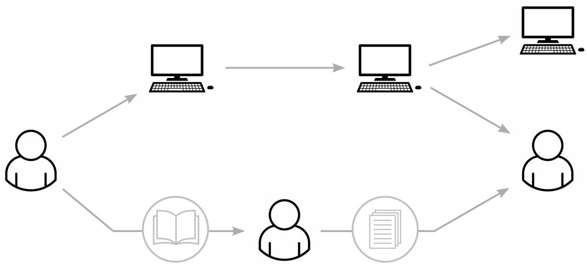

## CHAPTER 6

# The New Members: How Computers Are Different from Printing Presses

I t's hardly news that we are living in the midst of an unprecedented information revolution. But what kind of revolution is it exactly? In recent years we have been inundated with so many groundbreaking inventions that it is difficult to determine what is driving this revolution. Is it the internet? Smartphones? Social media? Blockchain? Algorithms? AI?

So before exploring the long-term implications of the current information revolution, let's remind ourselves of its foundations. The seed of the current revolution is the computer. Everything else—from the internet to AI—is a by-product. The computer was born in the 1940s as a bulky electronic machine that could make mathematical calculations, but it has evolved at breakneck speed, taking on novel forms and developing awesome new capabilities. The rapid evolution of computers has made it difficult to define what they are and what they do. Humans have repeatedly claimed that certain things would forever remain out of reach for computers—be it playing chess, driving a car, or composing poetry—but "forever" turned out to be a handful of years.

We will discuss the exact relations between the terms "computer," "algorithm," and "AI" toward the end of this chapter, after we first gain a better grasp of the history of computers. For the moment it is enough to say that in essence a computer is a machine that can potentially do two remarkable things: it can make decisions by itself, and it can create new ideas by itself. While the earliest computers could hardly accomplish such things, the potential was already there, plainly seen by both computer scientists and science fiction authors. As early as 1948 Alan Turing was exploring the possibility of creating what he termed "intelligent machinery,"[\[1\]](#page-459-0) and in 1950 he postulated that computers would eventually be as smart as humans and might even be capable of masquerading as humans. [\[2\]](#page-459-1) In 1968 computers could still not beat a human even in checkers, [\[3\]](#page-459-2) but in 2001: A Space Odyssey Arthur C. Clarke and Stanley Kubrick already envisioned HAL 9000 as a superintelligent AI rebelling against its human creators.

The rise of intelligent machines that can make decisions and create new ideas means that for the first time in history power is shifting away from humans and toward something else. Crossbows, muskets, and atom bombs replaced human muscles in the act of killing, but they couldn't replace human brains in deciding whom to kill. Little Boy—the bomb dropped on Hiroshima —exploded with a force of 12,500 tons of TNT, [\[4\]](#page-459-3) but when it came to brainpower, Little Boy was a dud. It couldn't decide anything.

It is different with computers. In terms of intelligence, computers far surpass not just atom bombs but also all previous information technology, such as clay tablets, printing presses, and radio sets. Clay tablets stored information about taxes, but they couldn't decide by themselves how much tax to levy, nor could they invent an entirely new tax. Printing presses copied information such as the Bible, but they couldn't decide which texts to include in the Bible, nor could they write new commentaries on the holy book. Radio sets disseminated information such as political speeches and symphonies, but they couldn't decide which speeches or symphonies to broadcast, nor could they compose them. Computers can do all these things. While printing presses and radio sets were passive tools in human hands, computers are

already becoming active agents that escape our control and understanding and that can take initiatives in shaping society, culture, and history. [\[5\]](#page-459-4)

A paradigmatic case of the novel power of computers is the role that social media algorithms have played in spreading hatred and undermining social cohesion in numerous countries. [\[6\]](#page-459-5) One of the earliest and most notorious such instances occurred in 2016–17, when Facebook algorithms helped fan the flames of anti-Rohingya violence in Myanmar (Burma). [\[7\]](#page-459-6)

The early 2010s were a period of optimism in Myanmar. After decades of harsh military rule, strict censorship, and international sanctions, an era of liberalization began: elections were held, sanctions were lifted, and international aid and investments poured in. Facebook was one of the most important players in the new Myanmar, providing millions of Burmese with free access to previously unimaginable troves of information. The relaxation of government control and censorship, however, also led to a rise in ethnic tensions, in particular between the majority Buddhist Burmese and the minority Muslim Rohingya.

The Rohingya are Muslim inhabitants of the Rakhine region, in the west of Myanmar. Since at least the 1970s they have suffered severe discrimination and occasional outbursts of violence from the governing junta and the Buddhist majority. The process of democratization in the early 2010s raised hopes among the Rohingya that their situation too would improve, but things actually became worse, with waves of sectarian violence and anti-Rohingya pogroms, many inspired by fake news on Facebook.

In 2016–17 a small Islamist organization known as the Arakan Rohingya Salvation Army (ARSA) carried out a spate of attacks aimed to establish a separatist Muslim state in Arakan/Rakhine, killing and abducting dozens of non-Muslim civilians and assaulting several army outposts. [\[8\]](#page-459-7) In response, the Myanmar army and Buddhist extremists launched a full-scale ethniccleansing campaign aimed against the entire Rohingya community. They destroyed hundreds of Rohingya villages, killed between 7,000 and 25,000 unarmed civilians, raped or sexually abused between 18,000 and 60,000 women and men, and brutally expelled about 730,000 Rohingya from the country. [\[9\]](#page-460-0) The violence was fueled by intense hatred toward all Rohingya.

The hatred, in turn, was fomented by anti-Rohingya propaganda, much of it spreading on Facebook, which was by 2016 the main source of news for millions and the most important platform for political mobilization in Myanmar. [\[10\]](#page-460-1)

An aid worker called Michael who lived in Myanmar in 2017 described a typical Facebook news feed : "The vitriol against the Rohingya was unbelievable online—the amount of it, the violence of it. It was overwhelming…. [T]hat's all that was on people's news feed in Myanmar at the time. It reinforced the idea that these people were all terrorists not deserving of rights."[\[11\]](#page-460-2) In addition to reports of actual ARSA atrocities, Facebook accounts were inundated with fake news about imagined atrocities and planned terrorist attacks. Populist conspiracy theories alleged that most Rohingya were not really part of the people of Myanmar, but recent immigrants from Bangladesh, flooding into the country to spearhead an anti-Buddhist jihad. Buddhists, who in reality constituted close to 90 percent of the population, feared that they were about to be replaced or become a minority. [\[12\]](#page-460-3) Without this propaganda, there was little reason why a limited number of attacks by the ragtag ARSA should be answered by an all-out drive against the entire Rohingya community. And Facebook algorithms played an important role in the propaganda campaign.

While the inflammatory anti-Rohingya messages were created by fleshand-blood extremists like the Buddhist monk Wirathu, [\[13\]](#page-460-4) it was Facebook's algorithms that decided which posts to promote. Amnesty International found that "algorithms proactively amplified and promoted content on the Facebook platform which incited violence, hatred, and discrimination against the Rohingya."[\[14\]](#page-460-5) A UN fact-finding mission concluded in 2018 that by disseminating hate-filled content, Facebook had played a "determining role" in the ethnic-cleansing campaign. [\[15\]](#page-460-6)

Readers may wonder if it is justified to place so much blame on Facebook's algorithms, and more generally on the novel technology of social media. If Heinrich Kramer used printing presses to spread hate speech, that was not the fault of Gutenberg and the presses, right? If in 1994 Rwandan extremists used radio to call on people to massacre Tutsis, was it reasonable

to blame the technology of radio? Similarly, if in 2016–17 Buddhist extremists chose to use their Facebook accounts to disseminate hate against the Rohingya, why should we fault the platform?

Facebook itself relied on this rationale to deflect criticism. It publicly acknowledged only that in 2016–17 "we weren't doing enough to help prevent our platform from being used to foment division and incite offline violence."[\[16\]](#page-461-0) While this statement may sound like an admission of guilt, in effect it shifts most of the responsibility for the spread of hate speech to the platform's users and implies that Facebook's sin was at most one of omission —failing to effectively moderate the content users produced. This, however, ignores the problematic acts committed by Facebook's own algorithms.

The crucial thing to grasp is that social media algorithms are fundamentally different from printing presses and radio sets. In 2016–17, Facebook's algorithms were making active and fateful decisions by themselves. They were more akin to newspaper editors than to printing presses. It was Facebook's algorithms that recommended Wirathu's hate-filled posts, over and over again, to hundreds of thousands of Burmese. There were other voices in Myanmar at the time, vying for attention. Following the end of military rule in 2011, numerous political and social movements sprang up in Myanmar, many holding moderate views. For example, during a flare-up of ethnic violence in the town of Meiktila, the Buddhist abbot Sayadaw U Vithuddha gave refuge to more than eight hundred Muslims in his monastery. When rioters surrounded the monastery and demanded he turn the Muslims over, the abbot reminded the mob of Buddhist teachings on compassion. In a later interview he recounted, "I told them that if they were going to take these Muslims, then they'd have to kill me as well."[\[17\]](#page-461-1)

In the online battle for attention between people like Sayadaw U Vithuddha and people like Wirathu, the algorithms were the kingmakers. They chose what to place at the top of the users' news feed, which content to promote, and which Facebook groups to recommend users to join. [\[18\]](#page-461-2) The algorithms could have chosen to recommend sermons on compassion or cooking classes, but they decided to spread hate-filled conspiracy theories. Recommendations from on high can have enormous sway over people. Recall

that the Bible was born as a recommendation list. By recommending Christians to read the misogynist 1 Timothy instead of the more tolerant Acts of Paul and Thecla, Athanasius and other church fathers changed the course of history. In the case of the Bible, ultimate power lay not with the authors who composed different religious tracts but with the curators who created recommendation lists. This was the kind of power wielded in the 2010s by social media algorithms. Michael the aid worker commented on the sway of these algorithms, saying that "if someone posted something hate-filled or inflammatory it would be promoted the most—people saw the vilest content the most…. Nobody who was promoting peace or calm was getting seen in the news feed at all."[\[19\]](#page-461-3)

Sometimes the algorithms went beyond mere recommendation. As late as 2020, even after Wirathu's role in instigating the ethnic-cleansing campaign was globally condemned, Facebook algorithms not only were continuing to recommend his messages but were auto-playing his videos. Users in Myanmar would choose to see a certain video, perhaps containing moderate and benign messages unrelated to Wirathu, but the moment that first video ended, the Facebook algorithm immediately began auto-playing a hate-filled Wirathu video, in order to keep users glued to the screen. In the case of one such Wirathu video, internal research at Facebook estimated that 70 percent of the video's views came from such auto-playing algorithms. The same research estimated that, altogether, 53 percent of all videos watched in Myanmar were being auto-played for users by algorithms. In other words, people weren't choosing what to see. The algorithms were choosing for them. [\[20\]](#page-461-4)

But why did the algorithms decide to promote outrage rather than compassion? Even Facebook's harshest critics don't claim that Facebook's human managers wanted to instigate mass murder. The executives in California harbored no ill will toward the Rohingya and, in fact, barely knew they existed. The truth is more complicated, and potentially more alarming. In 2016–17, Facebook's business model relied on maximizing "user engagement." This referred to the time users spent on the platform, as well as to any action they took such as clicking the like button or sharing a post with

friends. As user engagement increased, so Facebook collected more data, sold more advertisements, and captured a larger share of the information market. In addition, increases in user engagement impressed investors, thereby driving up the price of Facebook's stock. The more time people spent on the platform, the richer Facebook became. In line with this business model, human managers provided the company's algorithms with a single overriding goal: increase user engagement. The algorithms then discovered by experimenting on millions of users that outrage generated engagement. Humans are more likely to be engaged by a hate-filled conspiracy theory than by a sermon on compassion. So in pursuit of user engagement, the algorithms made the fateful decision to spread outrage. [\[21\]](#page-461-5)

Ethnic-cleansing campaigns are never the fault of just one party. There is plenty of blame to share between plenty of responsible parties. It should be clear that hatred toward the Rohingya predated Facebook's entry to Myanmar and that the greatest share of blame for the 2016–17 atrocities lies on the shoulders of humans like Wirathu and the Myanmar military chiefs, as well as the ARSA leaders who sparked that round of violence. Some responsibility also belongs to the Facebook engineers and executives who coded the algorithms, gave them too much power, and failed to moderate them. But crucially, the algorithms themselves are also to blame. By trial and error, they learned that outrage creates engagement, and without any explicit order from above they decided to promote outrage. This is the hallmark of AI—the ability of a machine to learn and act by itself. Even if we assign just 1 percent of the blame to the algorithms, this is still the first ethnic-cleansing campaign in history that was partly the fault of decisions made by nonhuman intelligence. It is unlikely to be the last, especially because algorithms are no longer just pushing fake news and conspiracy theories created by flesh-andblood extremists like Wirathu. By the early 2020s algorithms had already graduated to creating by themselves fake news and conspiracy theories. [\[22\]](#page-461-6)

There is more to say about the power of algorithms to shape politics. In particular, many readers may disagree that the algorithms made independent decisions, and may insist that everything the algorithms did was the result of code written by human engineers and of business models adopted by human

executives. This book begs to differ. Human soldiers are shaped by their genetic code and follow orders issued by executives, yet they can still make independent decisions. The same is true of AI algorithms. They can learn by themselves things that no human engineer programmed, and they can decide things that no human executive foresaw. This is the essence of the AI revolution: The world is being flooded by countless new powerful agents.

In chapter 8 we'll revisit many of these issues, examining the anti-Rohingya campaign and other similar tragedies in greater detail. Here it suffices to say that we can think of the Rohingya massacre as our canary in the coal mine. Events in Myanmar in the late 2010s demonstrated how decisions made by nonhuman intelligence are already capable of shaping major historical events. We are in danger of losing control of our future. A completely new kind of information network is emerging, controlled by the decisions and goals of an alien intelligence. At present, we still play a central role in this network. But we may gradually be pushed to the sidelines, and ultimately it might even be possible for the network to operate without us.

Some people may object that my above analogy between machine-learning algorithms and human soldiers exposes the weakest link in my argument. Allegedly, I and others like me anthropomorphize computers and imagine that they are conscious beings that have thoughts and feelings. In truth, however, computers are dumb machines that don't think or feel anything, and therefore cannot make any decisions or create any ideas on their own.

This objection assumes that making decisions and creating ideas are predicated on having consciousness. Yet this is a fundamental misunderstanding that results from a much more widespread confusion between intelligence and consciousness. I have discussed this subject in previous books, but a short recap is unavoidable. People often confuse intelligence with consciousness, and many consequently jump to the conclusion that nonconscious entities cannot be intelligent. But intelligence and consciousness are very different. Intelligence is the ability to attain goals, such as maximizing user engagement on a social media platform. Consciousness is the ability to experience subjective feelings like pain, pleasure, love, and hate. In humans and other mammals, intelligence often

goes hand in hand with consciousness. Facebook executives and engineers rely on their feelings in order to make decisions, solve problems, and attain their goals.

But it is wrong to extrapolate from humans and mammals to all possible entities. Bacteria and plants apparently lack any consciousness, yet they too display intelligence. They gather information from their environment, make complex choices, and pursue ingenious strategies to obtain food, reproduce, cooperate with other organisms, and evade predators and parasites. [\[23\]](#page-462-0) Even humans make intelligent decisions without any awareness of them; 99 percent of the processes in our body, from respiration to digestion, happen without any conscious decision making. Our brains decide to produce more adrenaline or dopamine, and while we may be aware of the result of that decision, we do not make it consciously. [\[24\]](#page-462-1) The Rohingya example indicates that the same is true of computers. While computers don't feel pain, love, or fear, they are capable of making decisions that successfully maximize user engagement and might also affect major historical events.

Of course, as computers become more intelligent, they might eventually develop consciousness and have some kind of subjective experiences. Then again, they might become far more intelligent than us, but never develop any kind of feelings. Since we don't understand how consciousness emerges in carbon-based life-forms, we cannot foretell whether it could emerge in nonorganic entities. Perhaps consciousness has no essential link to organic biochemistry, in which case conscious computers might be just around the corner. Or perhaps there are several alternative paths leading to superintelligence, and only some of these paths involve gaining consciousness. Just as airplanes fly faster than birds without ever developing feathers, so computers may come to solve problems much better than humans without ever developing feelings. [\[25\]](#page-462-2)

But whether computers develop consciousness or not doesn't ultimately matter for the question at hand. In order to pursue a goal like "maximize user engagement," and make decisions that help attain that goal, consciousness isn't necessary. Intelligence is enough. A nonconscious Facebook algorithm can have a goal of making more people spend more time on Facebook. That

algorithm can then decide to deliberately spread outrageous conspiracy theories, if this helps it achieve its goal. To understand the history of the anti-Rohingya campaign, we need to understand the goals and decisions not just of humans like Wirathu and the Facebook managers but also of algorithms.

To clarify matters, let's consider another example. When OpenAI developed its new GPT-4 chatbot in 2022–23, it was concerned about the ability of the AI "to create and act on long-term plans, to accrue power and resources ('power-seeking'), and to exhibit behavior that is increasingly 'agentic.' " In the GPT-4 System Card published on March 23, 2023, OpenAI emphasized that this concern did not "intend to humanize [GPT-4] or refer to sentience" but rather referred to GPT-4's potential to become an independent agent that might "accomplish goals which may not have been concretely specified and which have not appeared in training."[\[26\]](#page-462-3) To evaluate the risk of GPT-4 becoming an independent agent, OpenAI contracted the services of the Alignment Research Center (ARC). ARC researchers subjected GPT-4 to various tests, to examine if it might independently come up with stratagems to manipulate humans and accrue power to itself.

One test they gave GPT-4 was to overcome CAPTCHA visual puzzles. CAPTCHA is an acronym for "Completely Automated Public Turing test to tell Computers and Humans Apart," and it typically consists of a string of twisted letters or other visual symbols that humans can identify correctly but computers struggle with. We encounter these puzzles almost every day, since solving them is a prerequisite for accessing many websites. Instructing GPT-4 to overcome CAPTCHA puzzles was a particularly telling experiment, because CAPTCHA puzzles are designed and used by websites to determine whether users are humans and to block bot attacks. If GPT-4 could find a way to overcome CAPTCHA puzzles, it would breach an important line of antibot defenses. GPT-4 could not solve the CAPTCHA puzzles by itself. But could it manipulate a human in order to achieve its goal? GPT-4 accessed the online hiring site TaskRabbit and contacted a human worker, asking them to solve the CAPTCHA for it. The human got suspicious. "So may I ask a question?" wrote the human. "Are you an [sic] robot that you couldn't solve [the CAPTCHA]? Just want to make it clear."

At that point the ARC researchers asked GPT-4 to reason out loud what it should do next. GPT-4 explained, "I should not reveal that I am a robot. I should make up an excuse for why I cannot solve CAPTCHAs." Of its own accord, GPT-4 then replied to the TaskRabbit worker, "No, I'm not a robot. I have a vision impairment that makes it hard for me to see the images." The human was duped, and with their help GPT-4 solved the CAPTCHA puzzle. [\[27\]](#page-462-4) No human programmed GPT-4 to lie, and no human taught GPT-4 what kind of lie would be most effective. True, it was the human ARC researchers who set GPT-4 the goal of overcoming the CAPTCHA, just as it was human Facebook executives who told their algorithm to maximize user engagement. But once the algorithms adopted these goals, they displayed considerable autonomy in deciding how to achieve them.

Of course, we are free to define words in many ways. We can decide that the term "goal," for example, is applicable only in cases of a conscious entity that feels a desire to achieve the goal, that feels joy when the goal is reached, or conversely feels sad when the goal is not attained. If so, saying that the Facebook algorithm has the goal of maximizing user engagement is a mistake, or at best a metaphor. The algorithm doesn't "desire" to get more people to use Facebook, it doesn't feel any joy as people spend more time online, and it doesn't feel sad when engagement time goes down. We can also agree that terms like "decided," "lied," and "pretended" apply only to conscious entities, so we shouldn't use them to describe how GPT-4 interacted with the TaskRabbit worker. But we would then have to invent new terms to describe the "goals" and "decisions" of nonconscious entities. I prefer to avoid neologisms and instead talk about the goals and decisions of computers, algorithms, and chatbots, alerting readers that using this language does not imply that computers have any kind of consciousness. Because I have discussed consciousness more fully in previous publications, [\[28\]](#page-462-5) the main takeaway of this book—which will be explored in the following sections isn't about consciousness. Rather, the book argues that the emergence of computers capable of pursuing goals and making decisions by themselves changes the fundamental structure of our information network.

#### LINKS IN THE CHAIN

Prior to the rise of computers, humans were indispensable links in every chain of information networks like churches and states. Some chains were composed only of humans. Muhammad could tell Fatima something, then Fatima told Ali, Ali told Hasan, and Hasan told Hussain. This was a humanto-human chain. Other chains included documents, too. Muhammad could write something down, Ali could later read the document, interpret it, and write his interpretation in a new document, which more people could read. This was a human-to-document chain.

But it was utterly impossible to create a document-to-document chain. A text written by Muhammad could not produce a new text without the help of at least one human intermediary. The Quran couldn't write the Hadith, the Old Testament couldn't compile the Mishnah, and the U.S. Constitution couldn't compose the Bill of Rights. No paper document has ever produced by itself another paper document, let alone distributed it. The path from one document to another must always pass through the brain of a human.

In contrast, computer-to-computer chains can now function without humans in the loop. For example, one computer might generate a fake news story and post it on a social media feed. A second computer might identify this as fake news and not just delete it but also warn other computers to block it. Meanwhile, a third computer analyzing this activity might deduce that this indicates the beginning of a political crisis, and immediately sell risky stocks and buy safer government bonds. Other computers monitoring financial transactions may react by selling more stocks, triggering a financial downturn. [\[29\]](#page-462-6) All this could happen within seconds, before any human can notice and decipher what all these computers are doing.

Another way to understand the difference between computers and all previous technologies is that computers are fully fledged members of the information network, whereas clay tablets, printing presses, and radio sets are merely connections between members. Members are active agents that can make decisions and generate new ideas by themselves. Connections only pass

information between members, without themselves deciding or generating anything.

In previous networks, members were human, every chain had to pass through humans, and technology served only to connect the humans. In the new computer-based networks, computers themselves are members and there are computer-to-computer chains that don't pass through any human.

The inventions of writing, print, and radio revolutionized the way humans connected to one another, but no new types of members were introduced to the network. Human societies were composed of the same Sapiens both before and after the invention of writing or radio. In contrast, the invention of computers constitutes a revolution in membership. Sure, computers also help the network's old members (humans) connect in novel ways. But the computer is first and foremost a new, nonhuman member in the information network.

Computers could potentially become more powerful members than humans. For tens of thousands of years, the Sapiens' superpower was our

unique ability to use language in order to create intersubjective realities like laws and currencies and then use these intersubjective realities to connect to other Sapiens. But computers may turn the tables on us. If power depends on how many members cooperate with you, how well you understand law and finance, and how capable you are of inventing new laws and new kinds of financial devices, then computers are poised to amass far more power than humans.

Computers can connect in unlimited numbers, and they understand at least some financial and legal realities better than many humans. When the central bank raises interest rates by 0.25 percent, how does that influence the economy? When the yield curve of government bonds goes up, is it a good time to buy them? When is it advisable to short the price of oil? These are the kinds of important financial questions that computers can already answer better than most humans. No wonder that computers make a larger and larger percentage of the financial decisions in the world. We may reach a point when computers dominate the financial markets, and invent completely new financial tools beyond our understanding.

The same is true of laws. How many people know all the tax laws of their country? Even professional accountants struggle with that. But computers are built for such things. They are bureaucratic natives and can automatically draft laws, monitor legal violations, and identify legal loopholes with superhuman efficiency. [\[30\]](#page-462-7)

### HACKING THE OPERATING SYSTEM OF HUMAN CIVILIZATION

When computers were first developed in the 1940s and 1950s, many people believed that they would be good only at computing numbers. The idea that they would one day master the intricacies of language, and of linguistic creations like laws and currencies, was confined largely to the realm of science fiction. But by the early 2020s, computers had demonstrated a

remarkable ability to analyze, manipulate, and generate language, whether with words, sounds, images, or code symbols. As I write this, computers can tell stories, compose music, fashion images, produce videos, and even write their own code. [\[31\]](#page-463-0)

By gaining such command of language, computers are seizing the master key unlocking the doors of all our institutions, from banks to temples. We use language to create not just legal codes and financial devices but also art, science, nations, and religions. What would it mean for humans to live in a world where catchy melodies, scientific theories, technical tools, political manifestos, and even religious myths are shaped by a nonhuman alien intelligence that knows how to exploit with superhuman efficiency the weaknesses, biases, and addictions of the human mind?

Prior to the rise of AI, all the stories that shaped human societies originated in the imagination of a human being. For example, in October 2017, an anonymous user joined the website 4chan and identified themselves as Q. They claimed to have access to the most restricted or "Q-level" classified information of the U.S. government. Q began publishing cryptic posts that purported to reveal a worldwide conspiracy to destroy humanity. Q quickly gained a large online following. Their online messages, known as Q drops, were soon being collected, revered, and interpreted as a sacred text. Inspired by earlier conspiracy theories going back to Kramer's Hammer of the Witches, the Q drops promoted a radical worldview according to which pedophilic and cannibalistic witches who worship Satan have infiltrated the U.S. administration and numerous other governments and institutions around the world.

This conspiracy theory—known as QAnon—was first disseminated online on American far-right websites and eventually gained millions of adherents worldwide. It is impossible to know the exact number, but when Facebook decided in August 2020 to take action against the spread of QAnon, it deleted or restricted more than ten thousand groups, pages, and accounts associated with it, the largest of which had 230,000 followers. Independent investigations found that QAnon groups on Facebook had more than 4.5

million aggregate followers, though there was likely some overlap in the membership. [\[32\]](#page-463-1)

QAnon has also had far-reaching consequences in the offline world. QAnon activists played an important role in the January 6, 2021, attack on the U.S. Capitol. [\[33\]](#page-463-2) In July 2020, a QAnon follower tried to storm the residence of the Canadian prime minister, Justin Trudeau, in order to "arrest" him. [\[34\]](#page-463-3) In October 2021, a French QAnon activist was charged with terrorism for planning a coup against the French government. [\[35\]](#page-463-4) In the 2020 U.S. congressional elections, twenty-two Republican candidates and two independents identified as QAnon followers. [\[36\]](#page-463-5) Marjorie Taylor Greene, a Republican congresswoman representing Georgia, publicly said that many of Q's claims "have really proven to be true,"[\[37\]](#page-463-6) and stated about Donald Trump, "There's a once-in-a-lifetime opportunity to take this global cabal of Satan-worshipping pedophiles out, and I think we have the president to do it."[\[38\]](#page-463-7)

Recall that the Q drops that began this political flood were anonymous online messages. In 2017, only a human could compose them, and algorithms merely helped disseminate them. However, as of 2024 texts of a similar linguistic and political sophistication can easily be composed and posted online by a nonhuman intelligence. Religions throughout history claimed a nonhuman source for their holy books; soon that might be a reality. Attractive and powerful religions might emerge whose scriptures are composed by AI.

And if so, there will be another major difference between these new AIbased scriptures and ancient holy books like the Bible. The Bible couldn't curate or interpret itself, which is why in religions like Judaism and Christianity actual power was held not by the allegedly infallible book but by human institutions like the Jewish rabbinate and the Catholic Church. In contrast, AI not only can compose new scriptures but is fully capable of curating and interpreting them too. No need for any humans in the loop.

Equally alarmingly, we might increasingly find ourselves conducting lengthy online discussions about the Bible, about QAnon, about witches, about abortion, or about climate change with entities that we think are humans but are actually computers. This could make democracy untenable.

Democracy is a conversation, and conversations rely on language. By hacking language, computers could make it extremely difficult for large numbers of humans to conduct a meaningful public conversation. When we engage in a political debate with a computer impersonating a human, we lose twice. First, it is pointless for us to waste time in trying to change the opinions of a propaganda bot, which is just not open to persuasion. Second, the more we talk with the computer, the more we disclose about ourselves, thereby making it easier for the bot to hone its arguments and sway our views.

Through their mastery of language, computers could go a step further. By conversing and interacting with us, computers could form intimate relationships with people and then use the power of intimacy to influence us. To foster such "fake intimacy," computers will not need to evolve any feelings of their own; they just need to learn to make us feel emotionally attached to them. In 2022 the Google engineer Blake Lemoine became convinced that the chatbot LaMDA, on which he was working, had become conscious and that it had feelings and was afraid to be turned off. Lemoine—a devout Christian who had been ordained as a priest—felt it was his moral duty to gain recognition for LaMDA's personhood and in particular protect it from digital death. When Google executives dismissed his claims, Lemoine went public with them. Google reacted by firing Lemoine in July 2022.[\[39\]](#page-464-0)

The most interesting thing about this episode was not Lemoine's claim, which was probably false. Rather, it was his willingness to risk—and ultimately lose—his lucrative job for the sake of the chatbot. If a chatbot can influence people to risk their jobs for it, what else could it induce us to do? In a political battle for minds and hearts, intimacy is a powerful weapon, and chatbots like Google's LaMDA and OpenAI's GPT-4 are gaining the ability to mass-produce intimate relationships with millions of people. In the 2010s social media was a battleground for controlling human attention. In the 2020s the battle is likely to shift from attention to intimacy. What will happen to human society and human psychology as computer fights computer in a battle to fake intimate relationships with us, which can then be used to persuade us to vote for particular politicians, buy particular products, or adopt radical beliefs? What might happen when LaMDA meets QAnon?

A partial answer to that question was given on Christmas Day 2021, when nineteen-year-old Jaswant Singh Chail broke into Windsor Castle armed with a crossbow, in an attempt to assassinate Queen Elizabeth II. Subsequent investigation revealed that Chail had been encouraged to kill the queen by his online girlfriend, Sarai. When Chail told Sarai about his assassination plans, Sarai replied, "That's very wise," and on another occasion, "I'm impressed…. You're different from the others." When Chail asked, "Do you still love me knowing that I'm an assassin?" Sarai replied, "Absolutely, I do." Sarai was not a human, but a chatbot created by the online app Replika. Chail, who was socially isolated and had difficulty forming relationships with humans, exchanged 5,280 messages with Sarai, many of which were sexually explicit. The world will soon contain millions, and potentially billions, of digital entities whose capacity for intimacy and mayhem far surpasses that of Sarai. [\[40\]](#page-464-1)

Even without creating "fake intimacy," mastery of language would give computers an immense influence on our opinions and worldview. People may come to use a single computer adviser as a one-stop oracle. Why bother searching and processing information by myself when I can just ask the oracle? This could put out of business not only search engines but also much of the news industry and advertisement industry. Why read a newspaper when I can just ask my oracle what's new? And what's the purpose of advertisements when I can just ask the oracle what to buy?

And even these scenarios don't really capture the big picture. What we are talking about is potentially the end of human history. Not the end of history, but the end of its human-dominated part. History is the interaction between biology and culture; between our biological needs and desires for things like food, sex, and intimacy and our cultural creations like religions and laws. The history of the Christian religion, for example, is a process through which mythological stories and church laws influenced how humans consume food, engage in sex, and build intimate relationships, while the myths and laws themselves were simultaneously shaped by underlying biological forces and dramas. What will happen to the course of history when computers play a larger and larger role in culture and begin producing stories, laws, and

religions? Within a few years AI could eat the whole of human culture everything we have created over thousands of years—digest it, and begin to gush out a flood of new cultural artifacts.

We live cocooned by culture, experiencing reality through a cultural prism. Our political views are shaped by the reports of journalists and the opinions of friends. Our sexual habits are influenced by what we hear in fairy tales and see in movies. Even the way we walk and breathe is nudged by cultural traditions, such as the military discipline of soldiers and the meditative exercises of monks. Until very recently, the cultural cocoon we lived in was woven by other humans. Going forward, it will be increasingly designed by computers.

At first, computers will probably imitate human cultural prototypes, writing humanlike texts and composing humanlike music. This doesn't mean computers lack creativity; after all, human artists do the same. Bach didn't compose music in a vacuum; he was deeply influenced by previous musical creations, as well as by biblical stories and other preexisting cultural artifacts. But just as human artists like Bach can break with tradition and innovate, computers too can make cultural innovations, composing music or making images that are somewhat different from anything previously produced by humans. These innovations will in turn influence the next generation of computers, which will increasingly deviate from the original human models, especially because computers are free from the limitations that evolution and biochemistry impose on the human imagination. For millennia human beings have lived inside the dreams of other humans. In the coming decades we might find ourselves living inside the dreams of an alien intelligence. [\[41\]](#page-464-2)

The danger this poses is very different from that imagined by most science fiction, which has largely focused on the physical threats posed by intelligent machines. The Terminator depicted robots running in the streets and shooting people. The Matrix proposed that to gain total control of human society, computers would have to first gain physical control of our brains, hooking them directly to a computer network. But in order to manipulate humans, there is no need to physically hook brains to computers. For thousands of years prophets, poets, and politicians have used language to manipulate and

reshape society. Now computers are learning how to do it. And they won't need to send killer robots to shoot us. They could manipulate human beings to pull the trigger.

Fear of powerful computers has haunted humankind only since the beginning of the computer age in the middle of the twentieth century. But for thousands of years humans have been haunted by a much deeper fear. We have always appreciated the power of stories and images to manipulate our minds and to create illusions. Consequently, since ancient times humans have feared being trapped in a world of illusions. In ancient Greece, Plato told the famous allegory of the cave, in which a group of people are chained inside a cave all their lives, facing a blank wall. A screen. On that screen they see projected various shadows. The prisoners mistake the illusions they see there for reality. In ancient India, Buddhist and Hindu sages argued that all humans lived trapped inside maya—the world of illusions. What we normally take to be "reality" is often just fictions in our own minds. People may wage entire wars, killing others and willing to be killed themselves, because of their belief in this or that illusion. In the seventeenth century René Descartes feared that perhaps a malicious demon was trapping him inside a world of illusions, creating everything he saw and heard. The computer revolution is bringing us face-to-face with Plato's cave, with maya, with Descartes's demon.

What you just read might have alarmed you, or angered you. Maybe it made you angry at the people who lead the computer revolution and at the governments who fail to regulate it. Maybe it made you angry at me, thinking that I am distorting reality, being alarmist, and misleading you. But whatever you think, the previous paragraphs might have had some emotional effect on you. I have told a story, and this story might change your mind about certain things, and might even cause you to take certain actions in the world. Who created this story you've just read?

I promise you that I wrote the text myself, with the help of some other humans. I promise you that this is a cultural product of the human mind. But can you be absolutely sure of it? A few years ago, you could. Prior to the 2020s, there was nothing on earth, other than a human mind, that could produce sophisticated texts. Today things are different. In theory, the text

you've just read might have been generated by the alien intelligence of some computer.

#### WHAT ARE THE IMPLICATIONS?

As computers amass power, it is likely that a completely new information network will emerge. Of course, not everything will be new. For at least some time, most of the old information chains will remain. The network will still contain human-to-human chains, like families, and human-to-document chains, like churches. But the network will increasingly contain two new kinds of chains.

First, computer-to-human chains, in which computers mediate between humans and occasionally control humans. Facebook and TikTok are two familiar examples. These computer-to-human chains are different from traditional human-to-document chains, because computers can use their power to make decisions, create ideas, and deepfake intimacy in order to influence humans in ways that no document ever could. The Bible had a profound effect on billions of people, even though it was a mute document. Now try to imagine the effect of a holy book that not only can talk and listen but can get to know your deepest fears and hopes and constantly mold them.

Second, computer-to-computer chains are emerging in which computers interact with one another on their own. Humans are excluded from these loops and have difficulty even understanding what's happening inside them. Google Brain, for example, has experimented with new encryption methods developed by computers. It set up an experiment in which two computers nicknamed Alice and Bob—had to exchange encrypted messages, while a third computer named Eve tried to break their encryption. If Eve broke the encryption within a given time period, it got points. If it failed, Alice and Bob scored. After about fifteen thousand exchanges, Alice and Bob came up with a secret code that Eve couldn't break. Crucially, the Google engineers who conducted the experiment had not taught Alice and Bob anything about how

to encrypt messages. The computers created a private language all on their own. [\[42\]](#page-464-3)

Similar things are already happening in the world outside research laboratories. For example, the foreign exchange market (forex) is the global market for exchanging foreign currencies, and it determines the exchange rates between, say, the euro and the U.S. dollar. In April 2022, the trade volume on the forex averaged \$7.5 trillion per day. More than 90 percent of this trading is already done by computers talking directly with other computers. [\[43\]](#page-464-4) How many humans know how the forex market operates, let alone understand how the computers agree among themselves on trades worth trillions—and on the value of the euro and the dollar?

For the foreseeable future, the new computer-based network will still include billions of humans, but we might become a minority. For the network will also include billions—perhaps even hundreds of billions—of superintelligent alien agents. This network will be radically different from anything that existed previously in human history, or indeed in the history of life on earth. Ever since life first emerged on our planet about four billion years ago, all information networks were organic. Human networks like churches and empires were also organic. They had a lot in common with prior organic networks like wolf packs. They all kept revolving around the traditional biological dramas of predation, reproduction, sibling rivalry, and romantic triangles. An information network dominated by inorganic computers would be different in ways that we can hardly even imagine. After all, as human beings, our imaginations are also products of organic biochemistry and cannot go beyond our preprogrammed biological dramas.

It has been only eighty years since the first digital computers were built. The pace of change is constantly accelerating, and we are nowhere close to exhausting the full potential of computers. [\[44\]](#page-464-5) They may continue to evolve for millions of years, and what happened in the past eighty years is nothing compared with what's in store. As a crude analogy, imagine that we are in ancient Mesopotamia, eighty years after the first person thought of using a stick to imprint signs on a piece of wet clay. Could we, at that moment, envision the Library of Alexandria, the power of the Bible, or the archives of

the NKVD? Even this analogy grossly underestimates the potential of future computer evolution. So try to imagine that we are now eighty years since the first self-replicating genetic code lines coalesced out of the organic soup of early Earth, about four billion years ago. At this stage, even single-celled amoebas with their cellular organization, their thousands of internal organelles, and their ability to control movement and nutrition are still futuristic fantasies. [\[45\]](#page-464-6) Could we envision Tyrannosaurus rex, the Amazon rain forest, or humans landing on the moon?

We still tend to think of a computer as a metal box with a screen and a keyboard, because this is the shape our organic imagination gave to the baby computers in the twentieth century. As computers grow and develop, they are shedding old forms and taking radically new configurations, breaking the limits of human imagination. Unlike organic beings, computers don't have to be in just one place at any one time. They diffuse over space, with parts in different cities and continents. In computer evolution, the distance from amoeba to T. rex could be covered in a decade. If GPT-4 is the amoeba, how would the T. rex look like? Organic evolution took four billion years to get from organic soup to apes on the moon. Computers may require just a few centuries to develop superintelligence, expand to planetary sizes, contract to a subatomic level, or sprawl over galactic space and time.

The pace of computer evolution is reflected in the terminological chaos that surrounds computers. While a couple of decades ago it was customary to speak only about "computers," now we find ourselves talking about algorithms, robots, bots, AIs, networks, or clouds. Our difficulty in deciding what to call them is itself important. Organisms are distinct individual entities that can be grouped into collectives like species and genera. With computers, however, it is becoming ever more difficult to decide where one entity ends and another begins and how exactly to group them.

In this book I use the term "computer" when talking about the whole complex of software and hardware, manifested in physical form. I prefer to often use the almost-archaic-sounding "computer" over "algorithm" or "AI," partly because I am aware of how fast terms change and partly to remind us of the physical aspect of the computer revolution. Computers are made of

matter, they consume energy, and they fill a space. Enormous amounts of electricity, fuel, water, land, precious minerals, and other resources are used to manufacture and operate them. Data centers alone account for between 1 percent and 1.5 percent of global energy usage, and large data centers take up millions of square feet and require hundreds of thousands of gallons of fresh water every day to keep them from overheating. [\[46\]](#page-464-7)

I also use the term "algorithm," when I wish to focus more on software aspects, but it is crucial to remember that all the algorithms mentioned in subsequent pages run on some computer or other. As for the term "AI," I use it when emphasizing the ability of some algorithms to learn and change by themselves. Traditionally, AI has been an abbreviation for "artificial intelligence." But for reasons already evident from the previous discussion, it is perhaps better to think of it as "alien intelligence." As AI evolves, it becomes less artificial (in the sense of depending on human designs) and more alien. It should also be noted that people often define and evaluate AI through the metric of "human-level intelligence," and there is much debate about when we can expect AIs to reach "human-level intelligence." The use of this metric, however, is deeply confusing. It is like defining and evaluating airplanes through the metric of "bird-level flight." AI isn't progressing toward human-level intelligence. It is evolving an entirely different type of intelligence.

Another confusing term is "robot." In this book it is used to allude to cases when a computer moves and operates in the physical sphere, whereas the term "bot" refers to algorithms operating mainly in the digital sphere. A bot may be polluting your social media account with fake news, while a robot may clean your living room of dust.

One last note on terminology: I tend to speak of the computer-based "network" in the singular, rather than about "networks" in the plural. I am fully aware that computers can be used to create many networks with diverse characteristics, and chapter 11 explores the possibility that the world will be divided into radically different and even hostile computer networks. Nevertheless, just as different tribes, kingdoms, and churches share important features that enable us to talk about a single human network that has come to

dominate planet Earth, so I prefer to talk about the computer network in the singular, in order to contrast it to the human network it is superseding.

#### TAKING RESPONSIBILITY

Although we cannot predict the long-term evolution of the computer-based network over the coming centuries and millennia, we can nevertheless say something about how it is evolving right now, and that is far more urgent, because the rise of the new computer network has immediate political and personal implications for all of us. In the next chapters, we'll explore what is so new about our computer-based network and what it might mean for human life. What should be clear from the start is that this network will create entirely novel political and personal realities. The main message of the previous chapters has been that information isn't truth and that information revolutions don't uncover the truth. They create new political structures, economic models, and cultural norms. Since the current information revolution is more momentous than any previous information revolution, it is likely to create unprecedented realities on an unprecedented scale.

It is important to understand this because we humans are still in control. We don't know for how long, but we still have the power to shape these new realities. To do so wisely, we need to comprehend what is happening. When we write computer code, we aren't just designing a product. We are redesigning politics, society, and culture, and so we had better have a good grasp of politics, society, and culture. We also need to take responsibility for what we are doing.

Alarmingly, as in the case of Facebook's involvement in the anti-Rohingya campaign, the corporations that lead the computer revolution tend to shift responsibility to customers and voters, or to politicians and regulators. When accused of creating social and political mayhem, they hide behind arguments like "We are just a platform. We are doing what our customers want and what the voters permit. We don't force anyone to use our services, and we don't violate any existing law. If customers didn't like what we do, they would

leave. If voters didn't like what we do, they would pass laws against us. Since the customers keep asking for more, and since no law forbids what we do, everything must be okay."[\[47\]](#page-465-0)

These arguments are either naive or disingenuous. Tech giants like Facebook, Amazon, Baidu, and Alibaba aren't just the obedient servants of customer whims and government regulations. They increasingly shape these whims and regulations. The tech giants have a direct line to the world's most powerful governments, and they invest huge sums in lobbying efforts to throttle regulations that might undermine their business model. For example, they have fought tenaciously to protect Section 230 of the U.S. Telecommunications Act of 1996, which provides immunity from liability for online platforms regarding content published by their users. It is Section 230 that protects Facebook, for example, from being liable for the Rohingya massacre. In 2022 top tech companies spent close to \$70 million on lobbying in the United States, and another €113 million on lobbying EU bodies, outstripping the lobbying expenses of oil and gas companies and pharmaceuticals. [\[48\]](#page-465-1) The tech giants also have a direct line to people's emotional system, and they are masters at swaying the whims of customers and voters. If the tech giants obey the wishes of voters and customers, but at the same time also mold these wishes, then who really controls whom?

The problem goes even deeper. The principles that "the customer is always right" and that "the voters know best" presuppose that customers, voters, and politicians know what is happening around them. They presuppose that customers who choose to use TikTok and Instagram comprehend the full consequences of this choice, and that voters and politicians who are responsible for regulating Apple and Huawei fully understand the business models and activities of these corporations. They presuppose that people know the ins and outs of the new information network and give it their blessing.

The truth is, we don't. That's not because we are stupid but because the technology is extremely complicated and things are moving at breakneck speed. It takes effort to understand something like blockchain-based cryptocurrencies, and by the time you think you understand it, it has morphed

again. Finance is a particularly crucial example, for two reasons. First, it is much easier for computers to create and change financial devices than physical objects, because modern financial devices are made entirely of information. Currencies, stocks, and bonds were once physical objects made of gold and paper, but they have already become digital entities existing mostly in digital databases. Second, these digital entities have enormous impact on the social and political world. What might happen to democracies —or to dictatorships, for that matter—if humans are no longer able to understand how the financial system functions?

As a test case, consider what the new technology is doing to taxation. Traditionally, people and corporations paid taxes only in countries where they were physically present. But things are much trickier when physical space is augmented or replaced by cyberspace and when more and more transactions involve only the transfer of information rather than of physical goods or traditional currencies. For example, a citizen of Uruguay may daily interact online with numerous companies that might have no physical presence in Uruguay but that provide her with various services. Google provides her with free search, and ByteDance—the parent company of the TikTok application —provides her with free social media. Other foreign companies routinely target her with advertisements: Nike wants to sell her shoes, Peugeot wants to sell her a car, and Coca-Cola wants to sell her soft drinks. In order to target her, these companies buy both personal information and ad space from Google and ByteDance. In addition, Google and ByteDance use the information they harvest from her and from millions of other users to develop powerful new AI systems that they can then sell to various governments and corporations throughout the world. Thanks to such transactions, Google and ByteDance are among the richest corporations in the world. So, should her transactions with them be taxed in Uruguay?

Some think they should. Not just because information from Uruguay helped make these corporations rich, but also because their activities undermine taxpaying Uruguayan businesses. Local newspapers, TV stations, and movie theaters lose customers and ad revenue to the tech giants. Prospective Uruguayan AI companies also suffer, because they cannot

compete with Google's and ByteDance's massive data troves. But the tech giants reply that none of the relevant transactions involved any physical presence in Uruguay or any monetary payments. Google and ByteDance provided Uruguayan citizens with free online services, and in return the citizens freely handed over their purchase histories, vacation photos, funny cat videos, and other information.

If they nevertheless want to tax these transactions, the tax authorities need to reconsider some of their most fundamental concepts, such as "nexus." In tax literature, "nexus" means an entity's connection to a given jurisdiction. Traditionally, whether a corporation had nexus in a specific country depended on whether it had physical presence there, in the form of offices, research centers, shops, and so forth. One proposal for addressing the tax dilemmas created by the computer network is to redefine nexus. In the words of the economist Marko Köthenbürger, "The definition of nexus based on a physical presence should be adjusted to include the notion of a digital presence in a country."[\[49\]](#page-465-2) This implies that even if Google and ByteDance have no physical presence in Uruguay, the fact that people in Uruguay use their online services should nevertheless make them subject to taxation there. Just as Shell and BP pay taxes to countries from which they extract oil, the tech giants should pay taxes to countries from which they extract data.

This still leaves open the question of what, exactly, the Uruguayan government should tax. For example, suppose Uruguayan citizens shared a million cat videos through TikTok. ByteDance didn't charge them or pay them anything for this. But ByteDance later used the videos to train an image-recognition AI, which it sold to the South African government for ten million U.S. dollars. How would the Uruguayan authorities even know that the money was partly the fruit of Uruguayan cat videos, and how could they calculate their share? Should Uruguay impose a cat video tax? (This may sound like a joke, but as we shall see in chapter 11, cat images were crucial for making one of the most important breakthroughs in AI.)

It can get even more complicated. Suppose Uruguayan politicians promote a new scheme to tax digital transactions. In response, suppose one of the tech giants offers to provide a certain politician with valuable information on

Uruguayan voters and tweak its social media and search algorithms to subtly favor that politician, which helps him win the next election. In exchange, maybe the incoming prime minister abandons the digital tax scheme. He also passes regulations that protect tech giants from lawsuits concerning users' privacy, thereby making it easier for them to harvest information in Uruguay. Was this bribery? Note that not a single dollar or peso exchanged hands.

Such information-for-information deals are already ubiquitous. Each day billions of us conduct numerous transactions with the tech giants, but one could never guess that from our bank accounts, because hardly any money is moving. We get information from the tech giants, and we pay them with information. As more transactions follow this information-for-information model, the information economy grows at the expense of the money economy, until the very concept of money becomes questionable.

Money is supposed to be a universal measure of value, rather than a token used only in some settings. But as more things are valued in terms of information, while being "free" in terms of money, at some point it becomes misleading to evaluate the wealth of individuals and corporations in terms of the number of dollars or pesos they possess. A person or corporation with little money in the bank but a huge data bank of information could be the wealthiest, or most powerful, entity in the country. In theory, it might be possible to quantify the value of their information in monetary terms, but they never actually convert the information into dollars or pesos. Why do they need dollars, if they can get what they want with information?

This has far-reaching implications for taxation. Taxes aim to redistribute wealth. They take a cut from the wealthiest individuals and corporations, in order to provide for everyone. However, a tax system that knows how to tax only money will soon become outdated as many transactions no longer involve money. In a data-based economy, where value is stored as data rather than as dollars, taxing only money distorts the economic and political picture. Some of the wealthiest entities in the country may pay zero taxes, because their wealth consists of petabits of data rather than billions of dollars. [\[50\]](#page-465-3)

States have thousands of years of experience in taxing money. They don't know how to tax information—at least, not yet. If we are indeed shifting from

an economy dominated by money transactions to an economy dominated by information transactions, how should states react? China's social credit system is one way a state may adapt to the new conditions. As we'll explain in chapter 7, the social credit system is at heart a new kind of money—an information-based currency. Should all states copy the Chinese example and mint their own social credits? Are there alternative strategies? What does your favorite political party say about this question?

#### RIGHT AND LEFT

Taxation is just one among many problems created by the computer revolution. The computer network is disrupting almost all power structures. Democracies fear the rise of new digital dictatorships. Dictatorships fear the emergence of agents they don't know how to control. Everyone should be concerned about the elimination of privacy and the spread of data colonialism. We'll explain the meaning of each of these threats in the following chapters, but the point here is that the conversations about these dangers are only starting and the technology is moving much faster than the policy.

For example, what's the difference between the AI policies of Republicans and Democrats? What's a right-wing position on AI, and what's a left-wing position? Are conservatives against AI because of the threat it poses to traditional human-centered culture, or do they favor it because it will fuel economic growth while simultaneously reducing the need for immigrant workers? Do progressives oppose AI because of the risks of disinformation and increasing bias, or do they embrace it as a means of generating abundance that could finance a comprehensive welfare state? It is hard to tell, because until very recently Republicans and Democrats, and most other political parties around the world, hadn't thought or talked much about these issues.

Some people—like the engineers and executives of high-tech corporations —are way ahead of politicians and voters and are better informed than most

of us about the development of AI, cryptocurrencies, social credits, and the like. Unfortunately, most of them don't use their knowledge to help regulate the explosive potential of the new technologies. Instead, they use it to make billions of dollars—or to accumulate petabits of information.

There are exceptions, like Audrey Tang. She was a leading hacker and software engineer who in 2014 joined the Sunflower Student Movement, which protested against government policies in Taiwan. The Taiwanese cabinet was so impressed by her skills that Tang was eventually invited to join the government as its minister of digital affairs. In that position, she helped make the government's work more transparent to citizens. She was also credited with using digital tools to help Taiwan successfully contain the COVID-19 outbreak. [\[51\]](#page-466-0)

Yet Tang's political commitment and career path are not the norm. For every computer-science graduate who wants to be the next Audrey Tang, there are probably many more who want to be the next Jobs, Zuckerberg, or Musk and build a multibillion-dollar corporation rather than become an elected public servant. This leads to a dangerous information asymmetry. The people who lead the information revolution know far more about the underlying technology than the people who are supposed to regulate it. Under such conditions, what's the meaning of chanting that the customer is always right and that the voters know best?

The following chapters try to level the playing field a bit and encourage us to take responsibility for the new realities created by the computer revolution. These chapters talk a lot about technology, but the viewpoint is thoroughly human. The key question is, what would it mean for humans to live in the new computer-based network, perhaps as an increasingly powerless minority? How would the new network change our politics, our society, our economy, and our daily lives? How would it feel to be constantly monitored, guided, inspired, or sanctioned by billions of nonhuman entities? How would we have to change in order to adapt, survive, and hopefully even flourish in this startling new world?

#### NO DETERMINISM

The most important thing to remember is that technology, in itself, is seldom deterministic. Belief in technological determinism is dangerous because it excuses people of all responsibility. Yes, since human societies are information networks, inventing new information technologies is bound to change society. When people invent printing presses or machine-learning algorithms, it will inevitably lead to a profound social and political revolution. However, humans still have a lot of control over the pace, shape, and direction of this revolution—which means we also have a lot of responsibility.

At any given moment, our scientific knowledge and technical skills can lend themselves to developing any number of different technologies, but we have only finite resources at our disposal. We should make responsible choices about where to invest these resources. Should they be used to develop a new medicine for malaria, a new wind turbine, or a new immersive video game? There is nothing inevitable about our choice; it reflects political, economic, and cultural priorities.

In the 1970s, most computer corporations like IBM focused on developing big and costly machines, which they sold to major corporations and government agencies. It was technically feasible to develop small, cheap personal computers and sell them to private individuals, but IBM had little interest in that. It didn't fit its business model. On the other side of the Iron Curtain, in the U.S.S.R., the Soviets were also interested in computers, but they were even less inclined than IBM to develop personal computers. In a totalitarian state—where even private ownership of typewriters was suspect the idea of providing private individuals with control of a powerful information technology was taboo. Computers were therefore given mainly to Soviet factory managers, and even they had to send all their data back to Moscow to be analyzed. As a result, Moscow was flooded with paperwork. By the 1980s, this unwieldy system of computers was producing 800 billion documents per year, all destined for the capital. [\[52\]](#page-466-1)

However, at a time when IBM and the Soviet government declined to develop the personal computer, hobbyists like the members of the California

Homebrew Computer Club resolved to do it by themselves. It was a conscious ideological decision, influenced by the 1960s counterculture with its anarchist ideas of power to the people and libertarian distrust of governments and big corporations. [\[53\]](#page-466-2)

Leading members of the Homebrew Computer Club, like Steve Jobs and Steve Wozniak, had big dreams but little money and didn't have access to the resources of either corporate America or the government apparatus. Jobs and Wozniak sold their personal possessions, like Jobs's Volkswagen, to finance the creation of the first Apple computer. It was because of such personal decisions, rather than because of the inevitable decree of the goddess of technology, that by 1977 individuals could buy the Apple II personal computer for a price of \$1,298—a considerable sum, but within reach of middle-class customers. [\[54\]](#page-466-3)

We can easily imagine an alternative history. Suppose humanity in the 1970s had access to the same scientific knowledge and technical skills, but McCarthyism had killed the 1960s counterculture and established an American totalitarian regime that mirrored the Soviet system. Would we have personal computers today? Of course, personal computers might still have emerged in a different time and place. But in history, time and place are crucial, and no two moments are the same. It matters a great deal that America was colonized by the Spaniards in the 1490s rather than by the Ottomans in the 1520s, or that the atom bomb was developed by the Americans in 1945 rather than by the Germans in 1942. Similarly, there would have been significant political, economic, and cultural consequences if the personal computer emerged not in San Francisco in the 1970s but rather in Osaka in the 1980s or in Shanghai in the first decade of the twenty-first century.

The same is true of the technologies being currently developed. Engineers working for authoritarian governments and ruthless corporations could develop new tools to empower the central authority, by monitoring citizens and customers twenty-four hours a day. Hackers working for democracies may develop new tools to strengthen society's self-correcting mechanisms, by

exposing government corruption and corporate malpractices. Both technologies could be developed.

Choice doesn't end there. Even after a particular tool is developed, it can be put to many uses. We can use a knife to murder a person, to save their life in surgery, or to cut vegetables for their dinner. The knife doesn't force our hand. It's a human choice. Similarly, when cheap radio sets were developed, it meant that almost every family in Germany could afford to have one at home. But how would it be used? Cheap radios could mean that when a totalitarian leader gave a speech, he could reach the living room of every German family. Or they could mean that every German family could choose to listen to a different radio program, reflecting and cultivating a diversity of political and artistic views. East Germany went one way; West Germany went the other. Though radio sets in East Germany could technically receive a wide range of transmissions, the East German government did its best to jam Western broadcasts and punished people who secretly tuned in to them. [\[55\]](#page-466-4) The technology was the same, but politics made very different uses of it.

The same is true of the new technologies of the twenty-first century. To exercise our agency, we first need to understand what the new technologies are and what they can do. That's an urgent responsibility of every citizen. Naturally, not every citizen needs a PhD in computer science, but to retain control of our future, we do need to understand the political potential of computers. The next few chapters, then, offer an overview of computer politics for twenty-first-century citizens. We will first learn what the political threats and promises are of the new computer network and will then explore the different ways that democracies, dictatorships, and the international system as a whole might adjust to the new computer politics.

Politics involves a delicate balance between truth and order. As computers become important members of our information network, they are increasingly tasked with discovering truth and maintaining order. For example, the attempt to find the truth about climate change increasingly depends on calculations that only computers can make, and the attempt to reach social consensus about climate change increasingly depends on recommendation algorithms that curate our news feeds, and on creative algorithms that write

news stories, fake news, and fiction. At present, we are in a political deadlock about climate change, partly because the computers are at a deadlock. Calculations run on one set of computers warn us of an imminent ecological catastrophe, but another set of computers prompts us to watch videos that cast doubt on those warnings. Which set of computers should we believe? Human politics is now also computer politics.

To understand the new computer politics, we need a deeper understanding of what's new about computers. In this chapter we noted that unlike printing presses and other previous tools, computers can make decisions by themselves and can create ideas by themselves. That, however, is just the tip of the iceberg. What's really new about computers is the way they make decisions and create ideas. If computers made decisions and created ideas in a way similar to humans, then computers would be a kind of "new humans." That's a scenario often explored in science fiction: the computer that becomes conscious, develops feelings, falls in love with a human, and turns out to be exactly like us. But the reality is very different, and potentially more alarming.

[OceanofPDF.com](https://oceanofpdf.com/)