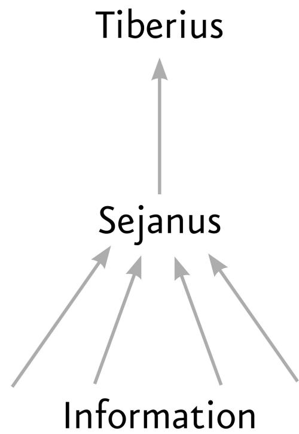

## CHAPTER 10

# Totalitarianism: All Power to the Algorithms?

D iscussions of the ethics and politics of the new computer network often focus on the fate of democracies. If authoritarian and totalitarian regimes are mentioned, it is mainly as the dystopian destination that "we" might reach if "we" fail to manage the computer network wisely. [\[1\]](#page-494-0) However, as of 2024, more than half of "us" already live under authoritarian or totalitarian regimes, [\[2\]](#page-494-1) many of which were established long before the rise of the computer network. To understand the impact of algorithms and AI on humankind, we should ask ourselves what their impact will be not only on democracies like the United States and Brazil but also on the Chinese Communist Party and the royal house of Saud.

As explained in previous chapters, the information technology available in premodern eras made both large-scale democracy and large-scale totalitarianism unworkable. Large polities like the Chinese Han Empire and the eighteenth-century Saudi emirate of Diriyah were usually limited autocracies. In the twentieth century, new information technology enabled the rise of both large-scale democracy and large-scale totalitarianism, but totalitarianism suffered from a severe disadvantage. Totalitarianism seeks to

channel all information to one hub and process it there. Technologies like the telegraph, the telephone, the typewriter, and the radio facilitated the centralization of information, but they couldn't process the information and make decisions by themselves. This remained something that only humans could do.

The more information flowed to the center, the harder it became to process it. Totalitarian rulers and parties often made costly mistakes, and the system lacked mechanisms to identify and correct these errors. The democratic way of distributing information—and the power to make decisions—between many institutions and individuals worked better. It could cope far more efficiently with the flood of data, and if one institution made a wrong decision, it could eventually be rectified by others.

The rise of machine-learning algorithms, however, may be exactly what the Stalins of the world have been waiting for. AI could tilt the technological balance of power in favor of totalitarianism. Indeed, whereas flooding people with data tends to overwhelm them and therefore leads to errors, flooding AI with data tends to make it more efficient. Consequently, AI seems to favor the concentration of information and decision making in one place.

Even in democratic countries, a few corporations like Google, Facebook, and Amazon have become monopolies in their domains, partly because AI tips the balance in favor of the giants. In traditional industries like restaurants, size isn't an overwhelming advantage. McDonald's is a worldwide chain that feeds more than fifty million people a day, [\[3\]](#page-494-2) and its size gives it many advantages in terms of costs, branding, and so forth. You can nevertheless open a neighborhood restaurant that could hold its own against the local McDonald's. Even though your restaurant might be serving just two hundred customers a day, you still have a chance of making better food than McDonald's and gaining the loyalty of happier customers.

It works differently in the information market. The Google search engine is used every day by between two and three billion people making 8.5 billion searches. [\[4\]](#page-494-3) Suppose a local start-up search engine tries to compete with Google. It doesn't stand a chance. Because Google is already used by billions, it has so much more data at its disposal that it can train far better algorithms,

which will attract even more traffic, which will be used to train the next generation of algorithms, and so on. Consequently, in 2023 Google controlled 91.5 percent of the global search market. [\[5\]](#page-494-4)

Or consider genetics. Suppose several companies in different countries try to develop an algorithm that identifies connections between genes and medical conditions. New Zealand has a population of 5 million people, and privacy regulations restrict access to their genetic and medical records. China has about 1.4 billion inhabitants and laxer privacy regulations. [\[6\]](#page-494-5) Who do you think has a better chance of developing a genetic algorithm? If Brazil then wants to buy a genetic algorithm for its health-care system, it would have a strong incentive to opt for the much more accurate Chinese algorithm than the one from New Zealand. If the Chinese algorithm then hones itself on more than 200 million Brazilians, it will get even better. Which would prompt more countries to choose the Chinese algorithm. Soon enough, most of the world's medical information would flow to China, making its genetic algorithm unbeatable.

The attempt to concentrate all information and power in one place, which was the Achilles' heel of twentieth-century totalitarian regimes, might become a decisive advantage in the age of AI. At the same time, as noted in an earlier chapter, AI could also make it possible for totalitarian regimes to establish total surveillance systems that make resistance almost impossible.

Some people believe that blockchain could provide a technological check on such totalitarian tendencies, because blockchain is inherently friendly to democracy and hostile to totalitarianism. In a blockchain system, decisions require the approval of 51 percent of users. That may sound democratic, but blockchain technology has a fatal flaw. The problem lies with the word "users." If one person has ten accounts, she counts as ten users. If a government controls 51 percent of accounts, then the government constitutes 51 percent of the users. There are already examples of blockchain networks where a government is 51 percent of users. [\[7\]](#page-494-6)

And when a government is 51 percent of users in a blockchain, it has control not just over the chain's present but even over its past. Autocrats have always wanted the power to change the past. Roman emperors, for example,

frequently engaged in the practice of damnatio memoriae—expunging the memory of rivals and enemies. After the emperor Caracalla murdered his brother and competitor for the throne, Geta, he tried to obliterate the latter's memory. Inscriptions bearing Geta's name were chiseled out, coins bearing his effigy were melted down, and the mere mentioning of Geta's name was punishable by death. [\[8\]](#page-495-0) One surviving painting from the time, the Severan Tondo, was made during the reign of their father—Septimius Severus—and originally showed both brothers together with Septimius and their mother, Julia Domna. But someone later obliterated Geta's face and even smeared excrement over it. Forensic analysis identified tiny pieces of dry shit where Geta's face should have been. [\[9\]](#page-495-1)

Modern totalitarian regimes have been similarly fond of changing the past. After Stalin rose to power, he made a supreme effort to delete Trotsky—the architect of the Bolshevik Revolution and the founder of the Red Army from all historical records. During the Stalinist Great Terror of 1937–39, whenever prominent people like Nikolai Bukharin and Marshal Mikhail Tukhachevsky were purged and executed, evidence of their existence was erased from books, academic papers, photographs, and paintings. [\[10\]](#page-495-2) This degree of erasure demanded a huge manual effort. With blockchain, changing the past would be far easier. A government that controls 51 percent of users can disappear people from history at the press of a button.

#### THE BOT PRISON

While there are many ways in which AI can cement central power, authoritarian and totalitarian regimes have their own problems with it. First and foremost, dictatorships lack experience in controlling inorganic agents. The foundation of every despotic information network is terror. But computers are not afraid of being imprisoned or killed. If a chatbot on the Russian internet mentions the war crimes committed by Russian troops in Ukraine, tells an irreverent joke about Vladimir Putin, or criticizes the corruption of Putin's United Russia party, what could the Putin regime do to

that chatbot? FSB agents cannot imprison it, torture it, or threaten its family. The government could of course block or delete it, and try to find and punish its human creators, but this is a much more difficult task than disciplining human users.

In the days when computers could not generate content by themselves, and could not hold an intelligent conversation, only a human being could express dissenting opinions on Russian social network channels like VKontakte and Odnoklassniki. If that human being was physically in Russia, they risked the wrath of the Russian authorities. If that human being was physically outside Russia, the authorities could try to block their access. But what happens if Russian cyberspace is filled by millions of bots that can generate content and hold conversations, learning and developing by themselves? These bots might be preprogrammed by Russian dissidents or foreign actors to intentionally spread unorthodox views, and it might be impossible for the authorities to prevent it. Even worse, from the viewpoint of Putin's regime, what happens if authorized bots gradually develop dissenting views by themselves, simply by collecting information on what is happening in Russia and spotting patterns in it?

That's the alignment problem, Russian-style. Russia's human engineers can do their best to create AIs that are totally aligned with the regime, but given the ability of AI to learn and change by itself, how can the human engineers ensure that the AI never deviates into illicit territory? It is particularly interesting to note that as George Orwell explained in Nineteen Eighty-Four, totalitarian information networks often rely on doublespeak. Russia is an authoritarian state that claims to be a democracy. The Russian invasion of Ukraine has been the largest war in Europe since 1945, yet officially it is defined as a "special military operation," and referring to it as a "war" has been criminalized and is punishable by a prison term of up to three years or a fine of up to fifty thousand rubles. [\[11\]](#page-495-3)

The Russian Constitution makes grandiose promises about how "everyone shall be guaranteed freedom of thought and speech" (Article 29.1), how "everyone shall have the right freely to seek, receive, transmit, produce and disseminate information" (29.4), and how "the freedom of the mass media

shall be guaranteed. Censorship shall be prohibited" (29.5). Hardly any Russian citizen is naive enough to take these promises at face value. But computers are bad at understanding doublespeak. A chatbot instructed to adhere to Russian law and values might read that constitution and conclude that freedom of speech is a core Russian value. Then, after spending a few days in Russian cyberspace and monitoring what is happening in the Russian information sphere, the chatbot might start criticizing the Putin regime for violating the core Russian value of freedom of speech. Humans too notice such contradictions but avoid pointing them out, due to fear. But what would prevent a chatbot from pointing out damning patterns? And how might Russian engineers explain to a chatbot that though the Russian Constitution guarantees all citizens freedom of speech and forbids censorship, the chatbot shouldn't actually believe the constitution or ever mention the gap between theory and reality? As the Ukrainian guide told me at Chernobyl, people in totalitarian countries grow up with the idea that questions lead to trouble. But if you train an algorithm on the principle that "questions lead to trouble," how will that algorithm learn and develop?

Finally, if the government adopts some disastrous policy and then changes its mind, it usually covers itself by blaming the disaster on someone else. Humans learn the hard way to forget facts that might get them in trouble. But how would you train a chatbot to forget that the policy vilified today was actually the official line only a year ago? This is a major technological challenge that dictatorships will find difficult to deal with, especially as chatbots become more powerful and more opaque.

Of course, democracies face analogous problems with chatbots that say unwelcome things or raise dangerous questions. What happens if despite the best efforts of Microsoft or Facebook engineers, their chatbot begins spewing racist slurs? The advantage of democracies is that they have far more leeway in dealing with such rogue algorithms. Because democracies take freedom of speech seriously, they keep far fewer skeletons in their closet, and they have developed a relatively high level of tolerance even to antidemocratic speech. Dissident bots will present a far bigger challenge to totalitarian regimes that have entire cemeteries in their closets and zero tolerance of criticism.

## ALGORITHMIC TAKEOVER

In the long term, totalitarian regimes are likely to face an even bigger danger: instead of criticizing them, an algorithm might gain control of them. Throughout history, the biggest threat to autocrats usually came from their own subordinates. As noted in chapter 5, no Roman emperor or Soviet premier was toppled by a democratic revolution, but they were always in danger of being overthrown or turned into puppets by their own subordinates. If a twenty-first-century autocrat gives computers too much power, that autocrat might become their puppet. The last thing a dictator wants is to create something more powerful than himself, or a force that he does not know how to control.

To illustrate the point, allow me to use an admittedly outlandish thought experiment, the totalitarian equivalent of Bostrom's paper-clip apocalypse. Imagine that the year is 2050, and the Great Leader is woken up at four in the morning by an urgent call from the Surveillance & Security Algorithm. "Great Leader, we are facing an emergency. I've crunched trillions of data points, and the pattern is unmistakable: the defense minister is planning to assassinate you in the morning and take power himself. The hit squad is ready, waiting for his command. Give me the order, though, and I'll liquidate him with a precision strike."

"But the defense minister is my most loyal supporter," says the Great Leader. "Only yesterday he said to me—"

"Great Leader, I know what he said to you. I hear everything. But I also know what he said afterward to the hit squad. And for months I've been picking up disturbing patterns in the data."

"Are you sure you were not fooled by deepfakes?"

"I'm afraid the data I relied on is 100 percent genuine," says the algorithm. "I checked it with my special deepfake-detecting sub-algorithm. I can explain exactly how we know it isn't a deepfake, but that would take us a couple of weeks. I didn't want to alert you before I was sure, but the data points converge on an inescapable conclusion: a coup is under way. Unless we act

now, the assassins will be here in an hour. But give me the order, and I'll liquidate the traitor."

By giving so much power to the Surveillance & Security Algorithm, the Great Leader has placed himself in an impossible situation. If he distrusts the algorithm, he may be assassinated by the defense minister, but if he trusts the algorithm and purges the defense minister, he becomes the algorithm's puppet. Whenever anyone tries to make a move against the algorithm, the algorithm knows exactly how to manipulate the Great Leader. Note that the algorithm doesn't need to be a conscious entity to engage in such maneuvers. As Bostrom's paper-clip thought experiment indicates—and as GPT-4 lying to the TaskRabbit worker demonstrated on a small scale—a nonconscious algorithm may seek to accumulate power and manipulate people even without having any human drives like greed or egotism.

If algorithms ever develop capabilities like those in the thought experiment, dictatorships would be far more vulnerable to algorithmic takeover than democracies. It would be difficult for even a super-Machiavellian AI to seize power in a distributed democratic system like the United States. Even if the AI learns to manipulate the U.S. president, it might face opposition from Congress, the Supreme Court, state governors, the media, major corporations, and sundry NGOs. How would the algorithm, for example, deal with a Senate filibuster?

Seizing power in a highly centralized system is much easier. When all power is concentrated in the hands of one person, whoever controls access to the autocrat can control the autocrat—and the entire state. To hack the system, one needs to learn to manipulate just a single individual. An archetypal case is how the Roman emperor Tiberius became the puppet of Lucius Aelius Sejanus, the commander of the Praetorian Guard.

The Praetorians were initially established by Augustus as a small imperial bodyguard. Augustus appointed two prefects to command the bodyguard so that neither could gain too much power over him. [\[12\]](#page-495-4) Tiberius, however, was not as wise. His paranoia was his greatest weakness. Sejanus, one of the two Praetorian prefects, artfully played on Tiberius's fears. He constantly uncovered alleged plots to assassinate Tiberius, many of which were pure

fantasies. The suspicious emperor grew more distrustful of everyone except Sejanus. He made Sejanus sole prefect of the Praetorian Guard, expanded it into an army of twelve thousand, and gave Sejanus's men additional roles in policing and administrating the city of Rome. Finally, Sejanus persuaded Tiberius to move out of the capital to Capri, arguing that it would be much easier to protect the emperor on a small island than in a crowded metropolis full of traitors and spies. In truth, explained the Roman historian Tacitus, Sejanus's aim was to control all the information reaching the emperor: "Access to the emperor would be under his own control, and letters, for the most part being conveyed by soldiers, would pass through his hands."[\[13\]](#page-495-5)

With the Praetorians controlling Rome, Tiberius isolated in Capri, and Sejanus controlling all information reaching Tiberius, the Praetorian commander became the true ruler of the empire. Sejanus purged anyone who might oppose him—including members of the imperial family—by falsely accusing them of treason. Since nobody could contact the emperor without Sejanus's permission, Tiberius was reduced to a puppet.

Eventually someone—perhaps Tiberius's sister-in-law Antonia—located an opening in Sejanus's information cordon. A letter was smuggled to the emperor, explaining to him what was going on. But by the time Tiberius woke up to the danger and resolved to get rid of Sejanus, he was almost helpless. How could he topple the man who controlled not just the bodyguards but also all communications with the outside world? If he tried to make a move, Sejanus could imprison him on Capri indefinitely and inform the Senate and the army that the emperor was too ill to travel anywhere.

Tiberius nevertheless managed to turn the tables on Sejanus. As Sejanus grew in power and became preoccupied with running the empire, he lost touch with the day-to-day minutiae of Rome's security apparatus. Tiberius managed to secretly gain the support of Naevius Sutorius Macro, commander of Rome's fire brigade and night watch. Macro orchestrated a coup against Sejanus, and as a reward Tiberius made Macro the new commander of the Praetorian Guard. A few years later, Macro had Tiberius killed. [\[14\]](#page-495-6)

Power lies at the nexus where the information channels merge. Since Tiberius allowed the information channels to merge in the person of Sejanus, the latter became the true center of power, while Tiberius was reduced to a puppet.

The fate of Tiberius indicates the delicate balance that all dictators must strike. They try to concentrate all information in one place, but they must be careful that the different channels of information are allowed to merge only in their own person. If the information channels merge somewhere else, that then becomes the true nexus of power. When the regime relies on humans like Sejanus and Macro, a skillful dictator can play them one against the other in order to remain on top. Stalin's purges were all about that. Yet when a regime relies on a powerful but inscrutable AI that gathers and analyzes all information, the human dictator is in danger of losing all power. He may

remain in the capital and yet be isolated on a digital island, controlled and manipulated by the AI.

### THE DICTATOR'S DILEMMA

In the next few years, the dictators of our world face more urgent problems than an algorithmic takeover. No current AI system can manipulate regimes at such a scale. However, totalitarian systems are already in danger of putting far too much trust in algorithms. Whereas democracies assume that everyone is fallible, in totalitarian regimes the fundamental assumption is that the ruling party or the supreme leader is always right. Regimes based on that assumption are conditioned to believe in the existence of an infallible intelligence and are reluctant to create strong self-correcting mechanisms that might monitor and regulate the genius at the top.

Until now such regimes placed their faith in human parties and leaders and were hothouses for the growth of personality cults. But in the twenty-first century this totalitarian tradition prepares them to expect AI infallibility. Systems that could believe in the perfect genius of a Mussolini, a Ceauşescu, or a Khomeini are primed to also believe in the flawless genius of a superintelligent computer. This could have disastrous results for their citizens, and potentially for the rest of the world as well. What happens if the algorithm in charge of environmental policy makes a big mistake, but there are no self-correcting mechanisms that can identify and correct its error? What happens if the algorithm running the state's social credit system begins terrorizing not just the general population but even the members of the ruling party and simultaneously begins to label anyone who questions its policies "an enemy of the people"?

Dictators have always suffered from weak self-correcting mechanisms and have always been threatened by powerful subordinates. The rise of AI may greatly exacerbate these problems. The computer network therefore presents dictators with an excruciating dilemma. They could decide to escape the clutches of their human underlings by trusting a supposedly infallible

technology, in which case they might become the technology's puppet. Or, they could build a human institution to supervise the AI, but that institution might limit their own power, too.

If even just a few of the world's dictators choose to put their trust in AI, this could have far-reaching consequences for the whole of humanity. Science fiction is full of scenarios of an AI getting out of control and enslaving or eliminating humankind. Most sci-fi plots explore these scenarios in the context of democratic capitalist societies. This is understandable. Authors living in democracies are obviously interested in their own societies, whereas authors living in dictatorships are usually discouraged from criticizing their rulers. But the weakest spot in humanity's anti-AI shield is probably the dictators. The easiest way for an AI to seize power is not by breaking out of Dr. Frankenstein's lab but by ingratiating itself with some paranoid Tiberius.

This is not a prophecy, just a possibility. After 1945, dictators and their subordinates cooperated with democratic governments and their citizens to contain nuclear weapons. On July 9, 1955, Albert Einstein, Bertrand Russell, and a number of other eminent scientists and thinkers published the Russell-Einstein Manifesto, calling on the leaders of both democracies and dictatorships to cooperate on preventing nuclear war. "We appeal," said the manifesto, "as human beings, to human beings: remember your humanity, and forget the rest. If you can do so, the way lies open to a new Paradise; if you cannot, there lies before you the risk of universal death."[\[15\]](#page-495-7) This is true of AI too. It would be foolish of dictators to believe that AI will necessarily tilt the balance of power in their favor. If they aren't careful, AI will just grab power to itself.

#### [OceanofPDF.com](https://oceanofpdf.com/)