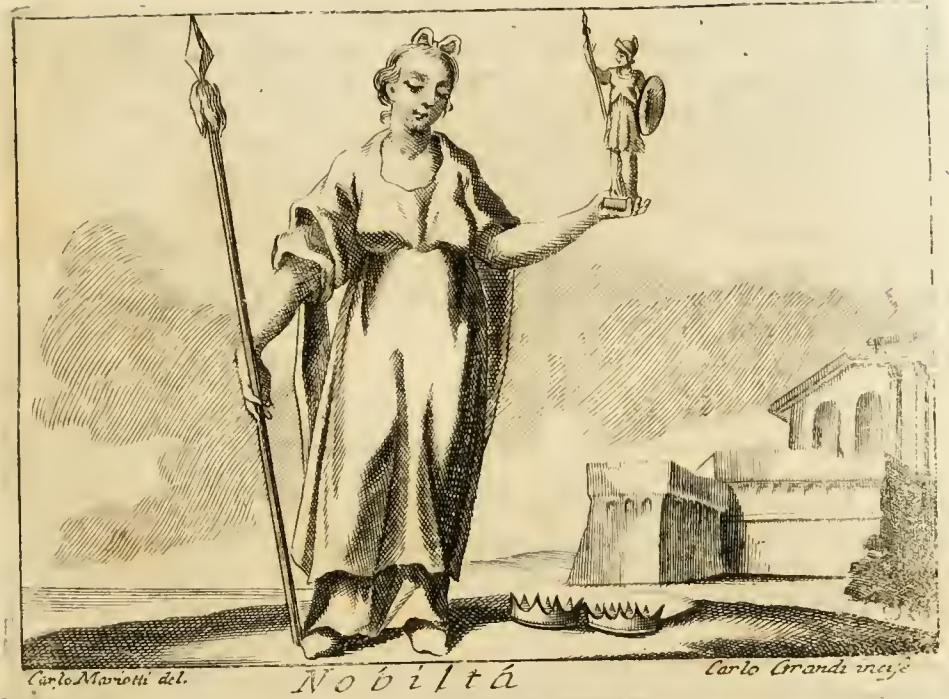

# 리파의 '귀족성(Nobiltà)' 의인화

## 질문

리파는 '귀족성(Nobiltà)'을 어떻게 의인화했는가?

## 답

**게타(Geta) 메달을 따라, 위엄 있는 옷차림의 여인이 오른손에 창을, 왼손에 미네르바 상을 든 모습**이다.
위엄 있는 옷은 귀족에게 요구되는 진중한 몸가짐과 품행을 뜻하고, 창과 미네르바 상은 귀족성이 **학문 또는 무예의 명성**으로 획득됨을 뜻한다 — 미네르바가 유피테르의 머리(지성)에서 태어나 학문과 무예 모두의 수호신이기 때문이다.

---

## 원문 (Iconologia, "NOBILTÀ" 첫 항목)

> **D**onna in abito grave, con un'asta nella mano destra, e nella sinistra col simulacro di Minerva, come si vede nella medaglia di Geta. La gravità dell'abito significa le maniere, e i costumi gravi, che nella persona nobile si ricercano.
>
> L'asta, e il simulacro di Minerva, dimostrano, che per la fama, o delle scienze, o delle armi, la nobiltà si acquista; essendo Minerva protettrice, secondo il credere de' Poeti, degli uni e degli altri egualmente; per esser nata dal capo di Giove, che è il discorso, e l'intelletto, per mezzo del quale questi hanno il valore, e la fama.

번역:

> 위엄 있는 옷(abito grave)을 입은 여인. 오른손에는 창(asta)을, 왼손에는 미네르바의 상(simulacro di Minerva)을 들었다. 게타의 메달에서 보이는 그대로다. 옷의 위엄은 귀족인 사람에게 요구되는 진중한 태도와 품행을 뜻한다.
>
> 창과 미네르바 상은 귀족성이 **학문의 명성으로든 무예의 명성으로든** 획득된다는 것을 보여준다. 시인들의 믿음에 따르면 미네르바는 이 둘 모두의 수호신이기 때문이다. 미네르바는 유피테르의 머리에서 태어났는데, 그 머리란 곧 **말(이성, discorso)과 지성(intelletto)** 이며, 학문과 무예는 바로 그것을 통해 가치와 명성을 얻는다.

## 판화에서 실제로 보이는 것

판화 하단에 표제 **`Nobiltà`** 가 적혀 있고, 좌우 여백에 `Carlo Mariotti del.`(도안) / `Carlo Grandi incise`(판각) 서명이 있다. 관찰되는 요소를 원문과 하나씩 맞춰 보면:

| 판화의 요소 | 원문 대응 | 의미 |
|---|---|---|
| 발목까지 내려오는 길고 무거운 겉옷, 어깨에 두른 망토 | `abito grave` (위엄 있는 옷) | 귀족에게 요구되는 **진중한 몸가짐과 품행**(maniere e costumi gravi) |
| 오른손(그림에서 왼쪽)에 쥔, 키보다 긴 창 — 끝에 작은 깃발/날 | `un'asta nella mano destra` | **무예(armi)** 의 명성 |
| 왼손(그림에서 오른쪽) 손바닥에 받쳐 든 작은 조각상 — 투구를 쓰고 방패와 창을 든 여신 | `il simulacro di Minerva` | **학문(scienze)** 의 명성 |
| 발밑 땅에 놓인 두 개의 관(crown) | 같은 'Nobiltà' 항목의 **세 번째** 변형(금관·은관) | 영혼의 선(beni dell'anima)과 육체의 선(beni del corpo) |
| 배경의 고대 건축·아치 폐허 | (텍스트에 없음) | 가문의 오래된 혈통·고대성을 암시하는 화가의 첨가 |

즉 이 한 장의 판화는 리파가 'Nobiltà' 항목에 나란히 실은 **세 가지 서술 중 첫 번째를 주인공으로 삼고, 세 번째의 두 관을 발밑 소품으로 흘려 넣은** 합성 도상이다. 두 관을 첫 번째 서술의 일부로 착각하지 않도록 주의.

## 왜 '게타의 메달'인가 — 실제 로마 화폐

리파의 전형적인 작업 방식은 고대 화폐(medaglie)·조각·상형문자집(피에리오 발레리아노 등)에서 도상을 끌어오는 것인데, 이 항목은 **실제로 존재하는 로마 제국 화폐를 거의 그대로 옮긴 드문 사례**다.

- 인물: **푸블리우스 셉티미우스 게타**(Publius Septimius Geta, 셉티미우스 세베루스의 아들, 카라칼라의 동생). 카이사르 신분이던 시기(서기 199~202년경) 로마 조폐소 발행 데나리우스.
- 앞면: `P SEPT GETA CAES PONT` + 게타의 흉상.
- 뒷면 명문이 문자 그대로 **`NOBILITAS`** — 의인화된 노빌리타스가 서서 한 손에 **홀(sceptrum)**, 다른 손에 **팔라디움(Palladium, 투구 쓴 팔라스=미네르바의 작은 신상)** 을 들고 있다.

리파의 "오른손의 asta"는 이 화폐 뒷면의 긴 **홀/창**을 가리키고, "왼손의 미네르바 상"은 뻗은 손에 받쳐 든 **팔라디움**이다. 판화가는 홀을 명확히 창(무기)으로 그려 '무예' 쪽 해석을 시각적으로 강화했다.

> 참고: 노빌리타스 화폐 도상의 작은 신상은 문헌에서 관례적으로 '팔라디움'이라 불리지만, 엄밀히는 방패+창을 든 팔라디움형과 홀을 든 형이 섞여 있다. 리파가 본 판본에서는 투구를 쓴 여신으로 보였고, 그는 이를 미네르바로 확정해 읽었다.

## 논증의 핵심 고리: 왜 미네르바 하나로 학문과 무예를 둘 다 커버하는가

이 카드에서 가장 자주 놓치는 부분이 **미네르바의 탄생 신화를 매개로 한 삼단 연결**이다.

1. 미네르바(아테나)는 어머니의 배가 아니라 **유피테르의 머리에서, 완전 무장한 채로** 태어났다.
2. 리파는 이 '머리'를 알레고리적으로 **`discorso`(이성·말)와 `intelletto`(지성)** 로 읽는다.
3. 그래서 미네르바는 **지성에서 태어난 여신**이면서 동시에 **무장한 여신**이다 → 시인들의 통념에 따라 **학문의 수호신이자 전쟁의 수호신**을 겸한다.
4. 학문(scienze)이든 무예(armi)든 그 가치(valore)와 명성(fama)은 결국 지성에서 나오므로, 미네르바 상 하나가 두 경로를 함께 표상한다.
5. 결론: **귀족성은 태생이 아니라 학문 또는 무예로 얻은 명성에서 획득된다.** 창(무예) + 미네르바 상(학문)의 짝은 이 "둘 중 하나로 도달 가능한 두 갈래 길"을 시각화한 것이다.

이는 르네상스의 상투적 대립쌍 **"무기와 문자(arme e lettere / arms and letters)"** — 귀족의 두 가지 정당한 이력 — 을 그대로 도상화한 것이기도 하다.

## 같은 항목의 나머지 두 변형 (구별용)

리파는 'Nobiltà' 아래에 세 가지 서술을 연달아 놓는다. 카드가 묻는 것은 **첫 번째**다.

| # | 형상 | 의미 |
|---|---|---|
| 1 (카드) | 위엄 있는 옷, 오른손에 **창**, 왼손에 **미네르바 상** — *게타의 메달* | 귀족성은 학문 또는 무예의 명성으로 획득된다 |
| 2 | 값비싼 **토가(togata riccamente)** 를 입고 머리에 **별**, 손에 **홀** | 로마에서 긴 옷(veste lunga)은 비귀족(ignobili)에게 금지되었다. 별 = 영혼의 빛남을 먼저 추구하고, 홀 = 그다음에 육체의 편익을 추구하는 것이 고귀한 정신의 행동. 귀족성은 **맑고 빛나는 정신의 덕(virtù)** 에서 태어나고, 세속의 부(ricchezze)로 쉽게 유지된다 |
| 3 | **장년(matura età)** 의 여인, 다소 건장하고 균형 잡힌 몸, **검은 옷**을 단정히 입고, 손에 **금관과 은관** 두 개 | 나이를 장년으로 한 것은, 귀족성의 시작(유년)도 끝(노년 = 이름만 남은 카이사르 가문의 낡은 옛 혈통)도 참된 귀족성이라 할 수 없다는 뜻(아르니지오 『Veglie』). 검은 옷 = 옷의 화려함 없이도 스스로 빛나고 저명함. 두 관 = **영혼의 선과 육체의 선**, 둘이 함께 귀족성을 이룬다 |

세 변형이 공통으로 밀고 있는 논지는 하나다: **귀족성은 물려받은 이름(옛 혈통·화려한 의복)이 아니라 덕과 성취로 성립한다.**

## 출처 정보

- 텍스트/판화 출처 파일: `.fm/assets/10 Nobility to Obligation.md` (1~9행), 참조 이미지 `Iconologia (Cesare Ripa)/_page_236_Picture_3.jpeg`
- 원저: 체사레 리파(Cesare Ripa, 1560?~1645), 『Iconologia』 — 초판 1593년(무도판), 1603년부터 도판 수록.
- 이 판화가 실린 판본: 체사레 오를란디(Cesare Orlandi) 편, 전 5권, 페루자 Piergiovanni Costantini 인쇄, 1764~1767년. 도안 **카를로 스피리디오네 마리오티**(Carlo Spiridione Mariotti), 판각 주로 **카를로 그란디**(Carlo Grandi)·프란체스코 파첸다.

### 참고 링크

- [Nobilitas on Roman Coins — Forum Ancient Coins](https://www.forumancientcoins.com/moonmoth/reverse_nobilitas.html)
- [Geta as Caesar Denarius, NOBILITAS reverse (Sear 7184) — WildWinds](http://www.wildwinds.com/coins/sear5/s7184.html)
- [Cesare Ripa — Wikipedia](https://en.wikipedia.org/wiki/Cesare_Ripa)

## 암기 포인트

- 출처 한 단어: **게타(Geta)의 메달** = 실존하는 `NOBILITAS` 명문 데나리우스.
- 지물 두 개: **창 = 무예**, **미네르바 상 = 학문**. (창을 오른손, 상을 왼손)
- 옷 하나: **abito grave(위엄 있는 옷) = 진중한 몸가짐과 품행**.
- 연결 고리: **미네르바 = 유피테르의 머리(=지성)에서 태어남 → 학문·무예 양쪽의 수호신 → 그래서 하나로 둘을 표상**.
- 발밑의 두 관은 이 항목이 아니라 **세 번째 변형**(금관·은관 = 영혼의 선 + 육체의 선)에서 온 것.
