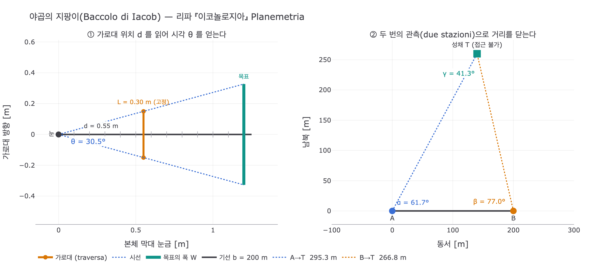

# 평면측량술 (PLANEMETRIA) — 체사레 리파

## 카드 요약

**Q.** 리파는 '평면측량술(Planemetria)'을 어떻게 의인화했는가?

**A.** 넓고 아름다운 들판에서 두 손으로 '야곱의 지팡이(Baccolo di Iacob)'를 우아하게 든 여인. 발치에는 다림추(archipendolo)가 놓여 있다. 평면측량술은 땅 표면의 길이와 폭을 재는 기하학의 기술이고, 군사 기술에서는 사람이 다가갈 수 없는 곳의 거리·폭까지 잰다. 야곱의 지팡이는 앞뒤로 움직이는 가로대와 **두 번의 관측(due sole stazioni)** 만으로 그 측량을 해내는 도구다.

---

## 1. 원문 (『이코놀로지아』 제4권, PLANEMETRIA 항목)

> **Donna in una toga, e bellissima campagna**, che con leggiadra dimostrazione tenga con ambe le mani … **il Baccolo di Iacob** … col quale, con arte ed opera di detto stromento si mostra il pigliare le distanze, sì delle lunghezze e larghezze di detta campagna, come anche per ritrovare qualsivoglia piano. **Appiè di detta figura vi sarà ancora un archipendolo.**
>
> La Planemetria è arte geometrica, la quale misura la lunghezza e larghezza di qualsivoglia superficie della terra, ed ancora dimostra per l'arte militare il pigliare le distanze, larghezze e lontananze, **per dove l'Uomo non si possa accostare** …
>
> Le si dà il Baccolo di Iacob, essendo che il detto stromento opera **per via della traversa, che corre innanzi e indietro, con due sole stazioni**, colle quali si fanno le operazioni sopraddette.

(asset: `16 Perturbation to Poverty.md`, 340–350행. OCR가 상당히 깨져 있어 위 인용은 정서한 것)

---

## 2. 도상 읽기

판화에서 실제로 관찰되는 요소를 원문 지시와 하나씩 대응시키면:

| 도상 요소 | 원문 | 의미 |
|---|---|---|
| **긴 막대 + 그 위를 가로지르는 짧은 막대**를 두 손으로 잡은 여인 | `tenga con ambe le mani il Baccolo di Iacob` | 야곱의 지팡이(cross-staff). 세로 본체(자막대)와 직각으로 끼워져 앞뒤로 미끄러지는 가로대(traversa)로 구성 |
| 인물이 서 있는 **탁 트인 벌판과 원경의 성채·언덕** | `bellissima campagna` | 측량 대상이 되는 지표면. 멀리 보이는 **성벽 도시**는 "사람이 다가갈 수 없는 곳"(군사 측량)의 시각적 표현 |
| **왼쪽 배경의 작은 인물** — 또 한 명이 같은 자세로 도구를 들고 서 있음 | `con due sole stazioni` | 같은 측량자가 **두 번째 관측 지점**에 선 모습. 한 그림 안에 시점 이동을 겹쳐 그려 "두 번의 관측"을 표현했다 |
| 가로대를 올려놓은 **직육면체 석재** | (기재 없음) | 관측대. 지팡이를 수평·고정된 높이로 유지하기 위한 받침 |
| 앞쪽 바닥의 **A자형 삼각 틀에 매달린 추** | `Appiè di detta figura vi sarà ancora un archipendolo` | **archipendolo** = 추(다림추)를 매단 목수·석공의 수평기. 추가 삼각형의 밑변 중앙 눈금에 오면 밑변이 수평이다. 평면측량은 "수평면 위의 길이"를 재는 일이므로, 기준면이 수평임을 보증하는 도구가 반드시 따라붙는다 |
| 그 옆의 **곱자(직각자) 모양 도구** | — | 직각을 세우는 도구. 삼각측량에서 기선(基線)에 직각을 잡을 때 쓰임 |

### 왜 여인이고, 왜 "우아한 시연(leggiadra dimostrazione)"인가
리파의 학예 의인상은 관례적으로 여성이다(라틴어·이탈리아어에서 학문 이름이 여성명사). 여기서 중요한 것은 인물이 도구를 **소지**하는 데 그치지 않고 실제로 **겨누는 동작**을 하고 있다는 점이다. 평면측량술은 사변적 기하학(Geometria)의 하위 분과이면서, 손과 눈으로 수행되는 **실천적 기술**임을 자세로 말한다. 리파 자신도 "그 성질에 대해서는 이미 **Geometria** 도상에서 부분적으로 말했다"며 이 항목을 기하학의 한 갈래로 명시한다.

---

## 3. '야곱의 지팡이'란 무엇인가

- 이탈리아어 `Baccolo di Iacob`, 라틴어 *baculus Iacob* / *radius astronomicus*, 영어 **cross-staff**, 한국어로는 흔히 **십자 측간(十字測竿)**.
- 이름의 유래는 창세기 32:10 "내가 내 지팡이만 가지고 이 요단을 건넜더니"라는 구절, 그리고 오리온자리의 삼태성을 가리키는 별칭 'Jacob's staff'에서 왔다고 본다.
- 이론적 기술은 14세기 프로방스의 유대 학자 **레비 벤 게르숀(Gersonides, 1288–1344)** 의 저술이 최초로 알려져 있고, 16세기에는 **게마 프리시우스(Gemma Frisius)** 등을 거쳐 항해·측량·천문의 표준 도구가 되었다.
- 구조: 눈금이 새겨진 **본체 막대(radius)** + 그것과 직교해 **앞뒤로 미끄러지는 가로대(transversarium / traversa)**.

### 측정 원리 (핵심 한 줄)

본체 막대 끝을 눈에 대고, 가로대의 **양 끝이 목표의 양 끝(탑의 위·아래, 또는 벌판 폭의 두 경계)에 정확히 겹칠 때까지** 가로대를 앞뒤로 민다. 그때 눈에서 가로대까지의 거리 $d$를 막대 눈금에서 읽으면, 가로대 길이 $L$에 대해

$$\tan\frac{\theta}{2}=\frac{L/2}{d}\qquad\Longrightarrow\qquad \theta = 2\arctan\frac{L}{2d}$$

즉 **길이 눈금 하나를 읽는 것만으로 시각(視角) $\theta$를 얻는다.** 각도기 없이 각을 재는 장치라는 점이 이 도구의 본질이다.

### "두 번의 관측(due sole stazioni)"

접근 불가능한 목표까지의 거리 $D$는 각 하나로는 풀리지 않는다. 그래서 **기선(base) $b$ 만큼 떨어진 두 지점 A, B에서 각각 목표를 겨눠 두 각 $\alpha,\beta$를 얻고**, 삼각형을 닫는다:

$$\gamma = \pi - \alpha - \beta,\qquad D_A = b\,\frac{\sin\beta}{\sin\gamma}$$

이것이 판화 배경에 같은 인물이 두 번 등장하는 이유다. 원문 `con due sole stazioni ... colle quali si fanno le operazioni sopraddette`("두 번의 관측만으로 위의 작업들이 이루어진다")가 정확히 이 삼각측량 절차를 가리킨다.

목표의 **폭**은 한 지점에서도 구할 수 있다: 거리 $D$를 알면 시각 $\theta$로부터

$$W = 2D\tan\frac{\theta}{2} = D\cdot\frac{L}{d}$$

---

## 4. 함께 기억할 대비

| | Planemetria (평면측량술) | Geometria (기하학) |
|---|---|---|
| 대상 | 지표면의 길이·폭, 임의의 평면 | 도형 일반의 원리 |
| 도구 | 야곱의 지팡이 + archipendolo | 컴퍼스·구·자 등 |
| 성격 | 실천적·군사적 응용(접근 불가 지점 측량) | 사변적 학문 |
| 리파의 서술 | "기하학의 기술(arte geometrica)" | 상위 항목 |

암기 키워드 3종 세트: **벌판 · 야곱의 지팡이(움직이는 가로대) · 발치의 다림추**, 그리고 목적어 **"다가갈 수 없는 곳의 거리와 폭"**.

---

## 시각화

`expy.py`가 생성한 그림. 왼쪽은 눈–가로대–목표가 이루는 시각(視角) 측정 기하, 오른쪽은 기선 $b$ 위의 두 관측 지점으로 접근 불가 성채까지의 거리를 확정하는 삼각측량이다.

