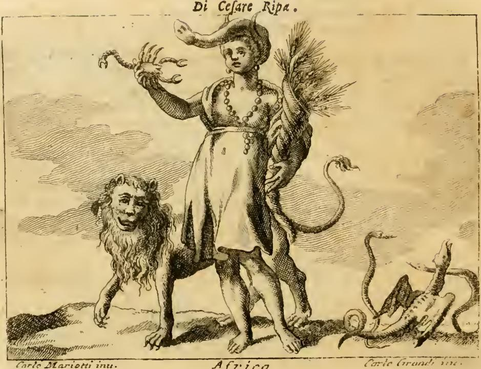

# 리파의 '아프리카(Affrica)' 의인상

## 카드 정리

**질문** — 리파는 '아프리카(Affrica)'를 어떻게 의인화했는가?

**답** — 곱슬머리에 거의 벗은 검은 피부의 여인. 머리에는 투구 장식(cimiero)처럼 코끼리 머리를 이고, 목에 산호 목걸이를, 두 귀에 산호 귀걸이를 걸었다. 오른손에 전갈을, 왼손에 밀 이삭이 가득한 풍요의 뿔(cornucopia)을 들었다. 한쪽 곁에는 아주 사나운 사자가, 다른 쪽에는 독사와 뱀들이 있다.

---

## 원문 (Iconologia, 「AFFRICA」 항목)

> *Donna mora, quasi nuda. Avrà li capelli crespi, tenendo in capo, come per cimiero, una testa di Elefante. Al collo abbia un filo di coralli, e di essi alle orecchia due pendenti. Colla destra mano tenga uno Scorpione, e colla sinistra un cornucopia pieno di spighe di grano. Da un lato appresso di lei vi sarà un ferocissimo Leone, e dall'altro vi saranno alcune Vipere, e Serpenti velenosi.*

거의 벌거벗은 검은 피부의 여인. 곱슬머리이며, 머리 위에 투구 장식처럼 코끼리 머리를 얹는다. 목에는 산호 한 줄, 그 산호로 만든 귀걸이 두 개. 오른손에는 전갈, 왼손에는 밀 이삭이 가득한 풍요의 뿔. 한쪽에는 극히 사나운 사자, 다른 쪽에는 살무사와 독사 몇 마리.

리파의 『이코놀로지아(Iconologia)』는 화가·조각가·시인이 추상 개념을 그림으로 옮길 때 참조하라고 만든 도상 사전이다. 대륙 항목은 **유럽 – 아시아 – 아프리카 – 아메리카** 순으로 이어지는 '세계의 네 부분(quattro parti del Mondo)' 연작에 속한다.

---

## 판화에서 실제로 보이는 것

판화 아래에는 `Africa`라는 표제와 함께 `Carlo Mariotti inv. / Carlo Grandi inc.`라는 서명이 있다(18세기 이탈리아어 판본의 삽화). 텍스트 지시와 그림을 하나씩 맞춰 보면:

| 원문 지시 | 판화에서 보이는 것 |
|---|---|
| 코끼리 머리를 투구 장식처럼 씀 | 머리 위에 코끼리 머리 가죽이 얹혀 있고, **코(probosside)가 앞으로 치켜올라가 깃털 장식처럼 휘어져** 있다. 코끼리의 상아·귀가 여인의 이마와 관자놀이를 감싼다 |
| 산호 목걸이·귀걸이 | 목에서 가슴까지 **알이 굵은 구슬 목걸이**가 두 줄로 늘어지고, 양 귀에 굵은 **드롭형 귀걸이**가 달려 있다 |
| 오른손에 전갈 | **오른팔을 높이 치켜들고** 집게와 마디 꼬리가 뚜렷한 전갈을 관람자 쪽으로 들어 보인다 |
| 왼손에 밀 이삭 가득한 풍요의 뿔 | 왼쪽 어깨 뒤로 **뿔에서 밀 이삭 다발이 쏟아져 나오는** 모습. 이삭 낟알이 하나하나 새겨져 있다 |
| 곁의 사나운 사자 | 화면 왼쪽에서 갈기를 세운 사자가 앞발을 내디디며 여인 곁을 지킨다(거의 사람 얼굴처럼 새겨진, 당대 판화 특유의 사자 얼굴) |
| 반대편의 독사와 뱀 | 오른쪽 아래 지면에 **뱀 두어 마리가 몸을 세워 똬리를 틀고** 있고, 풍요의 뿔 뒤로도 뱀 한 마리가 머리를 쳐들고 있다 |
| "거의 벌거벗은" | 실제 판화는 어깨와 다리를 드러낸 **얇은 짧은 튜닉** 차림으로 절충되어 있다. 팔·다리·얼굴은 촘촘한 해칭으로 어둡게 처리해 "mora(검은 피부)"를 표현했다 |

즉 **"거의 벌거벗음 + 코끼리 머리 관 + 산호 장신구 + 전갈 + 밀 이삭 풍요의 뿔 + 사자 + 뱀"** 일곱 요소가 이 도상의 체크리스트다.

---

## 각 지물의 이유 — 리파 자신의 해설

리파는 도상마다 "왜 그렇게 그리는가"를 고전 문헌으로 뒷받침한다.

**이름의 어원.** 'Affrica'는 *aprica*(양지바른, 볕에 드러난)에서 왔다고 본다. 추위가 없는 땅이라는 뜻이다. 혹은 요세푸스를 따라 아브라함의 후손 **아페르(Afro)**의 이름에서 왔다고도 한다.

**검은 피부(mora).** 아프리카가 남중(南中, mezzo dì) 아래, 일부는 **열대(zona torrida)**에 놓여 있어 그곳 사람들이 갈색·검은색 피부를 갖게 된다는 기후 결정론적 설명.

**벌거벗음.** "이 나라는 부(ricchezze)가 그리 많지 않기 때문"이라는 게 리파의 이유다. 금과 보석으로 치장한 아시아, 왕관과 왕홀에 둘러싸인 유럽과의 노골적인 대비다.

**코끼리 머리.** 근거는 **하드리아누스 황제의 메달(주화)**이다. 실제로 하드리아누스의 'AFRICA' 화폐에는 코끼리 가죽 머리쓰개를 쓰고 전갈과 풍요의 뿔을 든 여인이 기대어 누운 모습이 새겨져 있다. 리파는 여기에 "코끼리는 아프리카 고유의 짐승이며, 그곳 사람들이 전쟁에 끌고 나와 로마인 적들에게 처음에는 놀라움뿐 아니라 **공포(spavento)**를 주었다"는 역사적 기억(한니발의 전상 부대)을 덧붙인다.

**검고 곱슬한 머리·산호 장신구.** "그들 무어인(moreschi) 고유의 장식"이라는 설명. 지중해 산호 교역과 북아프리카 장신구 문화에 대한 당대 유럽의 관찰이 반영돼 있다.

**사자·전갈·독사.** 아프리카에 이런 짐승이 "매우 많고 무한히 독하다"는 뜻. 리파는 클라우디아누스를 인용해 **마우루시아(마우레타니아)의 땅은 다른 곳이 맹수를 선물로 바치듯 이 땅만은 독을 공물로 바친다**는 취지의 시구를 붙인다. 또 오비디우스 『변신 이야기』 4권을 끌어와, 페르세우스가 **메두사의 머리를 들고 리비아 사막 위를 날 때 떨어진 핏방울이 땅에 닿아 온갖 뱀이 되었고, 그래서 그 땅에 뱀이 들끓게 되었다**는 신화적 기원을 제시한다.

**밀 이삭의 풍요의 뿔.** 아프리카의 **곡물 풍요와 비옥함**을 뜻한다. 호라티우스의 "리비아의 타작마당에서 쓸어 담는 것"이라는 구절을 인용하고, 요한 뵈무스(Gio. Boemo, 『만민의 풍습·법·의례』)를 들어 **아프리카인은 한 해에 두 번 곡식을 거둔다**고 적는다. 로마 제국의 '곡창(annona)' 아프리카라는 고대의 인식이 그대로 이어진 것이다.

---

## 두 번째 「AFFRICA」 — 고대 메달본

리파는 같은 항목 뒤에 **고대 주화에서 뽑은 이형(異形)**을 덧붙인다.

- **세베루스 메달**: 왼손으로 **밧줄에 묶인 사자**를 붙든 여인.
- **하드리아누스 메달**: 오른손에 **전갈**, 왼손에 **풍요의 뿔**, **땅에 앉은** 자세.
- **코끼리 코를 머리에 인 아프리카** 상은 풀비오 오르시니가 정리한 켈리아·에피아·노르바나 가문의 화폐, 그리고 **퀸투스 카이킬리우스 메텔루스 피우스의 메달**에서 볼 수 있다고 안내한다.

정면상(위 판화)은 이 여러 고대 주화 도상을 **하나의 서 있는 인물로 합성**한 결과물인 셈이다.

---

## 당대 유럽 중심적 시선에 대하여

이 도상이 무엇을 '알려주는가'보다 중요한 것은, 그것이 **누구의 눈으로 만들어졌는가**다. 리파의 네 대륙 연작에서 유럽만이 왕관·왕홀·신전·책·악기·화구를 갖춘 채 "언제나 다른 모든 곳보다 우월했고 온 세계의 여왕이었다"고 선언되며, 아시아는 향료와 보석으로, 아메리카는 활·화살과 발밑의 잘린 머리로, 아프리카는 **벗은 몸·맹수·독충**으로 축약된다. 아프리카를 벌거벗겨 그리는 근거가 "이 나라는 부가 많지 않아서"라는 것, 사람 대신 사자·전갈·뱀이 그 대륙의 대표 기호가 된다는 것, 피부색이 기후에 의한 열등한 변형처럼 설명되고 "무어인 고유의 장식"이 민족지적 표본처럼 나열되는 것 — 이 모두는 관찰이라기보다 **위계의 선언**이다. 게다가 이 이미지는 리파 자신의 아프리카 경험이 아니라 로마 주화, 클라우디아누스와 오비디우스의 시구, 뵈무스의 편찬서를 통해 **고대 로마가 속주 아프리카를 표상하던 방식을 16~17세기에 재활용한 것**에 가깝다. 실제로 이 도상이 유통되던 시기는 대서양 노예무역이 확대되던 시기와 겹치며, 이런 '자연은 풍요롭되 문명은 없는 땅'이라는 시각적 공식은 유럽의 개입을 정당화하는 문화적 배경으로 기능했다. 따라서 이 항목은 **아프리카에 관한 정보가 아니라, 아프리카를 그렇게 보고 싶어 했던 근세 유럽에 관한 사료**로 읽어야 한다.

---

## 외우기 요령

**머리부터 발끝, 그다음 양옆**으로 훑으면 빠짐없이 나온다.

1. 머리 — 곱슬머리 + **코끼리 머리 관**(하드리아누스 주화)
2. 목·귀 — **산호** 목걸이·귀걸이
3. 몸 — 검은 피부, **거의 벗음**(부가 적어서)
4. 오른손 — **전갈**(독)
5. 왼손 — **밀 이삭 풍요의 뿔**(연 2회 수확)
6. 양옆 — 한쪽 **사자**, 다른 쪽 **독사·뱀**(메두사의 핏방울)

한 줄로: **"코끼리 쓰고 산호 걸고, 오른손 전갈 왼손 밀, 곁엔 사자와 뱀."**

---

## 출처

- 원문: `.fm/assets/07 The World and the Continents to Death.md` 「AFFRICA」 항목 (Cesare Ripa, *Iconologia*, 이탈리아어 판 OCR)
- 판화: `.fm/assets/Iconologia (Cesare Ripa)/_page_171_Picture_2.jpeg` (본 폴더의 `fig-1.jpeg`)
