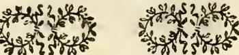
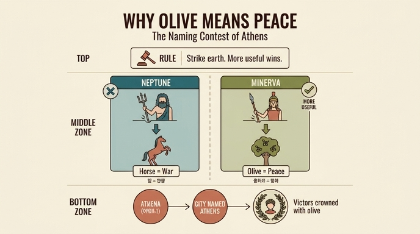

# 올리브는 왜 평화의 상징인가 — 아테네 명명 다툼 신화

## 질문

> 올리브가 평화의 상징이 된 아테네 신화는?

## 한눈에 보는 구조

| | 네투누스(Nettuno / 포세이돈) | 미네르바(Minerva / 아테나) |
|---|---|---|
| 도구 | 삼지창(tridente) | 창(asta) |
| 땅을 쳐서 낸 것 | **말(Cavallo)** | **올리브(olivo)** |
| 그 표지의 뜻 | 전쟁(guerra) | 평화(pace) |
| 판정 | 국가에 덜 유익함 | **더 유익함(più utile alla Repubblica)** |
| 결과 | — | 도시 이름 = 아테네(Atene) |

## 원문(Ripa, "PACE" 항목) 요지

Cesare Ripa의 『Iconologia』 제4권 **PACE(평화)** 항목은 평화의 알레고리를 설명하다가, 왜 올리브가 평화의 표지인지를 따로 길게 변론한다(`L' olivo è sempre stato tipo di Pace ... ci difenderemo qui più apertamente`). 그 근거로 제시하는 것이 바로 이 신화다.

- 고대인들은 **알레고리적 의미(sotto allegorico sentimento)**로 이야기를 지었다: 네투누스와 미네르바 사이에 **아테네 시(市)에 이름을 붙이는 문제(imporre nome alla Città di Atene)**를 두고 다툼이 일어났다.
- **아레오파고스(Areopago)**에서 결론을 내렸다 — 땅을 쳐서 **더 칭찬받을 만한 결과(più lodabile effetto)를 낸 쪽**이 도시에 이름을 붙인다.
- 네투누스가 삼지창으로 땅을 치자 **말**이 나왔다 — `segno di guerra`(전쟁의 표지).
- 미네르바가 창으로 치자 **올리브**가 나왔다 — `segno di pace`(평화의 표지).
- 올리브가 **국가에 더 유익하다(più utile alla Repubblica)**고 판정되었으므로, **아테나(Atena)**라 불리던 미네르바가 자기 이름을 도시에 주어 **아테네(Atene)**가 되었다.
- 그래서 아테네인과 다른 그리스인들은 **승자에게 올리브로 관을 씌웠다(coronarono i vincitori coll' oliva)**.

### 읽는 포인트: "왜 올리브가 평화인가"의 논증 형태

이 신화는 단순한 유래담이 아니라 **비교 판정 구조**다. 올리브의 의미는 그 자체로 정의되지 않고, **말(전쟁)과 나란히 놓고 무엇이 더 유익한지 판정받는 절차**를 통해 확정된다. 즉 "평화 = 전쟁보다 더 유익한 것"이라는 가치 서열이 도시의 이름 자체에 각인된 셈이다. 같은 책 뒤쪽(군주의 덕 논의)에서 Ripa는 이 대비를 그대로 재활용한다 — 미네르바는 올리브(평화의 보조), 넵투누스는 말(전쟁의 힘)의 발명자이며, **군주는 전쟁보다 백성의 평화로 기울어야 한다**(전쟁의 목적조차 결국 평화이므로)고 말한다.

## Ripa가 덧붙이는 문헌 증거들

- **핀다로스**: 『올림피아 찬가』에서 승자에게 올리브 관을 씌운다(피사의 올리브, 황금 올리브).
- **오비디우스, 『파스티』 1권**: `Frondibus Actiacis comptos redimita capillos / Pax ades, et toto mitis in orbe mane` — Ripa는 여기서 `Actiacis`(악티움)로 읽는 통설을 반박하고 **`Attiacis`/`Attiais`, 즉 아테네(Attica)의 올리브**로 읽는 편을 지지한다. 근거: 악티움 해전 승리는 해전이었으므로 **황금 뱃부리관(corona rostrata)**을 받았고 잎사귀 관이 아니었으며, 악티움 이후에 온 것은 평화가 아니라 알렉산드리아 전쟁이었다. 따라서 그 잎은 **아테네에서 기원한 아티카 올리브 = 평화의 관**이어야 한다.
- **루카누스**: 올리브를 `fronde di Minerva Cecropia`(케크롭스의, 곧 아테네의 미네르바의 잎)라 부름 — 평화를 간청할 때 쓰는 나뭇가지.
- **스타티우스**: `Et supplicis arbor Olivae`(간청하는 자의 나무, 올리브).
- **베르길리우스, 『아이네이스』 7권**: 사절 100명을 `ramis velatos Palladis omnes`(모두 팔라스의 가지를 두르고) 보내 평화를 청하게 한다.
- **리비우스, 디오도로스, 디오니시오스**: 그리스인들이 올리브 가지를 손에 들고 탄원·강화를 청하는 관례.
- Ripa는 승리의 관과 평화의 관을 혼동한 주석가들(특히 Paolo Marso)을 명시적으로 지적하며 교정한다.

## 도상: Ripa의 「PACE」 판화

판화에서 실제로 확인되는 요소들:

- 왼팔에 안은 **코르누코피아(풍요의 뿔)**에서 꽃·열매와 함께 **올리브 잎가지**가 뻗어 나온다 — 평화가 곧 풍요의 어머니이자 딸(`abbondanza, madre e figliuola della pace`)임을 뜻한다. 그래서 Ripa는 이삭 관(corona di spighe)도 함께 씌운다.
- 오른손의 **거꾸로 든 횃불**이 발밑에 쌓인 **무기 더미(monte d'armi)**를 태우고 있다 — 사람이 죽은 뒤에도 남는 증오의 잔재까지 불태우는 민족 간의 보편적 사랑.
- 흰옷, 그리고 다른 판본에서는 **황금의 부드러운 끈으로 함께 누운 사자와 양**을 묶어 쥔 모습이 지시된다.
- Ripa가 강조하는 **날개(alata)**: 클라우디우스·베스파시아누스 황제의 메달에 평화가 날개를 달고 나오는 이유는 "평화는 영원하지 않고 날아 도망가므로 부지런히 지켜야 한다"는 경고다. `PAX PERPETUA`, `PAX AETERNA`를 새긴 메달들이 있었지만 실제로 평화는 지속되지 않았다는 냉소적 지적이 이어진다.

같은 항목에는 **올리브 관** 장식 컷도 붙어 있다 — 그리스인이 승자에게, 그리고 Ripa의 논리대로라면 "전쟁을 이기고 굴복시키는" 평화 자신에게 더 정당하게 씌워야 할 그 관이다.

## 신화의 다른 판본과의 차이 (참고)

일반적으로 널리 알려진 그리스 신화 판본에서는 포세이돈이 아크로폴리스 바위를 삼지창으로 쳐서 **소금 우물(짠 샘)**을 냈고(말을 냈다는 변형도 있다), 아테나는 올리브 나무를 심었으며, 심판은 **케크롭스 왕** 또는 열두 신, 혹은 아테네 시민 투표로 이루어진다. Ripa 판본의 특징은 (1) 포세이돈의 산물을 **말 = 전쟁의 표지**로 못박고, (2) 판정 기관을 아테네의 법정 **아레오파고스**로 지정하고, (3) 판정 기준을 **"국가에 더 유익한가(più utile alla Repubblica)"**라는 공익성으로 명시한 점이다. 세 가지 모두 "올리브 = 평화 = 공익"이라는 도상학적 논증에 맞추어 조정된 각색이다.

## 암기 포인트

1. **다툼의 대상은 도시의 "이름"** (수호권이 아니라 명명권으로 서술됨).
2. **규칙: 땅을 쳐서 더 유익한 것을 낸 쪽이 이름을 붙인다.**
3. **말 = 전쟁 / 올리브 = 평화**, 그리고 올리브 승리.
4. **아테나(Atena) → 아테네(Atene)**, 이름이 곧 판정의 기념물.
5. **결과적 관습: 승자에게 올리브 관** → 나아가 평화 자신에게 씌우는 관.

## 인포그래픽

