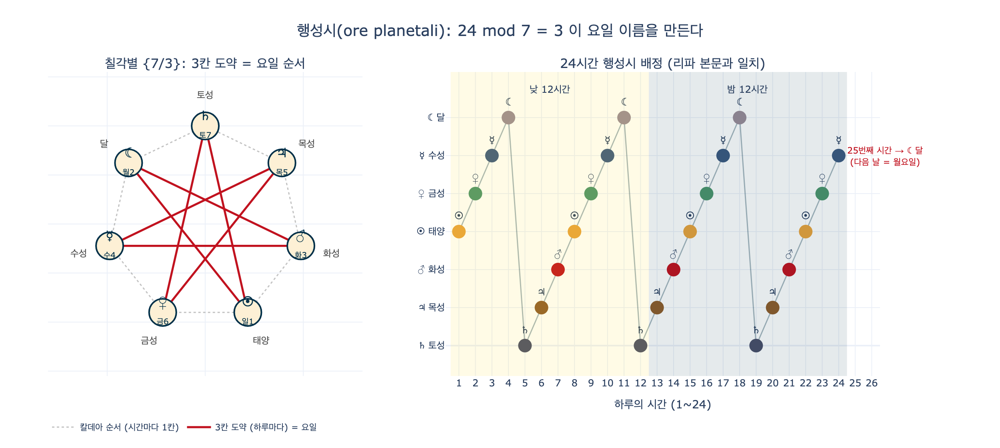
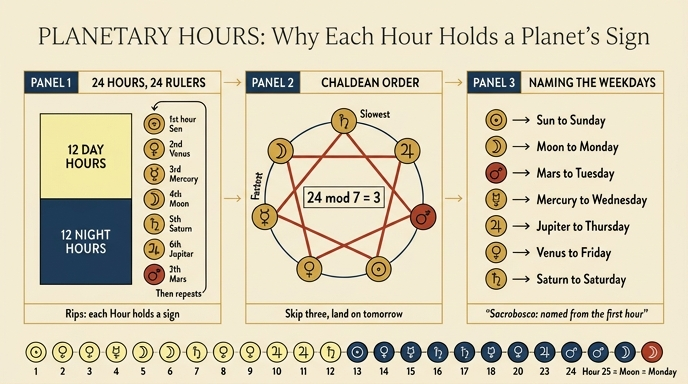

# 각 시간이 행성의 표지를 드는 이유는?

## 한 줄 답

리파가 그린 24명의 «시간(Ora)»이 손에 행성 표지를 들고 있는 것은, 그 시간이 곧 **행성시(ora planetale)** 이기 때문이다. 고대인은 낮 12시간·밤 12시간을 나누고 각 시간을 일곱 행성 중 하나가 다스린다고 보았으며, 리파는 그 지배 행성의 표지를 시간의 지물로 삼았다.

---

## 1. 리파 본문이 직접 밝히는 근거

「낮의 시간(ORE DEL GIORNO)」 제1시 해설에서 리파는 태양 표지를 든 이유를 이렇게 설명한다.

> *Le si dà il segno del Sole, perché solevano gli Antichi dare al giorno dodici ore, e dodici alla notte, le quali si dicono **planetali**, e si chiamano così, perché ciascuna di esse viene signoreggiata da uno de' segni de' Pianeti…*
>
> — 그녀에게 태양의 표지를 주는 것은, 고대인이 낮에 12시간, 밤에 12시간을 두었고 이 시간들을 «행성시»라 불렀기 때문이다. 그렇게 불리는 까닭은 시간마다 행성의 표지 중 하나가 그 시간을 다스리기 때문이다.

리파는 이어 전거를 세 겹으로 쌓는다.

| 전거 | 내용 |
|---|---|
| **그레고리오 지랄디**(Gregorio Giraldi), *De annis et mensibus* 2권 | *"singuli Planetae singulis horis dominari et praeesse ab Astrologis dicuntur"* — 점성가들은 개개 행성이 개개 시간을 지배·주관하며 인간사를 배치한다고 말한다. 그래서 «유성(planetae=떠도는 별)»의 이름을 딴 «planetariae»(행성시)가 제정되었다 |
| **프톨레마이오스·테온**(Tolomeo, Teone) | 더 자세한 설명을 원하면 이들을 읽으라고 안내 |
| **오비디우스** | *"Nam Venus affulsit, non illa Iuppiter horas Lunaque…"* — 시간을 비추는 행성들을 노래한 구절 |

## 2. 사크로보스코 인용 — 요일 이름의 유래

리파가 인용하는 결정적 대목은 조반니 사크로보스코(Johannes de Sacrobosco, 13세기)의 *Computus ecclesiasticus*다.

> *Notandum etiam quod dies septimanae secundum diversos diversas habent appellationes: Philosophi enim Gentiles quemlibet diem septimanae, ab illo Planeta, qui dominatur **in prima hora illius diei**, denominant; dicunt enim Planetas successive denominari per horas diei.*
>
> — 한 주의 날들은 여러 방식으로 불린다는 점을 유의하라. 이교 철학자들은 한 주의 각 날을 **그날 제1시를 다스리는 행성**의 이름으로 부른다. 그들은 행성들이 하루의 시간을 따라 차례로 이름을 붙인다고 말한다.

즉 «일요일(dies Solis) — 월요일(dies Lunae) — 화요일(dies Martis) — 수요일(dies Mercurii) — 목요일(dies Iovis) — 금요일(dies Veneris) — 토요일(dies Saturni)»이라는 요일 이름 자체가 행성시 체계의 부산물이다.

## 3. 리파가 채택한 배열과 그 정체

리파는 "요일마다 각 시간의 표지가 달라지지만, 여기서는 특정 요일을 따지지 않고 낮 12시간·밤 12시간을 절대적으로 표현한다"며 **제1시를 태양으로 시작**한다고 못박는다(태양이 시간을 구분하고 시간의 척도이므로).

그 결과 표지의 순서는 다음과 같다.

| 시간 | 표지 | 시간 | 표지 |
|---|---|---|---|
| 낮 1시 | ☉ 태양 | 밤 1시 | ♃ 목성 |
| 낮 2시 | ♀ 금성 | 밤 2시 | ♂ 화성 |
| 낮 3시 | ☿ 수성 | 밤 3시 | ☉ 태양 |
| 낮 4시 | ☾ 달 | 밤 4시 | ♀ 금성 |
| 낮 5시 | ♄ 토성 | 밤 5시 | ☿ 수성 |
| 낮 6시 | ♃ 목성 | 밤 6시 | ☾ 달 |
| 낮 7시 | ♂ 화성 | 밤 7시 | ♄ 토성 |
| 낮 8시 | ☉ 태양 | 밤 8시 | ♃ 목성 |
| 낮 9시 | ♀ 금성 | 밤 9시 | ♂ 화성 |
| 낮 10시 | ☿ 수성 | 밤 10시 | ☉ 태양 |
| 낮 11시 | ☾ 달 | 밤 11시 | ♀ 금성 |
| 낮 12시 | ♄ 토성 | 밤 12시 | ☿ 수성 |

(본문에서 확인 가능: 낮 8시 항목에 "제1시도 같은 태양 표지를 가지므로 자세를 달리해 그린다"는 리파의 지시가 있고, 밤 10시 항목에도 "밤 제1시에서 말한 방식대로 태양 표지를 든다"는 언급이 있다. 실제로 낮 1·8시, 밤 3·10시가 태양으로 정확히 7시간 간격이다.)

이 24개 배열은 **끊김 없는 하나의 7주기**다. 낮 12시 토성 → 밤 1시 목성 → 밤 2시 화성 → 밤 3시 태양으로 자연스럽게 이어진다.

### 칠요의 «칼데아 순서»

일곱 행성을 지구에서 본 겉보기 주기가 **긴 것부터 짧은 것 순**으로 늘어놓은 것이 칼데아 순서다.

$$\text{토성} \to \text{목성} \to \text{화성} \to \text{태양} \to \text{금성} \to \text{수성} \to \text{달}$$

(주기: 약 29.5년 → 11.9년 → 1.88년 → 1년 → 225일 → 88일 → 27.3일. 프톨레마이오스 천구 모델에서 지구로부터 먼 순서이기도 하다.)

리파의 «태양 → 금성 → 수성 → 달 → 토성 → 목성 → 화성»은 이 칼데아 순서를 **태양에서 시작하도록 회전(rotation)** 시킨 것이다. 즉 순서 자체는 칼데아 순서와 완전히 동일하고, 출발점만 태양으로 잡았을 뿐이다. (칼데아 순서를 뒤집으면 «달-수성-금성-태양-화성-목성-토성»이 되어 리파의 배열과 다르다. "역순"이 아니라 "회전"이라는 점에 주의.)

## 4. 왜 요일 순서와 행성시 순서가 다른가 — $24 \bmod 7 = 3$

행성시는 **한 시간에 한 칸씩** 칼데아 원을 돈다. 그런데 하루는 24시간이고 행성은 7개다.

$$24 = 3 \times 7 + 3 \quad\Longrightarrow\quad 24 \equiv 3 \pmod 7$$

하루가 끝나면 순환은 제자리로 돌아오지 못하고 **3칸 어긋난 채** 다음 날이 시작된다. 사크로보스코의 규칙대로 "그날 제1시의 지배성 = 그날의 이름"이므로, 요일 이름은 칼데아 원 위에서 **세 칸씩 건너뛴 궤적**이 된다.

- 태양 →(3칸) 달 →(3칸) 화성 →(3칸) 수성 →(3칸) 목성 →(3칸) 금성 →(3칸) 토성 →(3칸) 태양
- 곧 **일 · 월 · 화 · 수 · 목 · 금 · 토**

$\gcd(3,7)=1$ 이므로 일곱 꼭짓점을 하나도 빠뜨리지 않고 지나 7일 만에 정확히 원위치한다($7\times24=168$, $168 \equiv 0 \pmod 7$). 이 궤적을 그림으로 그리면 **칠각별 $\{7/3\}$** 이 된다.

리파의 배열로 검산하면 명쾌하다. 제1시가 태양이므로 이 하루는 **일요일**이고, 밤 12시(=24번째 시간)가 수성이므로 25번째 시간, 즉 다음 날 제1시는 **달** — 곧 **월요일**이다.

## 5. 이 항목의 도상학적 함의

- 24명의 «시간»은 모두 **날개 달린 소녀**로, 옷 색은 그 시각의 하늘빛(황금색 → 흰색 → 불타는 붉은색 → 주황 → 회색 → 짙은 청색)을 따른다. 리파는 색·꽃·동물·시계라는 네 겹의 지물 체계를 겹쳐 놓는다.
- 행성 표지 외에 각 시간은 **태양을 따라 도는 식물**(헬리오트로프, 치커리, 연꽃, 루핀, 올리브·포플러·버들)이나 **시각을 알리는 기물**(해시계, 모래시계, 물시계 클렙시드라, 종 달린 탑시계)을 함께 든다. 행성 표지가 "이 시간의 지배자"를 말한다면, 식물·기물은 "이 시간을 어떻게 아는가"를 말한다.
- 따라서 화가는 시간 그림을 그릴 때 **행성 표지를 첫눈에 알아볼 수 있도록 크고 뚜렷하게(grande e visibile)** 그리라는 것이 리파의 지시다.

---

## 시각화

## 인포그래픽

