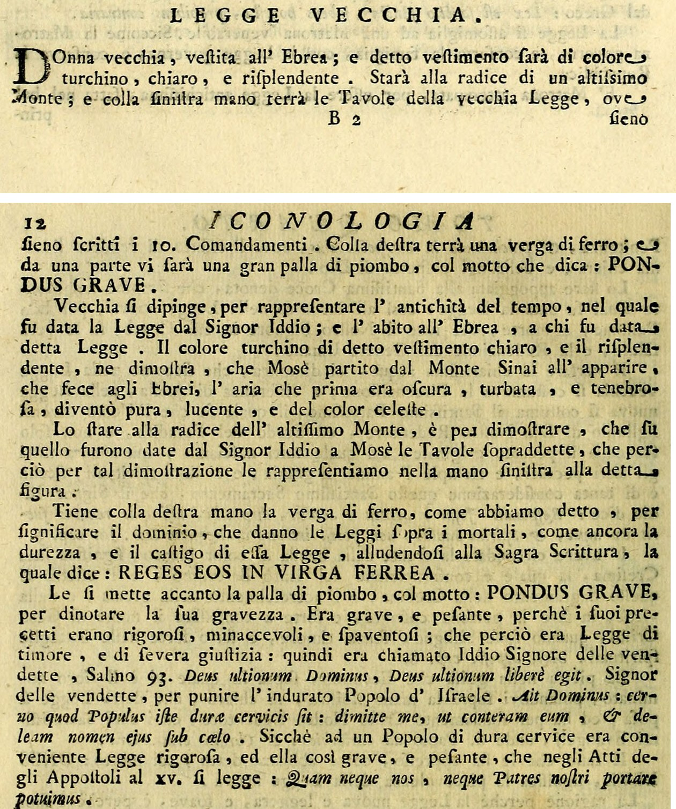

# 옛 법 (LEGGE VECCHIA / 구약의 법)

> **Q.** 리파는 '옛 법(Legge Vecchia, 구약의 법)'을 어떤 모습으로 그렸는가?
>
> **A.** 히브리풍 옷을 입은 늙은 여인으로, 옷은 맑고 빛나는 청록색이다. 매우 높은 산기슭에 서서 왼손에 십계명이 적힌 율법 판을 들고 오른손에 쇠 지팡이를 들었으며, 곁에 'PONDUS GRAVE(무거운 짐)'라는 표어가 붙은 큰 납덩이가 있다.

---

## 1. 원문 위치 — 이 항목에는 판화가 없다

이 카드의 출처는 Cesare Orlandi가 증보한 『Iconologia』 제4권(Perugia, 1764)의 **11–12쪽**이다. 항목 배열은 `LEGGE NATURALE`(자연법) → `LEGGE NUOVA`(새 법) → `LEGGE VECCHIA`(옛 법) → `LEGGE`(리파 본래 항목) 순서다.

**확인 결과: `LEGGE NUOVA`와 `LEGGE VECCHIA` 두 항목에는 고유한 삽화(동판화)가 붙어 있지 않다.** 이 묶음에서 판화를 가진 것은 앞의 `LEGGE NATURALE`과 뒤의 `LEGGE`뿐이며, 두 항목은 순수한 텍스트 규정(descrizione)으로만 제시된다. asset 마크다운에서도 `LEGGE NATURALE` 표제 직후의 `_page_16_Picture_2.jpeg` 이후 `LEGGE VECCHIA` 구간이 끝날 때까지 이미지 참조가 하나도 없고, 원본 스캔의 해당 지면(11–12쪽)을 직접 확인해도 도판 자리가 비어 있다.

그래서 아래 **그림 1은 판화가 아니라 원문 지면 자체**다. 이 항목이 "말로만 존재하는 이미지"라는 사실이 곧 이 카드의 성격이므로, 규정 원문을 직접 읽는 것이 최선의 시각 자료다.

> **그림 1 출처**: Internet Archive 소장 스캔 `iconologiadelcav642ripa` (*Iconologia del cavaliere Cesare Ripa, perugino*, t. 4, Orlandi 증보, Perugia 1764) 의 leaf 19–20 = 인쇄 페이지 11 하단과 12 상단을 잘라 이어 붙인 것. asset 이미지 폴더에서 가져온 판화가 **아니다**(이 항목에는 판화가 없으므로). 1764년 간행물로 퍼블릭 도메인.

원문 규정(그림 1 첫 단락)은 다음과 같다.

> **D**onna vecchia, vestita all'Ebrea; e detto vestimento sarà di colore turchino, chiaro, e risplendente. Starà alla radice di un altissimo Monte; e colla sinistra mano terrà le Tavole della vecchia Legge, ove sieno scritti i 10. Comandamenti. Colla destra terrà una verga di ferro; e da una parte vi sarà una gran palla di piombo, col motto che dica: **PONDUS GRAVE**.
>
> (히브리 방식으로 옷을 입은 늙은 여인. 그 옷은 맑고 빛나는 청록색일 것이다. 아주 높은 산의 기슭에 서 있고, 왼손으로는 십계명이 적힌 옛 법의 판을 들 것이다. 오른손에는 쇠 지팡이를 들고, 한쪽에는 'PONDUS GRAVE'라는 표어가 붙은 큰 납덩이가 있을 것이다.)

---

## 2. 요소별 해설 — 왜 그렇게 그리는가

원문은 규정을 제시한 뒤 각 지물의 근거를 하나씩 풀어 준다.

### (1) 늙은 여인 (Donna vecchia) = 법이 주어진 시대의 오래됨

> *Vecchia si dipinge, per rappresentare l'antichità del tempo, nel quale fu data la Legge dal Signor Iddio.*

늙게 그리는 것은 **인물의 노쇠함이 아니라 "법이 주어진 시점의 오래됨(antichità del tempo)"**을 나타낸다. 즉 나이는 법 자체가 낡았다는 폄하가 아니라 연대(年代)의 기호다. 뒤에서 보듯 새 법(Legge Nuova)을 "젊게" 그리는 이유도 명시적으로 "*a differenza della Legge vecchia*(옛 법과 구별하기 위하여)"라고만 적혀 있다 — 이 두 항목은 **한 쌍으로 설계된 대구**다.

### (2) 히브리풍 옷 (abito all'Ebrea) = 그 법을 받은 민족

> *…e l'abito all'Ebrea, a chi fu data detta Legge.*

복장은 **수령자(受領者)의 표지**다. 법의 내용이 아니라 "누구에게 주어졌는가"를 옷이 말한다.

### (3) 맑고 빛나는 청록색 (turchino, chiaro, e risplendente) = 시나이에서 내려온 뒤 맑아진 하늘

여기가 이 항목에서 가장 특이한 대목이다. 색의 근거는 염료나 상징 사전이 아니라 **출애굽 서사의 한 장면**이다.

> *Il colore turchino di detto vestimento chiaro, e il risplendente, ne dimostra, che Mosè partito dal Monte Sinai all'apparire, che fece agli Ebrei, l'aria che prima era oscura, turbata, e tenebrosa, diventò pura, lucente, e del color celeste.*

즉 모세가 시나이 산을 떠나 히브리인들에게 나타났을 때, **이전에 어둡고(oscura) 흐리고(turbata) 캄캄했던(tenebrosa) 공기가 순수하고 빛나며 하늘색(color celeste)으로 바뀌었다**는 것. 옷 색은 그 맑게 갠 하늘을 입은 것이다.

- `turchino`는 짙은 청색~청록색(터키석 계열)을 가리키는 이탈리아어이고, 원문은 이를 곧바로 `color celeste`(하늘빛)로 바꿔 말한다. 그래서 "청록색"과 "하늘색"이 같은 것을 지시한다.
- 수식어 세 개(`turchino` + `chiaro` + `risplendente` = 청록 + 맑음 + 빛남)가 각각 "혼탁 → 맑음", "어둠 → 빛"의 반전에 대응한다. 색 하나가 아니라 **날씨의 변화 전체**가 옷에 옮겨진 셈이다.

### (4) 매우 높은 산기슭 (alla radice di un altissimo Monte) = 시나이 산

> *Lo stare alla radice dell'altissimo Monte, è per dimostrare, che su quello furono date dal Signor Iddio a Mosè le Tavole sopraddette, che perciò per tal dimostrazione le rappresentiamo nella mano sinistra alla detta figura.*

산은 **시나이 산**이며, 이름을 적는 대신 "지극히 높은 산"이라는 형용으로 지시한다. 주목할 점은 원문이 산과 **왼손의 석판을 한 문장으로 묶는다**는 것 — 그 산에서 받은 물건이므로 그 산 아래에서 그것을 들고 있는 것이 논리적 귀결이라는 설명이다. 즉 산과 석판은 별개의 두 지물이 아니라 "수령 장면"이라는 하나의 사건을 둘로 나눠 그린 것이다.

### (5) 오른손의 쇠 지팡이 (verga di ferro) = 법의 지배권 + 가혹함과 징벌

> *Tiene colla destra mano la verga di ferro… per significare il dominio, che danno le Leggi sopra i mortali, come ancora la durezza, e il castigo di essa Legge, alludendosi alla Sagra Scrittura, la quale dice: **REGES EOS IN VIRGA FERREA**.*

쇠 지팡이는 두 겹의 의미를 진다.

1. **지배(dominio)** — 법이 인간(mortali) 위에 행사하는 통치권. 일반적인 법 개념.
2. **가혹함(durezza)과 징벌(castigo)** — 이 법 고유의 성격.

표어 *Reges eos in virga ferrea*("네가 그들을 철장으로 다스리리라")는 **시편 2:9**(불가타)에서 왔다. 재질이 핵심이다 — 왕의 홀(scettro)이 아니라 **쇠**여야 부드럽지 않은 통치가 드러난다. 참고로 같은 묶음의 `LEGGE`(리파 본래 항목)는 오른손에 *Jubet, et prohibet*(명하고 금한다)라는 표찰이 감긴 **홀(scettro)**을 드는데, 그쪽은 지배만 있고 가혹함이 없다. 옛 법이 쇠 지팡이를 드는 것은 그 대비 위에서 읽어야 한다.

### (6) 납덩이 + PONDUS GRAVE = 옛 계명의 무게

> *Le si mette accanto la palla di piombo, col motto: **PONDUS GRAVE**, per dinotare la sua gravezza. Era grave, e pesante, perchè i suoi precetti erano rigorosi, minaccevoli, e spaventosi; che perciò era Legge di timore, e di severa giustizia.*

`PONDUS GRAVE` = "무거운 짐/무게". 재질이 **납(piombo)**인 것이 요점이다 — 부피에 비해 압도적으로 무거운 금속이라, 계명의 조항 수가 아니라 **한 조항 한 조항의 무거움**을 말한다. 무거운 이유는 계율이 "엄격하고(rigorosi), 위협적이고(minaccevoli), 두려운(spaventosi)" 것이었기 때문이며, 그래서 이것은 **두려움의 법(Legge di timore)이며 엄한 정의의 법(severa giustizia)**이다.

원문은 이 무게를 성서 인용 세 겹으로 받친다.

| 인용 | 출처 | 역할 |
|---|---|---|
| *Deus ultionum Dominus, Deus ultionum liberè egit* | 시편 93(현행 94)편 | 하느님이 "복수의 주(Signor delle vendette)"로 불린 근거 |
| *Cerno quod Populus iste durae cervicis sit: dimitte me, ut conteram eum, et deleam nomen ejus sub caelo* | 신명기 9:13–14 | "목이 굳은 백성(dura cervice)"에게는 엄한 법이 걸맞다는 논리 |
| ***Quam neque nos, neque Patres nostri portare potuimus*** | **사도행전 15:10** | 무게의 결정적 증언 — "우리 조상들도 우리도 능히 메지 못하던 (멍에)" |

마지막 인용이 특히 중요하다. 예루살렘 사도 회의에서 **베드로가 직접** 모세의 법을 "우리 조상도 우리도 짊어질 수 없었던 멍에"라고 부른 대목이므로, `PONDUS GRAVE`는 리파/오를란디의 비유가 아니라 **신약 자체가 구약의 법에 붙인 평가**를 그대로 도상화한 것이다.

---

## 3. Legge Nuova(새 법)와의 요소별 반전 대조

두 항목은 인접해 있고(11쪽), 새 법 항목이 자기 지물을 설명할 때마다 옛 법을 명시적으로 참조한다(*a differenza della Legge vecchia*, *siccome nel Monte Sinai fu data la Legge: così all'incontro nella Legge nuova…*). **모든 지물이 1:1로 뒤집힌 매치 페어**다.

| 요소 | LEGGE VECCHIA (옛 법) | LEGGE NUOVA (새 법) | 반전의 축 |
|---|---|---|---|
| 나이 | **늙은** 여인 — 법이 주어진 때의 오래됨 | **젊은** 여인, 최고의 미모(*suprema bellezza*) — "옛 법과 구별하기 위하여" | 오래됨 ↔ 새로움 |
| 머리 | 규정 없음 (히브리풍 복장만) | 맑고 빛나는 **광선(raggi)**의 후광 + 이마에 흰 띠(견진의 표지) | 무광 ↔ 발광 |
| 옷 | 히브리풍, **맑고 빛나는 청록색** — 시나이 이후 맑게 갠 하늘 | **눈처럼 흰, 지극히 얇은 아마포**(거의 나체가 비칠 정도) — 빨면 하얘지는 아마포처럼 고백으로 씻긴 영혼 | 하늘의 색 ↔ 씻긴 흰빛 / 불투명 ↔ 투명 |
| 왼손에 든 법 | **십계명 석판** (새 법 항목의 표현으로는 *scritta in duri marmi*, 굳은 대리석에 새겨진) | 네모난 주추 돌 위의 **책 `EVANGELIUM`**, 그 위에 왼손을 얹음 (그리스도가 반석 — *Christus erat Petra*) | 돌에 새긴 계명 ↔ 반석 위의 복음서 |
| 기대는 것 / 장소 | **아주 높은 산기슭** = 시나이 산 | **십자가에 기댐** — "시나이 산에서 법이 주어졌듯, 새 법에서는 십자가의 수난과 죽음이 참된 구원" | 시나이 ↔ 갈바리 |
| 오른손 | **쇠 지팡이(verga di ferro)** — 지배 + 가혹 + 징벌 | 높이 든 팔의 **잔에서 맑은 물을 쏟음** — 세례 | 때리는 쇠 ↔ 붓는 물 |
| 곁의 돌 | 큰 **납덩이**, 표어 **`PONDUS GRAVE`** (무거운 짐) | 한 쌍의 **날개가 달린 돌**, 표어 **`ONUS LEVE`** (가벼운 짐) | 무거움 ↔ 가벼움 (돌에 날개를 달아 뒤집음) |
| 예식 | 할례(Circoncisione) | 세례(Battesimo) | — |
| 법의 성격 | **두려움의 법**, 엄한 정의 (*rigorosi, minaccevoli, spaventosi*) | 사랑과 자애의 법 (*precetti… di ardente amore, e di benevolenza*) | 두려움 ↔ 사랑 |
| 표어의 성서 근거 | 시편 2:9 *Reges eos in virga ferrea* / 시편 93 / 신명기 9 / **사도행전 15:10** | 신명기 33 *in dextera ejus Lex ignea* / **마태 11:30** *Jugum meum suave est, et onus meum leve* | 멜 수 없는 멍에 ↔ 쉬운 멍에 |

**대구의 정점: 납덩이 ↔ 날개 달린 돌.** `PONDUS GRAVE`와 `ONUS LEVE`는 마태 11:30(*onus meum leve*)과 사도행전 15:10(*neque… portare potuimus*)을 직접 마주 세운 것이다. 새 법 항목은 왜 새 법이 가벼운지까지 설명한다 — 신명기 33장의 약속 *in dextera ejus Lex ignea*(그 오른손에 불의 법)를 끌어와, **불은 가볍고 위로 날아오르며 아무리 무거운 것도 들어올린다**, 사랑도 그와 같아 "돌 같은 마음(*cuori di sasso*)"조차 날게 한다는 것. 그래서 새 법의 무게추는 그냥 가벼운 물건이 아니라 **일부러 "돌"에 날개를 붙인 것**이다 — 옛 법의 무거운 금속 덩이와 같은 범주(무게 있는 광물)를 두고 날개 하나로 뒤집는다.

---

## 4. 참고 — 이 묶음에서 판화를 가진 것은 자연법뿐

`LEGGE VECCHIA`에는 도판이 없으므로, 같은 페이지 묶음의 **바로 앞 항목** 판화를 대신 실어 이 판본의 도상 양식을 참고할 수 있게 한다.

> **그림 2 출처 및 주의**: asset 폴더의 `Iconologia (Cesare Ripa)/_page_16_Picture_2.jpeg`. 이것은 **`LEGGE NATURALE`(자연법) 항목의 판화이며, 이 카드가 묻는 `LEGGE VECCHIA`의 판화가 아니다.** 옛 법 항목에는 고유 도판이 존재하지 않아 인접 항목의 것을 양식 참고용 대용으로 실은 것이다. 판 아래에 제작자 서명 *Carlo Mariotti del. / Carlo Grandi incise*, 표제 *Legge Naturale*가 보인다.

그림 2에서 실제로 관찰되는 요소는 모두 **자연법**의 규정이며, 옛 법과 하나도 겹치지 않는다 — 반나체의 아름다운 젊은 여인, 인공으로 땋지 않고 흘러내린 자연 그대로의 머리, 하체를 가린 어린양 가죽, 앉아 있는 정원, 왼손에 든 컴퍼스와 그것으로 그은 평행선에 붙은 표어 `AEQUA LANCE`(같은 저울로), 그리고 자기 자신의 그림자. 옛 법의 지물(석판·쇠 지팡이·납덩이·높은 산)은 **어디에도 없다.** 다만 이 판화를 통해 같은 편집자가 같은 화가/판각공에게 맡긴 이 판본의 표현 관습 — 단순한 야외 배경, 인물 하나, 지물에 라틴어 표어를 리본이나 각인으로 붙이는 방식 — 은 확인할 수 있고, 옛 법도 실제로 그려졌다면 같은 문법을 따랐을 것이다.

---

## 5. 암기 정리

**"늙음-히브리-청록 / 산-석판-쇠막대-납덩이"** 여덟 낱말로 잡고, 각각에 근거 한 개씩을 붙인다.

| 지물 | 한 줄 근거 |
|---|---|
| 늙음 | 법이 주어진 **때**가 오래됨 (인물이 늙은 게 아니라 연대가 오래됨) |
| 히브리풍 옷 | 법을 **받은 민족** |
| 맑고 빛나는 청록 | 모세가 시나이에서 내려오자 **흐리던 공기가 하늘빛으로** 개었음 |
| 아주 높은 산기슭 | **시나이 산** (석판을 받은 자리) |
| 왼손 십계명 판 | 그 산에서 받았으므로 산 아래에서 들고 있음 (산과 한 세트) |
| 오른손 쇠 지팡이 | 법의 **지배** + **가혹·징벌** / 시편 2:9 *철장으로 다스리리라* |
| 납덩이 `PONDUS GRAVE` | 계명이 엄격·위협적·두려움 → **두려움의 법** / 사도행전 15:10 *조상도 우리도 메지 못한 멍에* |

**혼동 방지 3점**

1. **왼손/오른손을 뒤집지 말 것** — 왼손 = 석판(시나이에서 받은 것), 오른손 = 쇠 지팡이(지배·징벌). 새 법도 왼손이 법(EVANGELIUM 책), 오른손이 작용(물 붓기)이라는 같은 배치다.
2. **청록색을 "낡음·우울"로 해석하지 말 것** — 정반대다. 어둠에서 **맑음으로 개인 하늘**의 색, 즉 계시의 밝음 쪽이다.
3. **납덩이 vs 날개 달린 돌** — 무게추의 유무가 아니라 **같은 무게추의 반전**(납덩이 `PONDUS GRAVE` ↔ 날개 붙은 돌 `ONUS LEVE`)임을 기억하면 두 항목을 한 번에 복원할 수 있다.
