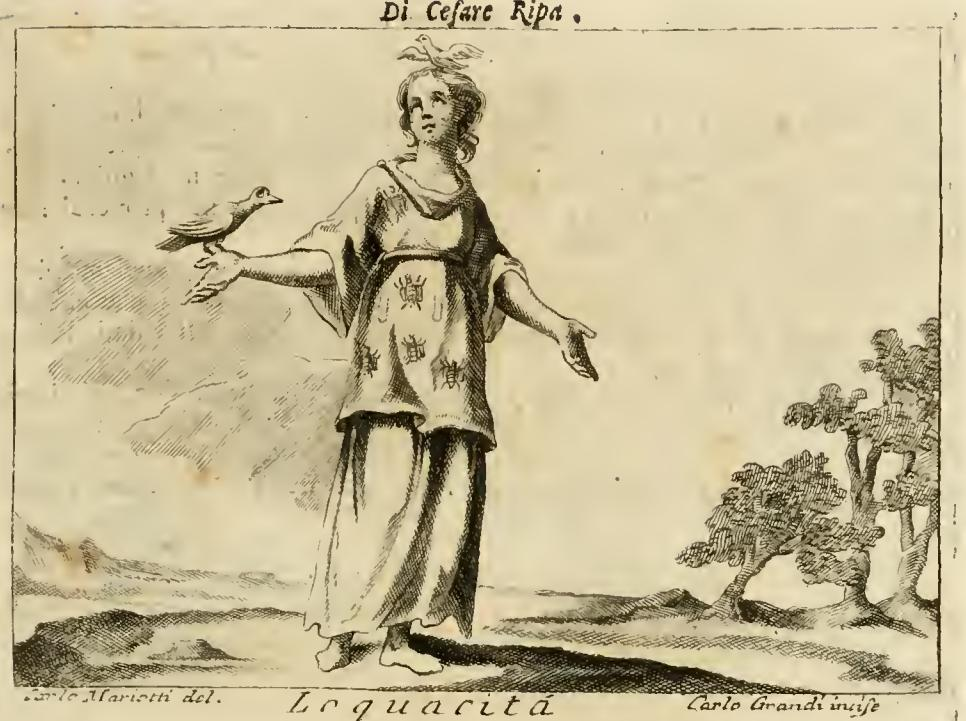
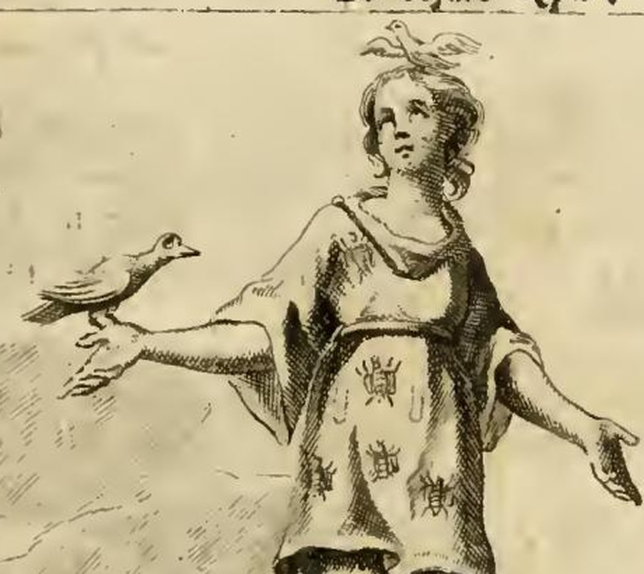

# '수다'(Loquacità) 도상 — 매미 · 혀 · 제비 · 까마귀

## 카드

**Q.** '수다' 도상에서 매미·혀·제비·까마귀는 각각 무엇을 뜻하는가?

**A.** 매미는 프로페르티우스가 말한 수다의 상형문자로 지겨운 말로 귀를 괴롭힘을, 옷의 혀들은 지나친 말과 '말 많은 곳에 거짓이 없지 않다'(잠언)를 뜻한다. 제비는 조용히 공부하는 이들을 방해하는 성가신 수다쟁이의 본성을, 까마귀는 팔라스(미네르바)가 말이 너무 많다고 곁에서 쫓아낸 새로서 수다의 상징이다(알치아토의 엠블렘).

---

## 1. 원본 판화 — 무엇이 실제로 그려져 있는가

출처 원문 `02 Letters to Lust.md` 494행의 `LOQUACITÀ` 항목에 붙은 판화(`_page_54_Picture_1.jpeg`)다. 하단 여백에 `Carlo Mariotti del.` / `Carlo Grandi incise`, 상단에 `Di Cesare Ripa`, 앞 페이지 헤더에 `TOMO QUARTO`가 찍혀 있다 — 즉 이 책은 체사레 리파 원작을 **아바테 체사레 오를란디가 대폭 증보한 페루자 판(Perugia, Costantini, 1764–67, 전 5권)**이고, 도판은 카를로 스피리디오네 마리오티가 그리고 카를로 그란디가 새긴 동판이다. 리파 자신의 1593/1603년 초기 판본에는 없던 주석·전거가 오를란디 손에서 늘어난 상태이므로, 인용문에 붙은 "리브로 20", "리브로 6" 같은 권수 표기도 18세기 증보층에 속한다.

세부를 확대하면 네 지물이 한눈에 잡힌다.

- **머리 위**: 작은 새가 둥지 위에 서서 부리를 벌린 채 지저귄다(제비). 새와 둥지가 겹쳐 새가 두 마리처럼 보이지만, 본문은 "둥지 안에 서서 노래하는 자세의 제비 한 마리"라고 규정한다.
- **옷**: 곤충 형태(매미)와, 그 사이에 끼어 있는 길쭉한 주머니 모양(혀)이 규칙적으로 흩어져 있다. 본문의 `contesta di cicale, e di lingue`("매미와 혀들이 짜여 든")를 문자 그대로 옮긴 것.
- **뻗은 오른손**(관람자 왼쪽): 통통한 새 한 마리가 앉아 있다(까마귀).
- **입**: 처방은 `colla bocca aperta`(입을 벌린 채)인데, 판화가는 아주 살짝 벌린 정도로만 새겼다. 도판이 텍스트를 100% 재현하지 않는 리파 판본의 흔한 사례.

## 2. 원문(이탈리아어) 처방과 번역

> **Onna [Donna] giovane, colla bocca aperta. Sarà vestita di cangiante, e detta veste sarà contesta di cicale, e di lingue. Terrà in cima del capo una Rondine, che sia nel nido in piedi, in atto di cantare; e colla destra mano una Cornacchia.**
>
> 젊은 여인, 입을 벌리고 있다. **무지개빛(cangiante)** 옷을 입었고 그 옷에는 **매미와 혀들**이 짜여 들어가 있다. 머리 위에는 **둥지에 서서 노래하는 제비**를 두고, **오른손에는 까마귀**를 들고 있다.

## 3. 지물별 근거 — 원문 인용과 해설

### (1) 젊음 + 벌린 입 — 기본 골격

- **왜 젊은 여인인가**: `il giovane non può sapere assai, perché la prudenza ricerca la sperienza, la quale ha bisogno di lungo tempo` — 아리스토텔레스 『니코마코스 윤리학』 6권을 라틴어로 인용한다: *Juvenis non potest esse sapiens, quia prudentia requirit experientiam, quae tempore indiget*("젊은이는 현명할 수 없다. 실천지(prudentia)는 경험을 요구하고 경험은 시간을 요구하기 때문이다"). 경험이 없으니 쉽게 '수다'라는 결함에 빠진다는 논리.
- **왜 벌린 입인가**: 플루타르코스 『수다에 관하여』(*De garrulitate*) — *Garruli neminem audiunt, at semper loquuntur*("수다쟁이는 아무도 듣지 않고 늘 말만 한다").

### (2) 무지개빛(cangiante) 옷 — 카드 답에는 없지만 반드시 함께 이해할 부분

> `Il vestimento di colore cangiante denota la varietà de' concetti del Loquace, che [non] sono stabili, e reali, ma lontani da' discorsi ragionevoli...`

**cangiante**는 보는 각도에 따라 색이 바뀌는 광택 직물(shot silk)이다. 리파 체계에서 이 옷감은 **변덕·불안정·표변**의 표준 기호로, 예컨대 '아첨(Adulazione)' 계열 항목에서도 "상대에 따라 얼굴과 말을 바꾸므로" cangiante를 입힌다. 여기서는 **수다쟁이의 관념(concetti)이 이리저리 바뀌고 고정되지 않으며**, 겉보기에 그럴듯해도 이성적 담론에서 멀다는 뜻이다. (OCR본은 `che sono stabili, e reali, ma lontani...`로 읽히지만 뒤의 `ma`가 역접이므로 원문은 `che non sono stabili, né reali` 계열의 부정문이었을 것이다 — 스캔 누락으로 보아야 자연스럽다.) 뒷받침 인용은 플루타르코스 『호기심에 관하여』(*De curiositate*): *Loquacitas est resoluta loquendi sine ratione intemperantia*("수다는 이성 없이 말하는 풀어진 무절제다").

### (3) 매미(Cicale) — 지겨운 말로 귀를 괴롭히다

> `Le Cicale, che sono sopra il vestimento, **Properzio** le prende per geroglifico della Loquacità, essendocché da esse deriva il tediosissimo parlare, ed offende infinitamente l'orecchio altrui; non altrimenti di quello che il Garrulo, ed il Loquace, come benissimo dimostra **Euripide apud Stobaeum**: *Multiloquium non solum auditori molestum, verum ad persuadendum inutile, praesertim variis curis occupatis.*`

- 매미는 여름 한낮 끊임없이 울어 **"지겨움의 극치인 말"(tediosissimo parlare)**이 되고, 남의 귀를 무한히 괴롭힌다. 수다쟁이가 하는 일이 바로 그것.
- 스토바이오스 선집에 전하는 에우리피데스 인용의 뜻: **"많은 말은 듣는 이에게 괴로울 뿐 아니라 설득에도 무익하다. 특히 여러 근심에 사로잡힌 사람에게는 더욱 그렇다."** 수다는 미학적 결함이 아니라 **수사학적 실패**라는 점이 핵심.
- **전거 검증 메모**: 리파/오를란디는 이 매미를 프로페르티우스에게 돌리지만, 현전하는 프로페르티우스 『엘레기』 1~4권 라틴어 전문을 검색해도 `cicad-` 어간은 **한 번도 나오지 않는다**. 즉 이 귀속은 직접 독서가 아니라 르네상스 상징 백과(피에리오 발레리아노 『Hieroglyphica』 등)를 경유한 **간접 인용/오귀속**일 가능성이 크다. 매미의 시끄러움을 노래한 고전 시행으로 실제로 널리 회자된 것은 베르길리우스다 — 『농경시』 3.328 *et cantu querulae rumpent arbusta cicadae*, 『목가』 2.13 *sole sub ardenti resonant arbusta cicadis*. 리파 항목의 전거는 이렇게 **인용의 인용**으로 이어진 사슬이 흔하므로, 시험 답안으로는 "프로페르티우스가 말한 상형문자"라고 원문대로 쓰되 실제 출처는 미확인임을 알아두면 좋다.

### (4) 옷의 혀들(Lingue) — 하나의 혀, 두 개의 귀

> `Le lingue, che sono nel vestimento, significano la troppa Loquacità, onde **Plut. nel libro adversus Garrulos** dice: *Garruli naturam reprehendunt quod unam quidem linguam, duas autem aures habent*; onde ne seguita, che il Loquace dice molte bugie, come riferisce **Salomone ne' proverbi**: *In multiloquio non deest mendacium.*`

- 플루타르코스의 논지: **수다쟁이는 "혀는 하나뿐인데 귀는 둘"이라며 자연을 원망한다.** 자연이 귀를 둘, 혀를 하나 준 것은 '듣기 두 배, 말하기 절반'을 뜻하는데 수다쟁이는 그 비율을 거꾸로 원한다는 풍자다. 옷 전면에 혀가 흩뿌려진 것은 **혀가 하나로 모자라 온몸이 혀가 된 인간**이라는 시각적 농담.
- 이어지는 추론: 말이 많으면 **거짓말이 섞인다**. 리파가 든 잠언 구절은 `In multiloquio non deest mendacium`("말이 많은 곳에 거짓이 없지 않다")인데, 불가타 **잠언 10:19**의 실제 본문은 *In multiloquio non deerit **peccatum**; qui autem moderatur labia sua, prudentissimus est*("말이 많으면 **죄**가 없지 않을 것이나, 입술을 다스리는 자는 가장 지혜롭다")이다. 즉 리파는 *peccatum*(죄)을 ***mendacium*(거짓말)**으로 바꿔 인용했는데, 이는 당시 널리 쓰인 격언형 변형(*Mendacium semper in multiloquio*)과 그가 세우려는 논지("수다쟁이는 거짓말을 많이 한다")에 맞춘 결과다. 카드 답의 "말 많은 곳에 거짓이 없지 않다"는 **리파가 적은 형태**를 따른 것.

### (5) 제비(Rondine) — 조용히 공부하는 이를 방해하는 성가신 본성

> `La Rondinella, che tiene sopra il capo... ne dimostra la nojosa, ed importuna natura de' Loquaci, che essendo simile a quella della Rondine impediscono, ed offendono gli animi delle persone quiete, e studiose.`

제비의 지저귐은 **귀찮고(nojosa) 때를 가리지 않는(importuna)** 소리이며, 수다쟁이도 마찬가지로 **조용하고 학구적인 사람들의 정신을 방해하고 상하게 한다**. "머리 위 둥지에서 노래하는" 자세를 굳이 지정한 이유가 여기서 드러난다 — 그냥 나는 제비가 아니라 **내 머리 바로 위에 집을 짓고 울어대는** 제비여야 방해의 뜻이 산다.

배경: 이 이미지는 알치아토 『엠블레마타』의 **「Garrulitas」(수다, 1621년 파도바판 엠블렘 70번)**와 정확히 겹친다. 그 엠블렘의 도판은 **둥지의 제비(프로크네)와 그 아래 바닥에 앉은 사람**이고, 시구는 이렇다:

> *Quid matutinos Progne mihi garrula somnos / rumpis, et obstrepero Daulias ore canis? / Dignus Epops Tereus, qui maluit ense putare, / quàm linguam immodicam stirpitus eruere.*
> "수다스러운 프로크네여, 왜 나의 새벽잠을 깨우며 다울리스의 새답게 쉬지 않는 목소리로 노래하는가? 테레우스는 후투티가 될 만했다 — 네 절제 없는 혀를 뿌리째 뽑는 대신 칼로 쳐내는 데 그쳤으니." (프로크네·필로멜라·테레우스 신화. 오비디우스 『변신 이야기』 6권에서 혀를 잘린 필로멜라와 새로 변한 자매 이야기.)

### (6) 까마귀(Cornacchia) — 미네르바가 쫓아낸 새

> `Tiene colla destra mano la Cornacchia, per dimostrare (come riferisce **Pierio Valeriano lib. 20**) il geroglifico della Loquacità; il quale uccello, secondo l'opinione de' Greci, fu **da Pallade scacciato**, come quello che sia nojoso col suo parlare; onde l'**Alciato** ne' suoi Emblemi così dice:`

리파가 이어 붙인 이탈리아어 8행시(OCR 손상을 복원하면 대략):

> "아테네가 제 문장(紋章)으로 삼은 것은 / 새들 가운데 지혜로운 조언의 새, 올빼미였다. / 미네르바가 그를 받아들였으니 마땅한 일 — / 여신이 성스러운 거처에서 **까마귀**를 쫓아냈을 때, / 까마귀가 입은 손해란 오직 / **자기보다 못생긴 새에게 자리를 내준** 것뿐. / 그 어리석은 것이 **말이 너무 많았기** 때문이니 / 지혜로운 자는 적게 말하고 많이 침묵한다."

이는 알치아토 엠블렘 **19번 「Prudens magis quam loquax」(말 많기보다 지혜롭기를)**의 이탈리아어 번역이다. 라틴 원시는:

> *Noctua Cecropiis insignia praestat Athenis, / inter aves sani noctua consilii. / Armiferae merito obsequiis sacrata Minervae, / **garrula quo cornix cesserat ante loco**.*
> "올빼미는 케크롭스의 도시 아테나이에 표장을 준다. 새들 가운데 건전한 조언의 새인 올빼미가. 무장한 미네르바를 섬기도록 바쳐진 것은 마땅했으니 — **수다스러운 까마귀가 앞서 물러난 그 자리에**."

즉 까마귀는 **'수다 때문에 여신의 총애에서 해임된 전임자'**라는 서사 전체를 한 마리로 압축한 기호다. 배경 전승:

- **오비디우스 『변신 이야기』 2권(약 531–632행)**: 아폴론의 흰 까마귀(corvus)가 연인 **코로니스**의 부정을 밀고하러 날아가는 길에, 암까마귀(cornix)가 만류하며 자기 경험을 들려준다. 자신은 **케크롭스의 딸들이 미네르바의 금령을 어긴 것을 여신에게 고발했다가**, 상 대신 **여신의 새 자리에서 밀려나 올빼미(뉙티메네)에게 그 자리를 넘겼다**는 것. 충고를 무시한 까마귀는 결국 밀고를 완수하고, 격노한 아폴론은 코로니스를 화살로 쏘아 죽인 뒤 후회하며 그 전령을 **흰색에서 검은색으로** 바꿔 버린다.
- 요점은 **"밀고/고자질도 결국 수다"**라는 도덕이다. 사실을 말했더라도 말한 자가 손해를 본다 — 리파의 `nojoso col suo parlare`("자기 말로 남을 괴롭히는 자")와 알치아토의 결구 "적게 말하고 많이 침묵하는 자가 현명하다"가 정확히 이 지점에서 만난다.
- **아테나의 새가 까마귀→올빼미로 교체된 전승**은 그리스 쪽 아이티온(원인설화)로, 아테네 은화(테트라드라크마)의 올빼미 도상 및 "아테네에 올빼미를 (더) 가져간다"(쓸데없는 짓)는 속담과 함께 널리 알려져 있었다. 알치아토의 "자기보다 못생긴 새에게 자리를 내주었다"는 대목은 이 교체를 **미모 경쟁이 아닌 말 절제 경쟁**으로 재해석한 촌평이다.
- **피에리오 발레리아노 『Hieroglyphica』**(1556 초판, 58권 구성)는 르네상스 상징 사전으로, 리파가 지물의 '상형문자적' 근거를 댈 때 가장 자주 기대는 창고다. 조류를 다루는 권(리파가 적은 `lib. 20`)에서 까마귀 항목이 수다·고자질과 연결되며, 매미 귀속도 같은 계보에서 흘러들어온 것으로 보인다.

## 4. 정리 표

| 지물 | 위치 | 뜻 | 전거 |
|---|---|---|---|
| 무지개빛(cangiante) 옷 | 의복 전체 | 수다쟁이 관념의 변덕·불안정, 이성적 담론에서 멂 | 플루타르코스 『호기심에 관하여』 |
| **매미(cicale)** | 옷의 무늬 | "수다의 상형문자". 지겨움의 극치인 말로 남의 귀를 무한히 괴롭힘 | 프로페르티우스(리파의 귀속; 현전 텍스트 미확인) + 에우리피데스 apud 스토바이오스 |
| **혀(lingue)** | 옷의 무늬 | 지나친 수다. 혀 하나·귀 둘의 비율을 거스름 → 말 많으면 거짓이 섞인다 | 플루타르코스 『수다에 관하여』, 잠언 10:19(리파는 *mendacium*으로 변형 인용) |
| **제비(rondine)** | 머리 위 둥지, 노래하는 자세 | 성가시고 때를 가리지 않는 본성. 조용히 공부하는 이들의 정신을 방해·침해 | 프로크네 신화; 알치아토 엠블렘 70 「Garrulitas」 |
| **까마귀(cornacchia)** | 오른손 | 수다 때문에 팔라스(미네르바)가 곁에서 쫓아낸 새 = 수다의 상징. 밀고도 결국 수다 | 피에리오 발레리아노 lib. 20; 알치아토 엠블렘 19 「Prudens magis quam loquax」; 오비디우스 『변신 이야기』 2권 |
| 벌린 입 / 젊은 나이 | — | 말에 거리낌 없고 남의 말을 안 들음 / 경험=실천지의 결여 | 플루타르코스; 아리스토텔레스 『니코마코스 윤리학』 6권 |

항목 말미의 `De' Fatti, vedi Jattanza`("사례는 '허풍(Jattanza)' 항목을 보라")는 오를란디가 증보한 '실화(fatti)' 섹션을 다른 항목으로 넘긴 상호참조다.

## 5. 암기 팁

네 지물을 **"소리 → 기관 → 방해 → 처벌"**의 4단 서사로 묶으면 헷갈리지 않는다.

1. **매미** = 끊이지 않는 *소리* 자체(귀가 괴롭다)
2. **혀** = 그 소리를 내는 *기관*의 과잉(하나로 모자라 온 옷이 혀 → 거짓말이 딸려온다)
3. **제비** = 그 소리가 남에게 끼치는 *방해*(머리 위 둥지에서 울어 공부를 못 하게 한다)
4. **까마귀** = 수다의 *결과=처벌*(여신에게 해임되어 올빼미에게 자리를 뺏겼다)

새 두 마리가 헷갈릴 때: **제비는 머리 위(위치가 곧 '방해'), 까마귀는 손 위(들어 보이는 '전시된 사례')**.
