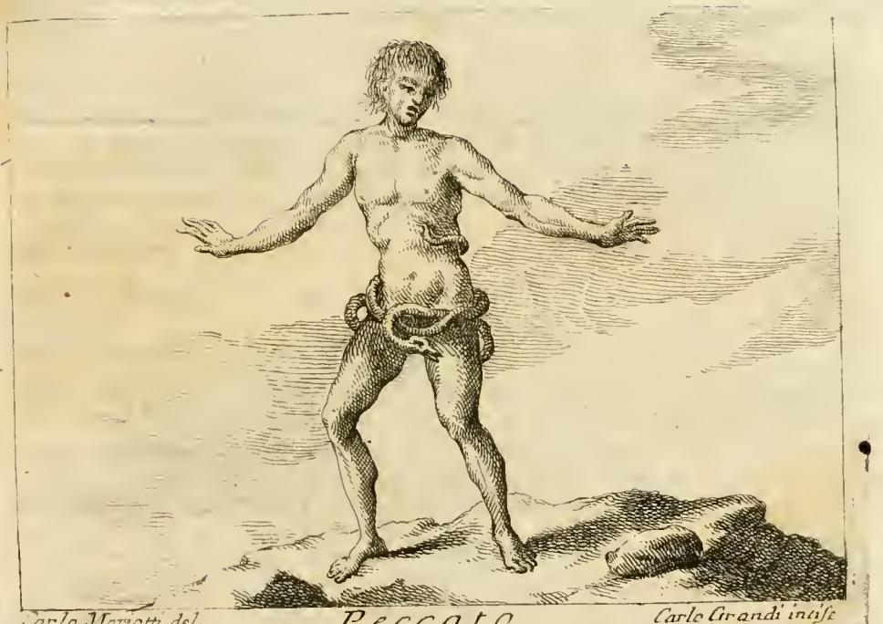
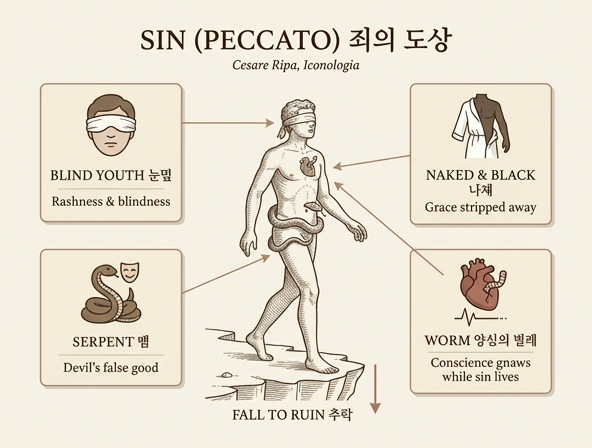

# 죄(Peccato)의 도상 — 눈멂·나체·뱀·벌레의 의미

체사레 리파(Cesare Ripa)의 『이코놀로지아(Iconologia)』는 죄(Peccato)를 **"눈먼 젊은이, 벌거벗고 검은 몸으로 험하고 가파른 길을 걸으며, 허리에는 뱀이 감기고, 왼쪽 옆구리를 파고든 벌레가 심장을 갉는" 인물**로 그린다. 네 가지 속성(눈멂·나체·뱀·벌레)이 각각 죄의 한 측면을 담당하는 전형적인 알레고리 구성이다.

판화를 보면 벌거벗은 젊은이가 바위투성이 벼랑길 위에 서서 두 팔을 벌린 채 더듬듯 걷고 있고, 허리에는 뱀이 칭칭 감겨 있다. 각 요소의 의미는 다음과 같다.

## 1. 젊음과 눈멂(giovine, e cieco) — 경솔과 맹목

죄는 그것을 저지르는 자의 **경솔함(imprudenza)과 맹목(cecità)** 때문에 젊고 눈먼 모습으로 그려진다. 죄란 그 자체로 "법에 대한 위반이자 선에서 벗어남(deviare dal bene)"일 뿐이기 때문이다. 리파가 인용하는 시구가 이를 요약한다: *"죄란 의지는 원하되 이성이 다스리거나 억제하지 못하고, 감각에 동의하여 행위와 습관으로 흐르는 오류다."* — 눈이 멀었기에 그림 속 인물은 가파르고 험한 길(vie precipitofe)을 위태롭게 걷는다.

## 2. 벗은 검은 몸(ignudo, e nero) — 은총의 박탈과 덕의 순백 상실

나체와 검은 피부는 **죄가 은총(grazia)을 벗겨 내고 덕의 순백(candore della virtù)을 완전히 앗아감**을 뜻한다. 은총이라는 '옷'을 잃은 영혼은 벌거숭이가 되고, 덕의 흰빛을 잃어 검게 된다. 게다가 죽음의 시각이 불확실하므로, 참회(penitenza)와 통회로 자신을 돕지 않으면 언제든 지옥으로 추락할 위험 속에 있다 — 판화의 벼랑길이 바로 이 추락의 위험을 시각화한다.

## 3. 허리를 감은 뱀(Serpente) — 마귀의 지배와 거짓 선의 기만

몸을 감은 뱀은 **죄가 곧 우리의 원수인 마귀의 지배(signoria del Diavolo)** 임을 뜻한다. 마귀는 **거짓 선의 모습(finte apparenze di bene)으로 끊임없이 우리를 속이려** 하며, 우리의 불행한 첫 어머니(하와)에게서 거둔 성공을 언제나 다시 기대한다. 에덴의 뱀 이야기가 도상의 직접적 전거다. 판화에서 뱀이 허리를 '묶듯' 감고 있는 것은 죄인이 마귀의 소유물로 결박되어 있음을 보여 준다.

## 4. 심장의 벌레(verme al cuore) — 양심의 가책

왼쪽 옆구리로 파고들어 심장을 갉는 벌레는 신학자들이 말하는 **양심의 벌레(verme della coscienza), 곧 양심 그 자체**다. 이 벌레는 죄지은 영혼을 **찌르고(stimola) 갉으며(rode)**, **죄 안에서 맥박(polso)과 피(sangue)를 느끼는 한 늘 살아서 힘을 얻고 거기서 양분을 취한다**. 즉 죄가 살아 있는 동안 양심의 가책도 결코 죽지 않는다는 뜻으로, "그들의 벌레는 죽지 않는다"(이사야 66:24, 마르코 9:48)는 성경 전통의 '꺼지지 않는 양심의 벌레' 모티프를 잇는다.

## 요약표

| 도상 요소 | 의미 |
|---|---|
| 젊음 · 눈멂 | 죄짓는 자의 경솔(imprudenza)과 맹목(cecità); 이성이 감각을 다스리지 못함 |
| 벗은 검은 몸 | 은총을 벗기고 덕의 순백을 앗아감; 벼랑길 = 지옥 추락의 위험 |
| 감긴 뱀 | 마귀의 지배; 거짓 선의 모습으로 끊임없이 속임 (하와의 전례) |
| 심장의 벌레 | 양심(의 가책); 죄에 맥박과 피가 있는 한 살아서 영혼을 찌르고 갉음 |

*참고: 각주의 P. 리치(Ricci) 판본은 같은 개념을 변주해, 책(하느님의 법)을 찢으며 벼랑으로 떨어지는 추한 인물, 얼룩진 얼굴, 심장에 벌레가 붙은 모습 등으로 죄를 그린다.*

## 인포그래픽

