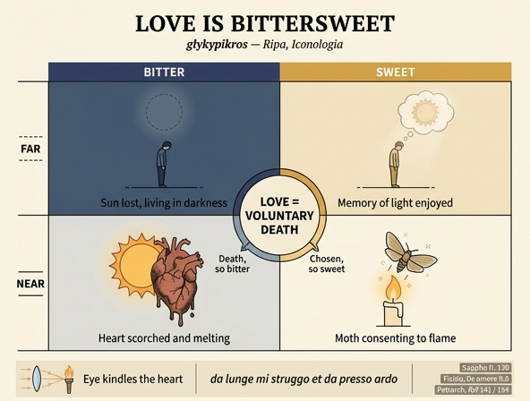

# 사랑의 '달콤쌉쌀함(glicipicro)' — 자발적 죽음으로서의 사랑

> **질문** 사랑이 '달콤쌉쌀함(glicipicro)'인 이유는 어떻게 풀이되는가?
>
> **답** 사랑은 자발적 죽음이어서 죽음인 한 쓰고 자발적인 한 달다. 멀리서는 연인의 태양을 잃어 어둠에 사는 쓴맛과 누렸던 빛의 기억이라는 단맛이, 곁에서는 타고 녹는 쓴맛과 반가운 불꽃 속에 소진되는 단맛이 함께 있으며, 사랑하는 이는 자기를 잊고 상대 속으로 옮겨가므로 완전히 하나 되지 못하는 데서 또 쓴맛이 난다(페트라르카의 나방 비유가 인용된다).

출처는 체사레 리파 『이코놀로지아』(18세기 페루자판) 제4권 「**ORIGINE DI AMORE**(사랑의 기원)」 절이며, 집필자는 리파 본인이 아니라 **조반니 차라티노 카스텔리니**(Giovanni Zaratino Castellini)다. 이 항목의 전체 논제는 "사랑은 **눈**에서 태어난다(*L'Origine di Amore deriva dall'occhio*)"이고, '달콤쌉쌀함'은 그 시각-발화(發火) 이론에서 따라 나오는 **정서 현상학**으로 제시된다.

---

## 1. 도판: 태양 · 렌즈 · 횃불


원문 규정(ekphrasis)은 이렇다.

> *Donna che tenga uno specchio trasparente rotondo, grosso e corpulento, incontro all'occhio del Sole, il quale con i suoi raggi trapassando per mezzo dello specchio, accenda una facella, portata nella mano sinistra. Dal manico dello specchio penda una cartella nella quale sia scritto questo motto:* **SIC IN CORDE FACIT AMOR INCENDIUM.**

여인이 **두껍고 둥근 투명 '거울'**(= 실제로는 볼록렌즈, 이른바 *burning glass*)을 **태양의 눈**에 맞대고, 통과한 광선으로 왼손의 **횃불**에 불을 붙인다. 손잡이에 걸린 명패에는 "**이렇게 사랑은 심장 안에 화재를 일으킨다**"라고 적혀 있다.

알레고리 대응은 명확하다.

| 도판 요소 | 대응 |
|---|---|
| 태양(l'occhio del Sole) | 연인의 아름다운 두 눈 = "il mio bel sole" |
| 두꺼운 투명 렌즈 | 바라보는 자의 눈 (영혼의 창) |
| 점화된 횃불 | 사랑에 불붙은 심장 |
| 태양과 렌즈 사이의 **먼 거리** | 사랑이 **멀리서도** 태운다는 논거 |

**이 마지막 항이 카드의 핵심과 직결된다.** 카스텔리니는 눈에서 나오는 화재가 물질적 불보다 강력하다고 논증한다. 물질적 불은 연료에 닿아야 타지만, "눈에서 튀는 사랑의 불은 **멀리서도** 정신과 심장을 불붙인다(*infiamma la mente, e 'l cuore ancora da lungi*)". 근거로 **바빌로니아 나프타**(*Nafta, fior di bitume*, 역청의 꽃)를 든다 — 떨어져 있어도 불이 옮겨붙는 물질이다. 렌즈 도판은 곧 "부재 상태의 사랑도 실제로 태운다"는 물리학적 담보이고, 따라서 뒤에 나오는 **'멀리서/가까이서' 2×2 구조를 성립시키는 전제**다.

---

## 2. γλυκύπικρος — 사포 단편 130에서 '글리치피크로'까지

### 2.1 사포의 조어

'달콤쌉쌀함'의 원조는 **사포 단편 130**(Lobel–Page/Voigt 130)이다.

> Ἔρος δηὖτέ μ' ὀ λυσιμέλης δόνει,
> **γλυκύπικρον** ἀμάχανον ὄρπετον
>
> "사지를 풀어 놓는 에로스가 또다시 나를 흔든다 /
> 달고-쓰며 손댈 수 없는 기어드는 것"

핵심 두 가지.

- **어순이 '달다'가 먼저다.** γλυκύ(달다) + πικρός(쓰다) = **glykypikros, 문자 그대로 '달고-쓴(sweet-bitter)'**. 영어 *bittersweet*·한국어 '쌉달/달콤쌉쌀'은 순서를 뒤집은 번역이다. 앤 카슨(*Eros the Bittersweet*)이 강조하듯 사포의 어순은 **시간적 순서**를 담는다 — 먼저 달고, 거리와 장애가 끼어들며 쓰게 된다.
- ἀμάχανον은 능동('어쩔 줄 모르는')·수동('당해낼 수 없는') 양의로 읽히고, ὄρπετον은 '기어 다니는 짐승'이다. 즉 에로스는 **제어 불가능한 생물**로 표상된다.

### 2.2 라틴 수용

- **플라우투스** 『Cistellaria』 69–70: *amor et melle et felle est fecundissimus; / gustui dat dulce, amarum ad satietatem usque oggerit* — "사랑은 **꿀과 쓸개즙**이 함께 넘친다. 혀에 단것을 주고, 쓴것은 배가 터질 만큼 퍼붓는다." 카스텔리니의 문장 *"Piene sono le dolcezze di amore di amaro assenzio, anzi di **fiele**"* ("사랑의 단맛은 쓴 **쑥**, 아니 **쓸개즙**으로 가득하다")는 이 *melle/felle* 짝의 직계 후손이다.
- **카툴루스** 68.17–18: *quae dulcem curis miscet amaritiem* — "근심에 **단 쓴맛**을 섞는 여신".

### 2.3 원문의 직접 출처: 플루타르코스 — 그리고 '오르페우스' 오귀

원문은 이 대목을 **플루타르코스 『향연 문답』 제5권 문제 7**(*Quaestiones convivales* V.7, 이른바 '흉안(evil eye)' 논의)에서 끌어온다.

> *Plutarco nel quinto Simposio, questione settima, afferisce che gli amori … pigliano origine e principio dall'aspetto, tantocché l'Amante **si liquefà** quando la cosa amata risguarda, e **in quella passa e si trasmuta**; perciocché lo scambievole sguardo de' belli, e ciò che esce per gli occhi, o sia lume o sia un certo flusso, distrugge gli Amanti e li consuma **con un dolore misto col piacere, da Orfeo chiamato Glicipicro, cioè dolce amaro**, gustato dal Petrarca nel Sonetto…*

여기서 세 가지를 짚어 두면 좋다.

1. **"쾌락과 섞인 고통"(*dolore misto col piacere*)** — 이것이 glicipicro의 정의항이다. 두 감정이 순차가 아니라 **동시에** 있다는 점이 요체다.
2. **"녹아내려 상대 안으로 건너가 변모한다"(*si liquefà … in quella passa e si trasmuta*)** — 뒤에 나올 피치노의 *transformatio*와 정확히 같은 어휘장이며, 카스텔리니가 플루타르코스와 피치노를 잇는 이음새다.
3. **'오르페우스' 귀속은 오류다.** 플루타르코스 원문(681A 부근)은 ἣν **αὐτοὶ** γλυκύπικρον ὀνομάζουσιν, 즉 "**그들(연인들) 스스로** 그것을 글리키피크론이라 부른다"이다. 르네상스 라틴·이탈리아 중역을 거치며 '오르페우스'라는 권위자로 굳어진 것으로 보이며, 실제 조어자는 앞서 본 **사포**다. 카드 답안을 시험할 때 "리파 텍스트는 오르페우스에게 돌리지만 어원은 사포"라고 부기하면 정확도가 올라간다.

플루타르코스 인용 직후 붙는 시가 **페트라르카 『칸초니에레』(Rvf) 173** 「Mirando 'l sol de' begli occhi sereno」다.

> *Mirando 'l sol de' begli occhi sereno … / **Poi trovandol di dolce et d'amar pieno**, … / **Per questi extremi duo contrari et misti**, / or con voglie gelate, or con accese, / **stassi così fra misera et felice**.*

"단맛과 쓴맛으로 가득함을 발견하고 … 이 **섞인 두 극단적 대립물** 때문에 / 얼어붙은 욕망과 불붙은 욕망을 번갈아 / **비참과 행복 사이에** 머문다." — *contrari et misti*(대립하면서 섞인)는 γλυκύπικρον의 완벽한 이탈리아어 번안이다.

---

## 3. 정식: 사랑은 자발적 죽음(mors voluntaria)이다

카드 답안의 첫 문장에 해당하는 원문은 매우 압축적이다.

> *È amaro l'Amore, perché qualunque ama, muore amando, essendo l'Amore **volontaria morte**; **in quanto è morte è cosa amara, in quanto volontaria è dolce**. Muore amando qualunque ama, perché il suo pensiero, **dimenticando sé stesso, nella persona amata si rivolge**, secondo la ragione di **Marsilio Ficino**.*

논증을 분해하면 이렇다.

```
사랑 = 자발적 죽음 (mors voluntaria)
      ├── '죽음'인 측면  → 쓰다 (amara)
      └── '자발적'인 측면 → 달다 (dolce)
```

즉 달콤쌉쌀함은 **감정의 우연한 혼합이 아니라, 정의(定義) 자체가 두 항으로 되어 있기 때문에 생기는 구조적 필연**이다. 이것이 이 카드에서 가장 중요한 논리적 포인트다.

### 3.1 피치노의 출전

**마르실리오 피치노, 『향연 주해(De amore / El libro dell'amore)』 제2연설 8장** — 장 제목이 곧 정식이다: *Quod amor est mors voluntaria. Et de amore simplici et reciproco* ("사랑은 자발적 죽음임에 대하여. 그리고 단순한 사랑과 상호적 사랑에 대하여"). 핵심 명제는 **"quisquis amat moritur"**(사랑하는 자는 누구나 죽는다).

피치노의 근거는 **주의(注意)의 이동**이라는 심리-존재론이다.

- 사랑하는 이의 사고는 자기를 **잊고**(*sui oblitus*) 사랑받는 이에게로 향한다.
- 자기 안에서 자기를 생각하지 않으면 자기 안에 살지 않는다 → **자기 안에서는 죽었다.**
- 그러나 상대 안에서 생각되므로 **상대 안에서 산다.**
- 그러므로 죽음은 강제가 아니라 **자발적**이다(칼이 아니라 사랑이 죽인다). ⇒ 쓴맛과 단맛의 동시성.

### 3.2 상호 전이(mutua transformatio)와 카드의 마지막 쓴맛

피치노는 여기서 **단순한 사랑**과 **상호적 사랑**을 갈라놓는다.

| 유형 | 결과 |
|---|---|
| **amor simplex** (짝사랑) — 상대가 되사랑하지 않음 | 죽음 하나, **부활 없음**. 사랑받는 자는 사실상 **살인자(homicida)** |
| **amor mutuus / reciprocus** (상호적 사랑) | 각자 자기 안에서 **한 번 죽고**, 상대 안에서 **두 번 부활**한다 — *한 번의 죽음, 두 번의 부활* |

카스텔리니는 이 전이 논리를 그대로 가져와 **가장 깊은 쓴맛**을 도출한다.

> *è **doppiamente amaro**, perché muore, **non potendo trapassare e trasformarsi totalmente in lei**, e con ella internamente unirsi; essendo impossibile che da sé stesso totalmente si divida e si disunisca affatto.*

"**두 배로 쓰다.** 왜냐하면 그는 죽는데도, 상대 속으로 **완전히** 건너가 변모하여 내적으로 하나가 되지는 **못하기** 때문이다. 자기 자신에게서 자기를 온전히 갈라내어 완전히 분리하는 것은 **불가능**하므로."

여기가 핵심이다. **자아 소멸은 진짜로 일어나기에는 충분하지만(→ 죽음, 쓴맛), 완결되기에는 불충분하다(→ 잔여 자아, 이중의 쓴맛).** 이 '완결 불가능한 합일'이 사랑을 **영원히 미해결로 남는 상태**로 만들고, 바로 그래서 다음 문장이 나온다.

> *onde sempre brama, per maggior unione, **di aggirarsi intorno all'amato lume**.*
> "그러므로 더 큰 합일을 위해 늘 **사랑하는 빛 주위를 맴돌기를** 갈망한다."

**'빛 주위를 맴돈다'** — 이 동작이 곧 나방을 불러들인다.

---

## 4. 페트라르카의 나방: Rvf 141

앞 문장 바로 뒤에 인용되는 시가 **『칸초니에레』 141번 소네트** 「Come talora al caldo tempo sòle」다.

> *Come talora al caldo tempo **sòle** /
> **semplicetta farfalla** al lume avezza /
> volar negli occhi altrui per sua vaghezza, /
> onde aven ch'**ella more**, altri si dole: //
> così sempre io corro al **fatal mio sole** /
> degli occhi onde mi vèn tanta **dolcezza** /
> che 'l fren de la ragion Amor non prezza, /
> et chi discerne è vinto da chi vòle. // …
> Ma sì m'abbaglia Amor **soavemente**, /
> ch'i' piango l'altrui noia et non mio danno, /
> et **cieca al suo morir l'alma consente**.*

번역 요지: "더운 계절이면 흔히 그러하듯 / **어리숙한 나방**이 등불에 익숙해져 / 제 마음에 끌려 남의 눈 속으로 날아들고 / 그래서 **그것은 죽고** 남은 사람이 괴로워하듯 // 나도 늘 내 **운명의 태양**에게로 달려간다, / 그토록 큰 **단맛**이 오는 그 눈들의 태양에게. / 사랑은 이성의 고삐를 값으로 치지 않고, / 분별하는 자는 의지하는 자에게 진다. // … 그러나 사랑이 나를 어찌나 **부드럽게** 눈멀게 하는지, / 나는 내 손해가 아니라 남의 곤란을 울고, / **눈먼 영혼은 자기 죽음에 동의한다**."

이 비유가 왜 정확히 여기 놓이는지 세 겹으로 확인된다.

1. **동작의 일치** — 피치노-카스텔리니의 *aggirarsi intorno all'amato lume*(빛 주위를 맴돌기)가 나방의 궤적 그 자체다.
2. **자발성의 일치** — 마지막 행 *cieca al suo morir l'alma consente*("영혼이 자기 죽음에 **동의한다**")는 *mors **voluntaria***의 시적 번역이다. 강제된 죽음이 아니라 **승낙된** 죽음이므로 달다.
3. **달콤쌉쌀함의 일치** — *m'abbaglia Amor **soavemente*** — 눈멀게 함(쓴맛)과 부드러움(단맛)이 한 구(句) 안에 있다.

> 참고: 나방-불 비유 자체는 오래된 상투(플라우투스, 페트루스 알폰시, 오리엔트 전승, 후대엔 수피 시의 *파르바네*)지만, 리파 텍스트가 인용하는 것은 **페트라르카 Rvf 141**이며, 사랑을 '자발적 죽음'으로 정의한 뒤 그 **동의(consenso)** 대목을 근거로 삼는 방식이 여기 특유의 용법이다.

---

## 5. 원문 논증의 뼈대: 거리(멀리/가까이) × 맛(쓴/단) 2×2

카스텔리니는 위 정식을 **거리 변수**로 전개한다. 요지는 "사랑은 멀리서도 쓰고 가까이서도 쓰다 — 그리고 양쪽 다 동시에 달다"이며, 네 칸 모두가 **불/빛/태양**이라는 같은 은유로 채워진다.

|  | **쓴맛 (amaro)** | **단맛 (dolce)** |
|---|---|---|
| **멀리서 (di lontano)** | 자기의 아름다운 태양에서 멀어져, 그 **결핍(privazione)** 때문에 **어두운 암흑 속에 살며** 끊임없이 안타까워하고 그 빛을 누리기를 갈망한다 | 누렸던 빛의 즐거움에 대한 **기억(rimembranza)** 때문에, 멀리 있어도 달다 |
| **가까이서 (in presenza)** | 사랑받는 빛 앞에서 연인은 **그슬리고, 타오르고, 녹아 없어진다**(*si abbruccia, si arde, si strugge*) | 자기의 **아름다운 불**, 자기가 **반기는 불꽃** 속에서 소진되기 때문 — 그 안에서 괴로워하는 것이 그 밖에서 즐거워하는 것보다 더 달다(*gli è più dolce il penare che fuor di quel gioire*). 게다가 상대 안으로 옮겨가 그 안에서 상대를 통과하므로 더욱 달다 |

여기에 **거리와 무관한 잔여항**이 하나 더 붙는다.

- **이중의 쓴맛(doppiamente amaro)**: 완전한 전이·합일이 원리상 불가능함 (§3.2). 이것은 2×2의 다섯 번째 항, 곧 **구조 자체가 남기는 쓴맛**이다.

### 5.1 네 칸을 봉인하는 인용들

원문은 각 매듭마다 페트라르카를 한 편씩 박아 넣어 논증을 봉합한다. 배치 자체가 논증의 지도다.

| 위치 | 인용 | 기능 |
|---|---|---|
| 플루타르코스 정의 직후 | **Rvf 173** 「Mirando 'l sol de' begli occhi sereno」 — *di dolce et d'amar pieno / per questi extremi duo contrari et misti / stassi così fra misera et felice* | glicipicro = "섞인 두 대립물"의 **정의 예시** |
| '빛 주위 맴돌기' 직후 | **Rvf 141** 「Come talora al caldo tempo sòle」 — 나방 | **자발성**의 증거 (*l'alma consente*) |
| "동시에 달고 쓰다" 논지 | **Rvf 194** 「L'aura gentil, che rasserena i poggi」 — *I' chiederei a scampar, non arme, anzi ali; / ma perir mi dà 'l ciel per questa luce, / **ché da lunge mi struggo et da presso ardo**.* | **2×2의 거리축 자체를 한 행으로 요약** — "멀리서는 녹아내리고, 가까이서는 타오른다" |
| "쓴것이 곧 단것" 논지 | **Rvf 229** 「Cantai, or piango…」 — *Arda o mora o languisca, un più gentile / stato del mio non è sotto la luna, / **sì dolce è del mio amaro la radice**.* | 두 맛의 **동일 뿌리**: 쓴맛의 뿌리가 달다 |
| 결론 (원인 지목) | **Rvf 220** 「Onde tolse Amor l'oro…」 — *Di qual sol nacque l'alma luce altera / di que' belli occhi ond'io ò guerra et pace, / **che mi cuocono il cor in ghiaccio e 'n fuoco**?* | 이 모든 혼합의 **유일한 원인 = 두 아름다운 눈의 태양** ("얼음과 불로 내 심장을 익힌다") |

**Rvf 194의 마지막 행이 이 항목의 열쇠**다. *da lunge mi struggo et da presso ardo* — 카스텔리니의 산문 논증(멀리서 = 결핍의 어둠, 가까이서 = 연소)이 페트라르카 한 행에 이미 압축되어 있고, 카스텔리니는 사실상 그 행을 산문으로 풀어쓴 셈이다.

### 5.2 결론과 실천적 반전

원문은 여기서 그치지 않는다. 마지막 인용은 **아풀레이우스 『변신』 제10권** 서두, 계모가 의붓아들에게 하는 고백이다.

> "이 내 고통의 **원인이자 기원**이며, 또한 나의 **약이자 구원**인 것은 오직 그대다. 그대의 그 눈들이 내 눈을 통과해 내 심장 깊은 곳까지 들어와, 내 골수 안에 지독히 **매서운 화재**를 일으키기 때문이다."

**병과 약이 동일한 대상**이라는 이 정식은 glicipicro의 마지막 변주다. 이어 그리스 격언 계열의 라틴 문구(*Amor ex intuendo nascitur*, "사랑은 응시에서 태어난다")로 논제를 봉인한다.

그런 다음 카스텔리니는 인문주의 알레고리에서 **금욕적 처방**으로 방향을 튼다. 원인이 봄이라면 치료는 **시선을 돌리는 것**이다 — *averte oculos tuos ne videant vanitatem*. 그리고 라틴어 유음 유희로 된 격언을 붙인다.

> *Quid facies, facies Veneris si veneris ante? / **Ne sedeas, sed eas, ne pereas per eas.***
> "베누스의 얼굴 앞에 오게 되면 무엇을 하려는가? / **앉지 말고 가라, 그것들(눈들) 때문에 망하지 않으려면.**"

이어 플라톤적 사랑의 위험(루키아노스를 인용한 *시각→접촉→입맞춤→성행위*의 4단 계단), 다윗·삼손·솔로몬, 아라스페스와 판테아, 마케도니아 아민타스 궁정의 페르시아 사절 이야기, 클레오파트라와 아우구스투스, 그리고 눈이 오염을 옮겨 받는다는 **카라드리오스(charadrius) 새** 이야기가 이어진다. 요컨대 **§1~5의 우아한 형이상학은 결국 "쳐다보지 말라"는 경고로 귀결**된다 — 이 이중 성격(플라톤주의 찬가 + 도덕적 경계) 자체가 리파 『이코놀로지아』 후기 항목들의 전형이다.

---

## 6. 한 줄 요약 / 암기 골격

```
        사랑 = 자발적 죽음 (Ficino, De amore II.8)
        죽음이라서 쓰다  ·  자발적이라서 달다
                    ↓ 거리 변수로 전개
              쓴맛(amaro)              단맛(dolce)
  멀리   태양 상실 → 어둠·결핍       누린 빛의 기억
  가까이  그슬림·연소·용해            반가운 불꽃 속 소진 + 상대로의 전이
                    ↓ 잔여
        완전한 합일 불가 → 이중의 쓴맛 → 빛 주위 맴돌기 → 나방 (Rvf 141)
                    ↓ 한 행 요약
        "da lunge mi struggo et da presso ardo" (Rvf 194)
```

- 용어: **γλυκύπικρος**(사포 fr. 130, '달고-쓴') → 라틴 *melle et felle*(플라우투스), *dulcem amaritiem*(카툴루스) → 플루타르코스 *Quaest. conv.* V.7 → 이탈리아어 **glicipicro**(리파 텍스트는 오르페우스에게 귀속 — 실은 사포)
- 정식: **mors voluntaria** — 피치노 『De amore』 II.8, *quisquis amat moritur*, 상호 전이(*mutua transformatio*), 한 번의 죽음 / 두 번의 부활
- 도판: 볼록렌즈로 태양광을 모아 횃불을 켬 + **SIC IN CORDE FACIT AMOR INCENDIUM** → "멀리서도 태운다"는 물리적 담보
- 페트라르카 색인: **173**(섞인 두 대립물) · **141**(나방·자발적 동의) · **194**(멀리서 녹고 가까이서 탐) · **229**(쓴맛의 뿌리가 달다) · **220**(얼음과 불로 심장을 익히는 두 눈)

---

## 인포그래픽


