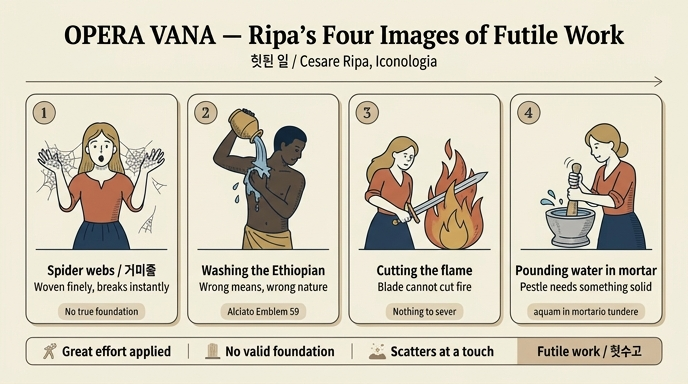

# 헛된 일 (Opera Vana) — 리파의 세 가지 형상

## 한눈에 보기

체사레 리파는 『이코놀로지아』의 **OPERA VANA**(헛된 일) 항목에서 하나의 정답을 주지 않고 **세 가지 서로 다른 형상**을 나란히 제시한다. 셋 다 "결과가 남지 않는 노력"을 말하지만 강조점이 다르다.

| # | 형상 | 시각적 핵심 | 강조하는 것 |
|---|---|---|---|
| 1 | **거미줄을 든 여인** | 놀란 표정(sembiante attonito)으로 두 손 가득 거미줄(tele di ragno)을 쥐고 바라본다 | **기초의 부실** — 정성껏 만들었지만 근거가 없어 무너진다 |
| 2 | **몸을 씻는 무어인** | 벌거벗은 채 한 손에 물그릇을 들고 등에 물을 끼얹으며, 다른 손으로 검은 피부를 벗겨내려 한다 | **수단의 부적합** — 애초에 방법 자체가 목적에 닿을 수 없다 |
| 3 | **불꽃을 베거나 절구에 물을 찧는 여인** | 칼로 큰 불꽃을 내리치거나, 절구에 물을 넣고 공이로 찧는다 | **대상의 성질** — 붙잡을 수 없는 것을 붙잡으려 한다 |

리파는 세 번째 형상에 "**그럴듯하게 그릴 수 있다면**(se però con verisimile si potrà dipingere)"이라는 유보를 달았다. 관념적 격언을 회화로 옮길 때의 난점을 저자 스스로 인정한 드문 대목이다.

---

## 1. 거미줄을 든 여인 — 정답 카드의 본체

원문(리파, 판본은 페루자판 『TOMO QUARTO』, 273~274면):

> **D**onna, che sta con sembiante attonito a riguardare molte tele di ragno, che essa tiene con ambe le mani, per dinotare, che siccome quelle tele sono tessute con gran diligenza, e fabbricate con fatica, per la sottigliezza loro, nondimeno sono sottoposte ad ogni piccolo intoppo, perché ogni cosa le guasta, come le Opere vane, non avendo fondamento di vere e perfette ragioni, per ogni vile incontro dissipate vanno per terra.
>
> (여인이 놀란 얼굴로, 두 손에 쥔 여러 개의 거미줄을 바라보고 있다. 그 거미줄들은 **큰 정성으로 짜이고 수고로 만들어졌음에도**, 그 가느다람 때문에 **아주 작은 걸림에도 무너지고 무엇에든 망가진다**. 헛된 일도 이와 같아서, **참되고 완전한 근거(vere e perfette ragioni)라는 토대가 없으므로** 아무리 사소한 마주침에도 흩어져 땅에 떨어진다.)

리파가 짚는 논리 구조는 세 단계다.

1. **기술적 완성도는 인정한다** — `con gran diligenza`, `con fatica`. 거미줄은 자연이 만든 정밀 구조물이다. 즉 헛된 일은 게으름의 결과가 아니다.
2. **그러나 실체가 없다** — `per la sottigliezza loro`(그 얇음 때문에). 정교함이 곧 견고함은 아니다.
3. **따라서 최소 외력에 붕괴한다** — `per ogni vile incontro`(아무리 하찮은 마주침에도). "vile"은 여기서 '비열한'이 아니라 '값싼·대수롭지 않은'의 뜻이다.

**놀란 표정(attonito)**이 이 형상의 감정적 핵이다. 여인은 거미줄을 자랑하지도, 슬퍼하지도 않는다. 손 안에서 자기 노력의 결과가 아무것도 아니었음을 **뒤늦게 깨달은 얼굴**이다. 리파의 다른 악덕 형상들이 흔히 표정보다 지물(attributi)로 말하는 데 비해, 여기서는 표정 자체가 의미를 담당한다.

### 리파 안에서 거미줄이 쓰이는 다른 자리

거미줄은 리파의 어휘집 안에서 재활용되는 기호다. 같은 자산의 다른 항목들과 비교하면 '헛된 일'의 좌표가 선명해진다.

| 항목 | 거미(줄)의 용법 | 대비점 |
|---|---|---|
| **Opera vana** (헛된 일) | 정교하나 근거 없는 구조물 | 무너지는 쪽에 초점 |
| **Malvagità / Malignità** (악덕·심술) | 옷 전체에 거미가 기어다닌다. 카시오도루스를 인용해 "약하고 지극히 가느다란 거미가 지나가는 파리에게 속임의 그물을 짠다"고 풀이 | **남을 해치려는** 헛된 계략(`inanibus, & subdolis machinationibus`) |
| **Morte** (죽음) | 죽음의 지물 중 하나로 거미 — "지극히 약한 동물이며 가장 부서지기 쉬운 그물을 짜므로 인간 생명의 취약함을 암시" | 인생 자체의 무상함 |
| **Pioggia** (비, 공기의 님프) | 소녀가 줄을 짜는 거미를 손에 든다. 플리니우스 『자연사』 11권 — 거미는 흐릴 때 더 부지런히 짠다 | 여기서는 **길조·기상 표지**로 중립적 |
| **Dialettica** (변증학, 전통 도상) | 논변의 촘촘한 그물망 | 같은 기호의 **긍정적** 전용 |

같은 거미줄이 '치밀한 논리'도 되고 '헛된 수고'도 된다는 점이 리파식 알레고리의 특성이다. 기호의 뜻은 **어떤 속성에 주목하는가**(촘촘함 vs 부서짐)에 따라 뒤집힌다.


위 판화는 같은 자산에 실린 **「Malvagità(악덕)」** 도판이다(Carlo Mariotti 소묘 / Carlo Grandi 판각). 「Opera vana」 도판 자체는 이 자산의 이미지 추출에서 빠져 있으나, 이 그림에서 리파가 거미를 어떻게 시각화했는지는 그대로 확인된다. 실제로 관찰되는 요소들:

- **드레스 전면에 반복 배치된 작은 거미 문양** — 리파가 "ma che siano visibili, e conosciuti per tali"(반드시 눈에 보이고 거미로 알아볼 수 있어야 한다)고 못 박은 그 조건대로, 장식 무늬가 아니라 식별 가능한 거미로 새겨져 있다. 「Opera vana」의 손에 들린 거미줄도 같은 계열의 지물이다.
- **오른손의 칼, 왼손의 (닫힌) 주머니** — 「Opera vana」 세 번째 형상에서 여인이 불꽃을 향해 드는 칼과 같은 도구가, 여기서는 실제 해악의 도구로 쓰인다. 같은 지물이 항목에 따라 다르게 기능함을 보여주는 예.
- **머리를 감싼 짙은 연기, 좌우의 공작과 곰** — 이 셋은 「Malvagità」 고유의 지물(연기=판단력을 흐림, 공작=오만, 곰=분노)로, 「Opera vana」에는 없다. 거미줄만 공유하고 나머지는 갈라진다는 점에서 두 항목의 경계가 확인된다.
- **옷의 노란빛(giallolino)** — 리파는 이 색을 "자기 안에 안정되고 실재하는 토대가 없기 때문에(non avendo egli in sé fondamento stabile, e reale) 어떤 덕에도 붙일 수 없는 색"이라 설명한다. **`fondamento`라는 같은 단어**가 「Opera vana」의 "참되고 완전한 근거의 토대가 없다"에 다시 등장한다 — 리파의 어휘 내부에서 두 항목이 실제로 연결되어 있다는 증거다.

---

## 2. 몸을 씻는 무어인 — Aethiopem lavare

원문:

> **U**n uomo moro, ignudo, il quale con una mano tenga un vaso di acqua, e se la sparga per dosso, e coll'altra mostri di volersi levar via la negrezza; e questo può esser simbolo delle opere vane, che alla fine non possono aver esito lodevole, per non esservi né debiti mezzi, né debita disposizione. Veggasi negli Adagj, **Aetiopem lavas**, figurato dall' **Alciato nell' Emblema 59**.
>
> (벌거벗은 무어인 남자가 한 손에 물그릇을 들어 등에 물을 붓고, 다른 손으로는 검은빛을 벗겨내려는 시늉을 한다. 이는 헛된 일의 상징이 될 수 있는데, **마땅한 수단(debiti mezzi)도, 마땅한 준비(debita disposizione)도 없기에** 끝내 칭송받을 결과에 이를 수 없기 때문이다. 『아다지아』의 「에티오피아인을 씻는다」를 보라. 알치아토가 엠블렘 59에서 형상화했다.)

여기서 리파의 초점은 1번과 미묘하게 다르다. 1번이 **구조의 취약성**이라면 2번은 **수단과 대상의 불일치**다. `debiti mezzi`(적정한 수단)와 `debita disposizione`(적정한 소질·조건)이 없으면 노력의 양과 무관하게 결과가 없다는 것.

### 격언의 계보

이 격언은 르네상스 인문주의자들이 가장 즐겨 쓴 '불가능' 비유 중 하나로, 계보가 뚜렷하다.

1. **『그리스 사화집』(Anthologia Graeca) 11.428** — 알치아토 에피그램의 직접 원천.
2. **이솝 우화** (Perry 색인 393, 「에티오피아인을 씻기」) — 주인이 검은 노예의 검은빛을 씻어내려 하지만 실패한다. 교훈은 "타고난 본성은 바뀌지 않는다".
3. **에라스뮈스 『아다지아』 350번** (= I.iv.50) **"Aethiopem lavas"** — 리파가 "Veggasi negli Adagj"로 지시한 바로 그 항목. 리파의 인용 방식(격언집 → 엠블렘집 → 자기 도상)은 당시 도상학 저술의 표준 작업 절차를 그대로 보여준다.
4. **알치아토 『엠블레마타』, 엠블렘 「Impossibile」(불가능한 것)** — 표어 `Impossibile`, 에피그램:

   > *Abluis Aethiopem quid frustra? ah desine: noctis / illustrare nigrae nemo potest tenebras.*
   > (왜 헛되이 에티오피아인을 씻는가? 아, 그만두라. **검은 밤의 어둠을 밝힐 수 있는 자는 없다.**)

   목판/동판 삽화는 두 명의 밝은 피부 인물이 물가에서 어두운 피부의 남자를 씻기는 장면이다. **리파가 말한 "Emblema 59"라는 번호는 1621년 파도바판 계열 알치아토의 번호와 일치한다.** 알치아토는 판본마다 엠블렘 순서·번호가 달라서 같은 「Impossibile」이 독일어판 등에서는 84번으로 매겨진다 — 리파가 어느 판본을 손에 두고 작업했는지 짐작할 수 있는 단서다.
5. **후대 확산** — 제프리 휘트니 『A Choice of Emblemes』(1586)가 알치아토 도판을 거의 그대로 옮겨 영어권에 정착시켰고, 이후 "to wash an Ethiop white"는 셰익스피어 시대 영어의 상용 표현이 되었다.

> **읽을 때 유의** — 이 격언은 "검은 피부는 씻겨지지 않는다"는 관찰을 "본성은 바뀌지 않는다"의 비유로 쓰면서, 흑인성을 '지울 수 없는 결함'의 자리에 놓는 전제를 깔고 있다. 오늘날 이 계열 엠블렘은 근세 유럽 인종 담론의 사료로 읽히며, 실제로 최근 엠블렘 연구의 주요 주제 중 하나다. 리파의 논리 자체(수단-목적 불일치)와 그 논리를 실어 나른 이미지의 인종적 함의는 분리해서 볼 필요가 있다.

---

## 3. 불꽃 베기 / 절구에 물 찧기 — adynata(불가능 어법)의 목록

원문:

> **D**onna, la quale colla spada tagli una gran fiamma di fuoco, ovvero come si dice in proverbio, pesti l'acqua nel mortaio; **se però con verisimile si potrà dipingere.**
>
> (여인이 칼로 큰 불꽃을 베거나, 혹은 속담대로 절구에 물을 찧는다. **다만 그럴듯하게 그릴 수 있다면.**)

리파는 이 두 이미지를 "속담대로(come si dice in proverbio)"라고 명시한다. 창작이 아니라 **당대 구어 속담을 그림으로 옮기려는 시도**라는 뜻이다.

### 절구에 물 찧기

- 이탈리아어 **`pestare l'acqua nel mortaio`**, 라틴어 **`aquam in mortario tundere`**. 뜻은 "이익 없이 애쓰다(affaticarsi senza profitto)".
- 논리: 공이(pestello)는 단단하고 저항하는 것을 부수어 섞기 위한 도구다. **액체에는 부술 것이 없으므로** 동작 자체가 무의미해진다. 도구는 정상, 대상이 잘못 골라진 경우.
- 이탈리아어에서는 지금도 살아 있는 관용구이며, 제노바 방언(`pestâ l'ægua in to mortâ`) 등 지역 변형도 있다.

### 같은 계열의 형제 격언들 (adynata / impossibilia)

| 격언 | 뜻 | 출처·비고 |
|---|---|---|
| **Cribro aquam haurire** (체로 물을 담다) | 헛된 노동(`inanis opera`)의 대표형 | 에라스뮈스 『아다지아』 360번. "Haurit aquam cribro, qui discere vult sine libro"(책 없이 배우려는 자는 체로 물을 뜬다)로 학습 격언화 |
| **Aquam in mortario tundere** (절구에 물을 찧다) | 무익한 반복 | 리파가 직접 인용 |
| **Laterem lavare** (벽돌을 씻다) | 씻을수록 흙이 풀려 더 더러워짐 | 테렌티우스 『포르미오』 계열 |
| **Aethiopem lavare** (에티오피아인을 씻다) | 본성은 못 바꾼다 | 위 2번 |
| **불꽃을 칼로 베다** | 형체 없는 것을 자르려는 시도 | 그리스계 격언 "쇠로 불을 쑤시다(πῦρ σιδήρῳ σκαλεύειν, 피타고라스 훈계)"와 인접 |
| **모래를 세다 / 바다에 물을 붓다** | 끝없는 헛수고 | 고전 수사학의 상투 |

신화 쪽 인접 이미지로는 **다나이데스**(밑 빠진 항아리에 영원히 물을 붓는 형벌)와 **시시포스**(굴러 내리는 바위)가 있다. 반대로 **베스타 여사제 투키아**가 체로 물을 길어 정결을 증명했다는 전승은 "불가능한 일"이 기적으로 일어난 예로 기록되었다 — 즉 "체로 물 담기"가 불가능의 표준 척도였음을 역으로 증언한다.

---

## 왜 하나가 아니라 세 개인가

리파의 『이코놀로지아』는 화가·시인·장식가를 위한 **실무 참고서**였다. 한 개념에 복수의 형상을 병치하는 것은 편집상의 미결정이 아니라 설계 의도다.

- 발주 상황(벽화, 천장화, 판화, 문장)에 따라 **화면과 예산에 맞는 안**을 고를 수 있다.
- 개념의 서로 다른 국면을 각각 담당한다: 1번=토대 부재, 2번=수단 부적합, 3번=대상 성질.
- 3번의 `se però con verisimile si potrà dipingere`는 리파가 **회화적 실현 가능성**을 스스로 저울질한 흔적이다. 물을 절구에 찧는 장면은 정지된 화면에서 "물"과 "찧는 동작"을 동시에 읽히게 만들기 어렵다.

---

## 암기 포인트

- **핵심 지물 = 거미줄**, **핵심 표정 = 놀람(attonito)**, **핵심 어휘 = `fondamento`(토대) 부재**.
- 세 변형을 "**거미줄 / 무어인 씻기 / 불꽃 베기·절구에 물 찧기**" 순으로 외운다.
- 문헌 연결고리 딱 하나만 외운다면: **`Aethiopem lavas` → 에라스뮈스 『아다지아』 350 → 알치아토 엠블렘 59 「Impossibile」**.
- 혼동 주의: 리파에서 **거미줄이 등장하는 다른 항목**은 Malvagità(남을 해치는 헛된 계략), Morte(생명의 취약함), Pioggia(비의 징조), Dialettica(치밀한 논변). '헛된 일'만 **무너짐**에 초점이 있다.

---

## 원문 발췌 (해당 자산, `12 Honor to Origin of Love.md` 64~78행)

```
#### 0 P B A V. A n R A ..   [= OPERA VANA]
Onna che sta con sembiante attonito a riguardare molte tele di ragno, che essa
tiene con ambe le mani, ... come le Opere vane, non avendo fondamento di vere
e perfette ragioni, per ogni vile incontro dissipate vanno per terra

#### Opera vana.
[U]n Vomo moro, ignudo, il quale con una mano tenga un vaso di acqua, e se la
sparga per dosso, e coll'altra mostri di volersi levar via la negrezza; ...
per non esservi né debiti mezzi, né debita disposizione.
Veggasi negli Adagj. Aetiopem lavas, figurato dall' Alciato nell' Emblema 59.

#### Opera vana.
[D]onna, la quale colla spada tagli una gran fiamma di fuoco, ovvero come si
dice in proverbio, pesti l'acqua nel mortaio; se però con verisimile si potrà
dipingere.
```

*(OCR 텍스트이며, 각 항목 첫 글자는 장식 대문자여서 `Onna`=`Donna`, `Vomo`=`Uomo`처럼 첫 자가 누락되어 있다. 장문 s(ſ)가 f로 읽힌 흔적도 다수다.)*

### 이 카드의 도판에 대한 메모

이 자산의 이미지 폴더(`Iconologia (Cesare Ripa)/`)에는 「Opera vana」에 해당하는 판화가 포함되어 있지 않다. 해당 대목은 원서 273~274면에 있는데, 추출된 이미지는 272면(「Offesa」 판화) 다음이 286면(「Orazione」 판화)으로 건너뛴다 — 「Onore」와 「Opera vana」 도판이 추출 단계에서 누락된 것으로 보인다. 위에 실은 「Malvagità」 판화는 같은 판화가 콤비(Mariotti–Grandi)의 작품으로, 리파가 거미를 어떻게 도상화했는지 확인하는 대체 자료로 사용했다.

---

## 인포그래픽


