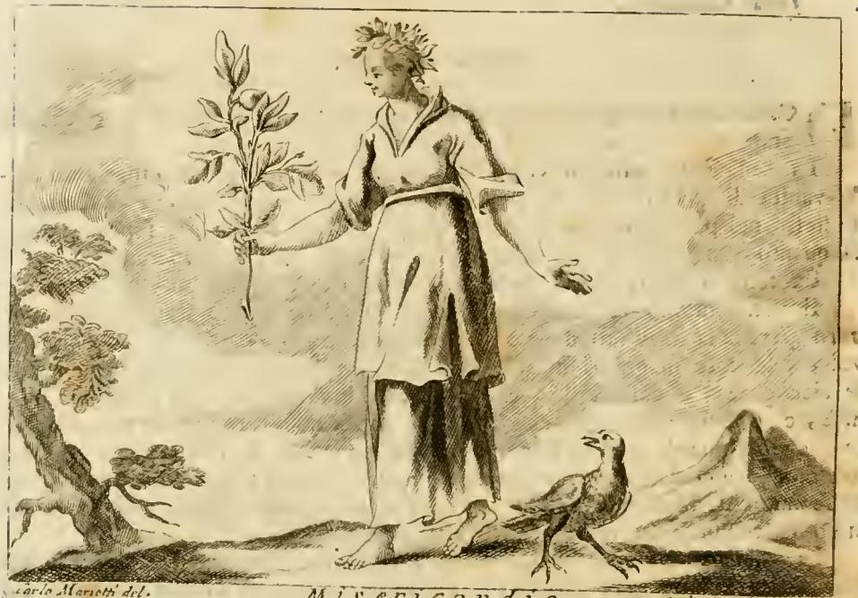

# 리파의 「자비(MISERICORDIA)」 의인상 읽기

## 1. 질문과 답의 핵심

**질문**: 리파는 '자비(Misericordia)'를 어떻게 의인화했는가?

**답**: 흰 피부에 큰 눈, 약간 매부리코의 여인이 올리브 화관을 쓰고 두 팔을 벌린 채, 오른손에 열매 달린 시트론(cedro) 가지를 들고 곁에 폴라(까마귀류) 새가 있다. 다마스쿠스의 성 요한에 따라 자비는 '타인의 불행을 함께 아파하는 마음의 정(情)'이다.

이 카드는 **지물(attribute) 목록 + 정의**의 두 층으로 되어 있다. 리파의 항목은 언제나 ① 화가에게 주는 *처방전*(무엇을 어떻게 그려라)과 ② 그 처방의 *전거*(왜 그것이 그 뜻인가)로 나뉘는데, 이 항목은 그 구조가 특히 깔끔하다.

---

## 2. 원문(Iconologia, 「MISERICORDIA」, Di Cesare Ripa)

에셋의 OCR(장음 s가 f로 읽힌 부분 등)을 정리한 이탈리아어 원문과 번역이다.

> **Donna di carnagione bianca. Avrà gli occhi grossi, e il naso alquanto aquilino, con una ghirlanda di olivo in capo, stando colle braccia aperte; ma tenga colla destra mano un ramo di cedro, con il frutto. Accanto vi sarà l'uccello Pola, ovvero Cornacchia.**
>
> 흰 피부의 여인. 큰 눈과 약간 매부리코를 가질 것이며, 머리에 올리브 화관을 쓰고 두 팔을 벌린 채 서 있되, 오른손에는 열매가 달린 시트론 가지를 들 것이다. 옆에는 '폴라(Pola)', 곧 코르나키아(까마귀) 새가 있을 것이다.

> **Misericordia è un affetto dell'animo compassionevole verso l'altrui male, come dice S. Giovanni Damasceno lib. 2. cap. 24.**
>
> 자비란 타인의 악(불행)에 대해 함께 아파하는 마음의 정(情)이다 — 다마스쿠스의 성 요한, 『(정통 신앙에 관하여)』 제2권 24장.

이하 각 지물의 논거가 하나씩 붙는다. 아래 3장에서 그림과 대조하며 따라간다.

---

## 3. 판화 도판과 지물 대조

도판(18세기 페루자판 『Iconologia』 제4권, 좌측 하단에 `Carlo Marietti del.` 서명)에서 실제로 관찰되는 것과 처방을 맞춰 보면:

| 원문 처방 | 도판에서 보이는 것 |
|---|---|
| 흰 피부, 큰 눈, 매부리코 | 정면을 향한 몸에 얼굴만 측면(프로필)으로 돌려, 콧등이 살짝 휘고 눈이 크게 드러나도록 배치. 음영(해칭)을 얼굴에 거의 넣지 않아 밝은 살빛으로 처리 |
| 머리의 올리브 화관 | 이마를 두른 잎사귀 관 |
| 두 팔을 벌림(braccia aperte) | 양팔이 몸에서 떨어져 벌어져 있고, 왼손은 손바닥을 펴 아래쪽 앞으로 내밀어 '받아들이는' 제스처 |
| 오른손의 열매 달린 시트론 가지 | 화면 왼쪽(인물의 오른손)에 치켜든, 넓은 타원형 잎과 둥근 열매가 달린 가지 |
| 곁의 폴라(까마귀) 새 | 오른쪽 아래 땅 위에 선 새. 부리를 벌리고(울음소리) 목을 들어 인물을 향해 올려다본다 |
| (배경) | 맨발, 허리띠를 맨 단순한 긴 튜닉. 왼쪽에 기울어진 나무, 오른쪽에 원뿔형 언덕, 해칭으로 처리한 하늘 |

**관찰상의 어긋남**: 판화의 팔은 '활짝'이라기보다 절제된 정도로만 벌어져 있고, 가지의 열매도 큰 시트론(citron)이라기엔 작고 둥글게 새겨져 있다. 화관 잎도 올리브의 좁고 긴 잎보다 넓어 보인다. 리파의 텍스트가 먼저이고 삽화가는 후대의 다른 사람이라, 이런 정도의 시각적 근사(近似)는 『Iconologia』 판본 전반에서 흔하다.

---

## 4. 지물별 논거 하나씩

### 4-1. 흰 피부 · 큰 눈 · 매부리코 — 관상학의 '자비로운 기질'

> **La carnagione bianca, gli occhi grossi, e il naso aquilino, secondo il detto di Aristotele al capo sesto de Physonomia, significano inclinazione alla Misericordia.**
> 흰 피부, 큰 눈, 매부리코는 아리스토텔레스 『관상학』 제6장의 말에 따라 자비에 대한 **성향(inclinazione)**을 뜻한다.

- 전거는 위작(僞作) 『관상학(*Physiognomonica*)』으로, 아리스토텔레스 저작집에 전해지지만 오늘날엔 소요학파 계열의 위작으로 본다. 신체 징표에서 기질을 읽어내는 이 텍스트는 르네상스 도상학의 표준 참고서였다.
- 중요한 것은 리파가 "이 얼굴이 자비**다**"가 아니라 "자비로 **기울어지는 성향**을 뜻한다"고 쓴 점이다. 즉 세 가지 얼굴 특징은 덕의 상징이 아니라 **체질적 소질**의 표시다.
- 관상학의 통상 논법으로 보면: 흰(창백한) 살빛은 담즙질의 격렬함이 적은 부드럽고 온화한 기질, 큰 눈은 외부 자극에 쉽게 감응함(눈은 눈물·연민의 기관), 매부리코는 독수리(aquila)에 견주어 고귀함·관대함(magnanimitas)에 연결된다. 다만 이 세부 연결은 리파가 열거만 하고 논증하지 않으므로, 위 해설은 관상학 전통에 따른 보충 설명으로 읽어야 한다.

### 4-2. 올리브 화관 — 성서(sacre lettere)의 자비 상징

> **La ghirlanda di olivo, che tiene in capo, è il vero simbolo della Misericordia nelle sacre lettere, alle quali si deve l'obbligo della cognizione vera di questa santa virtù.**
> 머리에 쓴 올리브 화관은 성서에서 자비의 참된 상징이며, 이 성스러운 덕에 대한 참된 인식은 바로 그 성서에 빚지고 있다.

- 리파가 굳이 "성서에서"라고 못 박은 이유: 고전 세계에서 올리브는 대개 **평화·승리**의 표지지만, 성서 전통에서는 **하느님의 자비**의 표지로 읽힌다는 것이다.
- 성서적 근거의 축은 두 갈래다. ① 대홍수 뒤 비둘기가 올리브 잎을 물고 돌아오는 장면(창세 8,11) — 진노가 끝나고 자비가 시작되는 표지. ② **기름(oleum)**의 상징 — 착한 사마리아인이 상처에 기름을 붓고(루카 10,34), 병자에게 기름을 발라 치유하는 도유(塗油) 전통. 자비는 '남의 상처에 붓는 기름'이다.
- 화관(ghirlanda)의 형태 자체도 뜻을 보탠다. 지물을 손에 드는 대신 **머리에 두름**은 그 덕이 그 인물의 정체(正體)임을 나타내는 리파의 상투 어법이다.

### 4-3. 열매 달린 시트론 가지 — 피에리오 발레리아노의 전거

> **e il ramo di cedro significa il medesimo, come fa fede Pierio Valeriano, ove tratta del cedro.**
> 그리고 시트론 가지도 같은 것(자비)을 뜻하는데, 피에리오 발레리아노가 '체드로'를 다룬 대목이 이를 증언한다.

- **번역 주의**: 이탈리아어 `cedro`는 침엽수 '삼나무/백향목(cedar)'이 아니라 **시트론(Citrus medica)**을 뜻하는 경우가 많고, 리파가 "열매가 달린 가지(un ramo di cedro, con il frutto)"라고 못 박았으므로 여기서는 **감귤류 시트론**이다. 판화의 넓은 잎과 둥근 열매도 침엽수가 아니다.
- 전거는 **피에리오 발레리아노 볼차니(Pierio Valeriano Bolzani, 1477–1560)의 『Hieroglyphica』(초판 1556)** 중 '체드로' 장. 이 책은 60여 장으로 된 상징 사전으로, 리파가 반복적으로 기대는 1차 참고서다.
- 시트론이 자비/구제와 이어지는 고전적 논거는 **해독(解毒)**이다. 시트론 열매는 독사·독물의 해독제로 유명했고(아테나이오스가 전하는, 시트론을 먹은 죄수들이 독사에 물려도 살아났다는 일화 계열), 플리니우스 이래 의약 문헌에 약재로 오른다. 남의 몸 안에 든 독을 몰아내는 열매 = 남의 불행을 덜어주는 덕. 또 시트론은 꽃·잎·열매를 동시에 달고 늘 결실한다고 여겨졌으므로, **끊임없이 선행을 산출하는 자비**의 형상으로도 읽힌다. (이 두 논거는 발레리아노를 직접 확인하지 않은 재구성이므로, 확정적 인용이 아니라 전통의 통상 논법으로 받아들이는 편이 안전하다.)
- 구성상 올리브 화관과 시트론 가지는 **같은 뜻의 이중 표기**다("significa il medesimo"). 리파는 성서 쪽 전거(올리브)와 이교·자연학 쪽 전거(시트론)를 나란히 세워 도상을 이중으로 보증하는 방식을 즐겨 쓴다.

### 4-4. 벌린 두 팔 — 그리스도의 자비, 그리고 단테

> **Lo stare colle braccia aperte dinota che la Misericordia è a guisa di Gesù Cristo Redentor nostro, che è la vera Misericordia, e con prontezza ci aspetta sempre colle braccia aperte, per abbracciar tutti, e sovvenir alle miserie nostre.**
> 두 팔을 벌리고 서 있음은, 자비가 우리 구세주 예수 그리스도와 같음을 나타낸다. 그분이야말로 참된 자비이시며, 언제나 두 팔을 벌려 기꺼이 우리를 기다리시어 모두를 안고 우리의 비참을 도우신다.

- 여기서 벌린 팔은 두 겹으로 작동한다. **환대의 포옹**(누구든 받아들임)이면서, 동시에 **십자가 위에서 벌어진 팔**의 도상적 반향이다. 그래서 리파는 이 지물에 유일하게 시적 인용을 덧붙인다.
- 인용은 단테 『신곡』 「연옥편」 제3곡(만프레디의 말):

  > **Orribil furon li peccati miei; / ma la bontà infinita ha sì gran braccia, / che prende ciò che si rivolge a lei.**
  > 내 죄는 무서운 것이었으나 / 무한한 선하심은 그토록 큰 팔을 가지셨으니 / 자기에게 돌아서는 것이면 무엇이든 받아 안으신다.

  파문당하고 축성 없이 죽은 만프레디조차 마지막 순간의 회심으로 구원의 길에 든다는 대목이다. '큰 팔(gran braccia)'이라는 단테의 표현이 도상의 벌린 팔에 그대로 근거를 준다.
- 참고로 에셋 원문 143~151행 사이에서 이 부분은 페이지가 넘어가며 `Orribil` / `TOMO QUARTO, 157` / `Orr'thtl furon li peccati miei...`로 두 번 찍혀 있다. 이는 옛 인쇄본의 **캐치워드(catchword, 다음 페이지 첫 단어를 페이지 하단에 미리 적어 제책 순서를 맞추는 관행)** 때문이며, OCR 중복이 아니다.

### 4-5. 곁의 폴라(Pola) 새 — 이집트인들의 자비

> **Gli si dipinge accanto l'uccello Pola, perciocché appresso gli Egizj significava misericordia, come si può vedere in Oro Apolline.**
> 그 옆에 폴라 새를 그리는 것은, 이집트인들에게 그것이 자비를 뜻했기 때문이다. 오로 아폴리네(호라폴론)에서 볼 수 있다.

- **`Pola`가 무엇인가**: 리파 자신이 `ovvero Cornacchia`(즉 코르나키아)로 동의어를 달아준다. `pola`는 이탈리아 방언에서 까마귀과 새 — 특히 **갈까마귀(Corvus monedula, gracchio/taccola)** 나 떼까마귀 — 를 부르는 말이다. 판화의 새도 큰 큰까마귀(raven)라기보다는 몸집이 작고 다리가 긴 까마귀과 새로 새겨져 있다. 그래서 우리말 답에서 "폴라(까마귀류) 새"라고 옮기는 것이 정확하다.
- **`Oro Apolline`이 누구인가**: **호라폴론(Horapollo)**의 라틴/이탈리아식 표기다. 『Hieroglyphica(히에로글리피카)』는 후기 고대에 성립해 1419년 재발견·1505년 그리스어 간행된 약 200개 항목의 상징 사전으로, 16~19세기 서구 도상학의 원천이 되었다. 리파의 "이집트인들에게는 ~을 뜻했다"라는 상투구는 거의 언제나 이 책을 가리킨다.
- **논거의 실제 상태에 대한 주의**: 오늘날 전해지는 호라폴론 그리스어 본문에서 '자비로운 사람(compassionate)'의 표지로 명시되는 것은 까마귀가 아니라 **독수리(vulture)**다(새끼를 기르는 120일 동안 멀리 날지 않고 오직 새끼를 돌본다는 논거). 까마귀 항목은 오히려 **한 쌍의 까마귀 = 혼인**으로 나온다. 따라서 리파가 폴라를 자비에 연결한 것은 (ㄱ) 르네상스 라틴어역·주석본에서 덧붙은 확장, 또는 (ㄴ) 까마귀과 새가 늙은 어미를 먹이고 서로의 새끼를 돌본다는 고전 동물지(아일리아노스·플리니우스 계열)의 '보은(antipelargia)·경애(pietas)' 모티프 — 원래는 황새에게 붙던 모티프 — 가 까마귀로 옮겨온 결과로 보는 것이 타당하다. **원전 대조 없이는 리파의 이 각주를 그대로 신뢰하기 어렵다**는 점이 이 항목의 학술적 재미다.
- 도판에서 새가 **부리를 벌리고 인물을 올려다보는** 배치도 이 독법을 돕는다. 도움을 청하는 울음소리를 내는 쪽(비참)과 팔을 벌린 쪽(자비)이 한 화면에서 마주 서는 구도다.

### 4-6. 다마스쿠스의 성 요한 — 정의의 출처

리파의 정의문 "타인의 악에 대해 함께 아파하는 마음의 정"은 **다마스쿠스의 성 요한(요안네스 다마스케누스, 약 675–749)**, 『정통 신앙에 관한 정확한 해설(*Ἔκδοσις ἀκριβὴς τῆς ὀρθοδόξου πίστεως* / *De fide orthodoxa*)』에서 온다. 이 책은 그의 대작 『지식의 원천(*Fons scientiae*)』 제3부이며, 서방 스콜라 신학(특히 토마스 아퀴나스)에 라틴어역(부르군디오역)으로 막대한 영향을 주었다.

- 해당 정의는 **슬픔(λύπη, tristitia)을 다루는 장**에 있다. 다마스케누스는 슬픔을 네 종류로 나눈다: 말이 막히는 고뇌(ἄχος), 짐처럼 무거운 비통(ἄχθος), **타인의 좋은 일에 대한 슬픔 = 질투(φθόνος)**, **타인의 나쁜 일에 대한 슬픔 = 자비/연민(ἔλεος)**. 즉 자비는 **질투의 정확한 거울상**으로 정의된다. 남의 복에 아파하는 것이 질투라면, 남의 화에 아파하는 것이 자비다.
- 이 구조가 리파의 문장을 설명한다. 자비는 우선 **정념(affetto/πάθος)**, 곧 마음이 겪는 일이며 — 그러므로 화면의 자비는 '행동하는 여인'이 아니라 '기다리며 열려 있는 여인'이다 — 그 정념이 향하는 대상이 `l'altrui male`(타인의 악)이라는 점에서 종차(種差)를 얻는다.
- **장 번호 주의**: 리파는 `lib. 2. cap. 24.`로 인용하지만, 현대 표준판(그리스어 코터 판, 영역 NPNF)에서 이 대목은 **제2권 14장 「슬픔에 관하여」**에 해당한다. 리파가 쓴 16~17세기 라틴어 판본은 권/장 분할이 달랐다(부르군디오역 계열은 전체 100장 연속 번호를 쓰기도 한다). 카드의 "제2권 24장"은 원문 표기를 존중한 것이고, 현대 판본에서 찾을 때는 **II권 14장**을 보면 된다.

---

## 5. 항목 끝의 상호참조

원문은 항목 말미에 두 개의 포인터를 남긴다.

- `Misericordia — Vedi le Beatitudini` : 자비는 「진복팔단(Beatitudini)」 항목에서 다시 다뤄진다("자비로운 사람은 행복하다", 마태 5,7).
- `De' Fatti, vedi Compassione` : 역사적·서사적 실례(fatti)는 「연민(Compassione)」 항목을 보라.

리파의 『Iconologia』는 이렇게 같은 관념을 **덕론(Misericordia) / 성서 계열(Beatitudini) / 정념론(Compassione)** 여러 항목에 분산 배치하고 상호참조로 묶는다.

---

## 6. 한 줄 정리(암기용 뼈대)

**얼굴(관상학: 흰 살빛·큰 눈·매부리코 = 자비의 소질) + 머리(올리브 화관 = 성서의 자비) + 오른손(열매 달린 시트론 = 발레리아노, 같은 뜻의 이중 보증) + 자세(벌린 팔 = 그리스도, 단테 「연옥」 3곡의 '큰 팔') + 발밑(폴라/까마귀 = 호라폴론의 이집트 상징) + 정의(다마스케누스: 남의 불행에 아파하는 슬픔, 질투의 거울상).**

---

## 7. 참고

- 원 자료: `.fm/assets/06 Metaphysics to Worldly Monarchy.md` 147~177행 (「MISERICORDIA」 항목 전문)
- 도판: `fig-1.jpeg` (원본 `Iconologia (Cesare Ripa)/_page_143_Picture_2.jpeg`, 하단 서명 `Carlo Marietti del.`)
- 리파가 명시한 전거: (위작) 아리스토텔레스 『관상학』 6장 / 성서 / 피에리오 발레리아노 『Hieroglyphica』 '체드로' 장 / 단테 『신곡』 「연옥편」 3곡 / 호라폴론 『Hieroglyphica』 / 다마스쿠스의 성 요한 『정통 신앙에 관하여』
- 온라인 원전: [John of Damascus, *Exposition of the Orthodox Faith* Book II (New Advent)](https://www.newadvent.org/fathers/33042.htm) · [Ripa, *Iconologia* 전문 (Internet Archive)](https://archive.org/stream/iconologiadelcav642ripa/iconologiadelcav642ripa_djvu.txt) · [Valeriano, *Hieroglyphica* 1575년판 디지털본 (Heidelberg)](https://digi.ub.uni-heidelberg.de/diglit/valeriano1575) · [Horapollo, *Hieroglyphics* (Princeton UP 소개)](https://press.princeton.edu/books/paperback/9780691000923/the-hieroglyphics-of-horapollo)
