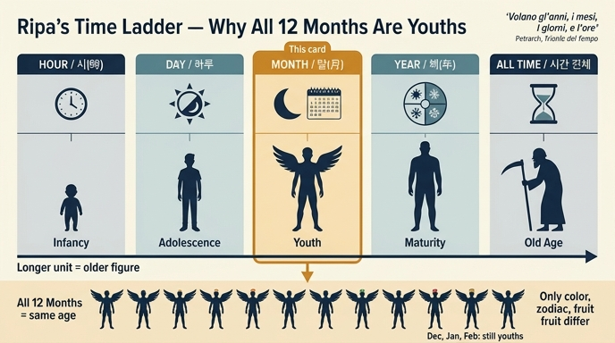

# 리파는 열두 달(Mesi)을 왜 모두 젊은이로 그리는가?

## 한 줄 답

**시간의 크기를 사람의 나이로 환산해 배분(분배)했기 때문**이다. 리파는 시간을 시·일·월·년으로 쪼개고 각 단위에 생애 단계를 하나씩 배정했는데, 그중 **달(月)에게 배정된 몫이 "젊음(Gioventù)"**이었다. 그래서 3월부터 2월까지 열두 달이 예외 없이 젊은이 모습이다.

## 원전 대목

`05 Months of the Year (Mesi).md` 도입부, 3월(MARZO) 도상 처방 바로 다음에 나오는 총론 문장이다. OCR이 긴 s(ſ)를 f로 깨뜨려 놓았으므로 복원해 읽으면 이렇다.

> **Giovani dipingeremo i Mesi**, perciocché volendo noi dividere il tempo in ore, in giorni, mesi, ed anni, faremo che **le ore siano nella puerizia**, **il giorno nell'adolescenza**, **il mese nella Gioventù**, **l'anno nella Virilità**, ed **il tempo che è tutta la parte insieme, lo faremo vecchio**.

번역:

> **달들은 젊은이로 그릴 것이다.** 우리가 시간을 시(ore)·일(giorni)·월(mesi)·년(anni)으로 나누고자 하므로, **시는 유년기(puerizia)**에, **하루는 청소년기(adolescenza)**에, **달은 청년기(Gioventù)**에, **해는 장년기(Virilità)**에 두고, **이 모든 부분을 합친 것인 시간(tempo) 자체는 노인으로** 그릴 것이다.

(OCR 복원 대조: `Giovani`=젊은이들, `Mefi`=Mesi, `perciocché`=왜냐하면, `puerizia`=유년, `adolefcenza`=adolescenza, `mefe`=mese, `Virilità`=장년, `vecchio`=노인.)

## 논리 구조: "시간의 길이 = 사람의 나이"라는 사다리

리파의 발상은 단순하고 기계적이다. **시간 단위가 길수록 인물의 나이를 올린다.** 다섯 칸의 사다리가 만들어진다.

| 시간 단위 | 배정된 생애 단계 | 도상 인물 |
|---|---|---|
| 시(ora) | puerizia — 유년기 | 어린아이 |
| 하루(giorno) | adolescenza — 청소년기 | 소년 |
| **달(mese)** | **Gioventù — 청년기** | **젊은이 → 열두 달 전부** |
| 해(anno) | Virilità — 장년기(한창때) | 장성한 남자 |
| 시간 전체(il tempo, 부분의 총합) | vecchiezza — 노년 | 노인 |

핵심 포인트 두 가지.

1. **개별 달의 성격이 아니라 "달"이라는 범주의 등급이 나이를 정한다.** 3월이 봄이라 젊고 12월이 겨울이라 늙은 게 아니다. 12월도, 1월도, 2월도 여전히 *Giovine*이다. 실제로 리파는 겨울 세 달을 "**Giovine di aspetto orrido**(끔찍한 표정의 젊은이)"라고 처방한다 — 나이는 그대로 두고 **표정과 색만** 바꾼 것이다.
2. **전체는 부분의 합이므로 가장 늙다.** "il tempo che è tutta la parte insieme" — 시간 전체는 시·일·월·년을 다 포갠 것이므로 사다리의 맨 위, 노인이 된다. 부분이 쌓여 전체가 되는 관계가 곧 나이가 쌓여 노년이 되는 관계와 겹쳐진다.

## 그렇다면 열두 달은 무엇으로 구별하는가

나이를 통일해 버렸으니, 달마다의 차이는 **다른 속성(attributi)** 으로 옮겨간다. 리파의 처방을 훑으면 변수는 넷이다.

- **황도 12궁 표지**: 3월 양자리(Ariete), 4월 황소(Toro), 5월 쌍둥이(Gemini), 6월 게(Cancro), 7월 사자(Leone), 8월 처녀(Vergine) … 11월 사수(Sagittario), 12월 염소(Capricorno), 1월 물병(Acquario), 2월 물고기(Pesce). 오른손에 든다.
- **옷 색**: 3월 검은 기가 도는 갈색(tanè), 4·5월 초록, 6월 연노란 초록(밀이 익기 시작), 7월 오렌지색(ranciato), 8월 불꽃색, 11월 마르는 낙엽색, 12월 검정, 1월 흰색(눈), 2월 회색(berrettino, 비구름).
- **머리 화관**: 4월 미르투스, 5월 온갖 꽃, 6월 덜 익은 밀 이삭, 8월 다마스크 장미·재스민, 11월 열매 달린 올리브. 12월은 땅이 헐벗었으므로 **화관 없음**.
- **왼손 바구니/잔의 과실**: 그 달에 나는 것 — 3월 자두싹·아스파라거스·홉, 4월 아티초크·풋아몬드, 5월 체리·완두·딸기, 11월 순무·양배추, 12월 송로버섯 등. 리파는 이 과실만은 "**지역의 성질에 따라 화가가 바꿔도 된다**"고 명시적으로 허용한다(더운 곳은 빨리, 추운 곳은 늦게 나므로).

즉 **나이는 고정 상수, 계절·기후는 변수**라는 설계다.

## 덧붙는 공통 속성: 날개

열두 달은 모두 **어깨에 날개**를 달고 있다("alato come gli altri Mesi"). 리파의 설명은 "달들이 끊임없이 달려간다는 것을 보여준다(il continuo corso, che fanno i mesi)"이고, 근거로 페트라르카 『시간의 승리(Trionfo del Tempo)』를 인용한다.

> **Volano gl'anni, i mesi, i giorni, e l'ore.**
> (해도, 달도, 하루도, 시간도 날아간다.)

이 인용이 흥미로운 이유는, 페트라르카의 시행 자체가 **년·월·일·시라는 같은 4단 눈금**을 나열한다는 점이다. 리파는 그 눈금을 그대로 가져와 각 칸에 나이를 꽂아 넣은 셈이다.

## 왜 이런 방식인가 — 도상학적 배경

- 리파의 『Iconologia』(초판 1593)는 추상 개념을 **사람 몸으로 번역하는 사전**이다. 개념을 그리려면 나이·성별·옷색·지물을 정해야 하고, 리파는 그 결정에 언제나 "왜 그렇게 그리는가"의 이유를 붙인다. 여기서의 이유가 "시간 단위의 크기 ↔ 인생 단계"라는 비례 관계다.
- 이 대응은 리파 혼자의 착상이 아니라 고대·중세를 지나온 관습이다. 그리스·로마에서 **호라이(Horae, 시/계절의 여신)**는 젊고 가벼운 처녀로, **크로노스/사투르누스(Time)**는 낫을 든 노인으로 굳어 있었다. 리파는 이 두 극점(어림 ↔ 늙음) 사이를 시·일·월·년으로 균등하게 채워 넣어 **연속적인 등급표**로 정리한 것이다.
- 결과적으로 리파의 시간 도상들은 서로 **한 세트로 읽힌다**: 『Iconologia』의 「Ore(시간들)」는 어린 존재로, 「Mesi」는 젊은이로, 「Anno(해)」는 장년으로, 「Tempo(시간)」는 노인으로. 한 인물만 봐도 그가 시간 사다리의 몇째 칸인지 나이로 즉시 읽어낼 수 있게 만드는 장치다.

## 시험에 나올 포인트 정리

- 답의 핵심어는 "**나이에 비유해 시간 단위를 배분했다**"이다. "봄이라서 젊다" 같은 계절 설명은 오답.
- 4단(시·일·월·년) + 총합(시간 전체) = **다섯 칸**임을 잊지 말 것. 노인은 "년"이 아니라 "**시간 전체**"다. 년은 장년(Virilità).
- 달 = **청년기(Gioventù)**, 세 번째 칸.
- 반증에 강한 근거: 겨울 세 달(12·1·2월)도 여전히 젊은이이며, 12월은 "끔찍한 표정의 젊은이 + 검은 옷 + 화관 없음"으로 처리된다.

## 인포그래픽

