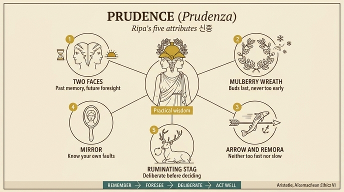

# 신중(Prudenza) — 체사레 리파의 의인화

## 카드 요지

리파의 『이코놀로지아』 PRUDENZA 항목 첫 번째 도상은 **금빛 투구를 쓴 두 얼굴의 여인**이다. 투구는 뽕나무 잎 화관으로 둘려 있고, 오른손에는 **레모라(빨판상어)가 감긴 화살**을, 왼손에는 **자신을 비추는 거울**을 들며, 발치에는 **긴 뿔의 사슴이 되새김질**하고 있다.

판화에서 실제로 확인되는 요소들:

- 인물의 머리에는 잎사귀 관이 둘린 투구가 있고, 얼굴이 **정면(왼쪽 방향)과 뒤쪽(오른쪽 방향) 두 개**로 갈라져 있다 — 야누스형 두 얼굴.
- 오른손(관람자 시점 왼쪽)이 잡은 긴 **창/화살대에 물고기 형태의 생물이 뱀처럼 감겨** 있다. 이것이 텍스트의 "Pesce avvolto alla frezza"(화살에 감긴 물고기), 즉 에케네이스/레모라다.
- 왼손이 든 **손거울 안에 얼굴이 비쳐** 있다 — 원문의 "nel qual mirando, contempla se stessa"(그 안을 들여다보며 자신을 관조한다)를 그림이 그대로 시각화한 것.
- 발치에 **크게 뻗은 뿔을 가진 사슴이 엎드려** 있다. 앉아 있는 자세가 되새김질(rumine)의 정적(靜的) 함의를 뒷받침한다.

## 원문 근거 (지물별)

리파 원문(1600년대 이탈리아어, OCR본)의 서술은 다음과 같다.

> Donna coll'elmo dorato in capo, circondato da una ghirlanda delle foglie del moro. Avrà due facce, come si è detto di sopra. Nella destra mano terrà una frezza, intorno alla quale vi sarà rivolto un Pesce detto Ecneide, ovvero Remora … Nella sinistra terrà lo specchio, nel qual mirando, contempla se stessa, e a' piedi vi sarà un Cervo di lunghe corna, e che rumini.

### 1) 두 얼굴 (due facce) — 과거와 미래를 함께 봄

첫 도상에서는 "위에서 말한 바와 같이"라고만 하고 설명을 생략하지만(`Per dichiarazione delli visi, basterà quello che si è detto avanti` = "얼굴들에 대한 설명은 앞서 말한 것으로 충분하다"), 같은 항목의 **세 번째 Prudenza**(야누스를 닮은 두 얼굴의 여인)에서 명시된다.

> Le due facce significano, che la prudenza è una cognizione vera, e certa, la quale ordina ciò che si deve fare, e nasce dalla considerazione delle cose passate, e delle future insieme.
> (두 얼굴은 신중이 **참되고 확실한 인식**이며, 해야 할 일을 질서 있게 배치하고, **지나간 일과 다가올 일을 함께 고려**하는 데서 생겨남을 뜻한다.)

> per essa si rammentano le cose passate, e si ordinano le presenti, e si prevedono le future; onde l'Uomo, che n'è senza, non sa racquistare quello, che ha perduto, nè sa conservar quello che possiede, nè cercare quello che aspetta.
> (신중으로써 과거를 기억하고 현재를 정돈하며 미래를 예견한다. 그것이 없는 사람은 잃은 것을 되찾지도, 가진 것을 지키지도, 기다리는 것을 구하지도 못한다.)

즉 두 얼굴 = **기억(과거) + 예견(미래)**, 그 교차점에서 현재의 행위가 결정된다. 리파가 인용한 조반니 부온델몬티(Giovanni Buondelmonte)의 소네트도 같은 구조를 반복한다: "Del passato discorri, e per tuo ingegno / Scorgi il futuro, ed il presente intendi"(과거를 논하고, 네 지혜로 미래를 보며, 현재를 이해한다).

### 2) 금빛 투구 (elmo dorato) — 지혜로운 조언으로 무장한 지성

> L'Elmo dorato, che tiene in capo, significa l'ingegno dell'Uomo prudente ed accorto, armato di saggi consigli, che facilmente si difende da ciò, che sia per fargli male, e tutto risplendente nelle belle, e degne opere, che fa.
> (금빛 투구는 **신중하고 사려 깊은 사람의 지성(ingegno)**을 뜻한다. **현명한 조언(saggi consigli)으로 무장**하여 해가 될 것으로부터 쉽게 자신을 방어하고, 자신이 행하는 아름답고 훌륭한 일들로 온통 빛난다.)

포인트 두 개: **방어(armatura)** = 지성은 판단의 갑주다. **금빛(도금)** = 그 판단이 낳는 훌륭한 행위의 광채. 신중이 사변적 지혜가 아니라 **행위를 지키는** 덕이라는 점이 여기서 드러난다.

### 3) 뽕나무 잎 화관 (ghirlanda delle foglie del moro) — 때 이르게 하지 않음

> dinota, che l'Uomo savio e prudente non deve fare le cose innanzi tempo, ma ordinarle con giudizio
> (지혜롭고 신중한 사람은 **일을 때 이르게 해서는 안 되며, 판단으로써 질서 있게 배치해야** 함을 뜻한다.)

리파는 근거로 알치아토(Andrea Alciato)의 엠블럼 시구를 이탈리아어로 인용한다.

> Non germina giammai il tardo moro, / Finché 'l freddo non è mancato e spento; / Nè il savio fa le cose innanzi tempo, / Ma l'ordina con modo e con decoro.
> (늦된 뽕나무는 추위가 다하고 꺼지기 전까지 결코 싹트지 않는다. 지혜로운 이도 때 이르게 일을 하지 않고, 절도와 품위로써 그것을 정돈한다.)

배경 지식: 알치아토 엠블럼집의 **"Morus"**(뽕나무) 엠블럼 — 라틴 원문 "Serior at morus numquam nisi frigore lapso / germinat: et sapiens nomina falsa gerit"(뽕나무는 늦되어, 서리가 물러가기 전에는 결코 싹트지 않는다. 지혜로우면서도 거짓 이름을 지녔다). 여기서 "거짓 이름"은 라틴어 *morus*(뽕나무)와 그리스어 μῶρος(*mōros*, 바보)의 동음 대비를 이용한 말놀이다. 플리니우스 『자연사』(16권)는 뽕나무를 "재배 수목 가운데 가장 늦게 싹트는, 그래서 **가장 지혜로운 나무**"로 기록했고, 리파의 화관은 이 전승을 그대로 머리에 얹은 것이다.

### 4) 레모라가 감긴 화살 (frezza + Ecneide/Remora) — 속도의 중용

> il quale scrive Plinio, che attaccandosi alla Nave, ha forza di fermarla; e perciò è posto per la tardanza.
> (플리니우스는 이 물고기가 배에 달라붙어 **배를 멈추게 하는 힘**이 있다고 쓴다. 그래서 이것은 **지연(tardanza)**을 나타내려 놓인 것이다.)

> Di più ammonisce, che non si deve esser troppo tardo nell'applicarsi al bene conosciuto.
> (더하여 이 지물은 **이미 알고 있는 선(善)에 착수하는 데 너무 늦어서도 안 된다**고 경고한다.)

리파는 다시 알치아토를 인용하는데, 이는 알치아토 엠블럼 **XX "Maturandum"**(서둘러야 한다 / *festina lente*)이다.

> Vola dall'arco, e dalla mano sciolto / Il dardo; è l'altro troppo pigro e lento: / Nuoce il tardar, come esser presto e lieve: / La via di mezzo seguitar si deve.
> (활에서, 놓인 손에서 화살은 날아간다. 다른 하나(물고기)는 너무 게으르고 느리다. **늦음도 해롭고, 재빠르고 경솔함도 해롭다. 중간의 길을 따라야 한다.**)

핵심: 화살(과속) + 레모라(과지연)라는 **대립쌍의 결합**으로 "중용(via di mezzo)"을 도상화한 것. 뽕나무 화관이 "너무 이르지 않게"라면, 레모라-화살은 **양방향 경고**(너무 빠르지도, 너무 늦지도)라는 점에서 한 걸음 더 나간다.

리파는 이 지물의 **대체안**도 제시한다: 화살 대신 **돌고래가 감긴 닻**에 손을 얹게 할 수 있고, 이는 같은 뜻이며 "아우구스투스의 임프레사(imprese)로서 신중을 뜻했다"(참고: 세바스티아노 에리초의 메달 논고, 그리고 리파의 「디리젠차(Diligenza)」 도상).

### 5) 거울 (specchio) — 자기 인식

> Lo specchio significa la cognizione del prudente non poter regolar le sue azioni, se i propri suoi difetti non conosce e corregge. E questo intendeva Socrate quando esortava i suoi Scolari a riguardar sé medesimi ogni mattina nello specchio.
> (거울은 **자기 자신의 결함을 알고 교정하지 않으면 자기 행위를 규율할 수 없다**는 신중한 이의 인식을 뜻한다. 소크라테스가 제자들에게 **매일 아침 거울로 자신을 살펴보라**고 권한 것이 이 뜻이다.)

세 번째 Prudenza에서도 반복된다: "Lo specchiarsi significa la cognizione di se medesimo"(거울에 비춰 봄은 자기 인식을 뜻한다). 판화에서 거울 면에 얼굴이 뚜렷하게 새겨진 것은 이 "자기를 마주 봄"을 놓치지 않으려는 판화가의 선택이다.

### 6) 되새김질하는 긴 뿔의 사슴 (Cervo di lunghe corna, che rumini) — 숙고

> quanto le lunghe e disposte gambe l'incitano al corso, tanto lo ritarda il grave peso delle corna, e il pericolo d'impedirsi con esse fra le selve e gli sterpi.
> (길고 잘 뻗은 다리가 사슴을 달리게 부추기는 만큼, **무거운 뿔이 그를 지체시키고**, 숲과 잡목 사이에서 그 뿔에 걸릴 위험이 그를 붙잡는다.)

즉 사슴은 화살+레모라와 **같은 뜻(속도와 지연의 동시 내재)**을 한 몸에 담은 동물이다. 리파도 그렇게 명시한다: "il Cervo … il medesimo mostra che il dardo, e il Pesce"(사슴은 화살과 물고기가 보이는 바를 똑같이 보인다).

여기에 되새김질이 얹힌다.

> E' appropositio ancora, il ruminare di quello animale al discorso, che precede la risoluzione de' buoni pensieri.
> (그 동물의 **되새김질**은 좋은 생각의 **결단에 앞서는 사유(discorso)**에도 잘 들어맞는다.)

라틴어 *ruminare*는 문자적 "되새김"과 은유적 "숙고"를 겸한다. 결단(risoluzione) 앞에 놓인 심의(deliberatio)라는 아리스토텔레스적 계기가 여기에 대응한다.

## 아리스토텔레스 phronesis 정의와의 대응

리파는 도상 설명 직후 정의를 붙인다.

> La Prudenza, secondo Aristotele, è un abito attivo con vera ragione, circa cose possibili, per conseguir il bene, e fuggir il male, per fine della vita felice.

원전은 『니코마코스 윤리학』 6권(특히 6.5, 1140a24–1140b6)의 프로네시스(φρόνησις) 규정이다. 항목별 대응:

| 리파 (이탈리아어) | 아리스토텔레스 NE VI | 내용 |
|---|---|---|
| `abito` (습성/태도) | ἕξις (*hexis*) | 일시적 상태가 아닌 **안정된 성향**. 라틴 *habitus*의 번역어. |
| `attivo` (활동적/실천적) | πρακτική (*praktikē*) | 제작(τέχνη)·관조(σοφία)가 아니라 **행위(πρᾶξις)**에 관한 것. |
| `con vera ragione` (참된 이성과 함께) | μετὰ λόγου ἀληθοῦς | 단순한 요령이 아니라 **참된 로고스를 동반**해야 함. 이래야 영악함(δεινότης)과 구분된다. |
| `circa cose possibili` (가능한 일들에 관하여) | περὶ τὰ ἐνδεχόμενα (καὶ ἄλλως ἔχειν) | 필연적·불변적인 것이 아니라 **달리 될 수 있는 것**, 즉 심의(βούλευσις)의 대상. |
| `per conseguir il bene, e fuggir il male` | περὶ τὰ ἀνθρώπῳ ἀγαθὰ καὶ κακά | **인간에게 좋은 것과 나쁜 것**에 관한 것. |
| `per fine della vita felice` (행복한 삶을 목적으로) | πρὸς τὸ εὖ ζῆν ὅλως / εὐδαιμονία | 부분적 이득이 아니라 **삶 전체의 잘 삶**을 목적으로 삼음. |

원문 표현(1140b4–6): *ἕξιν εἶναι ἀληθῆ μετὰ λόγου πρακτικὴν περὶ τὰ ἀνθρώπῳ ἀγαθὰ καὶ κακά* — "인간에게 좋고 나쁜 것에 관한, 참된 이성을 동반한 실천적 습성".

**리파의 기독교적 덧붙임**: 리파는 "행복한 삶(vita felice)"을 이중으로 해석한다. 신학자들에 따르면 **현세의 순례 이후에 기다리는 삶**이고, 일부 철학자들에 따르면 **영혼이 육체와 결합해 있는 동안 누릴 수 있는 삶**이다. 신중은 이 두 목적 모두를 위해 쓰여야 한다는 것. 근거로 루카 16:8을 인용한다 — "Prudentiores sint filii huius saeculi filiis lucis"(이 세상의 자녀들이 빛의 자녀들보다 더 신중하다). 이어 정치적 행복(felicità politica)이 천상의 행복으로 오르는 **사다리(scala)**가 될 수 있다고 정리한다. 즉 아리스토텔레스의 *eudaimonia* 위에 기독교 종말론적 목적론을 겹쳐 놓은 것이 리파식 변주다.

## 같은 항목의 다른 Prudenza 도상 (비교용, 카드 범위 외)

리파는 PRUDENZA 항목에 세 가지 도상을 나란히 놓는다. 카드가 다루는 것은 **첫 번째**다.

1. **(카드 대상)** 금빛 투구+뽕나무 화관, 두 얼굴, 레모라-화살, 거울, 되새김질하는 사슴.
2. 왼손에 **해골(testa di Morto)**, 오른손에 **뱀(Serpe)**. 해골은 "일의 끝과 결말을 내다보는" 것, 그리고 철학이 "죽음에 대한 지속적 명상"이라는 규정(→ 우리의 비참함을 생각함이 신중 획득의 왕도).
3. **야누스를 닮은 두 얼굴**의 여인이 거울을 보며 팔에 **뱀을 감고** 있음. 두 얼굴=과거+미래, 거울=자기 인식, 뱀=공격받을 때 머리를 여러 겹으로 감아 지키는 습성 → "우리의 머리이자 완성인 덕을 지키기 위해 운명의 타격에 나머지 모든 것을 내어놓아야 한다". 마태 10:16 "Estote prudentes sicut serpentes" 인용.

각주로 리치 신부(P. Ricci)의 판본도 소개된다: 히아신스 보석을 쓴 머리(=중용의 요구), 큰 컴퍼스와 수평추(=상황에 맞는 척도), 뱀이 있는 길을 걸어 도시로 향함, 심장을 향한 횃불(=지혜의 자리로서의 심장), 발밑의 무장한 사내(=신중이 오만을 짓밟음).

## 암기 요령

다섯 지물을 "시간축 + 자기 + 심의"로 묶으면 외우기 쉽다.

- **두 얼굴** → 시간축 인식 (과거 기억 ↔ 미래 예견)
- **뽕나무 화관** → 착수 시점: 너무 이르지 않게
- **레모라-화살** → 착수 속도: 너무 느리지도, 너무 빠르지도 (중용)
- **거울** → 자기 결함 인식 (자기를 모르면 행위를 규율 못 함)
- **되새김질하는 사슴** → 결단 전 숙고 (+ 무거운 뿔 = 스스로에게 제동)
- **금빛 투구** → 이 모두를 감싸는 지성, 조언으로 무장하고 훌륭한 행위로 빛남

## 인포그래픽

