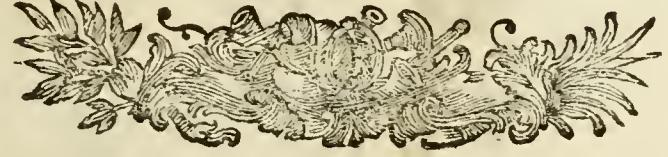

# 문학(Lettere)의 의인화 — 책과 피리를 든 여인

## 카드

**질문** 『이코놀로지아』에서 '문학(Lettere)'은 어떻게 의인화되는가?

**답** 피렌체의 한 장식 행사에서 표현된 대로, 단정하고 고상한 옷을 입은 여인이 오른손에 책을, 왼손에 피리들을 든 모습이다. 책과 피리는 각각 말(명예로운 것)과 음악(즐거운 것)을 뜻해, 문학이 명예롭고도 즐거운 것임을 나타낸다.

---

## 1. 원문 (출처 확인)

이 카드는 asset의 `02 Letters to Lust.md` 맨 앞, 즉 이 챕터를 여는 항목 그 자체다. OCR 원문(체사레 오를란디 편 『Iconologia』 제4권, 페루자 1764–67)은 다음과 같다.

> **LETTERE.**
> *Come rappresentate in Firenze, in un bellissimo apparato.*
>
> Donna vestita di onesto e gentile abito, che colla destra mano tiene un libro, e colla sinistra de' flauti, per significare concerti e parole; quelli come dilettevoli, queste come onorabili.

(파일에는 옛 활자의 긴 s가 f로 읽혀 `veftita`, `finiitra`, `fignificare`처럼 깨져 있고, `quelli…queste`가 `quelle…quelle`로 뭉개져 있다. 위 인용은 그 부분을 복원한 것.)

번역하면 —

> **문학.** 피렌체에서, 어느 대단히 아름다운 아파라토(apparato)에 표현된 대로.
> 단정하고 품위 있는 옷을 입은 여인. 오른손에는 책을, 왼손에는 피리 몇 자루를 들었다. 이는 '합주(concerti)'와 '말(parole)'을 뜻하니, 앞의 것은 즐거운 것으로서, 뒤의 것은 명예로운 것으로서 그렇다.

즉 카드의 답은 원문을 거의 그대로 옮긴 것이다. 이 항목은 리파의 항목 중에서도 대단히 짧은 편으로, 도상 하나를 제시하고 그 의미를 한 문장으로 풀어내는 데서 끝난다.

## 2. 왜 하필 '책 + 피리'인가 — 명예로운 것과 즐거운 것

리파의 도상은 늘 **속성(attributo) = 개념**의 대응으로 읽힌다. 여기서는 두 손이 각각 하나의 개념을 든다.

| 손 | 지물 | 1차 의미 | 가치 판정 |
|---|---|---|---|
| 오른손(destra) | 책 (libro) | 말·글 (parole) | **명예로운 것** (onorabili) |
| 왼손(sinistra) | 피리들 (flauti) | 합주·음악 (concerti) | **즐거운 것** (dilettevoli) |

핵심은 이 둘이 **경쟁 관계가 아니라 합산 관계**라는 점이다. 문학은 "유익하고 무게 있는 것"이기만 하지도, "귀를 즐겁게 하는 것"이기만 하지도 않다. 둘을 한 몸에 다 지녔기에 문학인 것이다. 이는 호라티우스 『시학』의 유명한 정식 — *omne tulit punctum qui miscuit utile dulci*("유익한 것에 달콤한 것을 섞은 자가 만점을 받는다") — 를 그대로 도상으로 옮긴 것이며, 르네상스·바로크 시학의 표준 강령인 **prodesse et delectare**(가르치고 또 즐겁게 하기)에 해당한다.

**오른손/왼손의 위계**도 우연이 아니다. 리파의 문법에서 오른쪽은 더 존귀한 자리다. 명예로운 쪽(말·책)이 오른손에, 즐거운 쪽(음악·피리)이 왼손에 놓인 배치는 "둘 다 필요하지만 그 중 앞서는 것은 명예다"라는 서열까지 함께 새겨 넣은 것이다. 카드의 답을 외울 때 **오른손=책=명예 / 왼손=피리=즐거움**의 짝을 손 방향까지 함께 묶어서 기억하면 좋다.

부수적인 관찰 몇 가지.

- **피리가 복수(de' flauti)**인 것은 한 개의 소리가 아니라 여러 소리가 어울리는 *concerti*(협화·합주)를 나타내기 위함이다. 조화·비례를 뜻하는 리파식 장치.
- **"단정하고 품위 있는 옷(onesto e gentile abito)"**은 그 자체로 의미를 갖는 속성이다. 리파에게 복식은 성격 묘사다. 화려하거나 기괴한 옷이 아니라 절제된 옷 — 문학의 도덕적 점잖음(decorum·onestà)과 자유민다운 교양(gentilezza)을 뜻한다. 즉 즐거움을 담당하는 피리를 들고 있어도 이 여인은 결코 방탕한 유흥의 알레고리가 아니라는 선을 옷차림으로 미리 그어 둔 것이다.
- **'Lettere'는 '편지'가 아니다.** 이탈리아어 *le lettere*는 라틴어 *litterae*를 이어받아 '문자 학문 전체', 곧 인문학·학문·문학을 가리킨다(*buone lettere*, *uomo di lettere*). 그래서 항목명이 복수형이고, 부제도 복수 여성형 *come rappresentate*("그것들이 표현된 대로")로 되어 있다. 영어 번역 챕터명 "Letters"도 이 뜻이다.

## 3. "피렌체의 한 아파라토에서" — 출처 표기의 성격

부제 *Come rappresentate in Firenze, in un bellissimo apparato*는 리파가 이 도상을 **자기가 발명한 것이 아니라 실제로 본(또는 인쇄된 기록으로 읽은) 사례에서 가져왔다**고 밝히는 대목이다.

*apparato*는 결혼식·입성식·장례 같은 큰 행사를 위해 도시에 세운 임시 장식 구조물 일체(개선문, 회화, 조상, 무대장치)를 말한다. 16세기 피렌체 메디치 궁정의 아파라토는 규모와 도상학적 정교함으로 유명했고, 행사 후에는 어떤 인물상이 무엇을 뜻하는지 낱낱이 해설한 인쇄 기록이 나왔다. 이런 축제 기록물은 리파가 『이코놀로지아』를 편찬할 때 실제로 활용한 주요 자료군의 하나다(대표적으로 1565년 프란체스코 데 메디치–조반나 다우스트리아 혼례 아파라토, 1589년 페르디난도 1세–크리스틴 드 로렌 혼례 아파라토 등이 거론된다. 리파가 어느 것을 가리켰는지 이 항목 자체는 특정하지 않는다).

이 짧은 출처 표기가 알려주는 바가 중요하다. 리파의 의인화는 책상 위에서만 만들어진 것이 아니라, **당대 축제 미술의 실제 관행과 주고받으며** 성립했다. 화가·조각가·연출가가 쓰던 도상이 책으로 정리되고, 그 책이 다시 다음 세대의 화가·연출가에게 매뉴얼로 돌아가는 순환이다.

## 4. 이 항목에는 판화가 없다

『이코놀로지아』의 주요 항목에는 전면 판화가 딸리지만, **Lettere에는 판화가 없다.** 원문 페이지에서 위 한 문장 뒤에 곧바로 아래의 장식 컷(tailpiece)이 놓이고, 다음 항목 LIBERALITÀ(관대)를 예고하는 캐치워드 "LIBE-"가 이어진다.

그림에서 보이는 것은 인물이 아니라 좌우로 뻗은 아칸서스 잎사귀와 소용돌이 문양뿐이다. 즉 이 도상은 **글로만 전해지는 의인화**이며, 카드의 답을 외울 때 참조할 시각 자료는 원서 안에 없다. (같은 지면 구조 안에서 판화가 붙은 항목은 바로 다음의 LIBERALITÀ처럼 별면 전면 도판을 갖는다.)

편집상 위치도 참고할 만하다. 이 항목은 **LETIZIA(기쁨 — "Allegrezza 항목을 보라"는 상호참조만 있는 항목) 다음, LIBERALITÀ(관대) 앞**에 온다. 알파벳 순 배열의 결과이며, asset의 `02 Letters to Lust.md`가 LETTERE로 시작하는 이유이기도 하다. 참고로 이 md 파일 앞부분(11~19행)에 나오는 크리스피나·페르티낙스 메달과 '기쁨' 이야기는 OCR 과정에서 앞 챕터 LETIZIA의 주석이 밀려 들어온 것으로, **Lettere와는 무관하다.** 혼동하지 말 것.

## 5. 시험 대비 요약

- 인물: **여인 1인**, 단정하고 품위 있는 옷차림(onesto e gentile abito).
- **오른손 — 책 → 말(parole) → 명예로운 것(onorabile).**
- **왼손 — 피리들 → 합주·음악(concerti) → 즐거운 것(dilettevole).**
- 종합 명제: 문학은 명예롭고도 즐거운 것 = 호라티우스의 *utile dulci*, 즉 가르치며 즐겁게 하는 것.
- 출처 표기: **피렌체의 어느 아름다운 아파라토(축제 임시 장식)**에 표현된 사례를 리파가 채록.
- 'Lettere'는 편지가 아니라 **문자 학문 전체(인문학·문학)**.
- 이 항목에는 **판화 도상이 없다.**
