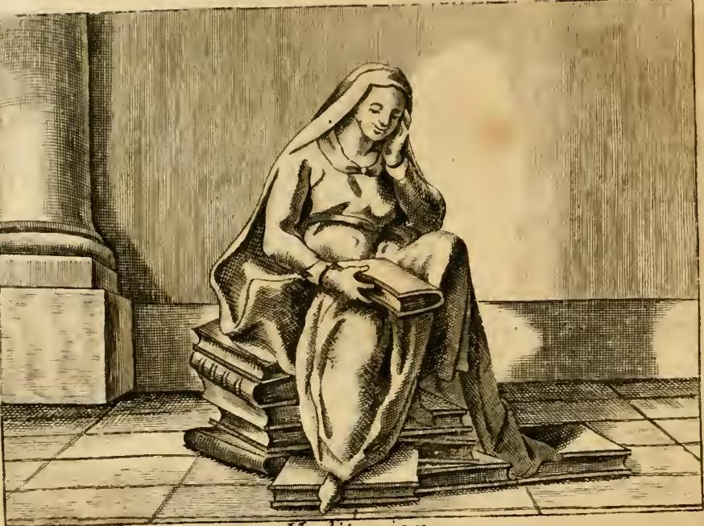

# 리파의 '명상(Meditazione)' 의인상

## 질문

리파는 '명상(Meditazione)'을 어떻게 의인화했는가?

## 답

진지하고 단정한 얼굴의 성숙한 여인이 책 더미 위에 앉아, 왼팔 손 위에 뺨을 괴고 생각에 잠긴 채, 오른쪽 무릎 위의 반쯤 덮인 책에 손가락을 끼워 들고 있는 모습이다. 명상은 사물의 본질적 가치를 바라보는 확고한 숙고이므로 참을 분별할 수 있는 성숙한 나이로 그린다.

---

## 원본 도판



*Cesare Ripa, `Iconologia`(체사레 오를란디 편, 페루자판, 「토모 콰르토」) 중 「MEDITAZIONE」 도판.*

도판에서 실제로 확인되는 요소를 원문 규정과 하나씩 맞춰 보면 이 항목이 얼마나 문자 그대로 판화로 옮겨졌는지 알 수 있다.

| 원문 규정 | 도판에서 관찰되는 것 |
|---|---|
| `Donna di età matura, di aspetto grave, e modesto` (성숙한 나이, 진지하고 단정한 용모) | 젊은 소녀도 노파도 아닌 중년 여인. 표정에 과장이 없고, 머리에서 어깨로 흘러내린 베일이 '단정함(modestia)'을 시각화한다 |
| `posta a sedere sopra di un monte di libri` (책 더미 위에 앉아) | 의자가 아니라 두툼한 장정본을 층층이 쌓은 무더기가 좌석이다. 바닥에도 책이 흩어져 받침 역할을 한다 |
| `sopra la mano del sinistro braccio … riposi la gota, in atto di stare pensosa` (왼팔의 손 위에 뺨을 괴고 생각에 잠긴 자세) | 한쪽 팔을 몸 앞으로 접어 올려 손바닥으로 뺨과 관자놀이를 받치고, 시선을 아래로 떨어뜨렸다 |
| `sopra il destro ginocchio coll'altra mano tenga un libro socchiuso, avendovi fra mezzo qualche dito` (오른쪽 무릎 위에 다른 손으로 반쯤 덮인 책을 들고, 그 사이에 손가락을 끼운 채) | 무릎 위 책은 완전히 펼쳐지지도, 닫히지도 않았다. 손가락이 책장 사이에 들어가 있다 |
| (배경) | 왼쪽의 굵은 기둥 주초와 타일 바닥. 실외가 아니라 서재·회랑 같은 **닫힌 실내**다. 뒤에 붙는 「영적 명상」 항목의 "은거지에 숨는다"는 규정과 같은 방향 |

> 주의: 같은 챕터 안의 다른 삽화 중 인어·가면 문양이 들어간 작은 장식 컷(테일피스)은 도상 항목이 아니라 인쇄 장식이므로 명상 도상과 무관하다.

---

## 1. 소지물 하나하나가 왜 그것인가 — 리파 자신의 해설

리파의 `Iconologia`는 알레고리 인물을 나열하는 데 그치지 않고 **각 속성의 근거를 조목조목 변론하는 구조**를 갖는다. 명상 항목도 규정 문단 뒤에 항목별 해설이 붙는다.

### (1) 성숙한 나이 (età matura)

> `Essendo la Meditazione una ferma considerazione, riguardante la semplice virtù delle cose, par che convengano le suddette qualità all'età matura, perché l'intelletto in quell'età è atto a discernere il vero.`
> — 명상은 사물의 단순한(본질적) 힘을 바라보는 **확고한 숙고**이므로, 앞서 말한 성질들은 성숙한 나이에 어울린다. 그 나이의 지성이 참을 **분별하기(discernere il vero)**에 적합하기 때문이다.

여기서 핵심 동사는 `discernere`(분별하다)다. 리파의 논리는 이렇다.

- 명상의 대상은 사물의 **`semplice virtù`** — 껍데기가 아니라 본질적 효력 자체다.
- 본질에 도달하려면 정보를 **모으는** 능력이 아니라, 모인 것들 사이에서 참과 거짓을 **가려내는** 능력이 필요하다.
- 분별은 축적된 판단 경험에 의존한다. 그러므로 청춘이 아니라 성숙한 나이여야 한다.

**같은 챕터의 「기억(Memoria)」 항목과 나란히 보면 대비가 선명하다.** 「기억」은 `di mezza età`(중년)로 그려지는데, 그 근거는 아리스토텔레스 『기억과 상기에 관하여』 — 노년은 잊어버리기 때문에, 유년은 아직 배운 것이 없기 때문에 기억이 약하고, "완성된 나이"에 기억이 가장 좋다는 것이다. 즉 **기억의 중년은 '보존 능력'의 정점**이고, **명상의 성숙은 '판단 능력'의 정점**이다. 같은 연령대를 쓰면서도 근거가 다르다.

### (2) 진지함과 단정함 (gravità, modestia)

> `La gravità, e modestia non si discosta dal convenevole dell'età, e dello studio.`
> — 진지함과 단정함은 그 나이와 **학구(studio)**에 어울리는 바에서 벗어나지 않는다.

`gravità`는 오늘날의 '엄숙한 표정'이라기보다, **무게 있음**이다. 리파는 곧바로 그 무게가 어디서 오는지 밝힌다.

### (3) 뺨을 괴는 자세 — 무게의 정체

> `L'atto di sostenere il volto ne significa la gravità de' pensieri, che occupano la mente in quelle cose, che si hanno ad eseguire, per operare perfettamente, e non a caso.`
> — 얼굴을 받치는 동작은 **생각의 무게**를 뜻한다. 그 생각들은, 완전하게 행하기 위해 — 우연에 맡기지 않기 위해 — 실행해야 할 일들에 마음을 붙들어 두고 있다.

문자 그대로의 물리적 은유다. **생각이 무거워서 머리가 처지고, 그래서 손으로 받쳐야 한다.** `sostenere`(받치다, 지탱하다)라는 동사 선택이 그 논리를 노출한다.

그리고 이 자세는 명상을 **행위 이전의 준비**로 못박는다. `quelle cose, che si hanno ad eseguire`(실행해야 할 일들) — 명상은 현실 도피가 아니라 **실행 설계**다.

### (4) 아우소니우스 인용 — 명상은 곧 실행 능력

리파는 이 대목에서 아우소니우스의 『일곱 현인의 놀이(Ludus septem sapientum)』를 끌어온다. 코린토스의 페리안드로스가 하는 대사다.

> `Meditationem id esse totum, quod geras. Is quippe solus [rebus] gerendae est efficax, / Meditatur omne qui prius negotium. / Nihil est, quod ampliorem curam postulet. / Quare cogitare, quod gerendum sit, dehinc / In cogitantes sors non consilium regit.`

대의: **네가 행하는 것의 전부는 곧 명상이다.** 일을 성사시키는 데 유능한 자는 모든 일을 미리 숙고하는 자뿐이다. 이보다 더 큰 주의를 요구하는 것은 없다. 그러므로 행할 바를 먼저 생각하라. 숙고하지 않는 자들은 **판단(consilium)이 아니라 운(sors)이 지배한다.**

이것은 페리안드로스에게 귀속된 그리스어 격언 **μελέτη τὸ πᾶν**("숙고가 전부다" / "연습이 전부다")의 라틴어 번안이다. 리파가 이 격언을 골라 둔 덕에, 그림 속 여인의 처진 머리는 게으름이나 우울이 아니라 **"운에 맡기지 않겠다"는 능동적 태도**로 읽히게 된다. 앞서 규정 해설의 `non a caso`(우연에 맡기지 않고)가 인용문의 `sors`(운)와 정확히 호응한다.

### (5) 책 더미 위에 앉음 — 앉는 것과 읽는 것

> `Lo stare sedendo sopra i libri ne può denotare l'assiduità della sua propria operazione fondata nelle scritture, le quali contengono i primi principi naturali, colli quali principalmente si procede alla investigazione del vero.`
> — 책들 위에 앉아 있음은, 저술들에 **기초를 둔** 자기 활동의 부단함을 나타낸다. 그 저술들은 **제1의 자연 원리들**을 담고 있으며, 그 원리들로써 주로 참의 **탐구(investigazione)**로 나아간다.

'책 위에 앉는다'는 도상은 두 가지를 동시에 말한다.

- **토대**: 책은 명상이 발 딛는 지반이다. 무에서 시작하는 사색이 아니라, `primi principi`(제1원리)를 이미 확보한 뒤의 사색이다.
- **위계**: 그럼에도 책은 **의자**다. 목적이 아니라 발판이다. 읽기가 아무리 많아도 그 자체로 명상이 되지 않는다는 것을, 도상은 "밟고 앉는다"는 신체 배치로 말해 버린다.

책을 **품에 안거나 펼쳐 읽는** 인물(예: 「학문」·「지식」류 도상)과 책을 **깔고 앉은** 인물의 차이가 바로 명상의 정의다.

### (6) 반쯤 덮인 책과 끼운 손가락 — 도상의 진짜 핵심

> `Il tener il libro socchiuso è per accennare, ch'ella fa le riflessioni sopra la cognizione delle cose, per fermar le opinioni buone, e perfette, dalle quali vien onore, e ancora bene.`
> — 반쯤 덮인 책을 든 것은, 그가 사물의 인식 위에서 **반성(riflessioni)**을 행하여, 좋고 완전한 견해를 **확정한다(fermar)**는 것을 가리키기 위함이다. 그로부터 명예와 또한 선이 온다.

**손가락을 끼운 채 반쯤 덮은 책은 "읽기를 방금 멈춘 순간"이다.** 이 소지물의 정보량이 가장 크다.

- 책을 **덮어 버렸다면** → 독서가 끝났다는 뜻이 된다.
- 책을 **펼쳐 들고 있다면** → 아직 읽는 중, 즉 `lectio`다.
- **손가락을 끼워 반쯤 덮었다면** → 읽던 중 무언가에 걸려 멈추고, 텍스트로 되돌아갈 수 있는 자리를 표시한 채 자기 안으로 들어간 상태다.

즉 이 손가락은 **`lectio`에서 `meditatio`로 넘어가는 문턱 그 자체를 도상화한 것**이다. 리파의 해설에 나오는 `fermar`(확정하다·붙들다)는 규정 문단의 `ferma considerazione`(확고한 숙고)와 같은 어근이며, 책장 사이에 낀 손가락의 **물리적 '고정'** 동작과 그대로 겹친다. 손가락이 책장을 붙들 듯, 명상은 견해를 붙든다.

### (7) 마무리 에피그램 — 명상의 사회적 열매

> `Felix, qui vitae curas exutus inanes, / Exercet meditans nobile mentis opus. / Hic potuit certas venturis linquere sedes. / Inde homines verum discere rite queant. / Hunc ergo merito aeterno dignatur honore, / Et celebri cantu fama per astra vehit.`

대의: 삶의 헛된 근심을 벗고 **정신의 고귀한 일**을 명상으로 수행하는 자는 복되다. 그는 후대에 확고한 **자리(sedes, 즉 확립된 명제·근거)**를 남길 수 있었고, 거기서 사람들이 참을 올바르게 배울 수 있다. 그러므로 명예가 그를 영원히 인정하고, 명성이 그를 별들 사이로 실어 간다.

명상이 개인 내면의 위안으로 끝나지 않고 **남에게 전달 가능한 결과물**을 낳는다는 점이 강조된다. 앞 해설의 "명예와 선이 온다(`vien onore, e ancora bene`)"가 여기서 회수된다.

---

## 2. 뺨을 괴는 자세(*manus ad genam*)의 도상 계보

리파의 이 도상은 발명이 아니라 **오래된 관용 자세의 재사용**이다. 손을 뺨이나 턱에 대어 머리를 받치는 자세를 미술사에서는 라틴어로 *manus ad genam*("뺨에 손")이라 부르며, 고대 이래 다음을 표시하는 **정형(定型)**이었다.

1. **애도·슬픔** — 고대 그리스·로마 묘비 부조와 석관에서 유족·조객의 표준 자세.
2. **깊은 사색** — 시인·철학자·복음서 저자상이 집필 전 생각에 잠긴 순간의 자세.
3. **멜랑콜리(체액론상의 흑담즙 기질)** — 중세 후기 사체액 도해에서 '멜랑콜리쿠스'는 관습적으로 머리를 손에 받치고 앉은 모습으로 그려졌다.

이 세 갈래가 **같은 몸짓**을 공유한다는 점이 중요하다. 슬픔과 사유와 우울이 하나의 자세로 묶여 있었기 때문에, 서구 전통에서 **깊은 생각은 늘 약간의 침울함을 동반한 것으로 표상**되었다.

### 계보의 결정적 매듭: 뒤러의 「멜렌콜리아 I」(1514)

알브레히트 뒤러의 이 동판화는 날개 달린 인물이 주먹 쥔 손에 뺨을 기대고 앉은 모습을 보여 준다. 주변에는 컴퍼스·구·다면체·저울·모래시계 등 측정과 기하의 도구가 흩어져 있다. 파노프스키와 작슬의 고전적 해석 이래, 이 판화는 **멜랑콜리를 '무능한 슬픔'에서 '천재의 심오한 사유'로 격상시킨 전환점**으로 읽힌다. 도구는 있지만 쓰이지 않고, 인물은 그 도구로 닿을 수 없는 무언가를 향해 있다.

**리파의 「명상」과 겹치는 점**: 지식의 도구(책 / 기하 도구)가 인물 주위에 쌓여 있는데도 인물은 그것을 사용하지 않고, 대신 손에 머리를 받치고 멈춰 있다. 두 도상 모두 **"도구를 다 갖춘 뒤에 오는 정지"**를 그린다.

**갈라지는 점**: 뒤러의 인물은 시선을 앞·위로 던진 채 굳어 있고, 도구는 바닥에 방치되어 있다 — 무언가에 **막혀 있다**. 리파의 명상은 도구(책)를 **깔고 앉아** 발판으로 삼았고, 손가락을 책에 끼워 **되돌아갈 길을 확보**해 두었다. 아우소니우스 인용이 명시하듯 리파의 명상은 실행을 향해 있다. 즉 **같은 자세, 다른 방향**이다. 뒤러는 사유의 한계를, 리파는 사유의 효용을 말한다.

### 계보의 끝: 로댕 「생각하는 사람」(1880년경)

오귀스트 로댕의 조각은 원래 『신곡』을 주제로 한 「지옥의 문」의 상부 인물(단테 혹은 시인)로 구상되었고, 뒤에 독립 작품이 되었다. 턱에 손등을 대고 웅크린 자세는 *manus ad genam* 계보의 후기 형태다. 여기서 사색은 **근육의 노동**으로 번역된다 — 몸 전체가 긴장한 채 생각한다.

정리하면 계보는 다음처럼 이어진다.

```
고대 묘비의 애도자
  → 중세 사체액 도해의 '멜랑콜리쿠스'
    → 뒤러 「멜렌콜리아 I」(1514) — 멜랑콜리 = 천재적 사유로 격상
      → 리파 『이코놀로지아』 「명상」 — 실행을 준비하는 생산적 숙고로 전용
        → 로댕 「생각하는 사람」 — 사유의 신체화
```

리파를 이 계보 안에 놓으면, 이 도상이 왜 **책 더미**를 굳이 깔고 앉았는지가 더 분명해진다. 뺨을 괸 자세만 쓰면 멜랑콜리로 오독될 위험이 있으니, **학구의 소지물로 그 자세를 '지적 노동'쪽으로 고정**한 것이다.

---

## 3. 스콜라·수도원 전통의 4단계와 소지물의 대응

리파가 명상을 **독서와 구별하면서도 독서 위에 앉히는** 방식은, 중세 수도원의 독서 수련 도식을 알면 훨씬 자연스럽게 읽힌다.

12세기 카르투시오회 수도자 **구이고 2세(Guigo II)**는 『수도승의 사다리(Scala Claustralium, 별칭 Scala Paradisi)』에서 훗날 *lectio divina*로 불리는 과정을 네 단계로 정식화했다. 서구 신비주의 전통에서 **방법적 기도를 처음으로 체계 기술한 문헌**으로 평가된다.

| 단계 | 뜻 | 구이고의 비유 |
|---|---|---|
| `lectio` | 읽기 | 음식을 **입에 넣음** |
| `meditatio` | 되새겨 생각하기 | 씹어서 **부수고 맛봄** |
| `oratio` | 기도로 응답하기 | **맛을 청함** |
| `contemplatio` | 하느님 앞의 고요한 머묾 | **단맛에 잠김** |

구이고의 유명한 정식: **"읽으며 구하라, 명상하며 찾아낼 것이다, 기도하며 부르라, 관상하며 문이 열릴 것이다."**

### 소지물과의 대응

| 도상 요소 | 대응 |
|---|---|
| **깔고 앉은 책 더미** | `lectio`의 **축적된 결과**. 이미 통과한 단계이므로 손에 들려 있지 않고 발판이 되어 있다 |
| **반쯤 덮인 책 + 끼운 손가락** | `lectio`→`meditatio`의 **전이 순간**. 읽기를 멈췄으나 버리지 않았다 |
| **뺨을 괴고 시선을 내린 자세** | `meditatio` 자체. 대상이 텍스트 바깥이 아니라 **자기 안으로** 들어와 있다 |
| **성숙한 나이 · 진지함** | 씹어 맛을 분별하는 능력 = 리파의 `discernere il vero` |
| (없음) | `oratio`·`contemplatio`는 이 도상에 없다 — 리파의 「명상」은 **철학적·세속적 명상**이며, 종교적 단계는 별 항목으로 분리된다 |

특히 `meditatio`를 **되새김질(ruminatio)**로 비유하는 것이 이 전통의 핵심 은유였다. 라틴어 `meditari` 자체가 반복적 되새김의 뉘앙스를 갖는다. 그리고 리파는 이 은유를 **바로 옆 항목에서 문자 그대로 그려 넣는다** — 아래 4절의 「죽음의 명상」에 등장하는 되새김하는 양이 그것이다. 세 항목을 함께 보면 리파가 `ruminatio` 전통을 알고 배치했음이 드러난다.

---

## 4. 혼동 방지 — 같은 챕터의 세 '명상' 항목 비교

이 챕터에는 **명상 계열 항목이 연달아 셋** 나온다. 카드가 묻는 것은 첫 번째다. 시험 문항에서 가장 흔한 함정이므로 반드시 갈라 두어야 한다.

### (1) 「명상(Meditazione)」 — 카드의 정답

- **자세**: **앉음** (책 더미 위)
- **눈**: 뜬 채 아래로 내림 (`in atto di stare pensosa`)
- **소지물**: 반쯤 덮인 책 + 끼운 손가락
- **나이**: `età matura` (성숙)
- **성격**: **지적·철학적**. 실행 준비. 근거는 아우소니우스/페리안드로스라는 **이교 고전**
- **판화 있음** (위 도판)

### (2) 「영적 명상(Meditazione Spirituale)」

> `Donna posta colle ginocchia in terra, e colle mani giunte. Avrà gli occhi chiusi; ed un velo la cuopra tutta, in modo che trasparisca la forma di essa Donna.`
> — 무릎을 땅에 대고 두 손을 모은 여인. **눈을 감았고**, 베일이 온몸을 덮되 그 형태가 **비쳐 보이게** 한다.

리파의 해설:

- **정의**: `un'azione interna, che l'anima congiunta per carità con Dio fa` — 사랑으로 하느님과 결합된 영혼이 행하는 **내적 행위**로서, 완덕과 구원에 유익한 것들을 숙고한다.
- **무릎 꿇음 + 모은 손** → `devozione`(경건)와 `umiltà`(겸손)의 결과.
- **감은 눈** → `l'operazione interna, astratta dalle cose visibili` — **가시적 사물로부터 추상된** 내적 작용. 몸을 덮은 만토가 같은 뜻을 반복한다.
- **덮음(coprimento)** → `chi medita, si nasconde in luogo ritirato, e stassi solitario, fuggendo le occasioni della distrazione della mente` — 명상하는 자는 **은거지에 숨어 홀로 있으며**, 마음이 흩어질 기회를 피한다.

**핵심 대조표**

| | 명상 | 영적 명상 |
|---|---|---|
| 자세 | **앉음** (책 위) | **무릎 꿇음** (땅에) |
| 눈 | 뜸 (내려봄) | **감음** |
| 손 | 한 손은 뺨, 한 손은 책 | **두 손을 모음** (합장/기도) |
| 소지물 | **책** (반쯤 덮인 것 + 책 더미) | **없음**. 대신 전신을 덮는 반투명 **베일** |
| 대상 | 사물의 `semplice virtù`, 실행할 일 | **하느님**, 완덕과 구원 |
| 매개 | **가시적 텍스트**를 발판으로 | 가시적 사물로부터의 **추상·차단** |
| 미덕 | `gravità`, `modestia` (학구적) | `devozione`, `umiltà` (종교적) |
| 나이 | `età matura` 명시 | 명시 없음 |

가장 외우기 쉬운 축: **책이 있으면 '명상', 없으면 '영적 명상'. 눈을 떴으면 '명상', 감았으면 '영적 명상'. 앉았으면 '명상', 무릎 꿇었으면 '영적 명상'.**
논리적으로도 정반대다. 「명상」은 **책이라는 가시물을 통해** 참에 이르고, 「영적 명상」은 **가시물을 차단해야** 이른다.

### (3) 「죽음의 명상(Meditazione della Morte)」

> `Donna scapigliata, con vesti lugubri, appoggiata col braccio a qualche sepoltura, tenendo ambi gli occhi fissi in una testa di morto, che sia sopra la detta sepoltura; e che alli piedi sia una pecorella colla testa alzata, tenendo in bocca erba, in segno di ruminare.`
> — **머리를 풀어헤친** 여인, **상복** 차림, 팔을 **무덤에 기댄** 채, 무덤 위에 놓인 **해골**에 두 눈을 고정하고 있다. 발밑에는 고개를 든 **작은 양**이 입에 풀을 물고 있어 **되새김(ruminare)의 표시**가 된다.

- 「명상」과 공통점: **팔로 몸을 기댄다**는 지지 동작이 남아 있다. 단 받치는 대상이 자기 뺨이 아니라 **무덤**이다.
- 결정적 차이: **눈이 감기지도 내려가지도 않고, 외부의 한 대상(해골)에 고정(`fissi`)**되어 있다. 「명상」은 대상이 내면화되지만, 「죽음의 명상」은 응시할 외적 표지(memento mori)가 필요하다.
- **되새김하는 양**은 3절에서 본 `ruminatio` 은유의 문자적 도해다. 리파가 명상=되새김 전통을 의식하고 있었음을 이 항목이 확증한다.

**세 항목 한 줄 요약**

- 명상 → **책** 위에 앉아 **뺨을 괴고** 생각한다 (지적 숙고)
- 영적 명상 → **무릎 꿇고 눈 감고 손 모으고** 베일에 덮인다 (신에게로)
- 죽음의 명상 → **상복·헝클어진 머리로 무덤에 기대 해골을 응시**하고, 발밑에 **되새김하는 양** (죽음을 되새김)

---

## 5. 암기 전략

### 신체 부위별로 훑기 (도판을 떠올리며 위→아래)

1. **얼굴** — 성숙(`età matura`) · 진지(`grave`) · 단정(`modesto`)
2. **뺨** — 손으로 받침 = **생각의 무게** (`gravità de' pensieri`)
3. **무릎** — 반쯤 덮인 책, **손가락을 끼움** = 읽기를 멈추고 반성으로 넘어가는 순간
4. **엉덩이** — **책 더미**를 깔고 앉음 = 저술이 담은 **제1원리**가 토대
5. **나이의 근거** — 그 나이의 지성이 **참을 분별(`discernere il vero`)**할 수 있기 때문

### 왜 하필 성숙인가, 한 문장으로

> 읽기는 **모으는** 일이라 젊어도 되지만, 명상은 모은 것 중에서 **참을 골라내는** 일이라 판단이 익어야 한다.

### 자세가 말하는 것, 한 문장으로

> 책을 **깔고 앉되** 한 권은 **손가락을 끼워 반쯤 덮어 든다** — 읽기를 지나왔지만 버리지는 않았다는 뜻이다.

---

## 출처

- 원문: `.fm/assets/04 Mechanics to the Month in General.md`, 「MEDITAZIONE」(Di Cesare Ripa) / 「MEDITAZIONE SPIRITUALE」 / 「MEDITAZIONE DELLA MORTE」 항목. 도판 `Iconologia (Cesare Ripa)/_page_97_Picture_2.jpeg`
- 아우소니우스 『일곱 현인의 놀이』 중 페리안드로스: [Perseus Digital Library](http://www.perseus.tufts.edu/hopper/text?doc=Perseus:text:2008.01.0618:section%3D10) / [Ludus septem sapientum (Britannica)](https://www.britannica.com/topic/Ludus-septem-sapientum)
- 구이고 2세 『수도승의 사다리』와 4단계: [Guigo II (Encyclopedia.com)](https://www.encyclopedia.com/religion/encyclopedias-almanacs-transcripts-and-maps/guigo-ii) / [Guigo II's Ladder of Monks](https://catholicgnosis.wordpress.com/2022/11/23/ladder-four-rungs/)
