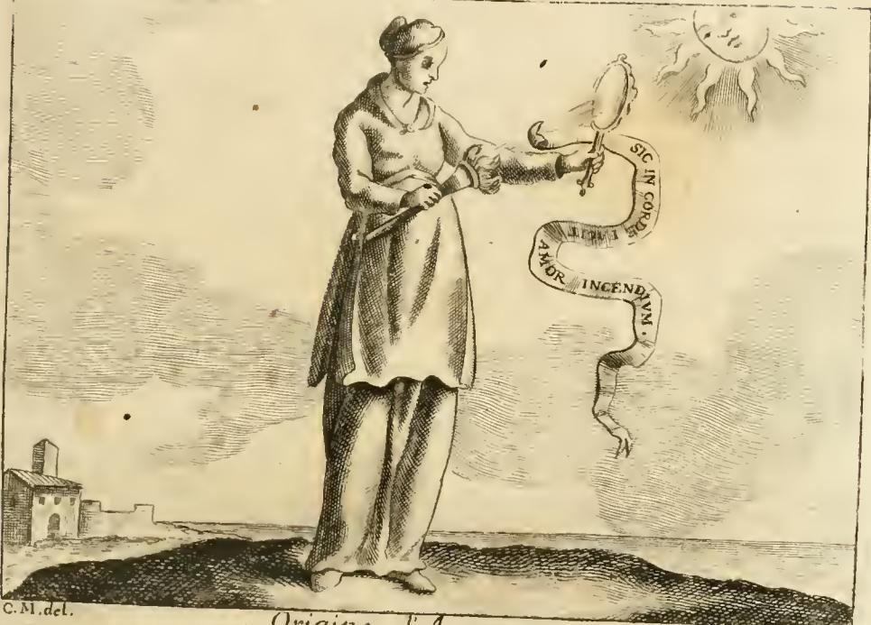

# 사랑의 유혹을 피하는 처방 — "눈을 돌려라"

**Q.** 사랑의 유혹을 피하는 처방으로 무엇이 제시되는가?

**A.** '헛된 것을 보지 않게 내 눈을 돌이키소서'라는 말씀대로 아름다운 대상 앞에 머물지 말고 눈길을 돌려 떠나라는 것. + '베누스의 얼굴 앞에 가면 어찌하려나 — 앉지 말고 가라, 그들로 인해 망하지 않게'라는 경구 + 완전히 꺼지지 않은 재에 유황이 닿으면 큰불이 되듯 사랑을 되살릴 것을 피하지 않으면 불꽃이 재발한다는 오비디우스의 처방.

---

## 1. 이 대목은 어디에 있는가

출전: Cesare Ripa, *Iconologia*, 페루자판(18세기) 제4권, 항목 **「ORIGINE DI AMORE」(사랑의 기원)** — 저자 표기는 **Giovanni Zaratino Castellini**.
자산 파일: `12 Honor to Origin of Love.md` (285~297쪽 상당).

구조상 중요한 점: 이 처방은 **항목의 끝맺음이 아니라 논증의 전환점**이다. 카스텔리니는 앞에서 "사랑은 눈에서 태어난다(*Amor ex intuendo nascitur*)"를 시인·산문가·의학·플라톤주의로 길게 입증해 놓고, 곧바로 이렇게 접는다.

> **Non sarà vano questo discorso, ma profittevole** … per non entrare nel cieco laberinto di Amore, chiuderemo gli occhi all'apparente splendore delle mortali luci.
> (이 논의는 헛되지 않고 유익할 것이다 … 사랑의 눈먼 미궁에 들어가지 않으려면, 우리는 죽을 것들의 빛의 겉보기 광채에 눈을 감을 것이다.)

즉 **"사랑의 기원 = 눈"이라는 원인론이 곧 치료법의 근거**가 된다. 원인이 시선이므로 처방도 시선이다. 그 다음 문장이 카드의 핵심 논리다.

> **Se il dimorar con lo sguardo avanti una splendida bellezza ci fa incorrere nella malattia di Amore, il suo contrario, ch'è di rivolger gli occhi altrove, ci libererà da quella.**
> (빛나는 아름다움 앞에 시선을 두고 **머무는 것**이 우리를 사랑의 병에 걸리게 한다면, 그 **반대**, 즉 눈을 다른 데로 돌리는 것이 우리를 그 병에서 풀어줄 것이다.)

주목할 동사가 두 개다. **dimorare(머물다) ↔ rivolgere(돌리다)**. 뒤에 나올 세 인용은 모두 이 한 쌍의 변주다.

---

## 2. 처방 ①: 시편 118(119):37 — *Averte oculos meos ne videant vanitatem*

Ripa/카스텔리니는 위 문장 끝에 성경 구절 하나만 붙인다(OCR: `^-verte ocnlos tms ne videant njmitatem` → 판독 `Averte oculos meos ne videant vanitatem`).

**불가타 원문 (Ps 118:37 Vulgata = 히브리·개역 번호 Ps 119:37)**

> **Averte oculos meos, ne videant vanitatem; in via tua vivifica me.**
> (내 눈을 돌이켜 헛된 것을 보지 않게 하시고, 주의 길에서 나를 살아나게 하소서.)

맥락에서 알아둘 것:

- **시편 119편은 알파벳 시편(acrostic)** 으로 176절, 8절씩 22단락. 37절은 다섯째 문자 **He 단락(33–40절)** 에 속하고, 이 단락은 전부 "가르치소서 / 깨닫게 하소서 / 이끄소서 / 기울이소서 / **돌이키소서**"의 **간구형 명령**이다. 즉 이 구절은 원래 **금욕 지침이 아니라 기도문**이다. 눈을 돌리는 주체가 내가 아니라 하느님이다.
- 그래서 이 인용은 **'의지로 참는 절제'가 아니라 '시선의 방향 자체를 바꿔달라는 청'** 이라는 색을 처방 전체에 입힌다. 시선을 다스릴 수 없다는 전제가 이미 깔려 있다.
- **vanitas**는 여기서 '허영심'이 아니라 **'헛것·실체 없는 것'**(히브리어 *šāwʾ*). 앞 문단의 "**apparente** splendore delle **mortali** luci(죽을 빛들의 **겉보기** 광채)"와 정확히 대응한다. 아름다움은 나쁜 것이 아니라 **덧없어서 헛된 것**이라는 논지.
- 중세·근세 도덕서에서 이 구절은 *custodia oculorum*(눈의 파수) 전통의 표준 표어였다. 카스텔리니는 세속적 연애론을 쓰다가 이 표어 하나로 텍스트를 교훈서 쪽으로 틀어놓는다.

---

## 3. 처방 ②: "베누스의 얼굴 앞에 가면 어찌하려나" — 출처 추적

**자산의 라틴어 원문** (OCR: `§luìd facies , facies Veneris fi 'veneris ante ? 2^e fedeas , fed eas , ne pereas per eas .`)

판독하면 **애가체(elegiac distich) 2행**:

> **Quid facies, facies Veneris si veneris ante?**
> **Ne sedeas, sed eas, ne pereas per eas.**

Ripa가 붙인 소개말은 **출처 없이** 이렇다.

> **Saggio è quel consiglio dato in questo grazioso distico**
> (이 우아한 2행시가 주는 충고는 현명하다)

### 출처 판정

**결론: 성경(집회서)도, 특정 교부의 저작도 아니다. 저자 미상의 중세 라틴 학교 격언시(레오니누스 운·*annominatio* 유형)다.**

근거와 계보를 정리하면:

1. **자산 내부 증거** — Ripa는 이 항목에서 인용마다 출처를 꼼꼼히 댄다(Achille Tazio *lib. 1*, Eliodoro *4.*, Plutarco *Simposio 5, q. 7*, Luciano, Erodoto, Senofonte *3.*, Apuleio *lib. 10*, Ficino *orazione 7 cap. 10*, Ovidio). **유일하게 이 2행시만 "grazioso distico"라고만 부른다.** 저자를 몰랐다는 뜻이고, 곧 당대에 **출처 없이 떠돌던 격언(proverbium)** 이었다는 강한 신호다.
2. **문체 증거** — 성경 라틴어에는 없는 **극단적 동음이의 유희(annominatio/paronomasia)** 로 짜여 있다. 이것은 중세 학교 운문의 전형적 기교다.
   - `facies`(너는 하리라, 동사 *facio* 2인칭 미래) ↔ `facies`(얼굴, 명사)
   - `Veneris`(베누스의, 속격) ↔ `veneris`(너는 왔을 것이다, *venio* 미래완료)
   - `sedeas`(앉다) ↔ `sed eas`(그러나 가라)
   - `pereas`(망하다) ↔ `per eas`(그 여자들로 인해)
   → 성경 인용으로 오해하기 쉬운 이유는 **명령형 어투가 지혜문학과 똑같기 때문**이지, 어법 때문이 아니다.
3. **전승처** — 이 2행시는 J. Wegeler 편 **《Philosophia patrum versibus praesertim Leoninis》(1869) no. 1013** 에 수록되어 있다. 이 책은 제목에 "patrum(교부들의)"이 들어가지만 **19세기에 중세 학교 운문·속담을 모은 편찬물**이다. 즉 흔히 붙는 **"교부 격언"이라는 라벨은 이 후대 선집 제목에서 나온 것이고, 실제 교부 출전은 아니다.** 변이형으로 `si veneris` 대신 **`cum veneris`** 가 돌아다니는데, Ripa 본문은 **`si`** 형을 쓴다 — 구전 격언 특유의 이본 흔들림.
4. **내용의 진짜 뿌리 = 집회서(Sirach/Ecclesiasticus) 9장.** 저자는 아니지만 **내용은 집회서 9장을 운문으로 압축한 것**으로 봐야 한다. 두 명령이 그대로 대응한다.
   - **눈을 돌려라** → *Sir* 9:8 **Averte faciem tuam a muliere compta, et ne circumspicias speciem alienam.** (치장한 여인에게서 얼굴을 돌리고, 남의 아름다움을 둘러보지 마라.) — `facies`, `averte`가 시편 118:37과 이 2행시를 잇는 접착제 역할을 한다.
   - **앉지 마라** → *Sir* 9:12(클레멘스판 절 번호) **Cum aliena muliere ne sedeas omnino, nec accumbas cum ea super cubitum.** (남의 여자와는 결코 **앉지** 말고, 자리에 함께 기대지도 마라.)
   → 즉 `Ne sedeas, sed eas`의 `ne sedeas`는 **집회서의 표현을 거의 직역으로 물려받은 것**이다.

**정리하면:** 형식은 중세 라틴 격언시(무명), 내용은 집회서 9:8+9:12 계열, "교부 격언"은 근대 선집 제목이 만든 오라벨. 시험/암기용으로는 **"출처 미상의 중세 격언, 집회서 계열 지혜문학의 운문화"** 로 잡으면 안전하다.

### 왜 하필 '앉기'가 금지인가

Ripa 자신이 바로 다음 문장에서 해설을 붙인다.

> **Non si deve sedere, e dimorare avanti un bel volto, ma fuggir via dalla sua vista**, e aver cura che gli occhi nostri non si riscontrino cogli occhi altrui, che belli siano.
> (아름다운 얼굴 앞에 **앉아 머물러서는** 안 되고 그 시야에서 달아나야 하며, 우리 눈이 아름다운 남의 눈과 **마주치지(riscontro)** 않도록 조심해야 한다.)

`sedere = dimorare`. §1에서 병의 원인으로 지목된 그 **'머무름'** 이다. 그러니까 이 격언은 시편 인용의 **행동 번역판**이다: 시편이 "눈을 돌려주소서"라면, 격언은 "**자리를 떠라**". 시선 관리보다 **체류 시간 관리**가 실행 가능한 처방이라는 인식이 깔려 있다 — 근세 도덕신학의 *fuga occasionis*(기회 회피) 원칙.

---

## 4. 처방 ③: 오비디우스 『사랑의 치료』 — 재와 유황

Ripa는 여기서 대상을 바꾼다. ①②가 **아직 안 걸린 사람의 예방**이라면, ③은 **이미 걸린 사람의 재발 방지**다.

> …per non cadere in detta nojosa infermità di Amore; **e se caduti ci siamo, per risorgere da quella**, rimedio dataci tanto da **Marsilio Ficino nel convivio**, quanto dal **maestro di Amore nel rimedio di Amore**, è: …
> (그 지겨운 사랑의 병에 빠지지 않기 위해서이며, **이미 빠졌다면 거기서 다시 일어나기 위해** 피치노의 『향연 주해』와 '사랑의 스승'이 『사랑의 치료』에서 준 처방은 이것이다.)

**"maestro di Amore" = 오비디우스**(자칭 *praeceptor Amoris*, 『사랑의 기술』 *Ars amatoria* 1.17), **"nel rimedio di Amore" = 『레메디아 아모리스(Remedia Amoris)』**. 인용 4행:

> **Ut bene extinctum cinerem, si sulphure tangas,**
> **Vivit, et ex minimo maximus ignis erit:**
> **Sic nisi vitaris quidquid revocabit Amorem,**
> **Flamma redardescet, quae modo nulla fuit.**

**해당 행: 『Remedia Amoris』 731–734.** 표준 교정본과 대조하면 Ripa 본문에 두 군데 이본이 있다.

| | 표준 교정본 | Ripa 본문 |
|---|---|---|
| 731 | **paene** extinctum cinerem (거의 꺼진 재) | **bene** extinctum cinerem (잘 꺼진 재) |
| 732 | **vivet** … **e** minimo | **vivit** … **ex** minimo |
| 733 | quidquid **renovabit** amorem | quidquid **revocabit** Amorem |

이 차이가 뜻을 미묘하게 바꾼다.

- **paene(거의) → bene(완전히)**: 표준본은 "**거의** 꺼진 재라도 다시 산다"로 위험을 경고한다. Ripa 본은 "**잘/완전히** 꺼진 재도 다시 산다"가 되어 경고가 더 세진다. 카드 답안의 "**완전히 꺼지지 않은 재**"라는 표현은 표준본(*paene*) 쪽 뜻을 취한 것이니, 라틴 이본까지 물어보는 문제가 아니면 둘 다 같은 논지로 이해하면 된다.
- **renovabit(되살릴) → revocabit(되불러올)**: 뜻은 사실상 같고, `revocare`가 오히려 뒤 §5의 '기억을 불러오는 것'과 더 잘 맞는다.

**직역:** "잘 꺼진 재에 유황을 갖다 대면 되살아나 아주 작은 것에서 아주 큰 불이 되듯, 사랑을 되불러올 무엇이든 피하지 않으면, 방금까지 아무것도 아니었던 불꽃이 다시 타오를 것이다."

### 비유의 물리학이 곧 처방의 논리

- **재 = 식은 사랑**(감정의 실체는 남아 있고 활성만 꺼진 상태),
- **유황 = 외부 접촉물**(*sulphur*는 극소량으로도 점화하는 당대의 대표적 인화물),
- **결론 = 접촉 금지**. 재를 없앨 방법이 없으니 **유황을 치우는 것만이 처방**이다.

즉 오비디우스도 ①②와 **같은 종류의 처방**을 한다. 감정을 직접 끄려 하지 말고 **점화원과의 접촉을 차단**하라. 세 인용이 한 문단에 모인 이유가 여기 있다 — 성경·격언·이교 시인이 **전부 '회피'라는 동일 처방**으로 수렴한다는 것이 카스텔리니의 논증이다.

### 『레메디아 아모리스』의 처방 계열 안에서의 위치

이 4행은 고립된 격언이 아니라 **작품 후반 '회피 처방군'의 요약**이다. 오비디우스의 처방들은 대체로 이렇게 묶인다.

| 계열 | 내용 |
|---|---|
| **바쁘게 만들기** | 한가함을 없애라 — 농사·사냥·법정·전쟁. "한가함을 없애면 큐피드의 활은 부러진다" |
| **장소 회피** | 연인과 얽힌 **장소를 떠나라**, 시골로 가라, 여행하라 (다만 "떠나면서 뒤돌아보지 말라"는 조건 포함) |
| **기억 매체 회피** | 연애시를 읽지 마라, 편지·초상 같은 **기억을 되불러올 물건을 없애라**, 연애를 떠올리는 극장·잔치를 피하라 |
| **재발 경고 (731–734)** | ↑ 위의 것들을 지키지 않으면 **꺼진 불이 되살아난다** — **회피 처방군 전체의 근거 격언** |
| 평가절하 기법 | 결점을 확대해 보라, 두 명을 동시에 사랑해 힘을 분산하라, 포만시켜 물리게 하라 |

**시험 포인트:** 731–734는 처방 목록의 한 항목이 아니라 **"왜 회피해야 하는가"에 대한 이유 진술**이다. 그래서 Ripa가 여러 처방 중 이 4행만 뽑아 쓴 것이다.

**연결:** 이 '장소·기억 회피'가 §3 격언의 `Ne sedeas, sed eas`와 정확히 겹친다. `sed eas`(가라)는 오비디우스의 *장소 회피*, `ne sedeas`(앉지 마라)는 *체류 금지*. Ripa는 성경 격언과 이교 처방이 사실상 같은 문장이라는 것을 나란히 놓아 보여준다.

**주의:** 『레메디아 아모리스』는 원래 **반어·패러디 성격이 강한 애가**다(사랑을 가르친 자가 이제 해독제를 판다는 포즈). 카스텔리니는 그 반어를 벗기고 **진지한 도덕 처방으로 전용**한다. 근세 엠블럼·도상학이 고전을 다루는 전형적 방식이다.

**곁가지: 피치노.** Ripa가 오비디우스와 나란히 댄 "Marsilio Ficino nel convivio"는 『플라톤 향연 주해(De amore)』다. 같은 항목의 앞부분에서 그는 **"orazione 7. cap. 10"** 을 인용해 "눈이 사랑의 병의 전적인 원인(*tutta la cagione della malattia amorosa*)"임을 입증했다. 제7 연설은 *amor vulgaris*(속된 사랑)를 **일종의 광증·질병**으로 다루는 대목이고, 원인 진단 바로 뒤에 치료 논의가 이어진다. 즉 Ripa는 **같은 저자의 같은 연설에서 원인(앞 카드)과 치료(이 카드)를 각각 끌어온다.**

---

## 5. 앞 카드들과의 연결 — 이 처방이 왜 '눈'만 공격하는가

이 카드는 **앞 두 논지의 필연적 결론**이다. 따로 외우면 안 되고 사슬로 외워야 한다.

### (a) 시각 발출설 → 처방은 '광선 차단'이어야 한다

앞 카드들에서 카스텔리니가 세운 광학은 이렇다.

- 눈은 **영혼의 창(finestre dell'anima)** 이고, 사랑은 그 창으로 들어온다.
- 엘리오도로스 인용: **연인들의 상호 응시가 곧 정념이며, 시선은 불에 연료를 갖다 댄 것처럼 정신을 불붙인다.**
- 카스텔리니의 가중 논평: 물질의 불은 **연료에 붙어야** 타지만, **눈에서 튀는 사랑의 불은 멀리서도 마음과 심장을 태운다** — 시각의 불이 물리적 불보다 **강력하다**.
- 플루타르코스 인용: 미인들의 **교환된 시선**, 눈에서 나오는 **빛 또는 어떤 흐름(flusso)** 이 연인을 녹이고 소진시킨다 → 오르페우스의 **glicipicro(dolce amaro, 달콤씁쓸)**.
- 아풀레이우스 인용: "**너의 그 눈이 내 눈을 통과해** 심장 깊숙이, 골수까지 들어와 격렬한 화재를 일으킨다."
- 결론 격언: **Amor ex intuendo nascitur**(사랑은 응시함으로써 태어난다).

여기서 사랑은 **양쪽 눈 사이에 실제로 성립하는 광선 경로**다. 병이 '경로'라면 치료도 '경로'여야 한다. **감정을 다스리는 처방이 아니라 기하학적 처방** — *rivolgere*(각도를 틀기), *fuggir via*(거리를 벌리기), *chiudere gli occhi*(경로를 끊기) — 가 나오는 이유가 이것이다. 처방이 심리학이 아니라 **광학**인 것이 이 항목의 핵심이다.

같은 문단의 두 보조 이미지가 이를 확인해 준다.

- **바빌로니아 나프타(Nafta, 역청 꽃)**: 불이 **떨어져 있어도** 옮겨붙는다 → 원거리 점화. §4의 **유황**과 같은 계열의 인화물 비유이고, 그래서 오비디우스 인용이 이 문단에 자연히 붙는다.
- **카라드리오스(Caradrio) 새**: 황달 든 사람의 눈을 마주 보면 그 병을 자기가 받아버리므로, **눈을 감고 몸을 돌린다**(*voltasi cogli occhi serrati*). 그러지 않으면 "무거운 타격을 입은 듯" 상한다. → 카스텔리니는 곧바로 "**così noi chiuderemo gli occhi**(그러니 우리도 눈을 감을 것이다)"로 사람에게 적용한다. **동물지(bestiary)에서 가져온, 이 처방의 도상학적 짝**이다.

### (b) 쾌락의 사다리 → 처방은 '첫째 단'에서만 가능하다

바로 이어지는 대목에서 그는 **위-루키아노스(『Amores』)** 를 인용해 사랑을 계단으로 만든다.

> **Amor primum gradum visus habet** … Deinde ubi aspexerit, cupit … contingere.

**4단: ① 봄(vedere) → ② 만짐(tatto) → ③ 입맞춤(bacio) → ④ 성행위(atto venereo).** 그리고 결정적 진술:

> **posto che s'è il piede nel primo scalino del vedere, difficil cosa è ritenersi di non salire al tatto, e passare all'ultimo, poiché dal vedere si commuovono gli affetti.**
> (보기라는 첫 단에 발을 올려놓으면, 만짐으로 올라가 마지막까지 가지 않고 스스로를 붙잡기는 어려운 일이다. 봄에서 정념이 움직이기 때문이다.)

이것이 왜 처방이 **오직 눈**을 겨누는지에 대한 최종 답이다. **사다리는 중간에서 멈출 수 없다**는 전제이므로, 유효한 개입 지점은 **발을 올리기 전, 첫째 단 하나뿐**이다. `Ne sedeas, sed eas`는 곧 **"사다리에 오르지 말고 사다리에서 떨어져 있어라"** 다.

같은 문단이 이 '멈출 수 없음'을 사례로 밀어붙인다.

- **소크라테스와 테오도테**(크세노폰 『소크라테스 회상』 3권): 플라톤주의의 신탁인 소크라테스조차 "**본 것을 만지고 싶어진다**(*ea quae vidimus tangere cupimus*)"고 **자백**한다 → 사다리는 플라톤주의로도 못 막는다.
- **아라스파스와 판테이아**(크세노폰 『키로파이디아』): 아라스파스는 "정념에 굴하지 않고 여인을 볼 수 있다"고 자신했으나, 키로스는 **"나는 불을 다루지도, 아름다운 것을 보지도 않겠다"** 고 답한다. 결국 아라스파스는 첫 단에 발을 딛고 만짐으로 올라가려다 무너진다. → **"나는 첫 단에서 멈출 수 있다"는 자신감 자체가 실패 원인**이라는 예시.
- **페르시아 사절과 마케도니아 부인들**(헤로도토스): "**앉게 해달라**"고 청해 얻어낸 순간(= `sedeas`) 손을 뻗고, 알렉산드로스가 보낸 무장 청년들에게 살해된다. → 격언의 `ne pereas per eas`(그들로 인해 망하지 않게)가 문자 그대로 실현된 삽화.
- **성경 사례 연쇄**: 하와(*Vidit mulier quod bonum esset lignum … pulchrum oculis*, 창 3:6) → 홍수(*Videntes filii Dei filias hominum quod essent pulchrae*, 창 6:2) → 삼손(*Placuit oculis meis*, 판 14:3, 그리고 결말은 **눈이 뽑히는 것**) → 다윗(*Vidit mulierem se lavantem: erat autem mulier pulchra valde*, 삼하 11:2) → 솔로몬. 카스텔리니의 요약: **"눈은 의로운 다윗을 범법자로, 강한 삼손을 무력하게, 지혜로운 솔로몬을 우매하게 만들었다"** — 정의·용기·지혜가 모두 시각에 무너지므로 **자기 확신에 근거한 예외는 없다.**
- **아우구스투스와 클레오파트라**: 카이사르와 안토니우스를 눈의 화살로 이긴 그녀를 아우구스투스는 **끝내 좋은 눈으로 보지 않았다**. 파라디노의 엠블럼 표어 **COL(ligavit) NEM(o)** — "아무도 묶지 못했다"가 그 승리의 명문. → **회피가 곧 승리**라는 이 항목의 결론 이미지.
- **페트라르카 RVF 207**(『칸초니에레』 「Ben mi credea passar mio tempo omai」 결부): "**그러니 남의 죄를 용서해달라 빌지만, 실은 내 죄다 — 너무 강한 빛에서 눈을 돌려야(devea torcer gli occhi dal troppo lume) 했고, 세이렌의 소리에 귀를 막아야 했으니.**" → **처방을 어긴 자의 사후 고백**으로 인용된다. 눈(빛)과 귀(세이렌)를 함께 언급한 점이, 이 항목 앞부분의 "귀로도 사랑이 생기는가" 논쟁(→ 결론: 청각은 *occasione*일 뿐, *cagione*는 눈)과 맞물린다.

### 사슬 요약

```
눈 = 영혼의 창, 시선은 실제 광선/유출  (시각 발출설)
        ↓ 그래서
Amor ex intuendo nascitur — 사랑의 원인은 눈       (원인론)
        ↓ 그런데
봄 → 만짐 → 입맞춤 → 성행위, 중간 정지 불가        (쾌락의 사다리)
        ↓ 따라서 개입 지점은 오직 첫 단 이전
처방 = 광선 경로를 끊기
   ① Averte oculos meos (시 118:37)   — 시선의 방향
   ② Ne sedeas, sed eas (중세 격언)     — 체류/장소
   ③ Rem. Am. 731–734 (재·유황)        — 재발/기억 매체
        ↓ 확증 이미지
카라드리오스: 눈을 감고 돌아선다 / 클레오파트라: 회피한 자만 이겼다
```

---

## 6. 도판 — 처방이 무엇을 끊으라는 것인지가 그림에 있다



「ORIGINE DI AMORE」의 인격화. Ripa의 규정과 그림이 정확히 맞는다.

> Donna, che tenga uno **specchio trasparente rotondo**, grosso e corpulento, **incontro all'occhio del Sole**, il quale con i suoi raggi trapassando per mezzo dello specchio, **accenda una facella**, posta nella mano sinistra. Dal manico dello specchio penda una cartella, nella quale sia scritto questo motto: **SIC IN CORDE FACIT AMOR INCENDIUM.**

관찰 요소를 처방과 이어 보면:

| 그림 요소 | 알레고리 | 처방과의 관계 |
|---|---|---|
| 오른손의 **둥근 투명 렌즈**(*specchio trasparente* = 화경/집광 렌즈) | **사람의 눈** — "예술의 눈(occhio dell'arte)" | 처방이 손대는 유일한 장치. 이 렌즈의 **각도를 틀면(*rivolgere*) 점화가 끝난다** |
| 오른쪽 위 **광선을 뻗는 해**("태양의 눈") | 사랑받는 대상의 아름다움, "아름다운 태양(bel Sole)" | 태양은 없앨 수 없다 = 아름다움 자체는 제거 대상이 아니다. 시편의 *vanitas*, 오비디우스의 **재**에 해당 |
| **렌즈를 통과해 왼손 횃불에 모이는 초점** | 시선이 심장에 붙이는 불 | **정렬(태양–렌즈–횃불 일직선)이 성립할 때만** 불이 붙는다 → 처방은 **이 정렬을 깨는 것** |
| **왼손**의 횃불 (**심장 쪽**) | *dal lato manco del cuore* — 심장이 표적임을 표시 | 사다리의 결과지점. 여기서 끄는 건 이미 늦다 |
| 늘어진 **두루마리(cartella)**: `SIC IN CORDE / AMOR INCENDIVM` | "이렇게 사랑은 심장에 화재를 일으킨다" (플라우투스 *Ita mihi in pectore, utque in corde facit amor incendium*의 전용) | 병의 진단명 |
| 인물이 **해를 정면으로 보지 않고 시선을 렌즈에 두고 있는 자세** | — | 그림 자체가 "태양을 직시하지 않음"의 상태. 처방의 시각적 예고 |
| 배경의 작은 **집/성벽**, 텅 빈 지평 | — | 이 항목이 실내 연애 장면이 아니라 **광학 실험 도해**로 구상되었음을 보여주는 무대 |

**왜 이 도판이 이 카드의 근거가 되는가:** Ripa는 렌즈의 선례로 **누마의 베스타 처녀들이 꺼진 성화를 화경으로 다시 붙였다는 플루타르코스의 기술**과 **아르키메데스·프로클로스의 화경 병기(적선 소각)** 를 든다. 두 선례가 곧 이 카드의 두 처방이다.

- **꺼진 불을 다시 붙이는 화경** = §4 오비디우스의 **"잘 꺼진 재 + 유황 = 재발"**. 꺼진 것도 다시 붙는다.
- **원거리에서 배를 태우는 화경** = §5(a)의 **"눈의 불은 멀리서도 태운다"**.

그래서 처방은 필연적으로 **"렌즈를 태양에서 떼라"** 는 형태를 취한다 — 그것이 곧 `Averte oculos`, `sed eas`, `vitare quidquid revocabit Amorem`이다. **도판은 병리 기계의 도해이고, 세 인용은 그 기계의 정지 절차다.**

---

## 7. 헷갈리기 쉬운 지점

- **처방의 수는 셋이고, 층위가 다르다.** ①은 **기도**(시선의 방향), ②는 **행동 규범**(체류·장소), ③은 **재발 관리**(기억 매체 차단). "눈을 돌려라" 하나로 뭉개면 ③의 '이미 걸린 경우'가 빠진다.
- **③의 저자.** "maestro di Amore"는 오비디우스의 **호칭**(*praeceptor Amoris*)이고, "rimedio di Amore"는 **작품명**(*Remedia Amoris*)이다. 사람 이름과 책 이름을 각각 별개 출처로 세지 않도록.
- **①의 성경 번호.** 불가타 **118**:37 = 히브리·현대역 **119**:37. 둘 다 맞다.
- **②의 출처.** 성경 인용이 아니다. Ripa 본문에 출처가 아예 없다. "집회서 9:8·9:12와 **내용상** 같은 계열"이 정확한 표현.
- **③의 재.** 표준 교정본은 *paene extinctum*(거의 꺼진), Ripa 본문은 *bene extinctum*(완전히 꺼진). 카드 답안의 "완전히 꺼지지 않은 재"는 표준본 쪽 독법이다.
- **비유의 방향.** 유황이 재를 태우는 게 아니라, **재 안에 남은 불씨가 유황을 만나 되살아난다.** 위험은 외부가 아니라 **남아 있는 내부 + 접촉**의 결합이다.
- **피치노의 역할.** ③ 문장에서 오비디우스와 **병렬로** 언급되는 치료 권위자이지, 재·유황 4행의 저자가 아니다.

---

## 출처

- 자산: `/Users/swcho/projects/swcho/default/books/260801 Iconologia/.fm/assets/12 Honor to Origin of Love.md` (「ORIGINE DI AMORE」, di Giovanni Zaratino Castellini)
- 도판: `/Users/swcho/projects/swcho/default/books/260801 Iconologia/.fm/assets/Iconologia (Cesare Ripa)/_page_292_Picture_3.jpeg` → 본 폴더 `fig-1.jpeg`
- [Ovid, *Remedia Amoris* 699–814 (LateinLex)](https://www.lateinlex.de/?call=Puc&permalink=Ov_rem_699) / [Perseus, *Remedia Amoris*](https://www.perseus.tufts.edu/hopper/text?doc=Perseus:text:1999.02.0068:text%3DRem.) / [Loeb, *Remedies for Love*](https://www.loebclassics.com/view/ovid-remedies_love/1929/pb_LCL232.177.xml)
- ["Quid facies, facies Veneris" — Philosophia Patrum (ed. Wegeler) 1013](http://distichalatina.blogspot.com/2012/02/quid-facies-facies-veneris.html) / [Wegeler, *Philosophia patrum versibus praesertim Leoninis* (1869), Internet Archive](https://archive.org/details/philosophiapatru00wege)
- [Vulgate Sirach 9 (sacred-texts)](https://sacred-texts.com/bib/vul/sir009.htm) / [Sirach 9 (New Advent)](https://www.newadvent.org/bible/sir009.htm)
- [Petrarca, *Canzoniere* 207 「Ben mi credea passar mio tempo omai」 (Wikisource)](https://it.wikisource.org/wiki/Canzoniere_(Rerum_vulgarium_fragmenta)/Ben_mi_credea_passar_mio_tempo_omai)
- [Ficino, *Commentary on Plato's Symposium on Love* (De amore), Internet Archive](https://archive.org/details/commentaryonplat0000fici)
