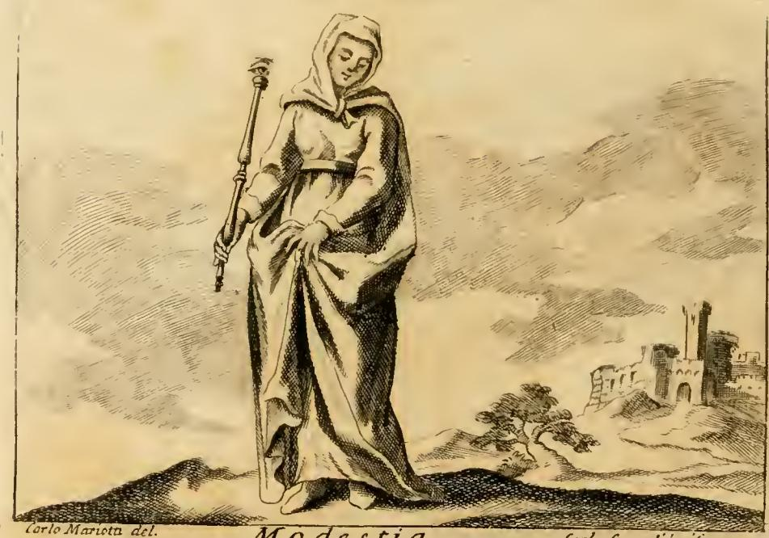

# 리파의 「겸손(MODESTIA)」 의인상

## 카드 한눈에

**질문** 리파는 '겸손(Modestia)'을 어떻게 의인화했는가?

**답** 흰옷에 금 허리띠를 두른 젊은 처녀가 오른손에 꼭대기에 눈(眼)이 달린 홀을 들고, 앞머리 장식(ciuffo)도 다른 머리 장식도 없이 고개를 숙이고 있다. 아우구스티누스에 따라 겸손(Modestia)은 '척도(modo)'에서 온 말로, 인간 행위를 모자람과 지나침의 양 극단 밖에 두고 중용의 길로 조절하는 덕이다.

---

## 원문 (Iconologia, 「MODESTIA — Di Cesare Ripa」)

리파의 처방(prescription) 부분은 딱 두 문장이다.

> Una Giovinetta, che tenga nella destra mano uno scettro, in cima del quale vi sia un occhio. Vestasi di bianco, e cingasi con una cinta di oro. Stia col capo chino, senza ciuffo, e senz' altro ornamento di testa.
>
> (한 젊은 처녀. 오른손에 홀을 들고, 그 꼭대기에는 눈이 하나 있게 하라. 흰옷을 입히고 금 허리띠를 매게 하라. 고개를 숙이고, 앞머리 장식도 그 밖의 어떤 머리 장식도 없게 하라.)

이어지는 해설의 핵심 문장:

> S. Agostino dice, che la Modestia è detta dal modo, ed il modo è Padre dell'ordine: dimodocché la Modestia consiste in ordinare, e moderare le operazioni umane; e per far ciò, bisogna collocare lo scopo della nostra intenzione **fuori di ogni termine estremo del mancamento, e dell' eccesso**, talché nelle nostre azioni non ci teniamo al poco, né al troppo, ma **nella via di mezzo**, regolata dalla moderazione, della quale n'è simbolo l'occhio in cima dello scettro.

즉 "겸손은 *modo*(척도)에서 나온 말이고 *modo*는 질서의 아버지다 → 그러므로 겸손은 인간의 행위를 **정돈하고 조절하는 것**이다 → 그러려면 의도의 목표를 결핍과 과잉이라는 양 극단 **밖에** 두어야 한다 → 적음도 많음도 아닌 **중간의 길**에 서야 한다"는 사슬이다. 답안의 후반부가 그대로 이 대목이다.

---

## 판화 — 실제로 그림에서 관찰되는 것

이 판화는 「MODESTIA」 항목 첫머리에 실린 도판으로, 텍스트의 처방과 하나하나 대응한다. 하단에 `Modestia`라는 캡션과 `Carlo Mariotti del.`이라는 서명이 있고, 본문 판심에 `TOMO QUARTO`(제4권)가 찍혀 있다 — 리파 사후의 18세기 이탈리아 다권 판본(체사레 오를란디 편, 페루자, 1764–67) 계열의 삽화다.

- **오른손에 든 긴 홀**: 인물이 자기 오른손(감상자 기준 왼쪽)으로 어깨 높이까지 세워 들고 있다. 홀 꼭대기에 둥근 머리가 있고, 그 안에 원형의 눈알 형태가 새겨져 있다 — 텍스트가 말하는 "꼭대기에 눈이 달린 홀"이다.
- **고개 숙인 머리**: 얼굴이 아래로 기울어 눈을 내리깔고 있다. 시선이 정면을 향하지 않는다.
- **머리 장식 없음**: 머리 전체가 천(두건·베일)으로 덮여 있어 앞머리 다발도, 보석·화관·깃털 같은 장식도 전혀 보이지 않는다. `senza ciuffo, e senz' altro ornamento di testa`의 시각적 번역이다.
- **밝은(흰) 통옷과 허리끈**: 몸 전체를 덮는 긴 밝은 색 옷을 입었고, 허리에 띠가 매어져 배 앞에서 매듭이 보인다(흑백 판화이므로 '금'은 색으로 표현되지 않고 띠의 존재로만 남는다).
- **배경**: 폐허가 된 성채와 나무가 있는 풍경. 리파 텍스트에 근거가 없는, 18세기 판본 삽화가의 장식적 배경이다.
- **아래를 향한 오른팔·모아쥔 옷자락**: 몸을 크게 벌리지 않고 옷자락을 정돈해 쥐고 있는 자세도 "필요 이상의 것을 허용하지 않는" 태도의 표현으로 읽힌다.

---

## 지물별 논거 정리

| 지물 (Attribute) | 리파가 대는 논거 | 인용된 권위 |
|---|---|---|
| **젊은 처녀 (Giovinetta)** | 고개 숙이고 걷는 것은 "정숙한 처녀들(oneste Donzelle)"과 겸손을 사랑하는 수도자들의 표지다. 겸손의 전형적 담지자로 젊은 여성상을 택했다. | 리파 자신의 관례 + 「FATTO」 삽화(성모의 엘리사벳 방문, 목욕 중의 디아나) |
| **흰옷 (vestimento bianco)** | 흰색은 겸손의 표지이며, "현재 가진 것에 만족하여 그 이상을 더 시도하지 않는 마음"의 표지다. 즉 백색 = 무욕·자족. | 피에리오 발레리아노 『히에로글리피카』 4권 |
| **금 허리띠 (cinta di oro)** | 성경도 금 띠로 절제(temperanza)와 겸손을 나타낸다. 헤프고 방자한 욕망과 고삐 풀린 탐욕을 *묶어 조여* 영혼 안에 순수한 겸손을 형성한다. | 시편 44(45)편 (`Eructavit`) — "Omnis gloria eius filiae regis ab intus, in fimbriis aureis circumamicta varietatibus"; 사도의 "허리를 금 띠로 두르라" 권면; 주석가 에우티미오스(Euthymius Zigabenus) |
| **꼭대기에 눈이 달린 홀 (scettro con occhio)** | ① 고대 사제들이 '조절자(il Moderatore)'를 상형문자로 나타낼 때 **눈 + 홀**을 썼다. ② **눈** = 겸손한 자는 결핍에 빠지지 않도록 *살펴보는 눈*을 가진다. ③ **홀** = 겸손의 홀에 자신을 다스리게 하는 자는 생각이 과잉으로 치닫지 않게 *제어(raffrenare)* 한다. 요약하면 눈=식별, 홀=통치, 둘이 합쳐 **moderazione의 상징**. | 이집트 상형문자 전승. 원류는 플루타르코스 『이시스와 오시리스』 10 (354F) — "그들은 왕이자 주인인 오시리스를 **눈과 홀**로 그린다"; 호라폴로·발레리아노를 거쳐 전달됨 |
| **머리 장식 없음 / 앞머리 다발(ciuffo) 없음** | 겸손은 **불필요한 것(cose superflue)** 을 허용하지 않는다. ciuffo는 잉여이며 헛된 교만의 표지다 — 겉으로 세운 높이가 마음속에 숨은 오만을 드러낸다. 볏·도가머리를 가진 짐승은 본성이 immodesto다. | 플라우투스 『포로들』(Captivi) — 뻔뻔한 **후투티(upupa)** 를 창녀에 비김; **수탉**은 볏이 있어 늘 대담하지만 볏을 잃으면 겸손해진다; 페트라르카 *Contra Gallum* — "Aperiat aurem Gallus, & cristam insolentiae dimittat"; 피우스 2세 『비망록』 11권 — 로마에서 논박당한 오만한 신학자에게 "Cristae cecidere superbo"; 에라스뮈스 『아다지아』 **Tollere cristas** ("볏 있는 새에서 온 비유, 볏은 기세와 기개의 표시") |
| **숙인 고개 (capo chino)** | 겸손의 표지. 정숙한 처녀와 수도자들이 걸을 때도 놀 때도 이렇게 한다. 이 덕을 가진 자는 "머리를 도도하게(testa altiera) 들고 다니지 않는다". | 빌립보서 4:4–5 — "Gaudete: **Modestia vestra sit nota omnibus hominibus**" (불가타) |

### 보조 논거 두 개

- **"자기를 조절함은 신의 선물"**: 리파는 그리스 시인 **소타데스**를 인용한다 — *"Es modestus? Hoc Dei munus puta, Modestia prompta tunc aderit tibi; si moderaberis te ipsum."* (겸손한가? 그것을 신의 선물로 여기라. 네가 너 자신을 조절할 때 겸손이 곧 네게 임할 것이다.)
- **정의(定義)**: *"Modestia … est cultum, & motum, & omnem nostram occupationem **ultra defectum, & citra excessum** sistere."* (겸손이란 몸치장과 몸짓과 우리의 모든 일거리를 결핍의 저쪽·과잉의 이쪽에 세워 두는 것이다.) 즉 결핍보다는 넘고 과잉에는 못 미치는 지점 = 중간.

---

## 전거 확인 ①: 아우구스티누스의 *modestia ← modus*

리파가 "S. Agostino dice"로 붙인 대목은 **『자유의지론』(De libero arbitrio)도 『신국론』(De civitate Dei)도 아니라, 『선의 본성에 관하여』(*De natura boni contra Manichaeos*) 계열의 modus 교설**에 기댄 것이다.

- 아우구스티누스 『선의 본성』 3장의 유명한 삼항: 모든 피조된 선은 **modus(척도) · species(형상) · ordo(질서)** 로 이루어지며, "이 셋이 큰 곳에 큰 선이, 이 셋이 작은 곳에 작은 선이 있고, 이 셋이 없으면 선이 없다." 하느님은 "모든 modus 위에, 모든 species 위에, 모든 ordo 위에" 계시며 거기서 모든 modus·species·ordo가 나온다.
- 이 삼항에서 **modus가 ordo의 원천**이라는 구도가 나온다. 리파의 "il modo è Padre dell'ordine"(척도는 질서의 아버지)은 바로 이 modus→ordo 위계를 이탈리아어 격언 형태로 압축한 것이며, "따라서 겸손은 인간 행위를 *ordinare*(정돈)하고 *moderare*(조절)하는 데 있다"는 결론도 여기서 도출된다.
- 같은 아우구스티누스 텍스트를 **토마스 아퀴나스**도 modestia를 논할 때 근거로 쓴다: 『신학대전』 II-II q.160 a.1에서 "겸손은 **modus에서 이름을 얻는다**(modestia a modo denominatur)"며, 덕은 선을 향하고 선은 "modus·species·ordo에 있다"(*De nat. boni* 3)는 아우구스티누스를 인용한다. 즉 리파는 아우구스티누스 원문을 직접 뒤진 것이 아니라, **modestia ← modus ← 『선의 본성』**이라는 스콜라 전통의 표준 어원 논증을 물려받은 것이다.
- 주의: "modestia a modo"라는 어원 자체는 아우구스티누스의 발명이 아니라 라틴어의 실제 어원(*modestus < modus*)이며, 이시도루스 『어원론』 등에도 흔하다. 리파의 아우구스티누스 귀속은 *권위 부여*이고, 논증의 실질은 modus/ordo 형이상학이다.

## 전거 확인 ②: "Ugone"의 정의는 실은 『Moralium dogma philosophorum』

리파는 *ultra defectum, & citra excessum sistere* 정의를 "Ugone Autore esemplare"(모범적 저자 후고, 즉 생빅토르의 후고)에게 돌린다. 그러나 이 문장은 **12세기 도덕 개요서 『Moralium dogma philosophorum』**(콩슈의 기욤에게 귀속되며, 사본 전승에서 힐데베르트·**생빅토르의 후고** 등에게도 잘못 귀속된 텍스트)의 「De modestia」 절 첫 문장이다. 그 책에서 modestia는 **절제(temperantia)의 하위 부분**으로, 몸치장·거동·일 처리의 과부족을 다스리는 덕으로 배치되고, 곧바로 호라티우스 *Est modus in rebus*가 인용된다. 그리고 그 책 자체가 키케로 『의무론』의 모자이크다 — 그러니 리파의 "후고" 인용은 **결국 키케로로 되돌아간다**. 리파 시대의 귀속 오류를 그대로 물려받은 것으로 보는 게 정확하다.

## 전거 확인 ③: 키케로의 modestia — "질서와 때에 맞음"

키케로 『의무론』 1권 142–144절이 라틴어 *modestia* 개념의 원점이다.

- 스토아적 정의: **"modestiam esse scientiam earum rerum, quae agentur aut dicentur, loco suo collocandarum"** — 겸손(절도)이란 *행해질 일과 말해질 말을 제자리에 놓는 지식*이다.
- 키케로는 이것을 그리스어 **εὐταξία(eutaxia)** 와 등치하고, 그 뜻을 **ordinis conservatio**(질서의 보존)로 새긴다. 나아가 '제자리'는 공간만이 아니라 **때**의 문제이므로 **εὐκαιρία(eukairia) = occasio**(적기)로 이어진다.
- 즉 키케로의 modestia는 오늘날의 '겸손·수줍음'이 아니라 **행위와 언사의 질서·적시성(decorum)에 대한 실천적 지식**이다. 리파의 "il modo è Padre dell'ordine … la Modestia consiste in ordinare"는 아우구스티누스 어원과 이 키케로적 *ordo* 정의가 겹쳐진 자리다.

---

## 개념 구별: modestia / temperantia / verecundia / pudicitia

| 라틴어 | 범위 | 스콜라적 위치 (아퀴나스 II-II 기준) | 오해하기 쉬운 점 |
|---|---|---|---|
| **temperantia** (절제) | 촉각·미각의 강한 욕구 — 먹고 마심, 성 | **주덕(cardinal virtue)** 넷 중 하나. 욕정적 능력(concupiscibilis)을 다스리는 유(類) | modestia의 상위 범주. 리파도 금 허리띠 대목에서 temperanza와 modestia를 나란히 놓는다 |
| **modestia** (절도·겸손) | 절제보다 *약한* 사안 전반: 자기 우월감(→겸손 humilitas), 지식욕(→studiositas), 몸의 거동, 옷차림·외양 | temperantia에 붙는 **부속덕(pars potentialis)**. q.160에서 "modus에서 이름을 얻는다" | 성적 함의가 본질이 아니다. **키케로적 의미의 '질서·적절함'** 이 뼈대 |
| **verecundia** (부끄러움) | 불명예에 대한 두려움 | 엄밀히 말해 덕이 아니라 **정념(passio)**, 절제에 딸린 준(準)덕 (q.144) | 덕 자체가 아니라 덕을 지키게 하는 감정. modestia와 달리 '조절'이 아니라 '기피' |
| **pudicitia** (정결·수치) | 성적 명예의 기호들 — 입맞춤·접촉·시선 | **정결(castitas)** 에 딸린 덕 (q.151 a.4) | 영어·한국어의 '정숙한 옷차림(modest dress)' 감각은 실은 pudicitia 쪽 |

한국어 '겸손'은 오늘날 humility(겸양) 또는 성적 정숙함으로 읽히기 쉽지만, 리파의 *Modestia*는 **'절도·중용·자기 조절'** 쪽에 훨씬 가깝다. 다만 리파가 인용한 빌립보서 4:5의 불가타 *modestia*는 그리스어 **τὸ ἐπιεικές(epieikes, 관용·너그러움)** 의 번역이므로, 리파 텍스트 안에서도 이 낱말은 이미 여러 겹의 의미가 겹쳐 있다.

---

## 이 카드의 장(章) 문맥: MEZZO → MISURA → MODESTIA

이 항목은 우연히 여기 있는 것이 아니다. 같은 장(6장, 알파벳순 ME– → MO–)에서 리파는 세 항목을 거쳐 하나의 덕을 조립한다. **「MEZZO(중간)」** 에서는 장년 남성이 지구 위에 서서 **똑같이 둘로 나뉜 원**을 들고 배꼽을 가리키며 정오의 태양을 머리에 받는데, 논거는 순수하게 아리스토텔레스적이다 — *Mediocritas est quaedam virtus medii, & perfecti indagatrix*(『니코마코스 윤리학』 2권), *Medium appello id quod aeque abest ab utraque extremitate*(2권 6장), 마르티알리스의 *Illud quod medium est, inter utrumque probatur*, 오비디우스의 *Medio tutissimus ibis* — 즉 **과잉과 결핍의 등거리 중점(mediocritas)** 을 우주론적 중심(지구·배꼽·태양·춘분선)으로 시각화한다. 이어 카스텔리니가 쓴 **「MISURA(척도)」** 는 로마 척(尺)·직각자·컴퍼스·10척 장대·수직 추를 든 여인으로 시작해 물리적 측량학을 늘어놓지만, 결론에서 돌연 도덕으로 꺾인다 — "이 도상은 밭과 건물의 **물질적 척도**만이 아니라 **도덕적 척도, 곧 자기 자신의 조절(moderazione di se medesimo)** 에도 쓸 수 있다"며 세네카 『오이디푸스』의 *Quidquid excessit modum pendet in instabili loco*(척도를 넘는 것은 불안정한 자리에 걸려 있다)와 마르티알리스의 *Qui sua metitur pondera, ferre potest*를 붙인다. 그리고 결정적으로 **MISURA의 마지막 인용이 소타데스의 그 시행**이다 — *"Et modestus: hoc Dei munus puta … si metiare te pede ac modulo tuo."* **바로 그 소타데스 시행이 몇 쪽 뒤 MODESTIA에서 다시 인용된다.** 리파 자신이 세 항목을 텍스트로 꿰맨 셈이다. 정리하면: MEZZO가 제공한 *아리스토텔레스적 중용의 논리*와 MISURA가 제공한 *측량 도구의 절제 알레고리*가, MODESTIA에서 **눈 달린 홀** 하나로 수렴한다 — 눈은 MEZZO의 '어느 쪽 극단으로도 치우치지 않았는지 살피는 식별'이고, 홀은 MISURA의 '재고 다스리는 자(Moderatore)의 도구'다. 형이상학(척도)에서 기술(측량)을 거쳐 인격(겸손)으로 내려오는 하강이며, 이것이 이 장의 숨은 논리다.

---

## 덧: 세 개의 「FATTO」 예화

리파(및 편집자)는 항목 끝에 늘 세 종류의 실례를 붙인다. 이 세 예화는 위 지물표를 서사로 되풀이한다.

| 구분 | 내용 | 출전 |
|---|---|---|
| **FATTO STORICO SACRO** (성사) | 성모가 수태고지의 은총을 받고도 자기 위대함을 한마디도 말하지 않고, 유대 산지의 험한 길을 걸어 엘리사벳을 방문해 *상대의* 기쁨을 축하한다. "하늘에서 받은 선물이 클수록 이 땅에서 더 깊이 낮추어야 한다"는 교훈. 감추려 한 겸손을 하느님이 태중 요한의 뛰놀음으로 드러내신다. | 루카 1장 |
| **FATTO STORICO PROFANO** (세속사) | **아게실라오스**가 이집트를 떠나 귀국하다 병들어 죽음을 앞두고, 자기 상(像)이나 조각을 일절 세우지 말라고 금한다 — "내가 영광스러운 일을 했다면 그것이 충분한 기념비일 것이고, 아니라면 세상의 모든 조각도 내 기억을 빛내지 못한다." | 플루타르코스 |
| **FATTO FAVOLOSO** (신화) | 목욕하던 **디아나**가 사냥 온 **악타이온**에게 알몸을 보이자, 어떤 남자도 그리 보았다고 자랑하지 못하게 물을 뿌려 그를 사슴으로 바꾸고, 그는 제 사냥개들에게 찢긴다. | 오비디우스 『변신 이야기』 3권; 나탈레 콘티 |

'기념상 거부'(아게실라오스)와 '보임의 거부'(디아나)는 곧 **ciuffo 없음·숙인 고개** 즉 "자기를 드러내는 잉여를 없애는 것"의 서사판이고, 성모의 방문은 **흰옷의 자족**과 **금 띠의 자기 결박**에 대응한다.

---

## 암기용 압축

> **"흰옷·금띠 / 눈 달린 홀 / 맨머리·숙인 고개"**
> — 흰옷 = 현재에 만족(발레리아노), 금띠 = 욕망을 묶음(시편 44), 눈+홀 = 조절자(Moderatore)의 상형문자(플루타르코스), 맨머리 = 잉여·오만의 볏 제거(에라스뮈스 *Tollere cristas*), 숙인 고개 = 빌립보서 4:5.
> 어원: *modestia ← modus*(아우구스티누스 『선의 본성』의 modus·species·ordo, 아퀴나스가 계승) → *modus는 질서의 아버지* → 겸손 = 결핍의 저쪽·과잉의 이쪽(*ultra defectum, citra excessum*)에 서기 = **중용(via di mezzo)**.

---

### 참고

- 원문: `.fm/assets/06 Metaphysics to Worldly Monarchy.md` — 「MODESTIA」 347–394행, 「MEZZO」 13–77행, 「MISURA」 261–303행
- 판화: `.fm/assets/Iconologia (Cesare Ripa)/_page_157_Picture_3.jpeg` (본 폴더에 `fig-1.jpeg`로 복사)
- [Aquinas, ST II-II q.160 (Modesty)](https://www.newadvent.org/summa/3160.htm)
- [William of Conches(?), Moralium dogma philosophorum — De modestia](https://www.thelatinlibrary.com/wmconchesdogma.html)
- [Cicero, De officiis — modestia / eutaxia (I.142ff)](https://www.gutenberg.org/files/47001/47001-h/47001-h.htm)
- [Plutarch, De Iside et Osiride §10 — 눈과 홀로 그린 오시리스](http://www.perseus.tufts.edu/hopper/text?doc=Perseus%3Atext%3A2008.01.0239%3Asection%3D10)
