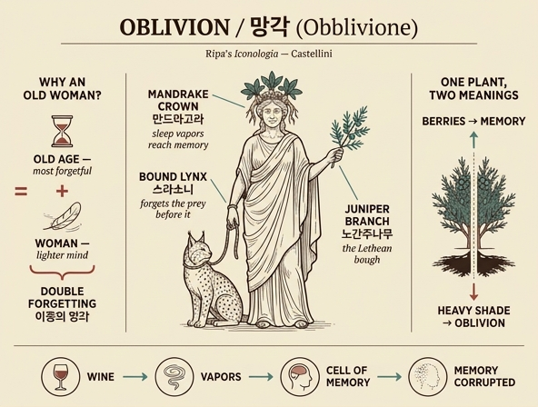

# 망각(Obblivione)의 의인상 — 카스텔리니

## 한눈에 보기

체사레 리파 『이코놀로지아』 4권의 **OBBLIVIONE(망각)** 항목은 리파 본인이 아니라 **조반니 자라티노 카스텔리니**(Giovanni Zaratino Castellini, 원문 표제 `Di Ciò: Zaratino Castellini`)가 집필했다. 원문의 도상 규정은 단 세 줄이다.

> *DOnna vecchia incoronata di mandragora. Colla destra tenga legato un Lupo cerviero. Nella sinistra abbia un ramo di ginepro.*
> — 만드라고라로 관을 쓴 **노파**. **오른손**으로는 **스라소니(lupo cerviero)를 묶어** 잡고, **왼손**에는 **노간주나무 가지**를 든다.

| 요소 | 이탈리아어 원어 | 위치 | 상징 근거 |
|---|---|---|---|
| 노파 | Donna vecchia | 인물 전체 | 노년 + 여성이라는 "이중의 망각" |
| 만드라고라 관 | corona di mandragora | 머리 | 증기가 머리(기억의 방)로 올라가 기억을 부패시킴 |
| 묶인 스라소니 | Lupo cerviero (Lince) | 오른손 | 먹이조차 잊는 가장 건망증 심한 동물 |
| 노간주나무 가지 | ramo di ginepro | 왼손 | 시인들의 "레테의 가지(ramo leteo)", 무거운 그늘 |

각 지물이 **머리(관) → 오른손 → 왼손**으로 배치된 것 자체가 답을 외우는 순서가 된다.

---

## 1. 왜 하필 '노파'인가 — 카스텔리니의 자기 해명

카스텔리니는 형상을 제시한 뒤 스스로 이유를 밝힌다.

> *Abbiamo figurata l'Obblivione piuttosto in persona di Donna vecchia, perché tale immagine l'esprime **doppiamente**, come Donna, e come vecchia.*
> — 우리는 망각을 굳이 **노파**의 모습으로 그렸다. 그런 형상이 망각을 **이중으로** 표현하기 때문이다. 즉 '여인'으로서 한 번, '늙음'으로서 또 한 번.

- **늙음 쪽 근거**: "노년이 다른 어떤 나이보다 잘 잊는다는 것은 알려진 사실이다(*La vecchiaia si sa, che è obbliviosa più di ogni altra età*)." 앞서 그는 키케로 시대의 저명한 문법학자 **오르빌리우스 푸필루스**(베네벤토 출신)가 늙어서 기억을 잃은 예를 들었다.
- **여성 쪽 근거**: "여인은 마음이 **덜 굳고 더 가볍기(di mente men salda, e più leggiera)** 때문에 그만큼 더 잘 잊는다." 그러면서 라틴 경구를 인용한다.
  - *Quid levius flamma, fumo? … femina sed levior* — 불꽃보다, 연기보다 가벼운 것은? 여자가 더 가볍다.
  - *Quid levius fumo? fulmen: quid fulmine? ventus; quid vento? mulier: quid muliere? nihil* — 연기보다 가벼운 건 번개, 번개보다는 바람, 바람보다는 여자, 여자보다 가벼운 건 '없음'.
  - **카툴루스**(70번): 여인이 애인에게 하는 말은 "바람과 급류에 써야 한다(*in vento, et rapida scribere oportet aqua*)."
  - **크세나르코스**(아테나이오스 10권 인용): 여인의 맹세는 물이 아니라 **포도주**에 써야 한다 — 포도주야말로 망각을 부추기니까.
  - **플라우투스**(『허풍선이 군인』): 여인은 악행에 대해서는 불멸의 기억을 갖고, 선행은 즉시 잊는다.

> 카드 답의 "노년이 가장 잘 잊는 나이이고 여인은 마음이 덜 굳고 가벼워 더 잘 잊는다"가 바로 이 대목의 압축이다. **17세기 여성 비하 상투구**를 그대로 논거로 쓴 것이므로, 오늘날에는 '당시의 통념을 반영한 도상 논리'로 읽어야 한다.

이 논리에는 복선도 있다. 카스텔리니는 조금 앞에서 "받은 은혜를 쉽게 잊는 세 부류는 **아이(putti)·노인(vecchi)·여인(donne)**"이라는 속담을 소개했고(디오게니아누스 판본은 여기에 '어리석은 자'와 '남의 개'를 더해 다섯), 그중 두 요소를 한 몸에 겹쳐 놓은 것이 바로 이 노파다.

---

## 2. 만드라고라 관 — 머리에 쓰는 이유

- 만드라고라는 **피타고라스가 '안트로포모르포스(사람 모양)'라 불렀다**. 뿌리가 사람 형상을 닮았기 때문이다.
- 테오프라스토스·디오스코리데스·플리니우스·아테나이오스(11권)·이시도루스가 증언하는 **최면성 식물**로, 마시면 **망각·멍함(balordaggine)·잠**을 일으킨다.
- 그래서 직무를 게을리하고 일하다 잠든 사람, 시작한 일을 잊고 팽개친 사람을 두고 "만드라고라를 마셨다"고 한다. 율리아누스가 칼릭세나에게 보낸 서한의 *"num non videtur multum hausisse Mandragoram?"*, 그리고 에라스뮈스 속담집의 *Mandragoram bibit*.
- **왜 손이 아니라 머리(관)인가**가 핵심이다.

> *N'incoronano l'Obblivione, come simbolo appropriato alla testa, perché il suo decotto bevuto manda fumi e vapori di sonnolenza e letargo alla testa, **ove è la cella della memoria**, la quale dall'obblivione vien corrotta.*
> — 그 달인 물을 마시면 졸음과 혼수의 **연기와 증기가 머리로 올라가는데**, 머리야말로 **기억의 방(cella della memoria)**이 있는 곳이고 그 기억이 망각에 의해 부패한다.

카시오도루스 『우정론』의 *"Memoriam enim corrumpit oblivio"*(망각이 기억을 부패시킨다)를 인용해 마무리한다. 중세 뇌실 심리학에서 기억은 뇌 뒤쪽 '방'에 자리한다고 보았으므로, **관을 머리에 씌우는 것 = 증기가 기억의 방을 침범하는 것**을 그대로 시각화한 셈이다.

---

## 3. 오른손의 스라소니 — '묶여 있는' 이유

`Lupo cerviero`는 직역하면 '사슴늑개'지만 원문이 직접 밝히듯 **린체(Lince), 곧 스라소니**다.

> *Il Lupo Cerviero è posto **legato** nella destra dell'Obblivione, perché non ci è animale più di lui obblivioso.*
> — 스라소니를 망각의 오른손에 **묶어** 두는 것은, 그보다 더 건망증이 심한 동물이 없기 때문이다.

- **표범처럼 얼룩덜룩한 가죽**(*ha la pelle di varie macchie, come il Pardo*)을 가졌다.
- 건망증의 증거: **아무리 굶주렸어도 먹다가 고개를 들어 딴 데를 보면 눈앞의 먹이와 사냥감을 잊어버리고** 다른 먹이를 찾아 떠난다. 출처는 **플리니우스 8권 22장**과 **알치아토 엠블럼 66번**.
- 왜 하필 '묶어서' 드는가: 그 자체가 이 동물의 속성에 대한 실용적 주석이다. 풀어 두면 스라소니는 자기가 어디 있었는지조차 잊고 떠나 버릴 것이므로, 의인상이 지물로 붙들어 두려면 끈이 필요하다.
- 보너스 연결고리: 피에리오 발레리아노에 따르면 **망각이 바쿠스에게 봉헌된 이유**도 이 동물 때문이다. 바쿠스의 수레는 포도덩굴로 덮인 채 표범·호랑이·**스라소니**가 번갈아 끄는데(릴리오 지랄디 『신통기』 8권), 이 건망증 짐승이 바쿠스의 표상이었던 것.

---

## 4. 왼손의 노간주나무 가지 — '레테의 가지'

카스텔리니는 여기서 스스로 반론을 제기한다.

> *Il ginepro è di sopra consegnato per corona alla **memoria de' benefizi ricevuti**, come dunque lo poniamo ora in mano all'Obblivione?*
> — 노간주나무는 앞에서 **'받은 은혜의 기억'**의 관으로 이미 배정했는데, 어떻게 지금 망각의 손에 쥐여 주는가?

### 4-1. 상징의 양가성 — 반대되는 두 뜻을 겸할 수 있다

답은 "하나의 상징이 상반된 두 가지를 뜻해도 무방하다"이다. 예시가 줄줄이 나온다.

- **사자**: 관용과 격노, 짐승 같은 힘과 악의, 지상의 권세와 천상의 권세.
- **용**: 악의 ↔ 사려, 오만 ↔ 겸손, 생명·회춘 ↔ 노쇠·죽음·영원.
- **사이프러스**: 죽음과 영속.
- **아몬드**: 청춘과 노년.
- 나아가 한 식물 안에서도 부위별로 효과가 갈린다. **노간주나무 열매는 뇌와 기억에 이롭지만(bacche … conferiscono al cervello, ed alla memoria), 그 그늘은 무겁고 머리에 해롭다(l'ombra è grave, e nociva alla testa).** 곧 **열매 = 기억 / 그늘 = 망각**.

### 4-2. 그래서 이것은 'ramo leteo'다

라틴 시인들이 말하는 **레테의 가지(ramo leteo)** — 어원 **Lethe**가 곧 '망각'이고, 그래서 저승의 망각의 강 이름이 레테다. 근거 텍스트가 층층이 쌓인다.

| 전거 | 내용 |
|---|---|
| **오비디우스** 『변신 이야기』 7권 | 메데이아가 *lethaei gramine suci*를 뿌려 불침번 용을 재움 |
| **발레리우스 플라쿠스** 『아르고나우티카』 8권 | *lethaei quassare silentia rami* — 레테의 가지를 흔듦 |
| **베르길리우스** 『아이네이스』 5권 끝 | 잠의 신이 *ramum Lethaeo rore madentem*(레테의 이슬에 젖은 가지)을 팔리누루스의 관자놀이에 갖다 댐 |
| **아폴로니오스 로디오스** 『아르고나우티카』 4권 | **결정적 전거** — 메데이아가 용을 재울 때 손에 든 것을 *iuniperi recens secto ramo*, 곧 **갓 자른 노간주나무 가지**라고 명시 |

### 4-3. 곁가지: "양귀비가 아니라 노간주나무" 논증

오비디우스의 그 식물이 무엇이냐를 두고 **양귀비(papavero) 설을 카스텔리니는 길게 반박한다.**

1. 『아이네이스』 4권에서 헤스페리데스 정원의 여사제는 황금사과를 지키는 용에게 **꿀에 갠 양귀비를 일상 사료로 매일 준다**(*Spargens humida mella, soporiferumque papaver*). 재우려는 게 아니다.
2. 식물의 효과는 동물마다 다르다(세르비우스). 버들은 사람에겐 쓰나 소·염소에겐 달고, 독당근은 사람에겐 치명적이나 염소는 살찌우며(아일리아누스 2권 25장), 야생올리브는 염소에겐 넥타르지만 사람에겐 극히 쓰다(루크레티우스 6권).
3. **용은 극도로 뜨거운 짐승**이다. 입김으로 공기를 달구고, 차가운 코끼리의 천적이며, 바람을 탐해 부푼 돛을 보면 달려들어 배를 뒤집는다(예레미야 주해의 *traxerunt ventum quasi dracones*). 따라서 **4도의 냉성인 양귀비**와 **차게 하고 적셔 주는 꿀**은 재우는 약이 아니라 **열을 식히는 사료**다. (꿀이 포도주의 증기를 누른다는 플루타르코스 『향연』 2권 7문제, 바로의 『농업론』 등이 곁들여진다.)
4. 결정타: 만약 양귀비만으로 그 잠 없는 용이 잠깐이라도 잠들 수 있었다면, **이아손은 메데이아의 마법 없이도 사과를 훔치거나 용을 죽이거나 묶을 수 있었을 것**이다. 그러니 오비디우스가 말한 '망각의 즙'은 특별한 다른 것, 곧 노간주나무 가지다.

### 4-4. 노간주나무가 용에게 특히 적합한 이유 + 무거운 그늘

- 노간주 열매는 **독을 막고**, 그 씨는 **뱀에 대한 공포로부터 몸을 씻어 준다**. 뱀들은 이 나무를 태우면 두려워한다(플리니우스). 독룡을 상대하기에 안성맞춤.
- 망각 쪽 근거는 **그늘**이다. *l'ombra del ginepro è grave, ed offusca la mente di chi sotto a lei si posa* — 노간주의 그늘은 무거워서 그 아래 눕는 자의 정신을 흐리게 하고, 멍함과 두통을 남긴다.
  - **루크레티우스** 6권: 어떤 나무들은 무거운 그늘을 타고나 그 아래 누우면 자주 두통이 생긴다.
  - **베르길리우스** 『목가』 10편 끝에서 두 번째 행: *iuniperi gravis umbra*.
  - **카스토레 두란테** 『본초서』: *Iuniperi gravis umbra tamen, capitique molesta est.*

---

## 5. 배경: 고대에 선례가 없는 알레고리

이 항목이 유난히 장황한 이유가 있다. 카스텔리니 스스로 **고대에 망각을 어떻게 형상화했는지 전하는 저자를 하나도 찾지 못했다**고 고백하기 때문이다(*come sia figurata dagli Antichi l'Obblivione, non abbiamo appresso niuno Autore fin qui trovato*). 그러니 도상 하나하나를 문헌으로 정당화해야 했다.

그가 모은 고대의 흔적들:

- 에우세비우스 『복음의 준비』 3권: 망각은 **레토(Latona)**로 표상되었다.
- 플루타르코스 『향연』 9권 6문제: 미네르바에게 패한 넵투누스가 담담히 승복해 여신과 신전을 공유했고, 그 안에 **'망각의 제단'**이 봉헌되었다.
- 계보 논쟁: **히기누스** — 아이테르와 대지의 딸 / **헤시오도스** 『신통기』 — 불화(Contenzione)의 딸 / **플루타르코스** 『향연』 7권 5문제 — **바쿠스가 망각의 아버지**. 다만 더 오래된 견해는 반대로 **망각이 바쿠스의 어머니**라고 보았다.
- 바쿠스에게는 **망각과 채찍(sferza)**이 함께 봉헌되었다. 술김에 저지른 잘못은 기억하지도 따지지도 말라는 뜻, 혹은 가벼운 벌로 다스리라는 뜻. 에우세비우스 2권 2장은 실용적 유래를 전한다 — 물 타지 않은 포도주를 마신 사람들이 광란해 **몽둥이로 서로를 때려 자주 죽었기에**, 바쿠스가 몽둥이 대신 채찍을 쓰라고 설득했다는 것.
- **카스텔리니의 뒤집기**: 그는 오히려 이렇게 읽고 싶어 한다. 바쿠스에게 바쳐진 채찍과 망각은 "**포도주가 정직과 절제의 망각을 낳는다**"는 뜻이며, 그러므로 정직을 잊고 무절제하게 취기에 빠지는 자야말로 큰 벌을 받아 마땅하다. **만취야말로 망각의 어머니이자 바쿠스의 딸**이다.

---

## 6. 원문이 분류한 '망각의 원인' (지물 이해의 배경)

노파 형상은 이 목록의 마지막 항목(노년)에서 나왔다.

| 원인 | 사례 |
|---|---|
| **천성** | 헤로데스 아티쿠스의 아들은 알파벳을 못 외웠고, 코로이보스·마르기테스·멜리티데스는 다섯까지밖에 셀 줄 몰랐다 |
| **사고(공포·낙상·부상·머리 타격)** | 돌에 맞은 아테네 문인은 **글자에 대한 기억만** 잃고 나머지는 다 기억했다 (발레리우스 막시무스 1권 8장, 플리니우스 7권 34장) |
| **질병** | 로마인 **메살라 코르비누스**는 자기 이름을 잊었다. 펠로폰네소스 전쟁 초 아테네 역병 생존자 다수는 친척도 자기 자신도 기억하지 못했다 |
| **노년** | 문법학자 **오르빌리우스 푸필루스**가 늙어 기억을 잃었다 → **노파 형상의 직접 근거** |
| **원인 불명(건강한데도)** | 소피스트 **헤르모게네스**는 24세에 이유 없이 기억을 잃었고, **카라칼라**는 철학 지식을 통째로 잃었으며, **알베르투스 마그누스**는 강단에서 갑자기 망각에 눌려 *"Non audietis amplius Albertum disserentem"*(더는 알베르투스의 강론을 듣지 못하리라)고 말했다 |
| **시간** | 카시오도루스 『잡문집』 5권 22장. 시간은 기쁨도 괴로움도 모욕도 약속도 사랑도 잊게 하고, 만나거나 편지하지 않으면 우정도 망각으로 간다(아리스토텔레스) |
| **자발적 망각** | 보이오티아 트로포니오스 신탁의 숲에는 **기억을 주는 샘**과 **망각을 주는 샘**이 있는데, 출세한 자들은 낮은 자리에 있는 옛 친구를 알아보지 않으려고 굳이 망각의 물을 마신다. 카스텔리니는 이 **자발적 망각을 최악**으로 꼽는다 — "듣지 않으려는 자보다 더한 귀머거리가 없듯, 기억하지 않으려는 자보다 더한 건망증 환자는 없다" |

---

## 7. 암기용 정리

- **위치로 외우기**: 머리 = 만드라고라(잠기운이 기억의 방으로 올라감) / 오른손 = 묶인 스라소니(먹이를 잊는 짐승) / 왼손 = 노간주 가지(레테의 가지).
- **왜 노파?** "이중으로 표현(*doppiamente*)" — **늙어서** 한 번, **여인이라서** 또 한 번. 여인 쪽 이유는 "마음이 **덜 굳고 더 가볍다**".
- **함정**: 노간주나무는 『이코놀로지아』에서 **'기억'의 관**이기도 하다. 열매 = 기억, **그늘 = 망각**으로 갈린다는 점이 이 항목의 논리적 하이라이트.
- **저자 주의**: 이 항목은 리파가 아니라 **카스텔리니**. 바로 다음 항목인 '사랑의 망각(Obblivione di Amore)'이 리파의 것이다.

### 참고

- 원문: `.fm/assets/11 Oblivion to Omnipotence of God.md` 1~111행 (체사레 리파 『이코놀로지아』 토모 4, 페루자판, 248~254쪽)
- 해당 항목에는 판화 도판이 딸려 있지 않다. 같은 지면의 이미지는 장식 컷(오너먼트)뿐이어서 본 힌트에는 싣지 않았다.

## 인포그래픽

