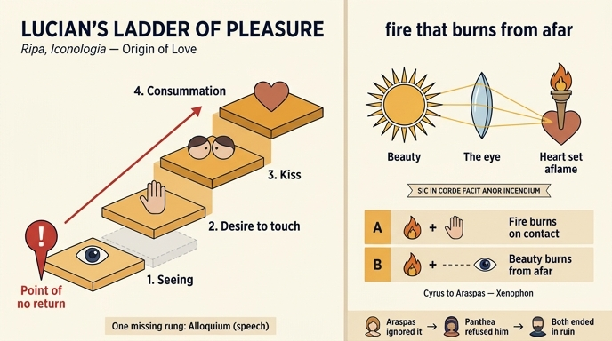

# 루키아노스의 '쾌락의 사다리' 경고

## 질문과 답의 위치

이 카드는 체사레 리파(Cesare Ripa) 『이코놀로지아』 18세기 페루자판 제4권 「ORIGINE DI AMORE(사랑의 기원)」 절 후반부에서 나온다. 이 절의 집필자는 리파 본인이 아니라 **조반니 자라티노 카스텔리니(Giovanni Zaratino Castellini)** 이며, 원문(`12 Honor to Origin of Love.md`)의 해당 대목은 다음과 같다.

> Pericoloso è il proposto fine dell' Amor Platonico, qual' è di fruir la bellezza coll' occhio, attesocchè Amore ha composto insieme li gradi del piacere **[secondo Luciano]**. … Il primo scalino si è il vedere, e rimirare la cosa amata, dopo questo il desiderio di toccare quel che si vede, il terzo il bacio, il quarto l' atto Venereo; posto che s' è il piede nel primo scalino del vedere, difficil cosa è ritenersi di non salire al tatto, e passare all' ultimo, poiché dal vedere si commuovono gli affetti.

(플라톤적 사랑이 내세우는 목표 — 눈으로 아름다움을 향유한다 — 는 **위험하다**. 왜냐하면 사랑은 쾌락의 계단들을 하나로 엮어 놓았기 때문이다. 첫 계단은 사랑하는 대상을 보고 바라보는 것, 그다음은 본 것을 만지고 싶은 욕망, 셋째는 입맞춤, 넷째는 정사다. 보는 첫 계단에 발을 들여놓으면 촉각으로 오르지 않고 버티기가 어렵고 결국 마지막까지 가게 된다. 보는 것에서 감정이 동요되기 때문이다.)

핵심은 이 대목이 **논박이 아니라 귀결**이라는 점이다. 「사랑의 기원」 절 전체는 "사랑은 눈에서 생긴다"를 논증하는 데 바쳐졌고, 이 카드는 그 논증의 실천적 결론 — *그러므로 보지 마라* — 이다.

## 1. 루키아노스의 어느 작품인가: 『사랑들(Ἔρωτες / Amores·Erotes)』 53절

리파 본문이 인용한 라틴어는 다음과 같다.

> Neque enim satis est aspicere eum, quem amas, neque ex adverso sedentem, atque loquentem audire: sed **perinde atque scalis quibusdam voluptatis compactis, Amor primum gradum visus habet**, ut aspiciat videlicet amatum. Deinde ubi aspexerit, cupit adductum ad se propius etiam contingere.

("사랑하는 이를 바라보는 것만으로도, 마주 앉아 그가 말하는 것을 듣는 것만으로도 충분하지 않다. 사랑은 마치 여러 단으로 짜맞춘 쾌락의 사다리처럼, 첫 단으로 **시각**을 가진다 — 즉 사랑받는 이를 바라보는 것이다. 그런 다음 일단 바라보고 나면, 그를 자기 쪽으로 끌어당겨 만지기를 욕망한다.")

- 출처는 루키아노스 전집에 전해지는 대화편 **『사랑들』(그리스어 Ἔρωτες, 라틴어 제목 *Amores*, 영역 관례로 "Affairs of the Heart")의 53절**이다. 말하는 사람은 **테옴네스토스(Theomnestus)** 로, 앞서 리키노스(Lycinus)가 내린 "소년애 쪽이 철학적으로 우월하다"는 판정을 비꼬면서 "말로만 정신적 사랑이라 하지만 실제로는 몸으로 내려가지 않느냐"라고 폭로하는 자리다. 즉 원문에서 이 사다리는 **금욕을 자칭하는 플라톤적 연애의 위선을 폭로하는 카드**로 쓰였다.
- 대화편 구성: 리키노스와 테옴네스토스의 틀 대화 안에, **카리클레스(Charicles, 여성애 옹호)** 와 **칼리크라티다스(Callicratidas, 소년애 옹호)** 의 논쟁이 들어 있다. 프락시텔레스의 **크니도스의 아프로디테** 상 묘사로도 유명한 작품이다.
- **위작 논란**: 1907년 로베르트 블로흐(Robert Bloch)가 문체를 근거로 루키아노스 저작권을 처음 의심한 이래 오랫동안 **위(僞)루키아노스(Pseudo-Lucian)** 작으로 분류돼 왔고, 성립 연대는 2~4세기 사이로 넓게 잡힌다. 다만 최근에는 진작 옹호론도 있다(주디스 모스먼: "모방자가 썼다면 그 문학적 기법들이 지나칠 정도로 루키아노스적이다"; 제임스 조프: 저작권 부정 근거였던 어휘가 실은 진작에도 나온다). 푸코가 1984년 『성의 역사』에서 이 텍스트를 다룬 뒤 학문적 위상이 크게 올라갔다.
- **카스텔리니가 그냥 "secondo Luciano"라고 쓴 것은 시대적으로 당연하다.** 르네상스·바로크 시기 인쇄본 루키아노스 전집(및 그 라틴어 번역)은 『사랑들』을 아무 유보 없이 루키아노스 진작으로 실었다. 위작 논의는 20세기의 산물이므로, 이 카드의 "루키아노스"는 **오늘날 기준으로는 '위루키아노스'로 고쳐 읽어야 하는 인용**이다.

## 2. 4단계 목록과 중세 '사랑의 단계(gradus amoris)' 전통

리파 본문의 4단은 아래처럼 정리된다.

| 리파(카스텔리니) 4단 | 이탈리아어 원문 | 라틴 전통 용어 |
|---|---|---|
| 1 보는 것 | il vedere, e rimirare | **visus** |
| 2 만지고 싶은 욕망 | il desiderio di toccare | **tactus** |
| 3 입맞춤 | il bacio | **osculum** |
| 4 정사 | l' atto Venereo | **factum** (concubitus) |

한편 라틴 애가(elegy) 이론과 중세 수사학·연애문학에서 표준으로 굳은 계보는 **5단**이다.

> **visus – alloquium – tactus – osculum – factum**
> (봄 — 말 붙임 — 만짐 — 입맞춤 — 행위)

이 5단은 흔히 *quinque lineae amoris*(사랑의 다섯 선)로도 불리며, 단의 수와 순서는 저자마다 흔들린다(예: 방돔의 마태우스는 6단, 안드레아스 카펠라누스는 4단; tactus와 osculum의 순서도 판본에 따라 뒤바뀐다).

**검증 결과: 리파의 4단은 5단 전통에서 `alloquium`(말 붙임·대화)이 빠진 형태다.** 그리고 이 누락은 우연이 아니라 인용된 루키아노스 원문 자체의 논리에서 나온다.

- 인용문 앞머리 "neque ex adverso sedentem, atque **loquentem audire**"(마주 앉아 말하는 것을 듣는 것)가 바로 `alloquium`에 해당하는데, 원문은 이것을 **하나의 계단으로 세지 않고 "그것만으로는 충분하지 않다"고 부정하는 방식으로** 언급한다. 즉 alloquium은 사다리의 단이 아니라 *사다리를 오르게 만드는 불충분함*으로 처리된다.
- 결과적으로 카스텔리니의 목록은 **오직 시각→촉각 계열의 신체적 상승만 남긴 4단**이 된다. 이는 이 절의 논지("사랑의 기원은 귀가 아니라 눈")와 정확히 맞물린다. 절 앞부분에서 카스텔리니는 "귀로도 사랑이 생기는가"를 길게 다룬 뒤(보카치오의 노벨레, 페트라르카, 아테나이오스의 자리아드레스·오다테, 조프레 뤼델과 트리폴리 백작부인), **귀는 사랑의 `occasione`(계기)일 뿐 `cagione`(원인)이 아니다** — 들은 아름다움도 상상 속에서 '보이는 상'이 되어야 사랑이 되고, 실제로 눈으로 확인되지 않으면 뿌리내리지 않는다 — 고 결론짓는다. 사다리에서 alloquium이 빠진 것은 이 결론의 도식적 반영이다.
- 또 하나 주의점: 계단의 두 번째 단이 '만짐(tactus)'이 아니라 **"만지고 싶은 욕망(il desiderio di toccare)"** 이라는 것. 루키아노스 원문의 "cupit … contingere"(만지기를 욕망한다)를 그대로 옮긴 결과다. 사다리의 두 번째 단은 이미 행위가 아니라 **욕망 자체**이며, 그래서 "첫 계단에 발을 들이면 버티기 어렵다"는 경고가 성립한다. 두 번째 단으로 오르는 데는 상대의 동의도, 기회도, 심지어 아무 행동도 필요하지 않다. 보는 것만으로 충분하다.

## 3. 소크라테스와 테오도테: 플라톤주의자의 자백

카스텔리니는 사다리 논증 직후, 플라톤 진영의 대표 격인 소크라테스조차 이를 부정할 수 없었다고 못 박는다. 근거는 **크세노폰 『소크라테스 회상록(Memorabilia)』 3권 11장**(원문은 "il terzo libro dei fatti e detti di Socrate"로 지칭), 아름다운 헤타이라 **테오도테**를 찾아간 장면이다.

> Nos amem, & ea quae vidimus tangere cupimus, & abibimus amore dolentes & absentes desiderabimus, e quibus omnibus fiet, ut nos quidem serviamus, huic vero serviatur.

("우리는 사랑에 빠지고, 본 것을 만지고 싶어 하고, 사랑에 아파하며 떠나고, 떠난 뒤에도 그리워할 것이다. 그 모든 결과로 **우리는 종이 되고 그녀는 섬김을 받게 된다**.")

즉 소크라테스 본인이 (1) 봄에서 만짐으로 가는 욕망의 이행과 (2) 그로 인한 **amore servitus**(사랑의 예속)를 인정한 셈 — 카스텔리니의 논증에서는 상대 진영의 자기 인용(argumentum ad hominem)으로 기능한다.

## 4. 크세노폰 『키루스의 교육』: 아라스페스와 판테이아

카드 후반의 삽화는 **크세노폰 『키루스의 교육(Cyropaedia)』 5권 1장**이다.

**설정.** 아시리아 군에서 사로잡힌 수사의 부인 **판테이아(Panthea)** — 남편은 수사 왕 **아브라다타스(Abradatas)**, 당시 사절로 출타 중 — 는 아시아 최고 미인으로 소개된다. 키루스는 그를 직접 보러 가지 않고, 어릴 적부터의 벗 **아라스페스(Araspas)** 에게 보호·감시를 맡긴다.

**아라스페스의 주장.** 사랑은 **자발적(voluntary)** 이라는 것. 그러니 아름다운 여인을 보고 곁에서 시중을 들어도 정념에 굴복하지 않을 수 있으며, 자기는 "보는 첫 계단"에서 멈출 수 있다고 자신했다.

**키루스의 반박(5.1.16).** 그것은 위험하다며 유명한 불의 비유를 든다.

> "손을 불에 넣어도 즉시 타지는 않고, 장작도 곧바로 불붙지는 않는다. 그러나 나는 불을 만지지도 않고, 아름다운 것을 바라보지도 않으려 한다. 그리고 아라스페스, 자네에게도 아름다운 대상에 눈을 두지 말라고 권하겠다. **불은 그것을 만지는 자를 태우지만, 아름다운 이들은 멀리서 바라보는 자들까지 불붙여 사랑 때문에 타 버리게 하기 때문이다.**"

리파 본문의 라틴 인용(Non pulchros intueor … quod ignis quidem urit homines tangentes, ac formosi eos etiam accendant, qui se procul spectant, ut propter amorem exurant)이 바로 이 대목이다. 논리 구조를 보면, 이것은 사다리 논증의 **강화판**이다. 사다리는 "첫 계단에서 멈추기 어렵다"고 말하지만, 키루스는 "첫 계단 자체가 이미 화상(火傷)이다"라고 말한다. 물리적 불보다 아름다움이 **더** 위험한 이유는 **접촉 없이 거리를 건너 작용**하기 때문이다.

**결말(6권 1장).** 아라스페스는 충고를 듣지 않았다. 조금씩 판테이아를 향한 불길이 커져 결국 구애했고, 거절당한 뒤 협박까지 했다. 판테이아가 키루스에게 알리자, 키루스는 **아르타바조스(Artabazus)** 를 보내 아라스페스를 질책했고, 아라스페스는 눈물과 수치로 무너져 키루스 앞에 나서기를 두려워했다. 리파 본문의 "dal dolor piangeva, e dalla vergogna si confondeva, e temeva l'aspetto del suo Re"가 이 장면이다.

크세노폰의 이야기는 여기서 더 나아가 아이러니한 결말을 붙인다.
- 키루스는 아라스페스를 처벌하지 않고 오히려 감쌌다("신들조차 사랑에 지는 법"). 그리고 그 **수치 자체를 이용해** 아라스페스를 '망명자'로 위장시켜 적진에 첩자로 보낸다.
- 판테이아는 아라스페스가 떠난 뒤 키루스에게 "훨씬 더 충실한 벗을 데려오겠다"며 남편 아브라다타스를 불렀고, 아브라다타스는 기병 약 1천을 이끌고 키루스 편에 합류했다.
- 아브라다타스는 이후 전투에서 전사하고, 판테이아는 남편의 시신 앞에서 스스로 목숨을 끊는다(환관들도 뒤따른다). 즉 **"보는 것에서 멈출 수 있다"는 자신감이 촉발한 연쇄는 등장인물 전원의 파국으로 끝난다.** 카스텔리니가 이 삽화를 고른 이유가 여기 있다 — 사다리 경고에 대한 최적의 예시담이다.

이어서 본문은 같은 패턴의 사례를 줄줄이 쌓는다: 헤로도토스가 전하는 **아민타스 궁의 페르시아 사절 7인**(마케도니아 여인들을 "보게 해 달라" 청하고 → 앉혀 달라 하고 → 손을 뻗다가 → 알렉산드로스가 여장 자객으로 몰살), 그리고 성경의 사례들 — **하와**(vidit mulier quod bonum esset lignum … pulchrum oculis), **노아 홍수 전의 "하느님의 아들들"**(videntes filii Dei filias hominum quod essent pulchrae), **삼손**(placuit oculis meis → 들릴라 → 눈을 뽑히다), **다윗**(vidit mulierem se lavantem), **솔로몬**. 결론: "눈은 정의를 부패시키고 힘을 굴복시키고 지혜를 흐린다."

## 5. 처방: 리파가 제시하는 대응책

이 절이 실천 매뉴얼임을 보여주는 대구들이 본문에 있다.

- `Averte oculos tuos ne videant vanitatem` (시편 119:37) — "네 눈을 돌려 헛된 것을 보지 않게 하라."
- 유명한 유희적 육행시: **`Quid facies, facies Veneris si veneris ante? / Ne sedeas, sed eas, ne pereas per eas.`** — "베누스의 얼굴 앞에 가면 무슨 얼굴을 하려는가? 앉지 말고 가라, 그 얼굴들 때문에 멸망하지 않도록." 즉 **앉아서 바라보지 말고(non sedere) 시선을 피해 떠나라(fuggir via dalla sua vista)**.
- 오비디우스 『사랑의 치료(Remedia Amoris)』 인용 — 다 꺼진 재도 유황을 대면 되살아나므로, 사랑을 다시 불러올 만한 것은 무엇이든 피하라.
- 마지막 자연학적 비유로 **카라드리오스(caradrio) 새**: 황달 든 이의 눈을 마주 보면 그 병을 자기가 받아 가므로 눈을 감고 돌아선다. "우리도 두 개의 뜨거운 빛과 마주칠 때 눈을 감아야 한다."

## 6. 도판이 이 논증과 맞물리는 지점


카스텔리니가 「사랑의 기원」에 배정한 도상 지침은 다음과 같다.

> "투명하고 둥글며 두껍고 부피 있는 거울(specchio trasparente rotondo, grosso e corpulento)을 태양의 눈(occhio del Sole)을 향해 든 여인. 태양 광선이 그 거울을 통과하며 왼손에 든 횃불(facella)에 불을 붙인다. 거울 손잡이에 리본이 걸려 있고 거기에 이 모토가 적혀 있다: **SIC IN CORDE FACIT AMOR INCENDIUM**."

판화에서 확인되는 요소와 그 의미:

| 관찰 요소 | 의미 | 이 카드와의 연결 |
|---|---|---|
| 오른손의 두껍고 둥근 **투명 거울** | 실은 **볼록 렌즈/화경(火鏡)**. 카스텔리니는 오롱스 피네(Oronce Finé)의 *De speculis ustoriis*를 근거로 든다 | 눈 = "자연의 거울(specchi della natura)". 렌즈가 '기술의 눈(occhio dell'arte)'인 것과 대응 |
| 우상단의 **광선 뻗는 태양** — "태양의 눈" | 사랑받는 대상의 아름다움("un bel Sole", "두 개의 아름다운 눈") | 태양은 **멀리 있다.** 접촉 없이 작용한다 |
| 왼손의 **불붙은 횃불** — 심장 쪽(dal lato manco del cuore) | 심장에 붙은 사랑의 불 | 결과: 마음의 화상 |
| 리본의 **SIC IN CORDE FACIT AMOR INCENDIUM** | "이처럼 사랑은 마음에 화재를 일으킨다." 플라우투스의 `Ita mihi in pectore, atque in corde facit amor incendium`에서 따옴 | 모토 자체가 '유사(similitudine)' 선언 |
| 배경의 **먼 건물과 텅 빈 지평선** | 인물과 태양 사이의 거리 | 사이에 아무 매개도 없음 |

**이 도판은 "멀리서 보는 자까지 태운다"는 키루스의 논거를 그대로 시각화한 장치다.** 카스텔리니는 이미지 해설에서 "물질적 불은 재료 곁에 두지 않으면 타지 않지만(quello non arde se non è posto appresso la materia), 눈에서 튀는 사랑의 불은 **멀리서도(ancora da lungi)** 정신과 심장을 불태운다"고 명시하며, 바빌론의 나프타(bitumen)가 떨어져 있어도 불이 옮겨 붙는 예를 든다. 즉

- **화경 도상 = 거리를 건너 불을 붙이는 메커니즘의 도해**. 태양은 손 닿는 곳에 없지만, 렌즈(눈)가 그 광선을 모아 심장의 횃불에 옮긴다.
- 따라서 **"불은 만지는 자를 태우지만 아름다운 이는 멀리서 보는 자까지 태운다"는 문장과 이 판화는 같은 명제의 언어판·이미지판**이다. 판화는 위험한 접촉을 그리지 않는다. 그릴 필요가 없다 — 위험한 것은 **시선의 직선(specchio ↔ occhio del Sole)** 하나뿐이며, 그 직선이 이미 불을 만들어 내고 있다.
- 그래서 사다리 경고의 실효적 결론이 "네 번째 계단을 피하라"가 아니라 **"거울을 태양에서 돌려라(rivolger gli occhi altrove)"** 가 된다. 렌즈의 각도만 바꾸면 횃불은 붙지 않는다.

## 7. 구조 요약: 카드가 절 전체에서 차지하는 자리

```
① 사랑의 기원은 어디인가?      → 귀가 아니라 눈 (귀는 occasione, 눈은 cagione)
② 그 메커니즘은?               → 시선의 마주침 = 화경이 태양 광선을 모아 횃불을 켬
                                 (도상: SIC IN CORDE FACIT AMOR INCENDIUM)
③ 그러면 '눈으로만 즐기는'
   플라톤적 사랑은 안전한가?    → 아니다. 사다리(루키아노스): 봄 → 만지고 싶은 욕망 → 입맞춤 → 정사
④ 증인 1: 플라톤 진영 내부      → 소크라테스와 테오도테 (봄→만짐, 그리고 예속)
⑤ 증인 2: 실패 사례            → 아라스페스와 판테이아 (키루스의 불 비유, 그리고 파국)
⑥ 증인 3: 대량 축적            → 페르시아 사절들 / 하와 · 삼손 · 다윗 · 솔로몬
⑦ 처방                         → Ne sedeas, sed eas / Averte oculos tuos / 카라드리오스 새처럼 눈을 감아라
```

카드의 질문 "루키아노스의 '쾌락의 사다리' 경고는?"은 ③이고, 답에 함께 담긴 키루스·아라스페스는 ⑤다. 두 항목이 한 카드에 묶인 이유는 **③이 명제이고 ⑤가 그 명제의 사례이기 때문**이며, 둘을 잇는 고리는 "**첫 계단(시각)의 위험성**"이라는 단 하나의 논점이다.

## 인포그래픽



## 참고

- [Amores (Lucian) — Wikipedia](https://en.wikipedia.org/wiki/Amores_(Lucian))
- [Lucian, Amores (영역 전문)](https://people.well.com/user/aquarius/lucian-amores.htm)
- [Authenticity of the Lucianic 'Amores' — James Jope](https://jjope.blogspot.com/p/authenticity.html)
- [Xenophon, Cyropaedia 5.1 (Perseus)](https://www.perseus.tufts.edu/hopper/text?doc=Xen.+Cyrop.+5.1&lang=original)
- [Xenophon, Cyropaedia 6.1 (Perseus)](http://www.perseus.tufts.edu/hopper/text?doc=Xen.+Cyrop.+6.1&lang=original)
- [Xenophon, Memorabilia 3.11 (Perseus)](https://www.perseus.tufts.edu/hopper/text?doc=Perseus:text:1999.01.0208:book%3D3:chapter%3D11)
- [The Stages of Love in Dirc Potter's Der minnen loep — Leiden Arts in Society Blog](https://www.leidenartsinsocietyblog.nl/articles/the-privacy-of-the-bedchamber-the-stages-of-love-in-dirc-potters-der-minnen)
- [Gradus Amoris: The Five Steps of Lechery — UTSA Chaucer](https://chaucer.lib.utsa.edu/omeka/items/show/270506)
