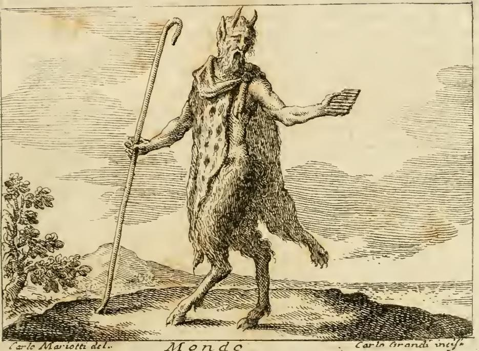

# 세상(Mondo) — 「우리의 세 원수 중 하나로서」

> **Q.** 리치가 그린 '우리의 세 원수 중 하나로서의 세상(Mondo)'의 도상은?
>
> **A.** 음부만 가린 나체의 남자가 등 뒤에 공(球) 하나를 두고, 앞에는 머리 셋 달린 무시무시한 짐승을 데리고, 순탄하고 아름다워 보이지만 끝에 위험이 도사린 길을 걸으며 손에 독이 든 그릇을 들었다.

---

## 1. 출처 원문

원문은 `07 The World and the Continents to Death.md`의 **`MONDO, Come uno de' tre nostri nemici`**(세상, 우리의 세 원수 중 하나로서) 항목이다. 표제 바로 아래에 저자가 명기되어 있다.

> **Del P. Fra Vincenzio Ricci M. O.**
> (관측 소형제회 수사 빈첸치오 리치 신부의 것)

도상 규정(descrizione) 본문은 단 두 문장이다.

> *Uomo ignudo, ma coperto nelle parti pudende. Di dietro tiene una palla. Avanti tiene una bestia formidabile con tre capi, che cammina per strada agevole, e bella, ma nel fine ritrova il periglio, avendo un vaso di veleno in mano.*
>
> — 나체의 남자, 다만 음부는 가렸다. **등 뒤에는 공 하나**를 둔다. **앞에는 머리 셋 달린 무시무시한 짐승**을 두고, **순탄하고 아름다운 길**을 걸어가나 그 끝에서는 위험을 만난다. **손에는 독이 든 그릇**을 들었다.

카드의 정답은 이 두 문장을 그대로 옮긴 것이다. 요소가 정확히 다섯 개(나체 / 등 뒤의 공 / 삼두 짐승 / 아름다운 길 / 독 그릇)라는 점을 세어서 외우면 재생이 쉽다.

**리치(Vincenzio Ricci)**는 리파 자신이 아니라, 18세기 이탈리아 증보판(페루자판 계열) 『이코놀로지아』에 대량으로 삽입된 설교조 도상들의 원저자다. 이 책에서 `Figurò il P. Ricci ...` / `Descrive il P. Ricci ...`로 시작하는 항목들(예: 같은 파일의 '험담 Mormorazione', '죽음 Morte')이 모두 그의 것이다. 리파 본래의 항목이 고전 문헌·고대 화폐·상형문자 전거를 늘어놓는 인문주의적 성격이라면, **리치의 항목은 성서 인용으로 조밀하게 짜인 바로크 설교문**에 가깝다. 이 카드의 항목도 본문 전체가 성구 주석으로 채워져 있다.

## 2. 요소별 의미 — 리치 자신의 해설

원문은 도상 규정 뒤에 각 지물의 뜻을 하나씩 풀어준다(`Alla Scrittura sagra` 절이 대응 성구를 붙인다).

| 도상 요소 | 리치의 해설 | 근거 성구 |
|---|---|---|
| **나체(음부만 가림)** | 세상은 거짓되고 꾸며낸 것을 내보이므로 **모든 좋은 것과 모든 덕이 벗겨진 상태**로 그린다. 덕의 저자이신 성령을 받아들일 수 없는 자이기 때문이다. | 1요한 2:15 *Nolite diligere mundum*; 요한 14:17 *quem mundus non potest accipere*; 미카 1:8 *vadam spoliatus et nudus* |
| **등 뒤의 둥근 공** | **무한하신 하느님의 상징.** 곧 "세상의 가장 큰 원수". 세상은 그분을 미워했고 알아보지도 못했다. | 요한 7:7 *me autem odit*; 요한 1:10 *mundus eum non cognovit*; 야고보 4:4 *amicitia huius mundi inimicitia est Dei*; 갈라 1:10 |
| **머리 셋 달린 짐승** | 짐승 자체는 세상의 **극심한 사악함(iniquità)** — 세상은 통째로 악에 놓여 있다. **세 머리는 세상에 만연한 세 가지 주요 악덕**: ① **교만(superbia)** — 죄의 기원, ② **탐욕(cupidigia)** — 덕의 독, ③ **육욕(carnalità)** — 모든 성덕을 갉아먹는 좀벌레. | 1요한 5:19 *mundus totus in maligno positus est*; **1요한 2:16** *concupiscentia carnis, concupiscentia oculorum, superbia vitae* |
| **아름다운 길** | 세상의 오솔길은 **첫인상만 아름답고** 누구나 기꺼이 그리로 걷지만, **끝에 가서는 험하고 흉하며 죽음으로 이끈다.** | **잠언 14:12** *Est via quae videtur homini iusta, novissima autem eius deducunt ad mortem* |
| **손에 든 그릇** | 본문 해설은 이것을 **"금 그릇이나 독으로 가득 찬 것(vaso di oro, ma pieno di veleno)"**이라 명시한다. 세상은 만족·쾌락·영달을 약속하는 모습으로 그릇을 내밀지만, 그 겉모습 아래로 **모두에게 죽이는 독**을 먹인다. 사람들은 그가 내미는 지위를 얻으려 천 가지 사기와 오류를 저지르다 결국 독에 중독되어 영원한 죽음의 먹이가 된다. | 애가 2:4 *Occidit omne quod pulchrum erat* |

### 반드시 짚어야 할 두 가지 함정

**(1) 세 머리 = '세 원수'가 아니다.**
표제는 "세 원수 중 **하나**로서의 세상"이다. 즉 **세상 자신이 셋 중 하나**다. 그런데 그가 끌고 다니는 짐승의 머리 셋은 **다른 두 원수(육신·악마)가 아니라, 세상 안에 만연한 세 악덕(교만·탐욕·육욕)**이다. 3이라는 숫자가 두 번 나오지만 가리키는 대상이 다르다.

**(2) 공(palla)은 '지구본'이 아니다.**
직관적으로는 세상을 인격화한 인물이 든 구체를 '세계·지구'로 읽고 싶어진다. 그러나 리치는 명시적으로 **"둥근 공은 무한하신 하느님의 상징(La palla rotonda è simbolo dell'infinito Iddio)"**이라 못 박는다. 원(圓)이 시작도 끝도 없는 무한을 뜻하는 전통적 독법이다. 그래서 위치가 **등 뒤(di dietro)**인 것이 결정적이다 — **세상은 하느님을 등지고 서서, 앞으로는 삼두의 악덕을 앞세워 걸어간다.** 앞뒤 배치 자체가 하나의 문장이다.

## 3. 배경 — '영혼의 세 원수'

라틴 서방 전통에서 그리스도인의 세 원수는 **mundus, caro, diabolus(세상·육신·악마)**다. 세례 서약의 포기(abrenuntiatio) 문구, 중세·근세 교리서와 설교, 참회 지침서에 굳어진 정형이며, 성 요한 1서 2:15-16이 그 성서적 근거로 늘 인용된다.

리파 원본에는 이 도식이 별도 알레고리로 잘 정리되어 있지 않다. 리치가 **설교용 도상 프로그램**으로 이를 도입하면서 세 원수 각각을 인격화했고, 이 항목은 그중 '세상' 편에 해당한다. 그래서 표제가 "세 원수 중 하나로서의(Come uno de' tre nostri nemici)"라는, 리파답지 않게 설명적인 형태를 띤다.

**세 머리 짐승(케르베로스형)**은 이 계보에서 상투적 조형이다. 지옥문의 케르베로스, 단테 『신곡』 지옥편 제6곡의 삼두견, 세르베루스를 삼중 악덕이나 시간의 세 상(과거·현재·미래)으로 읽는 르네상스 도상 등이 배경에 깔려 있다. 리파 자신도 다른 항목들에서 삼두를 즐겨 쓴다. 여기서는 그것이 **삼중 정욕(concupiscentia carnis / oculorum / superbia vitae)**의 조형적 번역이다.

**넓고 쉬운 길** 모티프는 마태 7:13("멸망으로 이끄는 문은 넓고 그 길은 널찍하여 그리로 들어가는 자가 많다")과 잠언 14:12의 결합이다. 여기에 헤라클레스의 갈림길(비티니아의 프로디코스) 전통이 겹쳐, **쾌락의 길은 처음이 평탄하고 끝이 파멸, 덕의 길은 처음이 험하고 끝이 영광**이라는 근세 미술의 표준 대구를 이룬다. 리치의 표현 `bella ne' primi sembianti ... ma il fine poscia è malagevole`가 정확히 이 정식이다.

**독이 든 금 그릇**은 *voluptas*(쾌락) 도상의 단골이다. 키르케가 오디세우스 일행에게 내미는 잔, 요한 묵시록 17:4의 "가증한 것으로 가득 찬 금잔"을 든 바빌론의 창녀가 직접 조상(祖上)이다. 겉(금)과 속(독)의 불일치 = 세상의 본질이 **기만**이라는 이 항목 전체의 주제를 한 손에 압축한 지물이다.

리치는 이 주제를 본문에서 두 개의 긴 비유로 확장한다. ① **바다**: 세상은 잔잔할수록(번영할수록) 더 많이 삼킨다. ② **사마리아 여인의 우물**(요한 4장): 세상은 대리석 **샘(fonte)**처럼 보이지만 실은 *puteus altus est* — 물 긷기에 죽도록 힘든 **깊고 마른 우물**이고, 물이 있어도 탁하고 악취가 난다. 부·명예·육의 쾌락 모두 마찬가지다. 그리고 시편 72(73):20을 끌어 **인생은 꿈**이며 죽음이라는 깨어남에서 손에 남는 것이 없다고 맺는다.

## 4. 카드 0~3의 '세상'과의 대비 — 같은 낱말, 정반대의 알레고리

이 책에서 `MONDO`는 **연달아 네 개 이상의 항목**으로 나온다. 그런데 그 항목들은 두 계열로 딱 갈린다.

### 계열 A — 우주·자연으로서의 Mondo (카드 0~3)

*판화 하단에 새겨진 표제는 **`Mondo`**다. 그러나 이것은 카드 0~3에 해당하는 앞 항목("보카치오가 『신들의 계보』 제1권에서 그린 대로")의 도판이며, 이 카드의 리치 항목과는 무관하다.*

그림에서 실제로 확인되는 요소를 원문과 맞춰보면:
- **이마의 두 뿔** — 하늘을 향하고 있다. 해와 달, 또는 천체와 그 작용.
- **염소 얼굴에 가슴까지 늘어진 긴 수염** — 원문 `la barba lunga, e pendente verso il petto`.
- **몸을 감싼 반점 있는 짐승 가죽(표범 가죽)** — `una pelle di Pantera, che gli cinge il petto, e le spalle`. 판화에서 어깨에 매듭지어 두른 반점 무늬 가죽이 뚜렷하다.
- **오른손의 목자 지팡이** — 끝이 목장(牧杖)처럼 말려 있다.
- **왼손의 시링크스(7관 피리)** — 판화에서 왼손에 든 빗 모양 물건이 그것이다.
- **허리 아래 온통 털 난 염소의 하반신과 굽** — `Dal mezzo in giù è in forma di Capra peloso, ed ispido`, 곧 나무와 풀로 덮인 거칠고 굳센 **대지**.

즉 여기서 Mondo는 **판(Pan)**이다. 그리스어 πᾶν = '전체'이므로, 고대인은 판의 형상으로 **우주(l'Universo)** 전체를 표현했다는 것이 원문의 논리다. 이어지는 피에리오 발레리아노판 항목은 같은 개념을 다르게 조형한다 — **다색의 긴 옷(4원소와 그로부터 생겨난 것들)을 입고 굳세게 선 남자가 머리 위에 금 구체를 인 모습**, 그리고 이집트인이 세상을 쓸 때 그렸다는 **자기 꼬리를 삼키는 뱀(우로보로스)**.

### 계열 B — 도덕·영성적 위협으로서의 Mondo (이 카드)

리치의 두 항목이 여기 속한다. 이 카드의 '세 원수' 세상, 그리고 바로 뒤에 이어지는 **`MONDO. Dello stesso`**(같은 저자의 것):

> 눈부시게 아름다운 남자가 **금과 보석의 관**을 썼는데 **그 관 아래에는 쑥(assenzio)의 관**이 하나 더 있다. **왕의 자포**를 입었으나 **그 밑에는 거친 고행복(cilicio)**을 입었다. **낫이 달린 개선 수레**를 타고 **급류를 건넌다.**

역시 **겉/속의 불일치**라는 동일한 주제다. 이 항목의 본문이 마침 **Mondo의 네 가지 의미**를 정리해 주는데, 이것이 두 계열을 가르는 가장 명료한 지도다.

| | 리파/리치가 든 Mondo의 네 가지 뜻 | 해당 항목 |
|---|---|---|
| ① | **원형적(archetipo)** 세상 — 하느님의 지성 안에 있는 이데아들 | — |
| ② | **원소적(elementare)** 세상 — 하늘을 포함한 모든 피조물 | 계열 A (판, 피에리오, 우로보로스) |
| ③ | **소우주(microcosmo)** — 큰 세상을 닮게 지어진 인간 | 계열 A |
| ④ | **결함 있는·비뚤어진(difettoso/malagevole)** 세상 — 인간이 모든 피조물을 주님의 뜻에 어긋나게 **오용**하는 상태 | **계열 B ← 이 카드** |

원문 표현 그대로: 하느님은 인간을 위해 빛을 두셨는데 인간은 그것을 죄에 쓰고, 금을 지으셨는데 인간은 고리대와 불법에 쓴다. **이렇게 오용된 세상이 곧 "성령을 받아들일 자격이 없는" 그 세상**이다.

### 두 계열이 공유하는 지물, 정반대의 뜻 — 최고의 시험 포인트

| | 계열 A (우주로서의 세상) | 계열 B (이 카드) |
|---|---|---|
| **구체(palla)의 위치** | 머리 **위**에 이고 있다 | 몸 **뒤**에 둔다 |
| **구체의 재질** | **금** 구체 | 재질 언급 없음(그냥 palla) |
| **구체의 뜻** | **하늘과 그 원운동**, 완벽한 건축가 창조주가 지은 우주의 완전성 | **무한하신 하느님**, 곧 **세상의 최대 원수** |
| **인물의 옷** | 4원소를 뜻하는 **다색의 긴 옷** / 표범 가죽 | **나체** — 모든 덕과 선이 벗겨짐 |
| **성격** | 우주론적·중립적 서술 | 도덕적·논박적 경고 |
| **금(金)의 의미** | **완전성**의 상징 | 그릇의 금 = **독을 감춘 기만의 겉면** |

같은 표제어, 같은 '구체'라는 지물이 한쪽에서는 **경배할 만한 완전성**이 되고 다른 쪽에서는 **등지고 도망치는 원수**가 된다. 리파류 도상집을 읽을 때 표제어만 보고 뜻을 넘겨짚으면 안 되는 이유의 교과서적 사례다.

## 5. 판화에 관한 주의

**이 카드의 도상(리치의 '세 원수 중 하나로서의 세상')에 해당하는 판화는 자료에 없다.** 항목 표제 직전에 놓인 이미지(`_page_174_Picture_7.jpeg`)는 인물 도판이 아니라 페이지 장식용 소형 목판 두침(頭飾, headpiece)이며, 그 앞뒤 페이지의 이미지들 역시 마찬가지이거나 다른 항목(아메리카, 죽음 등)의 도판이다. 리치가 증보한 항목들은 대체로 **삽화 없이 글로만** 실렸다.

따라서 위에 실은 fig-1은 **이 카드의 도상이 아니라, 대조군인 '우주로서의 세상' 항목의 판화**다. 두 알레고리의 낙차를 눈으로 확인하는 용도로만 참고할 것.

## 6. 암기 체크리스트

정답을 재생할 때 다음 5개를 순서대로 꺼내면 된다.

1. **몸** — 나체, 음부만 가림 → 덕이 하나도 없이 벗겨진 상태
2. **뒤** — 공 하나 → 등지고 있는 무한하신 하느님
3. **앞** — 머리 셋 달린 무시무시한 짐승 → 사악함, 세 머리 = 교만·탐욕·육욕
4. **발** — 순탄하고 아름답지만 끝에 위험이 있는 길 → 잠언 14:12 / 마태 7:13
5. **손** — 독이 든 (금) 그릇 → 쾌락과 영달을 약속하며 먹이는 죽음

> 한 문장 요약: **하느님을 등지고, 삼중 악덕을 앞세우고, 쉬운 길을 걸으며, 독배를 권하는 벌거벗은 사내.**
