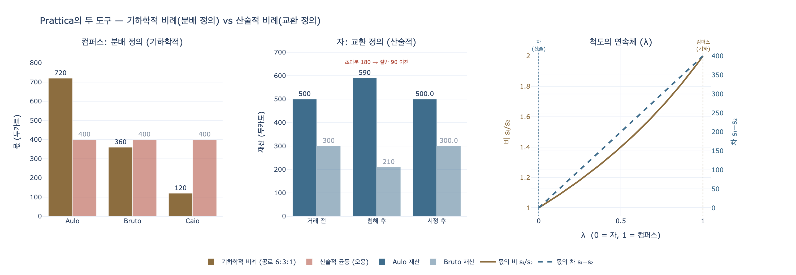

# 실천(Prattica)에 두 개의 도구가 주어지는 이유

## 카드 요약

- **질문**: 실천에 두 개의 도구가 주어지는 이유는?
- **답**: 이론(Teorica)은 그 자체로 완전한 하나이지만, 실천(Prattica)은 **자유(liberale) 실천**과 **기계(mecanica) 실천**의 둘이기 때문이다. 자유 실천은 **컴퍼스(compasso)**로, 기계 실천은 **자(regolo)**로 표시된다. 이 두 도구는 다시 아리스토텔레스의 **분배 정의(기하학적)** / **교환 정의(산술적)**에 대응한다.

---

## 1. 출전: Ripa 『Iconologia』의 PRATTICA 항목

이 항목은 Cesare Ripa 본인이 아니라 **풀비오 마리오텔리(Fulvio Mariottelli)** 가 쓴 글이다(`Del Signor Fulvio Mariottelli`). 자료 파일은 `.fm/assets/17 Practice to Providence.md`의 첫 섹션(`P R A T T I C A`)이다.

핵심 문장은 다음과 같다(원문 OCR 그대로, 4권 399쪽 부근):

> E fi da alla Teorica un folo ftromento, alla Prattica fé ne danno due che fono il compaifo, e il regolo, per moftrare, che la **Teorica è una fola indivifibile, come perfetta in felicità**, la **Prattica è di due forti, liberale, e mecanica**.

번역하면 "**이론에는 도구를 하나만 주고, 실천에는 컴퍼스와 자, 둘을 준다. 이는 이론이 그 완전함 속에서 나뉠 수 없는 하나임에 반해, 실천은 자유 실천과 기계 실천 두 종류임을 보이기 위함이다.**"

즉 **도구의 개수가 곧 그 능력의 내적 구조를 나타내는 도상학적 장치**다. 하나짜리 도구 = 단일·불가분, 두 개짜리 도구 = 이분된 종(種).

---

## 2. 판화에서 실제로 보이는 것

그림에서 관찰되는 요소를 텍스트의 설명과 하나씩 대응시키면:

| 그림에서 보이는 것 | 텍스트의 의미 |
|---|---|
| **노파**(젊은이가 아니라 늙은 여인) | 이론은 젊은이(`Teorica giovane`), 실천은 노파(`Prattica Vecchia`). 실천은 "낡은 관습의 추종자(`feguace dell'ufo invecchiato`)"이므로 노년으로 표현된다 |
| 머리와 손이 **아래(땅)를 향함** | 이론은 머리와 손을 하늘로 들지만, 실천은 땅을 본다. "실천은 발로 밟는 우주의 그 부분만을 낮게 바라본다" |
| **비천한 색(tanè, 황갈색)의 하인 옷** | 실천은 고귀한 인식이 아니라 **타인에게 유용함(utile altrui)** 을 겨냥한다는 표시 |
| **오른손이 짚은 큰 컴퍼스** — 활짝 벌어져 한 다리 끝이 땅에 박혀 있다 | `compasso` = **이성(la ragione)**. 이론에서는 컴퍼스 끝이 하늘을 향하고(보편→개별, 참된 논증적 결론), 실천에서는 끝이 아래를 향한다(개별→보편, 오류 가능한 결론) |
| **왼손이 짚은 곧은 막대(자)** — 컴퍼스의 다른 한 끝이 이 자의 꼭대기에 닿아 있다 | `regolo` = **공적으로 확정된 척도**. 두 도구가 만나 그리스 문자 **Π(파이)** 모양을 이룬다 — 그리스인이 πρᾶξις(prāxis)를 표시하던 머리글자 |
| 두 도구가 **머리와 몸 전체의 무게를 받치고 있음** | "두 손이 컴퍼스와 자라는 두 도구 위에서 머리와 몸의 온 무게를 지탱한다" — 실천 전체가 이 두 축에 얹혀 있다는 뜻 |
| 배경의 **폐허가 된 탑과 성벽** | 땅의 것들은 "변하고 부패하기에(`variandofi, e corrompendofi`) 인간이 어떤 형식으로 안정시켜 줄 필요가 있다" — 그 안정된 형식이 바로 `regolo`(척도) |

기하학 도구 한 쌍이 **Π 자를 그린다**는 것이 이 판화의 시각적 급소다. 도구가 둘인 이유는 단지 "실천이 둘이다"라는 명제 때문만이 아니라, 두 개여야 비로소 실천을 뜻하는 문자를 쓸 수 있기 때문이기도 하다.

---

## 3. 컴퍼스 = 자유 실천 (converfazione e vita civile)

> La liberale fpetta all'ufo intorno alla converfazione, e vita civile, la cui lode nafce dalle virtù dette morali, perchè con l'ufo fi acquiftano, e quefta vien fignificata nel compaifo fermato in terra; il quale **non ha proporzioni terminate**, ma la fua virtù è **l'adattarfi alla quantità delle cofe**; cosi la virtù morale non par che abbia altro termine, che il **coftume, e l'ufo invecchiato, e lodato**.

- **대상**: 교제(conversazione)와 시민 생활(vita civile)
- **칭송의 근거**: 이른바 **도덕적 덕(virtù morali)** — 이 덕은 *실행(uso)* 을 통해 획득된다
- **도상 논리**: 컴퍼스는 **정해진 비례가 없다**. 그 덕은 다리를 벌려 **사물의 양에 스스로 맞추는** 데 있다. 마찬가지로 도덕적 덕에는 고정된 눈금이 없고, 오직 **관습(costume)과 오래되어 칭송받는 습관(uso invecchiato e lodato)** 만이 척도가 된다.

이는 아리스토텔레스 윤리학의 표준 교리와 정확히 일치한다. 도덕적 덕(ἠθικὴ ἀρετή)은 `ethos`(습관)에서 오며, 중용은 "산술적 중간"이 아니라 **행위자와 상황에 상대적인 중간(mesotēs pros hēmas)** 이다. 컴퍼스는 이 "상대적 중간"을 그리기에 완벽한 도구다 — 매번 다리를 다시 벌려야 하니까.

## 4. 자 = 기계 실천 (misure certe e stabilite)

> e la mecanica vien fignificata nel regolo, che ha le fue **mifure certe, e ftabilite dal pubblico confentimento**, quindi è il **vendere, e comprare a mifura ftabilita** nella quantità del denaro, e della roba.

- **대상**: 기술·수공(mecanica), 그리고 그 전형으로서의 **매매(vendere e comprare)**
- **도상 논리**: 자는 **확정된 치수**를 가진다 — 그리고 그 치수는 자연이 아니라 **공적 합의(pubblico consentimento)** 가 정한다. 화폐와 재화의 양이 정해진 척도로 교환되는 것이 그 예다.

바로 앞 단락에서 이 "인간이 정한 척도"를 프로타고라스와 연결한다: 땅의 것들은 변하니 인간이 형식을 부여해 안정시켜야 하고, 그렇게 보편적으로 수용되어 실행되는 형식을 통속적으로 `regolo`(자, 규칙)라 부른다 — "**아마 프로타고라스가 인간을 만물의 척도라 부른 것도 이를 염두에 둔 것이리라**(Protagora, dimandando l'Uomo mifura di tutte le cofe)."

> 참고: `regolo`는 이탈리아어에서 "곧은 자/직선 막대"이면서 어원상 `regola`(규칙)와 같은 뿌리다. **도구로서의 자**와 **규범으로서의 규칙**이 한 단어에 겹쳐 있다는 점이 이 알레고리의 언어유희적 토대다. 화폐 역시 니코마코스 윤리학 V권에서 "관습(nomos)에 의한 척도"로 규정되므로, 자–공적 합의–화폐의 연결은 아리스토텔레스적이다.

---

## 5. 두 도구 → 두 정의: 분배 정의와 교환 정의

텍스트는 마지막에 이 이분법을 **정의론**으로 밀어 올린다:

> E perchè abbiamo detto, che l'ufo della ragione ha per fine l'aftfifter dell'azione, per l'intero della giuftizia, fi potrà dire, che il compaffo, e 'l regolo nella Prattica moftrino l'una, e l'altra giuftizia **diftributiva, e commutativa, Geometrica e Aritmetica**, l'una dimoftrata nel compaffo, **che non ha mifura certa**, l'altra nel regolo.

정리하면:

| | 컴퍼스 (compasso) | 자 (regolo) |
|---|---|---|
| 실천의 종류 | **자유(liberale)** 실천 | **기계(mecanica)** 실천 |
| 영역 | 교제·시민 생활 | 기술·매매 |
| 척도의 성격 | 정해진 치수 없음, 사물에 맞춤 | 확정된 치수, 공적 합의 |
| 덕/근거 | 도덕적 덕, 관습과 익은 습관 | 화폐·수량의 공인 단위 |
| 정의 | **분배 정의 (giustizia distributiva)** | **교환 정의 (giustizia commutativa)** |
| 비례 | **기하학적 (Geometrica)** | **산술적 (Aritmetica)** |

### 아리스토텔레스 『니코마코스 윤리학』 5권

이 구분의 원본은 NE V권 3–4장(1131a–1132b)이다.

**(1) 분배 정의 — 기하학적 비례 (1131a–b)**

공동의 몫(명예·재화·공직)을 여러 사람에게 나눌 때의 정의. 각자의 **가치/공로(ἀξία, axia)** 에 **비례하여** 나눈다. 아리스토텔레스는 이를 "**기하학적 비례**"라 부른다. 네 항의 비례식이기 때문이다:

$$\frac{A}{B} = \frac{a}{b} \quad\Longleftrightarrow\quad \frac{A}{a} = \frac{B}{b}$$

여기서 $A, B$는 사람의 공로, $a, b$는 각자가 받는 몫이다. 몫의 **비(ratio)** 가 보존되므로, 차이(difference)가 아니라 **비율**이 균등화의 단위다. 공로가 2배인 사람은 2배를 받는 것이 "같음(equal)"이다. 아리스토텔레스는 부정의를 "비례의 위반"으로 정의한다.

- 정치체제에 따라 `axia`의 내용이 달라진다: 민주정은 자유민 신분, 귀족정은 덕, 금권정은 재산.
- **컴퍼스와의 대응**: 무엇이 공로인지, 얼마만큼 비례하는지에 **고정된 눈금이 없다**. 공동체의 관습이 그것을 정한다 — 그래서 "정해진 치수가 없는(non ha misura certa)" 컴퍼스다.

**(2) 교환/시정 정의 — 산술적 비례 (1131b–1132b)**

거래(자발적: 매매·대차·임대)와 침해(비자발적: 절도·폭행)의 시정. 여기서는 사람의 가치를 **묻지 않는다**. "훌륭한 사람이 나쁜 사람의 것을 빼앗았는지, 그 반대인지는 아무 차이가 없다. 법은 오직 손해의 크기만 본다."

$$\text{이득}(\text{gain}) - \text{손해}(\text{loss}) \;\to\; 0, \qquad x^{*} = \frac{x_1 + x_2}{2}$$

한쪽이 중간선(the mean)보다 **더 많이** 갖고 다른 쪽이 **더 적게** 가지므로, 재판관은 그 **초과분(차이)의 절반**을 옮겨 산술적 중간으로 되돌린다. 아리스토텔레스의 유명한 선분 비유가 이것이다: 긴 선분에서 초과분의 절반을 떼어 짧은 선분에 붙이면 두 선분이 같아진다.

- 비율이 아니라 **차(difference)** 를 균등화하므로 "**산술적 비례**"다.
- 아리스토텔레스는 재판관(δικαστής)을 "**중간을 잡는 자(διχαστής, 반으로 나누는 자)**"에 연결하는 어원 유희를 쓴다.
- **자와의 대응**: 정해진 단위로 손해와 이득을 재어 정확히 같게 만든다. 그 단위(화폐)는 **공적 합의**로 확정된 것이다.

**(3) 왜 이 대응이 정확한가**

Mariottelli의 배치는 자의적 장식이 아니다.

- 컴퍼스는 **비(ratio)를 옮기는 도구**다 (닮음·비례 작도의 기본 도구). 기하학적 비례 = 분배 정의.
- 자는 **길이를 절대 단위로 재는 도구**다 (같은 길이인가 아닌가, 몇 단위 초과인가). 산술적 균등 = 교환 정의. 그리고 아리스토텔레스의 시정 정의 논증 자체가 **선분의 길이 비교**로 전개된다.

---

## 6. 한 문장 정리

**이론은 완전하기에 불가분의 하나이고 그래서 컴퍼스 하나만 든다. 실천은 자유 실천과 기계 실천으로 갈라지기에 도구가 둘이다** — 상황에 맞춰 벌어지는 **컴퍼스**(관습이 척도인 도덕적 덕, 공로에 비례하는 기하학적 분배 정의)와, 합의로 못 박힌 눈금을 가진 **자**(화폐 단위로 재는 매매, 차이를 반씩 옮겨 균등화하는 산술적 교환 정의). 게다가 이 둘을 겹쳐야 πρᾶξις의 머리글자 **Π**가 완성된다.

---

## 시각화

