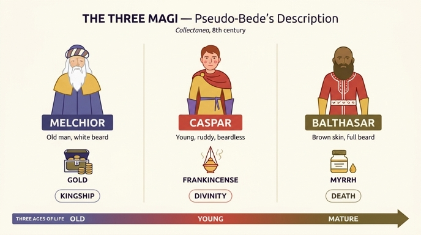

# 베다가 전하는 세 동방박사의 모습

## 이 대목이 놓인 자리

이 서술은 『Iconologia』의 **Negromanzia(강령술)** 항목 안에 들어 있다. 저자는 먼저 "네크로만시아는 마기아(Magia) 중에서도 의식적·악마적인 부분"이라고 정의한 뒤, 마기아라는 말 자체가 원래는 **페르시아 현자(Magi)의 학문**을 뜻하는 무해한 말이었다는 어원 설명으로 넘어간다. 그리고 "복음서에 나오는 마기, 곧 아기 예수를 경배하러 온 이들이 자연 마술과 악마 마술에 능했다는 견해도 있다"는 논점을 계기로, 동방박사에 관한 긴 여담을 삽입한다.

여담의 순서는 이렇다.

1. **그들은 마법사였나?** 라우렌티우스 아 폰테(Lorenzo d'Aponte)는 이방인이었으므로 요술사·악령의 친구였을 가능성이 높다고 보았고, 아우구스티누스의 에피파니아 설교 2("*impietas in sacrilegiis Magorum*")도 그런 뉘앙스로 인용된다.
2. **아니, 현자였다.** 다수의 견해는 이들이 페르시아식 용법의 *Magi* = 현자·박사였다는 쪽이다. 안셀무스는 "*Non malefici, sed sapientes Astrologi fuerunt*"(악한 술사가 아니라 지혜로운 점성가였다), 레오 대교황은 "*Gens, quae spectandorum syderum arte pollebat*", 키프리아누스는 "*arte mathematica ... elementorum naturam, et astrorum ministeria certis experimentis observabant*", 이시도루스 『어원론』 8권 9장도 별의 해석자를 *Magi*라 불렀다고 한다.
3. **왕이었나?** 얀세니우스 등은 부정한다(복음서가 침묵했고, 헤로데가 왕에게 걸맞은 대접을 하지 않았다). 반면 오래된 도상 전통(왕관과 왕복으로 그리는 관행), 에피파니아 성무일도가 시편 71:10 "*Reges Tharsis et insulae munera offerent*"과 이사야 60:3을 적용하는 점을 근거로 저자는 **소왕(Regoli)·토파르케스 정도의 작은 왕**이었다는 절충안을 택한다.
4. **몇 명이었나 → 세 명.** 여기서 문제의 인용이 나온다.

> 원문 저본은 리파 『Iconologia』의 18세기 이탈리아 증보판(체사레 오를란디 편, 페루자 1764–67) 제4권으로 보인다. 본문에 1759년 부아르(Boudard)판을 비판하는 대목과 "TOM. QUARTO" 난외 표제가 함께 나온다. 즉 이 동방박사 서술은 리파 본인의 16세기 원문이 아니라 **18세기 편집자의 주석**이며, 그가 인용한 것이 "베다"다.

## 출전 문제: '베다'는 베다가 아니다

책은 출처를 **"le parole di Beda in collect."**(베다의 『Collectanea』에 있는 말)로 밝힌다. 그런데 이 대목은 존자 베다(Beda Venerabilis, 673–735)의 **진작이 아니다.** 중세 이래 베다의 이름으로 유통된 잡문집 **위(僞)-베다 『Excerptiones Patrum, Collectanea, Flores ex diversis, Quaestiones et Parabolae』**(대략 8~9세기 편집, Migne *PL* 94에 수록)에 실린 유명한 삽화적 항목이다.

- 베다의 확실한 저작 어디에도 동방박사의 **이름·나이·의복 색**을 이렇게 열거한 곳은 없다.
- 그럼에도 "베다"라는 권위 있는 이름이 붙어 있었기 때문에, 중세·근세의 도상 지침서와 설교집이 이 대목을 **사실상 규범**처럼 인용했다. 오를란디도 그 관행을 그대로 따른 것이다.
- 따라서 이 카드의 내용은 "**베다가 전한다고 전해지는**" 서술로 이해해야 하며, 진작성은 부정된다. 이런 종류의 위작 텍스트가 서양 미술의 도상을 실질적으로 규정한 대표 사례다.

### 라틴 원문

위-베다 정본(Migne PL 94 계열)의 형태:

> Magi sunt, qui munera Domino dederunt: **primus fuisse dicitur Melchior, senex et canus, barba prolixa et capillis**, tunica hyacinthina, sagoque mileno, et calceamentis hyacinthino et albo mixto opere, pro mitrario variae compositionis indutus: **aurum obtulit regi Domino**. **Secundus, nomine Caspar, juvenis imberbis, rubicundus**, mylenica tunica, sago rubeo, calceamentis hyacinthinis vestitus: **thure quasi Deo oblatione digna, Deum honorabat**. **Tertius, fuscus, integre barbatus, Balthasar nomine**, habens tunicam rubeam, albo vario, calceamentis milenicis amictus: **per myrrham Filium hominis moriturum professus est**.

『Iconologia』는 이 문장을 **두 토막으로 쪼개서** 인용한다. 먼저 인물·예물 부분만(옷 묘사를 빼고) 옮기고,

> Primus dicitur fuisse Melchior, senex, et canus, barba prolixa, et capillis: aurum obtulit Regi Domino. Secundus nomine Caspar juvenis rubicundus, thure, quasi Deo oblatione digna, Deum honorabat. Tertius fuscus, integre barbatus, Balthassar nomine: per myrrham filium hominis moriturum professus est.

그다음 단락에서 **의복만 따로** 다시 인용한다.

> Melchior tunica hyacinthina, sagoque melino, et calceamentis hyacinthino et albo mixto opere, pro mitrario variae compositionis indutus. Caspar miletica tunica, sago rubeo, calceamentis hyacinthinis vestitus. Balthasar habens tunicam rubeam albo vario, calceamentis mileticis amictus.

인용상의 미세한 차이 두 가지를 눈여겨볼 만하다.

- 정본의 **`juvenis imberbis rubicundus`**(수염 없는 붉은 혈색의 젊은이)에서 이탈리아판은 `imberbis`를 떨어뜨리고 `juvenis rubicundus`만 남긴 뒤, 자기 번역에서는 "*Giovane robusto, e di faccia rubiconda*"(건장하고 혈색 좋은 젊은이)로 옮겼다. 즉 **"수염 없음"이 "건장함"으로 바뀐** 셈이다. 카드의 "혈색 좋은 건장한 젊은이"는 이 이탈리아어 번역을 따른 것이다.
- 옷감 형용사 `mileno / mylenica / milenicis`(밀레토스산 직물, 노란빛)를 `melino / miletica / mileticis`로 적었고, `melino`를 **"color di miele"(꿀색)**로 풀었다. 정본대로면 "밀레토스 천의"에 가깝다. 어느 쪽이든 결과는 노란빛 계열이라 도상적 결론은 같다.

### 세 인물 대조표

| | 첫째 | 둘째 | 셋째 |
|---|---|---|---|
| 이름 | **Melchior** (멜키오르) | **Caspar** (카스파르) | **Balthasar** (발타사르) |
| 나이 | *senex* — 노인 | *juvenis* — 젊은이 | (연령 미기재, 관례상 장년) |
| 머리 | *canus, capillis prolixis* — 백발, 긴 머리 | — | — |
| 수염 | *barba prolixa* — 길게 늘어뜨린 수염 | *imberbis* — 없음(이탈리아판은 생략) | *integre barbatus* — 온 얼굴을 덮은 짙은 수염 |
| 피부/혈색 | — | *rubicundus* — 붉고 좋은 혈색 | *fuscus* — 어두운/갈색 |
| 튜닉 | *hyacinthina* — 히아신스색(청·자색) | *mylenica* — 노란빛 | *rubea albo vario* — 흰 무늬 든 붉은색 |
| 겉옷(sagum) | *mileno* — 꿀빛/노란 짧은 외투 | *rubeo* — 붉은색 | (미기재) |
| 신발 | 히아신스색과 흰색을 섞은 것 | *hyacinthinis* — 청·자색 | *milenicis* — 노란색 |
| 머리 장식 | *mitrarium variae compositionis* — 여러 색을 섞어 감은 터번풍 관 | — | — |
| 예물 | **황금** (*aurum*) | **유향** (*thus*) | **몰약** (*myrrha*) |
| 봉헌의 명분 | *regi Domino* — 주님을 **왕**으로 | *quasi Deo* — **하나님께** 합당한 것으로 | *filium hominis moriturum* — **죽으실 인자**를 고백하며 |

## 예물의 삼중 상징

마태복음 2:11은 "황금과 유향과 몰약"만 적고 의미를 달지 않는다. 그 의미 배분은 교부 주석(특히 이레네우스·오리게네스를 거쳐 정착)에서 왔고, 위-베다의 이 문장은 그것을 **인물 묘사에 못 박아 넣은** 형태다.

| 예물 | 실물적 성격 | 상징 | 라틴 원문의 근거어 |
|---|---|---|---|
| 황금 | 왕에게 바치는 조공 | **왕권(Kingship)** — 유대인의 왕 | *aurum obtulit **regi** Domino* |
| 유향 | 성전 제단에서 신께 태우는 향 | **신성(Divinity)** — 참 하나님 | *thure **quasi Deo** ... **Deum** honorabat* |
| 몰약 | 시신 방부·매장 향료 | **수난과 죽음(Death)** — 죽으실 인자 | *per myrrham **filium hominis moriturum*** |

여기서 결정적인 것은 **예물–인물의 짝짓기 논리**다. 세 예물이 그리스도의 세 신분(왕·하나님·죽을 사람)에 대응하므로, 봉헌자의 외모도 그 신분에 어울리게 배치된다.

- **황금 ↔ 백발 노인**: 왕권·통치·권위는 나이와 위엄의 표지다. 세 사람 중 가장 먼저, 가장 나이 든 인물이 왕에게 바치는 예물을 든다. 저자가 "*un venerando vecchio*"(경외로운 노인)라고 옮긴 그대로다.
- **유향 ↔ 붉은 혈색의 젊은이**: 신성·순수·불멸에는 노쇠하지 않은 젊음이 어울린다. 정본의 *imberbis*(수염 없음)까지 함께 읽으면 이 짝은 "흠 없고 청신한 것을 하나님께"라는 봉헌 논리와 맞물린다.
- **몰약 ↔ 짙은 수염의 어두운 피부**: 죽음·수난·애도에는 어둡고 무거운 외모가 맞는다. *fuscus*(어두운)와 온 얼굴을 덮은 수염은 장례 향료인 몰약의 정조를 몸으로 예시한다.

즉 이 텍스트는 신학적 삼중 상징을 **눈으로 볼 수 있는 세 개의 신체**로 번역한 장치다. 이 점이 바로 이 대목이 화가들에게 그토록 유용했던 이유다.

## 노년/청년/장년 → 3세대·3대륙의 도상 전통

위-베다의 배분(노인·젊은이·유색 장년)은 이후 두 방향으로 확장된다.

**(1) 인생의 세 시기(tres aetates).** 노년–청년–장년의 조합은 "인류 전체가 그리스도께 나아온다"는 보편성의 표현으로 읽혔다. 세 사람이 각각 *senectus / iuventus / aetas virilis*를 대표한다는 해석은 중세 설교와 도상에서 굳어졌고, 르네상스 회화에서 세 왕의 얼굴을 노·청·장으로 구별해 그리는 관행으로 정착한다.

**(2) 세 대륙(tres partes mundi).** 노아의 세 아들 셈·함·야벳이 아시아·아프리카·유럽에 배분되던 중세 지리 관념과 결합해, 세 왕이 **당시 알려진 세 대륙**을 대표하게 된다. 여기서 *fuscus*(어두운 피부)의 발타사르가 아프리카를 담당하는 자리에 놓인다. 다만 이 대륙 배분은 위-베다 텍스트 자체에는 **없다** — 훗날 덧붙은 해석이다.

**(3) 발타사르가 '흑인'이 되는 시점.** 여기서 이 카드의 표현("갈색 피부")이 중요하다.

- 위-베다는 *fuscus*라고만 쓴다. 라틴어 *fuscus*는 "어둑한·검붉은·햇볕에 그을린" 정도이고, 이탈리아판도 **"di color bruno"(갈색)**로 옮겼다. 즉 원문이 지시하는 것은 **동방인의 그을린 안색**에 가깝고, 사하라 이남 아프리카인을 뜻하지 않는다.
- 실제 미술에서 발타사르를 **흑인 아프리카인**으로 그리는 관행은 훨씬 늦다. 14세기 중반 독일어권에서 산발적으로 나타난 뒤, **15세기 중반 이후 네덜란드·독일 회화에서 급속히 표준화**된다. 한스 멤링의 「동방박사의 경배」(마드리드 프라도, 1470년대)는 흑인 발타사르가 이미 완성된 유형으로 자리 잡은 예이고, 알브레히트 뒤러의 「동방박사의 경배」(1504, 우피치)에서는 화려한 의복을 입은 흑인 왕이 화면의 시각적 초점 가운데 하나가 된다. 뒤러가 별도로 남긴 흑인 인물 습작(1508, 「카타리나」 등)도 이 유형의 사생적 배경을 보여준다.
- 따라서 순서는 **텍스트가 먼저(fuscus, 8~9세기) → 회화적 해석이 나중(흑인 왕, 15세기)**이다. 18세기 오를란디가 여전히 "di color bruno"라고만 적은 것은, 그가 인용한 텍스트가 흑인 발타사르 도상보다 **오래된 지층**임을 보여준다. 이 카드가 "검은 피부"가 아니라 "갈색 피부"라고 적는 것은 원문에 충실한 표현이다.

## 옷 색깔 기록 = '화가들의 지침'

이 카드의 마지막 문장("각자의 옷 색깔까지 기록해 화가들의 지침이 되게 했다")은 저자 자신의 명시적 선언에 근거한다. 라틴 인용 직후 그는 이렇게 쓴다.

> "이러한 서술을 내가 일부러 적어 둔 것은, 화가들이 이 복된 마기를 그려야 할 때 **이로부터 규범(norma)을 취할 수 있게 하기 위함이다.** 그러므로 첫째는 *흰 털의 경외로운 노인, 늘어진 수염과 긴 머리로*, 둘째는 *건장하고 혈색 좋은 젊은이로*, 셋째는 *갈색 피부에 짙은 수염으로* 그려야 한다."
> (*Una tal descrizione è stata a bella posta da me notata, acciocché per essa i Pittori possano prendere norma...*)

그리고 곧바로 "같은 베다가 그들의 의복까지 서술한다"며 색을 나열한다. 이것이 **도상 지침서(iconographic handbook)의 작동 방식**이다.

- 리파의 『Iconologia』(1593 초판)는 애초에 이런 목적의 책이었다. 추상 개념(정의·희망·강령술…)을 **인격화된 여성/남성 형상 + 지물 + 색**의 조합으로 규격화해, 화가·조각가·판화가·행렬 기획자가 곧바로 시각화할 수 있게 만든 사전이다. 이 책의 각 항목이 "여인, 노년의 얼굴, 헝클어진 머리, 어두운 색의 긴 망토, 손에 지팡이, 발밑에 그물" 식으로 서술되는 이유가 그것이다(실제 Negromanzia 항목이 정확히 그 형식이다).
- 색은 그 체계에서 **의미를 나르는 코드**다. 리파의 색 상징론(예: 흰색=순수, 붉은색=사랑·피, 청색=하늘·신성)은 트리엔트 이후 종교화의 실무 규범 역할을 했다. 위-베다가 히아신스색·꿀색·붉은색·노란색을 지정해 둔 것은, 8세기의 텍스트가 이미 같은 기능을 수행했다는 뜻이다.
- 여기서 순환이 생긴다. **텍스트가 그림을 규정하고, 굳어진 그림이 다시 텍스트의 권위를 보증한다.** 오를란디가 "그러므로 화가들은 이렇게 그려야 한다"고 명령형으로 옮겨 적는 순간, 진작성이 의심스러운 8세기 잡문집의 한 문장이 18세기 화실의 실무 지시가 된다. 리파류 지침서의 힘과 위험이 동시에 드러나는 지점이다.

## 이름의 유래와 최초 명명 증거

복음서는 마기의 **수도, 이름도** 밝히지 않는다("*Magi ab oriente*", 마태 2:1). 셋이라는 수는 예물이 세 가지인 데서 추론된 것이고(오리게네스가 이미 셋으로 말한다), 동방 전승에서는 12명으로도 나온다. 『Iconologia』도 "수에 관해서는 견해가 갈리지만 가장 널리 따르는 것은 셋"이라고 정확히 적는다.

이름의 계보는 대략 이렇다.

- **『Excerpta Latina Barbari』**(6세기 그리스어 연대기의 라틴어 번역, 8세기 사본): 서방에서 세 이름이 나타나는 가장 이른 문헌 층으로 꼽힌다. 표기는 *Bithisarea, Melichior, Gathaspa* 등 후대와 다르다.
- **위-베다 『Collectanea』**(8~9세기): 이름을 **Melchior / Caspar / Balthasar**라는 후대의 표준형으로 확정하고, 여기에 나이·용모·의복·예물을 붙여 **완성된 도상 처방**으로 만든다. 오늘날 우리가 아는 세 왕의 이미지는 실질적으로 이 문장에서 출발한다.
- **라벤나 산 아폴리나레 누오보 모자이크**(6세기, 아리우스파 성당으로 526년경 건립, 561년 이후 가톨릭 개조): 프리기아 모자를 쓰고 성모께 예물을 든 세 마기 행렬이 남아 있고, 각 인물 위에 **`SCS BALTHASSAR`, `SCS MELCHIOR`, `SCS GASPAR`** 명패가 붙어 있다. 이름이 붙은 최초의 미술 증거로 흔히 인용된다. 단 이 명패 글자가 6세기 원작인지, 후대(특히 근세) 보수 과정에서 넣은 것인지에 대해서는 학계에 이견이 있으므로 "최초 증거"라는 표현에는 유보가 필요하다. 반면 **세 사람을 노·청·장으로 구별해 그리는 관행**은 이 모자이크에서 이미 확인된다(수염 없는 젊은이, 짙은 수염의 장년, 백발 노인). 세 명 모두 백인으로 표현되어 있어, 흑인 발타사르 도상이 후대의 산물임을 다시 확인해 준다.
- **쾰른 대성당의 삼왕 유골함**(1164년 밀라노에서 이송, 니콜라스 오브 베르됭 제작): 세 왕 숭배가 중세 후기 북유럽에서 폭발적으로 확산되는 계기가 된다. 발타사르의 흑인 도상이 다른 어느 곳도 아닌 **15세기 네덜란드·독일 회화**에서 표준화된 배경에 이 쾰른 순례 열기가 있다.

## 정리 — 카드가 압축하고 있는 것

1. 출전은 "베다"라는 이름을 빌린 **위-베다 『Collectanea』**이며 진작이 아니다. 이 카드를 외울 때 "베다가 전한다"는 **전승 형식으로만** 받아들여야 한다.
2. 세 인물의 **나이·머리·수염·피부**는 임의의 묘사가 아니라 **예물의 상징(왕권·신성·죽음)에 맞춰 설계된** 것이다.
3. 셋째의 피부는 원문상 *fuscus*(갈색·어두움)이며, **흑인 발타사르는 15세기 회화의 산물**이다.
4. 옷 색깔 명세가 붙어 있다는 사실 자체가, 이 텍스트가 처음부터 **화가용 지침**으로 읽혔음을 말해 준다. 『Iconologia』 저자는 그것을 알고 일부러 옮겨 적었다.

## 인포그래픽

