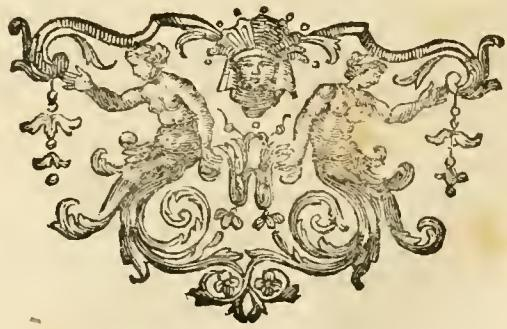
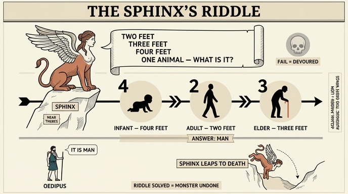

# 스핑크스(Sfinge)의 수수께끼와 그 답

## 카드 한눈에 보기

| 항목 | 내용 |
|---|---|
| 위치 | 테베(Tebe) 근처의 바위(rupe) 위 |
| 수수께끼 | "두 발이면서 세 발이고 네 발인 동물은 무엇이냐" |
| 실패한 자 | 비참하게 죽임당해 잡아먹힘 |
| 푼 사람 | 오이디푸스(Edipo) |
| 답 | **인간** — 아기는 네 발, 성인은 두 발, 노인은 지팡이로 세 발 |
| 결말 | 수수께끼가 풀리자 스핑크스는 산 아래로 몸을 던짐 |
| 형상 | 가슴까지는 처녀, 나머지는 사자의 몸(아일리아누스) + 큰 날개 두 개(아우소니우스) |

## 리파 원문(『Iconologia』 제4권, "MOSTRI" 항목)

카드의 출처는 체사레 리파 『이코놀로지아』의 **괴물들(Mostri)** 묶음 안에 있는 **SFINGE** 항목이다. 이 묶음은 스킬라(Scilla)·카립디스(Cariddi)·키마이라(Chimera)·그리포(Griffo)·**스핑크스(Sfinge)**·하르피아이(Arpie)·히드라(Idra)·케르베로스(Cerbero) 순으로 배열되어 있다. 리파의 논리는 명확하다 — 화가가 "괴물"을 그려야 할 때가 많으므로, 시인들이 전한 묘사를 한자리에 모아 도상 지침으로 제공한다는 것이다.

원문(18세기 판, 긴 s가 f로 읽히는 OCR 상태)의 요지는 두 단락이다.

**① 형상(도상 지침)**

> "LA Sfinge, come racconta Eliano, ha la faccia fino alle mammelle di una giovane, e il resto del corpo di Leone; e Ausonio Gallo oltre a ciò dice, ch'ella ha due grandi ali."

- **아일리아누스(Eliano = Claudius Aelianus, 『동물의 본성에 대하여』)**: 얼굴부터 **젖가슴까지는 젊은 처녀**, **나머지 몸은 사자**.
- **아우소니우스(Ausonio Gallo = Decimus Magnus Ausonius, 4세기 갈리아 로마 시인, 『Griphus』)**: 거기에 더해 **커다란 날개 두 개**.

즉 리파가 지정하는 스핑크스의 화면상 구성은 **처녀의 상반신 + 사자의 몸 + 큰 날개**다. (이집트의 스핑크스가 대개 남성 얼굴에 날개가 없는 것과 달리, 그리스형 스핑크스는 여성이며 날개가 있다.)

**② 이야기(수수께끼)**

> "…stava vicino a Tebe, sopra di una certa rupe, e a qualunque persona che passava di là proponeva questo enigma… **qual fosse quell'animale che ha due piedi, e il medesimo ha tre piedi, e quattro piedi**; e quei che non sapevano sciorre quello detto, da lei restavano miseramente uccisi, e divorati; **lo sciolse Edipo**, dicendo ch'era **l'Uomo**, il qual nella fanciullezza alle mani e ai piedi appoggiandosi è di quattro piedi, quando è grande cammina con due piedi, ma in vecchiezza servendosi del bastone, di tre piedi; onde sentendo il Mostro dichiarato il suo enigma, **precipitosamente giù del monte ove stava si lanciò**."

문장 구조가 곧 카드의 답 구조다.

1. 테베 근처 바위 위에 앉아 지나는 이를 붙잡고 묻는다.
2. 못 푸는 자는 죽여서 잡아먹는다(uccisi e divorati).
3. 오이디푸스가 "인간(l'Uomo)"이라고 답한다.
4. 근거: **유년 = 손과 발로 기니 네 발 / 장년 = 두 발로 걸음 / 노년 = 지팡이(bastone)에 의지하니 세 발**.
5. 수수께끼가 풀린 것을 듣자 스핑크스는 자기가 앉아 있던 산에서 몸을 던진다.

## 왜 이 수수께끼가 "인간"인가 — 발 개수의 트릭

수수께끼의 핵심 장치는 **동시성처럼 들리는 진술을 시간 순서로 풀어내는 것**이다. "두 발이면서 세 발이고 네 발"은 한 순간에 성립할 수 없으므로 모순처럼 들리지만, **생애의 세 단계**로 나누면 모순이 사라진다.

| 생애 단계 | 자세 | 발 개수 |
|---|---|---|
| 유년(fanciullezza) | 손과 발로 기어감 | 4 |
| 장년(grande) | 두 다리로 걸음 | 2 |
| 노년(vecchiezza) | 지팡이를 짚음 | 3 |

- 답의 순서를 외울 때는 리파 원문 순서(**4 → 2 → 3**, 시간 흐름)와 수수께끼 제시 순서(**2 → 3 → 4**)가 다르다는 점을 기억하면 헷갈리지 않는다.
- 그리스어 최고(最古) 육보격 판본은 여기에 "목소리는 하나뿐(μία φωνή)"과 "발이 가장 많을 때 가장 약하다"는 구절까지 붙는다 — 즉 기어다니는 아기가 가장 무력하다는 역설이 원래 수수께끼의 일부였다. 리파는 이 부분을 생략하고 발 개수만 남겼다.
- 지팡이는 "제3의 발"이라는 도구적 보철이므로, 답은 엄밀히 말해 "인간의 신체"가 아니라 **"도구를 쓰는 존재로서의 인간의 일생"**이다.

## 결말 — 스핑크스의 자멸

리파는 스핑크스가 **스스로 산에서 투신(si lanciò)**했다고 적는다. 이는 아폴로도로스 계열 전승과 일치한다. 서사적으로 이 죽음은 "수수께끼를 내는 자는 답이 밝혀지면 존재 이유를 잃는다"는 구조를 보여준다 — 괴물을 죽인 것은 칼이 아니라 **정답**이다. 그 대가로 오이디푸스는 테베의 왕위와 이오카스테를 얻고, 그것이 다시 그의 비극(자기 정체에 관한 두 번째 수수께끼)을 촉발한다.

## 도상 참고 — 처녀 상반신 + 동물 몸의 하이브리드

『이코놀로지아』의 이 "괴물들" 묶음에는 스핑크스 단독 판화가 실려 있지 않다. 대신 같은 대지(對地) 위, 괴물 항목이 끝나고 세이렌(Sirene) 항목으로 넘어가는 자리에 다음 장식 컷이 놓여 있다.

그림에서 실제로 관찰되는 요소를 리파의 지침과 대응시켜 보면:

- 좌우 대칭으로 **여성의 맨 상반신(얼굴·가슴)** 둘이 마주 보고 있고, **허리 아래는 인간의 다리가 아니라 짐승/덩굴로 변한 몸통과 말린 꼬리**로 이어진다 → 리파가 아일리아누스를 인용해 지정한 "가슴까지는 처녀, 나머지는 사자"라는 **경계 위치(젖가슴 아래에서 인간성이 끝난다)**를 그대로 시각화한 구성이다.
- 두 인물의 등 뒤로 **날개처럼 뻗은 넓은 리본/깃 장식**이 좌우로 펼쳐진다 → 아우소니우스가 덧붙인 "큰 날개 두 개"라는 요소가 장식 어휘로 흡수된 형태.
- 가운데 정면을 응시하는 **가면 같은 머리**가 놓여 있어, 통행자를 붙잡아 응시하며 질문하는 스핑크스식 "정면성"을 떠올리게 한다.

즉 이 컷은 스핑크스 자체의 삽화는 아니지만, 리파가 말하는 **"상반신은 처녀, 하반신은 짐승"이라는 하이브리드 도식**이 어떻게 화면에 구현되는지를 같은 지면에서 보여주는 예다.

## 시험 대비 요약

- 장소: **테베 근처 바위** / 질문: **2발·3발·4발인 동물**
- 답: **인간** (아기 4발 기기 → 성인 2발 → 노인 지팡이 3발)
- 푼 사람: **오이디푸스**, 실패한 자는 **죽어 잡아먹힘**
- 결말: 스핑크스가 **산에서 투신**
- 형상 전거: **아일리아누스** = 가슴까지 처녀 + 사자 몸 / **아우소니우스** = 큰 날개 두 개

출처(웹 확인): [Sphinx — Wikipedia](https://en.wikipedia.org/wiki/Sphinx), [The Sphinx's Riddle in Epic Meter](https://sententiaeantiquae.com/2015/05/14/the-sphinxs-riddle-in-epic-meter-scholia-and-athenaeus/), [Oedipus and the Sphinx — Wikipedia](https://en.wikipedia.org/wiki/Oedipus_and_the_Sphinx)

## 인포그래픽

