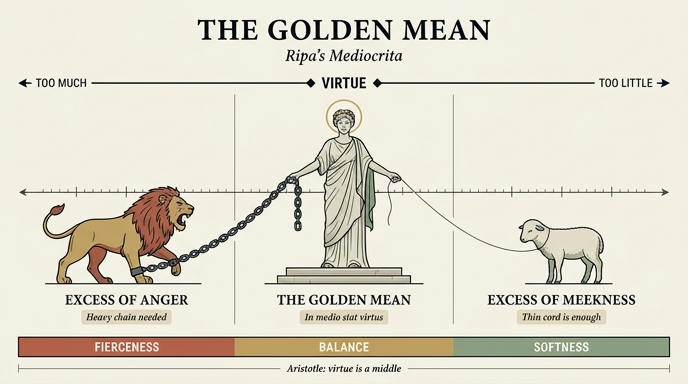

# 중용(Mediocrità) — 사자와 어린 양 사이에 선 여인

## 질문

리파는 '중용(Mediocrità)'을 어떻게 의인화했는가?

## 답

오른손에 **사슬로 묶은 사자**를, 왼손에 **가늘고 약한 끈으로 묶은 어린 양**을 잡은 여인이다. 사자(지나친 분노)와 양(지나친 참음)이라는 사나움과 온순함의 두 극단 사이 **가운데 자리(luogo di mezzo)** 에 서서, 모든 행동이 덕이라는 이름과 칭찬을 받으려면 중용을 지켜야 함을 보여준다.

---

## 1. 원문 (『이코놀로지아』 4권, Mediocrità 항목)

원본 챕터 `04 Mechanics to the Month in General.md`의 해당 단락(OCR상 긴 s가 `f`로 읽혀 있음)을 현대 표기로 정리하면 다음과 같다.

> Donna. Colla **destra** mano tenga un **Leone legato con una catena**, e colla **sinistra** un **Agnello legato con un debole e sottil laccio**. Dimostrandosi per essi due estremi, **il troppo risentimento, e la troppa sofferenza**; e tenendo detta Donna **il luogo di mezzo**, tra questi estremi di **fierezza** e di **mansuetudine** … ci può esser vero geroglifico di Mediocrità, **la quale si deve avere in tutte le azioni, acciocché meritino il nome e la lode di virtù**.

번역하면: "여인. 오른손에는 사슬로 묶은 사자를, 왼손에는 약하고 가느다란 끈으로 묶은 어린 양을 들게 하라. 이 둘로써 두 극단, 곧 **지나친 분노(troppo risentimento)** 와 **지나친 참음(troppa sofferenza)** 이 드러난다. 그리고 이 여인이 사나움과 온순함이라는 두 극단 사이의 **가운데 자리**를 차지함으로써 — 이를 통해 우리는 마음의 다른 모든 습성에서의 극단도 알아보게 된다 — 중용의 참된 상형(geroglifico)이 될 수 있다. 중용은 **모든 행동에서 지켜져야 하는데, 그 행동들이 덕이라는 이름과 칭찬을 받으려면 그렇다.**"

핵심 어휘 대응:

| 도상 요소 | 이탈리아어 | 뜻하는 극단 |
|---|---|---|
| 사슬에 묶인 **사자** | `Leone` / `fierezza` | `troppo risentimento` = 지나친 분노·격노 |
| 약한 끈에 묶인 **어린 양** | `Agnello` / `mansuetudine` | `troppa sofferenza` = 지나친 참음·굴종 |
| 두 짐승 **사이의 여인** | `il luogo di mezzo` | 덕 = 중용 그 자체 |

### 같은 항목의 두 번째 이미지

리파는 곧이어 Mediocrità의 **다른 버전**도 제시한다.

> Donna bella e risplendente, colle ali alle spalle, colle quali si solleva da terra; additando con una mano la terra, e coll'altra il Cielo, con un motto scritto che dica: **Medio tutissimus ibis**.

"아름답고 빛나는 여인. 어깨에 날개가 달려 그것으로 땅에서 몸을 일으키고, 한 손으로는 땅을, 다른 손으로는 하늘을 가리키며, '**중간으로 가면 가장 안전하리라**'는 명구를 지닌다." 여기서는 극단이 짐승이 아니라 **땅(너무 낮음)과 하늘(너무 높음)** 로 표현된다 — 즉 같은 개념의 수직 버전이다. 인용된 문구는 오비디우스 『변신 이야기』 2권에서 아폴론이 태양 마차를 몰겠다는 아들 파에톤에게 준 경고다(너무 높이도 너무 낮게도 몰지 말라). 항목 끝의 `De' Fatti, vedi Prudenza`(사례는 '신중' 항목을 보라)는 리파가 중용을 **프루덴티아(신중)의 실천적 짝**으로 보았음을 알려 준다.

## 2. 아리스토텔레스의 중용(mesotēs)과의 정확한 대응

리파의 도상은 장식이 아니라 『니코마코스 윤리학』 2권 6장의 정의를 그림으로 옮긴 것이다. 아리스토텔레스에게 덕은 **과잉(hyperbolē)과 부족(elleipsis) 사이의 중간(mesotēs)** 이다.

```
        부족 (elleipsis)        중간 = 덕 (mesotēs)        과잉 (hyperbolē)
        ─────────────────────────────────────────────────────────────────
용기      비겁 (deilia)            용기 (andreia)            무모 (thrasytēs)
절제      무감각 (anaisthēsia)     절제 (sōphrosynē)         방종 (akolasia)
씀씀이    인색 (aneleutheria)      후함 (eleutheriotēs)      낭비 (asōtia)
분노      무기력 (aorgēsia)  ←→   온화 (praotēs)      ←→   격정 (orgilotēs)
```

주목할 점: 리파가 고른 두 극단은 임의의 짝이 아니라 **하필 '분노'라는 감정의 축**이다. 아리스토텔레스가 4권 5장에서 다룬 덕 `praotēs`(온화)가 바로 그 중간이며, 양극은

- **과잉 `orgilotēs`(성마름·격노)** → 리파의 `troppo risentimento` → **사자**
- **부족 `aorgēsia`(화낼 줄 모름)** → 리파의 `troppa sofferenza` → **어린 양**

이다. 즉 사자와 양은 "동물 두 마리"가 아니라 **한 감정 축의 양 끝**이다. 그래서 원문이 "이 둘을 통해 우리는 마음의 **다른 모든 습성에서의 극단**도 알아보게 된다"고 덧붙인다 — 분노의 축을 견본으로 삼아 모든 덕에 같은 구조를 적용하라는 뜻이다.

## 3. 왜 사자는 튼튼한 사슬, 양은 가느다란 끈인가

이 카드에서 가장 자주 놓치는 디테일이다. 두 극단은 **같은 크기의 위험이 아니다.**

- **사자 = 강한 힘의 극단.** 분노·격정은 스스로 폭발하려는 능동적인 힘이므로 **쇠사슬(catena)** 같은 강력한 억제 장치가 필요하다. 사슬이 끊어지면 곧바로 사람을 해친다.
- **양 = 약한 힘의 극단.** 지나친 순종·무저항은 능동적으로 날뛰지 않고 그저 끌려간다. 그래서 **가늘고 약한 끈(debole e sottil laccio)** 만으로도 붙잡히며, 필요한 것은 강한 제압이 아니라 **가벼운 교정**이다.

즉 사슬과 끈의 **굵기 차이 = 제어에 필요한 힘의 차이**이며, 이것이 리파가 두 짐승을 좌우 대칭으로만 두지 않고 결박 도구를 다르게 그린 이유다. 아리스토텔레스도 같은 비대칭을 지적했다: 두 악덕 중 하나가 언제나 중간에 **더 강하게 대립**하며, 분노의 경우 더 흔하고 더 인간적으로 위험한 쪽은 **과잉(성마름)** 이다. 화를 낼 줄 모르는 사람은 "비난받기보다 어리석다(ēlithios)고 여겨진다" — 약한 끈이면 충분한 잘못인 것이다.

또한 손의 좌우도 의미가 있다. 더 강하고 중요한 쪽을 오른손에 두는 것이 리파의 관례이므로, **오른손 = 사자(사슬)** 배치 자체가 "더 크게 경계할 극단"을 지시한다.

## 4. 라틴 전통 속의 중용

- **`aurea mediocritas` (황금의 중용)** — 호라티우스 『서정시』 2권 10편. 여기서 `mediocritas`는 "평범함"이 아니라 **극단을 피한 균형**이라는 칭찬어다. 배는 너무 먼 바다로도, 너무 위험한 해안으로도 가지 말라는 이미지로 제시된다. 리파의 이탈리아어 표제 `Mediocrità`는 바로 이 라틴어 `mediocritas`의 계승어이므로, **한국어 '어중간함'으로 읽으면 뜻이 정반대가 된다.**
- **`in medio stat virtus` (덕은 가운데에 있다)** — 아리스토텔레스의 mesotēs를 스콜라 전통이 압축한 격언. 리파의 여인이 **문자 그대로 가운데에 서 있는(tenendo il luogo di mezzo)** 자세가 이 격언의 시각적 번역이다.
- **`Medio tutissimus ibis` (중간으로 가면 가장 안전하리라)** — 오비디우스. 위에서 본 두 번째 버전의 명구.
- 다만 아리스토텔레스의 중간은 **산술적 중간이 아니다**. "우리에게 상대적인 중간"이며, 상황·사람에 따라 옳은 분노의 양은 달라진다. 그래서 정답은 "화를 절반만 내라"가 아니라 "**마땅한 대상에게, 마땅한 방식으로, 마땅한 때에**"다. 도상에서 여인이 두 짐승을 *풀어 놓지 않고 붙잡고 있는* 것도 이 점을 말한다 — 극단은 제거되는 것이 아니라 **관리되는** 것이다.

## 5. 도상 읽기 (원본 판화에 관하여)

이 카드가 나온 판본의 자산 폴더에는 **Mediocrità 항목의 삽화 판화가 추출되어 있지 않다.** 해당 항목(p.96 부근) 주변에 남은 두 컷은 본문 삽화가 아니라 장식 테일피스(인어·가면 문양, 박쥐 날개 사티로스 문양)여서 이 카드와 무관하다.

대신 **같은 챕터의 다른 항목** 판화가 리파의 구도 문법을 잘 보여 준다. 아래는 「감사하는 기억(Memoria grata de' benefici ricevuti)」으로, 원문이 `Stia in mezzo di un Leone, ed un'Aquila`("사자와 독수리 **사이에** 서 있게 하라")라고 지시한 그림이다.


여기서 실제로 관찰되는 요소:

- 여인이 화면 **정중앙에 정면으로, 두 발로 땅을 딛고** 서 있고, 좌우 지면에 짐승이 **한 마리씩 대칭으로** 배치된다.
- 왼쪽 짐승은 **사자**, 오른쪽 짐승은 독수리로, 서로 다른 성질을 짝지어 여인이 그 **가운데 자리**를 차지하게 만든다.
- 짐승들은 여인의 **허리 아래 높이**에 그려져, 여인이 두 힘을 위에서 관장하는 위계가 생긴다.

Mediocrità 판화에서 이 문법이 어떻게 적용되었을지가 곧 카드의 답이다. 즉 위 구도에서 독수리를 **어린 양**으로 바꾸고, 두 짐승에 각각 **오른손에서 내려간 굵은 쇠사슬**과 **왼손에서 내려간 가느다란 끈**을 그려 넣으면 된다. 시선은 사자 → 여인 → 양으로 수평 이동하며, 그 이동 자체가 "과잉 → 덕 → 부족"의 축을 읽는 순서가 된다.

## 6. 암기 포인트

1. **손·짐승·결박**을 한 묶음으로: 오른손–사자–**쇠사슬**, 왼손–양–**가는 끈**.
2. **뜻 붙이기**: 사자 = 지나친 분노, 양 = 지나친 참음. 둘 다 악덕이다(양도 덕이 아니다!).
3. **자리가 곧 덕**: 여인은 어느 짐승도 대표하지 않고 **가운데에 서 있다** → `in medio stat virtus`.
4. **비대칭 기억법**: 억제할 힘이 클수록 결박이 굵다 → 사슬(분노) vs 끈(순종).
5. **결론 문장**: 모든 행동이 "덕"이라는 **이름과 칭찬**을 받으려면 중용을 지켜야 한다.

## 인포그래픽


