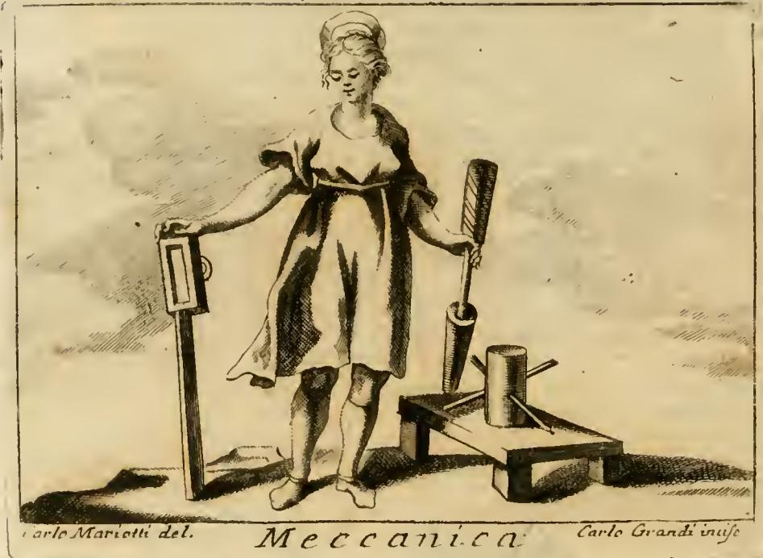

# 기계학 (Mecanica / Meccanica) — 체사레 리파 『이코놀로지아』

## 질문

리파는 '기계학(Mecanica)'을 어떻게 의인화했는가?

## 답

짧게 걷어 올린 옷을 입은 **장년의 여인**으로, **머리 꼭대기 위에 원(circolo)이 곧게 서 있다.**
**오른손**에 지렛대(**마누엘라** manuella)와 도르래(**탈리아** taglia)를,
**왼손**에 나사(**비테** vite)와 쐐기(**쿠네오** cuneo)를 들었으며,
**땅에는 권양기(아르가노 argano)**가 놓여 있다.

## 원본 판화

판화 하단에 `Carlo Mariotti del. / Meccanica / Carlo Grandi incise`라는 서명이 있다. 즉 카를로 마리오티가 원화를 그리고(*delineavit*) 카를로 그란디가 동판에 새긴(*incisit*) 18세기 페루자판 계열의 도판이다.

그림에서 실제로 확인되는 요소를 답안 항목과 하나씩 대응시켜 보면:

| 답안 요소 | 판화에서 보이는 것 |
|---|---|
| 장년의 여인 | 소녀도 노파도 아닌, 몸이 다져진 성인 여성이 정면으로 서 있다 |
| 짧게 걷어 올린 옷 | 치마가 무릎 위로 걷혀 올라가 정강이가 다 드러나고, 소매도 어깨 위로 걷혀 있으며 **맨발**이다 |
| 머리 위에 곧게 선 원 | 머리 정수리에 납작한 고리/원반이 세로로 곧추세워져 얹혀 있다 |
| 오른손(화면 왼쪽) | 땅에 꽂힌 수직 막대 위에 걸린 **직사각형 활차 블록(taglia)** 을 짚고 있다 |
| 왼손(화면 오른쪽) | 나선 홈이 파인 원통형 막대, 즉 **나사(vite)** 를 암나사 통에 꽂고 위에서 잡고 있다 |
| 땅에 놓인 권양기 | 오른쪽 아래 목재 받침대 위에, 수직 드럼에 손잡이 막대가 십자로 관통한 **아르가노(권양기·캡스턴)** 가 놓여 있다 |

> 참고: 판화는 텍스트가 열거한 다섯 도구를 화면 구성상 좌우로 나눠 배치했으므로, 어느 손에 무엇이 들렸는지는 텍스트 쪽 서술(오른손=마누엘라·탈리아, 왼손=비테·쿠네오)을 기준으로 외우는 게 안전하다. 쐐기(cuneo)는 판화에서 목재 대 위의 작은 삼각형 부재로 축약되어 눈에 잘 띄지 않는다.

## 리파 원문(이탈리아어)과 직역

> DOnna di età virile, veſtita di abito ſuccinto, con un circolo in cima del capo diritto in alto. Che colla deſtra mano tenga una manuella e la taglia, e colla ſiniſtra la vite ed il cuneo; ed in terra l'argano.

"장년(壯年)의 여인, 짧게 걷어 올린 옷을 입고, 머리 꼭대기에 원이 위로 곧게 서 있다. 오른손으로는 마누엘라와 탈리아를 잡고, 왼손으로는 나사와 쐐기를 잡는다. 그리고 땅에는 아르가노가 있다."

## 리파가 붙인 이유 풀이

리파의 항목은 언제나 "이런 모습이다"에 이어 "왜 그런 모습인가"를 조목조목 해설한다. 이 대목의 논리는 다음과 같다.

### 기계학이란 무엇인가

> "기계학은 산술·기하·여러 도량법 같은 **수학적 학문의 이론(teorica)** 을 매개로 하여 **손으로 작동하는(opera manualmente)** 기술이다."

즉 순수 사변(思辨)도 순수 손기술도 아닌, **이론이 손을 통해 실행되는 중간 지대**의 학문이다. 그 목적은 "**작은 힘으로 인간의 능력 밖에 있는 거대한 무게를 움직이는**, 기교로 만들어진 것"을 뜻한다. 리파는 기계학이 모든 건축(edifizj)에 내포되어 작동하며, "그 다양한 기계들을 통해 자연의 힘을 넘어서고, 온갖 무게를 땅에서 쉽게 들어 올려 놀라운 작업을 실행에 옮긴다"고 덧붙인다.

### 장년(età virile)인 이유

장년이라야 "**사람이 이치를 이해할 능력이 있고 사물에 노련하며**, 시민적(civili) 활동과 기계적(mecaniche) 활동 모두를 수행할 수 있기" 때문이다. 이론을 이해할 지력과 손으로 실행할 체력이 동시에 요구되는 학문이므로, 미숙한 젊음도 쇠약한 노년도 아닌 한창 나이가 배당된다.

### 짧게 걷어 올린 옷(abito succinto)인 이유

"기계적 작업에는 **어떠한 방해물로부터도 자유로워야** 하기" 때문이다. 재능(ingegno)과 부지런함(industria)으로 이 직업에 요구되는 바를 실행에 옮기려면 몸이 거리낌 없이 움직여야 한다. 판화의 걷어 올린 치마·소매와 맨발이 바로 이 '거추장스러움 없음'의 시각적 번역이다.

### 머리 위에 곧게 선 원(circolo)인 이유

"기계적 작동은 **대부분 원운동(moto circolare)에서 파생됨을** 보이기 위함이다."

이것이 이 도상의 핵심 아이디어다. 지렛대의 회전, 도르래의 회전, 나사의 나선 회전, 권양기 드럼의 회전 — 리파가 든 도구는 쐐기 하나만 빼고 모두 원운동으로 환원된다. 원을 손에 들리지 않고 **머리 위에** 얹은 것은, 그것이 도구가 아니라 이 모든 도구를 지배하는 **원리**임을 뜻한다. 배경 논거는 아리스토텔레스 계열의 『기계학 문제집(Mechanica)』으로, 이 책은 기계의 모든 놀라움이 원의 성질(같은 반지름 위 점들이 서로 다른 속도로 움직인다는 성질)에서 나온다고 설명한다. 리파도 본문에서 마누엘라를 설명할 때 "아리스토텔레스가 『기계학』에서 이를 언급한다"고 직접 인용한다.

### 다섯 도구 각각의 이유

| 도구 | 이탈리아어 | 리파의 설명 |
|---|---|---|
| 지렛대(손잡이 막대) | **manuella / manovella** | "그 **길이에 비례하여** 배분된 도구로, 원운동으로 그 길이에 상응하는 무게를 들어 올린다." 지렛대 팔의 길이가 곧 힘의 배율이라는 점, 즉 아리스토텔레스 『기계학』의 논지를 그대로 옮긴 것 |
| 도르래(활차) | **taglia** | "**수평 방향으로도 수직 방향으로도** 쓰여, 아무리 큰 무게든 끌고 들어 올린다." 힘의 방향을 자유롭게 바꿔주는 도구 |
| 나사 | **vite** | "앞의 도구들보다 **더 쉽게** 원운동으로 작동하여 무거운 기계를 들어 올리고, 또 경우에 따라 **조여 붙이는(stringere)** 데도 쓴다" |
| 쐐기 | **cuneo** | "타격을 받으면 손쉽게 **열고, 억지로 벌리고, 아무리 단단한 것도 쪼갠다**" — 다섯 중 유일하게 원운동이 아니라 타격·경사면으로 작동하는 도구 |
| 권양기 | **argano** | "**중심(centro) 아래에 놓인** 원운동으로 초자연적인(=인력을 넘어서는) 무게를 끌고 들어 올리는 도구" |

## 왜 이 다섯인가 — 고전 기계학의 '다섯 힘'

리파가 고른 도구 목록은 임의가 아니다. 알렉산드리아의 파포스와 헤론 이래 고전 기계학은 무게를 움직이는 장치를 **다섯 가지 단순 기계(five simple machines / cinque potenze)** 로 정리했다.

1. 지렛대 (vectis) — manuella
2. 도르래/활차 (trochlea) — taglia
3. 나사 (cochlea) — vite
4. 쐐기 (cuneus) — cuneo
5. 굴대와 바퀴 / 권양기 (axis in peritrochio) — argano

리파의 의인상은 이 **다섯 힘을 손과 땅에 나눠 들린 카탈로그**이고, 머리 위의 원은 그것들을 하나로 묶는 이론적 상위 원리다. 결과적으로 이 도상 하나가 "이론(원) + 다섯 도구(손·땅) + 실행하는 신체(걷어 올린 옷)"라는 기계학의 정의 전체를 담는다.

## 외우는 요령

- **손 → 회전, 머리 → 원리, 땅 → 가장 무거운 것**
  - 원(원운동) = 머리 위 (원리는 위에)
  - 들 수 있는 도구 4개 = 두 손 (오른손 2개 = 마누엘라·탈리아 / 왼손 2개 = 비테·쿠네오)
  - 가장 크고 무거운 권양기(아르가노) = 땅 위
- **오른손 = 끌어올리는 것(지렛대·도르래), 왼손 = 파고드는 것(나사·쐐기)** 로 묶으면 좌우가 헷갈리지 않는다.
- 몸 상태 두 가지: **장년**(이론+실행 둘 다 가능한 나이) + **짧게 걷어 올린 옷**(방해물 없는 몸).

## 출처

- 원본 챕터: `/Users/swcho/projects/swcho/default/books/260801 Iconologia/.fm/assets/04 Mechanics to the Month in General.md` (`# MECANICA.` 항목)
- 판화: `Iconologia (Cesare Ripa)/_page_91_Picture_3.jpeg` (본 폴더의 `fig-1.jpeg`)
