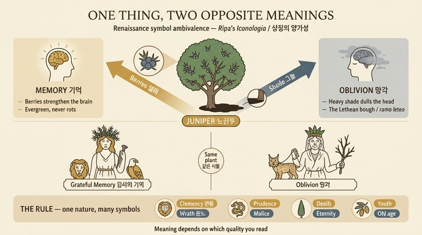

# 노간주나무는 왜 '기억'이자 '망각'인가 — 상징의 양가성

> **Q.** 같은 노간주나무가 '감사의 기억'과 '망각'에 모두 쓰이는 모순은 어떻게 해명되는가?
>
> **A.** 한 동물이나 식물이 서로 다른 성질에 따라 상반된 상징이 될 수 있다는 것이다. 사자가 관용과 분노 둘 다의 상형문자이듯, 노간주나무도 열매는 기억력에 좋지만 그 그늘은 머리를 무겁게 하고 멍하게 하므로, 시인들이 '레테의 가지(ramo leteo)'라 부른 망각의 가지가 곧 노간주 가지라는 것이다.

---

## 1. 문제 상황 — 저자가 스스로 걸고 넘어지는 자기모순

이 대목은 체사레 리파 『이코놀로지아』 4권의 **OBBLIVIONE(망각)** 항목이며, 리파 본인이 아니라 **조반니 차라티노 카스텔리니(Gio. Zaratino Castellini)**가 증보한 항목이다. 그런데 카스텔리니는 바로 앞쪽에서 **MEMORIA GRATA DE' BENEFICI RICEVUTI(받은 은혜에 대한 감사의 기억)** 항목도 썼다. 두 항목의 도상 지물이 겹친다.

| | 감사의 기억 (Memoria grata) | 망각 (Obblivione) |
|---|---|---|
| 인물 | 우아한 **젊은** 여인 | **늙은** 여인 |
| 머리 | 열매가 촘촘히 달린 **노간주 가지** 관 | **맨드레이크(mandragora)** 관 |
| 손 | 큰 **못(chiodo)** | 오른손에 묶인 **스라소니(Lupo cerviero)**, 왼손에 **노간주 가지** |
| 곁 | **사자**와 **독수리** 사이 | — |

즉 **노간주가 한쪽에서는 기억의 관, 다른 쪽에서는 망각의 가지**로 정반대로 쓰인다. 카스텔리니는 이 모순을 독자가 지적하기 전에 자기가 먼저 꺼낸다.

> *"Il ginepro è di sopra consegnato per corona alla memoria de' benefizi ricevuti, come dunque lo poniamo ora in mano all'Obblivione? Questa contrarietà non impedisce, che non si possa dare ad ambedue."*
> (노간주는 위에서 '받은 은혜의 기억'에게 관으로 주어졌는데, 어찌 지금은 그것을 망각의 손에 쥐여주는가? **이 상반됨은 양쪽 모두에게 주는 것을 방해하지 않는다.**)

이 한 문장이 카드의 정답이자, 사실상 『이코놀로지아』 전체를 읽는 열쇠다.

---

## 2. 답변의 논리 구조 — 네 단계

### (1) 왜 노간주가 '감사의 기억'의 관인가 — 세 가지 이유

「감사의 기억」 항목에서 카스텔리니가 든 근거:

1. **썩지 않고 늙지 않는다.** 플리니우스 『박물지』 인용 — *Cariem et vetustatem non sentit iuniperus* ("노간주는 좀먹음도 노쇠함도 겪지 않는다"). 위대한 기억은 세월이 흘러도 **망각이라는 좀(tarlo dell'obblivione)**을 타지 않으므로, 그 여인을 젊게 그린다.
2. **잎이 결코 떨어지지 않는다** (상록). 사람도 받은 은혜를 마음에서 떨어뜨리면 안 된다.
3. **열매(주니퍼 베리)가 기억에 좋다.** 노간주 열매를 다른 재료와 함께 증류하면 기억에 도움이 되고, 노간주 재로 끓인 세정액도 기억에 크게 이롭다 (구알테로의 '기억술' 라틴어 논고). 당대의 표준 약초서인 **카스토레 두란테**의 『에르바리오(Herbario)』도 "노간주 열매가 뇌를 튼튼하게 하고 기억을 좋게 한다"고 확인해 준다.

여기에 키케로의 표현 *Cui sum obstrictus memoria beneficii sempiterna* ("내가 은혜에 대한 영원한 기억으로 묶여 있는 그 사람")를 붙여, 영원한 식물인 노간주가 '영원한(sempiterna) 기억'의 정당한 상징이 된다고 말한다. (손에 든 못은 속담 *Clavo trabali figere beneficium* — "받은 은혜를 대들보 못으로 박아두라". 사자와 독수리는 이성 없는 짐승조차 은혜를 기억한 사례, 즉 안드로클레스와 사자 이야기다.)

### (2) 그럼에도 왜 망각의 표지인가 — **열매가 아니라 '그늘'**

핵심 반전은 **같은 나무의 다른 부분**이다.

> *"le bacche del ginepro conferiscono al cervello, ed alla memoria, ma l'**ombra è grave, e nociva alla testa**"*
> (노간주 **열매**는 뇌와 기억에 이롭지만, 그 **그늘**은 무겁고 머리에 해롭다.)

전거도 3중으로 쌓는다.

- **루크레티우스** 『사물의 본성에 관하여』 6권 — "어떤 나무들에게는 무거운 그늘이 주어져, 그 아래 풀밭에 누운 자에게 자주 두통을 일으킨다."
- **베르길리우스** 『목가』 마지막 편(10가) 끝부분 — ***iuniperi gravis umbra*** ("노간주의 무거운 그늘"). 카스텔리니가 "특정해서 이름을 댄" 결정적 구절.
- **카스토레 두란테** 『에르바리오』 — *Iuniperi gravis umbra tamen, capiti que molesta est*.

그래서 항목 각주에 인용된 P. 리치의 「세속적 사랑의 망각」 도상도 같은 통념을 쓴다 — *"이 나무 그늘에서 자는 자는 기억을 잃는다고 자연학자들이 말하기 때문에 노간주로 관을 씌운다."*

**정리: 노간주 = (열매 → 기억) + (그늘 → 망각).** 하나의 사물이되 성질이 나뉘므로 의미도 갈라진다.

### (3) 유비 논증 — 사자·용·측백·아몬드

카스텔리니는 이것이 노간주만의 예외가 아니라 상징 일반의 **원리**임을 예시로 못 박는다.

> *"한 동물은 그것이 지닌 자연의 여러 조건에 따라 여러 사물의, 심지어 서로 반대되는 사물의 상징이 될 수 있다."*

- **사자(Leone)** — *clemenza*(관용)이자 *furore*(분노)의 상형문자. 나아가 *bestiale virtù*(짐승다운 용덕)와 *malizia*(악의), *possanza terrena*(지상의 권능)와 *celeste*(천상의 권능).
- **용(Dragone)** — 악의 / 사려 / 교만 / 겸손 / 생명(갱신된 젊음) / 노쇠 / 죽음 / 영원. 무려 여덟 갈래.
- **측백(cipresso)** — 죽음이자 영속성.
- **아몬드(amandorlo)** — 젊음이자 노년.
- 그리고 **부위별 분화** — "껍질에는 이롭고 뿌리에는 해로운 식물이 있으며, 열매·잎·가지가 각기 다른 효과를 낳으니 그만큼 다른 상징을 이룰 수 있다."

이 "사자 = 관용 ∧ 분노" 사례는 카스텔리니의 창작이 아니라 **피에리오 발레리아노 『상형문자론(Hieroglyphica)』**의 서술 방식 그대로다. 발레리아노는 하나의 표제어(사자, 뱀, 독수리…) 아래 긍정·부정 의미를 병렬로 나열하는 백과사전식 구성을 취했고, 그 뿌리에는 중세 성서 주해의 **in bonam partem / in malam partem**(좋은 뜻으로 / 나쁜 뜻으로) 이중 독법이 있다. 성서에서 사자가 '유다의 사자'인 그리스도이자 동시에 "우는 사자같이 삼킬 자를 찾는" 마귀(베드로전서 5:8)인 것과 같은 구조다. 카스텔리니는 본문에서도 스라소니를 설명하며 "피에리오"를 직접 인용하고 있어, 이 논증의 출처가 어디인지 스스로 드러낸다.

### (4) '레테의 가지(ramo leteo)'의 계보 — 문헌학적 확정

여기서 카스텔리니는 방어를 넘어 공세로 전환한다. 노간주는 단지 망각에 **써도 되는** 정도가 아니라, 라틴 시인들이 말한 **바로 그 '레테의 가지'가 노간주**라는 주장이다.

> *"Pigliamo dunque risolutamente il ramo del ginepro per ramo di Obblivione, da' Poeti Latini chiamato **ramo leteo**"* — 레테(Lethe)는 '망각'을 뜻하며, 저승의 망각의 강 이름이다.

- **오비디우스** 『변신 이야기』 7권 — 메데이아가 잠들지 않는 용에게 *lethaei gramine succi*("레테의 즙을 가진 풀")를 뿌려 잠과 망각을 가져온다. **단, 오비디우스는 그 식물의 이름을 말하지 않는다.**
- **발레리우스 플라쿠스** 『아르고나우티카』 8권 — *lethaei ... rami*("레테의 가지")를 흔드는 메데이아.
- **베르길리우스** 『아이네이스』 5권 끝 — 잠(Somnus)의 신이 팔리누루스의 관자놀이에 *ramum Lethaeo rore madentem*("레테의 이슬에 젖은 가지")를 댄다.

**반론 처리 — "그 식물은 양귀비 아닌가?"** 카스텔리니는 이를 명시적으로 기각한다("errano", 그들은 틀렸다). 근거: 『아이네이스』 4권에서 헤스페리데스의 여사제가 황금사과를 지키는 용에게 **꿀에 갠 양귀비(soporiferum papaver)**를 **매일의 일상 먹이로** 준다. 만약 양귀비가 용을 재웠다면 (ㄱ) 사과를 훔칠 틈이 매일 생겼을 테고, (ㄴ) 메데이아가 마법 주문을 쓸 필요도 없이 용이 자는 시각만 노리면 됐을 것이다. 그러므로 양귀비는 용에게 수면제가 아니다. 여기에 자연학적 보강 — **한 식물이 모든 동물에게 같은 힘을 갖지는 않는다**(세르비우스): 버들은 사람에게 쓰지만 소·염소에겐 달고, 독당근은 사람에게 치명적이나 염소는 살찌우며(아일리아누스), 야생 올리브는 염소에겐 암브로시아지만 사람에겐 지독히 쓰다(루크레티우스 6권). 용은 극도로 뜨거운(*calidissimo*) 짐승이니, 꿀+양귀비는 **재우려는 게 아니라 열을 식히려는 냉각식(cibo rinfrescativo)**이라는 것.

**결정타 — 아폴로니오스 로디오스.** 『아르고나우티카』 4권에서 메데이아가 용을 재우는 장면에 **"방금 꺾은 노간주(ἄρκευθος / iuniperus) 가지"**가 메데이아의 손에 명시된다. 카스텔리니의 논변은 연대에 기댄다 — 아폴로니오스는 위 라틴 시인들보다 **더 오래된** 그리스 시인이므로, 오비디우스·발레리우스·베르길리우스가 이름 없이 '레테의 가지'라 부른 것은 원형에 해당하는 아폴로니오스 판본의 노간주 가지를 **환칭(antonomasia)**으로 가리킨 것이라는 추론이다.

**보너스 정합성** — 노간주가 하필 '독룡'에게 쓰인 것도 적절하다. 플리니우스에 따르면 노간주 열매는 독을 막고, 그 씨를 태우면 뱀이 그 연기를 두려워하기 때문이다.

---

## 3. 왜 이 카드가 중요한가 — 『이코놀로지아』를 읽는 열쇠

이 대목은 노간주에 관한 잡학이 아니라 **르네상스 상징론의 문법 선언**이다.

- **상징은 사전이 아니다.** "노간주 = 기억"처럼 1:1 대응표로 외우면 반드시 무너진다. 상징은 사물의 **어떤 성질(qualità)을 골라 쓰느냐**에 따라 의미가 결정된다. 열매를 보면 기억, 그늘을 보면 망각.
- **모순은 결함이 아니라 자원이다.** 도상 제작자는 같은 재료로 정반대 개념을 만들어낼 수 있고, 그래서 상징 체계가 유한한 자연물로 무한한 추상 개념을 감당할 수 있다.
- **문맥이 뜻을 고정한다.** 노간주 가지가 **젊은** 여인의 **머리 위 열매 달린 관**인지, **늙은** 여인의 **손에 들린 가지**인지 — 인물의 나이, 다른 지물(못/스라소니), 배치가 어느 성질을 활성화할지 지정한다. 그래서 리파의 도상은 항상 지물 **묶음**으로 읽어야 한다.
- **논증은 권위의 축적으로 이루어진다.** 카스텔리니는 자연학(플리니우스·두란테)·시(베르길리우스·오비디우스·루크레티우스)·문헌 연대(아폴로니오스)를 겹쳐 쌓아 결론을 낸다. 이것이 근대 이전 인문학의 전형적 증명 방식이다.

## 4. 한 줄 요약

> **하나의 사물, 여러 성질, 여러 의미** — 사자가 관용이자 분노이듯, 노간주도 **열매로는 기억을, 그늘로는 망각을** 뜻하며, 시인들의 '레테의 가지'가 바로 그 노간주 가지다.

---

## 출전

- 원문: `.fm/assets/11 Oblivion to Omnipotence of God.md` — OBBLIVIONE 항목, 특히 노간주 반론·해명 단락과 '레테의 가지' 논증
- 대응 항목: `.fm/assets/04 Mechanics to the Month in General.md` — MEMORIA GRATA DE' BENEFICI RICEVUTI (노간주 관의 세 가지 이유)

## 인포그래픽

