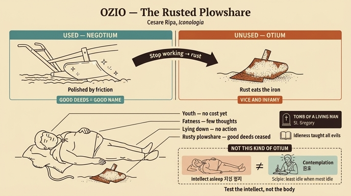

# 녹슨 보습(vomere arruginito)의 '나태(Ozio)'

> **핵심 한 줄** — 쟁기에서 떼어놓고 안 쓰는 보습에 녹이 슬듯, **선행(bene operare)을 멈춘 인간에게는 오명(infamia)과 악덕(vizio)이 녹처럼 들러붙어** 하나님과 사람 모두에게 밉게 된다.

---

## 1. 카드가 가리키는 도상 규정

『Iconologia』 4권 「OZIO(나태/한가함)」 항목에는 도상 변형이 다섯 가지 실려 있고, 이 카드는 **두 번째 변형**을 묻는다. 원문(제4권, 인쇄 페이지 323 「Ozio」)의 규정은 이렇다.

> *Giovane grasso, e corpulento. Sarà a giacere per terra. E per vestimento porterà una pelle di Porco; e per terra vi sarà un **vomero**, stromento di ferro da arare la terra, ma **tutto pieno di rugine**.*
>
> 살찌고 뚱뚱한 젊은이. **땅에 드러누워 있을 것**. 옷으로는 **돼지 가죽**을 걸치고, 땅바닥에는 **보습**(vomero, 땅을 가는 쇠 연장)이 하나 놓여 있으되 **온통 녹으로 뒤덮여** 있을 것.

즉 구성 요소는 네 개다.

| 요소 | 뜻 |
|---|---|
| 젊음(giovane) | 늙음의 불편을 겪어보지 않은 자 = 아직 대가를 모르는 자 |
| 살찜(grasso) | 생각이 적어 지성이 과로하지 않으니 피가 살로 퍼진다 |
| 땅에 드러누움(giacere per terra) | 고귀한 행동에서 완전히 이탈한 상태 |
| **녹슨 보습(vomere arruginito)** | **이 카드의 주제** — 쓰지 않아 부식된 도구 |

> **이미지 노트**: 이 asset의 판화 추출본에는 「Ozio」 판화가 빠져 있다(같은 챕터 파일에서 실제로 추출된 도판은 다음 항목인 **Pace**의 판화 `_page_332_Picture_3.jpeg` 뿐이다). 그래서 원본 도판 대신, 아래 §7의 인포그래픽으로 도상 구조를 시각화했다.

---

## 2. 왜 하필 '보습'인가 — negozio / ozio 의 언어유희

원문 논증의 뼈대는 라틴어 어원 대비다. **otium(ozio, 여가·무업)의 반대말이 곧 neg-otium(negozio, '여가 아님' = 업무·거래)**이다. Ripa는 이 짝을 그대로 밀어붙인다.

> *è significativo dell'Ozio il vomere arruginito, come ne' **negozi**, e nelle azioni è quello medesimo chiaro, e netto.*
>
> 녹슨 보습은 나태를 뜻한다 — **일(negozio)과 행동 속에 있을 때에는 바로 그 똑같은 보습이 반짝이고 깨끗하기** 때문이다.

관찰의 정확성이 포인트다. 보습은 흙을 가를 때 **흙과의 마찰로 표면이 계속 연마되어 거울처럼 광이 난다.** 반대로 헛간에 처박아 두면 며칠 안에 붉은 녹이 덮는다. **같은 쇠붙이의 상태가 오직 '쓰이는가'로 갈린다.** 그러므로

```
   쓰임(negotium) ──▶ 마찰 ──▶ 광택·청결   =  善行하는 인간 → 명성(fama)
   방치(otium)    ──▶ 정지 ──▶ 녹·부식     =  善行 멈춘 인간 → 오명(infamia)·악덕
```

여기에 Ripa는 대전제를 하나 깐다.

> *essendo il più importante negozio nostro far cose appartenenti al vivere*
> **우리의 가장 중요한 '업무'는 사는 일(살아가는 데 속한 일)을 하는 것이다.**

즉 인간은 태생적으로 '쓰이도록 만들어진 연장'이며, 삶 자체가 그 연장의 노동이다. 따라서 나태는 단순한 휴식이 아니라 **존재 목적의 방기**가 된다.

그리고 결론절 — 카드의 답 그대로:

> *come non adoprandosi il vomere viene ruginoso: così l'Uomo, che tralascia il bene operare, dandosi in preda all'Ozio, si cuopre, ed empie d'infamie, e di vizi, che lo rendono poi dispiacevole a Dio, ed agli Uomini.*
>
> 보습을 쓰지 않으면 녹슬듯, **선행을 그만두고 나태의 먹이가 된 인간은 오명과 악덕으로 자신을 덮고 채워, 결국 하나님께도 사람에게도 밉살스러운 존재가 된다.**

⚠️ 녹의 은유가 무서운 이유: 녹은 **밖에서 새로 묻는 오염이 아니라 쇠 자신이 변질된 것**이다. 나태의 악덕은 외부에서 침입하는 게 아니라 **정지 상태 자체가 안에서 생성**한다.

---

## 3. 나태의 정의 — '지성의 정지(quiete dell'intelletto)'

> *quest'Ozio non è altro, che una quiete dell'intelletto, il quale non mostrando la strada di operare virtuosamente a' sensi, anch'essi se ne stanno sopiti, e quel ch'è peggio, discacciati dalla via conveniente.*

메커니즘이 위→아래 연쇄로 서술된다.

1. **지성(intelletto)이 멈춘다** → 2. 지성이 감각에게 "덕스럽게 행하는 길"을 **가리켜 주지 못한다** → 3. **감각(sensi)도 함께 혼수(sopiti)에 빠진다** → 4. 더 나쁘게는, 마땅한 길에서 **쫓겨난다(discacciati)**.

핵심: 나태는 '아무 일도 일어나지 않는 중립 상태'가 아니라 **키를 놓아버린 배**다. 멈추는 게 아니라 **엉뚱한 데로 밀려간다**. 이것이 4·5번째 변형(방패에 화살이 꽂히는 그림)과 이어지는 논리이기도 하다.

---

## 4. 두 개의 권위 인용

### (1) 그레고리우스 — "산 사람의 무덤"

> *Per questo disse S. Gregorio l'Ozio esser una **sepoltura dell'Uomo vivo**.*
> 그래서 성 그레고리우스는 나태를 **'살아 있는 사람의 무덤(sepoltura/sepultura)'**이라 불렀다.

'땅에 드러누운' 자세와 정확히 겹치는 표현이라는 점에 주목하자. 도상의 인물은 **눕는 자세만으로 이미 매장된 상태**를 연기하고 있다 — 숨은 쉬지만 활동은 없으므로.

> 📌 **출처 참고**: 이 격언의 실제 원문은 세네카다 — *"Otium sine litteris mors est et hominis vivi sepultura"*(배움 없는 여가는 죽음이요 산 사람의 매장이다, 『도덕서한』 82.3). Ripa 시대의 편람·설교집에서는 교부 이름으로 재귀속되는 일이 흔했고, Ripa도 그 전승을 따라 "S. Gregorio"로 적었다. 카드 답으로는 **원문 그대로 '그레고리우스'**로 외우면 되고, 다만 세네카 계열 격언임을 알아두면 좋다.

### (2) 성경 — "나태가 세상의 모든 악을 가르쳤다"

> *e la scrittura, che tutti i mali del Mondo gli ha insegnati l'Ozio.*

전거는 **집회서(Ecclesiasticus/Sirach) 33:29 Vulgata**: *"multam enim malitiam docuit otiositas"* — "많은 악을 나태가 가르쳤느니라." Ripa는 이를 "세상의 **모든** 악"으로 강화해 인용한다. 나태가 **다른 악덕들의 원인·교사(教師)** 지위를 갖는다는 주장으로, 나태를 단일 죄가 아니라 **악덕의 뿌리**로 세우는 대목이다.

---

## 5. 결정적 유보 — 스키피오의 '관조로서의 여가'는 여기서 말하는 나태가 아니다

Ripa는 곧바로 선을 긋는다. 이 구별을 놓치면 항목 전체를 오독한다.

> *Né si prende in questo luogo l'Ozio per **contemplazione**, come lo pigliò scherzando con parole Scipione il grande, dicendo di se stesso, che allora avea men' Ozio, che mai, quando ne avea più abbondanza.*
>
> 이 항목에서 말하는 나태는 **관조(contemplazione)로서의 여가**를 뜻하지 않는다 — 위대한 스키피오가 농담처럼 자기에 대해 "**여가가 가장 넘칠 때 오히려 여가가 가장 적었다**"고 한 그런 의미의 오티움이 아니다.

- **역설의 해설(원문 그대로)**: *per dir quanto meno era impiegato nelle azioni, tanto era più intento al contemplare* — **행동에 덜 쓰일수록 관조에는 더 몰입해 있었다**는 뜻. 겉으로 비어 있을 때 속으로는 최대 가동 중이었다는 것.
- **전거**: 키케로 『의무론』 3.1 — 스키피오 아프리카누스가 늘 하던 말, *"numquam se plus agere quam cum nihil ageret, numquam esse minus solum quam cum solus esset"*(아무 일도 하지 않을 때 가장 많이 일했고, 혼자일 때 가장 덜 혼자였다). Ripa는 이를 오티움 버전으로 바꿔 인용한 것.
- **누가 이 좋은 오티움을 누리는가** (§ 다음 페이지 이어지는 문장): *quelli, che colla lezione de' molti libri, e con l'intendere cose alte, e nobili, si mantengono senza muovere altro che la lingua, o la penna, la pietà, la religione, lo zelo di Dio, il consorzio degli Uomini* — **많은 책을 읽고 높고 고귀한 것을 이해하여, 혀와 펜만 움직이면서도 경건·종교·하나님을 향한 열심·인간의 유대를 지켜내는 사람들.**

### 나쁜 오티움 vs 좋은 오티움

| | **Ozio = 惡 (이 항목의 주제)** | **Otium = 관조 (제외 대상)** |
|---|---|---|
| 지성 | 정지(quiete dell'intelletto) | 최대 가동(intento al contemplare) |
| 몸 | 땅에 누움, 잠, 살찜 | 혀와 펜만 움직임 |
| 도구 상태 | **녹슨 보습** | 다른 방식으로 계속 쓰이는 연장 |
| 산출물 | 오명·악덕 | 경건·종교·열심·인간의 유대 |
| 평가 | 하나님과 사람에게 밉다 | "이 비참한 삶 속의 모든 좋은 것" |

👉 **판별 기준은 '몸이 움직이는가'가 아니라 '지성이 작동하는가'.** 겉모습(가만히 있음)이 같아도 정반대다. 그래서 Ripa가 굳이 유보 조항을 넣었다.

---

## 6. 「Ozio」 항목의 다섯 변형 한눈에 (카드 변형은 ②)

| # | 지물 | 논지 |
|---|---|---|
| ① | 어두운 굴 속, **돼지**에 왼팔꿈치를 기대고 **머리를 긁는** 졸린 젊은이 | 어두운 굴 = 비천하고 캄캄한 삶. 돼지 = 아리스토텔레스가 가장 가르치기 어려운 동물이라 한 것, 식욕과 정욕만 채우는 자. 머리 긁기 = 결단을 못 내리는 자 |
| **②** | **누움 + 돼지 가죽 + 녹슨 보습** | **쓰지 않아 녹슨 쇠 = 선행을 그친 인간에게 덮이는 오명과 악덕** |
| ③ | 노인, **가면 무늬 노란 옷**, **꿩** 투구 장식, **꺼진 횃불**, **겨울잠쥐(Ghiro)**를 그린 방패와 모토 | 꺼진 횃불 = 활동의 소멸, 겨울잠쥐 = 잠으로 계절을 보내는 짐승, "쾌락 속에서(voluptas)" 모토 |
| ④ | 앉아서 **사방에서 날아온 화살이 빼곡히 꽂힌 방패**를 든 뚱뚱한 남자 | *l'Ozio sia scudo di tutti i vizj* — 나태는 **모든 악덕의 방패**. 게으름에서 일어나기 전에 온갖 재난이 먼저 몸에 쏟아진다. 아리오스토 인용: *"In questo albergo il grave sonno giace, / L'Ozio da un canto corpulento e grasso"*(『광란의 오를란도』 잠의 궁전) |
| ⑤ | 헐벗은 옷, **고개를 숙이고 맨머리로 두 손을 품에 넣은** 젊은이 | 잠언 19:24 계열 — 게으른 자는 손을 품에 감춘다 |

②와 ④를 헷갈리지 말 것: **②는 녹(부식, 내부 변질), ④는 화살(재난, 외부 타격)**.

---

## 7. 암기 포인트

- **키워드 3종**: `녹슨 보습(vomere arruginito)` / `산 사람의 무덤(sepoltura dell'Uomo vivo, 그레고리우스)` / `관조(contemplazione)는 예외 — 스키피오`
- **한 문장 복원**: "쓰지 않는 보습이 녹슬듯 ⇢ 선행을 그친 인간은 오명과 악덕으로 덮여 ⇢ **하나님과 사람 모두에게** 밉게 된다."
- 답을 말할 때 **유보 조항까지 붙여야 완답**이다. 나태 정죄 + "단, 관조적 여가는 제외".
- 뒤집힌 어원 기억법: **negozio(일)에 있을 때 보습은 빛나고, ozio(무업)에 있을 때 녹슨다.**

## 인포그래픽


