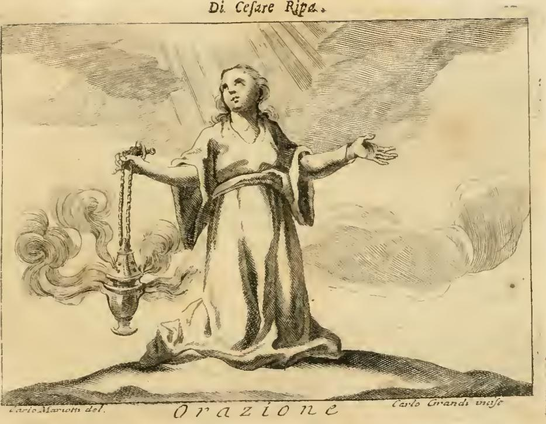

# 리파의 「기도(Orazione)」 의인화

> **Q.** 리파는 '기도(Orazione)'를 어떻게 의인화했는가?
>
> **A.** 겸손한 얼굴의 늙은 여인이 소박한 흰옷을 입고 무릎 꿇어 팔을 벌리고, 오른손에 연기 나는 향로를 들었는데 그 사슬은 성모의 묵주(로사리오)로 되어 있으며, 얼굴을 들어 광채를 바라본다. 흰옷은 기도가 순수하고 단순하고 명료해야 함을(암브로시우스), 향로는 '내 기도가 분향처럼 주 앞에 오르게 하소서'(시편 140편)를 뜻한다.

출처: `.fm/assets/12 Honor to Origin of Love.md` — 원서 4권(TOMO QUARTO) 286면(도판) ~ 280면 표기 구간. 이 카드는 리파가 제시한 **네 가지 「Orazione」 중 첫 번째 항목**이며, 도판이 붙어 있는 것도 이 첫 번째 항목이다.

---

## 1. 원문과 판화

리파의 원문(이탈리아어, 18세기 페루자 판 OCR 정리):

> Donna vecchia di sembiante umile, vestita di abito semplice, e di color bianco. Starà inginocchioni colle braccia aperte; ma che colla destra mano tenga un incensiere fumante, le catene del quale siano **corone, o rosarj della Gloriosa Vergine MARIA**; e terrà la faccia alzata, che miri uno splendore.

즉 구성 요소는 정확히 다섯 개다. ① **늙음(vecchia)** ② **겸손한 표정(sembiante umile)** ③ **소박한 흰옷(abito semplice e di color bianco)** ④ **무릎 꿇고 팔 벌린 자세(inginocchioni colle braccia aperte)** ⑤ **오른손의 연기 나는 향로 — 그 사슬이 묵주(incensiere fumante, le catene… rosarj)** + 들어올린 얼굴이 바라보는 **광채(splendore)**.

*(판화 하단: `Orazione` / 좌 `Carlo Mariotti del.` — 도안, 우 `Carlo Grandi inc.` — 판각)*

판화에서 실제로 확인되는 것들과 텍스트의 대응:

| 그림에서 보이는 것 | 텍스트 항목 |
|---|---|
| 바위 위에 **무릎 꿇은** 여인, 두 팔을 좌우로 활짝 벌림 — 왼손은 손바닥을 펴서 위로 향함 | ④ 무릎 꿇음 + 팔 벌림 = 하느님께 드리는 경외(riverenza) |
| 장식 없는 긴 통옷 + 어깨에 걸친 만토, 무늬·자수·보석이 전무 | ③ `abito semplice e di color bianco` (흑백 판화라 흰색은 표현 불가 → **여백·무장식**으로 대체 표현) |
| **오른손**이 사슬 끝을 잡아 향로를 들어올림. 향로에서 굵은 향연이 왼쪽으로 뭉게뭉게 피어오름 | ⑤ `incensiere fumante` — 위로 오르는 연기가 이 도상의 핵심 |
| 사슬이 **단선(單線)의 작은 고리 연쇄**로 묘사됨. 일반 전례용 향로는 3~4줄 사슬인데 여기서는 한 줄뿐 | ⑤ 사슬=묵주. 묵주 알이 또렷이 구분되지는 않지만, **한 줄로 꿴 알 꾸러미**라는 묵주의 형태와 3줄 사슬 대신 1줄을 택한 선택이 텍스트를 지지한다 |
| 얼굴을 위로(좌상단) 돌려 구름을 헤치고 쏟아지는 **직선 광선**을 바라봄 | ⑤ `miri uno splendore`. 하느님·삼위일체의 인격적 형상이 **없다**는 점이 중요 — 뒤의 아퀴나스 해석과 맞물린다 |
| 여인이 텍스트만큼 뚜렷하게 늙어 보이지는 않는다(이상화된 얼굴) | ① `vecchia`. 텍스트와 판화의 흔한 불일치. 리파의 네 번째 「Orazione」에서는 늙음의 근거를 키프리아누스로 명시하는데(세속 봉사를 마친 나이가 종교적 실천에 더 적합), 판각가는 이를 반영하지 않았다 |

---

## 2. 흰옷 — 암브로시우스의 기도론

리파는 흰옷의 근거로 밀라노의 암브로시우스를 든다. 첫 항목에서는 축약해서만 인용하지만(`come riferisce S. Ambrogio nel libro [1] de offic.`), **같은 md의 네 번째 「Orazione」 항목에 라틴 원문이 그대로 실려 있다**:

> **Sit oratio pura, simplex, dilucida, atque manifesta, plena gravitatis et ponderis, non affectata elegantia sed non intermissa gratia.**
> — 기도는 순수하고, 단순하고, 투명하고, 명료해야 하며, 무게와 진중함으로 가득하되, 꾸며낸 세련함은 없고 그러나 은총(우아함)이 끊기지도 않아야 한다.

이것이 **답안의 "순수하고 단순하고 명료해야"의 정확한 출처**다. 네 항목 중 백색을 두 번(흰옷·흰 만토), 사제의 흰 제복까지 세 번 반복하는 데서 알 수 있듯, 리파에게 백색은 기도의 성질에 대한 규범적 처방이다.

### 주의할 문헌학적 포인트

암브로시우스의 『성직자의 의무에 관하여(*De officiis ministrorum*, 386년경)』 1권에서 이 대목은 원래 **성직자의 '말(sermo/oratio)'을 다루는 수사학적 처방**이다. 라틴어 `oratio`는 ① 말·담화·연설 ② 기도, 두 뜻을 함께 갖는다. 리파(및 그가 의존한 인용 전통)는 ①에 대한 처방을 ②로 읽어낸 것이다. 이 이중성은 우연이 아니라 리파 스스로 같은 md에서 인용하는 어원 유희로 정당화된다:

> **Oratio est oris ratio, per quam nostri cordis intima manifestamus Deo.**
> — 기도(oratio)란 '입의 이치(oris ratio)'이니, 그로써 우리 마음의 가장 깊은 것을 하느님께 드러낸다.

즉 "말이 갖춰야 할 덕목 = 기도가 갖춰야 할 덕목"이라는 등치가 도상의 논리 안에 이미 들어 있다. 시험/카드 답으로는 "암브로시우스"라고만 답하면 충분하지만, **왜 하필 기도론에 수사학 문구가 오는가**를 아는 것이 이 도상을 이해하는 열쇠다.

### 세부 요소의 다른 전거

리파는 나머지 요소에도 일일이 전거를 붙인다.

- **무릎 꿇고 팔 벌림** → 특별한 인용 없이 "하느님께 드릴 경외(riverenza)". 다만 두 번째 「Orazione」에서 무릎(*genua*)과 뺨(*genae*)의 어원적 유사성을 끌어와 "눈물이 흐르는 뺨"과 "무릎"이 함께 하느님의 자비를 움직인다는 기묘한 논변을 펼친다.
- **들어올린 얼굴 / 광채** → **토마스 아퀴나스, 『신학대전』 II-II q.83 a.1** (리파 표기: `San Tommaso quest. 83 art. 1`). 기도는 "**지성의 들어올림이며 정감의 촉발(una elevazione di mente, ed eccitazione di affetto)**"이고, 그로써 인간이 하느님께 말을 걸어 마음의 비밀과 욕구를 드러낸다. 그래서 판화의 광채가 **인격 없는 빛**인 것이 정확하다 — 아퀴나스적 기도는 환시(vision)가 아니라 **정신의 상승(ascensus mentis in Deum)**이므로, 대상은 형상이 아니라 순수한 밝음으로 표현되어야 한다.

---

## 3. 향로 — 시편 140(141):2

리파가 향로에 붙인 인용:

> **Dirigatur, Domine, oratio mea sicut incensum in conspectu tuo.** (Salmo 140)
> — 주님, 제 기도가 당신 面前에 분향처럼 오르게 하소서.

불가타 시편 140편 2절 전문:

> **Dirigatur oratio mea sicut incensum in conspectu tuo; elevatio manuum mearum sacrificium vespertinum.**
> — 제 기도가 분향처럼 당신 면전에 오르게 하시고, 제 손을 들어올림이 저녁 제사가 되게 하소서.

### 여기서 반드시 챙길 두 가지

**(1) 후반절이 '팔 벌린 자세'의 근거다.** `elevatio manuum mearum` = "내 손을 들어올림". 리파는 향로에 대해 전반절만 인용하고 자세에는 "경외"라고만 적었지만, **한 절이 도상의 두 요소(향로 + 벌린 팔)를 동시에 낳고 있다.** 판화에서 여인이 한 손으로 향로를 들어올리고 다른 손을 펴 든 모습은 사실상 이 구절의 시각적 번역이다.

**(2) 편 번호가 두 가지로 나온다.** 라틴 불가타/70인역 번호로는 **140편**, 히브리 원문·현대 성경 번호로는 **141편**이다(9~10편 병합 때문에 불가타가 한 편 밀림). md에서 리파 본문 자체가 첫 항목에서는 `Salmo 140`, 네 번째 항목에서는 `Salmo 141`로 **엇갈리게 표기한다** — 판본 편집의 흔적이다. 답안의 "시편 140편"은 리파의 표기를 따른 것이고, 오늘날 성경을 펴면 **시편 141편 2절**이다.

또한 리파가 인용한 형태에 `Domine`가 끼어 있는데, 이는 성경 본문이 아니라 **저녁기도(Vespers)의 응송(versicle) 형태** "Dirigatur, Domine, oratio mea sicut incensum in conspectu tuo"이다. 리파가 성경을 직접 옮긴 것이 아니라 **매일 귀로 듣던 전례문**을 옮겼다는 증거다.

---

## 4. 향·향연이 기도의 상징이 된 전례적 배경

향로가 기도를 뜻한다는 것은 리파의 발명이 아니라, 성경–전례가 겹겹이 쌓아온 등식이다.

### (a) 구약: 분향 제단
- **탈출기 30,1-10** — 지성소 앞 **분향 제단(altare thymiamatis)**. 아론은 아침과 저녁, 하루 두 번 향을 피운다("*incensum sempiternum*"). 향은 성소에서 유일하게 **매일 두 번** 반복되는 봉헌이다.
- **시편 140(141),2**의 `sacrificium vespertinum`(저녁 제사)이 바로 이 저녁 분향을 가리킨다. 다윗은 성전 밖에서 **드릴 제물 없이** 기도만 올리며, "내 기도를 향 대신 받아주소서"라고 청한다 → **기도가 희생제물을 대체한다**는 신학이 여기서 발원한다.

### (b) 왜 하필 향인가 — 물질의 논리
향은 **연소되면서 위로 올라가 사라지는** 유일한 봉헌물이다. ① **상승(위를 향함)** ② **비물질화(연기로 흩어짐)** ③ **향기(감각적으로 흠향됨)** ④ **불에 의한 소진 = 온전한 봉헌**. 기도의 성질과 네 겹으로 겹친다. 판화에서 향연을 **여인의 몸통보다 크게, 화면 왼쪽을 다 차지하도록** 그린 것은 이 상승의 운동을 도상의 주역으로 삼았기 때문이다.

### (c) 신약: 등식의 완성
- **루카 1,10** — 즈카르야가 분향할 때 "온 백성의 무리가 **밖에서 기도하고 있었다**". 분향 행위와 백성의 기도가 시간적으로 겹쳐진다.
- **요한 묵시록 5,8** — 장로들이 든 금 대접에 담긴 향, "**곧 성도들의 기도(quae sunt orationes sanctorum)**". 성경이 스스로 등식을 명시한 결정적 구절.
- **요한 묵시록 8,3-4** — 천사가 성도들의 기도와 함께 향을 바치고, "**향의 연기가 성도들의 기도와 함께 천사의 손에서 하느님 앞으로 올라갔다**". 향로를 든 천사 도상의 원형이며, 리파의 「Orazione」는 사실상 이 천사의 **알레고리 인물 버전**이다.

### (d) 리파 본문 안의 유형론(typology)
같은 md의 **세 번째 「Orazione」**(향로와 심장을 든 늙은 사제)에서 리파는 이 등식을 대놓고 진술한다:

> Il turibolo si pone per l'Orazione, perché in quel medesimo luogo, che era appresso Dio nell'antico testamento l'incenso, sono nella nuova legge le preghiere degli Uomini giusti.
> — 향로를 기도로 삼는 것은, **구약에서 향이 하느님 앞에서 차지했던 바로 그 자리를 새 법에서는 의인들의 기도가 차지하기** 때문이다.

"구약의 향 = 신약의 기도"라는 **자리 바꿈(유형론적 성취)**이 향로 상징의 최종 근거다.

### (e) 리파 당대의 실천
트리엔트 공의회 이후 로마 전례에서 향 사용은 오히려 강화되어, 장엄 저녁기도의 마니피캇 분향, 미사 중 봉헌·복음 분향이 일상이었다. **시편 140(141)편은 로마 성무일도에서 주일 저녁기도의 첫 시편**으로, 성직자·평신도 모두가 매주 듣는 텍스트였다. 리파의 독자에게 이 향로는 학술적 인용이 아니라 **어제 성당에서 본 물건**이었다.

---

## 5. 묵주가 향로 사슬이 된 도상적 함의

이 카드의 가장 독창적인 대목이며, 리파가 직접 붙인 설명은 이렇다:

> Le corone, che sono come catene all'incensiere, vi si mettono, perché con esse si fa Orazione, ed in esse consiste il **Pater noster** e l'**Ave Maria**. Il Pater noster fu composto da Cristo Nostro Signore, ed insegnato agli Apostoli quando gli domandarono che insegnasse loro di orare; e l'Ave Maria dall'**Angelo Gabriele, da Santa Elisabetta, e da Santa Chiesa**.
> — 향로의 사슬처럼 된 묵주(corone)를 거기 두는 것은, 그것으로 기도를 하기 때문이며 그 안에 주님의 기도와 성모송이 담겨 있기 때문이다. 주님의 기도는 우리 주 그리스도께서 지어 사도들이 기도를 가르쳐 달라 청할 때 가르치신 것이고, 성모송은 가브리엘 천사와 성 엘리사벳과 거룩한 교회가 지은 것이다.

### (1) 기능 부품이 신심 도구로 치환된다
향로 사슬은 원래 **순수하게 기능적인 부품**이다 — 뜨거운 그릇을 손에서 떨어뜨려 매달고, 흔들어 연기를 퍼뜨리기 위한 것. 리파는 이 부품을 묵주로 **교체**했다. 그 결과 도상 논리가 이렇게 된다:

> **향연(=기도의 본질, 상승)** 이 하느님께 올라가는데, 그것을 **붙들고 들어올리는 매개**가 **묵주(=정형화된 구송 기도)** 다.

즉 내면적·비물질적 기도(연기)와 입으로 반복하는 정형 기도(묵주) 사이의 **관계**를 진술하는 장치다. 묵주 없이는 향로를 들 수 없다 = **구송 기도가 관상 기도를 지탱한다.** 반대로 사슬만으로는 향이 나지 않는다 = 리파가 다른 항목에서 아우구스티누스를 인용해 못을 박는 대로, "*마음이 기도하지 않으면 혀의 모든 수고는 헛되다(Se non ora il cuore, è vana ogni opera della lingua)*".

### (2) 형태적 근거: 사슬과 묵주는 둘 다 '반복 단위의 연쇄'
`catena`(사슬)와 묵주는 **동일한 단위가 규칙적으로 반복되어 한 줄을 이룬다**는 구조를 공유한다. 묵주 기도가 같은 기도문의 정해진 횟수 반복이라는 점에서, 사슬 고리 ↔ 묵주 알의 시각적 교체는 억지가 아니라 **형태와 의미가 함께 맞아떨어지는** 재치다. 판화에서 사슬이 3줄이 아니라 1줄로, 작은 구슬 같은 고리 연쇄로 그려진 것이 이 독해를 뒷받침한다.

### (3) 시대적 함의: 반종교개혁의 신앙고백
리파 『이코놀로지아』 초판은 **1593년** — 트리엔트 공의회(1545-63)와 레판토 해전(1571) 직후다.
- 묵주 신심은 도미니코회가 보급하고, **비오 5세**가 레판토 승리를 로사리오 신심에 돌려 **묵주 성모 축일(Our Lady of the Rosary / Victory)**을 제정하면서 가톨릭 정체성의 표지가 되었다.
- 반면 개혁파는 반복 구송 기도와 마리아 전구를 정면으로 배격했다(마태 6,7 "중언부언" 논쟁).
- 따라서 "**Gloriosa Vergine MARIA**의 묵주"를 기도의 필수 부품으로 못 박는 것은 중립적 선택이 아니라, **가톨릭적 기도관에 대한 명시적 편들기**다.
- 리파가 아베 마리아의 저자를 "가브리엘 천사 + 성 엘리사벳 + **거룩한 교회**"로 삼분한 것도 같은 맥락이다. 앞의 두 마디는 성경(루카 1,28 / 1,42)이지만 뒤의 청원부("성 마리아여, 하느님의 어머니여, 저희를 위하여 빌어주소서…")는 **교회가 붙인 것**이며, 실제로 1568년 비오 5세의 성무일도에서 현재 형태로 확정되었다. 즉 리파는 **불과 25년 전에 완성된 기도문**을 "교회가 저자"라고 정당화하고 있는 셈이다.

### (4) 대상 선정의 논리
사슬을 다른 무엇(예: 계명·성경 구절)으로 바꿀 수도 있었는데 묵주를 택한 이유는, 묵주가 **주님의 기도 + 성모송**을 담아 "기도 그 자체의 요약"이기 때문이다. 리파의 말대로 "그 안에 파테르 노스테르와 아베 마리아가 있다(in esse consiste il Pater noster e l'Ave Maria)". 즉 사슬은 **기도로 만든 기도의 손잡이** — 자기지시적(self-referential) 도상이다.

---

## 6. 리파의 네 「Orazione」 비교 — 헷갈리지 않기

같은 md에 「Orazione」 항목이 **네 개** 연달아 나온다. 카드가 묻는 것은 **①번**이다.

| # | 인물 | 옷 | 자세 | 지물 | 핵심 전거 |
|---|---|---|---|---|---|
| **① (이 카드, 도판 있음)** | 겸손한 표정의 **늙은 여인** | **소박한 흰옷** | 무릎 꿇고 **두 팔 벌림**, 얼굴 들어 **광채** 응시 | 오른손 **연기 나는 향로 + 사슬=묵주** | 암브로시우스(흰색), 아퀴나스 II-II q.83 a.1(들어올린 얼굴), 시편 140(향로) |
| ② | 여인 | **초록 옷**(=간청한 은총을 얻으리라는 **희망**) | 무릎 꿇고 눈은 하늘로, **왼손 검지로 심장을 가리키고 오른손으로 닫힌 문을 두드림** | 입에서 **불꽃**이 나옴(=불타는 정감) | 루카 11,9 "청하라 받을 것이다(Petite, et dabitur vobis…)", genua/genae 어원 유희 |
| ③ | **늙은 사제**(남성) | **흰 교황식 제복(abito bianco Pontificale)** | 제단 앞 무릎 꿇고 분향하는 동작, 눈은 하늘로 | 오른손 **향로(turibolo)**, 왼손 **심장**을 내밂 | "구약의 향 자리에 신약의 의인의 기도"(유형론), 아우구스티누스(마음이 기도하지 않으면 헛됨) |
| ④ | 겸손한 표정의 **늙은 여인** | **머리부터 발끝까지 덮는 흰 만토**(=기도는 남에게 드러나지 않고 은밀해야 함) | 무릎 꿇고 두 팔 벌림, 얼굴 하늘로 | 오른손 **향로 + 사슬=묵주**, 왼손 **심장**, 발밑에 **수탉** | 키프리아누스(늙음), 마태 6,6(골방 기도), 암브로시우스 라틴 원문(흰색), 이시도루스, 수탉=**깨어 있음**(마태 26,41 "깨어 기도하라", 루카 21,36) |

**①과 ④는 쌍둥이**다. 흰색·늙은 여인·무릎 꿇고 팔 벌림·묵주 사슬 향로가 공통이고, 차이는 ④에 **온몸을 덮는 만토(은밀함)**, **심장(마음의 기도)**, **수탉(깨어 있음)**이 추가되고 ①에는 **광채(splendore)**가 있다는 점이다. 카드 답안에 **"광채를 바라본다"**가 들어 있으므로 ①번이 정답 대상임을 판별할 수 있다.

---

## 7. 암기용 압축

- **누가**: 늙은 여인 · 겸손한 얼굴 (= 죽음에 가까울수록 기도가 잦다, 키프리아누스)
- **무엇을 입고**: 소박한 **흰**옷 → **암브로시우스**: 기도는 *pura, simplex, dilucida, manifesta*
- **어떤 자세**: 무릎 꿇고 **두 팔 벌림** → 경외 + 시편 141,2 후반절 *elevatio manuum mearum*
- **오른손**: 연기 나는 **향로** → 시편 140(141),2 **Dirigatur oratio mea sicut incensum in conspectu tuo**
- **향로의 사슬**: 성모의 **묵주** → 그 안에 주님의 기도와 성모송이 있다; 구송 기도가 관상 기도를 들어올린다 + 반종교개혁적 가톨릭 정체성
- **시선**: 얼굴을 들어 **광채**를 봄 → **아퀴나스 II-II q.83 a.1**, 기도 = 정신의 들어올림(elevatio mentis)

한 문장으로: **"흰옷 입고 무릎 꿇은 노파가 묵주로 매단 향로를 들어 빛을 향해 팔을 벌린다"** — 백색(순수)·무릎(겸손)·향연(상승)·묵주(매개)·광채(지향점).
