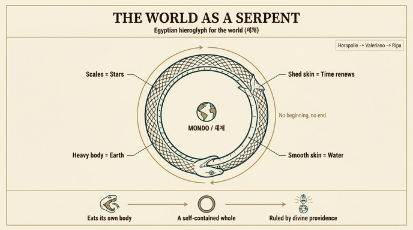

# 이집트인이 그린 '세계' — 제 꼬리를 삼키는 뱀 (우로보로스)

## 질문과 답

**Q. 이집트인들이 세계를 표기한 방식은?**

**A.** **제 꼬리를 삼키는 뱀**으로 그렸다. 갖가지 비늘은 세상의 별들을, 뱀의 무게는 대지를, 미끄러움은 물을 뜻하고, 해마다 허물을 벗듯 시간도 해마다 세상을 바꾸며 젊어진다. 제 몸을 먹이로 삼는 것은 만물이 하나님의 섭리로 세상 안에서 다스려짐을 뜻한다.

---

## 1. 출처 — Ripa 『Iconologia』의 '세계(Mondo)' 항목

이 내용은 체사레 리파(Cesare Ripa)의 『Iconologia』 중 **'MONDO(세계)'** 표제 아래, 피에리오 발레리아노(Pierio Valeriano)의 『Hieroglyphica』 제1권에 실린 도상을 설명하는 대목에 나온다. 원문의 해당 문장은 다음과 같다.

> *Volendo gli Egizij (come narra Oro Apolline) scriver il Mondo, dipingevano un Serpe che divorasse la sua coda…*
> — "이집트인들은 (오로 아폴리네가 전하듯) **세계를 적고자 할 때 제 꼬리를 삼키는 뱀을 그렸다**…"

여기서 핵심은 동사가 *scriver*(쓰다)라는 점이다. 이집트인에게 이 뱀은 그림이자 **문자(상형문자)**였다. '세계'라는 개념을 나타내는 한 글자로서 뱀을 그린 것이다.

- **오로 아폴리네(Oro Apolline)** = **호라폴로(Horapollo)**. 4~5세기에 쓰였다고 전해지는 『Hieroglyphica(히에로글리피카)』의 저자로, 1419년 그리스어 사본이 발견되어 르네상스 상징 해석의 표준 교과서가 되었다. 그 제1권 제2장이 바로 "우주(κόσμος)를 나타내려면 제 꼬리를 먹는 뱀을 그린다"는 항목이다.
- 리파는 이 호라폴로 → 발레리아노의 계보를 그대로 받아, 세계를 시각화하는 여러 방식(보카치오의 판, 발레리아노의 판, 이집트식 뱀) 중 하나로 소개한다.

## 2. 뱀 한 마리가 어떻게 '세계 전체'가 되는가 — 요소별 대응

이 도상의 묘미는 뱀의 **신체 특징 하나하나가 세계의 구성 요소에 배당**된다는 데 있다. 4원소·천체·시간·섭리가 한 몸에 압축된다.

| 뱀의 특징 | 뜻하는 것 | 원문 근거 |
|---|---|---|
| 갖가지(얼룩덜룩한) **비늘** | 세상의 **별들** | *figurato di varie squamme … le stelle del Mondo* |
| **무거움**(육중한 몸) | **대지(흙)** | *per esser quello animale grave … intesero la terra* |
| **미끄러움**(매끈함) | **물** | *è parimente sdruccioloso … è simile all'acqua* |
| 해마다 **허물벗기** | **시간의 순환과 갱신** | *muta ogni anno … divien giovane* |
| 제 **꼬리를 삼킴** | **하나님의 섭리에 의한 만유의 통치** | *adopri il suo corpo per cibo … per Divina provvidenza sono governate nel Mondo* |

### (1) 비늘 = 별
뱀 껍질의 무늬가 촘촘하고 다양하다는 점에서 밤하늘의 무수한 별을 읽어낸다. 같은 항목의 다른 도상에서도 표범 가죽의 반점이 '별로 가득한 제8천구'로 해석되고, 발레리아노 판의 '여러 색깔 긴 옷'도 별의 다양함을 뜻하는 것으로 풀린다 — 즉 **얼룩무늬=별하늘**은 리파가 반복해서 쓰는 코드다.

### (2) 무게 = 땅, 미끄러움 = 물
땅에 붙어 기어가는 육중한 몸통에서 **흙(무거움·하강)**을, 매끄럽고 유동하는 표면에서 **물(유동성)**을 끌어낸다. 4원소 중 무거운 두 원소가 뱀 한 마리의 촉감으로 표현되는 셈이다.

### (3) 허물벗기 = 시간의 갱신
뱀은 해마다 늙은 껍질(*vecchiezza*, 늙음)을 함께 벗고 다시 젊어진다. 여기서 시간이 해마다 세상을 바꾸어 **세계를 다시 젊게 만든다**는 순환적 시간관이 나온다. 리파는 같은 항목에서 '구부러진 지팡이(verga ritorta)'도 "스스로에게로 되돌아오는 **한 해(l'Anno)**"로 풀이하는데, 꼬리를 무는 뱀과 정확히 같은 '자기 회귀' 형태다.

### (4) 자기 꼬리를 먹음 = 자족성과 섭리
가장 중요한 마디다. 뱀은 **바깥에서 먹이를 구하지 않고 제 몸을 먹이로 삼는다**. 즉 세계는 자기 밖에 아무것도 없는 **닫힌 전체**이며, 필요한 모든 것을 자기 안에서 조달한다. 리파는 여기에 기독교적 해석을 덧입혀, 만물이 세계 **바깥의 우연이 아니라 하나님의 섭리(Divina provvidenza)에 의해 세계 안에서 다스려진다**는 뜻으로 마무리한다.

> 요약하면: **끝 없는 원환 = 영원한 시간**, **자기 몸을 먹음 = 자족적 전체**, **비늘/무게/미끄러움 = 별·땅·물**.

## 3. 같은 항목의 다른 '세계' 도상과 비교

리파는 '세계'를 그리는 방식을 여러 개 나열하는데, 이집트식 뱀은 그중 **가장 추상적·기호적인** 판본이다.

위 판화는 같은 'Mondo' 항목의 삽화로, **판(Pan)** 신의 모습이다. 그림에서 실제로 확인되는 요소와 그 뜻은 다음과 같다.

- 이마의 **두 뿔**이 하늘을 향함 → 해와 달, 그리고 천체가 지상에 미치는 영향
- **길게 늘어진 수염** → 위쪽 두 원소(공기·불)의 남성적 힘
- 가슴과 어깨를 감싼 **얼룩 표범 가죽** → 별로 가득한 제8천구(항성천)
- 오른손의 **끝이 말린 목자 지팡이** → 자연의 통치, 그리고 스스로에게 되감기는 '한 해'
- 왼손의 **일곱 갈대 피리(시링크스)** → 일곱 행성의 화음
- 허리 아래의 **털 많고 거친 염소 몸** → 딱딱하고 울퉁불퉁하며 초목으로 덮인 대지

'Pan'이 그리스어로 '전체(Universo)'를 뜻한다는 어원 놀이가 이 도상의 출발점이다. **판 = 신인동형(anthropomorphic)으로 그린 세계**, **우로보로스 = 기호로 압축한 세계**로 대비해 두면 기억하기 좋다. 참고로 원문 판화 중 우로보로스를 직접 새긴 도판은 실려 있지 않고, 뱀은 글로만 서술된다.

## 4. 배경 지식 — 우로보로스(Ouroboros)

- 이름은 그리스어 *οὐροβόρος*(ourá 꼬리 + borós 삼키는)에서 왔다.
- 현존 최초의 예는 기원전 14세기 **투탕카멘 무덤**의 문헌으로, 태양신의 머리와 발치를 둘러싼 뱀이 '시간 이전의 혼돈과 세계의 경계'를 나타낸다.
- 그리스-로마 시대에는 **아이온(Aion, 영원)**·**세계년(annus)**의 상징으로 정착했고, 연금술에서는 *ἓν τὸ πᾶν*("하나가 전부다") 명문과 함께 물질의 순환·통일을 뜻했다.
- 르네상스에서는 호라폴로 → 발레리아노 → 리파로 이어지며 **'세계·영원·자족'의 표준 엠블럼**이 되었고, 근대에는 케쿨레의 벤젠 고리 일화나 융의 자기(Self) 원형 논의로도 이어진다.

## 5. 암기 포인트

1. **한 문장**: "이집트인은 세계를 **제 꼬리를 삼키는 뱀**으로 썼다."
2. **4대 코드**: 비늘=별 / 무게=땅 / 미끄러움=물 / 허물=시간.
3. **결론부**: 자기 몸을 먹는다 = 세계는 자족적 전체이며, 만물이 **섭리로 세계 안에서** 다스려진다.
4. 출처 계보: **호라폴로(오로 아폴리네) → 피에리오 발레리아노 → 리파**.

## 인포그래픽

