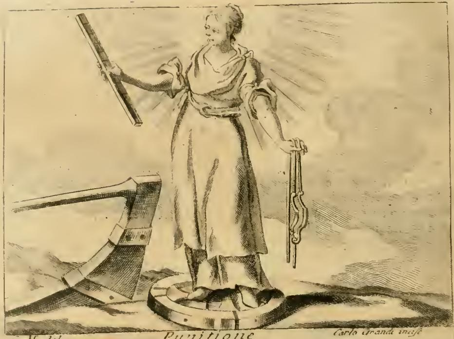
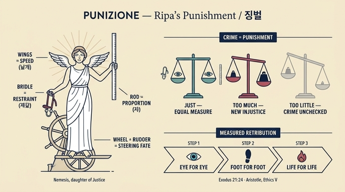

# 징벌 (PUNIZIONE) — 리파의 의인화

## 질문

리파는 '징벌(Punizione)'을 어떻게 의인화했는가?

## 원문 (Iconologia, TOMO QUARTO, "PUNIZIONE")

리파는 이 항목에 **두 개의 도상(figura)** 을 나란히 제시한다.

**제1도상 — 바퀴 위의 빛나는 여인**

> «DOnna risplendente, che sia sopra una ruota in piedi, con un Timone accanto. Nella mano destra terrà un braccio da misurare, e nella sinistra un freno.»
>
> (빛나는 여인이 바퀴 위에 서 있고, 곁에 배의 키[timone]가 있다. 오른손에는 재는 자[braccio da misurare]를, 왼손에는 재갈[freno]을 들었다.)

*원문 판독 주의: 스캔본에 `L*Jmone`으로 깨져 있는 낱말은 `Timone`(배의 키·타)이다.*

**제2도상 — 흰옷을 입은 날개 달린 여인**

> «DOnna vestita di bianco. Sarà alata. Nella destra mano terrà un passetto, ovvero legno da misurare, e nella [sinistra] un freno.»
>
> (흰옷을 입은 여인. 날개가 달렸다. 오른손에는 파세토[passetto], 즉 재는 나무자를, 왼손에는 재갈을 들었다.)
>
> *— 원문에 "nella destra … e nella destra"로 두 번 '오른손'이 나오는 것은 초판 이래의 오식이며, 다른 항목들의 관례상 두 번째는 sinistra(왼손)이다.*

**리파 자신의 해설**

> «Quella figura si rappresenta per la Dea Nemesi, onde si dice esser figliuola della Giustizia, e si veste di bianco, per la ragione detta.»
> → 이 형상은 **네메시스 여신(Dea Nemesi)** 을 나타낸 것이며, 그래서 **정의(Giustizia)의 딸**이라 일컫는다. 흰옷을 입는 이유는 다른 곳에서 말한 바와 같다(순결·결백·공정무사의 색).

> «Le ali dimostrano la velocità, e la prestezza, che si deve adoperare in punire i malvagi, ed in premiare i meritevoli.»
> → **날개**는 악인을 벌하고 공로자를 상 주는 데 써야 할 **신속함과 민첩함**을 보인다.

> «Il freno, ed il passetto da misurare, significa, che ella raffrena le lingue, e le opere cattive; misurando il modo, che né la pena, né la colpa ecceda soverchiamente, ma che serbino insieme conveniente misura, e proporzione; il che si osserva nell'antica Legge, pagando ciascuno in pena l'occhio per l'occhio, il piede per il piede, e la vita per la vita.»
> → **재갈과 재는 자**는 그가 **혀와 악행을 억제(raffrena)** 한다는 뜻이며, 동시에 **벌도 죄도 지나치지 않도록 그 정도를 재어** 서로 **알맞은 척도와 비례(conveniente misura, e proporzione)** 를 지키게 한다는 뜻이다. 이것이 **고대의 법(l'antica Legge)** 에서 지켜지던 바, 곧 각자가 "눈에는 눈, 발에는 발, 목숨에는 목숨"으로 갚는 것이다.

> «De' fatti, vedi Castigo, Giustizia &c.»
> → 관련 사례는 「징계(Castigo)」·「정의(Giustizia)」 항목 참조. — 리파 스스로 이 알레고리를 정의론 계열 안에 배치해 둔다.

## 판화

asset의 `_page_443_Picture_3.jpeg`(하단 캡션 "Punitione", 각자(刻者) 서명 "Carlo Grandi incise")가 이 항목의 판화다. 판화는 **제1도상**을 충실히 시각화한다.

- **후광처럼 뻗는 광선**: 인물의 머리·어깨 뒤로 방사선이 새겨져 있다 — 원문 `Donna risplendente`("빛나는 여인")의 시각적 번역. 징벌이 은밀한 보복이 아니라 **드러나 밝혀진 것**, 신적 정의의 광휘임을 뜻한다.
- **오른손의 긴 눈금 막대**: 치켜든 오른팔이 눈금이 새겨진 각재(角材)를 들고 있다 = `braccio da misurare`(브라치오 자). 칼이 아니라 **자**를 든 징벌이라는 점이 이 도상의 핵심이다.
- **왼손의 굽은 금속 물건**: 늘어뜨린 왼손이 재갈쇠(bit)와 고삐 고리 형태를 쥐고 있다 = `freno`(재갈).
- **발밑의 낮은 바퀴/테**: 인물은 지면에 놓인 둥근 바퀴(ruota) 위에 두 발로 서 있다.
- **화면 왼쪽 아래의 큰 방향타**: 손잡이(틸러)가 달린 널찍한 배의 키 = `timone`. 인물이 쥐지 않고 **곁에 놓여(accanto)** 있는 것까지 원문과 일치한다.

즉, 판화에서 실제로 관찰되는 요소(광선·자·재갈·바퀴·키)가 제1도상 텍스트와 1:1로 대응한다. 날개와 흰옷은 제2도상의 속성이라 이 판화에는 나타나지 않는다(판화 인물의 옷 자체는 밝게 남겨져 있으나 날개는 없다).

## 지물 풀이

| 지물 | 원문 어구 | 의미 |
|---|---|---|
| 빛남(광휘) | `Donna risplendente` | 징벌의 공개성·신적 명료함 |
| 바퀴 (ruota) | `sopra una ruota in piedi` | 운명의 수레바퀴 위에 **군림**함 — 흥망의 회전을 밟고 서서 그것을 지배 |
| 배의 키 (timone) | `con un Timone accanto` | 인간사의 **방향을 조종**함, 사건의 항로를 잡음 |
| 재는 자 (braccio / passetto) | `braccio da misurare`, `legno da misurare` | 벌의 **양(量)을 계량** — 죄와 벌의 비례 |
| 재갈 (freno) | `un freno` | `raffrena le lingue, e le opere cattive` — **혀와 악행의 제어** |
| 날개 (ali) | `Sarà alata` | 상벌의 **신속성**(velocità, prestezza) |
| 흰옷 | `vestita di bianco` | 순결·결백, 사심 없는 심판(리파가 「순결」·「정숙」 항목에서 반복하는 근거) |

## 그리스 네메시스 도상과의 관계

리파가 "이 형상은 네메시스 여신이다"라고 못 박은 것은 고대 도상 전통을 그대로 계승한 결과다.

**1) 람누스(Rhamnous)의 네메시스 — 파우사니아스 『그리스 안내기』 1.33**
아티카 북동부 람누스의 네메시스 성소에 있던 페이디아스(또는 그 제자 아고라크리토스) 작 신상을 파우사니아스가 기록한다. 파로스 대리석 한 덩이로 만들었는데, 그 돌은 **아테네를 이미 정복한 줄 알고 승전 기념물을 미리 세우려 마라톤에 실어 온 페르시아군의 돌**이었다는 일화가 붙는다. 오만(hybris)의 재료가 오만을 벌하는 신상이 되었다는 이 이야기 자체가 네메시스의 정의(定義)다. 신상은 손에 사과나무 가지와 파테라를 들고, 관에는 사슴과 작은 니케들이 새겨져 있었다.
→ 리파의 "정의의 딸"이라는 계보 규정은 이 응보신의 성격을 정의(Giustizia)의 하위 덕으로 재배치한 것이다.

**2) 자와 재갈을 든 네메시스 유형 — 스미르나(Smyrna)의 두 네메시스**
헬레니즘·로마 시대에 널리 퍼진 네메시스 도상은 **큐빗자(pēchys, 척도 막대)** 와 **재갈(고삐)** 을 지물로 삼는다. 스미르나 주화와 봉헌 부조에 반복되는 유형으로, 자는 "제 몫의 척도를 넘지 못하게 재는" 도구, 재갈은 "고삐 풀린 자를 제어하는" 도구다. 옷깃을 당겨 가슴에 침을 뱉는 몸짓(오만을 물리치는 벽사 동작)과 함께 나타나기도 한다.
→ **리파의 `braccio da misurare`(또는 `passetto`)와 `freno`는 정확히 이 그리스 유형의 라틴/이탈리아어 번역이다.**

**3) 바퀴·키·날개 — 아드라스티아(Adrastia)로서의 네메시스, 암미아누스 마르켈리누스 14.11.25**
4세기 암미아누스는 갈루스의 죽음을 다룬 뒤 정의에 관한 여담에서 네메시스를 **아드라스티아**("피할 수 없는 자")라 부르며 "악행의 처벌자요 선행의 후원자"로 묘사하고, 날개·조타(방향타)·아래에 놓인 바퀴를 그 표지로 든다. 날개는 **신속함**, 키는 **인간사의 조종**, 바퀴는 **운의 회전 위에 군림함**을 뜻한다.
→ 리파의 제1도상(바퀴+키)과 제2도상(날개)은 이 아드라스티아 계열 기술을, 스미르나 계열의 자+재갈과 **한 항목 안에 합성**한 것이다. 결과적으로 티케/포르투나(바퀴·키)와 정의(자·재갈)가 한 몸에 겹쳐진다.

**4) 마크로비우스 『사투르날리아』**
마크로비우스는 신들을 태양신학·자연신학으로 환원해 설명하는 대목에서 네메시스를 오만을 억누르는 힘으로 다룬다. 르네상스 도상학자들(피에리오 발레리아노, 카르타리, 지랄디)이 즐겨 인용한 이 계열의 고전 전거가 리파의 항목 배후에 있다. 리파는 개별 인용을 생략하고 결론만 취했다.

## 탈리오 법과 비례 응보

**1) 리파가 든 "고대의 법" = 탈리오 법(lex talionis)**
"눈에는 눈, 발에는 발, 목숨에는 목숨"은 출애굽기 21:23-25의 정식이다.

> "생명은 생명으로, 눈은 눈으로, 이는 이로, 손은 손으로, **발은 발로**, 화상은 화상으로, 상처는 상처로, 타박상은 타박상으로 갚을지니라." (출 21:23-25; 병행 레 24:19-20, 신 19:21)

리파가 순서를 "눈–발–목숨"으로 잡은 것도 이 구절의 어휘 목록에서 온 것이다.

**중요한 독법**: 리파는 이 조항을 **보복의 허가**로 읽지 않고 **상한(上限)** 으로 읽는다. 원문이 말하는 것은 `né la pena, né la colpa ecceda` — **벌도 죄도 넘치지 않게** 하라는 것이다. 즉 탈리오는 "반드시 눈을 뽑아라"가 아니라 "**눈 이상은 안 된다**"는 계량 규칙이며, 그래서 그 상징이 칼이 아니라 **자(척도)** 이고, 그 보조 지물이 **재갈**(과잉의 제어)이다. 이는 탈리오 조항을 무제한 복수(창세기 4:23-24 라멕의 노래)에 대한 제한 장치로 보는 표준적 해석과 합치한다.

**2) 아리스토텔레스적 정의론과의 접속 — 『니코마코스 윤리학』 5권**
아리스토텔레스는 정의를 나눈다.

- **분배적 정의(dianemētikon)**: 공동의 재화를 **기하학적 비례**로 배분 — 몫 : 몫 = 자격 : 자격.
- **교환적/시정적 정의(diorthōtikon, 시정 정의)**: 사적 거래와 불법 행위에서 발생한 **이득과 손실의 차이를 산술적 비례**로 상쇄 — 가해자가 얻은 초과분을 정확히 되돌려 **중간(to meson)** 을 회복.

리파의 자(척도)는 바로 이 **시정 정의의 중간 회복** 도구다. 벌은 "죄가 만든 불균형만큼"이어야 하며, 그보다 크면 새로운 불의를, 작으면 방치를 낳는다. 아리스토텔레스가 5권에서 피타고라스학파의 "**당한 대로 되받음(antipeponthos)**" 즉 탈리오적 상호성을 인용하면서도, 그것이 곧바로 정의는 아니고 **비례(kat' analogian)** 로 조정되어야 한다고 단서를 붙인 것도 같은 문제의식이다(관직자를 때린 것과 관직자가 때린 것은 등가가 아니다).

**3) 세 전거의 종합**
따라서 리파의 「징벌」은 세 층이 겹친 합성 알레고리다.

| 층 | 전거 | 지물 |
|---|---|---|
| 그리스 응보신 | 파우사니아스(람누스), 스미르나 유형, 마크로비우스 | 자, 재갈 |
| 불가피한 운명의 조종자 | 암미아누스의 아드라스티아 | 바퀴, 키, 날개 |
| 성서·철학의 비례 규범 | 출애굽기 21:24, 아리스토텔레스 EN 5권 | 자(계량), 재갈(억제) |

핵심 메시지는 한 문장으로 압축된다: **징벌은 빠르되(날개) 자의적이지 않으며, 죄의 크기를 자로 재어 그만큼만 가하고(자), 그 이상으로 치닫는 분노와 혀를 스스로 물린다(재갈).** 정의의 딸이라는 계보와 흰옷은 이 절제가 곧 정의의 조건임을 보증한다.

## 관련 항목

- **Castigo(징계)** / **Giustizia(정의)** — 리파가 직접 지시한 상호참조.
- **Fortuna(운명)** — 바퀴·키를 공유. 포르투나는 눈이 가려진 채 바퀴를 돌리지만, 징벌은 **눈을 뜨고(빛나며) 바퀴를 밟고 선다**는 점에서 대비된다.
- **Nemesi / Vendetta(복수)** — 복수는 자와 재갈이 없는 응보, 곧 척도를 잃은 징벌이다.

## 인포그래픽

