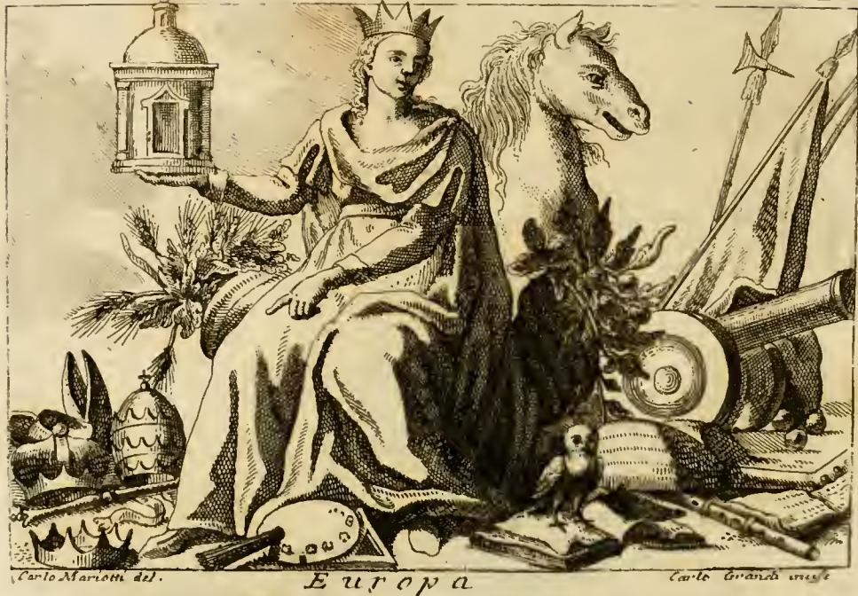

# 유럽(Europa) 도상 — 왕관·신전·풍요의 뿔

## 질문

유럽 도상에서 왕관·신전·풍요의 뿔은 무엇을 뜻하는가?

## 핵심 답

| 지물 | 의미 |
|---|---|
| **왕관 (corona)** | 유럽은 언제나 온 세계의 **우두머리이자 여왕**이었다 (superiore, e Regina di tutto il Mondo) |
| **신전 (Tempio)** | 유럽에는 **완전하고 참된 종교**, 즉 그리스도교가 있다 (la perfetta, e verissima Religione) |
| **두 개의 풍요의 뿔 (due cornucopia)** | **스트라본**이 말한 대로 유럽은 다른 어느 대륙보다 **비옥하고 풍요**하다 |

여기에 더해 **'유럽'이라는 이름 자체**는, 유피테르(제우스)가 크레타(칸디아) 섬으로 납치해 간 **페니키아 왕 아게노르의 딸 에우로파**에서 왔다.

## 원본 판화

판화에서 실제로 확인되는 요소들:

- **머리의 왕관** — 앉아 있는 여인이 뾰족한 첨두 왕관을 쓰고 있다. "세계의 여왕"이라는 주장.
- **오른손의 신전** — 오른손을 앞으로 뻗어 **돔이 얹힌 원형 신전(템피에토)** 모형을 들어 보인다. 참된 종교가 유럽에 자리한다는 표시.
- **왼손 검지가 가리키는 것들** — 화면 왼쪽 아래에 **교황 삼중관(tiara)과 주교관, 왕관들**이 흩어져 있고 여인의 검지가 그쪽을 가리킨다. "유럽에는 세계에서 가장 크고 강력한 군주들이 있다" — 즉 **황제(Maestà Cesarea)**와 **로마 교황**.
- **말과 무기, 군기** — 오른쪽에 말머리와 창·방패·대포·기치. 유럽이 **무력(armi)**에서 우월함.
- **책 위의 올빼미** — 화면 하단 중앙 오른쪽. **학문(lettere)**에서의 우월함.
- **악기(피리·현악기), 직각자, 끌, 팔레트와 붓** — 하단에 늘어놓여 있다. **자유 학예 전반**, 특히 회화·조각·건축에서 뛰어난 인물(그리스인·라틴인 등)을 배출했음.
- **양옆의 초목 다발** — 여인의 좌우로 곡식 이삭과 과실이 달린 다발이 뻗어 있다. 텍스트가 말하는 **교차된 두 개의 코르누코피아**에 해당한다.

## 원문 근거 (Iconologia, "EUROPA — Di Cesare Ripa")

도상 지시문:

> DOnna ricchissimamente vestita di abito reale di più colori, con una **corona** in testa, e che sieda in mezzo di **due cornucopia incrocciati**: l'uno pieno di ogni sorta di frutti, grani, migli, panichi, risi, e simili, e l'altro di uve bianche, e nere. Colla destra mano tiene un bellissimo **Tempio**; e col dito indice della sinistra mano mostri regni, corone diverse, scettri, ghirlande…

→ 왕관을 쓰고, **교차된 두 개의 풍요의 뿔** 사이에 앉은 여인. 한쪽 뿔에는 온갖 과일·곡물(밀, 기장, 조, 쌀 등), 다른 쪽 뿔에는 **흰 포도와 검은 포도**가 가득하다. 오른손에는 아름다운 **신전**, 왼손 검지로는 왕국·여러 왕관·홀·화관 등을 가리킨다.

해설부:

- **어원** — "Europa è prima, e principale parte del Mondo, come riferisce Plinio nel terzo libro, capitolo primo; e tolse quello nome da Europa, figliuola di **Agenore Re de' Fenici**, rubbata, e condotta nell'**Isola di Candia** da **Giove**." (플리니우스 『박물지』 3권 1장: 유럽은 세계의 첫째가는 주요 부분. 이름은 유피테르가 크레타로 납치해 간 페니키아 왕 아게노르의 딸 에우로파에서 유래)
- **의복** — 여러 색의 왕의 의복. 유럽의 풍부함, 그리고 **스트라본 2권**이 말하듯 세계의 다른 부분보다 형태가 더 다양하기 때문.
- **왕관** — "per mostrare che l'Europa è stata sempre **superiore, e Regina di tutto il Mondo**."
- **두 풍요의 뿔** — "come dimostra **Strabone** nel luogo citato di sopra, è questa parte sopra tutte le altre **feconda, e abbondante** di tutti que' beni, che la natura ha saputo produrre."
- **신전** — "per dinotare, ch'in lei al presente ci è la **perfetta, e verissima Religione**, e superiore a tutte le altre."
- **검지가 가리키는 왕관·홀** — 유럽에 세계 최대·최강의 군주들이 있기 때문. 황제와 로마 교황이 그 예이며, 교황의 권위는 가톨릭 신앙이 미치는 모든 곳, "오늘날에는 **신세계(nuovo Mondo)**에까지" 뻗친다.

## 읽는 법: 이 도상이 하는 일

리파의 「Europa」 항목은 대륙을 **의인화(personification)**한 4대륙 연작(Europa / Asia / Africa / America) 중 첫 번째다. 세 지물은 각각 다른 층위의 우월성을 주장한다.

1. **정치적 우위** — 왕관 + 검지가 가리키는 왕관·홀 무더기 + 말과 무기.
2. **종교적 우위** — 손에 든 신전. 다른 대륙(아시아의 향로, 아프리카·아메리카의 이교적 지물)과 대비되는 "유일하게 참된 종교".
3. **물질적 풍요** — 두 개의 코르누코피아. 근거로 **스트라본**을 든다. 곡물과 포도로 나눈 것은 사실상 **빵과 포도주**, 즉 유럽 농경의 두 축이자 성찬의 두 요소를 겹쳐 읽게 한다.
4. **문화적 우위** — 책 위 올빼미(지혜/학문), 악기, 직각자·끌·팔레트(건축·조각·회화).

즉 **한 인물 안에 정치·종교·경제·학예의 네 가지 패권 주장을 압축**해 놓은 것으로, 대항해 이후 유럽 중심주의를 시각 언어로 정식화한 대표적 사례다.

## 관련 항목 — 황소 위의 에우로파

같은 항목 뒤에 리파는 **메달에 새겨진 에우로파(EUROPA DA MEDAGLIE)**를 따로 다룬다. 여기서는 신화 장면 그대로, 황소로 변신한 유피테르 등에 올라탄 처녀가 등장하고, 머리 위로 부푼 베일이 돛처럼 펼쳐진다.

- 황소는 **흰 황소를 선수상(船首像)으로 단 배**의 형상이라는 해석이 붙고, 부푼 베일은 그 배의 **돛**이다.
- 황소 다리 사이에 놓인 **줄기 달린 (참나무) 잎**은 **이탈리아**를 뜻한다. 플리니우스가 이탈리아를 "폭보다 훨씬 긴 참나무 잎 같다"고 한 데서 왔고, 높은 줄기는 **알프스**를 가리킨다. 이탈리아는 "유럽의 품에 안긴, 유럽의 토대이자 으뜸가는 장식이며 **유럽의 머리(capo di Europa)**"라는 것.
- 'Italia'라는 이름도 고대 그리스에서 황소를 'Itali'라 부른 데서 왔다는 어원(티마이오스·바로·섹스투스 폼페이우스)이 붙는다.

따라서 **왕관·신전·코르누코피아 유형**(리파 자신의 창안)과 **황소를 탄 에우로파 유형**(고대 메달·신화)은 같은 항목 안의 두 갈래이며, 카드가 묻는 것은 앞의 유형이고 뒤의 신화는 그 **이름의 유래**를 설명한다.

## 출처

`.fm/assets/07 The World and the Continents to Death.md` — "EUROPA. Una delle Parti principali del Mondo. Di Cesare Ripa" 및 "EUROPA DA MEDAGLIE" 항목.
판화: `Iconologia (Cesare Ripa)/_page_165_Picture_4.jpeg` (Carlo Mariotti del. / Carlo Grandi inc.)
