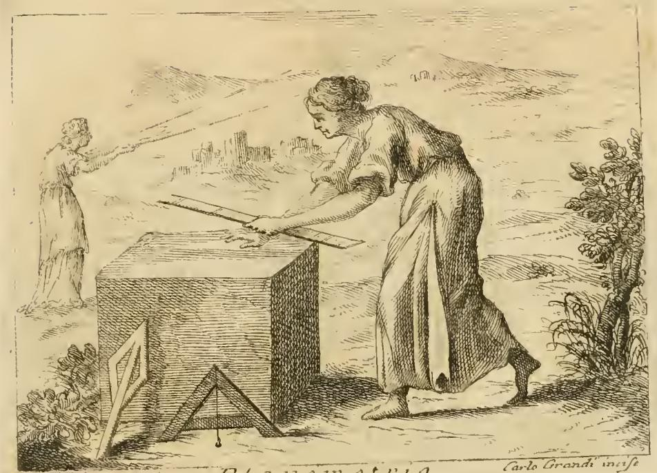

# 하나님의 말씀(PAROLA DI DIO) — 다림추·횃불·샘

## 카드 한눈에

| 지물 | 뜻 | 근거 성구 |
|---|---|---|
| **다림추**(archipendolo) | 말씀이 **의롭고 곧아**, 사람을 **바름(rettitudine)으로 인도**한다 | "주의 말씀은 곧다" — 시 32:4(불가타) |
| **켜진 횃불**(face accesa) | 말씀이 **모든 사람을 비추어** **낙원의 곧고 참된 길**로 이끈다 | "주의 말씀은 내 발의 등불" — 시 118:105(불가타) |
| **샘**(fonte) | 그 물이 **세속의 욕망과 악한 성향의 갈증을 끄고**, 나아가 **낙원의 큰 바다로 흐르는 수로(acquedotto)** | "하나님의 말씀은 지혜의 샘" — 집회서 1:5 |

원문의 핵심 한 문장씩:

> "Quindi vi è l'archipendolo, ch'è misura, quale aggiusta l'artificio delle fabbriche."
> (그래서 다림추가 있으니, 이는 **건축물을 바로잡는 척도**다.)

> "Vi è la face accesa, perché la parola del Signore illumina tutte le genti, e le conduce pel diritto, e vero sentiero del Paradiso."
> (켜진 횃불이 있는 것은, 주의 말씀이 **모든 백성을 비추어 낙원의 곧고 참된 길로 인도**하기 때문이다.)

> "E per fine vi è il fonte, le cui acque smorzano la sete, com'ella i mondani desiderj, e naturali inclinazioni cattive, ed è peranche un acquedotto, che giunge al vasto Mare del Paradiso."
> (끝으로 샘이 있으니, 그 물이 갈증을 끄듯 말씀은 **세속적 욕망과 타고난 악한 경향**을 끄며, 또한 **낙원의 광대한 바다에 이르는 수로**다.)

---

## 도상 전체 구성 (문두 기술, descrizione)

> "DOnna vaga, e bella, che seminerà il grano in un bel campo, e nell'altra mano avrà una spada acuta. Le sarà a' piedi l'archipendolo. Vicino le sarà un vaso di argento, una face accesa, ed un fonte."

곱고 아름다운 여인이 **좋은 밭에 곡식을 뿌리고**, 다른 손에는 **날카로운 검**을 들었으며, **발밑에 다림추**가 있고, 옆에 **은 항아리·켜진 횃불·샘**이 놓여 있다.

즉 지물은 여섯이고, 이 카드가 묻는 것은 그중 **뒤쪽 세 개(다림추·횃불·샘)** 다. 앞쪽 세 개도 함께 외워두면 헷갈리지 않는다.

| 지물 | 뜻 | 근거 |
|---|---|---|
| 뿌리는 곡식 | 설교자가 뿌리는 말씀. 곡식이 땅을 단장·비옥하게 하고 잡목을 걷어내듯, 말씀이 영혼의 밭에서 **악덕의 잡초를 뿌리 뽑아** 하늘의 추수에 이르게 한다. 또 곡식은 **선택받은 자(eletti)** 의 상징(스가랴 9:17) | 눅 8:5, 막 4:14 |
| 날카로운 검 | 말씀이 검보다 예리하게 **마음을 찔러 들어감** | 히 4:12, 시 56:5, 시 63:4 (피에리오 발레리아노 42권) |
| 은 항아리(향유 단지) | 상처의 통증을 없애고 낫게 하는 **약(향유)**. 죄의 궤양을 치유하고 지옥 형벌의 고통을 제거함 | 시 106:20 "그가 말씀을 보내어 그들을 고치셨다" |

이 항목은 **체사레 리파 본인이 아니라 프란치스코회 신부 프라 빈첸초 리치(Del P. Fra Vincenzo Ricci M. O.)** 가 쓴 종교적 증보 항목이다. 원문 표기는 "Del T. Fra Vincenzo Ricci M. O."(OCR 오독). 리치 항목의 특징대로 마지막에 **"Alla Scrittura Sagra"**(성경 대조) 단락이 붙어, 지물마다 성구를 하나씩 짝지어 준다.

---

## 다림추(archipendolo)가 실제로 어떤 물건인가

`archipendolo`는 오늘날 말로 **다림추 달린 수평기(plumb level)** — 목수가 쓰는 **A자(또는 삼각) 틀의 꼭짓점에 실과 납추를 매단 도구**다. 추가 밑변 중앙 표시에 정확히 오면 그 면이 수평·수직으로 "바르다"는 뜻이 된다. 그래서 리치는 "**건축물을 바로잡는 척도**"라고 설명한다.

이 판본의 PAROLA DI DIO 항목에는 도판이 붙어 있지 않다. 다만 같은 책 **PLANEMETRIA(측지술)** 도판에 같은 도구가 그려져 있어, 생김새를 확인할 수 있다.

그림에서 볼 것:

- 화면 **왼쪽 아래, 여인의 발밑**에 세워진 **삼각형 나무 틀**이 archipendolo다. 꼭짓점에서 실이 내려오고 그 끝에 **작은 납추(추 방울)** 가 매달려 있는 것이 보인다. → 카드의 "발밑의 다림추(le sarà a' piedi l'archipendolo)"가 바로 이 배치·이 물건이다.
- 그 왼쪽에 겹쳐 놓인 얇은 **직각자(squadra)** 도 보인다. 리파는 다른 항목 **ORDINE DIRITTO, E GIUSTO(바르고 의로운 질서)** 에서 "이집트인은 어떤 것이 **곧고 바르게 이루어졌음**을 나타낼 때 **archipendolo와 squadra**로 표현했다(피에리오 발레리아노 49권)"라고 못 박는다. 즉 다림추는 리파 체계 안에서 **일관되게 '곧음·바름'의 표준 기호**다.
- 여인은 야곱의 지팡이(baculo di Iacob)로 땅을 재고 있다. 측정 도구는 손에, **기준을 잡아 주는 다림추는 발밑에** 두는 구도가 PAROLA DI DIO의 구도와 같다.

> 주의: 이 도판은 **PLANEMETRIA 항목의 그림**이며 하나님의 말씀 도상 자체가 아니다. 여기서는 "archipendolo가 어떤 물건인지"를 눈으로 확인하는 용도로만 본다.

---

## 세 상징 상세

### 1) 다림추 — 곧음(rettitudine)

- 검 설명 바로 뒤에 이어지는 논리다. "말씀은 그토록 **의롭고 바르기에**(giusta e retta), **의로운 것과 바름으로 곧게 향하게 한다**(al giusto ed alla rettitudine dirizza). 그래서 다림추가 있다."
- 성경 대조 단락: **"L'archipendolo per la rettitudine"** — 시 32:4(불가타) *Quia rectum est verbum Domini, et omnia opera ejus in fide* = "주의 말씀은 곧으며 그 모든 행사는 진실하다"(개역 시 33:4).
- 핵심은 **도덕적 직선성**: 말씀이 곧기 때문에, 그것을 기준으로 삼으면 사람의 삶도 수직·수평이 맞는 건축물처럼 바로 세워진다.

### 2) 켜진 횃불 — 비춤(luce)

- 근거는 **시 118:105(불가타)** *Lucerna pedibus meis verbum tuum* = "주의 말씀은 내 발의 등불"(개역 시 119:105). 리치는 이를 "말씀이 **세상의 빛 역할(ufficio di luce del Mondo)**"을 한다고 정리한다.
- 성경 대조 단락에서는 잠언도 덧붙인다: *Lucerna Domini spiraculum hominis*("사람의 영혼은 주의 등불" — 잠 20:27. 원문 인용은 "Pr. 30. v. 27"로 오기).
- 리치의 인상적인 부연: **밤의 빛이 새와 들짐승에게 정반대로 작용**한다. 새에게 비추면 온순해져 쉽게 잡히지만, 이리·곰 같은 맹수에게 비추면 순식간에 더 흉포해져 달아난다. 말씀도 그렇다 — **선한 자는 순종하며 잡히지만(mansueti e osservanti), 버림받은 자는 그 말씀을 듣고 오히려 덕에서 도망쳐 완고함 속에 흉포해진다.** (요 8:47 *Qui ex Deo est verba Dei audit*)
- 그래서 횃불의 뜻은 단순한 "지식의 빛"이 아니라 **"모든 백성을 비추어 낙원의 곧고 참된 길로 데려가는 인도의 빛"** 이다.

### 3) 샘 — 갈증을 끔 + 낙원으로 흐르는 수로

- 두 겹의 뜻이 있다.
  1. **끄는 기능**: 물이 갈증을 끄듯, 말씀은 **세속적 욕망(mondani desiderj)과 타고난 악한 경향(naturali inclinazioni cattive)** 의 갈증을 끈다.
  2. **흐르는 기능**: 그 샘은 **낙원의 광대한 바다(vasto Mare del Paradiso)에 도달하는 수로(acquedotto)** 이기도 하다. 즉 종착지가 있는 물길이다.
- 성경 대조: **집회서(Ecclesiasticus/Siracide) 1:5** *Fons sapientiae verbum Dei in excelsis, ingressus illius mandata aeterna* = "지혜의 샘은 높은 곳에 있는 하나님의 말씀이요, 그 입구는 영원한 계명이다." → 카드 답의 "'하나님의 말씀은 지혜의 샘' — 집회서"가 이 구절이다. (불가타 목록에서 Ecclesiasticus = 집회서/시락서. **전도서 Ecclesiastes와 다른 책**이니 주의.)
- 항목 앞부분에도 물 이미지가 연속으로 나온다: "말씀은 **공로와 은총의 가장 단 물을 맛보는 샘**이며, **은빛 액체(divini favori)로 가득한 강**이며, 참된 영적 선의 꽃이 피는 아름다운 초원이다." 또 요한계시록 1:13~15을 인용해 **그 목소리가 "많은 물소리 같다"** 고 하며, "물이 모든 얼룩을 씻고 닦아내듯 말씀은 죄의 굳음과 추함을 씻는다"고 한다.

---

## 성구 대조표 (Alla Scrittura Sagra 단락 그대로)

| 지물 | 라틴어 인용 | 출처(원문 표기 → 실제) |
|---|---|---|
| 뿌리는 곡식 | *Exiit qui seminat seminare semen suum* | "Luc. 4. v. 9" → 눅 8:5 |
| 날카로운 검 | *Vivus est et efficax sermo Dei, et penetrabilior omni gladio ancipiti* | 히 4:12 |
| **다림추** | *Quia rectum est verbum Domini, et omnia opera ejus in fide* | 시 32:4(불가타) = 시 33:4 |
| 은 항아리(향유) | *Misit verbum suum, et sanavit eos* | 시 106:20(불가타) = 시 107:20 |
| **횃불(등불)** | *Lucerna pedibus meis verbum tuum* / *Lucerna Domini spiraculum hominis* | 시 118:105(불가타) = 시 119:105 / "Pr. 30. v. 27" → 잠 20:27 |
| **샘** | *Fons sapientiae verbum Dei in excelsis* | 집회서(Eccli.) 1:5 |

※ 원문 인용 번호에 오식이 여럿 있다(마르코 4:17, 잠언 30:27 등). OCR 오류와 18세기 판본의 인쇄 오류가 겹친 결과이며, 카드 답의 내용 자체는 원문 설명과 일치한다.

---

## 암기 팁

**"곧게 → 비추어 → 적신다"** 순서로 붙이면 세 지물이 한 문장으로 이어진다.

- **다림추**: 자·추 → **곧음** → "주의 말씀은 **곧다**"
- **횃불**: 불 → **길 안내** → "내 **발**의 등불" (발 → 걸어갈 길 → 낙원의 길)
- **샘**: 물 → **갈증 끄기 + 흘러가기** → "지혜의 **샘**"(집회서) → 낙원의 바다까지 이어지는 수로

혼동 주의:
- **횃불이 '지혜'가 아니라 '비춤·인도'**, **샘이 '비춤'이 아니라 '갈증 끔·수로'** 다. 서로 바꿔 답하기 쉽다.
- **치유**는 횃불이나 샘이 아니라 **은 항아리(향유)** 의 몫이다.
- **마음을 찌르는 예리함**은 다림추가 아니라 **검**의 몫이다. 다림추는 '찌름'이 아니라 '**바로잡음**'.
