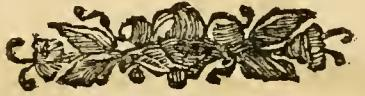

# NESCIO — '공로'가 자기 자신에 대해 "나는 모른다"고 말할 때

**질문** — 리치가 그린 '공로'(Merito) 도상에서 'NESCIO' 문구는 무엇을 뜻하는가?

**답** — '나는 모른다'라는 뜻으로, 하나님 앞에서 우리 공로의 불확실성을 나타낸다. 그래도 선을 행하면 하나님의 보답이 없지 않으리라는 확신으로 공로를 쌓으려 힘써야 하며, 하늘의 두 손이 보석 왕관과 구체를 든 광채는 우리의 선이 하나님에게서 나고 우리 운명이 그분 손에 있음을 뜻한다.

이 카드의 핵심은 **역설**이다. '공로'라는 미덕의 인격화가, 자기 입으로 자기에 대해 말하는 단 하나의 말이 "**나는 모른다**"라는 것.

---

## 1. 원문 서술 (Perugia판 Iconologia, MERITO 항목 각주 [j])

먼저 원문을 정확히 옮긴다. 이 각주가 붙는 앞 문장이 중요하다.

> **Ma perchè il Merito è cosa che avanza le nostre parole, lascieremo che egli medesimo a maggior efficacia parli di sé stesso. [j]**
>
> "그러나 공로란 우리의 말을 넘어서는 것이므로, 더 큰 효력을 위해 **그 자신이 스스로에 대해 말하도록** 두겠다." [j]

즉 저자는 "말로는 부족하니 공로가 직접 말하게 하자"라고 선언하고, 각주에서 리치의 도상을 제시한다. 그리고 그 도상에서 공로가 실제로 들고 있는 말이 `NESCIO`다. **"공로가 자기에 대해 말하게 하자" → 공로가 말하는 것은 "나는 모른다"** — 이 수사적 장치가 이 항목 전체의 뼈대다.

### 도상 규정 (각주 [j] 본문)

> Piacque al P. Ricci di figurare il Merito: **Giovane robusto**, con abito di color **rosso**, fregiato, ed ornato di **verde** nel di sopra. Sul detto abito sono dipinte **molte mani**. In una mano tiene un **cartello col detto: NESCIO**. In alto si vede uno **splendore con due mani**, una delle quali tiene una **corona ricca di gemme**, l'altra una **figura sferica**.

- **건장한 젊은이**(giovane robusto)
- **붉은** 옷, 위쪽은 **초록**으로 장식
- 옷 위에 **여러 개의 손**이 그려져 있음
- 한 손에 **`NESCIO`라 쓰인 카르텔로(cartello, 명패/두루마리)**
- 위쪽에는 **광채(splendore) 속에서 나온 두 손** — 하나는 **보석이 가득한 왕관**, 다른 하나는 **구형(球形)의 물체**를 들고 있음

### 해설 (원문의 축자적 번역)

| 요소 | 원문 | 뜻 |
|---|---|---|
| 건장한 젊은이 | *per dimostrare la forza delle opere buone appresso Iddio* | **하나님 앞에서 선행이 갖는 힘**을 보이기 위함 |
| 붉은 옷 | *per indicare la grazia, e la carità che vanno col merito* | 공로와 함께 가는 **은총(gratia)과 사랑(caritas)** |
| 초록 장식 | *significa la speranza del Cielo, quale non vi sarebbe, se non vi fosse il merito* | **하늘의 희망(spes)**. 공로가 없다면 그 희망도 없을 것 |
| 그려진 손들 | *ombreggiano le opere buone, quali principalmente sono eseguite dalle mani, e da' piedi* | **선행**. 선행은 주로 손과 발로 행해지므로 |
| **NESCIO 명패** | *rappresenta l'incertezza del nostro merito appresso Dio* | **하나님 앞에서 우리 공로의 불확실성** |
| (이어지는 괄호) | *Dobbiamo però sempremmai affaticarsi per acquistarlo, essendo sicuri che operando noi bene, a noi non mancherà la divina retribuzione.* | 그래도 **언제나 공로를 얻으려 애써야** 한다. 우리가 선을 행하면 **신적 보답(divina retribuzione)이 우리에게 없지 않으리라**는 확신이 있으므로 |
| 광채 속 두 손 + 왕관 + 구체 | *denota che il nostro bene nasce da Dio, e non da noi; che la nostra sorte sia nelle sue mani, e che da per noi a nulla vagliamo* | **우리의 선은 하나님에게서 나고 우리에게서 나지 않으며, 우리 운명은 그분의 손 안에 있고, 우리 스스로는 아무 가치도 없음** |

마지막 구절 *"da per noi a nulla vagliamo"*("우리 스스로는 아무것도 값하지 않는다")가 NESCIO의 논리적 근거다. 카드 답의 세 요소 — ① 불확실성 ② 그럼에도 힘써야 함 ③ 두 손·왕관·구체의 의미 — 가 원문에서 각각 위 세 단락에 정확히 대응한다.

> **주의(원문 구조)**: 괄호 `( ... )` 안의 "그래도 언제나 힘써야 한다" 문장은 이 판본의 관례상 **편집자 체사레 오를란디(Cesare Orlandi)의 보충 논평**일 가능성이 높다. 즉 리치의 원 도상 해설은 "불확실성"까지이고, "그래도 보답은 있다"는 균형추는 편집자가 덧붙인 것으로 읽을 수 있다. (판본 관례에 근거한 추정이며 단정하지 않는다.)

---

## 2. '리치'는 누구인가 — 화가가 아니라 신학자다

이 부분은 흔히 오인되므로 확인해 두어야 한다.

**결론: `P. Ricci`는 화가 조반니 바티스타 리치 다 노바라(Giovanni Battista Ricci da Novara, 1537–1627)가 아니다.** 같은 자료집 다른 챕터에서 이 인물의 전체 이름이 반복적으로 표기된다.

> `#### Del P. Fra Vincenzio Ricci M. O.`
> — `01 Weariness to Pandering.md` (3회), `17 Practice to Providence.md` (2회) 등

- **P.** = *Padre*(신부), **Fra** = *Frate*(수사), **M. O.** = *Minore Osservante*(프란치스코회 준수파)
- 즉 **프란치스코회 수사 신부 빈첸초 리치**이며, 웹 확인 결과 **빈첸초 리치 다 산 세베로(Vincenzo Ricci da San Severo)**, 저서 **《Geroglifici morali》(도덕적 상형문자, 1626, 나폴리)**의 저자다. 부제에 "설교자·연설가 및 그 밖의 학구자에게 유용한, 따라야 할 여러 미덕과 피해야 할 악덕에 관한" 저작이라 밝히고 있다.
- Perugia판(1764–67, 오를란디 증보) *Iconologia*는 리파 원문에 이 《Geroglifici morali》의 도상 규정들을 **각주로 대량 증보**했다. `P. Ricci`로 시작하는 각주가 자료집 전반에 흩어져 있다 — Pigrizia(나태), Povertà di Spirito(영적 가난), Pazzia(광기), Peccato(죄), Penitenza(참회), Predestinazione(예정), Morte(죽음), Libertà(자유), Liberalità(관대) 등.

**따라서 "리치가 그린"은 물감으로 그린 벽화가 아니라, 화가들을 위해 말로 규정한 도상 처방이다.** 결정적 증거는 같은 리치 각주의 마무리 문구다.

> *"Basta ciò per i pittori."* — "화가들에게는 이것으로 충분하다." (`17 Practice to Providence.md`, Predestinazione 항목)

리치의 서술이 **실행된 그림이 아니라 그림을 위한 지시문**임을 저자 자신이 명시한다. (부수적으로, 리치 도상의 문법적 일관성도 이를 뒷받침한다. Merito의 "옷에 그려진 여러 손"은 Predestinazione 항목의 "옷에 그려진 여러 손과 발"과 동일한 어휘를 쓴다.)

### 참고: '상서원 홀'은 별개 항목이다

이 카드와 관련해 반드시 구분해야 할 점. **NESCIO는 로마 상서원(Palazzo della Cancelleria) 벽화의 명문이 아니다.** 원문에는 세 개의 서로 다른 Merito 도상이 나란히 실려 있다.

1. **리파(Cesare Ripa) 본안** — 험준한 곳에 선 남자, 월계관, 갑옷 낀 오른손에 홀, 맨 왼손에 책 (→ fig-1)
2. **상서원 홀 벽화판** — `Merito, come dipinto nella Sala della Cancelleria di Roma`: *"Uomo ignudo, con un manto reale. Terrà una corona in capo, e colla destra uno scettro."* = **벌거벗은 남자, 왕의 외투, 머리에 왕관, 오른손에 홀.** 단 두 줄이고 **NESCIO가 없다.**
3. **리치판 각주 [j]** — NESCIO 명패와 하늘의 두 손. **이 카드의 대상.**

리치판은 ②의 서술 직후 "공로가 스스로 말하게 하자"는 문장에 딸린 **각주**로 붙는다. 물리적 인접 때문에 ②와 ③이 자주 혼동되지만 별개다. (참고로 상서원의 대접견실은 **조르조 바사리**가 1546년 파르네세 추기경의 주문으로 100일 만에 완성한 **Sala dei Cento Giorni**로, 파울루스 3세를 현양하는 알레고리 인물들이 그려져 있다. 리파가 이 방의 알레고리를 도상 출처로 인용하는 것은 그 프로그램을 가리킨다.)

---

## 3. 그림에서 확인되는 것 — 그리고 확인되지 않는 것

### fig-1 — 리파의 '공로'(대조용)

판화에서 실제로 보이는 요소를 원문과 맞춰 보면 정확히 일치한다.

- 발밑이 평지가 아니라 **거칠고 울퉁불퉁한 흙더미**다 (*sopra di un luogo erto, ed aspro*). 인물이 **맨발**로 그 위에 서 있다.
- 머리에 **월계관**(*ghirlanda di alloro*).
- 오른팔만 **판금 갑옷**을 두르고(어깨·상완의 관절 판이 뚜렷) 손에 **홀(scettro)**을 쥔다 — *braccio armato*.
- 왼손은 **맨손**으로 **펼쳐진 책**을 받친다 — *mano sinistra nuda, un libro*.
- 몸에는 길고 **호화로운 겉옷**(*vestimento sontuoso, e ricco*).
- 왼쪽 아래 `C.M.del.`(도안자 서명), 아래 캡션 `Merito`.

원문 해설: 험한 땅은 **공로에 이르는 어려움**(헤라클레스가 평탄한 쾌락의 길 대신 험한 덕의 산길을 택한 갈림길 우화). 갑옷 낀 손+홀과 맨손+책은 **시민적 공로의 두 갈래** — 전쟁의 행위와 학문·문필의 행위. 이어 성 바울로 인용: *"Non coronabitur nisi qui legitime certaverit"*(디모데후서 2:5 — "법대로 경기하지 아니하면 승리자의 관을 얻지 못하리라").

### 리치판 판화는 이 자료집에 없다 (검증 결과)

원 자료 md의 `### MERITO`(리치 각주) 바로 앞 위치(431행)에 삽입된 이미지는 `_page_115_Picture_6.jpeg`이다. 실제로 열어 확인한 결과, **이것은 인물 판화가 아니라 잎·열매 문양의 작은 장식 컷(vignette/tailpiece)**이다.

- `NESCIO` 명패도, 하늘에서 나온 두 손도, 왕관도, 구체도 **보이지 않는다.**
- 인접 페이지 이미지 전수 확인: `_page_113_Picture_3`(문장/카르투슈 장식 컷), `_page_114_Picture_3`(리파의 Merito = fig-1), `_page_115_Picture_6`(fig-2, 장식 컷), `_page_118_Picture_3`(Mese 항목 장식 컷), `_page_119_Picture_10`(리라·인어 장식 컷). **115~117쪽 구간에 다른 이미지 파일은 존재하지 않는다.**

이는 §2의 결론과 정합한다. Perugia판에서 **전면 판화가 붙는 것은 리파 본안뿐이고, 리치의 증보 도상은 각주 텍스트로만 존재한다**("화가들에게는 이것으로 충분하다"). 따라서 **리치의 '공로'는 볼 수 있는 그림이 아니라 읽어서 머릿속에 세워야 하는 도상**이다. NESCIO 명패의 위치를 시각적으로 확인하고 싶어도 원 자료에는 근거가 없으며, 원문이 알려주는 것은 **"한 손에 들고 있다"(in una mano tiene un cartello)**는 것뿐이다.

---

## 4. 왜 '공로'가 "나는 모른다"고 말하는가 — 신학적 배경

### 4.1 트리엔트 공의회 제6차 회기: 은총 상태의 확실성 부정

리치는 1626년 나폴리에서 쓰는 반종교개혁기 프란치스코회 신학자다. NESCIO는 정서적 겸손 표현이 아니라 **교리적 명제**다.

트리엔트 공의회 제6차 회기(1547, 「의화에 관한 교령」)의 해당 대목:

| 위치 | 내용 |
|---|---|
| **제9장** (이단들의 헛된 확신 반박) | *"아무도 자신이 하나님의 은총을 얻었음을 오류에 종속되지 않는 **신앙의 확실성으로 알 수 없다**"* (**nemo scire valet certitudine fidei**). 하나님의 자비나 그리스도의 공로를 의심해선 안 되지만, **자기 자신과 자신의 약함·부적격을 볼 때에는 자기 은총에 대해 두려움과 염려를 가질 수 있다.** |
| **제12장** (예정에 대한 경솔한 억측 금지) | 아무도 **신적 예정의 숨은 신비**에 관하여 자신이 **예정된 자의 수에 확실히 든다고 단정**할 만큼 억측해서는 안 된다. |
| **제13장** (종말까지의 인내의 은사) | **절대적 확실성으로 어떤 것도 자신에게 약속하지 말라.** 다만 모두가 하나님의 도우심에 **가장 굳건한 희망(spes)**을 두어야 한다. |
| **제16장** (의화의 열매) | 영생은 **자비로 약속된 은총으로서** 그리고 동시에 **그들의 선행과 공로에 충실히 주어질 보상으로서** 제시된다. |
| **제16조 규정(canon)** | 특별한 계시로 알지 못하는 한, 자신이 **절대적·무류적 확실성으로** 끝까지 인내의 큰 은사를 받을 것이라고 말하는 자는 파문이다. |

**제9장의 "자기 자신을 볼 때"와 제16장의 "은총이면서 동시에 보상"이 정확히 리치 도상의 두 축이다.** 아래를 보면(자기 자신, 자기 옷의 손들) → NESCIO. 위를 보면(광채, 하나님의 두 손) → 왕관과 구체, 확실한 보답. 도상이 곧 교령의 시각적 요약이다.

**개신교와 갈라지는 지점**이 바로 여기다. 종교개혁의 *구원의 확신*(fiducia로서의 믿음)은 "믿음이 곧 죄 용서에 대한 신뢰이며 그 신뢰만으로 의롭게 된다"는 명제인데, 트리엔트는 이를 제6차 회기 12조에서 파문 대상으로 못 박았다. 따라서 로마의 반종교개혁 도상학이 '공로'의 인격화에게 하필 `NESCIO`를 들리게 한 것은, **"확신 없음"을 결함이 아니라 정통(orthodoxy)의 표지로 전시하는 선택**이다. 이 이미지는 교리적 자기의식의 표명이다.

### 4.2 성경 근거

리치의 도상 배후에 있는 성경 본문들. 특히 첫째 것이 결정적이다.

**전도서 9:1** — 라틴 불가타를 보면 이 도상의 설계도가 그대로 드러난다.

> *Sunt justi atque sapientes, et **opera eorum in manu Dei**; et tamen **nescit homo** utrum amore an odio dignus sit.*
>
> "의인들이나 지혜자들이나 그들의 행위나 모두 **하나님의 손 안에** 있으니 사람이 사랑을 받을지 미움을 받을지 **알지 못하는** 것은…" (개역개정)

**"그들의 행위는 하나님의 손 안에"(= 하늘에서 나온 두 손) + "사람은 알지 못한다"(nescit → NESCIO).** 도상의 두 핵심 장치가 한 절 안에 함께 들어 있다. 원문이 이 구절을 명시적으로 인용하지는 않지만, 이 절이 도상의 직접적 착상원이라는 독해는 매우 강하게 뒷받침된다.

**고린도전서 4:3–4** — 자기 판단의 무효.

> "너희에게나 다른 사람에게나 판단 받는 것이 내게는 매우 작은 일이라 **나도 나를 판단하지 아니하노니** 나를 판단하실 이는 주시니라 내가 자책할 아무것도 깨닫지 못하나 **이로 말미암아 의롭다 함을 얻지 못하노라** 다만 나를 심판하실 이는 주시니라"
>
> *…sed neque meipsum judico. **Nihil enim mihi conscius sum: sed non in hoc justificatus sum**: qui autem judicat me, Dominus est.*

"양심에 거리낄 것이 없다"조차 의화의 근거가 못 된다 — **결백한 자기 인식이 곧 공로의 확인이 아니라는 점**에서, NESCIO의 가장 정밀한 성경적 정식이다.

**고린도전서 9:27** — 사도 자신도 예외가 아니다.

> "내가 내 몸을 쳐 복종하게 함은 내가 남에게 전파한 후에 **자신이 버림을 당할까 두려워함이로다**" (*ne forte… ipse reprobus efficiar*)

**빌립보서 2:12** — 불확실성과 노력의 공존.

> "**두렵고 떨림으로 너희 구원을 이루라**" (*cum metu et tremore vestram salutem operamini*)

이 구절이 카드 답의 둘째 부분("그래도 힘써야 한다")의 성경적 축이다. *operamini*(일하라, 이루라)와 *cum metu et tremore*(두렵고 떨림으로)가 한 문장에 있다 — **불확실성이 노력의 면제가 아니라 노력의 양식(mode)**이다.

> **덧붙임(주의해서 읽을 것)**: 라틴어 *nescio*는 성경에서 심판자의 거절 선언으로도 등장한다 — 마태 25:12 미련한 처녀들에게 신랑이 *"Nescio vos"*("내가 너희를 알지 못하노라"), 마태 26:72 베드로의 부인 *"Nescio hominem"*. 그러나 리치 도상의 NESCIO는 **말하는 주체가 다르다.** 하나님이 사람에게 "너를 모른다"고 하는 것이 아니라, **공로 자신이 자기에 대해 "나는 모른다"**고 하는 것이다. 심판 선고가 아니라 자기 인식의 한계 표명이다.

---

## 5. 두 손·왕관·구체 — *manus Dei*의 도상학

### 5.1 하늘에서 뻗어 나온 손

구름이나 광채에서 손목만 나온 손은 서양 미술에서 **하나님의 직접적 행위를 표시하는 정형 장치(*manus Dei*, 하나님의 손)**다. 유대교의 신 형상 금지 전통을 물려받은 초기 기독교 미술이 성부를 인체로 그리지 않으면서도 그분의 개입을 표시하려고 발전시킨 관습으로, 카타콤·초기 기독교 석관·비잔틴 모자이크·중세 필사본을 거쳐 정착했다(이사악의 희생을 저지하는 손, 그리스도의 세례, 모세에게 율법판을 내리는 손 등).

리치 도상에서 이 장치는 두 가지를 동시에 수행한다.

1. **행위 주체의 지정** — 왕관과 구체를 **누가 주는지** 확정한다. 인물이 스스로 얻어 쥔 것이 아니다.
2. **부분성** — 손목까지만 보인다. 즉 **손은 보이지만 그 손을 움직이는 뜻(意)은 보이지 않는다.** 이것이 NESCIO의 시각적 대응물이다. 사람은 자기 운명이 어느 손 안에 있는지는 알지만, 그 손이 무엇을 결정했는지는 알지 못한다.

주목할 점: 왕관과 구체를 든 손이 **둘**이고, 인물의 옷에 그려진 손은 **여럿**이다. 인간의 선행은 다수의 손(*molte mani*)으로 흩어지지만, 보답은 **하나의 광채에서 나온 두 손**에 모인다.

### 5.2 왕관과 구체

- **보석 왕관(corona ricca di gemme)** — 영예의 보답. 리파 본안에서는 이 관이 **월계관**으로 인물의 **머리 위에 이미 씌워져** 있고 성 바울로의 "법대로 싸운 자만 관을 받는다"로 정당화된다. 리치판에서는 같은 왕관이 **머리에 없고 아직 하늘에 있다.**
- **구형 물체(figura sferica / globus)** — 지배권과 세계. 왕권 표지(regalia)의 보주(orb)이며, 동시에 이 판본의 어휘상 **무한의 상징**이기도 하다. 같은 챕터의 「그리스도의 공로」 항목이 명시한다: *"Tiene a lato una tavola di figura sferica, ch'è **simbolo dell'infinito**"*("구형의 판을 곁에 두는데 이는 **무한의 상징**이다"). 즉 구체는 세계 지배와 무한한 값 두 겹으로 읽힌다.

### 5.3 두 도상의 벡터 대조

리치판이 리파 본안과 갈라지는 지점은 세부가 아니라 **운동의 방향**이다.

| 항목 | **리파 본안** (fig-1) | **리치판** (NESCIO) |
|---|---|---|
| **벡터** | **아래에서 위로** — 상승 | **위에서 아래로** — 하강 |
| 인물의 위치 | 험준한 땅(*luogo erto, ed aspro*) 위에 **서 있음** | 지형 언급 없음. 위쪽 광채가 화면을 지배 |
| 나이/상태 | **수염 난 노인**, 성취를 이룬 자 | **건장한 젊은이**, 아직 행하는 중인 자 |
| 왕관의 소재 | 머리 위에 **씌워져 있음** (월계관) | **하늘의 손 안에** 있음 (보석 왕관) |
| 홀·왕권 | **손에 쥐고 있음** | 구체가 **하늘의 손 안에** 있음 |
| 서사 모델 | **헤라클레스의 갈림길** — 덕의 험한 산길을 스스로 선택 | **은총의 하강** — 위에서 주어짐 |
| 지시하는 원인 | 인간의 **노고와 선택**(전쟁의 공, 학문의 공) | *"il nostro bene nasce da Dio, e non da noi"* — 우리의 선은 **하나님에게서** 난다 |
| 인식 상태 | 확정됨. 이미 관을 받았음 | **NESCIO** — 알 수 없음 |
| 성경 정박점 | 딤후 2:5 "법대로 싸운 자가 관을 받는다" | 전 9:1 / 고전 4:4 "사람은 알지 못한다" |
| 신학적 강조 | 공로의 **실재성** — 보답받을 만한 행위가 있다 | 공로의 **비확실성** — 그 값은 우리 손 밖에 있다 |

두 도상은 모순이 아니라 **같은 교리의 두 절반**이다. 트리엔트 제6차 회기 16장이 영생을 "은총이면서 동시에 보상"이라 규정한 그 이중성을, Perugia판은 두 개의 그림을 나란히 놓는 방식으로 시각화했다. 리파는 *보상*의 측면을, 리치는 *은총*의 측면을 맡는다.

---

## 6. 불확실성과 확신은 어떻게 공존하는가

### 6.1 *meritum de condigno* / *de congruo*

스콜라 신학은 '공로'를 두 등급으로 나눈다. 이 구별을 알면 NESCIO가 왜 공로의 **부정**이 아닌지 보인다.

| | **meritum de condigno** (적정 공로) | **meritum de congruo** (적합 공로) |
|---|---|---|
| 근거 | **교환적 정의**(commutative justice) | **형평·적합성**(equity) |
| 봉사와 보답의 관계 | **동등성**이 성립 — 보답에 대한 실제 권리(real claim)가 생김 | 내재적 비례가 없음 — 보답은 **적절함**에 근거해서만 기대됨 |
| 성립 조건 | 행위가 **성령의 은총에서 나와** 움직여질 때 | 행위가 **자유의지에서만** 나올 때 |
| 얻는 것 | 성화 은총의 증가, 천상 영광, 영광의 증가 | 최종 인내(자신에게), 타인의 회개·영적 은혜·구원에 도움 되는 현세적 선 |

토마스 아퀴나스의 논지(*Summa* I-II q.114)는 이렇다. 인간의 행위를 **자유의지에서 나온 것**으로만 보면 하나님과의 격차가 너무 커서 *condignitas*(적정성)가 성립하지 않고 비례적 동등성에 의한 *congruitas*만 있다. 그러나 같은 행위를 **성령의 은총이 우리를 영생으로 움직여 나온 것**으로 보면 영생에 대해 *condigno*로 공로가 된다.

**여기가 정확히 NESCIO가 앉는 자리다.** 내 선행이 *de condigno* 공로인지 여부는 그것이 **내 안에서 은총의 상태에서 나왔는지**에 달려 있다. 그런데 트리엔트 제9장이 부정하는 것이 바로 그 은총 상태에 대한 확실한 인식이다. 그러므로 **행위는 보이지만 그 행위의 등급은 보이지 않는다.** 도상이 그대로 말한다 — 옷에 그려진 손들(=행위)은 볼 수 있고, 그 값을 매기는 두 손은 광채 속에 있다.

### 6.2 *spes* — 희망의 덕이 앉는 자리

그렇다면 확신은 어디에 있는가. **확실성(certitudo)이 아니라 희망(spes)에 있다.**

리치 도상은 이 답을 **색으로** 넣어 두었다.

> *Il **verde** significa la **speranza del Cielo**, quale non vi sarebbe, se non vi fosse il merito.*
> "**초록**은 **하늘의 희망**을 뜻하는데, 공로가 없다면 그 희망도 없을 것이다."

세 색·요소가 신학적 삼단 구조를 이룬다.

| 요소 | 대응 |
|---|---|
| **붉은 옷** | 은총(gratia)과 사랑(caritas) — 공로를 가능하게 하는 것 |
| **초록 장식** | 희망(spes) — 공로가 향하는 것 |
| **NESCIO 명패** | 확실성의 결여 — 희망이 확실성으로 격상되지 않게 막는 것 |

논리를 정리하면 이렇다.

1. **NESCIO는 회의(懷疑)가 아니다.** 의심의 대상은 하나님의 자비나 그리스도의 공로가 아니다(트리엔트 제9장이 명시적으로 그 의심을 금한다). 대상은 **오직 나 자신의 처지**다.
2. **불확실한 것은 나의 몫이고, 확실한 것은 하나님의 몫이다.** *"a noi non mancherà la divina retribuzione"* — 하나님의 보답이 우리에게 없지 않으리라는 것은 **확실**하다. 불확실한 것은 그 보답의 저울에 내가 어떻게 놓이는지다.
3. **그래서 결론이 체념이 아니라 노력이다.** *"Dobbiamo però sempremmai affaticarsi per acquistarlo"* — "그래도 언제나 그것을 얻으려 애써야 한다." 만약 확신이 있었다면 노력은 불필요할 것이고, 만약 절망이라면 노력은 무의미할 것이다. **희망은 정확히 그 둘 사이에서만 작동한다** — 아직 얻지 못했으나(따라서 노력이 필요하고) 얻을 수 있는(따라서 노력이 유의미한) 선을 향하는 덕.
4. **건장한 젊은이**라는 신체 규정이 이를 못 박는다. *"la forza delle opere buone appresso Iddio"* — 선행은 하나님 앞에서 **힘이 있다**. 도상은 선행의 무력함을 말하는 것이 아니라 **선행의 힘과 그 힘의 측정 불가능성을 동시에** 말한다.

한 문장으로: **NESCIO는 "내 공로가 없다"가 아니라 "내 공로의 값을 매기는 자가 내가 아니다"라는 뜻이다.**

---

## 7. 요약

| 물음 | 답 |
|---|---|
| NESCIO의 뜻 | 라틴어 "나는 모른다"(*nescire* 1인칭 단수 현재). 명패(cartello)에 적혀 인물의 한 손에 들려 있다 |
| 무엇을 모르는가 | **하나님 앞에서 내 공로가 갖는 값** (*l'incertezza del nostro merito appresso Dio*) |
| 왜 하필 '공로'가 이 말을 하는가 | 저자가 "공로란 우리 말을 넘어서니 스스로 말하게 하자"고 선언한 뒤 도상을 제시한다. 공로가 자기에 대해 내놓는 유일한 진술이 "나는 모른다"다 |
| 교리적 근거 | 트리엔트 제6차 회기 제9·12·13장, 제16조 — *nemo scire valet certitudine fidei*. 개신교의 구원 확신 교리와 갈라지는 지점 |
| 성경 근거 | 전 9:1(*opera eorum in manu Dei… nescit homo* — 도상의 두 요소가 한 절에), 고전 4:3–4, 고전 9:27, 빌 2:12 |
| 그럼에도 힘써야 하는 이유 | 선을 행하면 **신적 보답이 없지 않다**는 것은 확실하다. 불확실한 것은 내 처지뿐. 이 간격이 **희망(spes)**의 자리이고, 도상에서는 **초록 장식**이다 |
| 두 손·왕관·구체 | *manus Dei* 도상 — 하나님의 직접 행위. 왕관(영예의 보답)과 구체(지배권/세계, 또한 무한)가 **인간이 쥔 것이 아니라 위에서 내려오는 선물**로 배치된다. 리파 본안(스스로 오르는 상승 벡터)과 **정확히 반대 방향** |
| 스콜라적 정밀화 | 내 행위가 *de condigno* 공로인지는 그것이 은총 상태에서 나왔는지에 달렸고, 바로 그 상태를 확실히 알 수 없다 → 행위는 보이나 등급은 보이지 않는다 |

### 이 카드에서 틀리기 쉬운 것

1. **NESCIO를 상서원 벽화의 명문으로 기억하는 것** — 아니다. 상서원(Sala della Cancelleria) 판본은 *벌거벗은 남자 + 왕의 외투 + 왕관 + 홀*이고 NESCIO가 없다. NESCIO는 그 바로 뒤에 각주로 붙는 **리치판**의 것이다.
2. **'리치'를 화가로 기억하는 것** — 조반니 바티스타 리치 다 노바라(화가)가 아니라 **프란치스코회 수사 신부 빈첸초 리치 다 산 세베로**, 《Geroglifici morali》(1626)의 저자다. "그렸다"는 물감이 아니라 **말로 규정했다**는 뜻이다.
3. **NESCIO를 "선행은 무가치하다"로 읽는 것** — 반대다. 인물은 **건장한 젊은이**이며 이는 *"하나님 앞에서 선행이 갖는 힘"*을 뜻한다. 불확실한 것은 선행의 존재가 아니라 그 **값의 측정**이다.
4. **불확실성 때문에 노력이 무의미하다고 읽는 것** — 원문이 곧바로 반대로 결론짓는다: *"그래도 언제나 애써야 한다."*

---

## 부록: 자료 상태 메모

- **원문 위치**: `.fm/assets/04 Mechanics to the Month in General.md` 425–445행. 리치 각주 [j]는 435–445행.
- **원문의 아퀴나스 인용은 오류로 보임**: 이 항목은 공로의 정의를 *"S. Tommaso nella terza parte della Somma, questione 45, art. 6"*으로 두 번(405행, 455행) 인용한다. 그러나 *Summa Theologiae* **Tertia Pars q.45는 '그리스도의 변모(Transfiguratio)'를 다루며 항(article)이 4개뿐**이어서 `a.6`이 존재하지 않는다. 공로의 본격적 논의 위치는 **I-II q.114**다. Perugia판의 오식(誤植) 또는 전승 오류로 보이나, 원 조판을 직접 확인하지 않았으므로 단정하지 않는다.
- **fig-1.jpeg** = `_page_114_Picture_3.jpeg` (리파의 Merito 판화). 이 카드의 리치 도상은 아니며 **§5.3 벡터 대조용**으로 실었다.
- **fig-2.jpeg** = `_page_115_Picture_6.jpeg` (장식 컷). 원 자료에서 리치 각주 직전에 삽입된 이미지가 인물 판화가 **아님**을 보이기 위해 실었다.
- **리치판 '공로'의 판화는 이 자료집에 존재하지 않는다.** 115~117쪽 구간의 이미지 파일을 전수 확인했다(§3 참조). 이는 리치 증보분이 텍스트 전용이라는 판본 성격과 일치한다.

### 참고 출처

- [Council of Trent, Sixth Session (Papal Encyclicals)](https://www.papalencyclicals.net/councils/trent/sixth-session.htm)
- [Canons and Decrees of the Council of Trent, Session VI (Wikisource)](https://en.wikisource.org/wiki/Canons_and_Decrees_of_the_Council_of_Trent/Session_VI/Justification)
- [Vincenzo Ricci da S. Severo, *Geroglifici morali* — 전문 (Internet Archive)](https://archive.org/stream/bub_gb_culw1pJZlNwC/bub_gb_culw1pJZlNwC_djvu.txt)
- [Cesare Orlandi 증보 Perugia판 *Iconologia* (1764–67) — Yale University Library](https://collections.library.yale.edu/catalog/10000465)
- [Catholic Encyclopedia: Merit (de condigno / de congruo)](https://www.newadvent.org/cathen/10202b.htm)
- [Summa Theologiae I-II q.114 (Merit)](https://www.newadvent.org/summa/2114.htm)
- [Summa Theologiae III q.45 (Transfiguration) — 4개 항 확인](https://www.newadvent.org/summa/4045.htm)
- [Sala dei Cento Giorni, Palazzo della Cancelleria (Wikipedia)](https://en.wikipedia.org/wiki/Sala_dei_Cento_Giorni)
- [Ecclesiastes 9:1, Latin Vulgate (New Advent)](https://www.newadvent.org/bible/ecc009.htm)
