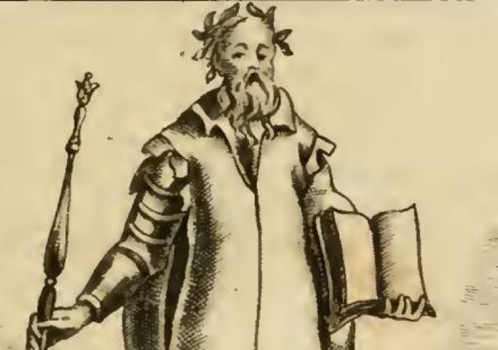
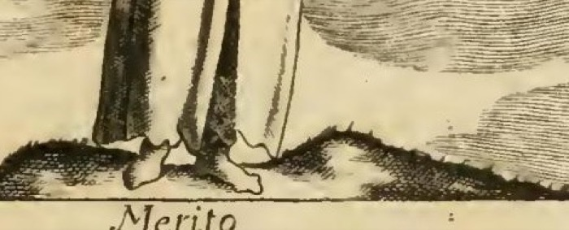

# 리파의 '공로(MERITO)' 의인화

## 한 줄 답

**가파르고 험한 땅 위에 선 남자** — 호화로운 옷, 월계수 관, **무장한 오른손에 홀**, **맨 왼손에 책**. 토마스 아퀴나스를 따라 공로란 "그 보답으로 값진 것이 주어져야 마땅한 덕 있는 행위"다.

---

## 1. 리파의 원문

원문(1593년 초판 계열, 여기 쓰인 것은 18세기 페루자판 4권)의 도상 규정은 아래 한 문단이 전부다.

> UOmo fopra di un luogo erto, ed afpro. Il veftimento farà fontuofo, e ricco, ed il capo ornato di una ghirlanda di alloro. Terrà colla deftra mano, e braccio armato uno fcettro; e colla mano finiftra nuda un libro.
>
> (현대 표기: *Uomo sopra di un luogo erto, ed aspro. Il vestimento sarà sontuoso e ricco, ed il capo ornato di una ghirlanda di alloro. Terrà colla destra mano e braccio armato uno scettro; e colla mano sinistra nuda un libro.*)

**번역**: "가파르고 험한 자리 위에 선 남자. 옷은 호화롭고 값지며, 머리는 월계수 관으로 장식된다. 오른손과 **무장한 팔**로 홀을 들고, **맨 왼손**으로 책을 든다."

이어지는 정의:

> Il Merito, secondo S. Tommaso nella terza parte della Somma, questione 45, art. 6, è **azione virtuosa, alla quale si deve qualche cosa pregiata in ricognizione**.
>
> "공로란, 성 토마스에 따르면, **그 보답으로 값진 무엇인가가 주어져야 마땅한 덕 있는 행위**다."

그리고 리파 자신의 해설이 요소별로 붙는다.

| 요소 | 리파의 해설(원문 취지) |
|---|---|
| 험하고 가파른 자리 | 인간이 무언가를 **얻어낼(perviene a meritare)** 때 통과해야 하는 **난관**. 그래서 헤라클레스는 평탄하고 즐거운 길(쾌락)을 버리고 산의 험한 길(덕)을 택했고, 그 수많은 노고로 가장 뛰어난 영웅에 들 자격을 얻었다. |
| 호화로운 옷 | 덕의 **소질(disposizione)과 습성(abito)** — 그 덕분에 인간이 명예와 칭송에 값하는 행위를 한다. |
| 월계관 + 홀 | 공로는 늘 "무엇에 대한" 관계항이므로, 공로를 최대한 **눈에 보이게(spettabile)** 하려고 보상을 함께 준다. 이것이 큰 공로에 마땅히 돌아가는 **표시된 상(premi segnalati)**. 그래서 성 바울: *Non coronabitur nisi qui legitime certaverit* ("규칙대로 싸운 자가 아니면 관을 받지 못한다", 2Tim 2,5). |
| 무장한 오른팔 / 책 든 왼손 | **두 종류의 시민적 공로(due generi di merito civile)** — 하나는 **전쟁의 행위**, 다른 하나는 **학문과 문필의 일**. 어느 쪽으로든 인간은 홀(=타인을 명령할 권한)과 월계관에 값하게 된다. 월계관은 **뛰어난 문인에게도, 불패의 장군에게도** 같은 상이며 **참된 명예와 영원한 영광**을 뜻한다. |

---

## 2. 판화에서 실제로 보이는 것

확대해 보면 글의 규정이 하나하나 대응한다.

- **월계관**: 잎이 짝으로 갈라진 관이 머리를 감싼다. 리파가 "ghirlanda"(화관)라 쓴 대로 왕관이 아니라 **엮은 잎관**이다.
- **호화로운 옷**: 넓은 깃과 옷단에 털/장식이 도는 **길고 무거운 장의(長衣)**. 활동복이 아니라 **지위를 보이는 예복**이다. 같은 챕터의 '기계학(Mecanica)'이 걷어올린 옷(*abito succinto*)을 입은 것과 정확히 반대 — 기계학은 손을 써야 하니 옷이 짧고, 공로는 이미 명예를 입었으니 옷이 길다.
- **무장한 오른팔**: 견갑·상완·전완·건틀렛까지 **관절이 나뉜 판금 갑주**가 오른팔에만 그려졌다. 몸통은 갑옷이 아니라 예복이므로, "무장"은 **전신 전사**가 아니라 **팔 하나만의 속성**임이 시각적으로 분명하다. 즉 무기가 아니라 **행위 능력**의 기호다.
- **홀(scettro)**: 끝에 장식 두구가 달린 봉을 무장한 손이 쥐고 있다. 갑주 손이 홀을 쥔다는 조합이 곧 "무공 → 명령권"의 인과를 한 손에 압축한다.
- **맨 왼손과 펼친 책**: 왼팔은 갑주가 전혀 없고, 손은 **펼쳐진** 책을 받쳐 든다. 닫힌 책(권위·봉인)이 아니라 **읽히는 중인 책**이므로 학문의 실천을 가리킨다. 무장 대 맨손의 좌우 대비가 "전쟁 vs 문필"을 한 몸에서 갈라 보여 준다.
- **노년의 수염**: 원문에 지정이 없는데도 판화가는 긴 수염의 노인으로 그렸다. 공로가 **축적의 결과**임을 나이로 보탠 해석이다.

- **험한 자리**: 발밑은 해칭으로 거칠게 파인 **울퉁불퉁한 흙·돌 언덕**이고, 인물은 그 **정점**에 서 있다. 다만 판화는 "erto"(가파른)를 험준한 산이 아니라 **낮은 둔덕**으로 축소해 그렸다 — 원문의 헤라클레스 산길만큼 극적이지 않으므로, 이 대목은 **글로 보충해야 하는 요소**다.
- **맨발**: 이 역시 원문에 없는 판화가의 첨가. 예복과 맨발의 부조화가 "험한 길을 몸으로 통과했다"는 함의를 더한다.

---

## 3. 구조적 독해: 조건 + 수단 + 보답의 3층

이 카드가 개관 카드인 이유는, 이 도상이 **한 몸에 세 층을 쌓은 도해**이기 때문이다. 아래에서 위로 읽으면 그대로 공로의 이론이 된다.

| 층 | 몸의 위치 | 요소 | 의미 |
|---|---|---|---|
| **조건** | 발밑 | 가파르고 험한 땅 | 공로는 **난관을 통과해야만** 성립한다 (쉬운 길에는 공로가 없다) |
| **수단** | 두 손 | 무장한 오른손 / 맨 왼손의 책 | 그 통과의 두 경로 = **무공**과 **학문** |
| **보답** | 머리와 오른손 끝 | 월계관 / 홀 | 마땅히 돌아오는 것 = **영예**와 **권력** |

여기에 **몸통(호화로운 옷)** 이 걸치고 있는 것은 층이 아니라 **주체의 상태**, 곧 덕의 습성(*habitus*)이다. 그래서 화면은 "험한 땅 → 덕의 옷을 입은 사람 → 두 손의 실천 → 관과 홀"이라는 상승 서사로 읽힌다.

주의: 홀은 **수단이면서 보답**이기도 하다(무장한 손이 쥐고 있으므로). 리파가 홀을 "타인을 명령할 권한(*podestà di comandare agli altri Uomini*)"으로 못 박은 것은 보답 쪽 독해다.

---

## 4. 토마스 아퀴나스의 *meritum* 정의 — 출처 확인

리파의 정의를 라틴어로 되돌리면 대략 이렇게 된다.

> *Meritum est actus virtuosus, cui debetur aliquid pretiosum in retributionem.*
> (공로는 덕 있는 행위이며, 그것에는 보답으로 값진 무엇이 **빚으로 지워진다**.)

**핵심 어휘는 *debetur*("빚져 있다")** 다. 공로는 시혜를 바라는 것이 아니라 **정의(iustitia)의 문제**로 다루어진다 — 그래서 리파가 성 바울의 "규칙대로 싸운 자만이 관을 받는다"를 끌어오는 것이다.

### 출처 주의

- 리파는 이를 **"Somma, 3부 q.45 a.6"** 으로 적었고, 같은 챕터의 '그리스도의 공로' 항목도 같은 인용(*Div. Thom. 3. p. q. 45. art. 6*)을 반복한다.
- 그러나 『신학대전』 **제3부 q.45는 '주님의 변모(Transfiguratio)'** 이고 **항이 4개뿐**이어서 a.6이 존재하지 않는다. 리파(및 그 판본 편집자)의 인용은 **부정확한 재인용**으로 보인다.
- 실제 토마스의 *meritum* 논의 위치는 두 곳이다.
  - **I-II q.114 「공로에 대하여(De merito)」** — 전 10항. a.1에서 "*merces*(품값)란 일이나 노고에 대한 보답으로 누군가에게 되돌려지는 것, 곧 그것의 **값(quoddam pretium)** 이라 불린다"고 하여, 리파의 "*qualche cosa pregiata in ricognizione*"(보답으로 주는 값진 것)와 어휘가 정확히 겹친다. **이쪽이 진짜 출처일 가능성이 가장 높다.**
  - **III q.48 a.1** — "그리스도의 수난이 **공로의 방식으로(per modum meriti)** 우리 구원을 이루었는가". 3부에서 merito를 다루는 곳이므로, 리파가 "3부"라 쓴 기억의 근거일 수 있다(q.48은 항이 6개여서 "q.45 a.6"이 **48↔45 오식**일 여지도 있다).

### *de condigno* / *de congruo* — 뒤 카드들의 열쇠

스콜라 신학은 공로를 두 종류로 나눈다. 이 구별을 잡아 두어야 뒤 카드가 이해된다.

| 구분 | 뜻 | 성립 근거 |
|---|---|---|
| **meritum de condigno** (적정 공로) | 행위와 보상이 **값이 맞아서**, 엄정한 정의에 따라 **마땅히** 주어져야 하는 공로 | 행위가 **성령의 은총에서 나올 때** 성립. 사람의 자유의지만으로는 하느님과의 격차가 너무 커서 성립하지 않는다 |
| **meritum de congruo** (적합 공로) | 그 자체로는 보상에 값하지 않지만, 하느님의 너그러움에 비추어 **보상하는 것이 어울리는** 공로 | **비례의 어울림(congruitas)** — "사람이 제 힘껏 하면, 하느님이 그 힘에 걸맞게 갚아 주는 것이 마땅해 보인다" |

- 리파의 **이 판화**는 사실 **시민적·세속적 공로(merito civile)** 를 그린 것이므로 위 신학적 구별 밖에 있다 — 여기서는 사람이 사람에게 주는 관과 홀이 문제다.
- 반면 **리치(P. Ricci)의 '공로'** 는 손에 *NESCIO*("나는 모른다") 라 쓰인 패를 들고 있는데, 이는 **하느님 앞에서 우리 공로의 불확실성**을 나타낸다. 즉 인간의 공로가 **de condigno**로 확정될 수 없다는 감각의 도상화다.
- 또 **'그리스도의 공로(Merito di Cristo)'** 는 인간과 신 두 본성의 위격적 결합 때문에 **무한한 공로(merito infinito)** 이며, 무한히 상해진 정의를 달랠 수 있는 유일한 공로로 서술된다 — 이것이 옆에 놓인 **구형(球形) 판**과 은·금·보석 보고(寶庫)로 그려진다. 즉 **무한/유한**의 대비가 이 시리즈의 축이다.

(세부는 각각 뒤 카드로 넘긴다.)

---

## 5. 왜 여자가 아니라 남자인가

리파의 의인상은 압도적으로 **여성**이다. 같은 챕터만 봐도 그렇다.

- **Mecanica** = *Donna di età virile* (장년의 여자)
- **Medicina** = *Donna attempata* (나이 든 여자) / 두 번째 판본도 *Donna*

그런데 **Merito만 *Uomo*(남자)** 다. 이유는 두 겹으로 설명된다.

1. **문법적 성**: 리파의 의인화 원칙은 **표제어의 이탈리아어 문법 성**을 따르는 것에 가깝다. 추상명사 대부분이 여성형(*la meccanica, la medicina, la virtù, la giustizia*)이라 여성상이 되지만, **il merito는 남성 명사**다. 같은 이유로 *l'onore, il valore, il tempo* 등도 남성상으로 그려진다. 이것이 가장 기계적이면서 가장 확실한 설명이다.
2. **내용적 이유**: 리파가 스스로 밝힌 두 갈래가 **전쟁**과 **문필**, 즉 근세 유럽에서 **여성에게 제도적으로 닫혀 있던 두 공적 경력**(*arma et litterae*)이다. 무장한 팔로 홀을 얻고 책으로 월계관을 얻는 이력은 남성 시민의 경력 서사이므로, 여성상으로 그리면 도상이 사회적 현실과 충돌한다.

즉 문법이 규칙을 주고, 내용이 그 규칙을 정당화한다. **암기 포인트: 리파에서 남자로 그려지면 대개 명사가 남성형이거나, 남성 전유 영역의 실천을 표상한다.**

---

## 6. 가파르고 험한 곳 — 헤라클레스의 갈림길

리파는 이 지형 하나에 **공로의 성립 조건**을 걸었다. 논리는 이렇다.

1. 공로는 "마땅히 값을 받아야 하는" 행위다.
2. 값을 받을 만하려면 **거저 얻은 것이 아니어야** 한다.
3. 그러므로 공로의 도상에는 반드시 **어려움(difficoltà)** 이 들어가야 한다.
4. 어려움을 가장 경제적으로 그리는 방법은 **올라가야 하는 지형**이다.

리파는 그 전거로 **헤라클레스의 선택(프로디코스의 우화)** 을 든다 — 명성과 영광을 갈망하는 인간의 표상인 헤라클레스가 "평탄하고 즐거운 길"(쾌락)을 버리고 "험하고 가파른 산길"(덕)을 골랐고, 그 노고 덕에 가장 존엄한 영웅의 반열에 셀 자격을 **얻었다(meritò)**. 여기서 리파가 쓴 동사가 바로 *meritare*라는 점이 결정적이다: 지형은 배경이 아니라 **동사의 목적을 성립시키는 조건**이다.

이 우화의 구조(Y자 갈림길, 두 여인, 쉬운 길과 험한 길)는 **뒤 카드에서 따로 다룬다.** 여기서는 "발밑이 험한 이유 = 공로에는 대가가 선행한다" 한 줄만 확실히 잡으면 된다.

---

## 7. 월계관은 항목마다 뜻이 달라진다

월계관은 리파에서 자주 나오지만 **매번 다른 논리로 정당화**된다. 같은 챕터 안에서만 비교해도 그렇다.

| 항목 | 머리 장식 | 근거 |
|---|---|---|
| **Mecanica**(기계학) | 월계관 **아님** — 머리 위에 세운 **원(circolo)** | 기계 작동이 대개 **원운동**에서 나오기 때문 (상이 아니라 **원리**의 기호) |
| **Medicina**(의학) | 월계관 | 월계수가 **여러 질병에 좋다**고 믿어졌고, 로마인이 1월 초하루에 신임 정무관에게 월계 잎을 주어 **한 해 건강**을 기원했으며, 의술의 창시자 **아폴론**이 사랑한 나무이기 때문 (**약효·건강**의 기호) |
| **Merito**(공로) | 월계관 | 큰 공로에 마땅한 **상(premio)**, 뛰어난 문인과 불패의 장군에게 동등하게 주어지며 **참된 명예와 영원한 영광**을 뜻함 (**보상·영예**의 기호) |

→ **한 줄**: 같은 월계관이라도 의학에서는 **약초의 효능**, 공로에서는 **승리의 상**이며, 기계학은 아예 월계관을 쓰지 않는다 — 리파의 속성은 사물 자체가 아니라 **그 항목이 끌어오는 전거(典據)** 로 의미가 정해진다.

---

## 8. 헷갈리기 쉬운 지점

- **이미지 혼동 주의**: 이 카드의 판화는 **긴 예복 + 월계관 + 무장한 오른팔의 노인**이다. 같은 항목 뒤에 실린 **작은 삽화**는 리치가 도안한 **다른 도상**(붉은 옷, 손이 그려진 옷, *NESCIO* 패)이며, 또 리파는 **로마 상서원 홀(Sala della Cancelleria)의 공로**도 별도로 기록한다 — 그쪽은 **"벌거벗은 남자, 왕의 망토, 머리에 왕관, 오른손에 홀"** 로, **책도 갑주도 험한 땅도 없다**. 세 도상을 섞지 말 것.
- **좌우**: 무장/홀 = **오른쪽**, 맨손/책 = **왼쪽**. (오른쪽이 무력이고 왼쪽이 학문 — 리파에서 오른쪽이 더 우월한 자리라는 관습과 맞물린다.)
- **관은 왕관이 아니라 월계 화관**이고, **홀이 왕권 그 자체가 아니라 '명령할 권한'** 이라는 점.
- 리파는 "공로는 우리 말을 넘어서는 것이니, 공로 자신이 더 효과적으로 스스로를 말하게 두겠다(*il Merito è cosa che avanza le nostre parole, lasceremo che egli medesimo... parli di sé stesso*)"며 항목을 닫는다 — 이 겸양의 문장이 곧 다음 도상(*NESCIO*)으로 넘어가는 이음새다.

---

## 정리 문장 (암송용)

> **험한 땅**(조건) 위에, **덕의 호화로운 옷**을 입고, **무장한 오른손의 홀**과 **맨 왼손의 책**(무공과 학문, 수단)으로, **월계관과 홀**(영예와 권력, 보답)을 얻은 **남자**. 아퀴나스: 공로란 **보답으로 값진 것이 마땅히 빚져지는 덕 있는 행위**.
