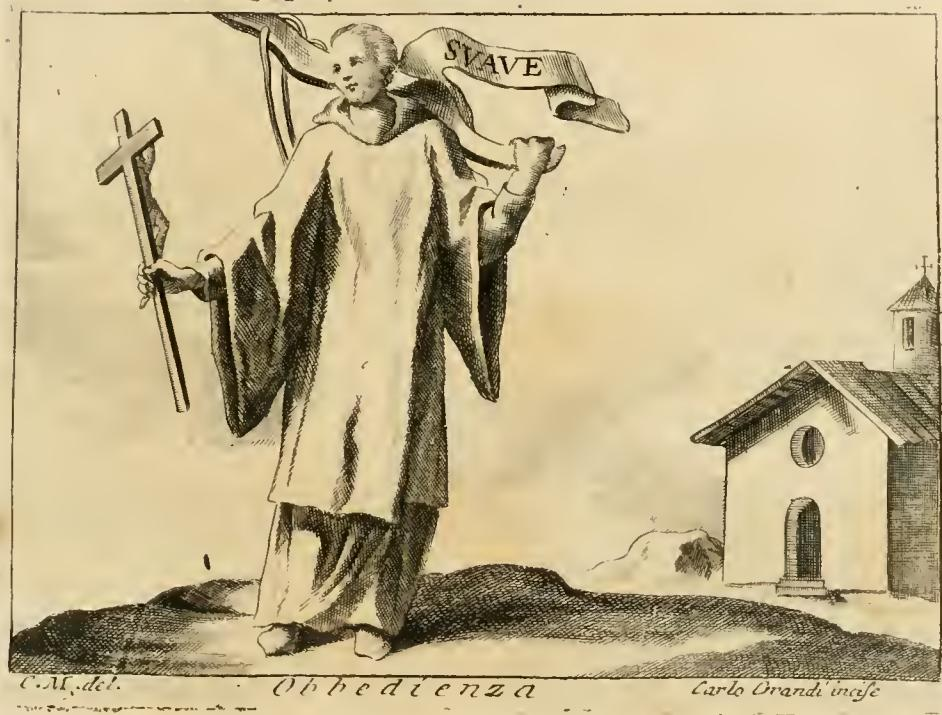

# 순종(Obbedienza)의 멍에와 표어 'SUAVE'

> **Q.** 순종 도상의 멍에와 'SUAVE' 표어의 유래는?
>
> **A.** 그리스도의 '내 멍에는 부드럽다(Jugum meum suave est)'는 말씀에서 온 것으로, 자발적 순종의 수월함을 뜻한다. 이는 교황 레오 10세가 어릴 때부터 교황이 되어서까지 쓴 문장(임프레사)이기도 했다.

---

## 1. 리파 원문 — 답이 그대로 적혀 있는 대목

『Iconologia』 Obbedienza 항목의 도상 지시문은 두 문장으로 끝난다.

> *Donna di faccia nobile, e modesta, vestita di abito religioso. Tenga colla sinistra mano un Crocifisso, e colla destra un giogo, col motto, che dica: **SUAVE**.*
>
> — 고귀하고 정숙한 얼굴의 여인, 수도복 차림. 왼손에는 십자고상(Crocifisso)을, 오른손에는 **멍에(giogo)**를 들고, 거기에 **SUAVE**라는 표어를 붙인다.

그리고 해설부에서 유래를 직접 밝힌다.

> *Il giogo col motto SUAVE, è per dimostrare la facilità dell'Obbedienza quando è spontaneamente. **Fu impresa di Leone X. mentre era fanciullo, la qual poi ritenne ancor nel Pontificato**; adornandone tutte le opere di magnificenza, le quali pur sono molte, che fece, e dentro, e fuori di Roma, tirandola dal detto di Cristo Signor nostro, che disse: ***Jugum meum suave est***, intendendo dell'Obbedienza, che dovevano aver i suoi seguaci a tutti i suoi legittimi Vicarj.*
>
> — SUAVE 표어가 붙은 멍에는 순종이 **자발적일 때의 수월함(facilità)**을 보이기 위한 것이다. 이는 **레오 10세가 어릴 때 쓴 임프레사이며 교황이 된 뒤에도 계속 유지해**, 로마 안팎에서 그가 이룩한 수많은 장려한 사업들을 이것으로 장식했다. 그 출처는 우리 주 그리스도의 말씀 "**내 멍에는 부드럽다**"이며, 그 뜻은 그리스도의 추종자들이 그의 **모든 적법한 대리자(Vicarj = 역대 교황)**에게 바쳐야 할 순종이다.

주목할 점 두 가지.

- 리파는 성서 구절과 레오 10세의 임프레사를 **둘 중 하나가 아니라 겹쳐서** 제시한다. 즉 이 도상의 계보는 `마태복음 11:30 → 레오 10세의 개인 표장 → 리파의 알레고리 사전`이라는 3단이다.
- 리파가 붙인 최종 해석("적법한 대리자들에게 바쳐야 할 순종")은 성서 본문에 없다. 그리스도에 대한 순종이 **교황권에 대한 순종으로 이월**되어 있다. 이 미끄러짐이 이 도상의 정치적 핵심이다(→ 6절).

또 하나 놓치기 쉬운 것: 리파의 순종 **정의문** 자체가 멍에 은유다.

> *L'Obbedienza è di sua natura virtù, perchè consiste nel **soggiogare** i proprj appetiti alla volontà degli altri spontaneamente, per cagione di bene.*
>
> — 순종이 본성상 덕인 이유는, 자기 욕구를 선을 위해 **자발적으로** 타인의 의지 아래 *soggiogare*(멍에 아래 두다)는 데 있기 때문이다.

`soggiogare`는 라틴어 **sub + iugum**(멍에 아래로) = 영어 *subjugate*의 어원이다. 정의문의 동사와 손에 든 지물이 같은 어근이다.

## 2. 판화에서 실제로 관찰되는 것

이미지를 열어 확인한 사항(추정이 아니라 화면에서 판독되는 것만):

- **표어 글자는 선명하게 판독된다.** 인물 오른쪽 위로 펼쳐진 리본(cartiglio)에 대문자로 **`SVAVE`**. U를 V로 새긴 라틴 금석문 관례이며, 실제로 새겨진 글자는 SUAVE가 아니라 **SVAVE**다.
- **멍에는 손에 '들려' 있지 않고 목·어깨에 걸쳐져 있다.** 인물의 목덜미 뒤로 활처럼 굽은 짙은 막대(소 멍에의 곡선 모양)가 양어깨에 얹혀 있고, 표어 리본은 그 멍에 끝에서 흘러나온다. 들어올린 주먹은 멍에(또는 리본)의 끝을 붙잡은 자세다. 즉 판화가는 멍에를 **속성물(들고 있는 표지)에서 실제로 메고 있는 짐**으로 바꿨다 — "내 멍에를 **너희 위에 메라**(Tollite iugum meum **super vos**)"는 구절에 오히려 더 충실한 처리다.
- **좌우가 원문과 반대다.** 리파는 "왼손에 십자고상, 오른손에 멍에"라 했으나, 그림에서 십자가는 인물의 **오른손**(보는 이의 왼쪽), 멍에 쪽 주먹은 **왼손**이다. 동판 원판과 인쇄물 사이의 좌우 반전, 또는 판화가의 임의 처리로 보인다. 지시문과 도판이 어긋나는 흔한 사례이므로 "오른손의 멍에"는 텍스트 기준 표현으로 이해해야 한다.
- 십자가는 **코르푸스(십자에 달린 그리스도 상)가 없는 맨 나무 십자가**이며, 지팡이처럼 땅에 짚고 있다. 리파가 지정한 *Crocifisso*(십자고상)보다 단순화됐고, 뒤에 나오는 다른 변형("십자가를 어깨에 메고 걷는 여인")과 뒤섞인 인상을 준다.
- **수도복(abito religioso)** 지시는 충실히 지켜졌다. 폭 넓은 소매의 헐렁한 장백의형 겉옷, 두건, 그리고 **맨발**(수도적 청빈·탁발 수도회의 표지). 얼굴은 뜻밖에 어리고 통통한 소년 같은 인상이다 — 리파가 지정한 "고귀하고 정숙한 얼굴의 여인"과 잘 맞지 않는다.
- **배경 오른쪽에 작은 예배당**이 있다: 박공 위 종벽에 십자가, 원형 창(oculus), 아치문. 원문 지시문에 없는 판화가의 추가로, 순종을 **수도원 규율(regula) 안의 복종**으로 못 박는 장치다.
- 하단 서명: 왼쪽 `C.M. del.`(도안), 가운데 표제 `Obbedienza`, 오른쪽 `Carlo Orandi incise`(판각). 본문 쪽수 표기가 "TOMO QUARTO / 243–245"이므로 리파의 16–17세기 초판 목판이 아니라 **18세기 다권본 판화**다. 페루자판(1764–67, Cesare Orlandi 편) 계열이 유력한 후보이지만 서명 판독만으로 단정하지는 않는다.

정리하면, 이 그림에서 답의 근거로 실제 확인되는 것은 **① SVAVE 표어 글자, ② 어깨에 얹힌 멍에, ③ 수도복·십자가**이며, 나머지(예배당, 맨발, 좌우 배치)는 판화가의 해석층이다.

## 3. (a) 성서적 출처 — 마태복음 11:28–30

불가타 본문(클레멘스판):

> **28** *Venite ad me omnes qui laboratis, et onerati estis, et ego reficiam vos.*
> **29** ***Tollite iugum meum super vos***, *et discite a me, quia mitis sum, et humilis corde: et invenietis requiem animabus vestris.*
> **30** ***Iugum enim meum suave est, et onus meum leve.***
>
> 수고하고 짐 진 모든 자들아 내게로 오라, 내가 너희를 쉬게 하리라. **내 멍에를 메고** 내게 배우라, 나는 마음이 온유하고 겸손하니 너희 영혼이 쉼을 얻으리라. **내 멍에는 부드럽고 내 짐은 가볍다.**

리파가 인용한 형태 *"Jugum meum suave est"*는 30절에서 접속사 *enim*을 뺀 축약형이다(*iugum* / *jugum*은 같은 낱말의 표기 차이).

### 그리스어 χρηστός의 의미 폭

원문은 *ὁ γὰρ ζυγός μου **χρηστὸς** καὶ τὸ φορτίον μου ἐλαφρόν ἐστιν*이다. **χρηστός**(chrēstos)는 한 단어에 상당히 다른 결들이 겹쳐 있다.

| 결 | 뜻 | 이 구절에 적용하면 |
|---|---|---|
| 사물·도구 | 쓸모 있는, 잘 맞는, 요긴한 | 멍에가 목에 **잘 맞아 상처를 내지 않는다** (χράομαι '쓰다'에서 파생) |
| 품성 | 친절한, 인자한, 너그러운 | 멍에를 씌우는 **주인이 인자하다** |
| 미각 | (포도주가) 순한, 부드러운 | *suave*(달콤한)로 번역될 여지 |
| 도덕 | 좋은, 훌륭한 | 짐 자체가 **좋은 것**이다 |

그러니까 그리스어의 일차 함의는 "달다"보다 **"잘 맞는다·쓸 만하다"**에 가깝다. 라틴어 *suavis*는 원래 미각·후각의 **감각적 달콤함**을 가리키는 말이므로(참고: *suavis* ↔ 영어 *sweet*, 산스크리트 *svādu-* 동계), 불가타는 "몸에 잘 맞는 도구"라는 실용적 뉘앙스를 **"달다/기분 좋다"**는 감각어로 옮긴 셈이다. 이 번역 선택이 없었다면 레오 10세의 표어는 `SUAVE`가 아니라 `UTILE`이나 `MITE`가 되었을지도 모른다.

같은 이동이 시편 34:8(불가타 33:9) *"Gustate et videte quoniam **suavis** est Dominus"*(맛보아 알지어다, 주의 **선하심**을) — 여기서도 그리스어는 χρηστός, 라틴어는 *suavis*, 그리고 동사는 "맛보라"다. 초기 교회에서 χρηστός와 **Χριστός**(그리스도)가 사실상 동음이어서 생긴 어희(語戲)까지 얹히면, *suave* 한 단어는 "그리스도답다"는 함의도 은근히 끌고 온다.

### '멍에'는 유대 전통에서 이미 전문 용어였다

예수의 이 말씀은 무(無)멍에를 약속하지 않는다. **더 나은 멍에**를 제안한다. 배경에 랍비 전통의 확립된 관용어가 있다.

- **עֹל תּוֹרָה (ol Torah), 토라의 멍에** — 율법 준수 전체를 가리키는 표준 표현.
- **עֹל מַלְכוּת שָׁמַיִם (ol malkhut shamayim), 하늘 나라의 멍에** — 미슈나 『베라코트』 2:2는 쉐마를 낭송하는 것이 곧 "하늘 나라의 멍에를 받아들이는" 행위이고, 그다음이 "계명의 멍에"라고 규정한다. 즉 멍에를 지는 것은 굴욕이 아니라 **신앙의 정식 절차**였다.
- 벤 시라(집회서) 51:26 *"너의 목을 [지혜의] 멍에 아래로 들이밀라"* — 지혜 학교의 초청 문구. 마태복음 11:28–30은 이 초청 양식을 거의 그대로 차용한다.
- 대비 항목: 마태복음 23:4(바리새인들이 "무거운 짐"을 지운다), 사도행전 15:10("우리 조상도 우리도 능히 메지 못한 멍에").

따라서 마태복음 11:30은 **"멍에 vs 자유"가 아니라 "무거운 멍에 vs 부드러운 멍에"의 대립**이다. 리파의 도상이 순종(복종)을 미덕으로 그리면서도 자유를 포기하지 않은 척할 수 있는 논리적 발판이 바로 여기다.

## 4. (c) '임프레사(impresa)'란 무엇인가

리파의 『Iconologia』를 이해하려면 그 앞 세대 장르인 임프레사를 알아야 한다.

**임프레사 = 개인의 표장.** 가문 전체가 세습하는 **문장(arme/stemma)**과 달리, **한 개인**이 자기 포부·처지·좌우명을 압축해 만들어 갑옷·깃발·메달·건축 장식·책 표지에 반복 사용하는 장치다. 구조는 두 부분이다.

| 부분 | 이름 | 레오 10세의 경우 |
|---|---|---|
| 그림 | **corpo**(몸) | 소 멍에(giogo) |
| 표어 | **anima**(영혼) | `SUAVE` |

핵심은 몸과 영혼 **어느 쪽도 단독으로는 뜻이 완성되지 않는다**는 것이다. 멍에만 보면 억압이고, SUAVE만 보면 그냥 형용사다. 둘을 맞물릴 때만 "부드러운 멍에 = 자발적 복종"이라는 명제가 생긴다.

이 장르의 규범을 정리한 고전이 **파올로 조비오(Paolo Giovio, 1483–1552)의 『Dialogo dell'imprese militari et amorose』**(1551년 집필, 1555년 로마 초판, 1559년 리옹에서 최초의 도판본)다. 조비오는 좋은 임프레사의 조건을 다섯 가지로 못 박았는데, 대략 이렇다.

1. 그림과 표어의 **비례가 알맞아야** 한다.
2. 스핑크스가 필요할 만큼 난해해서도, 아무나 알아볼 만큼 뻔해서도 안 된다.
3. 보기에 아름다워야 한다(별·해·달·동물·나무 등).
4. **사람의 형상을 쓰지 않는다.**
5. 표어는 **짧아야** 하고, 지은이의 모국어가 아닌 언어(즉 라틴어)로 써서 뜻을 살짝 감춘다.

`SUAVE`는 **라틴어 한 단어**라는 점에서 5번 조건의 교과서적 사례다. 그리고 4번(사람 형상 금지)이 임프레사와 리파의 결정적 차이다.

**리파와의 관계.** 임프레사가 "이 개인은 누구인가"를 감추듯 말하는 사적 장르라면, 『Iconologia』(1593 초판, 1603년 도판 증보판)는 정반대로 **공적·표준적 사전**이다. 리파는 추상명사(순종, 정의, 희망…)를 **의인화된 인물 + 지물**로 규격화해 화가·시인·연출가가 찾아 쓰도록 목록화했다. 그래서 리파는 조비오의 4번 규칙을 깨고 **사람 형상을 중심에 놓고**, 임프레사였던 멍에를 그 인물의 **손에 든 지물로 흡수**한다. 이 카드의 항목은 임프레사가 알레고리 사전 안으로 편입되는 과정을 보여주는 표본이다 — 한 개인(레오 10세)의 사적 표장이 **"순종" 일반의 공용 기호**로 승격된 것.

## 5. (b) 레오 10세의 임프레사 'SUAVE'

**조반니 데 메디치(Giovanni de' Medici, 1475–1521)** — 로렌초 일 마니피코의 차남, 13세에 추기경(1489년 임명, 1492년 공표), 1513년 3월 교황 **레오 10세**로 즉위, 1521년 사망. 재위 중 마르틴 루터의 95개조(1517)와 파문 교서 *Exsurge Domine*(1520)를 맞은 인물이며, 라파엘로를 기용해 바티칸 로지아·태피스트리 밑그림 등 대규모 장식 사업을 벌인 최대급 후원자다.

### 도안과 정치적 함의

- **corpo**: 소 멍에(giogo) 하나. 종종 표어 리본이 감긴다.
- **anima**: `SUAVE`.
- 메디치 계열 장식 프로그램에서 이 멍에는 **팔레(palle, 방패의 공들), 다이아몬드 반지, 깃털, (레오 10세 고유의) 부러진 바퀴와 못** 같은 다른 표장들과 한 세트로 반복 배치된다. 즉 단독 상징이 아니라 **표장 체계의 한 항**이다.
- 연구자들에 따르면 멍에 도안 자체는 레오 10세의 발명이 아니라 **선대 메디치가 이미 쓰던 것**("antico giogo del Magnifico Lorenzo", 로렌초의 옛 멍에)이며, 여기에 `SUAVE`(및 N/SUAVE 변형) 표어를 결합한 버전이 조반니/레오 10세에게 배정되었다는 정리가 통용된다. 리파가 "**어릴 때부터** 쓴 임프레사"라고 한 진술과, "가문의 오래된 도안을 물려받아 표어로 개인화했다"는 설명은 서로 배치되지 않는다.

**정치적 독법이 이 표어의 핵심이다.** 메디치가는 1494년 피렌체에서 축출됐고 **1512년에 복귀**했으며, 이듬해 1513년 조반니가 교황이 됐다. 이 시점에 "멍에는 부드럽다"를 개인 표어로 내세우는 것은 두 겹으로 작동한다.

1. **피렌체 대내용**: 메디치의 지배는 참주의 압제가 아니라 **부드러운 멍에**다 — 즉 시민들이 자발적으로 받아들일 만한 것이라는 주장. 공화국을 되찾은 지배자가 자기 지배를 "메기 편한 멍에"로 광고하는 셈이다.
2. **교회 대외용**: 리파가 정확히 짚은 그 해석 — 신자들이 그리스도의 **적법한 대리자들(= 교황)**에게 바치는 복종. 멍에를 쥔 손이 곧 사목의 손이라는 함의.

여기에 세 번째 층이 겹친다. **멍에는 두 마리 소를 하나로 묶는 도구**다. 그래서 화해·연합·평화(그리스도의 평화, *pax christiana*)의 기호로도 읽히며, 라틴어 *coniugium*(결혼 = 함께 멍에 지기), *coniunx*(배우자)가 같은 어근이다. 유럽 군주들의 화평 중재와 대(對)오스만 십자군을 내세운 레오 10세의 자기 연출과 잘 맞는다. 임프레사 장르가 높이 평가받은 이유가 바로 이 **다의성(polyvalence)** — 만든 시점에 의도하지 않은 뜻까지 나중에 실어 나를 수 있다는 점 — 이었다.

**리파의 증언은 물질적 흔적을 가리킨다.** "로마 안팎에서 그가 이룩한 수많은 장려한 사업들을 이것으로 장식했다"는 문장은, 레오 10세 시기 건축·장식 프로그램에 이 멍에가 반복 새겨졌음을 16–17세기 사람이 실제로 보고 적은 것이다. 라파엘로 공방의 바티칸 로지아 그로테스크 장식대(1517–19년경, 조반니 다 우디네 등)처럼 메디치 표장들이 촘촘히 박힌 면들이 유력한 후보지만, **개별 장식면에 멍에-SUAVE가 어디에 몇 번 나오는지는 이 조사 범위에서 확인하지 못했다**(→ 7절).

## 6. (d) 이 도상의 논리적 급소 — 한 단어로 일어나는 의미 반전

**멍에는 본래 예속의 기호다.** 밭을 갈리기 위해 짐승의 목에 씌우는 도구이고, 목을 고정해 방향 선택권을 박탈하는 장치다. 그 도구를 손에 든 인물을 **미덕**으로 세울 수 있는 것은 오직 리본에 적힌 **`SUAVE` 한 단어** 때문이다. corpo(멍에)는 강제를 말하고 anima(SUAVE)는 그것을 뒤집는다. 임프레사의 두 부분이 서로 **모순 관계**로 맞물린 사례이며, 여기에 이 도상 전체의 무게가 걸려 있다.

이 반전의 급소는 **강제된 복종 / 자발적 복종의 구분**이다. 리파의 문장이 그 구분을 두 번 명시한다.

- 정의: 자기 욕구를 타인의 의지 아래 두되 — ***spontaneamente***(자발적으로).
- 해설: 멍에+SUAVE는 순종이 ***quando è spontaneamente***(자발적일 때)의 수월함을 보인다.

즉 순종이 덕이 되는 조건은 결과(복종)가 아니라 **양태(자발성)**다. 같은 멍에를 억지로 쓰면 굴종이고 스스로 쓰면 미덕이다. 판화가가 멍에를 손에 든 물건이 아니라 **스스로 목에 얹은 것**으로 그린 처리는 이 조건을 시각적으로 보강한다.

### 대비: 로마의 *sub iugum mittere*

같은 라틴 문화권에 멍에의 **정반대 용법**이 있었다. 패전군을 **멍에 아래로 통과시키는 굴욕 의례**다.

- 창 세 자루로 문틀 모양(둘은 세우고 하나는 가로로)을 만들어 그 아래로 무장 해제된 병사들을 한 명씩 기어 지나가게 했다. 관용구가 ***sub iugum mittere***(멍에 아래로 보내다).
- 가장 유명한 사례가 기원전 321년 **카우디네 협곡(Caudine Forks)** 참사로, 삼니움족이 로마군 전체를 멍에 아래로 통과시켰다. 로마인의 집단 기억에서 최악의 수치로 남았다.
- 여기서 나온 동사가 ***subiugare*** → 이탈리아어 *soggiogare*, 영어 *subjugate*.

그래서 이 도상의 정확한 구조는 이렇다.

| | 로마의 멍에 | 그리스도의 멍에 |
|---|---|---|
| 라틴 표현 | *sub iugum mittere* | *tollite iugum meum super vos* |
| 방향 | 남이 **아래로 밀어 넣는다** | 내가 **위로 들어 올려 멘다**(*tollite*, 들다) |
| 주체 | 승자가 강제 | 당사자가 자발적으로 수락 |
| 감각 | 수치·굴욕 | *suave*(부드러움) |
| 결과 | 예속 | *requiem animabus vestris*(영혼의 안식) |

동사만 봐도 대립이 선명하다: **밀어 넣어지는(mittere sub) 멍에**와 **스스로 들어 올리는(tollere super) 멍에**.

**여기가 비판의 자리이기도 하다.** 자발성이라는 조건은 도덕적으로는 결정적이지만 정치적으로는 대단히 편리하다. 지배자가 "내 멍에는 부드럽다"고 선언할 때, 그 부드러움을 판정하는 주체는 멍에를 쓴 쪽이 아니라 씌운 쪽이다. 리파가 그리스도의 멍에를 **교황들에 대한 복종**으로, 메디치가가 그것을 **피렌체 지배의 정당화**로 각각 이월시킨 지점이 바로 그 지렛대다. 부드럽다고 선언된 멍에는 저항을 **배은망덕**으로 재분류한다 — 강제와 자발의 구분이 반전의 힘인 동시에, 그 반전이 남용되는 통로다.

## 7. 참고: 리파가 제시한 다른 Obbedienza 변형들

같은 항목에 이 카드의 도상 외에 다섯 가지 변형이 더 나온다. 멍에 도상의 위치를 잡는 데 유용하다.

1. **하늘에서 내려온 재갈(freno)** — 머리를 숙이고 하늘을 보는 여인 위로 광선이 내리고, 거기 **재갈**이 매달려 있는데 여인이 **기꺼이(allegramente) 두 팔을 뻗어 그것을 받는다**. 멍에와 완전히 같은 구조의 반복이다: 구속 도구(재갈) + 자발적 수령. 지물만 바뀐 이형(異形).
2. **고개를 뒤로 돌린 개** — "이집트인들의" 방식. 주인의 말 한마디에 먹이 먹기까지 멈추는 짐승. 순종의 즉각성.
3. **어깨에 십자가를 멘 흰옷의 여인** — 흰옷은 이해관계 없음, 하늘의 광채를 봄은 불멸의 상급에 대한 희망, 십자가는 무거운 율법을 견디는 인내.
4. **오른쪽 귓불을 희생 제물의 피로 만지는 여인** — 레위기 8:23–24, 모세가 아론과 그 아들들의 오른쪽 귓불에 피를 바른 서임 예식. 리파의 풀이는 "**들을 준비(prontezza di udire)**"다. 라틴어 *oboedire* < *ob* + *audire*(향해 듣다), 즉 **순종은 어원상 '경청'**이다. 멍에(목)와 귀(청각)라는 두 신체 은유가 같은 덕을 나눠 맡는다.
5. **맨발에 실 잣는 도구(filatoio)를 든 여인** — 움직이는 대로 양방향으로 돌아가는 물레처럼, 순종하는 자는 **적법하게 명령하는 자(chi comanda legittimamente)**의 신호에 따라 움직인다.

5번의 *legittimamente*와 본문의 *legittimi Vicarj*가 겹치는 데 주의할 것. 리파의 순종은 **무조건 복종이 아니라 정당한 권위에 대한 복종**으로 한정된다 — 도상 자체에 이미 조건절이 붙어 있다.

또 항목 말미의 예화 배치가 논지를 확인해 준다: 성사(聖史)로는 **아브라함의 이사악 봉헌**(창세기 22 — 극한의 자발적 순종), 속사(俗史)로는 **솔론**("시민이 관리에게, 관리가 왕에게 복종하면 도시는 번영한다" — 정치적 순종), 우화로는 **카마리나 늪** 신탁 불복종의 재앙. 종교적·정치적 순종이 한 항목 안에서 나란히 놓인다.

## 8. 확인하지 못한 것 / 단정하지 않는 부분

- **`SUAVE` 표어의 최초 사용 시점**: 확정하지 못했다. 후보 — ① 리파의 진술대로 소년기(1489년 13세 추기경 임명 전후), ② 메디치가의 기존 멍에 도안을 물려받아 뒤에 SUAVE를 결합, ③ 1512년 메디치 복귀 ~ 1513년 교황 즉위 국면의 정치적 재활용. 리파는 ①을 지지하고 현대 연구는 ②를 시사하며, 정치적 효력이 극대화되는 것은 ③이다. 세 후보는 양립 가능하다.
- **도안 세부**: 멍에가 겨리(2두)용인지 단두용인지, 표어 리본이 멍에를 감는지 아래에 놓이는지, 못·바퀴 등 다른 표장과의 결합 규칙 — 원사료 도판을 직접 확인하지 못했으므로 단정하지 않는다.
- **조비오 『Dialogo』가 레오 10세의 멍에를 직접 다루는지**: 확인하지 못했다. 조비오가 메디치 궁정과 밀착했고(코시모 1세에게 헌정본을 보냈다) 레오 10세 전기를 쓴 인물이므로 개연성은 높지만, 해당 대목을 직접 대조하지 못했다.
- **라파엘로 바티칸 장식 내 멍에-SUAVE의 구체적 위치**: 레오 10세 시기 장식 프로그램에 메디치 표장이 널리 쓰였다는 일반적 사실은 확인되지만, 특정 벽면·칸에서 멍에+SUAVE를 지목할 근거는 확보하지 못했다.
- **판화 판본**: 서명 `C.M. del. / Carlo Orandi incise`와 "TOMO QUARTO" 표기로 18세기 다권본임은 분명하나, 페루자판(1764–67, Cesare Orlandi 편) 확정은 유보한다.

## 9. 한 문장 정리

**마태복음 11:30의 *"iugum meum suave est"*(내 멍에는 부드럽다)에서 뽑아낸 라틴어 한 단어 `SUAVE`를 소 멍에 도안에 붙여 레오 10세가 개인 임프레사로 삼았고**(피렌체 지배와 교황권을 '부드러운 멍에'로 정당화), **리파가 그것을 통째로 순종(Obbedienza)의 지물로 편입시킨 것이다.** 이 도상이 성립하는 유일한 근거는 멍에라는 예속의 도구가 `SUAVE` 한 단어로 반전된다는 점이며, 그 반전의 축은 **강제된 복종과 자발적 복종의 구분**이다 — 로마의 *sub iugum mittere*가 남을 멍에 **아래로 밀어 넣는** 굴욕이었던 데 반해, 이 멍에는 스스로 **위로 들어 올려 메는** 것이다.

---

### 출처

- 리파 원문: `.fm/assets/10 Nobility to Obligation.md` (Obbedienza 항목, 341–405행) 및 판화 `Iconologia (Cesare Ripa)/_page_250_Picture_2.jpeg`
- [The Yoke Impresa of Leo X (Claudia Rousseau) — Academia.edu](https://www.academia.edu/71765590/The_Yoke_Impresa_of_Leo_X)
- [Rousseau, The Yoke Impresa of Leo X — Academia.edu](https://www.academia.edu/39907057/Rousseau_The_Yoke_Impresa_of_Leo_X)
- [Device of Pope Leo X: a yoke with the motto SUAVE (Lacroix, 1878) — 도판](https://www.mediastorehouse.com.au/design-pics/historical/device-pope-leo-x-yoke-motto-suave-18190139.html)
- [Paolo Giovio, *Dialogo dell'imprese militari et amorose* — Internet Archive](https://archive.org/details/impresemilitarie00giov)
- [Gli edizioni del Dialogo dell'imprese del Giovio (EDITEF)](https://expo.editef.univ-tours.fr/it/gabriele-simeoni/allegati/gli-edizioni-del-dialogo-di-giovio/)
- [Catholic Encyclopedia: Pope Leo X](https://www.newadvent.org/cathen/09162a.htm)
- [The Special Case of the Medici: Experts in Self-Promotion](https://www.italianrenaissanceresources.com/units/unit-5/essays/the-special-case-of-the-medici-experts-in-self-promotion/)
- [Vatican loggias — Wikipedia](https://en.wikipedia.org/wiki/Vatican_loggias)
