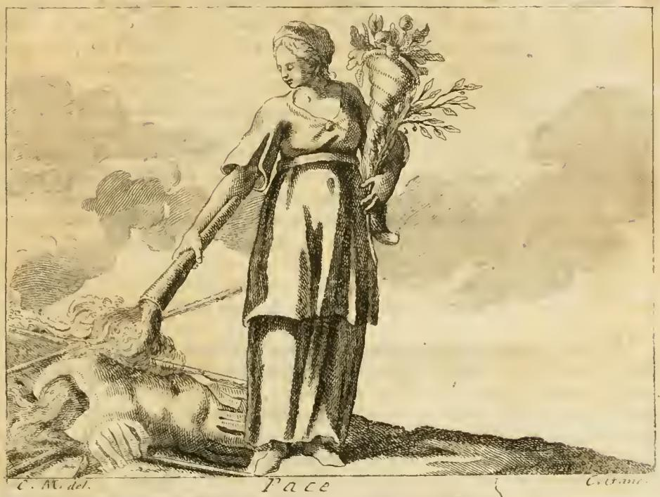
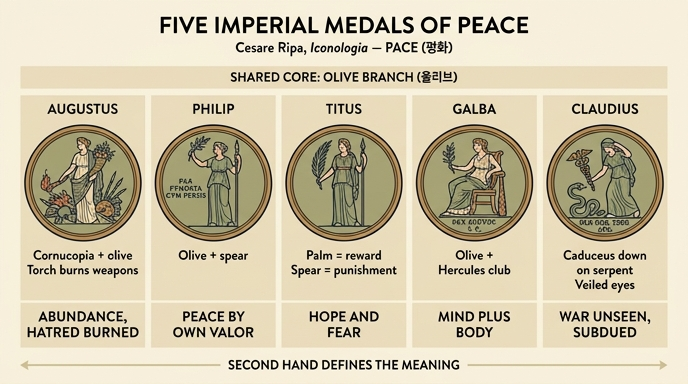

# 여러 황제 메달 속 평화(PACE)의 다양한 도상

## 이 항목이 왜 여러 개인가

리파의 『이코놀로지아』 제4권 PACE(평화) 항목은 하나의 정답 도상을 제시하지 않는다. 리파는 자기 자신의 창작 도상(올리브와 이삭으로 관을 쓴 **날개 달린** 여인, 무기 더미를 태우는 거꾸로 든 횃불, 금줄로 함께 묶인 사자와 양, 흰옷)을 먼저 제시한 뒤, **고대 로마 황제들의 화폐·메달에 실제로 새겨진 평화 의인상**을 차례로 열거한다. 항목 끝에서 리파는 이렇게 마무리한다.

> "부지런한 화가는 이 모든 것 중에서 자기 의도에 가장 적합한 것을 골라도 되고, 여러 개를 합쳐 하나로 만들어도 된다."

즉 이 카드는 **하나의 개념(평화)이 지물(attribute)의 조합에 따라 어떻게 다른 뜻으로 미세 조정되는지**를 보여주는 카탈로그다. 공통 코어는 거의 언제나 **올리브 가지**이고, 나머지 한 손에 무엇을 드는지가 그 평화의 *성격*을 규정한다.

참고로 리파는 클라우디우스의 메달에 평화가 **날개를 달고** 나오는 이유도 설명한다. "영원한 평화(PAX PERPETVA)"를 새긴 메달이 여러 개 있었지만 정작 그 평화들은 오래가지 않았으므로, 날개는 **평화가 영구적이지 않고 날아가 버리기에 부지런히 지켜야 한다**는 경고라는 것이다.

## 아우구스투스 메달 — 풍요의 뿔 + 올리브 + 무기를 태우는 횃불

원문: "왼손에는 과일·꽃·잎이 가득한 코르누코피아를 올리브 가지와 함께 들고, 오른손에는 횃불을 들어 무기 더미를 태우는 여인."

도판에서 실제로 확인되는 요소:
- **오른손의 횃불이 아래로 향해 있고**, 화면 왼쪽 아래에 투구·방패·창 같은 무기 더미가 연기를 내며 타고 있다.
- **왼팔에 안은 코르누코피아**에서 과일과 꽃, 그리고 잎이 뻗어 나온다 — 뻗어 나온 가지가 곧 **올리브 가지**다(두 지물이 한 다발로 통합되어 있음).
- 발밑은 평평한 땅, 옷은 단순한 튜닉. 화면 아래 판각 라벨에 "Pace".

의미 해설:
- **코르누코피아(풍요의 뿔)** = 풍요. 리파는 풍요를 평화의 "어머니이자 딸"이라 부른다. 전쟁 없이는 기근이 지속되지 않고, 평화의 풍요 없이는 먹을 것의 풍요도 없다는 순환 논리다. 근거 성구는 시편의 *Fiat pax in virtute tua, et abundantia in turribus tuis*("네 성벽 안에 평화가, 네 망루 안에 풍요가 있기를").
- **올리브 가지** = 성난 마음의 진정(mitigazione degli animi adirati). 리파는 올리브가 평화의 상징인 근거로 아테나 신화를 든다. 넵투누스는 삼지창으로 땅을 쳐서 **말**(전쟁의 표징)을 냈고, 미네르바는 창으로 쳐서 **올리브**(평화의 표징)를 냈으며, 올리브가 더 유익하다고 판정되어 도시 이름이 아테네가 되었다.
- **무기 더미를 태우는 횃불** = 민족들 사이의 보편적·상호적 사랑. 사람이 죽은 뒤에도 남아 있곤 하는 **증오의 잔재(reliquie degli odi)를 태워 없앤다**는 뜻이다. 즉 단순한 정전이 아니라 원한의 소각.

## 필리푸스 메달 — 올리브 + 창

원문: "오른손에 올리브 가지, 왼손에 창(asta)을 든 여인."

- 해석: **자신의 덕과 용맹으로 획득한 평화**(la Pace acquistata per propria virtù e valore). 그 "스스로의 힘"을 지시하는 것이 손에 든 창이다.
- 즉 협상이나 시혜로 받은 평화가 아니라, **무력으로 강제해 얻어낸 평화**를 뜻한다. 올리브(결과)와 창(수단)이 한 인물 안에 병치되는 구조.
- 리파는 필리푸스의 **또 다른** 메달도 든다. 오른손으로 올리브 가지를 **높이 들어 올리고** 왼손에 창을 든 형상에 명문 **PAX FVNDATA CVM PERSIS**("페르시아인과 맺어진 평화"). 이는 필리푸스 아라부스(재위 244–249)가 즉위 직후 사산조 샤푸르 1세와 강화한 사건을 가리킨다. 그래서 이 메달의 창은 특히 "칼끝에서 나온 강화"라는 실제 정치적 맥락을 갖는다.

## 티투스 메달 — 종려 가지 + 창

원문: "오른손에 종려 가지, 왼손에 창을 든 여인."

- **종려 가지**는 공로 있는 자에게 **상**을 약속하고(promette premio a' meritevoli), **창**은 범죄자에게 **벌**을 위협한다(minaccia castigo a' delinquenti).
- 결론이 중요하다. 이 둘이 각각 만들어내는 **희망(speranza)과 두려움(timore)**, 그 한 쌍이 사람들을 안정과 평화 속에 붙들어 둔다.
- 따라서 티투스형 평화는 **국내 통치술로서의 평화**다. 외적을 이겨 얻은 평화(필리푸스)와 달리, 신상필벌이라는 사법·행정 원리로 유지되는 내적 질서를 말한다. 같은 "창"이 필리푸스형에서는 *대외적 용맹*, 티투스형에서는 *형벌권*으로 기능이 달라지는 점을 눈여겨볼 것.

## (세르비우스) 갈바 메달 — 앉은 미녀 + 올리브 + 헤라클레스의 몽둥이

원문: "아름다운 용모의 여인이 **앉아** 있고, 오른손에 올리브 가지, 왼손에 몽둥이(clava)를 들었으며 명문은 **PAX AVGVST. S. C.**" (Pax Augusta, Senatus Consulto — 원로원 의결에 따라 주조되었음을 뜻하는 청동화의 상용 표기.)

- 해석: **정신의 용기와 육체의 힘으로 획득한 평화**(per valor dell' animo, e per vigor del corpo).
- 리파의 대응 관계가 정교하다.
  - **정신(animo)**은 여인의 **아름다움**과 **앉아 있는 자세**에서 드러난다. 앉음 = 동요 없는 안정·자기 통제.
  - **육체(corpo)**는 **몽둥이**가 나타낸다. 몽둥이는 **헤라클레스가 적을 벌하던 도구**로, 악행자의 대담함을 억누르는 물리적 힘이다.
- 즉 갈바형은 "미덕(내면) + 완력(외면)"이라는 **이원 구성**이다. 리파의 다른 항목들에서도 clava는 일관되게 헤라클레스적 육체의 힘·완력을 지시한다.

## 클라우디우스 메달 — 카두케우스를 뱀에게 내리고, 베일로 눈을 가림

원문: "여인이 **카두케우스를 땅 쪽으로 내리는데**, 그 땅에는 **뱀**이 있어 격렬하게 몸을 뒤틀며 자기의 여러 빛깔과 품고 있는 독을 드러낸다. 다른 손으로는 **베일로 눈을 가려** 뱀을 보지 않으려 한다. 명문은 **PAX ORB. TERR. AVG.**" (Pax Orbis Terrarum Augusta — "황제의 전 세계 평화".)

- **카두케우스**: 리파는 라틴어 caduceus를 *cadere*(떨어지다)에서 온 말로 설명한다. "그것이 나타나면 모든 불화가 **떨어져 내렸기**(faceva cadere tutte le discordie) 때문에 그렇게 불리고, 그래서 평화의 표지가 되었다"는 것. (실제 어원은 그리스어 kērykeion(전령의 지팡이)이므로 이는 르네상스식 민간 어원이지만, 리파의 해석 논리를 이해하려면 이 설명을 그대로 따라가야 한다.)
- **뱀** = 전쟁. 몸을 뒤틀며 여러 빛깔과 독을 드러내는 모습이 전쟁의 변덕과 유해함을 형상화한다.
- **베일로 눈을 가림** = 독사로 표상된 전쟁이 **괴롭고 무한한 해악**임을 보여준다. 평화는 전쟁을 쳐다보기조차 원하지 않는다는 태도의 표현. 리파는 베르길리우스 『아이네이스』 1권을 인용한다: *Nulla salus bello, pacem te poscimus omnes*("전쟁에는 구원이 없다, 우리 모두는 그대에게 평화를 청한다").
- 동작의 방향성이 핵심이다. 카두케우스를 **아래로, 뱀을 향해 내리누르는** 몸짓은 평화가 전쟁을 진압·제압하는 능동적 행위다. 동시에 눈은 가린다 — **진압하되 응시하지 않는다**는 이중 태도.

## 한눈 비교표

| 메달 | 지물 조합 | 지시하는 평화의 성격 | 명문 |
|---|---|---|---|
| 아우구스투스 | 풍요의 뿔 + 올리브 / 무기 더미를 태우는 횃불 | 풍요를 낳는 평화, 증오의 잔재까지 소각하는 상호애 | (별도 메달에 PAX PERPETVA 계열) |
| 필리푸스 | 올리브 / 창 | **스스로의 덕과 용맹**으로 얻은 평화 | PAX FVNDATA CVM PERSIS (다른 판) |
| 티투스 | 종려 가지 / 창 | **상(희망) + 벌(두려움)**로 유지되는 평화 | — |
| 갈바 | 올리브 / 헤라클레스의 몽둥이 (앉은 미녀) | **정신의 용기 + 육체의 힘**으로 얻은 평화 | PAX AVGVST. S. C. |
| 클라우디우스 | 카두케우스를 뱀 쪽으로 내림 / 베일로 눈을 가림 | 전쟁(독사)을 제압하되 보려 하지 않는 평화 | PAX ORB. TERR. AVG. |

같은 항목에 리파가 함께 열거한 나머지 둘(카드의 정답 범위 밖이지만 대조용):

| 메달 | 지물 |
|---|---|
| 베스파시아누스 | 올리브 + 카두케우스 / 또 다른 판은 밀 이삭 다발 + 풍요의 뿔, 이마에 올리브 관 |
| 트라야누스 | 올리브 / 풍요의 뿔 (단순 조합) |

## 암기 포인트

1. **공통분모는 올리브** — 클라우디우스형만 예외적으로 올리브가 없고 카두케우스가 그 자리를 대신한다.
2. **"두 번째 손"이 뜻을 결정한다.**
   - 풍요의 뿔 + 태우는 횃불 → 아우구스투스 (풍요·원한 소각)
   - 창 → 필리푸스 (내 힘으로 얻음)
   - 종려 + 창 → 티투스 (상과 벌)
   - 몽둥이 → 갈바 (정신 + 육체)
   - 카두케우스 + 베일 → 클라우디우스 (뱀=전쟁)
3. **창(asta)은 두 번 등장하지만 뜻이 다르다**: 필리푸스는 *대외적 용맹*, 티투스는 *범죄자에 대한 형벌*.
4. **명문 두 개만 외우면 충분**: 갈바 = PAX AVGVST. S. C. / 클라우디우스 = PAX ORB. TERR. AVG. (필리푸스의 PAX FVNDATA CVM PERSIS는 보너스.)
5. **인용 두 개**: 아우구스투스형에는 시편(*Fiat pax... abundantia*), 클라우디우스형에는 베르길리우스(*Nulla salus bello*).

## 인포그래픽

(메달 안의 작은 라틴어 명문 태그는 이미지 생성 과정에서 왜곡되었으므로, 정확한 표기는 위 비교표를 따를 것.)
