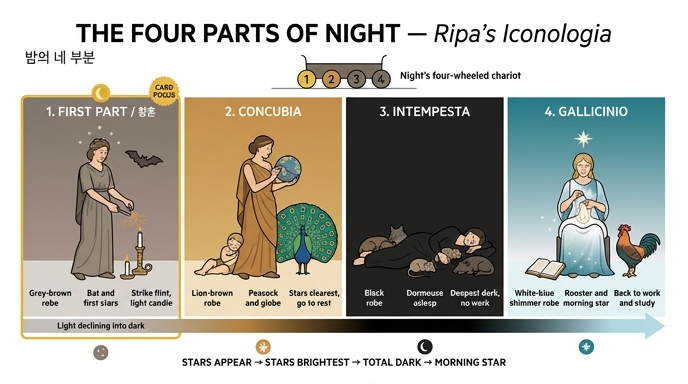

# 밤(Notte)의 네 부분 — 첫째 부분(Parte prima)

## 질문
밤의 네 부분 중 첫째 부분의 도상은?

## 답
회갈색 옷의 여인 머리 위에 별 몇 개가 보이고 공중에 박쥐가 난다. 부싯돌과 부시로 불꽃을 튀겨 부싯깃에 불을 붙였고 곁에 초와 촛대가 있다. 회갈색은 빛이 어둠으로 기울어감을, 별과 박쥐는 이 시간에 별이 나타나고 빛을 싫어하는 박쥐가 나옴을, 불붙이기는 낮의 빛이 사라져 등불을 켜기 시작함을 뜻한다.

---

## 1. 이 항목이 놓인 자리

이 카드는 리파 『이콜로지아』 제4권 **NOTTE(밤)** 항목 안의 「Le quattro parti della Notte(밤의 네 부분)」 절, 그중 **Parte prima(첫째 부분)**를 다룹니다.

리파는 절을 이렇게 열어 놓습니다.

- **마크로비우스**는 『사투르날리아』 제1권 3장에서 밤을 **일곱 때(sette tempi)**로 나눈다.
- 그러나 **넷으로 나눈 이들도 있어**, 밤이 **네 바퀴 달린 수레(un carro con quattro ruote)**를 가진 것으로 상상했다. 네 바퀴가 곧 밤의 네 부분이다.
- 이 4분법은 **보카치오**가 『신들의 계보(Genealogia deorum)』 제1권에서 말한 대로 **군인과 뱃사람이 야경(vigilie / guardie)을 설 때** 지켜 온 구분이다.
- 리파 본인은 "군인의 야경이나 뱃사람의 당번을 재현하기 위해서가 아니라, **각 부분의 표징(segni)과 그 효과(effetti)로써** 서술하려" 넷으로 나눈다고 밝힙니다.

즉 첫째 부분 카드는 **4구분 체계 전체가 소개되는 자리**입니다. 이 카드를 볼 때는 넷을 한 줄로 세워 놓고 첫 칸을 짚는 편이 훨씬 안 잊힙니다(아래 3절 표 참고).

## 2. 첫째 부분의 도상을 원문 순서대로

원문(라틴어·이탈리아어 혼재본)을 요소별로 풀면 이렇습니다.

| 요소 | 원문 표현 | 리파가 붙인 뜻 |
|---|---|---|
| **회갈색 옷** | *donna vestita di color berrettino* | *la declinazione della luce alle tenebre della notte* — 빛이 밤의 어둠 쪽으로 **기울어 감** |
| **머리 위 별 몇 개** | *alcune stelle sopra la sua testa* | 보카치오가 말한 대로 **이 시간에 별이 나타나기 시작하므로**(*le stelle cominciano ad apparire*) 첫째 부분의 표징 |
| **공중에 나는 박쥐** | *per l'aria una Nottola volante* | 박쥐는 **빛의 원수(nemico della luce)**여서, 공기가 어두워지기 시작하자마자 제 집에서 나와 날아다닌다 |
| **부싯돌 + 부싯깃** | 한 손에 *una pietra da far fuoco*, 그 위에 *un pezzo di esca* | — |
| **부시(강철 조각)** | 다른 손에 *un acciarino*, 그 돌을 **막 때린 자세** | — |
| **튀는 불꽃과 붙은 불** | *si vedano per aria molte faville, e l'esca accesa* | — |
| **곁의 초와 촛대** | *un candeliere con una candela per accenderla* | 위 세 요소와 합쳐: **낮의 빛이 사라지므로 등불을 켜기 시작한다**(*si cominciano ad accendere lumi*) — 어둠을 빛으로 이겨, **이 시간에 알맞은 일을 계속하기 위해** |

### 불 붙이는 세 가지 도구를 구분해 두기

이 카드에서 가장 자주 뭉개지는 부분입니다. 근세의 발화 도구는 반드시 **셋**이 한 벌입니다.

1. **pietra focaia(부싯돌, flint)** — 단단한 돌. 여인의 한 손 위에 놓임.
2. **acciarino(부시, steel striker)** — 돌을 때리는 강철. 다른 손에 들려 **때린 직후 동작**으로 그려짐.
3. **esca(부싯깃, tinder)** — 돌 위에 얹은 부스러기. 튄 불꽃(**faville**)을 받아 **불이 붙은 상태**로 그려짐.

그리고 이 불이 옮겨 갈 목적지로 **초와 촛대**가 곁에 놓입니다. 즉 이 한 벌은 "불을 켜는 순간"이 아니라 **"조명 점등이 시작되는 시각"**을 가리키는 시계 표시입니다. 참고로 원문 91행에서 왼손/오른손 표기가 서로 엇갈리는데(*colla sinistra … e colla sinistra*), 해설부에서 **오른손이 부시로 돌을 때린다**(*colla destra mano abbia percossa la pietra focaja coll'acciarino*)고 정정하고 있습니다. 손의 좌우는 시험 포인트가 아니니 신경 쓰지 않아도 됩니다.

### 첫째 부분의 이름

원문은 둘째·셋째·넷째에는 **concubia / intempesta / gallicinio**라는 라틴 이름을 명시하지만, **첫째 부분에는 이름을 붙이지 않습니다.** 마크로비우스의 7분법 어휘로 옮기면 이 시간대가 **crepusculum(황혼)**에 해당합니다. 카드 답을 쓸 때 "황혼"은 보조 설명으로만 쓰고, 리파가 준 표징(회갈색·별·박쥐·부싯돌·촛대)을 본체로 삼으세요.

## 3. 네 부분 전체 타임라인 — 이 표가 카드의 뼈대

| | **1. 첫째 부분** (황혼 / crepusculum) | **2. 콘쿠비아** (concubia) | **3. 인템페스타** (intempesta) | **4. 갈리치니오** (gallicinio) |
|---|---|---|---|---|
| **옷** | **베레티노(berrettino)** 회갈·쥐색 | **리오나토(lionato)** 사자 갈색·짙은 황갈 | **검정(nero)** | **흰색·청색이 어른거리는(cangiante bianco e turchino)** |
| **별** | 머리 위에 **몇 개**가 나타나기 시작 | 별이 가장 **잘 보이는** 때(천구의로 관조) | (언급 없음 — 가장 어두움) | 허리 아래 **작고 희미한** 별들 + 머리 위 **크고 빛나는 별** |
| **동물** | **박쥐**(Nottola) 날다 | **공작**(Pavone) 꼬리를 활짝 폄 | **겨울잠쥐**(Ghiro)를 손에 쥠, 곁에 여러 동물이 잠듦 | **수탉**(Gallo) 날개 펴고 목 들고 울다 |
| **자세·행위** | 서서 부싯돌·부시로 **불을 붙임**, 곁에 초와 촛대 | 오른손에 **천구의(sfera celeste)**를 들고 **관조**, 한쪽에 잠든 어린아이 | **땅에 누워 잠듦** | **앉아서 금실·색색 비단 자수**, 또는 **책을 펴고 공부** |
| **뜻** | 빛이 어둠으로 **기울어 감** → 등불을 켠다 | 어둠이 깊어지고 별이 선명 → **잠자리에 드는 때** | 밤이 가장 **짙고 조밀** → 어떤 일에도 부적합 | 밤이 **낮으로 바뀌기 시작** → 일과 학문으로 복귀 |
| **근거·인용** | 보카치오 『신들의 계보』 1권 | 보카치오; 피에리오 발레리아노 24권(공작 꼬리의 눈 = 하늘의 별) | 보카치오; 베르길리우스 『아이네이스』 8권 (*Nox erat, & terras animalia fessa…*) | 베르길리우스 『아이네이스』(*primis cadentibus astris*); 루크레티우스; 플리니우스 10권 21장 |

### 네 부분을 관통하는 네 줄기

이 표를 통째로 외우지 말고 **네 개의 흐름**으로 기억하면 훨씬 빨리 복원됩니다.

1. **옷 색의 어두워짐과 되밝아짐**: 회갈 → 사자갈 → **검정(최저점)** → 흰·청 어른거림. 색만 봐도 순서가 나옵니다.
2. **동물 릴레이**: 박쥐(어둠의 시작) → 공작(별 박힌 하늘) → 겨울잠쥐(잠 그 자체) → 수탉(깨움).
3. **빛의 출처**: 부싯불·촛불(인공광 점등) → 별빛(관조 대상) → 없음 → **샛별**(자연광의 예고).
4. **인간의 활동**: 불 켜고 일 이어감 → 관조하다 잠자리로 → 완전한 수면 → 자수·독서로 노동 복귀.

특히 4번 줄기가 리파의 도덕적 결론과 이어집니다. 넷째 부분에서 수탉은 플리니우스의 말대로 **"우리의 야경꾼"**이며, 리파는 **밤을 잠으로만 다 써 버리는 것은 몹시 추한 일**이고 기력이 회복되면 익숙한 일 — 그중에서도 **독서가 더 고귀하고 값진 행위** — 로 돌아가야 한다고 덧붙입니다.

## 4. 첫째 부분을 헷갈리지 않게 하는 결정적 표징

- **별만으로는 구분되지 않습니다.** 별은 1·2·4에 모두 나옵니다. 1의 별은 **"몇 개(alcune)"이고 "이제 나타나기 시작"**한다는 점, 2의 별은 **천구의와 공작 꼬리로 확장**된다는 점, 4의 별은 **작고 희미해지고 대신 샛별 하나가 크게 빛난다**는 점으로 갈립니다.
- **1을 확정하는 유일무이한 표징은 "부싯돌·부시·부싯깃 + 초와 촛대"**입니다. 발화 도구는 네 부분 중 첫째에만 나옵니다.
- **박쥐 vs 공작**: 박쥐는 **빛을 피해 나오는** 동물이라 어둠의 **시작**, 공작은 꼬리의 수많은 눈이 **별 박힌 맑은 하늘**이라 어둠의 **한창**입니다.
- **1의 '일'과 4의 '일'은 방향이 반대**입니다. 1은 낮의 빛이 **사라져서** 불을 켜 일을 **이어 가는** 것, 4는 밤이 **끝나서** 자수와 독서로 **되돌아오는** 것입니다.

## 5. 한 문장 정리

**첫째 부분 = "빛이 기울어 조명을 켜는 시각"** — 회갈색 옷(기울어 가는 빛), 머리 위의 몇 개 별과 나는 박쥐(어둠의 시작을 알리는 두 신호), 부싯돌·부시로 부싯깃에 붙인 불꽃과 곁의 촛대(점등의 시작). 이 세 겹이 밤 4바퀴 수레의 **첫 번째 바퀴**입니다.

---

### 부기: 원본 판화에 대해
이 절(밤의 네 부분)에는 asset의 마크다운이 참조하는 대응 삽화가 없습니다. 인접한 판화는 각각 **Nobiltà**(장 첫머리)와 **Obbedienza**, 그리고 Notte 항목 끝의 **장식 컷(tailpiece)**이어서 이 카드와 무관하므로 싣지 않았습니다. 대신 아래 인포그래픽으로 네 부분의 도상을 시각화했습니다.

## 인포그래픽

