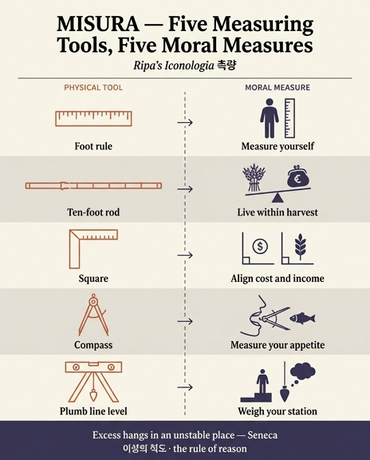

# 측량 도구들의 도덕적(신비적) 의미

> Cesare Ripa, 『Iconologia』 제4권 「MISURA(측량)」 — 조반니 차라티노 카스텔리니(Gio. Zaratino Castellini) 집필분
> 자료: `06 Metaphysics to Worldly Monarchy.md` (「MISURA」 항목 ≈ 177–345행, 도덕적 풀이는 301–339행)

---

## 1. 이 대목의 위치와 전환점

카스텔리니는 피에리오 발레리아노가 카이우스 마밀리우스 리메타누스의 은화를 「측량」의 도상으로 오독했다고 길게 논박한 뒤(181–259행), 자기 나름의 인격상을 새로 제시한다(265행).

> **DOnna di grave aspetto.** 오른손에 **로마 피에드(piede Romano)** 의 척도, 왼손에 **직각자(la quadra)와 컴퍼스(il compasso)**. 발밑에 **데켐페다(decempeda), 즉 페르티카(pertica)** — 10피에드짜리 자. 옷자락 옆에는 **다림추(perpendicolo, 늘어뜨린 납덩이)가 달린 수준기(la livella)**.

즉 도구는 **다섯 개**이고, 이 카드의 답은 그 다섯 개를 하나씩 도덕적으로 풀어낸 부분이다. 전환은 301행의 한 문장에서 일어난다.

> "이 인격상은 밭과 건물의 **물질적 측량(misura materiale)** 뿐 아니라 **자기 자신의 도덕적 측량과 절제(misura morale, e moderazione di se medesimo)** 에도 쓰일 수 있다. 자기를 잴 줄 아는 것이야말로 최선임이 분명하다."

이어 곧바로 두 개의 그리스 격언이 근거로 붙는다.
- **클레오불로스(린도스)**: *Mensuram optimum ait Cleobolus Lyndius in re* — 그리스 칠현인 중 하나인 린도스의 클레오불로스의 유명한 금언 **μέτρον ἄριστον**("절도가 최선")의 라틴 번역.
- **헬리오도로스**: *Mensuram serva, modus in re est optimus omni* — "절도를 지켜라, 모든 일에서 중용이 최선이다."

이 두 격언이 뒤따르는 5종 알레고리 전체의 대전제 역할을 한다. 앞부분(295행)에서 이미 수준기는 *물질적으로는* "측량사의 정직"의 상징(리비아·카시오도루스·「레위기」 19장·토마스 아퀴나스를 끌어와 도량형의 공정을 논한 대목, 키케로 『필리피카』 13권의 *aequissimus … Decempedator* 칭찬)으로 쓰였다. 도덕적 풀이는 그 "정직한 측량"의 대상을 **밖에서 안으로**, 토지·건물에서 자기 자신으로 옮긴 것이다.

---

## 2. 핵심 대조표 — 도구 5종 ↔ 절제 덕목

| 도구 (원어) | 물리적으로 재는 것 | 도덕적으로 재는 것 | 인용된 격언 / 전거 |
|---|---|---|---|
| **피에드** (piede Romano, 16 dita) | 모든 도량의 기본 단위. 길이 | **자기 분수·역량** — 제 몸집과 모델(forma, modello)로 자기를 재어, 실제보다 큰 척하지 말고 명예롭게 못 빠져나올 어려운 일에 뛰어들지 말 것 | **소타데스** (고대 그리스 시인): *Si metiare te **Pede, ac modulo tuo*** — "네 발과 네 척도로 너 자신을 재라" |
| **페르티카 / 데켐페다** (pertica = 10피에드 장대) | 토지의 면적을 재고 그 **값을 산정(scandaglio)** | **수입에 맞춘 지출** — 소유지·별장의 페르티카 수에서 나오는 수확이 곧 생계이므로, 잉여·사치를 끊고 수입에 맞춰 살림할 것 | **페르시우스** 『풍자시』 6.25: *Messe tenus propria vive* — "네 수확만큼 살라". 보조로 아리오스토 희극의 측량인 토르비도 대사(309행), **호라티우스** 『풍자시』 2.3 *cultum maiorem censu*("수입보다 큰 씀씀이는 그만") |
| **직각자** (la quadra, 라틴 *norma*) | **각(angolo)** 을 재고 서로 맞춤 | **지출의 각 ↔ 수입의 각** — "이성의 직각자(la quadra della ragione)"로 지출의 모서리와 수입의 모서리를 같게 맞추고, 두 모서리를 제 척도로 잴 것 | **루키아노스**: *Diiudices dimetiarisque propria utrumque mensura* — "제 척도로 양쪽 다 판별하고 재라". (도구 자체의 전거로는 비트루비우스 9권 2장, 피타고라스의 개량 직각자) |
| **컴퍼스** (il compasso) | 원의 **둘레와 벌어짐(circonferenza, apertura)** | **입의 크기 = 식탐** — "정신 차리고 **컴퍼스**에 맞춰 살아야 한다. 우리 **입의 둘레와 벌어짐**을 그것으로 재야 하기 때문" | **유베날리스** 『풍자시』 11.35–38 (다음 항 참조) |
| **다림추 수준기** (la livella + il perpendicolo, 라틴 *libella*) | 작업물이 곧고(retta) 바르고(giusta) 고른지(uguale) **수평**을 보고, 추로 **높이**를 잼 | ① 자기 **처지·신분(condizione, stato)** 을 저울질 ② **생각의 높이** 를 "지성과 판단의 다림추"로 재어 공중누각(castelli in aria)을 세우지 않기 | **핀다로스**: *Oportet autem iuxta suam quemque conditionem … spectare modum* — "누구나 제 처지에 맞게 사물의 절도를 보아야 한다" |

*libella*라는 이름 자체가 "작은 저울(bilancetta)"에서 왔다는 카스텔리니의 어원 설명(295행)이, 수준기를 **판단의 추**로 읽는 도덕적 전용을 뒷받침한다.

---

## 3. 전거 확인 — 실제 원문과 대조

### (1) 소타데스 — "네 발과 네 척도로 너 자신을 재라"
Ripa 인용문(303행, OCR 상태 감안):

> *[Es] modestus: hoc Dei munus puta. / Moderatio autem vera tunc erit tibi / Si metiare te Pede, ac modulo tuo.*
> "절도 있어라. 이것을 신의 선물로 여겨라. 참된 절제는 네가 **네 발과 네 척도로 너 자신을 잴 때** 비로소 네 것이 된다."

- Ripa는 "아주 오래된 그리스 시인 소타데스"로 소개한다. 다만 **소타데스(마로네이아, 기원전 3세기)** 의 진짜 남은 단편은 극소수의 외설·풍자 시행뿐이고, **스토바이오스** 『선집』에 소타데스 이름으로 전하는 견유학파풍 교훈시행(fr. 6–15 계열)은 오늘날 대체로 **위작(pseudo-Sotades)** 으로 본다. Ripa/카스텔리니가 인용한 것은 그 스토바이오스 계열 교훈시행의 라틴 번역이며, 르네상스 격언집(florilegia)을 통해 유통된 형태다.
- 배경 격언은 그리스 속담 **κατὰ σαυτὸν μέτρει**("네 자신에 맞춰 재라") 계열이고, 라틴 쪽의 정본 대응구는 **호라티우스 『서간시』 1.7.98**의 결구다.

> *metiri se quemque suo modulo ac pede verum est.*
> "각자 **자기의 척도와 자기의 발로** 스스로를 재는 것이 옳다."

  호라티우스 서간 1.7의 이 마지막 행은 볼테이우스 메나(Volteius Mena) 일화 — 분수에 맞지 않는 농장을 얻어 망한 사람 — 를 윤리적 금언으로 봉하는 대목이다. ***pede ac modulo*** 라는 짝이 정확히 일치하므로, Ripa의 "소타데스"판은 사실상 이 호라티우스 계열 격언의 그리스 판본/평행구다. 라틴어 *pes*가 ①발 ②길이 단위 피에드 ③운율의 각(운각)을 동시에 뜻하는 다의성이 이 알레고리 전체를 가능하게 한다.
- 참고: 같은 발상이 **「고린도후서」 10:12**("자기를 자기로 재고 자기를 자기와 비교하니 지혜가 없도다")와 겹쳐 읽히면서 르네상스 도덕론에서 특히 자주 인용됐다.

### (2) 페르시우스 — "네 수확만큼 살라"
Ripa(317행): *"Messe tenus propria vive"* — "속담이 된 페르시우스 시인의 말".

실제 원문은 **페르시우스 『풍자시』 6.25**다.

> *Messe tenus propria vive et granaria (fas est) emole.*
> "네 수확 한도까지 살고, 곳간은 (그래도 된다) 다 갈아 먹어라."

풍자시 6은 로마의 인색·유산 다툼을 겨냥한 시이고, 이 행은 상속인을 위해 궁상맞게 아끼지 말라는 문맥에서 나온다. 즉 원문 맥락은 "**아끼지 말고 네 수확은 다 써라**"에 가까운데, Ripa/카스텔리니는 *messe tenus*("수확 한도까지")만 떼어내 **"수확을 넘겨 쓰지 말라"**는 절제 격언으로 읽는다. 카스텔리니 자신이 그 독법을 명시한다.

> "네 수확과 네 재산에 따라 지출하라. **농부에게서 가져온 은유**로, 그들은 제 밭 수확에서 나오는 수입에 지출을 맞춰 잰다. 그러지 않으면 지출이 수입을 넘길 때 버틸 수 없다."

페르티카가 "재고 나서 그것이 얼마짜리인지 말해주는" 도구라는 점(309행, 아리오스토 희극에서 측량인 토르비도의 대사 *"Poiché io l'avrò misurata, la Pertica / Mi dirà quant'ella val, fino un picciolo"*)이 이 은유의 고리다. 페르티카는 **길이만이 아니라 값을 재는 자**이므로, "제 살림의 척도"에 가장 알맞다.

### (3) 마무리 라틴 2행

**세네카** — 333행: *Quidquid excessit modum / pendet instabili loco.*
> "절도를 넘어선 것은 무엇이든 불안정한 자리에 걸려 있다."

- 출처 확인: **세네카 『오이디푸스』 909–910행**(판본에 따라 908–910). Ripa도 "세네카가 『오이디푸스』에서 말한다"고 정확히 적었다. 문맥은 이카로스·다이달로스를 예로 든 합창단 대목으로, 중간 항로를 지킨 아버지와 도를 넘어 추락한 아들의 대비다 — 「MISURA」의 논지와 완벽히 맞아떨어지는 전거다.
- 카스텔리니의 주석: "**도를 넘어 척도 밖에 있는 자는 불안정한 자리에 매달린다. 그러나 측량은 그 자리를 안정되고 굳게 만든다.**"

**"마르티알리스"** — 337행: *Qui sua metitur pondera, ferre potest.*
> "**자기 짐의 무게를 재는 사람은 그것을 질 수 있다.**"

- Ripa는 이를 *"Verso degno di Valerio Marziale"* — "발레리우스 마르티알리스에게 어울리는(값하는) 시행"이라 부른다. 이 표현은 ①마르티알리스의 것으로 본다는 뜻일 수도 있고 ②"마르티알리스급 명구"라는 칭찬일 수도 있어 **모호**하다.
- 확인 결과 이 펜타메터는 **마르티알리스의 현존 에피그램에 그대로 나오지 않는다.** 프로페르티우스에도 그대로는 없다. 실제로는 르네상스·근세 초 라틴 격언 모음집(예: *Analecta poetica Graeca-Latina* 류의 단행 격언 시행집 = *monosticha*)에 떠돌던 **격언적 1행시**이며, 그런 모음집에서는 저자 표기가 판본마다 흔들린다. 따라서 "마르티알리스(혹은 프로페르티우스) 계열 격언"으로만 취급하고, **정확한 고전 출전은 확정되지 않은 것으로 보아야 한다.**
- 카스텔리니의 결론(339행): "따라서 각자는 자기 행위를 재고 마땅한 방식으로 스스로를 규율하기 위해 **이성의 척도(la misura della ragione)** 를 지니고 다녀야 한다. 그리하여 걸림 없이 **곧고 바르고 고른 길(via diritta, giusta, ed uguale)** 을 걸을 수 있도록." — *diritta / giusta / uguale* 라는 3어는 앞서 수준기의 기능(*retta, giusta, uguale*)을 그대로 되받은 것으로, 다림추 수준기가 항목 전체의 결론 이미지가 된다.

---

## 4. 컴퍼스 → 다음 카드로 이어지는 고리 (유베날리스의 물고기)

컴퍼스가 "입의 둘레와 벌어짐"을 재는 도구로 읽히는 대목(317행)에서 카스텔리니는 곧바로 **유베날리스 『풍자시』 11권**(321행)을 끌어온다.

> *Noscenda est mensura sui spectandaque rebus / in summis minimisque, etiam cum piscis emetur, / ne mullum cupias, cum sit tibi gobio tantum / in loculis. quis enim te deficiente crumina / et crescente gula manet exitus, aere paterno …* (Juvenal 11.35–38)
> "자기 척도를 알아야 하고, 큰일에서든 작은 일에서든 그것을 살펴야 한다. **생선을 살 때조차도** — 지갑에 **고비오(망둑)** 값밖에 없다면 **물루스(숭어/노랑촉수)** 를 탐하지 말 것. **주머니는 줄고 목구멍은 커질 때** 무슨 결말이 아비의 돈에 남겠는가."

카스텔리니의 풀이: "기식자들과 함께 잔치·향연에서 모든 것을 목구멍으로 넘겨서는 안 되며, 각자 **자기 입의 척도**를 알아야 한다 … 지갑은 줄고 목구멍은 커지면 아버지 유산의 결말은 나쁘고 불행할 수밖에 없다. 낭비자는 극도의 궁핍에 떨어져 경멸받는다. **척도 없이 살았기 때문이다.**"

**→ 다음 카드는 바로 이 유베날리스의 "고비오 vs 물루스" 비유를 다룬다.** 컴퍼스 = 식탐의 척도라는 알레고리가 그 카드의 전제이므로 함께 붙여 익히면 된다.

---

## 5. 같은 장 「MEZZO」의 아리스토텔레스적 중용과의 연결

이 절제 알레고리는 같은 장(챕터) 맨 앞의 **「MEZZO(중간·중용)」** 항목(13–39행)에서 이미 이론적으로 깔려 있던 것을 도구 도상으로 옮긴 것이다. 「MEZZO」에서 Ripa는 '중간'의 여러 뜻을 나열하다가 두 번째 뜻으로 **"과잉(eccesso)과 결핍(difetto) 사이에서 두 극단 모두에 참여하는 사물의 중간성(la mediocrità)"** 을 들고, 곧장 아리스토텔레스 『니코마코스 윤리학』 2권을 인용한다 — *Mediocritas est quaedam virtus medii, et perfecti indagatrix*, 그리고 마르티알리스 1권의 *Illud quod medium est, inter utrumque probatur*("양극단 사이의 중간인 것이 인정받는다"). 이어 유클리드와 『윤리학』 2권 6장의 정의(*Rei medium appello id quod aeque abest ab utraque extremitate* — "양 끝에서 같은 거리에 있는 것")를 겹쳐 놓고, 원의 **중심**과 **장년(età virile)** 의 몸으로 그것을 형상화한다. 「MISURA」의 다섯 도구는 정확히 이 *mediocritas*를 **실행 가능한 계측 절차**로 번역한 것이다. 아리스토텔레스의 중용이 "양 극단에서 등거리"라는 **기하학적** 정의를 갖기 때문에, 그것을 재는 도구가 하필 **기하학(Geometria) 도구**여야 하는 것은 논리적 필연이다 — 카스텔리니가 273행에서 "우리 인격상이 든 도구들은 **기하학의 것**이고, 기하학은 곧 땅의 측량(*terrae dimensio*)을 뜻한다"고 명시한 것이 그 이음새다. 「MEZZO」가 중용의 *정의*를, 「MISURA」가 중용의 *측정 도구*를 담당하는 짝인 셈이다.

---

## 6. 암기 포인트

1. **도구 5종 순서**: 피에드(자기 분수) → 페르티카(수입에 맞춘 지출) → 직각자(지출각=수입각) → 컴퍼스(입의 크기) → 다림추 수준기(처지와 생각의 높이).
2. **전거 짝짓기**: 피에드=소타데스(≒호라티우스 『서간시』 1.7.98), 페르티카=페르시우스 6.25, 직각자=루키아노스, 컴퍼스=유베날리스 11.35–38, 수준기=핀다로스.
3. **마무리 2행**: 세네카 『오이디푸스』 909–910(도를 넘으면 불안정), 그리고 "제 무게를 재는 자가 짐을 진다"(전거 불확정, 마르티알리스로 전칭).
4. **결론 키워드**: *la misura della ragione*(이성의 척도) — 이것을 몸에 지니고 다녀야 한다.
5. **틀린 답 주의**: 이 다섯 도구의 도덕적 의미는 모두 **절제(temperantia)/분수** 쪽이며, 정의(giustizia)로 읽히는 것은 **물질적** 측량 층위(도량형의 공정, 「레위기」 19장·아퀴나스)다. 두 층위를 섞지 말 것.

## 인포그래픽

