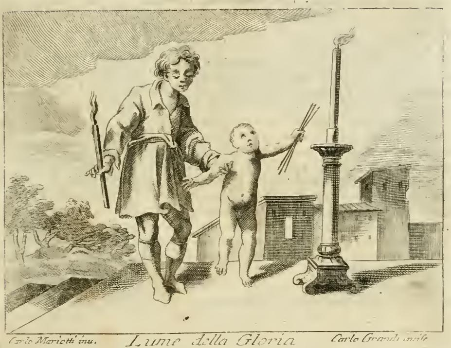

# '영광의 빛'(Lume della Gloria / lumen gloriae)이란 무엇인가

## 1. 한 줄로 먼저

**영광의 빛 = 죽은 뒤 하나님이 영혼에 주시는 창조된 초자연적 빛.** 이 빛이 지성을 강화해 주지 않으면, 유한한 피조 지성은 무한한 하나님의 본질을 직접 볼 수 없다. 곧 지복직관(至福直觀, beatific vision)을 가능하게 하는 **필수 조건**이다.

핵심 논리는 딱 세 단계다.

1. 지복(至福)은 하나님의 본질을 직접 보고 누리는 것이다.
2. 그런데 피조 지성은 **본성만으로는** 그럴 수 없다 — 유한과 무한 사이에 "불균형(improporzione)"과 "무한한 거리(infinita distanza)"가 있기 때문.
3. 따라서 하나님이 지성 쪽에 **빛을 더해 주셔야** 한다. 그 빛이 lumen gloriae다.

---

## 2. 출처 원문: Ripa 『Iconologia』의 "LUME DELLA GLORIA" 항목

이 카드의 출처는 Cesare Ripa 『Iconologia』의 **오를란디 개정판**(Cesare Orlandi 편, Perugia: Piergiovanni Costantini, 1764–1767) 중 "LUME DELLA GLORIA(영광의 빛)" 항목이다. 원문은 이탈리아어이고, 라틴어 성경·신학 전거가 끼어 있다.

### 2-1. 도상 지시문 (원문 → 번역)

> Giovane dì vago aspetto, con piccola facella accesa in mano, ed appresso ve ne sia una grande parimente accesa, e faccia segno di sollevare un piccolo Puttino da terra, il quale tiene tre candele, e fa segno di accenderle in quella che tiene in mano sì grande.

> **용모가 아름다운 젊은이**가 손에 **작은 횃불**을 켜 들고 있고, 그 옆에 똑같이 불붙은 **큰 횃불**이 있다. 젊은이는 **작은 푸토(아기)를 땅에서 들어 올리는** 몸짓을 하는데, 그 아기는 **초 세 자루**를 들고 그 큰 불에서 초를 붙이려는 몸짓을 한다.

### 2-2. 교리 설명 부분 (핵심 대목)

> Due lumi soprannaturali ritrovansi, uno, che si ha per mezzo della grazia di conoscer Iddio, ed amarlo con acceso ardore... Vi è l'altro della Gloria, ed è quello che il Signore dona **dopo la morte** all'anima, acciò possa godere sua Divina Maestà, che **naturalmente non può per l'improporzione, che è infra loro, e per l'infinita distanza**; nè sia possibile goderlo **senza tal lume** (dice il **Dottor Angelico**) *1. par. Sum. q. 12. ar. 2. ... & ea q. ar. 5. per totum.*

> **초자연적인 빛은 두 가지가 있다.** 하나는 은총을 통해 하나님을 알고 불타는 열정으로 사랑하게 하는 빛이며 (…) 다른 하나는 **영광의 빛**으로, **죽음 이후에** 주님이 영혼에게 주시는 빛이다. 영혼이 그 신적 위엄을 누릴 수 있게 하려는 것인데, 영혼은 **본성적으로는** 그럴 수 없다. 둘 사이의 **불균형** 때문이고, **무한한 거리** 때문이다. **그런 빛 없이는** 그것을 누리는 일이 가능하지 않다 — **천사적 박사(토마스 아퀴나스)**가 『신학대전』 제1부 **q.12 a.2**, 그리고 같은 문제의 **a.5 전체**에서 말한 대로다.

카드의 답이 바로 이 문장의 요약이다. "**두 가지 초자연적 빛 중 하나**"라는 표현도 여기서 온 것이고, 아퀴나스 **『신학대전』 I q.12 a.2·a.5**라는 전거도 원문이 직접 달아 놓은 것이다.

### 2-3. 왜 그림에 큰 불과 작은 불을 함께 그리는가

> Si dipinge dunque il lume della gloria... con una facella accesa d'appresso ad una grande, perchè... l'intelletto creato [non è] proporzionato all'oggetto beatifico, ch'è Iddio infinito esistente in tre persone... Queste potenze dunque sono finite, e quanto a loro non possono godere quel Sovrano Oggetto, per la molta distanza, ed improporzione, ch'è infra 'l finito, ed infinito Iddio; dunque il Padre di pietà **le solleva col detto lume di gloria, ch'è un certo abito di carità, e grazia**, ch'egli dona a dette potenze, **rendendole abili a fruir se stesso**.

> 그러므로 신학자들이 '영광의 빛'이라 부르는 것을 **큰 횃불 옆의 작은 횃불**로 그린다. 피조 지성은 지복의 대상, 곧 세 위격으로 존재하시는 무한한 하나님과 **균형이 맞지 않기** 때문이다. (…) 이 능력들은 유한하므로 자기 힘만으로는 그 최고 대상을 누릴 수 없다. 유한과 무한한 하나님 사이의 큰 거리와 불균형 때문이다. 그래서 자비의 아버지께서 **저 영광의 빛으로 그것들을 들어 올리신다.** 그 빛은 **사랑과 은총의 일종의 습성(abito, habitus)**이며, 하나님이 그 능력들에 주셔서 **당신 자신을 누릴 수 있게 만드시는** 것이다.

포인트 두 개.

- 작은 불 = **창조된**(creato) 영광의 빛. 무한한 하나님(큰 불)에 비하면 작다. 즉 lumen gloriae는 하나님 자신이 아니라 **하나님이 주신 피조적 성질**이다.
- 영광의 빛은 순간적 번쩍임이 아니라 **습성(habitus)** — 영혼에 안정적으로 자리 잡은 상태다.

---

## 3. 판화를 직접 읽어 보기

판 아래쪽 서명이 왼쪽 `Carlo Mariotti inv.`(도안), 가운데 표제 `Lume della Gloria`, 오른쪽 `Carlo Grandi incise`(판각)로 읽힌다 — 오를란디 개정판 도판의 전형적인 조합이다.

그림에서 실제로 보이는 것과 원문 해설의 대응:

| 그림에서 보이는 요소 | 원문이 붙인 의미 |
|---|---|
| 오른쪽, **기둥형 촛대 위에서 타는 거대한 불꽃** | 무한한 하나님. "molto grande, anzi infinito Iddio" — 큰 횃불로 "그림자처럼 암시된(ombreggiato)" 하나님 |
| 젊은이가 왼손(관자 기준 화면 왼쪽)에 든 **작고 짧은 횃불** | **창조된 영광의 빛** — 작지만 실재하는 초자연적 빛 |
| 젊은이가 아기의 팔·등을 받쳐 **땅에서 일으켜 세우는 자세** | "le solleva" — 은총이 영혼을 자기 수준 위로 **들어 올림** |
| **알몸의 작은 푸토(아기)** | **영혼**(l'anima). "Il picciolo puttino è l'anima" |
| 아기가 큰 불꽃 쪽으로 뻗어 든 **세 자루의 초** | 영혼의 **세 능력: 기억(memoria)·지성(intelletto)·의지(volontà)** |
| 세 초가 **아직 꺼져 있음**, 큰 불에 갖다 대려는 중 | 세 능력은 "candele da per sè estinte" — 스스로는 꺼진 초이며 **수동적 가능태(potenza passiva)**에 있다. 큰 빛에서 불이 붙은 **뒤에야** 자기 작용을 수행한다 |

원문의 결정적 한 줄:

> ...quel gran lume, al quale sono **in potenza passiva**, e **accese poscia, fanno la loro azione**, concorrendo altresì colla naturalezza loro, e benchè vagheggino oggetto infinito, **in maniera però finita, conforme alla propria capacità**.

> …그 큰 빛에 대해 세 능력은 **수동적 가능태**에 있고, **불이 붙은 다음에야 자기 작용을 한다.** 그때도 자기 본성으로 함께 작용하며, 무한한 대상을 바라보되 **유한한 방식으로, 자기 역량에 맞게** 바라본다.

마지막 구절이 중요하다. 영광의 빛을 받아도 **피조물이 하나님을 다 이해(comprehendere)하는 것은 아니다.** "본다"는 것과 "다 담는다"는 것은 다르다. 아기가 초 세 자루에 불을 붙여도 그 불이 기둥 위의 큰 불꽃만큼 커지지는 않는 것과 같다.

> 참고: 원문 앞 페이지(md 520행)에 붙은 이미지는 이 항목의 판화가 아니라 조판용 장식 컷(꽃무늬 vignette)이라, 여기 싣지 않았다.

---

## 4. 아퀴나스의 논지 — 『신학대전』 I q.12

Ripa 항목이 인용한 두 곳을 실제로 확인해 보면 논증 사슬이 이렇게 이어진다.

### a.2 — 하나님은 '피조된 상(像)'을 통해 보이지 않는다

우리가 사물을 알 때는 보통 **머릿속 표상(species, similitudo)**을 매개로 안다. 그런데 하나님의 본질은 어떤 피조적 유사물로도 대표될 수 없다.

> per nullam similitudinem creatam Dei essentia videri potest
> (어떤 피조된 유사물로도 하나님의 본질은 보일 수 없다)

그래서 아퀴나스는 이 조항에서 이미 해결책의 이름을 꺼낸다.

> **lumen gloriae, confortans intellectum ad videndum Deum**
> (하나님을 보도록 지성을 **강화하는** 영광의 빛)

여기 나오는 **confortare(강화하다·힘을 보태다)**가 lumen gloriae의 성격을 규정하는 동사다. 카드 해설이 말하는 "**lumine gloriae confortatum**(영광의 빛으로 강화된 [지성])"이라는 정형구가 바로 이 표현 계열에서 나왔다.

### a.4 — 본성만으로는 절대 불가능하다

지식은 아는 자의 존재 방식을 따른다(*cognitio est secundum modum cognoscentis*). 피조물은 **참여된 존재**밖에 갖지 못하므로 본성상 '질료 안의 형상'을 아는 데 맞춰져 있다. **하나님만이 자기 존재 자체(ipsum esse subsistens)**이므로, 어떤 피조 지성도 본성의 힘으로는 하나님을 볼 수 없다.

### a.5 — 그래서 '창조된 빛'이 필요하다

지복직관에서는 표상이 매개하는 게 아니라 **하나님의 본질 자체가 지성의 가지적 형상이 된다.**

> ipsa essentia Dei fit forma intelligibilis intellectus
> (하나님의 본질 자체가 지성의 가지적 형상이 된다)

이 높이에 오르려면 지성 쪽에 **초자연적 성향이 덧붙어야** 한다.

> oportet quod aliqua **dispositio supernaturalis** ei **superaddatur**, ad hoc quod elevetur in tantam sublimitatem
> (그토록 높은 곳으로 들어 올려지기 위해서는 어떤 **초자연적 성향**이 지성에 **덧붙어야** 한다)

그 결과 복자들은 **하나님을 닮은 자(deiformes)**가 된다.

> secundum hoc lumen efficiuntur **deiformes**, id est Deo similes
> (이 빛에 따라 그들은 **신형화(神形化)된다**, 곧 하나님과 닮게 된다)

그리고 아퀴나스가 이 조항에서 대는 성경 근거가 **시편**이다.

> **In lumine tuo videbimus lumen** (Ps 35:10 Vulg. = 시 36:9)
> "**주의 빛 안에서 우리가 빛을 보리이다**"

두 개의 '빛'이 나온다는 데 주목하라. **앞의 "주의 빛" = 영광의 빛(우리가 보는 수단), 뒤의 "빛" = 하나님 자신(우리가 보는 대상).** 이것이 정확히 판화의 **작은 횃불 + 큰 횃불** 구도다. Ripa 원문도 이 구절을 그대로 인용한다:

> Le due faci una piccola, e l'altra grande accese, che sono i due lumi, **uno de' quali fa veder l'altro**, come divisò il Profeta. Ps. 35 v. 10: *In lumine tuo videbimus lumen.*
> (작은 것과 큰 것, 두 개의 불붙은 횃불은 두 빛이며, **그중 하나가 다른 하나를 보게 해 준다.**)

### a.5 ad 2 — 가장 정밀한 포인트: '무엇을 통해'가 아니라 '무엇에 의해'

이 빛은 **하나님을 그 안에서 보는 상(像)이 아니다.** 스콜라 용어로:

| 구분 | 라틴어 | 뜻 | lumen gloriae는? |
|---|---|---|---|
| 그 **안에서** 보는 매개 | *medium in quo* | 거울·사진·표상처럼, 그것을 보고 원본을 아는 것 | **아니다** (그러면 간접적 인식이 되어 '직관'이 깨진다) |
| 그 **아래에서/에 의해** 보는 매개 | *medium sub quo* | 빛처럼, 보는 능력을 성립시켜 주지만 그 자체가 보이는 대상은 아닌 것 | **이것** |

즉 lumen gloriae는 하나님과 나 사이에 끼는 **유리창이 아니라, 방에 켜진 조명**이다. 조명은 벽에 대고 보는 대상이 아니고, 조명 때문에 벽을 **직접** 보게 된다. 그래서 영광의 빛이 있어도 지복직관은 여전히 **직접적·무매개적**(Benedictus Deus의 "어떤 피조물의 매개 없이")이다.

---

## 5. 고교 수준 비유: 눈과 빛

> **눈은 빛 없이는 아무것도 못 본다. 그러나 빛은 눈이 아니고, 보는 대상도 아니다.**

- **눈** = 피조 지성 (기능 자체는 온전하다. 고장난 게 아니다)
- **어둠** = 본성 상태. 눈은 멀쩡한데도 하나님을 볼 수 없는 상태
- **빛** = 영광의 빛. 눈에 능력을 **보태 주는** 것
- **벽에 걸린 그림** = 하나님의 본질. 빛이 켜지면 **그림 자체를** 본다 — 빛을 보는 게 아니다

여기서 파생되는 두 가지 오해 방지:

1. **"눈이 망가져서 빛이 필요한 게 아니다."** lumen gloriae는 죄를 치료하는 약이 아니라, 유한한 본성을 **초자연적 목적까지 끌어올리는 상승 장치**다. 죄 없는 천사도, 죄 없는 아담도 영광의 빛 없이는 하나님을 볼 수 없다.
2. **"빛을 켜도 그림을 다 아는 건 아니다."** 본다(*videre*) ≠ 완전히 파악한다(*comprehendere*). 판화 속 아기의 초 세 자루가 기둥 위 대형 불꽃 크기가 되지 않는 것과 같다.

한 걸음 더: 판화의 **작은 횃불이 이미 켜져 있다**는 점도 의미가 있다. 영광의 빛은 영혼이 스스로 발화시킨 것이 아니라, 이미 **하나님 쪽에서 켜서 건네주는** 것이다.

---

## 6. 세 가지 빛의 3단 구별

카드가 말하는 "두 가지 초자연적 빛"은 아래 표의 아래쪽 두 줄이다. 자연의 빛까지 넣으면 3단 계단이 된다.

| | **자연의 빛** *lumen naturale* | **은총의 빛** *lumen gratiae* | **영광의 빛** *lumen gloriae* |
|---|---|---|---|
| **차원** | 자연적 | **초자연적 (1)** | **초자연적 (2)** |
| **언제** | 창조와 함께, 살아 있는 동안 | 세례·회심 이후, 이 생(生)에서 | **죽음 이후**(또는 정화 후) |
| **무엇을 주는가** | 이성의 자연적 인식 능력(지성의 능동적 빛) | 하나님을 **믿음으로** 알고 **사랑으로** 사랑하게 함 | 하나님의 본질을 **직접 봄** |
| **인식 방식** | 피조물을 통한 간접·추론적 인식 | 신앙 — 봄 없이 확신 | **직관(visio intuitiva), 얼굴을 마주 봄** |
| **Ripa 원문 대응** | (별도 언급 없음) | "per mezzo della grazia di conoscer Iddio, ed amarlo con acceso ardore" | "quello che il Signore dona **dopo la morte** all'anima" |
| **성경 전거(원문 인용)** | — | 시 4:7 *Signatum est super nos lumen vultus tui, Domine* / 시 88(89):16 / 시 111(112):4 *Exortum est in tenebris lumen rectis corde* | 시 35:10(36:9) *In lumine tuo videbimus lumen* |
| **비유** | 눈이 있다 | 어스름 속에서 윤곽만 보인다 | 조명이 켜져 대상을 직접 본다 |
| **상태** | 본성 | *habitus* (신덕·사랑) | *habitus* — "un certo abito di carità, e grazia" |

**은총 → 영광의 연속성**: 아퀴나스에게 은총은 영광의 씨앗(*gratia est semen gloriae*)이다. 영광의 빛은 은총의 빛을 부정하고 대체하는 게 아니라 **완성**한다. 판화에서 아기의 세 초가 "본성으로도 함께 작용한다(concorrendo altresì colla naturalezza loro)"고 한 것이 이 연속성의 표현이다.

---

## 7. 성경 전거 정리

Ripa 항목이 실제로 인용한 구절들 + 아퀴나스가 즐겨 쓰는 구절.

| 구절 | 라틴어 | 번역 | 이 교리에서의 역할 |
|---|---|---|---|
| **시 36:9** (Vulg. 35:10) | *In lumine tuo videbimus lumen* | 주의 빛 안에서 우리가 빛을 보리이다 | **핵심 전거.** 보는 수단인 빛과 보이는 대상인 빛의 구별 = 작은 횃불/큰 횃불 |
| **요일 3:2** | *Cum apparuerit, similes ei erimus, quoniam videbimus eum sicuti est* | 그가 나타나시면 우리가 그와 같을 줄을 아는 것은 그의 참모습 그대로 볼 것이기 때문이다 | 봄과 **닮음(deiformitas)**의 연결. a.5의 *efficiuntur deiformes*가 이 구절과 짝을 이룬다 |
| **계 21:23** | *claritas Dei illuminabit eam* | 하나님의 영광이 그 성을 비추고 | a.5가 영광의 빛을 가리키며 인용 |
| 시 4:7 | *Signatum est super nos lumen vultus tui, Domine* | 주의 얼굴의 빛을 우리에게 비추소서 | **은총의 빛** 쪽 전거 (Ripa 인용) |
| 렘 1:5 계열 (Ripa는 "Ger. 49 v.15") | *Ecce enim parvulum dedi te in gentibus* | 내가 너를 뭇 민족 중에 작은 자로 두었노라 | 판화의 **작은 푸토 = 영혼**을 정당화하는 구절로 끌어옴 |
| 시 19:8 계열 (Ripa "Ps. 18 v.8") | *Sapientiam praestans parvulis* | 어린 자를 지혜롭게 하며 | 작은 영혼이 영원한 지혜의 향유로 들어 올려짐 |
| 시 18:29 (Ripa "Ps. 17 v.28") | *Tu illuminas lucernam meam, Domine* | 주께서 나의 등불을 켜시고 | 세 초가 **큰 빛에서** 불붙는 장면의 근거 |

아우구스티누스도 인용된다: ***Visio est tota merces*** — "**봄이 곧 상(賞) 전체다**." 지복은 부수적인 보상이 아니라 **보는 것 자체**라는 뜻이고, 그래서 그 봄을 가능하게 하는 영광의 빛이 결정적이 된다.

---

## 8. 교회의 공식 문헌 두 개

이 교리는 사변으로만 남지 않고 두 번 공적으로 못 박혔다.

### (1) 비엔 공의회, 1312 — 「Ad nostrum qui」

베가르드·베긴파의 오류를 단죄하며 **영광의 빛의 필요성을 사실상 교의로 확정**했다. 단죄된 명제:

> *Quod quaelibet intellectualis natura in se ipsa naturaliter est beata, quodque anima non indiget **lumine gloriae**, ipsam elevante ad Deum videndum et eo beate fruendum.*
> (모든 지성적 본성은 그 자체로 본성적으로 복되며, 영혼은 하나님을 보고 복되게 누리도록 자기를 **들어 올리는 영광의 빛을 필요로 하지 않는다** — 는 것.)

**이 문장이 단죄되었다는 것 = "영혼은 영광의 빛을 필요로 한다"가 교회의 가르침**이라는 뜻이다. 카드 답의 "이 빛 없이는 지복직관이 불가능하다"는 단순한 학설이 아니라 이 단죄에 기대고 있다.

### (2) 베네딕토 12세, 「Benedictus Deus」, 1336년 1월 29일

**지복직관의 시점과 성격을 확정**한 사도적 헌장. 배경은 전임 요한 22세가 사견으로 "지복직관은 최후 심판 이후에야 주어진다"고 말해 벌어진 논쟁이었다. 베네딕토 12세는 신학자 위원단에 교부 문헌 연구를 맡긴 뒤 이렇게 정의했다.

- 의로운 이들의 영혼은 **죽은 직후**(정화가 필요하면 정화 후) **최후 심판을 기다리지 않고** 하나님을 본다.
- 그 봄은 *visione intuitiva et etiam faciali* — **직관적으로, 그리고 얼굴을 마주 보아** 본다.
- **어떤 피조물도 봄의 대상으로서 매개하지 않고**(*nulla mediante creatura in ratione obiecti visi*), 하나님의 본질이 즉각·명료·개방적으로(*plane, clare et aperte*) 스스로를 드러낸다.

여기서 §4의 *medium in quo* / *medium sub quo* 구별이 왜 중요한지가 드러난다. 헌장이 배제한 것은 **대상으로서의 피조 매개**(*in ratione obiecti visi*)이지, 보는 능력을 성립시키는 창조된 빛이 아니다. 두 문헌은 그래서 서로 충돌하지 않는다 — 비엔은 "창조된 빛이 **필요하다**", 베네딕투스 데우스는 "그 봄은 **직접적이다**". 영광의 빛이 *medium sub quo*이기 때문에 둘 다 성립한다.

또한 카드 답의 "**죽음 후**"라는 표현도 Benedictus Deus가 확정한 시점 교리와 정확히 맞물린다.

---

## 9. Ripa 원문이 언급하는 스콜라 논쟁 (심화)

원문은 아퀴나스만 소개하고 끝내지 않는다. **둔스 스코투스(Dottor sottile, '정교한 박사')**의 반론을 붙인다.

> Eziandio stante la possanza Divina non può supplirlo, per essere causa formale, repugnante alla sua natura; benché il **Dottor sottile** asserisce il contrario, volendo che non solo sia causa formale, ma insieme coll'anima *agat per modum causae efficientis*. Quale può Iddio senza imperfezione veruna supplirla.

> 신적 능력이 있다 해도 **하나님이 그 빛을 대신할 수는 없다.** 그것이 **형상인(causa formalis)**이며, [피조물의 형상이 되는 것은] 하나님의 본성에 어긋나기 때문이다. 다만 **스코투스는 반대로** 주장한다. 영광의 빛은 형상인일 뿐 아니라 영혼과 함께 **작용인(causa efficiens)의 방식으로 작용한다**는 것이며, 그렇다면 하나님이 아무 불완전함 없이 그것을 대신하실 수 있다. (Scotus, *Ord.* III d.14 q.2 a.1; IV d.49 q.11)

쟁점을 풀어 쓰면:

- **토마스 계열**: lumen gloriae는 지성을 **형상적으로 규정하는** 성질(habitus)이다. 하나님이 직접 그 역할을 맡으실 수는 없다 — 하나님이 피조물의 내재적 형상이 되는 것은 그분의 본성에 맞지 않으니까. 그러므로 **창조된 빛이 반드시 있어야 한다.**
- **스코투스 계열**: 그 빛의 역할에는 **작용인**의 측면도 있다. 작용인이라면 하나님이 자기 완전성을 해치지 않고 직접 하실 수 있으므로, **원리상 창조된 빛 없이도** 하나님이 직접 지복직관을 일으키실 수 있다(=lumen gloriae는 절대적 필연이 아니라 통상적 방식).

시험·독해 포인트: 카드가 묻는 것은 **토마스의 가르침**이고, Ripa 판화의 도상 해설도 토마스 노선을 따른다(작은 창조된 불이 따로 그려져 있다는 사실 자체가 이미 토마스 편이다).

---

## 10. 자주 틀리는 지점

| 흔한 오해 | 바로잡기 |
|---|---|
| "영광의 빛 = 하나님 자신 / 하나님의 본질" | **아니다. 창조된 빛(lume creato)**이다. 판화의 작은 횃불이 큰 횃불과 별개로 그려진 이유 |
| "영광의 빛을 통해 하나님을 간접적으로 본다" | 아니다. *medium in quo*가 아니라 *medium sub quo*. 봄 자체는 **직접적·무매개적** |
| "죄 때문에 필요한 빛이다" | 아니다. **유한/무한의 존재론적 불균형** 때문이다. 죄가 없어도 필요하다 |
| "은총의 빛과 영광의 빛은 같은 것이다" | 둘 다 초자연적이지만 다르다. 은총 = 이 생에서 **알고 사랑하게** 함(신앙), 영광 = 죽음 후 **봄**(직관) |
| "빛을 받으면 하나님을 완전히 이해한다" | *videre* ≠ *comprehendere*. "무한한 대상을 유한한 방식으로, 자기 역량에 맞게" 본다 |
| "지복직관은 최후 심판 후에 시작된다" | Benedictus Deus(1336)가 배제한 견해다. **죽은 직후**(필요시 정화 후) 시작된다 |
| "영광의 빛은 순간적 조명이다" | *habitus* — 영혼에 지속적으로 자리 잡은 "사랑과 은총의 습성" |

---

## 11. 암기 훅

**"큰 불 하나, 작은 불 하나, 꺼진 초 셋."**

- **큰 불** = 무한한 하나님 (보이는 대상)
- **작은 불** = 영광의 빛 (보는 수단, 창조된 것, 하나님이 켜서 주심)
- **꺼진 초 셋** = 기억·지성·의지. 스스로는 꺼져 있고, 큰 불에 붙은 뒤에야 작동
- **아기를 들어 올리는 손** = "le solleva" — 은총이 영혼을 자기 수준 **위로** 올린다

그리고 문장 하나: ***In lumine tuo videbimus lumen*** — "주의 빛 안에서 우리가 빛을 보리이다." 이 한 구절에 교리 전체가 압축돼 있다.

---

## 참고 자료

- Cesare Ripa, 『Iconologia』, ed. Cesare Orlandi (Perugia: Piergiovanni Costantini, 1764–1767), "LUME DELLA GLORIA" 항목. 판화: Carlo Spiridione Mariotti 도안, Carlo Grandi 판각. — 본 카드의 출처 원문(asset: `02 Letters to Lust.md`, 522–538행; 도판 `_page_56_Picture_1.jpeg`)
- Thomas Aquinas, *Summa Theologiae* I q.12 aa.2, 4, 5 — [New Advent](https://www.newadvent.org/summa/1012.htm)
- Council of Vienne (1311–1312), decree *Ad nostrum qui* — [Papal Encyclicals](https://www.papalencyclicals.net/councils/ecum15.htm), [The Smithy: Ad nostrum qui](http://lyfaber.blogspot.com/2008/06/ad-nostrum-qui.html)
- Benedict XII, *Benedictus Deus* (1336) — [EWTN](https://www.ewtn.com/catholicism/library/benedictus-deus-on-the-beatific-vision-of-god-13139), [Papal Encyclicals](https://www.papalencyclicals.net/ben12/b12bdeus.htm)
- P. J. Waddell, "Aquinas on the Light of Glory" — [SciELO](https://www.scielo.org.mx/scielo.php?script=sci_arttext&pid=S0188-66492011000100005)
- Orlandi 판 서지 정보 — [NYPL Digital Collections](https://digitalcollections.nypl.org/collections/iconologia-del-cavaliere-cesare-ripa-perugino)
