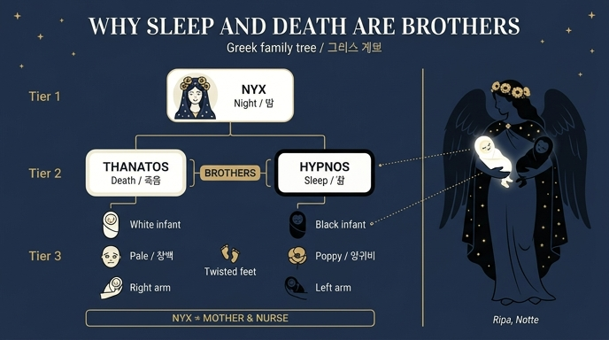

# 잠과 죽음은 왜 형제로 그려지는가?

## 카드 요약

리파 『이코놀로지아』 "밤(Notte)" 항목에 붙은 **카스텔리니(Castellini)의 논고**가 이 카드의 출처다. 밤(Notte)의 도상은 "별이 박힌 푸른 망토를 입고, 어깨에 큰 날개, 검은 살빛, 머리에 양귀비 화관, **오른팔에 흰 아기, 왼팔에 검은 아기**, 두 아기는 모두 발이 뒤틀린 채 잠들어 있다"이다. 이때 두 아기가 **형제**로 묶이는 이유가 이 카드의 질문이다.

답은 두 층으로 되어 있다.

1. **비유적 근거**: 잠이 죽음과 *닮았기* 때문 — 오비디우스의 "잠이란 차가운 죽음의 형상이 아니면 무엇이냐".
2. **계보적 근거**: 실제로 신화 계보상 *한 어머니(밤)의 자식*이기 때문 — 헤시오도스 『신통기』, 호메로스 『일리아스』, 오르페우스 찬가.

그래서 둘은 어머니이자 유모인 밤의 품에 나란히 잠들어 있는 모습으로 그려진다.

---

## (a) 헤시오도스 『신통기』 — 밤이 죽음과 잠의 어머니

### 『신통기』 211–212행 (뉙스의 자식들 목록)

> νὺξ δ' ἔτεκεν στυγερόν τε Μόρον καὶ Κῆρα μέλαιναν
> καὶ Θάνατον, τέκε δ' Ὕπνον, ἔτικτε δὲ φῦλον Ὀνείρων.

> "And Night bore hateful Moros (Doom) and black Ker (Violent Death) and Thanatos (Death), and she bore Hypnos (Sleep), and she bore the tribe of Oneiroi (Dreams)."

> "밤은 미움받는 모로스(운명)와 검은 케르(횡사)와 타나토스(죽음)를 낳았고, 휘프노스(잠)를 낳았으며, 꿈들의 무리를 낳았다."

리파/카스텔리니의 본문은 이 대목을 라틴어 번역으로 인용한다:

> *Nox peperit odiosum fatum & parcam atram / Et mortem; peperit etiam somnum.*

핵심은 **죽음과 잠이 나란히, 같은 한 어머니에게서 태어난다**는 점이다. 헤시오도스는 이 둘을 "쌍둥이"라고 명시하지는 않는다 — 형제 관계까지가 텍스트가 말하는 것이다.

### 『신통기』 756–766행 (밤의 집에 함께 사는 잠과 죽음)

> ἔνθα δὲ Νυκτὸς παῖδες ἐρεμνῆς οἰκί' ἔχουσιν,
> Ὕπνος καὶ Θάνατος, δεινοὶ θεοί· οὐδέ ποτ' αὐτοὺς
> Ἠέλιος φαέθων ἐπιδέρκεται ἀκτίνεσσιν …

> "And there the children of dark Night have their dwellings, Sleep and Death, dread gods: never does the shining Sun look upon them with his rays…"

> "그곳에 어두운 밤의 자식들이 집을 두고 있으니, 잠과 죽음, 무서운 신들이다. 빛나는 태양은 결코 그 광선으로 그들을 내려다보지 않는다…"

이어지는 대목이 두 형제를 **대비**시킨다. 하나(잠)는 "땅과 바다의 넓은 등을 조용히, 인간에게 부드럽게(ἥσυχος … μείλιχος) 돌아다니는" 존재이고, 다른 하나(죽음)는 "쇠 같은 심장과 청동 같은 가슴, 자비 없는 마음(σιδηρέη κραδίη, χάλκεον ἦτορ, νηλεές)"을 지녀 "한번 붙잡은 인간은 놓지 않고, 불사의 신들에게도 미움받는" 존재다.

즉 헤시오도스는 이미 **형제이면서 대조적**이라는, 후대 도상이 그대로 쓰게 되는 구조를 만들어 놓았다. 리파의 흰 아기 / 검은 아기 짝은 이 대비의 시각적 번역이다.

---

## (b) 호메로스 『일리아스』 — 잠은 죽음의 형제

### 『일리아스』 14.230–231 — 헤라가 렘노스에서 잠을 만난다

> Λῆμνον δ' εἰσαφίκανε πόλιν θείοιο Θόαντος·
> **ἔνθ' Ὕπνῳ ξύμβλητο κασιγνήτῳ Θανάτοιο**

> "She came to Lemnos, the city of divine Thoas; **there she met Sleep, the brother of Death**."

> "그녀는 신적인 토아스의 도시 렘노스에 이르렀고, **거기서 죽음의 형제인 잠을 만났다**."

여기서 쓰인 말이 **κασίγνητος(kasignētos, 형제)**다. 이것이 "잠은 죽음의 형제"라는 정식 표현의 가장 유명한 전거다.

카스텔리니는 이 구절을 라틴어로 인용하며 정확히 이 대목을 지목한다:

> *Lemnum pervenit in Civitatem divini Thoantis / Ubi somno obviam venit fratri mortis.*
> (본문: "Omero nella Illiade, 14. Dove Giunone va nella Città di Toante in Lenno incontro al sonno, fratello della Morte.")

### 『일리아스』 16.672 / 16.682 — 사르페돈의 시신을 운반하는 두 신

제우스가 아폴론에게 사르페돈의 시신을 씻겨 **잠과 죽음에게 맡겨** 리키아로 옮기게 하는 대목이다. 같은 정형구가 명령(672)과 실행(682)에서 두 번 반복된다:

> **Ὕπνῳ καὶ Θανάτῳ διδυμάοσιν** (*hypnō(i) kai thanatō(i) didymáosin*)

> "to Sleep and Death, the twin brothers"
> "잠과 죽음, 쌍둥이 형제에게"

682행에서는 이어서 *οἵ ῥά μιν ὦκα / κάτθεσαν ἐν Λυκίης* ("그들은 재빨리 그를 리키아 땅에 내려놓았다")로 이어진다.

여기서 낱말이 달라지는 데 주의할 만하다. 14.231은 **형제(κασίγνητος)**, 16.672/682는 **쌍둥이(διδυμάονες)**다. 카드의 답("잠을 죽음의 형제라 불렀다")은 14.231 쪽 표현에 해당하고, "쌍둥이"라는 더 강한 표현은 16권의 사르페돈 장면에서 온다. 후대 미술에서 두 형상을 거의 구별되지 않는 **한 쌍의 청년**으로 그리는 관습은 이 "διδυμάονες"에 힘입은 것이다.

---

## (c) 오비디우스 인용의 출처 — 『사랑의 노래(Amores)』 2.9

카드의 답에 인용된 문장:

> ***Stulte, quid est somnus, gelidae nisi mortis imago?***
> "어리석은 자여, 잠이란 차가운 죽음의 형상(imago)이 아니면 무엇이냐?"

**확인된 출처: 오비디우스 『아모레스(Amores)』 2권 9번 시, 41행.** 문맥은 다음과 같다(39–42행):

> *Infelix, tota quicumque quiescere nocte*
> *sustinet et somnos praemia magna vocat!*
> ***stulte, quid est somnus, gelidae nisi mortis imago?***
> *longa quiescendi tempora fata dabunt.*

> "밤을 온통 쉬며 보내고 잠을 큰 상(賞)이라 부르는 자는 불행하다! 어리석은 자여, 잠이란 차가운 죽음의 형상이 아니면 무엇이냐? 쉴 시간은 운명이 길게 내려줄 것이다."

주의할 판본 문제: 현대 편집본 다수는 『아모레스』 2.9를 **2.9a(1–24행)와 2.9b(25행 이하)** 로 분할한다. 따라서 같은 행이 문헌에 따라 **"Amores 2.9.41"** 또는 **"Amores 2.9b.17"** 로 표기된다. Perseus는 연속 번호(2.9b, line 41)를 쓴다. 인용할 때는 통상 **Ov. Am. 2.9.41**로 쓰면 된다.

내용상 아이러니: 원문은 사랑 시(elegy)의 맥락에서 "연인이라면 밤에 잠이나 자고 있을 때가 아니다"라는 **애정시적 권유**다. 카스텔리니는 이 문장을 문맥에서 떼어내 **잠과 죽음의 유사성에 대한 형이상학적 격언**으로 재활용한다. 이런 전용(轉用)은 리파류 도상학 저술의 전형적 인용 방식이다.

같은 대목 바로 뒤에 카스텔리니는 카툴루스도 같은 취지로 끌어온다:

> *Nobis cum semel occidit brevis lux, / nox est perpetua una dormienda.*
> "우리에게 짧은 빛이 한번 지면, 잠들어야 할 단 하나의 영원한 밤이 있을 뿐."
> (카툴루스 『카르미나』 5, 5–6행)

즉 **잠 = 짧은 죽음, 죽음 = 영원한 잠**이라는 쌍방향 은유가 라틴 시 전통에 이미 굳어져 있었다.

---

## (d) 오르페우스 찬가 — 잠은 망각과 죽음의 형제

카스텔리니 본문:

> "Prima di tutti **Orfeo** lo riconobbe per fratello della morte nell' Inno del sonno: *Frater enim genitus es oblivionis, mortisque*."
> ("무엇보다 먼저 오르페우스가 『잠에 바치는 찬가』에서 잠을 죽음의 형제로 인정했다: '너는 망각과 죽음의 형제로 태어났으니'")

해당 텍스트는 **『오르페우스 찬가』 85번, 「잠에게(To Hypnos / Εἰς Ὕπνον)」** 다. 널리 통용되는 영역(테일러 역)은 이렇게 읽힌다:

> "Thy pleasing, gentle chains preserve the soul, / and e'en the dreadful cares of death control; / **for Death and Lethe with oblivious stream, / mankind thy genuine brothers justly deem.**"

즉 잠의 형제로 **죽음(Thanatos)** 과 **망각(Lethe)** 이 함께 지목된다. 카스텔리니의 라틴어 *oblivionis, mortisque*가 이 "Lethe + Thanatos" 쌍을 정확히 옮긴 것이다.

**단정하지 말아야 할 지점 — 연대 문제.** 카스텔리니는 오르페우스를 "누구보다 먼저(prima di tutti)"라고 하여, 호메로스·헤시오도스보다 앞선 최고(最古) 증언으로 취급한다. 이는 오르페우스를 실존하는 태고의 시인으로 보던 르네상스의 통념이다. **현대 문헌학의 독법은 다르다**: 현전하는 『오르페우스 찬가』 모음집은 대체로 기원후 2–3세기(늦어도 헬레니즘 이후) 소아시아의 의례 텍스트로 본다. 따라서 실제 연대순은 **호메로스·헤시오도스 → (한참 뒤) 오르페우스 찬가**이며, 찬가는 이 형제 관념의 *기원*이 아니라 *계승·정착*의 증거다. 카드의 답을 외울 때 "오르페우스도 그렇게 불렀다"는 사실만 취하고, "가장 먼저"라는 리파 쪽 주장은 **리파/카스텔리니의 주장**으로 분리해 두는 것이 안전하다.

또한 인용 위치(찬가 85의 몇 행인지)는 판본에 따라 번호가 흔들리므로, 확인되지 않은 정확한 행수를 단정하지 않는 편이 좋다. 확실한 것은 **찬가 85(잠에게) 안에 잠을 레테와 죽음의 형제로 부르는 대목이 있다**는 점이다.

---

## (e) 왜 '어머니'와 '유모'가 둘 다 쓰이는가 — 출처가 다르다

이것이 이 카드에서 가장 헷갈리기 쉬운 부분이다. 카스텔리니 본문이 직접 구분해 준다:

> "La notte in questa figura di **Pausania** è **Balia, Nutrice** del sonno; ma nella **Teogonia di Esiodo** si fa **Madre** del sonno e della Morte."

| 역할 | 출처 | 근거 |
|---|---|---|
| **어머니(Madre / mater)** | **헤시오도스 『신통기』 211–212** (그리고 756–758의 "Νυκτὸς παῖδες, 밤의 자식들") | 밤이 잠과 죽음을 **낳는다**. 문자 그대로의 계보. |
| **유모(Nutrice / Balia, τροφός)** | **파우사니아스 『그리스 이야기』 5.18.1**, 올림피아의 **킵셀로스의 궤(Arca di Cipselo)** 부조 기술 | 궤에 새겨진 여인이 흰 아기와 검은 아기를 안고 있고, 새겨진 **에피그램이 그 여인을 "둘 모두의 유모인 밤"이라 지시한다.** |

카스텔리니의 마무리 설명이 두 역할을 화해시킨다:

> "La Notte è **Madre** del sonno, perché …(밤의 습기가 위의 증기를 올려보내 잠을 만든다는 아리스토텔레스식 생리학)… **Nutrice** la fecero gli Eliaci, perché la notte non solo **genera** il sonno, ma lo **nutrisce** ancora nelle sue notturne tenebre."

> "밤은 잠의 **어머니**다 — 잠을 *낳기* 때문이다. 엘리스 사람들(= 파우사니아스가 기록한 『엘리스 편』의 유물)은 밤을 **유모**로 만들었다 — 밤은 잠을 낳기만 하는 것이 아니라 자기 어둠 속에서 계속 *길러 주기* 때문이다."

여기에 성 바실리우스의 문장까지 덧붙인다: *Tenebrae … somnolentiam nutriunt* ("어둠은 졸음을 길러 준다"). 즉 **어머니 = 발생의 원인, 유모 = 지속의 원인**이라는 이중 기능이 두 낱말의 근거다. 그래서 도상에서는 밤이 두 아기를 낳은 어머니이면서, 동시에 두 아기를 품에 **안아 재우는** 유모로 함께 나타난다.

### 곁가지 — 리파 본문의 출처 혼동, 그리고 흰 아기/검은 아기 논쟁

카드 밖의 세부지만 알아 두면 이 대목이 훨씬 선명해진다.

- 리파 본인의 "Notte" 항목(짧은 도상 기술)은 이 근거를 "파우사니아스가 『엘리스 편』에서, 엘리스 지방의 **어느 신전에서 발견된 상(statua)**"이라고 적었다. 카스텔리니는 이를 바로잡아 **파우사니아스 5권의 킵셀로스의 궤 부조**임을 밝히고, 그리스어 원문에서 확인한 라틴 번역을 제시한다.
- 더 큰 논쟁은 **어느 아기가 죽음인가**다. 카스텔리니는 카르타리(Vincenzo Cartari)와 나탈레 콘티(Natale Conti)가 "**검은** 아기가 죽음"이라 한 것을 **오류**라 지적하고, 파우사니아스의 어순("먼저 언급된 아기 = 흰 아기 = unum")에 따라 **흰 아기 = 죽음, 검은 아기 = 잠**이라고 못 박는다. 근거는 **죽음의 창백함(morte pallida)** 이다 — 호라티우스 *ora pallor albus inficit*, 베르길리우스 『아이네이스』 4권의 *animas … pallentes*, 스타티우스의 *alba Atropos*. 반대로 **잠은 검은데**, 정신이 잠 속에서 어둠에 묻히기 때문이며 스타티우스도 *erratque niger per nubila somnus*("검은 잠이 구름 사이를 헤맨다")라 했다.
- 또 카스텔리니는 로몰로 아마세오(Romolo Amaseo)의 라틴 번역이 **검은 아기만** 발이 뒤틀린 것처럼 옮긴 것도 오류라 하고, 원문은 **둘 다(utrosque distortis pedibus)** 발이 뒤틀렸다고 정정한다. 뒤틀린 발의 뜻: 죽음은 태어난 날부터 절뚝이며 천천히 뒤따라오고(세네카 *quotidie morimur*) 삶의 계획을 절게 만들며, 잠은 운동의 결여이자 삶의 절반을 절게 만들기 때문이다.
- **현대 판본의 독법과의 차이**: 파우사니아스 5.18.1의 그리스어와 에피그램은 어느 아기가 죽음인지 **결정적으로 확정해 주지 않는다.** 색 상징(검정=죽음)을 따라 반대로 읽는 현대 주석도 적지 않다. 그러므로 "흰 아기 = 죽음"은 **카스텔리니가 논증으로 확정한 독법**이며, 그리스 원전이 명시한 사실로 단정할 수는 없다. 다만 **리파 『이코놀로지아』의 도상을 읽을 때는 카스텔리니의 독법(오른팔·흰 아기 = 죽음 / 왼팔·검은 아기 = 잠)이 표준**이다.

---

## (f) 이 형제 관념의 후대 계보

- **레싱, 『고대인은 죽음을 어떻게 형상화했는가(Wie die Alten den Tod gebildet)』(1769)**. 레싱은 고대인이 죽음을 해골·낫을 든 사신으로 그리지 않았고, **횃불을 꺼뜨리며 조용히 서 있는 아름다운 청년(Jüngling)** 으로 형상화했다고 논증했다. 그 결정적 근거가 바로 **죽음이 잠의 형제**라는 문헌·도상 전통이다 — 잠이 부드러운 청년이라면 그 형제도 그래야 한다는 논리다. 이 저작은 헤르더(1786)의 반론을 부르며 18세기 미술사·도상학의 유명한 논쟁으로 번졌고, 결과적으로 **중세적 죽음(해골) ↔ 고대적 죽음(잠의 형제인 청년)** 이라는 대립축을 근대 미술사에 정착시켰다.
- **신고전주의 회화·조각과 사르페돈 도상**. 『일리아스』 16권의 "잠과 죽음이 사르페돈의 시신을 운반한다"는 장면은 신고전주의가 가장 좋아한 주제 중 하나가 된다. 플랙스먼(John Flaxman)의 호메로스 삽화 연작, 퓌슬리(Fuseli)·카르스텐스(A. J. Carstens) 계열의 소묘, 웨지우드 도자의 부조 등에서 **거의 구별되지 않는 두 날개 달린 청년**으로 반복 등장한다. 이는 헤시오도스적 "형제"보다 호메로스 16권의 **διδυμάονες(쌍둥이)** 를 시각화한 것이다.
- **19세기의 정서적 재해석**. 워터하우스(J. W. Waterhouse), 『잠과 그의 이복형제 죽음(Sleep and His Half-Brother Death)』(1874, 왕립미술원 첫 출품작). 나란히 누운 두 청년 중 **앞쪽은 빛을 받고 양귀비를 쥔 잠**, **뒤쪽은 어둠에 잠긴 죽음**이다. 리파의 도상 문법이 그대로 살아 있다 — **양귀비 = 잠**, **밝음/어두움의 대비 = 두 형제의 구별**, 그리고 두 형상을 **하나의 화면(밤)에 함께 눕히기**. 화가가 두 남동생을 결핵으로 잃은 직후에 그린 그림이라는 점에서, 고대의 계보 도상이 근대의 사적 애도 언어로 옮겨간 사례로도 읽힌다.
- **묘지 미술의 상투구**. "여기 잠들다(hic dormit / requiescit in pace)", 잠자는 아이 형상의 묘비, 양귀비 장식 등 19세기 묘지 조형의 어휘 전체가 이 형제 관념의 대중적 잔향이다. 카스텔리니가 인용한 카툴루스의 *nox est perpetua una dormienda*("잠들어야 할 단 하나의 영원한 밤")가 사실상 그 표어다.

---

## 한 줄 정리

**닮음(오비디우스: 잠은 차가운 죽음의 형상) + 계보(헤시오도스: 밤이 둘을 낳음) + 호칭(호메로스: 죽음의 형제, 쌍둥이 / 오르페우스 찬가: 망각과 죽음의 형제)** 이 겹쳐서, 잠과 죽음은 **어머니이자 유모인 밤의 두 팔에 잠든 두 아기**로 그려진다. '어머니'는 헤시오도스에서, '유모'는 파우사니아스가 전한 킵셀로스의 궤에서 온 말이다.

## 인포그래픽

