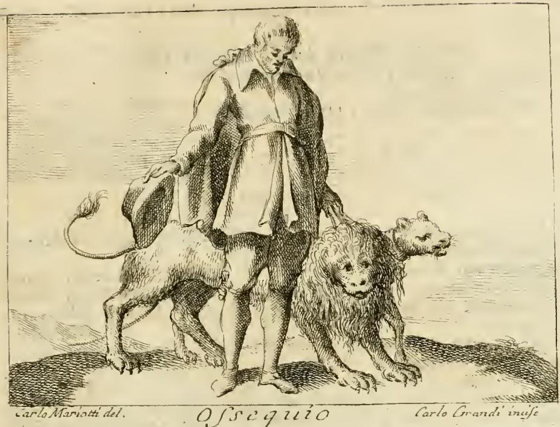

# 공손(Ossequio) — 모자를 벗어 든 사내와 묶인 맹수

## 한눈에

| 지물 | 원문 | 뜻 |
|---|---|---|
| 장년(壯年)의 남자 | *Uomo di età virile* | 젊은이의 경쟁심이 가라앉은, 중용을 아는 나이 |
| 맨머리 + 약간 숙인 고개 | *colla testa scoperta, ed alquanto china, in atto umile* | 겸손·순종(sommissione) |
| 뒤로 뺀 왼쪽 다리 | *ritirata la sinistra gamba indietro* | 물러서며 절하는 예법의 자세 |
| 오른손에 든 베레모/모자 | *tenendo la berretta, o cappello... colla destra mano* | 지극한 경의(riverenza grandissima) |
| 왼손에 묶어 쥔 사자와 호랑이 | *Colla sinistra mano tenga legati un Leone, ed una Tigre* | 사납고 오만한 마음(animi fieri, altieri, superbi)조차 길들이는 힘 |
| 표어 | *Obsequium amicos parit* (테렌티우스 『안드리아』) | "공손은 친구를 낳는다" |

리파는 이 항목에 별도의 예화(fatti)를 붙이지 않고 **"De' Fatti, vedi Umiltà, Obbedienza &c."**(예화는 「겸손」·「순종」 항목을 보라)로 넘긴다. 즉 리파 자신이 Ossequio를 겸손·순종과 한 묶음으로 취급했다.

## 판화에서 실제로 보이는 것

18세기 페루자판(체사레 오를란디 편, 1764–67) 『이코놀로지아』 제4권의 도판. 하단에 **Carlo Mariotti del.**(밑그림) / **Carlo Grandi incise**(판각), 가운데 표제 **Ossequio**가 새겨져 있다. 「Ospitalità(환대)」와 「Ostinazione(고집)」 사이에 놓인 항목이다.

관찰되는 요소를 텍스트와 맞춰 보면:

- **맨머리와 숙인 고개** — 텍스트 그대로다. 더블릿(doublet)과 반바지(breeches) 차림의 중년 남자가 모자를 쓰지 않은 채 고개를 앞으로 떨구고 있다. 시선은 바닥을 향해 상대의 눈을 마주보지 않는다.
- **내린 오른손의 모자** — 화면 왼쪽(인물 기준 오른쪽)으로 늘어뜨린 팔 끝에 챙 넓은 부드러운 모자가 들려 있다. *berretta, o cappello*("베레모든 모자든")라는 리파의 느슨한 지정이 여기서는 챙모자로 구체화됐다.
- **묶인 두 맹수** — 화면 오른쪽에 갈기 있는 사자의 머리가 앞으로 나오고, 그 뒤·위쪽으로 갈기 없이 이빨을 드러낸 고양잇과 짐승(호랑이) 머리가 겹쳐 솟는다. 두 짐승의 몸통은 인물의 다리 뒤를 지나 화면 왼쪽으로 뻗고, 왼쪽 끝에 술 달린 꼬리가 보인다. 목줄(끈)이 짐승의 목에서 인물의 몸 쪽으로 이어지고 허리·왼쪽 무릎께에 매듭이 걸려 있다.

### 텍스트와 어긋나는 지점 (출제 포인트)

1. **왼손이 보이지 않는다.** 리파는 "왼손으로 사자와 호랑이를 묶어 쥔다"고 못 박았지만, 판화에서 인물의 왼팔과 왼손은 짐승의 몸통에 거의 가려져 있다. 끈은 그의 왼쪽 옆구리를 지나 뒤로 돌아가는 것처럼 보일 뿐, "쥔 손"이 명시적으로 그려지지 않는다. 결과적으로 **손에 잡힌 줄이 아니라 몸에 매인 줄**처럼 읽히기도 한다.
2. **뒤로 뺀 왼발이 사실상 사라졌다.** *ritirata la sinistra gamba indietro*는 한쪽 다리를 뒤로 빼며 몸을 낮추는 근세식 인사 동작인데, 판화의 두 다리는 거의 나란히 정면으로 지면에 놓여 있어 물러선 발이 읽히지 않는다. 짐승 두 마리가 다리 아래를 가로막으면서 하반신의 자세가 지워진 셈이다.
3. 반면 **오른손의 모자**는 텍스트대로다. 즉 이 도판은 "오른손=모자"는 지켰지만 "왼손=고삐", "왼발=뒤로"는 흐려 놓았다. 리파의 문자 처방과 실제 판화가 늘 일치하지는 않는다는 좋은 사례다.

## 원문과 해설

### 정의부

> **Uomo di età virile, che sia colla testa scoperta, ed alquanto china, in atto umile; che ritirata la sinistra gamba indietro, e tenendo la berretta, o cappello che sia colla destra mano, mostri con tal gesto ossequio, e riverenza grandissima. Colla sinistra mano tenga legati un Leone, ed una Tigre.**

"장년의 남자, 머리를 드러내고 조금 숙인 겸손한 몸짓으로, 왼쪽 다리를 뒤로 물리고 오른손에 베레모나 모자를 들어 그런 몸짓으로 지극한 공손과 경의를 나타낸다. 왼손으로는 사자와 호랑이를 묶어 쥔다."

### 왜 '장년'인가

> *Si dipinge di età virile, perciocché in essa vi si ritrova i mezzi, ed il convenevole, e non come nella gioventù, che ama, e stima assai di essere superiore ad altri, come dice Aristotele nella Rettorica.*

장년으로 그리는 이유는 그 나이에 **중용(i mezzi)과 합당함(il convenevole)**이 있기 때문이다. 젊은이는 남보다 우월하기를 좋아하고 그것을 높이 친다 — 아리스토텔레스 『수사학』 제2권의 연령별 성격론(청년은 명예욕이 강하고 승부에 집착한다)을 끌어온 것이다. 공손은 혈기가 가라앉은 뒤에야 안정된 습성이 된다는 뜻.

### 맨머리와 숙인 고개 → 테렌티우스

> *La testa scoperta alquanto china in atto umile, dimostra la sommissione di chi riverentemente cerca con animo grato di farsi benevolo, per l'acquisto degli amici; onde sopra di ciò Terenzio in Andria così dice: **Obsequium amicos parit**.*

"드러내고 조금 숙인 머리는, 감사하는 마음으로 공경히 호감을 사고자 하는 이의 **복종(sommissione)**을 보여준다. **친구를 얻기 위해서다.**" 여기서 리파는 공손을 단순한 매너가 아니라 **우정을 획득하는 사회적 기술**로 규정한다.

### 사자와 호랑이 → 오비디우스

> *Tiene colla sinistra mano legati il Leone, e la Tigre, per significare che l'Ossequio, colli suoi mezzi ha forza di domare Leoni, e Tigri, cioè **animi fieri, altieri, e superbi***

"사자와 호랑이를 묶어 쥔 것은, 공손이 그 수단으로써 사자와 호랑이 — 즉 **사납고 거만하고 교만한 심성** — 을 길들일 힘이 있음을 뜻한다." 맹수는 실제 짐승이 아니라 **다루기 힘든 상대의 성정**의 알레고리다. 공손은 힘으로 이기지 못할 상대를 굴복시키는 우회 전략이다.

리파가 붙인 전거는 오비디우스 『사랑의 기술』(*De arte amandi* = *Ars amatoria*) 제2권 179–184행:

> Flectitur obsequio curvatus ab arbore ramus,
> frangis, si vires experiare tuas.
> Obsequio tranantur aquae: nec vincere possis
> flumina, si contra, quam rapit unda, nates.
> **Obsequium tigresque domat Numidasque leones;**
> rustica paulatim taurus aratra subit.

"나무에서 휜 가지는 순순히 따라주면 굽지만, 네 힘을 시험하려 들면 부러진다. 물은 순응함으로써 헤엄쳐 건널 수 있다. 물결이 몰아가는 반대로 헤엄치면 강을 이기지 못한다. **순종은 호랑이도, 누미디아의 사자도 길들인다.** 황소도 차츰 시골의 쟁기를 받아들인다."

→ 사자·호랑이 도상은 오비디우스의 이 시행에서 **문자 그대로 옮겨온 것**이다. 도판의 두 맹수는 삽화가의 창안이 아니라 인용의 시각화다. (책의 인쇄본 OCR에는 *tumidosque Leones*로 나오지만 오비디우스 정본은 *Numidasque leones*이다.)

## 어휘 노트: *ossequio*는 '공손'보다 넓다

- 어원은 라틴어 **obsequium** ← *ob-sequi*("~를 따라가다"). 핵심 의미는 **따름**이다.
- 로마 사회에서 obsequium은 태도가 아니라 **관계상의 의무**였다. 해방노예가 옛 주인(patronus)에게, 클리엔스가 파트로누스에게, 병사가 지휘관에게 지는 **순종·봉사의 도리**를 가리키는 법적·사회적 용어다.
- 따라서 이탈리아어 ossequio는 ① 예의 바른 태도, ② **순종·복종**, ③ 윗사람에 대한 **예를 다한 섬김·경의 표시**를 한꺼번에 덮는다. 오늘날에도 *ossequi*는 편지 말미의 "삼가 경의를 표합니다"로 쓰인다.
- 현대 한국어 '공손'은 대체로 ①(말과 몸가짐의 공손함)에 한정되므로, 리파의 Ossequio를 '공손'으로만 읽으면 **묶인 맹수**(=상대를 굴복시키는 힘)와 **왜 우정 획득이 목표인가**가 설명되지 않는다. '순종'·'복종'·'예를 다한 섬김'까지 포함한 개념으로 잡아야 도상이 일관된다.
- 부정적 함의도 있다: 이탈리아어 *ossequioso*는 "굽실거리는", 영어 *obsequious*는 아예 "아첨하는"으로 굳었다. 아래 테렌티우스 인용의 원래 맥락이 바로 그 부정적 쪽이다.

## 끊어 인용된 테렌티우스

리파가 쓴 *Obsequium amicos parit*는 **반쪽**이다. 원문(테렌티우스 『안드리아』 1막 1장 41행 = 통행본 68행)은

> **(namque hoc tempore) obsequium amicos, veritas odium parit.**
> "(요즘 세상에는) 순종이 친구를 낳고, **진실은 미움을 낳는다.**"

- 화자는 시모(Simo)의 해방노예 **소시아(Sosia)**다. 해방노예가 obsequium을 말한다는 점 자체가 앞의 어원 노트와 맞물린다 — 그에게 obsequium은 신분상의 의무였다.
- 원문은 **대구(對句)로 된 냉소**다. "요즘 세상에는(hoc tempore)"이라는 한정이 붙어 있고, 뒤 반절이 앞 반절을 뒤집는다. 즉 "비위 맞추면 친구가 생기고 바른말 하면 미움을 산다"는, **아첨이 통하는 세태에 대한 씁쓸한 관찰**이지 덕에 대한 찬사가 아니다.
- 리파는 뒤 반절(*veritas odium parit*)과 시간 한정(*hoc tempore*)을 잘라내고 앞 반절만 남긴다. 그 순간 **세태 비판이 도덕 격률로 뒤집힌다.** 조건부 진술("지금은 이렇더라")이 무조건적 처방("공손하면 친구가 생긴다")이 되고, 아첨을 뜻하던 obsequium이 미덕의 이름이 된다.
- 이런 절단 인용은 르네상스 격언집의 관행이기도 하다. 에라스뮈스 『아다지아』류를 거쳐 유통되면서 문맥에서 떨어져 나온 반행(半行)이 독립 표어로 굳었고, 리파는 그 유통된 형태를 그대로 받아 썼다.

## 사회적 배경: 모자 벗기(hat honour)

도상의 핵심 동작인 "모자를 벗어 손에 든다"는 상징적 고안이 아니라 **당대에 실제로 통용되던 예법**이다.

- 16–18세기 유럽에서 남성의 인사는 **모자를 벗어 손에 들고(때로는 낮게 쓸어내리며) 고개와 몸을 숙이는 것**이었고, 이를 영어권에서 *hat honour*라 불렀다. 모자를 언제, 누구 앞에서, 얼마나 오래 벗고 있느냐가 신분 서열을 그대로 드러냈다.
- 신분이 낮은 쪽이 먼저 벗고, 높은 쪽은 벗지 않거나 살짝 들어 답례한다. 왕 앞에서는 모두가 벗는다. 따라서 **맨머리 자체가 곧 '아랫사람의 위치'를 시각화**한다. 판화의 남자가 모자를 다시 쓰지 않고 손에 내려 든 채 서 있는 것은 "경의를 계속 유지하고 있음"을 뜻한다.
- 이 예법이 얼마나 무거웠는지는 그것을 거부한 사례로 알 수 있다. 17세기 퀘이커교도는 신 앞에서만 머리를 벗는다며 판사·귀족 앞에서 모자 벗기를 거부했고, 그 때문에 법정모독으로 처벌받았다. 모자 하나가 사회 질서 자체를 상징했던 것이다.
- 뒤로 뺀 왼발 역시 같은 계열의 실제 동작이다. 한 발을 뒤로 물리며 무게중심을 낮추는 것이 근세 남성 인사(bow)의 표준형이었고, 궁정 예법서(발다사레 카스틸리오네 『궁정론』, 조반니 델라 카사 『갈라테오』 계열)가 규정한 몸가짐이다.

즉 리파의 Ossequio는 추상 개념을 위한 상상의 기호가 아니라, **당시 사람이 매일 하던 인사 동작을 그대로 가져다 놓고 거기에 맹수 두 마리를 덧붙여** 알레고리로 만든 것이다.

## 암기용 정리

**나이**는 장년(아리스토텔레스: 중용), **머리**는 맨머리에 숙임(테렌티우스: 친구를 낳는다), **오른손**은 모자(모자 벗기 예법), **왼발**은 뒤로(절), **왼손**은 사자+호랑이 고삐(오비디우스: 순종은 호랑이도 누미디아 사자도 길들인다).

한 문장으로: **"모자 벗어 든 장년의 사내가 맹수 두 마리를 줄에 매어 끌고 있다"** — 굽히는 자세가 곧 사나운 상대를 제압하는 수단이라는 역설.
