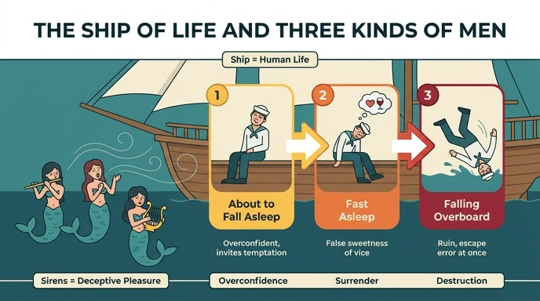

# 세이렌(SIRENE) 도상의 배와 세 부류의 사람들

## 질문

세이렌 그림에 곁들인 배와 세 부류의 사람들은 무엇을 뜻하는가?

## 한눈에 보기

| 도상 요소 | 알레고리적 의미 |
|---|---|
| 바다 위의 배(Naviglio) | 신중함(prudenza)과 지혜(saviezza)로 조종하지 않으면 큰 위험에 노출되는 **인간의 삶** |
| 막 잠들려는 자들 | **자기 과신** — 자신을 너무 믿어 유혹의 기회를 피하지 않고 어리석게 시험하다 난파 위험에 스스로 뛰어드는 이들 |
| 이미 잠든 자들 | **악덕에 안긴 자** — 악덕의 품에 몸을 던지고, 속이는 잠의 거짓 단맛에서 깨어나지 못해 그대로 영원한 죽음으로 넘어가는 이들 |
| 배에서 물로 떨어지는 자들 | **파멸의 경고** — 자기 악덕을 믿었다가 이끌려 멸망한 불행한 자들. 그 돌이킬 수 없는 추락으로, 잘못의 기회를 피하고 이미 잘못에 빠졌다면 **즉시** 벗어나야 함을 우리에게 가르치는 이들 |

## 원본 판화

그림에서 실제로 관찰되는 요소:

- **왼쪽 전경, 물속의 세 세이렌** — 허리 아래가 물고기(또는 새)인 세 미녀. 왼쪽은 **피바/플라우토(피리)**를 입에 대고, 가운데는 입을 벌려 **노래하는 자세**, 오른쪽은 **리라(lyre)**를 안고 연주한다. 리파-오를란디의 지시문 그대로다.
- **오른쪽, 돛대와 삭구가 있는 배 한 척** — 이것이 곧 '인생'이다. 뱃전 안쪽에 앉은 인물들이 보인다.
- 배 위 인물들의 자세가 **세 단계로 갈라진다**: 뒤쪽 한 사람은 고개를 푹 떨구고 상체가 무너져 **완전히 잠들어 있고**, 그 앞의 사람은 아직 상체를 세운 채 고개가 꺾이며 **막 졸음에 넘어가는 중**이며, 배의 오른쪽 뱃전 밖으로는 **몸이 넘어가 물로 떨어지는 인물**이 걸려 있다.
- 따라서 한 장의 판화 안에서 **왼쪽(유혹의 노래) → 오른쪽(졸음 → 숙면 → 추락)**이라는 타락의 시간 순서가 공간적으로 읽힌다.

## 원문 근거 (Cesare Orlandi, Iconologia 4권 「SIRENE」)

도상 지시문:

> "Si dipingerà altresì nello stesso mare un Naviglio, su cui si ammirino alcuni Uomini, parte dormienti, parte in atto di addormirsi, e parte rovinare da esso in acqua."
> (같은 바다에 배 한 척을 그리는데, 그 위에 어떤 사람들은 잠들어 있고, 어떤 사람들은 막 잠들려 하고, 어떤 사람들은 배에서 물로 떨어지도록 한다.)

해설부:

> "Il Naviglio pertanto in mare dinota l'umana vita esposta a gravi pericoli, se con prudenza e saviezza non sa regolarsi."
> → 배 = 신중함과 분별로 다스리지 않으면 중대한 위험에 노출되는 인간의 삶.

> "Gli Uomini, che sono in atteggiamento di addormentarsi, sono figura di quelli, che di se stessi troppo fidandosi, non isfuggono le occasioni, e sciocamente con quelle cimentandosi, si pongono a rischio di naufragare."
> → 막 잠들려는 자 = 자기를 과신해 유혹의 '기회(occasioni)'를 피하지 않고 어리석게 그것과 겨루다 난파 위험에 처하는 자.

> "I dormienti dimostrano coloro, che si donano in braccio a' vizj, e che dalla falsa dolcezza di un sonno così ingannatore non riscuotendosi, sono per far passaggio da quello ad una perpetua infelicissima morte."
> → 잠든 자 = 악덕의 품에 스스로를 내주고, 속이는 잠의 거짓 단맛에서 깨어나지 못해 거기서 곧장 영원한 불행한 죽음으로 건너가는 자.

> "Quelli che rovinano in mare ci significano quegl' infelici, che da' loro vizj, a' quali tanto credettero e si affidarono, tratti in perdizione, a noi col loro irreparabile precipizio insegnano, che dobbiamo sfuggire ogn' incontro di errare; e che in braccio all' errore trovandoci, dobbiamo ben subito da quello liberarci, se rovinar non vogliamo nell' abisso di ogni eterno male."
> → 물에 빠지는 자 = 자기 악덕을 신뢰했다가 파멸로 끌려간 불행한 이들. 그 회복 불가능한 추락 자체가 "잘못의 계기를 피하라, 이미 잘못 속에 있다면 즉시 벗어나라"는 교훈이 된다.

## 맥락: 왜 배를 덧붙였는가

리파-오를란디는 배를 그린 이유를 **오디세우스 일화의 삽화가 아니라고 명시**한다.

> "Il Naviglio, che mi è piaciuto di figurare appresso, non tanto allude a ciò, che ci racconta di Ulisse, od al Naufragio di quelli, che nelle Sirene s'incontravano, quanto per dare ad intendere, che varj sono i pericoli, che agli Uomini avvengono, per non isfuggire, o darsi ancora in preda alle lusinghe del senso..."

즉 배는 **특정 신화 장면의 재현이 아니라 보편적 교훈의 장치**다. 세이렌이 상징하는 것은 육욕적 사랑에 그치지 않고 **아첨(adulazione), 오만(superbia), 나태(ozio)**까지 포함하며, 배는 그 모든 "감각의 아첨"에 삼켜질 수 있는 인간 조건 일반을 가리킨다.

## 함께 알아두면 좋은 것: 세 세이렌의 의미

세이렌이 셋인 것도 우연이 아니다. 저자는 감각이 부딪혀 침몰하는 **세 개의 암초(scogli)**를 나타낸다고 한다.

1. **눈(gli occhi)** — 파르테노페(Partenope). 그리스어로 '모습/외양'과 연결. 사랑이 눈이라는 문을 통해 몰래 들어와 심장을 점령하고 곧 폭군이 된다. ("oculi sunt in amore duces" — 프로페르티우스)
2. **말(le parole)** — 리기아(Ligia). '노래하는', '달콤하게', 또는 *ligando*(묶다)·*illiciendo*(꾀다)에서 유래. "Verba ligant homines" — 말이 사람을 묶는다.
3. **교제/접촉(il commercio)과 아름다움** — 레우코시아(Leucosia). 그리스어 λευκόν(흰색)에서. 흰 살빛이 인간적 아름다움의 핵심 매력이며 사람의 마음을 끌어 음란으로 떨어뜨린다.

즉 **세 세이렌(유혹의 세 경로) → 배 위 세 부류(유혹에 대한 세 가지 반응/단계)**로 구조가 대응한다. 세이렌 자체는 "감각의 속임수적 즐거움(l'ingannevol piacere del Senso)"의 알레고리다.

## 암기 포인트

- 배 = **인생**(신중함 없으면 위험)
- 졸려는 자 = **과신**, 기회를 피하지 않음
- 잠든 자 = **악덕의 거짓 단꿈**, 깨어나지 못함 → 영원한 죽음
- 떨어지는 자 = **파멸**, 그리고 "즉시 벗어나라"는 교훈
- 순서: 과신 → 함몰 → 추락 (졸음 → 숙면 → 낙수)

## 인포그래픽

