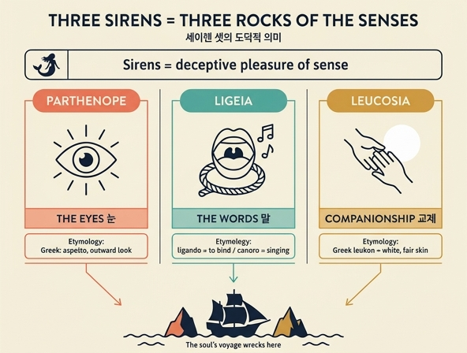

# 세이렌이 셋인 것의 도덕적 의미

> **Q.** 세이렌이 셋인 것의 도덕적 의미는?
>
> **A.** 세이렌은 감각의 기만적 쾌락을 뜻하며, 셋은 감각이 부딪혀 파멸하는 세 개의 주요 암초 — 눈(시선), 말, 교제 — 를 나타낸다. 파르테노페는 눈(외모)을, 리기아는 '묶다(ligando)' 또는 '노래하는'에서 온 이름으로 달콤한 말을, 레우코시아는 그리스어 '희다'에서 온 이름으로 육체의 아름다움(흰 살결)을 상징한다.

출처: 『Iconologia』(Cesare Ripa 계열, Cesare Orlandi 증보판) 「SIRENE」 항목 — `.fm/assets/08 Monsters and Muses.md`

---

## 1. 판화가 보여주는 것


Orlandi가 지시한 도상 규범(원문: *"I figureranno nel mare tre belliffime Donzelle…"*)이 그대로 새겨져 있다.

- **바다에 있는 세 명의 아름다운 처녀.** 허리 아래는 물고기(또는 새)로 끝난다. 판화에서 오른쪽 인물의 비늘 꼬리가 물결 위로 뚜렷하게 드러난다. 어깨에 날개를 덧붙이는 변형도 허용된다(Natale Conti 설).
- **세 인물의 서로 다른 '악기'** — 이것이 셋을 구별하는 시각적 열쇠다.
  - 한 명은 **입에 피파/플루트(piva o flauto)**를 대고 있다 (그림 왼쪽).
  - 한 명은 **노래하는 자세(in atto di cantare)** — 입을 벌린 채 악기 없이 정면을 향한다 (가운데).
  - 한 명은 **리라(Lira)**를 들고 있다 (오른쪽).
- **오른쪽의 배.** 원문 지시대로 배 위 사람들이 *"일부는 잠들어 있고, 일부는 잠들려 하고, 일부는 배에서 물로 굴러떨어지는"* 모습이다. 판화에서도 뱃전에 웅크려 졸고 있는 인물들과 선체 밖으로 넘어가는 형체가 보인다. 즉 **매혹 → 마비 → 난파**의 3단계가 한 장면에 압축되어 있다.

Orlandi는 이 배가 오뒷세우스 이야기의 재현이라기보다, *"감각의 아첨에서 벗어나지 못하는 인간에게 닥치는 다양한 위험"*을 알리기 위한 장치라고 스스로 밝힌다. 즉 배 = 인간 영혼의 항해라는 보편적 알레고리다.

---

## 2. 대전제: 세이렌 = 감각의 기만적 쾌락

원문의 도덕론(moralità)은 한 문장으로 시작한다.

> *Per le Sirene viene fignificato l'ingannevol piacere del Senfo.*
> (세이렌으로써 **감각의 기만적 쾌락**이 표상된다.)

왜 아름다운 여인의 형상인가? *"감각에게 여성의 미(bellezza femminile)만큼 유혹적인 것은 없고, 특히 아첨하는 우아함과 방자한 애교가 곁들여질 때 더욱 그렇다"* — 그래서 이 형상이 곧 육욕적 사랑(amor senſuale)이 이끄는 **속임(inganno)과 파멸(rovina)**을 보여준다.

그리고 핵심 문장:

> *Si fingono tre di numero per denotare i tre principali fcogli, ne' quali urtando il fenfo va miferamente a perderfi. Sono quefti: **Gli occhi, le parole, ed il commercio**.*
> (셋으로 상정되는 것은 감각이 부딪혀 비참하게 침몰하는 **세 개의 주요 암초**를 나타내기 위함이다. 곧 **눈, 말, 그리고 교제**다.)

`fcogli`(scogli, 암초)라는 단어 선택이 중요하다. 신화에서 세이렌은 실패한 뒤 바다에 몸을 던져 **암초로 변했다**(*in duras vertuntur corpora cautes*, 오르페우스 『Argonautica』). 그러므로 "세이렌 = 암초"는 억지 비유가 아니라 신화 자체가 제공한 이미지이며, 도덕론은 그 암초에 **눈 / 말 / 교제**라는 이름을 붙인 것이다.

---

## 3. 세 세이렌 ↔ 세 암초 ↔ 어원

| 세이렌 | 암초(감각의 경로) | 어원 근거 | 판화의 표지 |
|---|---|---|---|
| **파르테노페** (Partenope) | **눈 / 시선 (gli occhi)** — 외모(aspetto) | 그리스어 *παρθένος* 계열, "처녀·외모(aspetto)에 대응" | (도상적으로는 세 인물의 미모 자체) |
| **리기아** (Ligia / Ligeia) | **말 (le parole)** — 달콤하고 기교 있는 언사 | ① *λιγύς / λίγειον* = "낭랑한, 노래하는(canoro)" ② *ligando* = "묶다" / *ab illiciendo* = "유혹하다" | 노래하는 자세 · 플루트 · 리라 |
| **레우코시아** (Leucosia) | **교제 (il commercio)** → 그 끝의 육체적 아름다움 | 그리스어 *λευκόν* = "희다" → 흰 살결이 인간미의 주요 요소 | 드러난 흰 나신 |

### 3-1. 눈 — 파르테노페

> *Sono gli occhi le porte per le quali furtivamente introducendofi Amore, penetra al cuore, e facendofi di quello Padrone, fe ne rende ben prefto Tiranno.*
> (눈은 **사랑이 몰래 들어오는 문**이며, 심장에 침투해 그 주인이 되고, 이내 폭군이 된다.)

원문이 붙인 고전 증거 3개:
- 프로페르티우스: *Si nefcis, oculi funt in amore duces* — "모르겠거든, 사랑에서 **눈이 길잡이**다."
- 베르길리우스 『목가』 8: *Ut vidi, ut perii* — "보자마자 나는 파멸했다."
- 오비디우스 『Heroides』: *Et vidi, et perii* — "보았고, 그리고 파멸했다."

파르테노페 = 눈의 근거는 어원이다. 이 이름이 그리스어로 "**aspetto**(외모, 겉모습)에 대응한다"는 것 — 즉 이름 자체가 '보이는 것'을 가리킨다. (덧붙여 원문은 이 세이렌이 나폴리의 옛 이름 *Partenope*의 유래라고 플리니우스·솔리누스·베르길리우스·실리우스·스트라본을 들어 소개한다. 나폴리는 훗날 재건되며 '새 도시' Napoli로 개명되었다.)

### 3-2. 말 — 리기아

> *Piucchè gli occhi, fenza dubbio, hanno forza le parole con dolcezza, e artificiofamente efpreffe.*
> (눈보다도, 의심 없이, **달콤하고 기교 있게 표현된 말**이 더 강한 힘을 갖는다.)

리기아의 이름은 세 갈래로 풀린다.
1. 그리스어 *λίγειον / λιγύς* → **canoro**(낭랑한, 노래하는) — 세이렌의 노래 그 자체.
2. 그리스어 *λιγέως* → "달콤하게/날카롭게(soavemente)".
3. 라틴어 *a ligando* = "**묶다**"에서, 또는 *ab illiciendo* = "유혹하다"에서.

그리고 결정적 속담:

> *Verba ligant homines.* (말이 사람을 **묶는다**.)

즉 리기아라는 이름 안에 "노래하다"와 "묶다"가 겹쳐 있고, 세이렌의 노래는 문자 그대로 청자를 **결박하는** 힘이다. 오뒷세우스가 스스로를 돛대에 **묶어(vincire… ad malum)** 살아난 것과 언어유희적으로 대칭을 이룬다 — 사람은 말에 묶이거나, 말에 묶이지 않으려 스스로를 묶는다.

### 3-3. 교제 → 아름다움 — 레우코시아

세 번째 암초 *il commercio*(교제·왕래·사귐)는 진행 단계로 서술된다.

> *Quindi per efſi fi fcende ad ammirare con occhio non più indifferente, a defiderare con animo non più giufto, e fpeffe fiate ad illecitamente godere di quella bellezza, che dovrebbe unicamente muovere l'Uomo alla contemplazione dell'infinita bontà, ed onnipotenza del fuo Fattore.*
> (그리하여 사람은 **더 이상 무심하지 않은 눈으로 바라보기**에 이르고, **더 이상 올바르지 않은 마음으로 욕망하기**에 이르며, 종종 그 아름다움을 **불법적으로 향유하기**에 이른다 — 본래 그 아름다움은 오직 인간을 창조주의 무한한 선하심과 전능하심에 대한 관상으로 이끌어야 하는 것인데.)

그 아름다움의 대표자가 레우코시아다.

> *Per la bellezza pertanto vien prefa Leucofia dal Greco λευκόν, che fignifica bianco.*

흰 살결(bianchezza)이 인간미의 **주된, 그리고 가장 유혹적인 부분**이므로, 다른 특질들과의 상관 속에서 특히 흰빛에 "사람의 마음을 끌어당겨 음란의 악취 속으로 곤두박질치게 하는 힘"이 돌려진다. (스트라본 6권에 따르면 이 세이렌에서 레우코시아 섬의 이름이 유래했다.)

---

## 4. 구조 요약: 파멸의 사슬

```
   눈 (Partenope)      →   말 (Ligia)        →   교제 (Leucosia)
   보다 / aspetto           묶다 / ligando        접촉 / bianco
   "Et vidi, et perii"     "Verba ligant"        illicitamente godere
        │                       │                      │
        └───────── 세 암초(tre scogli) ─────────────────┘
                            ↓
              감각(senſo)의 배가 부딪혀 난파
```

- **점층 구조**다. 눈이 문을 열고 → 말이 결박하고 → 교제가 실행에 옮긴다. 원문 스스로 "눈보다 말이 더 강하다"고 서열을 매기고, 세 번째 단계를 "바라봄 → 욕망 → 향유"의 하강으로 서술한다.
- **감각의 삼중 관문**이라는 점에 주목할 만하다. 세 세이렌은 서로 다른 죄가 아니라, **하나의 유혹이 영혼에 들어오는 세 개의 감각 통로**(시각·청각·촉각/사교)다.
- **정당한 목적의 왜곡**: 아름다움은 본래 창조주를 관상하게 하는 통로여야 한다. 세이렌은 그 통로를 자기 목적으로 가로채는 힘이다. 그래서 "기만적(ingannevol)" 쾌락이다.

---

## 5. 확장: 세이렌이 뜻하는 다른 악덕들

원문은 세 암초 해석에서 멈추지 않고, "많은 이들의 견해로는 세이렌이 음란한 사랑만이 아니라 **아첨(adulazione)·오만(superbia)·나태(ozio)**도 뜻한다"고 덧붙인다.

- **아첨**: 『오뒷세이아』 12권에서 세이렌이 배가 나타나자 오뒷세우스에게 *"거짓 찬사와 허황한 약속으로 가득 찬 목소리"*를 던지며, 동시에 자신들이 최고의 지혜를 가졌다는 오만과 자만을 과시한다 — "우리는 트로이아에서 있었던 모든 일을 안다, 지상의 모든 일이 우리에게 열려 있다"고 지식을 미끼로 내건다. (키케로가 『선악의 목적에 관하여』 5권에서 번역한 대목.)
- **나태**: 호라티우스 『풍자시』 2권 3편이 인용된다.

또한 신화의 '실화' 버전도 소개된다 — 세르비우스, 팔라이파토스, 리코프론 주석가, 도리온 등에 따르면 세이렌은 **아름답고 노래 잘하던 세 명의 창부**였고, 해변에 살면서 뱃사람을 유혹해 그 재산을 삼켰다. 그들에게 걸린 자는 *"암초에서보다 더 비참한 난파"*를 당했다. 도덕적 해석과 합리화된 역사 해석이 같은 결론(감각적 쾌락 = 난파)으로 수렴한다.

시네시우스(서한 145)도 인용된다: 시인들이 세이렌을 악하게 그린 이유는 오직 *"목소리의 달콤함으로 이끌린 자들을 파멸시켰기 때문"*이며, 알레고리로 풀면 세이렌은 **감각을 즐겁게 하면서 그에 귀를 내주는 자를 파멸시키는 쾌락**을 어렴풋이 가리킨다.

---

## 6. 배경 메모

- **이름의 이설.** 세이렌의 이름은 전승마다 다르다. Natale Conti는 Aglaope·Pisinoe·Thelxiope, 케릴로스는 Thelxiope·Molpe·Aglaophone라 한다. 그런데 도덕적 해석이 채택하는 것은 **클레아르코스(『amatoriis』 3권)**의 이름 조합, 즉 **Leucosia · Ligia · Partenope**다. 이 셋만이 각각 '희다·묶다/노래하다·외모'라는 어원을 갖고 있어 눈/말/교제 삼분법과 1:1로 맞아떨어지기 때문이다. 해석이 전승을 골라 쓴다는 점이 이 항목의 재미다.
- **패배의 두 버전.** ① 오뒷세우스가 스스로를 돛대에 묶고 동료들 귀를 밀랍으로 막아 통과했다(호메로스, 키르케의 조언). ② 오르페우스가 키타라로 노래를 눌러 이겼다(아폴로니오스 『Argonautica』 4권). 어느 쪽이든 세이렌은 절망해 바다에 뛰어들어 **암초로 굳었다**.
- **실재 논쟁.** 대부분의 저자는 세이렌을 순수한 시적 창작으로 보지만, 실재하는 해양 괴물로 본 이들(오비디우스 『사랑의 기술』 5권, 라무시오, 프란체스코 사키니 등)도 있다. 사키니는 마나르 섬에서 그물로 16마리(암 9, 수 7)를 잡았다는 보고를, 코르넬리우스 아 라피데는 프리슬란트에서 잡힌 상반신이 여성인 세이렌이 여러 해 사람들과 살며 실 잣는 법까지 배웠다는 이야기를 전한다. 아리스토텔레스는 이탈리아 경계의 '세이렌 섬들'에서 세이렌이 신전과 제단까지 갖추고 숭배되었다고 기록했다.

## 인포그래픽


