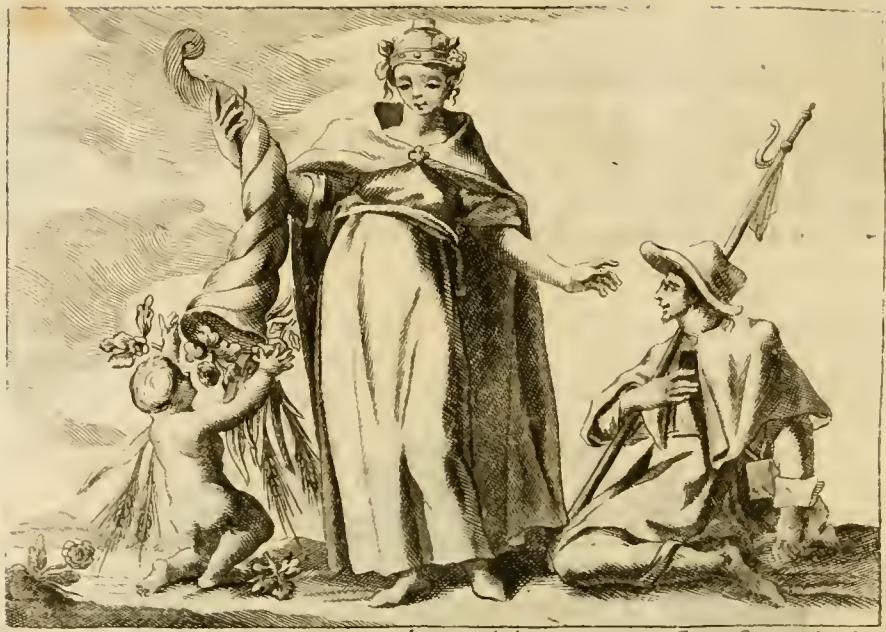

# 환대(Ospitalità) — 리파의 의인상

> **Q.** 리파는 '환대(Ospitalità)'를 어떻게 의인화했는가?

체사레 리파 『이코놀로지아』 제4권, `OSPITALITÀ` 항목(316쪽). 이 카드는 **도상 목록(무엇을 그리는가)** 을 묻는 카드다. 아래에서 지물을 하나씩 원문과 대조하고, 실제 판화에서 그것이 어떻게 나타났는지(그리고 어디서 어긋나는지) 확인한다.

---

## 1. 원문 규정 전문

리파의 도상 지시문은 한 문단으로 되어 있다(초기 인쇄본의 긴 s·합자를 현대 철자로 정리).

> **Una bellissima Donna.** Avrà cinta la fronte da un cerchio di oro tutto contesto di preziosissime gioje, ed i capelli saranno biondi, e ricciuti, con vaga, e bellissima acconciatura. Sarà **di età virile**, con faccia allegra, e ridente. Starà **colle braccia aperte in atto di ricevere altrui**. Colla destra mano terrà **un cornucopia, con dimostrazione di vuotarlo**, il quale sia pieno di spighe di grano, uva, frutti diversi, danari, ed altre cose appartenenti all'uso umano. Sarà **vestita di bianco**, e sopra avrà **un manto di color rosso** […]. Tenga sotto il manto dalla banda destra **un Fanciullo ignudo**, il quale stia in atto colla destra mano di pigliare con ella detti frutti, e dall'altra parte vi sia **un Pellegrino a giacere per terra**.

즉 **아름다운 여인 + 보석 금관테 + 곱슬 금발 + 장년 + 웃는 얼굴 + 벌린 두 팔 + 기울인 풍요의 뿔 + 흰옷 + 붉은 망토 + 벌거벗은 아이(오른쪽) + 순례자(왼쪽)** — 열 하나의 항목이 답의 뼈대다.

> ⚠️ 좌/우는 **인물 자신의 좌우**다. 아이·풍요의 뿔은 인물의 **오른쪽**(그림에서는 왼편), 순례자는 **왼쪽**(그림에서는 오른편)에 놓인다. 판화도 이 배치를 지켰다.

---

## 2. 지물별 대조표

| # | 지물 | 원문 | 판화에서 보이는가 |
|---|---|---|---|
| 1 | 매우 아름다운 여인 | *Una bellissima Donna* | ○ 중앙 정면 입상 |
| 2 | 보석 박힌 금테 | *cerchio di oro… contesto di preziosissime gioje* | △ 이마의 띠가 아니라 **작은 보관(寶冠)** 형태로 머리 위에 얹힘 |
| 3 | 곱슬 금발 | *capelli biondi e ricciuti* | △ 관 아래로 머리단이 보이나 **동판화라 금색은 표현 불가** |
| 4 | 장년의 나이 | *di età virile* | ○ 소녀도 노파도 아닌 성숙한 여인 |
| 5 | 명랑하게 웃는 얼굴 | *faccia allegra, e ridente* | △ 온화하지만 **웃음기는 약하고 시선은 아래(순례자 쪽)** |
| 6 | 벌린 두 팔 | *colle braccia aperte in atto di ricevere altrui* | △ **한 팔만** 순례자를 향해 뻗음. 반대쪽 팔은 뿔에 가려짐 |
| 7 | 기울인 풍요의 뿔 | *cornucopia… con dimostrazione di vuotarlo* | △ 뿔은 크게 있으나 **여인의 오른손이 아니라 아이가 붙들어 세우고** 있음 |
| 8 | 뿔의 내용물 | *spighe di grano, uva, frutti diversi, danari* | △ 밀 이삭·과실·꽃은 보이나 **돈(danari)은 안 보임** |
| 9 | 흰옷 | *vestita di bianco* | ○ 밝게 비워 둔 긴 튜닉 |
| 10 | 붉은 망토 | *un manto di color rosso* | △ 어깨의 **짙은 해칭 망토**(가슴에 장식 잠금). 흑백이라 붉은색은 대비로만 암시 |
| 11 | 벌거벗은 아이 | *sotto il manto dalla banda destra un Fanciullo ignudo… in atto di pigliare detti frutti* | △ 나체 푸토가 **과일을 향해 손을 뻗지만, 망토 아래가 아니라 밖에 서서 뿔을 떠받침** |
| 12 | 순례자 | *un Pellegrino a giacere per terra* | ✗ **누워 있지 않고 무릎 꿇고 있다.** 챙 넓은 순례자 모자, 갈고리 달린 지팡이(bourdon), 호리병(gourd), 짐 보따리 |

(맨발, 그리고 발치의 들꽃·달팽이 같은 세부는 원문에 없는 판각자의 첨가다.)

---

## 3. 지물별 리파의 해설

상징 해석의 자세한 논증은 인접 카드가 따로 다루므로, 여기서는 리파 본인의 문장만 짧게 붙인다.

**(a) 아름다움 전반**
> *Bella si dipinge, perciocché è di suprema bellezza l'opera dell'Ospitalità*
— 환대의 실천 자체가 지고의 아름다움이기 때문에 미인으로 그린다. 요한복음 13장 인용: *Qui accipit quem miserum, me accipit; qui autem me accipit, accipit eum qui me misit* (가련한 자를 받는 이가 나를 받는 것이며, 나를 받는 이는 나를 보내신 이를 받는 것). 아우구스티누스: *Hospitalitatis officio ad Christi cognitionem venimus* (환대의 직분을 통해 그리스도를 알기에 이른다).

**(b) 보석 금테 + 곱슬 금발**
> *significano i magnanimi, e generosi pensieri… la quale ad altro non pensa, se non continuamente di operare per carità*
— 오직 사랑(카리타스)의 실행만 생각하는 **관대하고 고매한 마음**.

**(c) 장년(età virile)**
> *perché il Giovane è dedito al piacere, ed il vecchio all'avarizia; e però essendo la virilità nel mezzo, ove consiste la virtù*
— 청년은 쾌락에, 노인은 인색함에 기울므로, **덕이 자리하는 중간 나이**.

**(d) 웃는 얼굴 + 벌린 팔 + 풍요의 뿔 (한 묶음으로 설명)**
— 손님을 맞는 이는 부족함 없이 대접할 **여유(comodità)** 를 갖추어야 하고, 동시에 **기꺼이 정중하게(officiosamente e volentieri)** 맞아야 한다. 암브로시우스: *Est publica species humanitatis ut peregrinus in hospitio non egeat. Suscipitur officiose, ut pateat advenienti janua* (나그네가 숙소에서 궁하지 않게 하는 것이 인류애의 공적 형상이다. 오는 이에게 문이 열려 있도록 정중히 맞으라). — 이 대목이 **뿔을 "기울여 쏟는" 동작**의 근거다. 그냥 들고만 있는 것이 아니라 비우는 시늉이어야 한다.

**(e) 흰옷**
> *dimostra, che all'Ospite gli conviene di esser puro, e sincero, e senza macchia alcuna d'interesse, ma il tutto fare propter amorem Dei*
— 대접하는 자는 **사심(이해타산)의 얼룩이 없이 순수해야** 하며, 모든 것을 오직 하느님 사랑 때문에 해야 한다.
※ 주의: **붉은 망토에는 리파가 별도의 해설을 붙이지 않는다.** 망토는 색 자체보다 "그 아래에 아이를 품는" 장치로 기능한다.

**(f) 아이 + 순례자**
> *per carità sovviene, ed ajuta alla necessità di quello, che è per se stesso impotente a procacciarsi il vitto… come ancora del Pellegrino essendo fuori della sua Patria, ed in bisogno dell'altrui ajuto*
— **아이**는 스스로 양식을 구할 힘이 없는 자, **순례자**는 고향 밖에서 남의 도움이 필요한 자. 두 부류가 환대의 대상을 대표한다. *Quod uni ex minimis meis fecistis, mihi fecistis* (지극히 작은 자 하나에게 해준 것이 곧 내게 해준 것). 이어서 리파는 **가난한 이를 문전박대하고 필요도 없는 부자만 성대히 대접하는 자들**을 꾸짖는다: *Quidam Pauperes bonos excludunt, magnos autem Raptores, & Divites recipiunt sumptuose.*

---

## 4. 판화가 원문에서 벗어난 지점 (시험 포인트)

1. **순례자**: 원문 *a giacere per terra*(땅에 **누워**) → 판화는 **무릎 꿇은 자세**. 누운 자세는 무력함을, 꿇은 자세는 감사·간청을 읽히게 하므로 의미가 미묘하게 이동한다. 카드 답에서 요구하는 것은 **원문 쪽("누워 있다")** 이다.
2. **풍요의 뿔의 주체**: 원문은 여인이 **오른손으로 들고 기울인다** → 판화는 **아이가 뿔을 떠받치고** 있고 여인의 손은 뿔에 닿아 있지 않다.
3. **아이의 위치**: 원문은 **망토 아래(sotto il manto)** → 판화는 망토 밖.
4. **두 팔**: 원문은 양팔을 벌려 맞이 → 판화는 한 팔만 뻗음(반대쪽은 뿔이 차지).
5. **돈(danari)**: 뿔의 내용물 목록에 있으나 판각에는 나타나지 않는다.
6. **색**: 흰옷/붉은 망토의 대비는 흑백 판화에서 **밝은 튜닉 vs. 짙은 해칭 망토**로 치환되었다.

---

## 5. 딸린 예화 (참고)

- **성경**: 아브라함이 천막 앞에서 세 사람(천사)을 맞아 발을 씻기고 먹인 뒤, 사라의 출산을 약속받음 (창세기 18장).
- **역사**: 코린토스의 **키돈(Cidone)** — 문을 닫는 법이 없어 *Semper aliquis in Cydonis domo*(키돈의 집에는 늘 누군가가 있다)라는 속담이 생김.
- **신화**: 유피테르에게 쫓긴 **사투르누스**를 이탈리아 왕 **야누스**가 숨겨 주자, 사투르누스가 그에게 예지의 능력과 농경술을 선물함.

---

## 6. 암기용 순서

**머리에서 발끝으로, 그다음 좌우**
금테·보석 → 곱슬 금발 → 장년의 웃는 얼굴 → 벌린 두 팔 → (오른손) 쏟아지는 풍요의 뿔 → 흰옷 → 붉은 망토 → 망토 아래 오른쪽에 과일 집는 벌거벗은 아이 → 왼쪽 땅에 누운 순례자.
