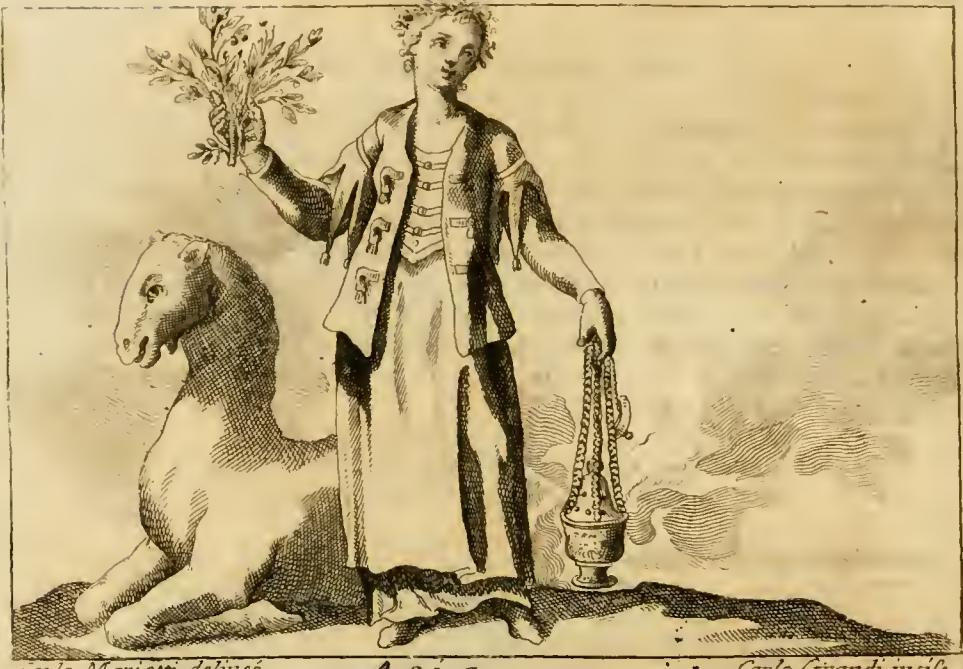

# 아시아(ASIA) 도상 — 향신료 가지와 연기 나는 향로

## 질문
아시아 도상에서 향신료 가지와 향로는 무엇을 뜻하는가?

## 답
- **향신료 가지(오른손)**: 아시아가 향신료의 산지로서, 이를 아낌없이 모든 지역에 나눠준다는 뜻.
- **연기 나는 향로(왼손)**: 아시아의 여러 지방이 생산하는 향기로운 액(液)과 수지(고무진)·향료를 뜻함.
- 특히 **유향(incenso)** 은 그 양이 너무나 풍부해 **온 세계의 제사(sacrificj)에 넉넉할 정도**라고 설명된다.

---

## 1. 판화에서 실제로 보이는 것

원문 `07 The World and the Continents to Death.md`의 ASIA 항목이 참조하는 판화다. 리파가 글로 지시한 지물이 그대로 새겨져 있다.

| 위치 | 관찰되는 요소 | 대응하는 상징 |
|---|---|---|
| 머리 | 꽃과 여러 과실을 엮은 화관 | 아시아의 온화하고 자애로운 하늘(기후)과 그 풍요 |
| 옷 | 단추·장식이 촘촘히 달린 화려한 예복, 귀걸이 | 금·진주·보석의 풍부함 + 그 지역 사람들의 치장 풍습 |
| **오른손(높이 들어 올림)** | **잎과 열매가 달린 잔가지 다발** | **계피(cassia)·후추(pepe)·정향(garofani) — 향신료의 산지** |
| **왼손(아래로 늘어뜨림)** | **사슬에 매달린 잔(盞)형 향로, 오른쪽으로 피어오르는 연기** | **향유·수지·향료, 그중에서도 유향** |
| 왼쪽 아래 | 무릎을 꿇고 엎드린 낙타 | 아시아 고유의 짐승이자 아시아인이 가장 즐겨 쓰는 동물 |

향로에서 나오는 연기가 화면 오른쪽으로 물결치듯 길게 뻗어 나가도록 새긴 것이 핵심이다. 리파의 지시문 자체가 "매우 아름답고 정교한 향로에서 **연기가 넉넉히 피어오르는 것이 보이도록**(dal quale si vegga esalare assai fumo)"이므로, 향로는 그릇이 아니라 **연기**가 주인공이다. 연기 = 눈에 보이지 않는 향(香)의 가시화이자, 아시아에서 세계로 퍼져 나가는 향의 확산 이미지다.

---

## 2. 원문 근거 (Ripa, *Iconologia*, ASIA)

지물 지시 부분:

> "Nella mano destra avrà ramuscelli con foglie, e frutti di **cassia**, di **pepe**, e **garofani**, le cui forme si potranno vedere nel **Mattiolo**. Nella sinistra terrà un bellissimo, e artifizioso **incensiero**, dal quale si vegga esalare assai fumo."
>
> (오른손에는 계피·후추·정향의 잎과 열매가 달린 잔가지를 들며, 그 모양은 **마티올리**에게서 볼 수 있다. 왼손에는 아름답고 정교한 **향로**를 드는데 거기서 연기가 넉넉히 피어오르는 것이 보이게 한다.)

해설 부분 — 이것이 곧 답:

> "Tiene colla destra mano i rami di varj **aromati**; perciò è l'Asia di essi così **feconda**, che **liberamente gli distribuisce a tutte le altre regioni**."
>
> (오른손에 여러 향료의 가지를 든다. 아시아는 이것들이 너무나 **풍요롭게 나므로 다른 모든 지역에 아낌없이 나눠 준다**.)

> "Il **fumante incensiero** dimostra li soavi, e odoriferi **liquori, gomme e spezie**, che producono diverse Provincie dell'Asia."
>
> (**연기 나는 향로**는 아시아의 여러 지방이 산출하는 부드럽고 향기로운 **액·고무진(수지)·향료**를 나타낸다.)

이어 루이지 탄실로(Luigi Tansillo)의 시구 "E spiravan soavi Arabi odori(그리고 부드러운 아라비아의 향기를 뿜었다)"를 인용한 뒤:

> "E particolarmente dell'**incenso** ve n'è in tanta **copia**, che basta abbondantemente per i **sacrificj a tutto il Mondo**."
>
> (특히 **유향**은 그 양이 너무 많아 **온 세계의 제사에 쓰기에 넉넉하다**.)

여기서 `liquori`는 술이 아니라 나무에서 흘러나오는 **향유·수액(balsam류)**, `gomme`는 굳은 **수지(gum resin)** 를 뜻한다. 유향·몰약·발삼이 전형이다.

> 참고: 리파가 "형태는 마티올리에서 보라"고 한 것은 **피에트로 안드레아 마티올리(Pietro Andrea Mattioli)** 의 디오스코리데스 주해서 *Discorsi*(1544~)를 가리킨다. 16세기 화가가 실물을 본 적 없는 후추·정향 가지를 그리려면 이 약초도감의 목판 삽화를 베끼는 것이 유일한 방법이었다. 즉 리파는 화가에게 도상뿐 아니라 **참조할 도판 출처까지** 지정해 준 셈이다.

---

## 3. 왜 하필 이 세 향신료 + 유향인가 (16~17세기 배경)

리파가 이 책을 쓰던 시기(초판 1593, 도판판 1603, 여기 쓰인 것은 18세기 증보판)에 유럽에서 "아시아 = 향(香)"은 은유가 아니라 **경제적 상식**이었다.

### 향신료 가지 = 세계 무역의 최고가 상품
- **후추(pepe)**: 인도 **말라바르 해안**(코친·캘리컷). 1498년 바스쿠 다 가마가 캘리컷에 닿은 이유 그 자체.
- **계피(cassia/cannella)**: **실론(스리랑카)**. 1505년 이후 포르투갈이 장악.
- **정향(garofani)**: **몰루카 제도(향료 제도, Maluku)** — 당시 지구상에서 정향이 나는 사실상 유일한 곳. 1511년 알부케르크가 원정대를 보낸 목표.

세 향신료는 각각 인도양·실론·동남아라는 **서로 다른 아시아 산지**를 대표하며, 한 다발로 묶여 "아시아 전역이 향신료를 낸다"는 뜻이 된다. 16세기 포르투갈 국가 세입의 절반 이상이 서아프리카 금과 인도 후추·향신료에서 나왔고, 그중 향신료 몫이 금을 크게 웃돌았다. "아낌없이 나눠 준다(liberamente distribuisce)"는 표현에는 이 시기 유럽이 아시아 향신료에 얼마나 의존했는지가 반영돼 있다.

### 유향 = 종교적 소비재
- **유향(frankincense)** 은 **Boswellia sacra** (오만 도파르, 예멘 하드라마우트, 소말리아)와 인도의 *Boswellia serrata* 수지다. 리파가 인용한 "아라비아의 향기"는 정확히 이 산지를 가리킨다.
- 기원전 2000년경부터 **유향길(Incense Route)** — 아라비아 남부에서 나바테아를 거쳐 지중해로 — 을 따라 거래되었다.
- 가톨릭 전례에서 향로(thurible)에 태우는 향의 주성분이 유향이다. 벨기에 남부 12~14세기 무덤 출토 향로 잔류물에서 *B. sacra*/*B. serrata* 수지가 검출된 바 있을 만큼, 유럽 교회는 지속적으로 아라비아·인도산 수지를 소비했다.
- 따라서 "온 세계의 제사에 넉넉하다"는 문장은 과장이 아니라, **유럽의 모든 미사가 아시아산 수지에 의존한다**는 당대 현실의 진술이다.

### 두 지물의 역할 분담
| | 향신료 가지 | 연기 나는 향로 |
|---|---|---|
| 감각 | 맛(미각·조리) | 냄새(후각) |
| 형태 | 마른 열매·잎 = **고형 상품** | 액·수지 = **태워서 쓰는 것** |
| 용도 | 세속·일상(식탁·약재) | **성스러움**(제사·전례) |
| 방향성 | 아시아 → 다른 모든 지역으로 **분배** | 아시아 → 하늘로, 세계로 **확산** |

즉 두 손이 아시아 산물의 **세속적 부**와 **종교적 봉헌**을 각각 나눠 들고 있다. 리파 도상 특유의 좌우 대칭 배분이다.

---

## 4. 아시아 항목 전체 구성 속 위치

ASIA 항목의 지물은 다음 다섯 가지이며, 향신료 가지와 향로는 그 중 3·4번이다.

1. **꽃·과실 화관** — 아시아의 하늘이 매우 온화하고 자애로워(Cielo molto temperato e benigno), 생존에 필요한 것뿐 아니라 온갖 향락거리까지 낸다. 벰보(Pietro Bembo)의 시 "향기로운 동방… 온화한 하늘 아래 즐겁고 평온한 백성이 산다"를 인용.
2. **금·진주·보석으로 수놓은 값비싼 의복** — 보석의 풍부함 + 남녀 모두 목걸이·팔찌·귀걸이를 두르는 현지 풍습(요하네스 보에무스 인용).
3. **향신료 가지** — 향신료의 산지, 아낌없는 분배.
4. **연기 나는 향로** — 향유·수지·향료, 특히 유향.
5. **엎드린 낙타** — 아시아 고유의 동물.

이름 "Asia"의 유래는 오케아노스와 테티스의 딸 **님프 아시아**에서 왔으며, 대(大)아시아와 소(小)아시아 모두를 다스렸다고 전한다. 또 아시아는 땅 넓이로는 세계의 절반이지만 코스모그라피아(우주지)의 구획으로는 세계의 3분의 1이라고 리파는 덧붙인다.

같은 항목 뒤에는 고대 메달에 근거한 다른 아시아 도상 두 가지도 소개된다 — 창 세 자루를 든 여인(하드리아누스 메달), 그리고 오른손에 뱀·왼손에 키(舵)를 들고 발밑에 뱃머리(Prora)와 "ASIA"라는 글자가 있는 여인.

---

## 5. 암기 포인트

- **가지 = 준다 / 향로 = 낸다**: 가지는 "distribuisce(나눠 준다)", 향로는 "dimostra…che producono(생산하는 것을 보여준다)".
- 가지의 세 품목 = **계피·후추·정향** (cassia, pepe, garofani) → 실론·말라바르·몰루카.
- 향로가 가리키는 것 = **액(liquori)·수지(gomme)·향료(spezie)**, 대표는 **유향**.
- 유향의 수식어 = **"온 세계의 제사에 넉넉할 만큼"**.

---

### 출처
- 원문: `.fm/assets/07 The World and the Continents to Death.md` — "ASIA" 항목
- 판화: `.fm/assets/Iconologia (Cesare Ripa)/_page_169_Picture_3.jpeg`
- [Frankincense · Encyclopedia of Smell History and Heritage](https://encyclopedia.odeuropa.eu/items/show/9)
- [Holy Smoke in Medieval Funerary Rites: Chemical Fingerprints of Frankincense (PMC)](https://www.ncbi.nlm.nih.gov/pmc/articles/PMC4229304/)
- [The Spice Trade & the Age of Exploration — World History Encyclopedia](https://www.worldhistory.org/article/1777/the-spice-trade--the-age-of-exploration/)
- [Spice trade — Britannica](https://www.britannica.com/money/spice-trade)
- [A history of The Spice Islands — Seasoned Pioneers](https://www.seasonedpioneers.com/a-history-of-the-spice-islands/)
