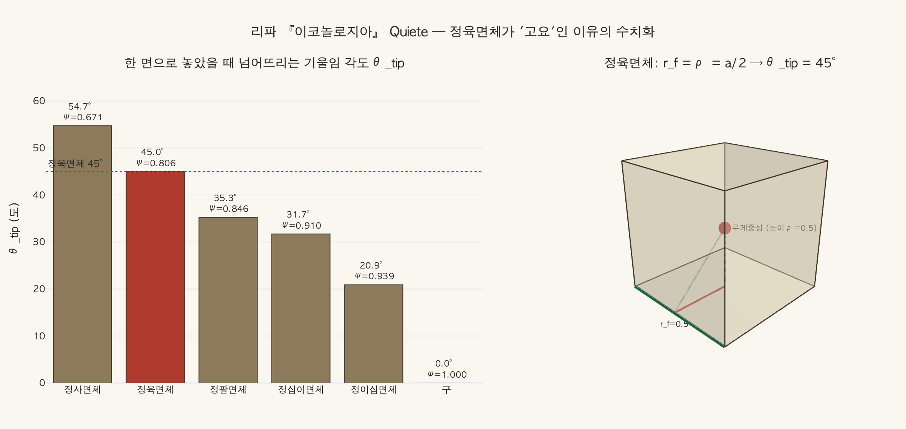

# 고요(Quiete) — 정육면체 받침대와 다림추

## 질문

리파는 '고요(Quiete)'를 어떻게 의인화했는가?

## 답

**정육면체 받침대 위에 서서 오른손에 다림추를 받쳐 든 여인**이다. 티마이오스-플라톤에 따라 정육면체는 우주의 중심인 대지처럼 어느 면으로나 고르게 놓여 움직이기 어려운 도형이라 고요와 안식을 뜻한다.

---

## 1. 원문 (『이코놀로지아』 제4권, Quiete 항목)

리파의 첫 번째 Quiete 처방은 두 줄뿐이다.

> **Donna, che sia in piedi sopra una base di figura cubica. Colla mano destra sostenga un perpendicolo.**
> (정육면체 형태의 받침 위에 서 있는 여인. 오른손으로 다림추를 받쳐 들고 있다.)

곧이어 두 지물의 근거를 각각 해설한다.

### (1) 정육면체 받침 (base di figura cubica)

> "정육면체는, 피타고라스의 제자 **티마이오스 로크렌시스(Timeo Locrense)** 의 견해에 따라 플라톤이 전하는 바 — 그(티마이오스)는 자기 학설의 많은 부분을 이집트인들로부터 배웠다 — **대지(la terra)** 를 뜻한다. 대지는 어렵게 움직이는데, 이는 **우주의 중심(il centro dell'Universo)** 인 자기 고유의 자리에 있어 조용히 쉬고 있기 때문이며, 그 고요(quiete) 때문에 그렇게 드러난다. 이 성질이 무엇보다 직접적으로 나타나므로, **정육면체(Cubo)는 고요와 안식(quiete e riposo)을 뜻한다**고 정당하게 말할 수 있다. **어느 면(nodi)으로나 고르게 놓이고(stando egualmente posato in tutt'i nodi) 힘겹게 움직이기 때문이다.**"

여기서 논증의 사슬은 세 단계다.

1. **정육면체 = 흙/대지** (플라톤 『티마이오스』의 원소-정다면체 대응)
2. **대지 = 우주의 중심** (지구중심 우주론) → 자기 자연적 장소에 이미 있으므로 움직일 이유가 없다
3. **정육면체 자체의 기하** — 여섯 면이 모두 같아 어떻게 놓아도 동등하게 안정하다

즉 리파는 (a) 상징적 대응, (b) 우주론, (c) 순수 기하 세 층을 한꺼번에 겹쳐 쓴다. 카드의 답이 "우주의 중심인 대지처럼 / 어느 면으로나 고르게 놓여"라는 두 구절을 함께 담고 있는 이유다.

### (2) 다림추 (perpendicolo)

> "다림추는 모든 것의 고요와 안식이 그것들의 **목적이자 완성(il fine, e la perfezione)** 임을 보여준다. (…) 다림추는 무겁고(grave) 자기 자연적 장소 밖에 있으므로 곧게 매달려, 자연히 움직여 상상된 지평의 한 점에 이르려 한다 — 거기가 그것의 고요다."

다림추(plumb bob, 실에 매달린 추)는 아리스토텔레스 자연운동론의 도상이다. 무거운 것은 자기 장소(= 우주 중심 = 대지)를 향해 직선으로 내려가고, 도달하면 멈춘다. 즉 **정육면체는 운동의 목표점(정지)** 이고 **다림추는 그 목표를 향한 운동**이다. 두 지물은 한 논증의 결론과 과정으로 짝을 이룬다.

리파는 이어서 냉정하게 유보를 단다. 이 세상에서 **참된 고요는 불가능**하다 — 합성물이 아닌 단순 원소들조차 끊임없이 생성·소멸하고, 부패하지 않는 천체들에서도 영구 운동이 보이므로, 우리는 고요를 감각으로 확인할 수 없고 **지성으로 상상할 뿐**이다. 인간에게 고요란 생각과 행동의 운동이 올바르게 정렬되어 참된 안식처(내세, "l'altra vita apparecchiata a' Beati")로 향할 때 성립한다.

### (3) 두 번째 Quiete 처방 — 검은 옷과 황새

리파는 같은 항목에 **두 번째 변형**을 덧붙인다 (카드의 답이 다루는 것은 첫 번째 처방이지만, 구분해 두면 혼동을 피할 수 있다).

> "무겁고 존경스러운 용모의 여인. 검은 옷을 입고 종교의 표지를 지닌다. 머리 장식 위에 둥지가 있고, 그 안에 늙어 털이 다 빠진 **황새(Cicogna)** 가 쉬고 있으며 자식들의 효심(pietà)으로 부양받는다."

- **검은 옷**: 생각의 확고함과 마음의 고요. 검정은 다른 색을 받아들이지 않는 색이기 때문. 동시에 자기 고요만 챙기는 사람은 세상에 대해 "어둡다(oscuro)" — 이웃에게 유익한 일로 이름을 내지 못한다.
- **황새**: 노년에야 얻을 수 있는 그 적은 고요. 지상의 것들에 지치고 물린 뒤에야 하늘의 영구한 것을 더 뜨겁게 바란다. (황새의 새끼가 늙은 어미를 먹인다는 '효(pietas)' 전설)
- 리파는 여기서 **은둔에 대한 도덕적 경고**까지 한다. 통속적 의미의 '고요'(중요한 일에서 물러나 근심 없이 사는 것)는 사실 남을 버리고 자기만 챙기는 것이며, 정치적 삶에서는 매우 비난할 만하다. **종교** 때문일 때만 다른 모든 이해를 제쳐둘 자격이 있다.

---

## 2. 플라톤 『티마이오스』의 다섯 정다면체-원소 대응

리파가 근거로 든 텍스트는 『티마이오스』 53c–56c다.

| 정다면체 | 면 (모양·개수) | 배당 | 플라톤의 논거 |
|---|---|---|---|
| 정사면체 (tetrahedron) | 정삼각형 4 | **불 (πῦρ)** | 면·꼭짓점이 가장 적어 각이 가장 **날카로움**. 가장 잘 움직이고 다른 것을 자르고 파고든다 |
| 정팔면체 (octahedron) | 정삼각형 8 | **공기 (ἀήρ)** | 중간 크기, 중간 운동성 |
| 정이십면체 (icosahedron) | 정삼각형 20 | **물 (ὕδωρ)** | 가장 크고 가장 둥글어 잘 흐르고 굴러간다 |
| 정육면체 (cube) | **정사각형 6** | **흙 (γῆ)** | 55d–e 참조 ↓ |
| 정십이면체 (dodecahedron) | 정오각형 12 | **우주 전체 / 아이테르** | 남은 다섯 번째를 우주의 짜임에 배당 (55c). 12면 = 황도 12궁과의 대응으로 후대에 읽혔다 |

### '흙이 가장 안정적'이라는 핵심 논거 (55d–e)

> "**흙에는 정육면체 형태를 주자.** 네 종류 가운데 **흙이 가장 움직이기 어렵고(ἀκινητοτάτη)** 가장 잘 빚어지는(εὐπλαστοτάτη) 물체이며, 그런 성질을 가지려면 **필연적으로 가장 안정된 바닥면(βάσεις ἀσφαλεστάτας)** 을 지닌 것이어야 하기 때문이다."

논거의 구조는 이렇다.

- 정삼각형에서 만들어지는 세 입체(정사면체·정팔면체·정이십면체)는 서로 변환 가능하지만, **정사각형에서 만들어지는 정육면체는 그들과 상호 변환되지 않는다** → 흙은 다른 세 원소로 바뀌지 않는 가장 '고집스러운' 원소다.
- 정육면체 면의 **직각(right angle)** 이 '자연적 안정성'을 준다. 뾰족한 각은 찌르고 자르는 능동성이지만, 직각은 버티는 수동성이다.
- 따라서 **정육면체 = 흙 = 부동(不動) = 고요**의 연쇄가 성립한다.

리파는 이 플라톤 대목을 **티마이오스 로크렌시스**의 저작을 통해 인용한다. 르네상스에는 위작 『자연과 세계 영혼에 관하여(De natura mundi et animae)』가 진짜 피타고라스 학파 티마이오스의 저술이며 플라톤이 그것을 베꼈다고 믿었기 때문에, 리파의 "플라톤이 티마이오스 로크렌시스의 견해에 따라 전하는 바"라는 어법이 나온다. 이집트 유래설("자기 학설을 대부분 이집트인들로부터 배웠다")도 같은 계열의 르네상스 통념이다.

---

## 3. 정육면체 = 부동·불변의 도상 전통

리파의 정육면체 받침은 그가 발명한 것이 아니라, 유럽 도상학의 **오래된 상투구(topos)** 를 문헌화한 것이다.

### (1) 포르투나의 천구 대(對) 덕의 정육면체

가장 널리 쓰인 대구다.

- **포르투나(Fortuna, 운명)** 는 **구(球)/공** 위에 서거나 바퀴를 돌린다. 구는 어느 방향으로도 굴러가므로 운명의 예측불가·변덕을 뜻한다. (예: 핀투리키오의 시에나 대성당 바닥 도안, 1504–05 — 부러진 돛의 배 위 불안정한 포르투나가 구 위에 서서 '덕의 길'을 등지고 있다)
- **덕(Virtus)/불변(Constantia)** 은 **정육면체(cubo)** 또는 네모난 좌석(sedes quadrata) 위에 **앉는다**. 앉아 있음 자체가 이미 안정의 몸짓이다.

라틴 격언 *"Fortuna in globo, Virtus in cubo sedet"* (운명은 구 위에, 덕은 정육면체 위에 앉는다) 계열의 구절로 요약된다.

### (2) 아리스토텔레스의 '네모난 사람'

『니코마코스 윤리학』 1100b21의 **ἀνὴρ τετράγωνος (tetragōnos anēr, 네모난 사람)** — 어떤 운명의 타격에도 형태가 무너지지 않는 사람. 시모니데스에게서 온 이 표현이 라틴 세계에서 *quadratus vir*, 이탈리아어 *uomo quadrato* 로 번역되며 "정육면체적 인간 = 흔들리지 않는 인간"의 관용구가 되었다.

### (3) 건축·조형의 관습

- **입방체 대좌(plinth)**: 흔들리지 않아야 하는 상(像)의 받침은 정육면체. 리파의 여인이 정육면체 위에 **선다(in piedi)** 는 것은 곧 그 여인 자체가 기념비적 부동성을 얻었다는 뜻이다.
- **주춧돌(lapis quadratus)**: 성서적으로도 네모난 다듬돌은 견고한 토대의 상징.
- **뒤러 『멜렌콜리아 I』(1514)** 의 거대한 다면체 — 원래의 정육면체를 잘라낸(truncated) 형태로 읽히며, 정육면체적 안정을 잃어버린 상태의 도상으로 해석되는 대표적 사례다.

### (4) 리파 자신의 내부 대조

『이코놀로지아』 안에서도 같은 어휘가 반복된다. **Fermezza(견고), Costanza(불변), Stabilità(안정)** 계열의 의인상은 기둥·정육면체·닻 같은 '움직이지 않는 것'을 지물로 삼고, **Fortuna·Incostanza·Instabilità** 는 구·바퀴·돛·달을 지물로 삼는다. Quiete의 정육면체는 이 체계의 한 항이다.

---

## 4. 판화 이미지

**이 항목(Quiete)에는 판화가 실려 있지 않다.** 확인 내용:

- 원본 소스 `18 Prudence to Quiet.md` 의 Quiete 항목(제4권 440–441쪽, 문서 287–305행) 앞뒤 어디에도 이미지 참조가 없다.
- 바로 앞 항목 Querela a Dio 에 딸린 `_page_447_Picture_3.jpeg` 는 **장식 이니셜 'D'** (본문 "Donna…"의 첫 글자를 감싼 당초문 장식 블록)일 뿐 의인상 판화가 아니다.
- Quiete 가 인쇄된 448쪽에 대응하는 이미지 파일이 asset 폴더에 존재하지 않으며, 다음 이미지 `_page_449_Picture_0.jpeg` 는 「제4권 끝(FINE DEL QUARTO TOMO)」 뒤의 **백지/여백 스캔**이다.

즉 리파는 이 항목을 **문자 처방만으로** 남겼다. 판본에 따라 삽화가 없는 항목이 상당수 있으며, Quiete 는 그중 하나다. 따라서 이 카드는 **텍스트 처방을 머릿속에서 그려내야 하는 항목**이다. 재구성하면 다음과 같다.

- **정육면체 받침대** — 여인이 그 위에 **서 있다**(앉지 않는다). 정육면체는 어느 면을 바닥으로 해도 같은 높이·같은 안정성을 준다.
- **오른손의 다림추** — 실에 매달려 **수직으로 정지**한 상태. 정지의 방향(수직)과 정지의 목표(지평의 한 점)를 동시에 보여준다.
- 두 지물은 **수직축 하나**로 정렬된다. 다림추의 실 → 여인의 몸 → 정육면체의 중심 → 대지의 중심. 리파 도상의 기하학적 요점이 바로 이 일직선이다.

---

## 5. 암기 포인트

| 요소 | 내용 | 뜻 |
|---|---|---|
| 자세 | 정육면체 받침 위에 **서 있다** | 부동·안정 |
| 오른손 | **다림추(perpendicolo)** | 운동의 목적은 정지 / 무거운 것은 자기 자리로 |
| 전거 | **플라톤 『티마이오스』** (티마이오스 로크렌시스 경유) | 정육면체 = 흙 |
| 우주론 | 대지 = **우주의 중심** = 자기 고유의 자리 | 움직일 이유 없음 |
| 기하 논거 | **어느 면으로나 고르게 놓인다** | 등방적 안정 |
| 유보 | 이 세상에 참된 고요는 없다 | 고요는 지성으로만 상상됨 |
| 제2 처방 | 검은 옷 + 종교의 표지 + 둥지의 늙은 황새 | 노년의 고요 / 은둔에 대한 경고 |

---

## 시각화

`expy.py` 는 리파의 논지 "어느 면으로나 고르게 놓여 움직이기 어렵다"를 수치로 검증한다. 다섯 정다면체와 구에 대해 **한 면으로 놓았을 때 무게중심이 접촉면 경계를 벗어나는 기울임 각도** $\theta_{\text{tip}} = \arctan(r_f/\rho)$ 를 계산한 결과다.

| | 정사면체(불) | **정육면체(흙)** | 정팔면체(공기) | 정십이면체(우주) | 정이십면체(물) | 구 |
|---|---|---|---|---|---|---|
| 구형도 Ψ | 0.671 | **0.806** | 0.846 | 0.910 | 0.939 | 1.000 |
| θ_tip | 54.7° | **45.0°** | 35.3° | 31.7° | 20.9° | **0°** |

읽어낼 세 가지:

1. **구형도와 기울임 각도는 완벽한 역상관**이다. 둥글어질수록 고요를 잃는다. 물(정이십면체)은 20.9°면 넘어가고, 구는 0° — 즉 포르투나의 천구는 어떤 미세한 힘에도 굴러간다. 정육면체(45°)는 물보다 2배 이상 넘어뜨리기 어렵고, 필요한 일로 보면 5배 차이다. **"포르투나는 구 위에, 덕은 정육면체 위에"** 라는 도상 전통이 정확히 이 0° 대 45°의 대비다.
2. **다만 정사면체가 54.7°로 1위**다. 무게중심이 밑면 대비 매우 낮게 깔리기 때문이다. 플라톤이 그것을 흙이 아니라 **불**에 준 것은 논거가 '안정성'이 아니라 **날카로움**(면이 가장 적음 → 입체각이 가장 뾰족함)이었기 때문이다.
3. 그래서 **정육면체의 진짜 특권은 등방성**이다. 정육면체만이 $r_f = \rho = a/2$ 인 유일한 정다면체 — **받침 반폭과 무게중심 높이가 같다**. 직교 세 축이 모두 같으므로 어떤 면을 바닥으로 골라도 완전히 동일하며(정사면체는 밑면과 마주보는 것이 '점'이라 위아래가 다르다), 정다면체 중 **혼자서 공간을 빈틈없이 채우는 유일한 입체**여서 "우주의 중심을 메우는 대지"라는 리파의 이미지에 그대로 대응한다. 리파의 *"stando egualmente posato in tutt'i nodi"* 는 '가장 안 넘어짐'이 아니라 **어떻게 놓아도 똑같이 안정함**을 가리킨다.

