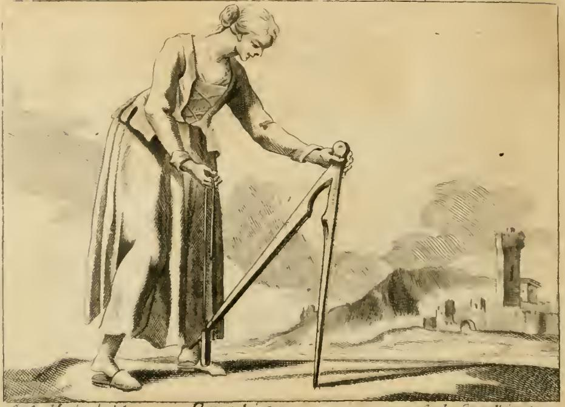
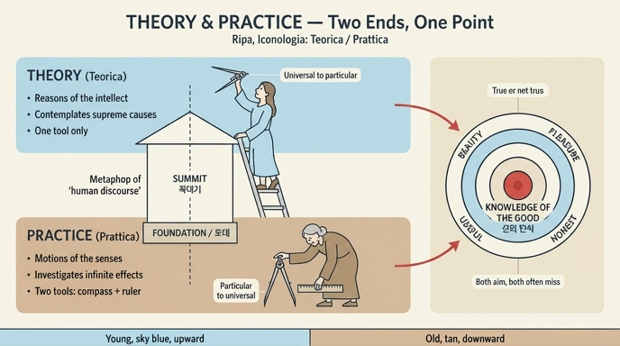

# 이론(Teorica)과 실천(Prattica)의 관계

**Q. 이론과 실천의 관계는 어떻게 정의되는가?**

**A.** 이론이 지성의 근거와 운동을 다루며 최고 원인들을 관조한다면, 실천은 감각의 작용과 운동을 다루며 무한한 결과들을 탐구한다. 하나는 인간 담론이라는 건물의 꼭대기, 하나는 그 토대이며, 둘은 '참이냐 아니냐, 아름다움·즐거움·유익·정직'이라는 선의 인식이라는 한 점에서 만난다.

출처: 리파 『Iconologia』 제4권 「PRATTICA(실천)」 항목, 풀비오 마리오텔리(Fulvio Mariottelli) 집필. 카드 문장은 이 항목의 첫 단락을 압축한 것이다.

---

## 1. 원문이 세운 정의 구조

마리오텔리는 '실천'이라는 말이 그리스인들의 **경험(ἐμπειρία 계열의 말)**에 해당하며, 본질적으로 **관계적이고 이론에 대립하는(cosa relativa, ed opposta alla Teorica)** 개념이라고 시작한다. 즉 실천은 홀로 정의되지 않고 언제나 이론과의 짝으로만 정의된다.

원문의 대구를 그대로 표로 옮기면 다음과 같다.

| 항목 | Teorica (이론) | Prattica (실천) |
|---|---|---|
| 무엇을 둘러싸고 도는가 | 지성의 **근거와 운동**(le ragioni, e i moti dell'intelletto) | 감각의 **작용과 운동**(le operazioni, e i moti del senso) |
| 어떤 '쉼'을 바라보는가 | **관조적 쉼**(quiete contemplativa) = 영혼의 운동 | **활동적 쉼**(quiete attiva) = 주로 감각의 운동 |
| 대상 | **최고 원인들을 관조**(contemplativa delle cause supreme) | **무한한 결과들을 탐구**(investigativa degli infiniti effetti) |
| 건축 비유 | 인간 담론이라는 건물의 **꼭대기**(sommità) | 그 **토대**(fondamento) |

여기서 주의할 점 두 가지.

- **둘 다 '운동'이다.** 이론은 정지, 실천은 활동이 아니다. 이론도 운동이지만 그 운동의 주체가 지성(영혼)이고, 실천의 운동은 감각이다. 그래서 원문은 양쪽 모두에 '쉼(quiete)'을 주고 관조적 쉼 / 활동적 쉼으로 나눈다.
- **원인 대 결과의 방향 차이.** 이론은 위로 올라가 최고 원인들(cause supreme)을 본다. 실천은 아래로 퍼지는 무한한 결과들(infiniti effetti)을 뒤진다. 원인은 소수이고 위에 있으므로 꼭대기, 결과는 무한하고 아래에 깔려 있으므로 토대다.

## 2. 두 극단이 만나는 '한 점' — 선(善)의 인식

이론과 실천은 **두 개의 극단(due estremità)**이지만, 하나의 중간·단 하나의 점에서 결합한다. 그 점이 **선의 인식(la cognizione del bene)**이다. 원문은 그 점을 다음 두 축으로 풀어 놓는다.

1. **참이냐 참이 아니냐(vero, o non vero), 더 크냐 작냐(maggiore o minore)** — 판단의 진리값과 정도
2. 그 판단이 취하는 **형식(sotto forma di)**: **아름다움(bello) · 즐거움(gusto) · 유익(utile) · 정직(onesto)**

즉 "이것이 좋은가?"라는 물음은 아름다운가, 즐거운가, 이로운가, 정직한가라는 네 가지 얼굴로 나타나고, 이론가와 실천가는 서로 다른 길로 올라와 같은 표적을 겨눈다.

그런데 원문은 곧바로 냉정한 단서를 붙인다. **"이 점은 양쪽 모두에게 언제나 잘 겨냥되지는 않는다(non è sempre ben colto di mira da ambedue)"**, 그리고 서로가 서로를 **곁눈질하며 조준한다**. 여기서 사람들 사이의 의견 대립이 나온다 — 학자와 무식자, 귀족과 평민, 종과 자유인, 부자와 빈자, 노인과 젊은이, 남자와 여자. 한쪽은 **현자들의 명제(sentenze de' sapienti)**를, 다른 쪽은 **민중의 속담(proverbi del volgo)**을 믿는다. 선의 인식이라는 표적은 공유되지만 조준선은 갈린다는 것이 이 항목의 냉소적인 결론부다.

## 3. 실천이 얻을 수 있는 것과 얻을 수 없는 것

실천은 "거의 겪은 것(quasi prattica)"이라 불릴 만큼 **모든 사람에게 공통**이다. 이성적 삶에는 필연적으로 운동이 있고, 그 운동 속에서 누구나 어떤 **습관(abito)**을 얻으며, 반복된 경험으로 만들어진 이 습관이 곧 실천이다.

따라서 실천으로는 **기술(arte)과 프루덴차(prudenza)**를 얻을 수 있지만, **지혜(sapienza)와 지성(intelletto)**은 얻을 수 없다. 후자는 **원리들의 인식(cognizione de' principi)**에 있기 때문이다. (아리스토텔레스 『니코마코스 윤리학』 6권의 지적 덕 구분과 같은 골격이다.)

## 4. 도상 — 왜 실천은 늙고 굽었는가

이론과 실천이 서로 대립하는 것이므로, 도상 역시 **서로 대립하는 사물들로** 표현된다. 원문이 나란히 제시하는 두 인격화는 다음과 같다.

| | Teorica (이론) | Prattica (실천) |
|---|---|---|
| 나이 | 젊은 여자 | **늙은 여자** |
| 옷 | 고귀하게, 하늘색(celeste) | 종처럼 비천하게, 황갈색(tanè) |
| 머리와 손 | 위로 | **아래, 땅을 향해** |
| 컴퍼스 | 뾰족한 끝을 **하늘로** | 크게 벌려 한쪽 끝을 **땅에 박고** |
| 자리 | **사다리 꼭대기** | 땅 위 |
| 도구 수 | **하나** | **둘** (컴퍼스 + 자[regolo]) |

판화에서 실제로 확인되는 것들:

- **허리를 굽히고 얼굴을 아래로 돌린 노파.** 원문 해설대로 얼굴이 아래를 향한 것은 실천이 "온 우주 가운데 발로 밟히는 그 부분만을 낮게 바라본다"는 뜻이고, 비천한 색의 옷도 같은 뜻이다.
- **크게 벌려 땅에 꽂은 큰 컴퍼스.** 컴퍼스는 **이성(la ragione)**이다. 이론은 그 끝을 위로 두어 **보편에서 개별을 도출**하니 참된 논증적 결론이다. 실천은 끝을 아래로 두어 **개별에서 보편으로** 가니(주로 삼단논법 2·3격) **오류를 낳는 결론**이다. 땅이 하늘에 대해 개별인 것과 같다.
- **왼손이 짚은 곧은 막대(regolo, 자).** 컴퍼스의 한쪽 끝이 자의 윗머리에 직각으로 닿아, 둘이 함께 그리스 문자 **Π(파이)** 모양을 이룬다 — 그리스인들이 Prattica를 표시하던 글자다. 자가 뜻하는 바: 이론은 영원하고 늘 한결같은 하늘의 것들로 규제되지만, 실천은 변하고 부패하는 지상의 것들에 토대를 두므로, 인간이 어떤 형식으로 **고정해 주어야** 한다. 그렇게 보편적으로 받아들여져 통용되는 형식을 흔히 '자(regolo)'라 부른다. 원문은 여기서 **프로타고라스의 "인간은 만물의 척도"**를 끌어온다.
- **두 도구에 온몸의 무게를 실은 자세.** 두 손이 컴퍼스와 자 위에서 머리와 몸 전체의 무게를 받치고 있다 — 실천은 인식에서 쉬는 것이 아니라 **쓰임과 유익(uso e utile)** 위에 서 있다는 뜻이다.

**도구가 둘인 까닭**: 이론은 완전하여 하나로 나뉘지 않지만, 실천은 **자유(liberale)**와 **기계(mecanica)** 두 종류다. 땅에 고정된 컴퍼스 = 자유 실천(대화와 시민 생활에서의 쓰임, 도덕적 덕, 정해진 비율 없이 사물의 양에 맞추는 것 — 도덕적 덕의 기준도 오래된 관습과 용례뿐). 정해진 치수를 가진 자 = 기계 실천(공적 합의로 확정된 치수, 그래서 돈과 물건의 정해진 양으로 사고파는 일). 나아가 이 둘은 **분배적 정의(기하학적, 확정 치수 없는 컴퍼스)**와 **교환적 정의(산술적, 치수가 있는 자)**도 나타낸다.

또한 젊음/늙음의 대비는 그대로 가치 대비다. 젊음 = 민첩·신속·부지런함·용기·장수·희망·사랑, 늙음 = 느림·졸음·게으름·나약·비천·단명·죽음·두려움·증오·의심. 그래서 실천은 낡은 관습을 따르고, 쉽게 속고, 원인에 대해서는 거의 보지 못하고, 자주 의심하고 걸려 넘어지며, **자기 방식과 다른 방식으로 알려 하는 자를 매섭게 미워한다**.

## 5. 암기 훅

- **위/아래**: 이론=지성·최고 원인·꼭대기·하늘색·사다리 위. 실천=감각·무한한 결과·토대·황갈색·땅.
- **컴퍼스 방향 하나로 논리까지**: 끝이 하늘로 = 보편→개별(참). 끝이 땅으로 = 개별→보편(오류).
- **만나는 한 점**: 선의 인식 = "참/거짓 · 크고 작음"을 **아름다움·즐거움·유익·정직**의 형식으로 재는 표적. 둘 다 이 표적을 겨누지만 늘 잘 맞히지는 못한다.
- **1 대 2**: 이론은 도구 하나(불가분), 실천은 둘(자유 = 컴퍼스, 기계 = 자) → Π.

## 인포그래픽

